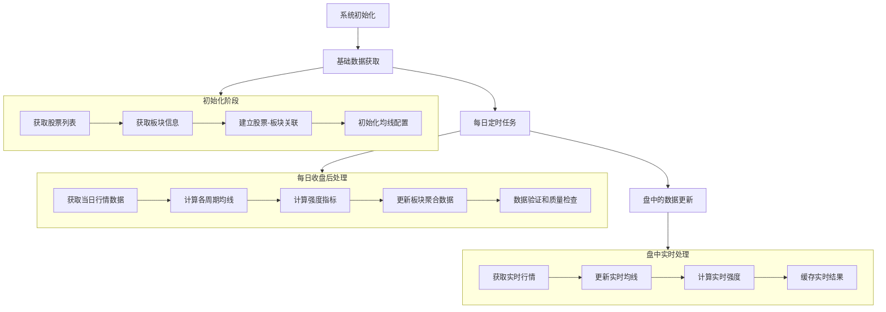

# 02. 数据处理流程文档

## 📋 概述
本文档描述系统的数据处理流程和策略。

## 🔄 整体数据处理流水线

## 📋 详细处理阶段

### 阶段一：系统初始化
1. **连接数据库** - 建立PostgreSQL连接池
2. **加载配置** - 读取均线周期配置和权重设置
3. **检查数据状态** - 验证现有数据完整性

### 阶段二：基础数据获取
1. **股票列表获取** - 通过AkShare获取所有A股基本信息
2. **板块信息获取** - 获取行业板块和概念板块数据
3. **关联关系建立** - 建立股票与板块的映射关系
4. **历史数据回填** - 首次运行时获取历史数据

### 阶段三：每日批处理（收盘后）
1. **行情数据获取** - 获取当日所有股票收盘数据
2. **均线计算** - 计算各配置周期的移动平均线
   - 股票级别均线计算
   - 板块级别均线聚合
3. **强度指标计算** - 基于价格与均线位置关系
   - 单个股票强度评分
   - 板块综合强度计算
4. **数据存储** - 将计算结果持久化到数据库
5. **数据验证** - 检查数据质量和一致性

### 阶段四：盘中实时处理
1. **定时数据拉取** - 每30分钟获取最新行情
2. **实时均线更新** - 更新最新价格的均线值
3. **强度重计算** - 重新计算实时强度指标
4. **结果缓存** - 缓存实时数据供前端查询

## ⚡ 处理频率策略

- **初始化阶段**: 仅首次运行或手动触发
- **每日批处理**: 交易日15:30自动执行
- **盘中更新**: 交易时间每30分钟执行
- **数据验证**: 每日处理完成后执行

## 🛡️ 容错机制

- **重试策略**: 失败操作自动重试3次
- **数据回滚**: 处理失败时回滚事务
- **日志监控**: 详细记录处理状态和错误
- **报警通知**: 关键错误发送通知

## 🔧 技术栈

- **数据获取**: AkShare Python库
- **数据处理**: Pandas + NumPy
- **任务调度**: APScheduler
- **数据存储**: PostgreSQL + SQLAlchemy
- **缓存**: 内存缓存（后期可扩展Redis）

---
*文档版本: 1.0*
*最后更新: 2024-01-20*