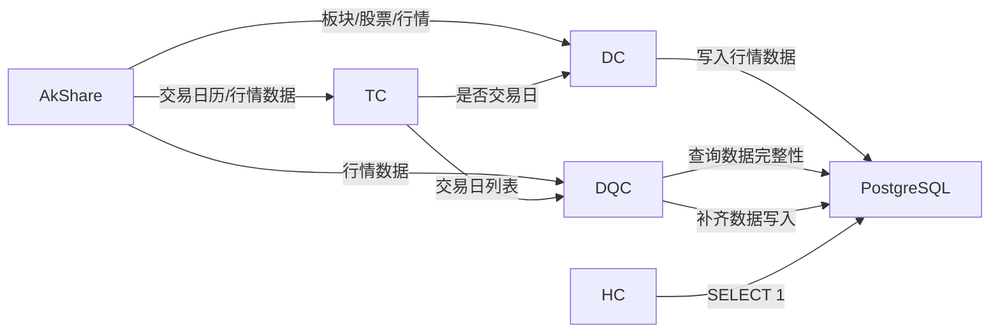

# 架构设计文档：自动数据质检与每日拉取补全

_本文件只保留当前版本真正影响实现的架构决策、边界和契约；DDL、目录树、环境变量、实施故事等内容默认不放入正文。_

## 1. 系统摘要

在现有板块强弱指标系统基础上，补全"**拉取 → 落库 → 质检 → 补齐**"自动化闭环。核心改造：引入真实交易日历替代硬编码判断、补全每日数据更新的数据库写入、实现数据完整性检测与自动补齐逻辑（检查最新数据完整性，发现缺失或日期缺口则自动补齐）、支持手动触发质检。改造完成后，交易日收盘后自动更新数据，质检定时发现缺失时自动补齐，管理员可手动触发质检。

## 2. 范围、非目标与成功标准

### 2.1 范围

1. 真实交易日历集成（从 AkShare 获取，含节假日调休）
2. 每日数据更新落库（板块同步、股票同步、全量行情拉取与保存）
3. 数据完整性检测与自动补齐（检查最新交易日数据完整性，发现缺失则自动补齐最新日期+1至当日所有交易日的数据）
4. 数据库健康检查端点实现真实连接验证
5. 质检支持手动触发

### 2.2 明确不做

- 外部告警通道（邮件、短信、Webhook）— 留待后续独立需求
- 历史数据全量一致性审计 — 本期只检查最新交易日
- 前端管理界面改造 — 现有管理 API 返回真实数据即可
- 数据源故障自动降级（切换备用数据源）
- 交易日历离线缓存和手动维护机制

### 2.3 成功标准

| 指标 | 目标 |
|------|------|
| 每日更新全流程 | 交易日自动完成板块→股票→行情→计算，数据正常入库，无异常 |
| 非交易日跳过 | 周末/节假日正确跳过，调休日正常执行 |
| 数据完整性检测与补齐 | 检查最新交易日数据完整性，发现缺失则自动补齐最新日期+1至当日所有交易日数据 |
| 健康检查 | 真实反映数据库连接状态 |
| 手动触发质检 | 通过 API 手动触发质检并返回结果 |

### 2.4 验收标准承接矩阵

| AC-ID | PRD 原文摘要 | 承接模块 | 关键链路 / 状态 | 风险 / 降级说明 |
|-------|-------------|---------|----------------|----------------|
| AC-01 | 交易日自动更新完整执行 | DataCollector + TradingCalendar | 链路 6.1 | 依赖 AkShare 数据源可用 |
| AC-02 | 非交易日自动跳过 | TradingCalendar | 链路 6.1 分支 | AkShare 日历不可用时降级为简单周末判断 |
| AC-03 | 调休工作日正常执行 | TradingCalendar | 链路 6.1 | 同 AC-02 降级策略 |
| AC-04 | 质检发现缺失并自动补齐 | DataQualityChecker | 链路 6.2 | 无 |
| AC-05 | 健康检查真实反映状态 | HealthCheck 端点 | 链路 6.3 | 需修复现有 TODO 空实现 |
| AC-06 | 数据源失败后可恢复 | AsyncTask 重试机制 | 链路 6.1 异常分支 | 最多 3 次重试，指数退避 |
| AC-07 | 手动触发质检 | DataQualityChecker + API | 链路 6.2 | 无 |

## 3. 用户流程与状态

### 3.1 主流程

1. 每个 A 股交易日收盘后（15:30），APScheduler 触发每日更新任务
2. TradingCalendar 判断当日是否交易日，非交易日跳过并记录原因
3. DataCollector 依次执行：板块列表同步 → 股票列表同步 → 行情数据拉取保存 → 均线计算 → 强度计算 → 缓存清除
4. 每小时质检任务运行，DataQualityChecker 检查数据完整性，发现缺失则自动补齐最新日期+1至当日所有交易日数据（也支持手动触发）

### 3.2 关键分支

| 分支 | 触发条件 | 处理方式 |
|------|---------|---------|
| 非交易日跳过 | 当日为周末/节假日 | 记录跳过原因到任务日志（status=skipped），不执行拉取 |
| 数据源不可用 | AkShare 请求超时/失败 | 记录失败原因，AsyncTask 标记 failed，支持手动重试 |
| 数据库连接异常 | 健康检查 SELECT 1 失败 | 返回不健康状态和错误信息 |

## 4. 系统上下文与模块职责

### 4.1 系统上下文



### 4.2 模块职责

| 模块 | 职责 | 上游输入 | 下游输出 |
|------|------|---------|---------|
| TradingCalendar | 判断给定日期是否为 A 股交易日 | 日期 | bool + 跳过原因 |
| DataCollector | 编排每日数据更新全流程 | TradingCalendar 结果 + AkShare 数据 | Sector/Stock/DailyMarketData 写入 + 计算触发 |
| DataQualityChecker | 检查数据完整性并自动补齐缺失 | 最新交易日 + TradingCalendar + 数据库查询 | 质检报告 + 自动补齐数据 |
| HealthCheck | 数据库连接验证 | HTTP 请求 | 健康状态 JSON |

### 4.3 代码文件与类名映射

本文档中的模块名对应现有代码中的实际类名和文件位置：

| 文档模块名 | 代码类名 | 文件路径 |
|-----------|---------|---------|
| DataCollector（DataUpdateCoordinator） | `DataCollector` | `server/src/services/data_updater/collector.py` |
| DataQualityChecker（DataQualityMonitor） | `DataQualityChecker` | `server/src/services/monitoring/data_quality.py` |
| TradingCalendar | 新建 | `server/src/services/trading_calendar.py` |

实施注意事项：
- `server/src/api/v1/admin.py:31` 中存在一个独立的空壳 `DataQualityChecker`（只返回空结果），Phase C 需删除该类并改造 `/admin/data/quality/check` 路由，使其调用 `monitoring/data_quality.py` 中的真实实现
- `server/main.py:136` 的 `/health/db` 端点直接挂载在 app 上（不在 API Router 体系内），与业务路由的 `/api/v1/` 前缀不同，这是正确的设计——健康检查不应依赖 API Router 中间件

### 4.4 需要刻意避免的过度设计

- **不引入独立告警服务或消息队列**：本期不涉及告警功能
- **不引入 Redis 缓存交易日历**：每日调用一次 AkShare 开销可忽略
- **不引入交易日历本地表**：AkShare 提供权威数据，MVP 不需要本地维护

## 5. 关键架构决策（ADR）

### ADR-1：每日更新复用现有服务层

- **选择**：在 DataCollector（collector.py）中补全落库逻辑，复用已有 AkShareDataSource 和计算服务
- **理由**：板块同步、股票同步、行情拉取的服务层已通过异步任务系统验证可用，重新实现是重复劳动
- **风险与对策**：现有服务层如有隐藏 bug，补全落库后会暴露；通过质检链路快速发现

### ADR-2：交易日历从 AkShare 实时获取

- **选择**：调用 AkShare 的 `tool_trade_date_hist_sina()` 获取交易日历，结果内存缓存至当日结束
- **理由**：数据源提供权威 A 股交易日历（含节假日调休），无需自行维护；每日一次调用开销可忽略。不用更重的方案（本地交易日历表），因为维护成本高且容易遗漏
- **风险与对策**：AkShare 不可用时降级为简单周末判断，记录降级日志

### ADR-3：质检检查数据完整性并自动补齐缺失交易日数据

- **选择**：DataQualityChecker 执行两步操作：① 检查最新交易日数据完整性（缺失行情检测）② 发现缺失或日期缺口时，自动从 AkShare 补齐最新数据日+1至当日之间所有交易日的数据
- **理由**：每日更新可能因数据源故障或系统重启而跳过某些交易日，仅检查最新日不够，需要回溯补齐缺口。自动补齐省去了管理员手动触发多次补齐的操作，形成"检测→补齐→再检测"的闭环
- **风险与对策**：补齐范围过大时（如数据库初始化后长期未运行）可能耗时较长；通过限定补齐范围（仅从最新数据日+1到当日）控制耗时
- **演进余地**：后续可扩展异常价格检测、强度得分有效性检测等

### ADR-4：健康检查执行 SELECT 1 验证连接

- **选择**：在 `/health/db` 端点中执行 `SELECT 1` 查询验证数据库连接，替换现有的 TODO 空实现
- **理由**：最小改动实现真实连接验证，SELECT 1 无副作用且响应极快。当前代码（main.py:136-154）中 try 块内没有实际查询，直接返回 healthy，需要修复
- **风险**：几乎无

### 5.x 待确认问题

无。

## 6. 运行链路

### 6.1 每日自动更新

1. APScheduler 在工作日 15:30 触发 `daily_data_update` 定时任务
2. TaskExecutor 创建 AsyncTask（task_type=daily_data_update）
3. DataCollector 启动更新流程，调用 TradingCalendar.is_trading_day(today)
4. **非交易日**：记录跳过原因到 AsyncTaskLog，DataUpdateLog.status 设为 `skipped`，标记任务完成，结束
5. **交易日**：调用 AkShareDataSource.get_sector_list()，与数据库 Sector 表对比，新增则插入、已有则更新名称等字段
6. 调用 AkShareDataSource.get_stock_list()，与数据库 Stock 表对比，新增则插入、已有则更新
7. 遍历所有板块，调用 AkShareDataSource.get_sector_daily_data(sector, date) 获取板块当日行情
8. 遍历所有股票（按批次），调用 AkShareDataSource.get_daily_data(symbol, date) 获取个股当日行情
9. 行情数据写入 DailyMarketData 表（entity_type + entity_id + date 唯一约束，已存在则跳过）
10. 触发 CalculationOrchestrator 执行均线计算和强度计算
11. 清除相关缓存
12. 写入 DataUpdateLog 记录本次更新统计（板块数、股票数、行情条数、计算数）
13. 标记 AsyncTask 为 completed

实现原则：
- 步骤 5-8 中任一步失败则中止后续步骤，标记任务为 failed，记录失败原因
- 步骤 5-8 的各方法需要将异常向上传播（现有代码中 `_update_sectors()` 等方法 catch 后返回 0，改造为抛出异常或检查返回值后中止）
- 步骤 7-8 遵守 AkShareDataSource 的速率限制（500ms 间隔）
- 步骤 9 使用批量 INSERT ... ON CONFLICT DO NOTHING 提高写入效率
- 遍历所有股票而非仅前 10 只（修复现有 bug）

### 6.2 数据完整性检测与自动补齐

1. APScheduler 每小时触发 `data_quality_check` 定时任务（也支持管理员通过 API 手动触发）
2. DataQualityChecker 执行数据完整性检测：
   a. **缺失行情检测**：查询 DailyMarketData 中最新交易日 `entity_type='stock'` 的 entity 数量，与 Stock 表注册总数对比，差值为缺失数。板块行情不参与缺失检测（板块数据依赖股票数据聚合，检测股票即可覆盖）
3. **日期缺口检测**：查询 DailyMarketData 中的最大日期（latest_date），调用 TradingCalendar 获取 latest_date+1 至当日之间的所有交易日列表
4. **自动补齐**：若存在交易日缺口（latest_date+1 至当日之间有交易日无数据），对每个缺失交易日执行：
   a. 按板块逐个调用 AkShareDataSource.get_sector_daily_data(sector, date) 获取板块行情
   b. 按批次遍历所有股票，调用 AkShareDataSource.get_daily_data(symbol, date) 获取个股行情
   c. 行情数据写入 DailyMarketData 表（ON CONFLICT DO NOTHING）
   d. 触发该日期的均线计算和强度计算
5. 汇总检测结果和补齐结果，生成结构化质检报告（QualityCheckReport）

实现原则：
- 缺失检测的"最新交易日"定义为 DailyMarketData 表中最大的 date 值
- 补齐范围严格限定为 latest_date+1 至当日，不会回溯历史数据
- 补齐过程中遵守 AkShareDataSource 的速率限制（500ms 间隔）
- 手动触发通过 `GET /api/v1/admin/data/quality/check` 端点，立即执行检测和补齐并返回报告

### 6.3 健康检查

1. 调用 `GET /health/db`（直接挂载在 app 上，不走 API Router）
2. 修复现有 TODO 空实现，执行真实的 `SELECT 1` 查询
3. 成功：返回 `{"status": "healthy", "database": "connected"}`
4. 失败：返回 `{"status": "unhealthy", "database": "disconnected", "error": "..."}`
5. 验证方式：停止数据库服务后调用同一接口，确认返回 503 和 unhealthy 状态

## 7. 领域对象与关键契约

### 7.1 核心对象

| 对象 | Source of Truth | Owner | 用途 |
|------|----------------|-------|------|
| DataUpdateLog | data_update_logs 表 | DataCollector | 记录每次更新的统计 |
| QualityCheckReport | 内存对象，不入库 | DataQualityChecker | 一次质检的结果汇总 |

### 7.2 推荐最小 Schema

```typescript
// 现有对象（仅列出接口契约相关）
interface DataUpdateLog {
  id: number;
  start_time: string;
  end_time: string | null;
  status: "running" | "completed" | "failed" | "skipped";
  sectors_updated: number;
  stocks_updated: number;
  market_data_updated: number;
  calculations_performed: number;
  error_message: string | null;
}

// 质检报告（内存对象）
interface QualityCheckReport {
  check_time: string;
  is_healthy: boolean;
  latest_trading_date: string | null;
  checks: {
    missing_data: { affected_count: number; severity: string };
  };
  backfill: {
    gap_start: string | null;        // 补齐起始日期（latest_date + 1）
    gap_end: string | null;          // 补齐截止日期（当日）
    trading_days_to_fill: number;    // 需补齐的交易日数量
    filled_successfully: number;     // 成功补齐的交易日数量
    filled_failed: number;           // 补齐失败的交易日数量
  };
  data_overview: {
    total_stocks: number;
    total_sectors: number;
    total_market_data: number;
  };
}
```

### 7.3 API 边界

| 接口 | 方法 | 用途 | 请求参数 | 响应 |
|------|------|------|---------|------|
| `/health/db` | GET | 数据库健康检查 | 无 | 健康状态 JSON |
| `/api/v1/admin/data/quality/check` | GET | 手动触发质检并返回报告 | 无 | QualityCheckReport |

路由说明：
- `/health/db` 直接挂载在 app 上，不在 API Router 体系内，这是健康检查端点的标准做法
- `/api/v1/admin/data/quality/check` 路由需改造：删除 `admin.py` 中的空壳 `DataQualityChecker`，改为调用 `monitoring/data_quality.py` 中的真实实现，支持手动触发质检

### 7.4 数据边界

| 存储层 | 职责 | 数据类型 |
|--------|------|---------|
| PostgreSQL | 所有业务数据 | Sector, Stock, DailyMarketData, StrengthScore, MovingAverageData, AsyncTask, DataUpdateLog |
| AkShare API | 外部数据源 | 交易日历、板块列表、股票列表、行情数据 |
| 应用内存 | 运行时临时数据 | 质检报告（不入库）、TradingCalendar 当日缓存 |

### 7.5 命名与标识规则

- **ID 策略**：沿用现有自增整数 ID
- **API 路径**：kebab-case（如 `/api/v1/admin/data/alerts`）
- **JSON 字段**：snake_case
- **数据库列**：snake_case
- **术语映射**：沿用现有代码中的术语

## 8. 非功能需求、风险与运行策略

### 8.1 可靠性、错误处理与降级策略

**降级级别**（按用户体验影响从小到大）：

| 级别 | 触发条件 | 系统行为 | 用户影响 |
|------|---------|---------|---------|
| L1 | AkShare 交易日历不可用 | 降级为简单周末判断，记录降级日志 | 节假日可能误执行更新，无数据损坏 |
| L2 | AkShare 行情数据部分失败 | 跳过失败股票，继续处理其余，记录失败条目 | 部分数据缺失，下次更新补齐 |
| L3 | AkShare 完全不可用 | 更新任务标记 failed，支持手动重试 | 当日数据未更新 |
| L4 | 数据库连接断开 | 健康检查返回不健康，所有写入失败 | 系统不可用 |

**重试策略**：AsyncTask 系统已有重试机制（最多 3 次，指数退避），每日更新任务复用此机制。

### 8.2 安全与反滥用策略

| 项目 | 策略 |
|------|------|
| 管理 API 鉴权 | 沿用现有 API Key + RBAC 管理员权限 |
| 数据库访问 | 仅服务端，不暴露连接信息 |
| 外部数据源 | AkShare 无需 API Key，遵守速率限制 |

### 8.3 成本控制预期

| 模块 | 预估成本 | 控制策略 |
|------|---------|---------|
| AkShare 数据源 | 免费（开源） | 遵守 500ms 请求间隔 |
| PostgreSQL | 现有基础设施，无额外成本 | 无 |

### 8.4 可观测性

- **任务日志**：AsyncTaskLog 记录每个步骤的开始、完成和失败信息
- **更新日志**：DataUpdateLog 记录每次更新的统计和状态
- **降级日志**：交易日历降级时记录 warning 级别日志

### 8.5 主要风险

| 风险 | 影响 | 缓解方式 |
|------|------|---------|
| AkShare 接口变更或限流 | 每日更新无法获取数据 | L2/L3 降级策略 + 手动重试 |
| 大量股票行情写入导致数据库压力 | 更新耗时增加 | 批量写入 + ON CONFLICT DO NOTHING |

## 9. 实施方案

### Phase A：基础设施（交易日历 + 健康检查）

**后端**

1. `server/src/services/data_acquisition/akshare_client.py` — 增加 `get_trading_calendar()` 方法，调用 AkShare 获取交易日历
2. `server/src/services/trading_calendar.py` — 新建 TradingCalendar 服务类：
   - `is_trading_day(date) -> tuple[bool, str | None]`：返回 (是否交易日, 跳过原因)
   - AkShare 不可用时降级为简单周末判断
   - 当日结果内存缓存（进程级）
3. `server/main.py` — 修复 `/health/db` 端点的 TODO 空实现，执行真实 `SELECT 1` 查询：
   - 在 `database_health_check()` 的 try 块中添加 `async with AsyncSessionLocal() as session: await session.execute(text("SELECT 1"))`
   - 确保 try 块能捕获连接异常并返回 503

**验证目标**：
- 交易日判断正确区分交易日/周末/节假日/调休日
- AkShare 不可用时降级为周末判断，记录降级日志
- `/health/db` 在数据库正常时返回 healthy，停止数据库后返回 503 + unhealthy

### Phase B：每日更新落库

**后端**

4. `server/src/services/data_updater/collector.py` — 改造 DataCollector：
   - 替换 `_is_trading_day()` 为调用 TradingCalendar 服务
   - 非交易日时 DataUpdateLog.status 设为 `skipped`（当前代码已写入 `skipped`，但 DataUpdateLog 模型的 status 字段注释只列了 running/completed/failed，需确认数据库无枚举约束即可）
   - 补全 `_update_sectors()` 的数据库写入（新增插入、已有更新）
   - 补全 `_update_stocks()` 的数据库写入
   - 补全 `_update_market_data()`：遍历所有股票（不限前 10 只），拉取当日行情并批量写入 DailyMarketData
   - **异常传播改造**：现有 `_update_sectors()` 和 `_update_stocks()` 内部 catch 异常后返回 0（collector.py:169, 195），不向上传播。改造为：失败时抛出异常，让 `run_daily_update()` 的外层 try-except 统一捕获，标记任务为 failed 并中止后续步骤
   - 确保完整执行板块 → 股票 → 行情 → 计算链路

**验证目标**：交易日 15:30 后自动完成全流程，板块/股票/行情数据正确入库；非交易日正确跳过并记录原因；调休工作日正常执行；任一步骤失败时后续步骤中止

### Phase C：数据完整性检测与自动补齐

**后端**

5. `server/src/services/monitoring/data_quality.py` — 改造 DataQualityChecker：
   - `check_missing_market_data()`：查询最新交易日 `entity_type='stock'` 的行情 entity 数 vs Stock 总数（仅检测股票缺失，不检测板块）
   - `detect_date_gaps()`：查询 DailyMarketData 最大日期，结合 TradingCalendar 计算缺失交易日列表
   - `backfill_missing_dates()`：对每个缺失交易日，调用 AkShareDataSource 获取板块和个股行情，写入 DailyMarketData，触发计算（遵守速率限制）
   - 汇总返回 QualityCheckReport（包含补齐结果）
6. `server/src/api/v1/admin.py` — 清理空壳类和改造路由：
   - 删除 admin.py 中的空壳 `DataQualityChecker` 类（第 31-33 行）
   - 改造 `/quality/check` 路由，改为调用 `monitoring/data_quality.py` 中的真实 DataQualityChecker，支持手动触发
7. `server/src/services/scheduler/job_manager.py` — 修改质检定时任务频率为每小时一次（`IntervalTrigger(hours=1)`）

**验证目标**：质检能发现缺失数据和日期缺口；自动补齐缺失交易日数据并触发计算；admin.py 中的空壳 DataQualityChecker 已删除；手动触发质检 API 正常工作

## 10. 架构结论

本期架构改造以"最小改动补全闭环"为核心原则，所有改造都基于现有服务层扩展，不引入新的基础设施依赖（无 Redis、无消息队列）。核心判断：

1. **复用优于重建**：数据采集、计算、任务系统已验证可用，改造聚焦在补全缺失的实现
2. **检测+补齐闭环**：数据完整性检测发现缺失后自动补齐，形成自愈闭环
3. **降级优于中断**：交易日历降级为简单判断，部分数据失败不影响整体更新

演进方向：后续可扩展告警通知通道、交易日历持久缓存、历史数据审计、异常价格检测等能力。
