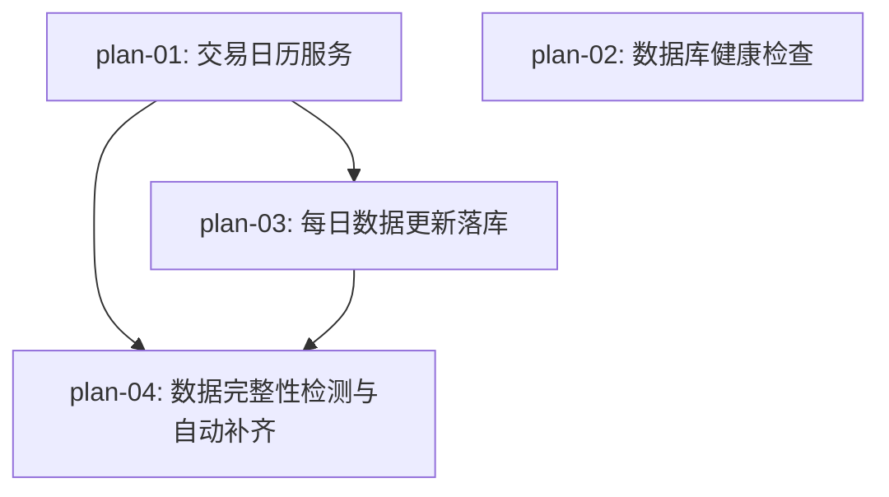

# 实现计划：自动数据质检与每日拉取补全

## 1. 概览

- **项目**: Sector Strength — 自动数据质检与每日拉取补全
- **来源架构**: docs/01-自动数据质检与每日拉取补全/01-1-架构文档-自动数据质检与每日拉取补全.md
- **组织方式**: 功能维度（Feature-based）
- **项目类型**: brownfield（已有完整后端代码库）
- **技术栈**: Python 3.11 / FastAPI / SQLAlchemy async / AkShare / APScheduler / PostgreSQL
- **总阶段数**: 3
- **总功能数**: 4
- **最大并行度**: 2（Phase 1 的 plan-01 和 plan-02 可并行）
- **关键路径**: plan-01 → plan-03 → plan-04

## 2. 输入摘要

### 2.1 核心闭环与目标

在现有板块强弱指标系统基础上，补全"**拉取 → 落库 → 质检 → 补齐**"自动化闭环。核心改造：引入真实交易日历替代硬编码判断、补全每日数据更新的数据库写入、实现数据完整性检测与自动补齐逻辑、修复健康检查端点。

### 2.2 关键 ADR 与实施护栏

| ADR | 决策 | 护栏 |
| --- | --- | --- |
| ADR-1 | 每日更新复用已有服务层，在 DataCollector 中补全落库逻辑 | 不在 collector 外重新实现数据获取和保存逻辑 |
| ADR-2 | 交易日历从 AkShare 实时获取，内存缓存至当日结束 | AkShare 不可用时降级为简单周末判断 |
| ADR-3 | 质检检查数据完整性并自动补齐缺失交易日数据 | 补齐范围限定为 latest_date+1 至当日 |
| ADR-4 | 健康检查执行 SELECT 1 验证连接 | 最小改动修复 TODO 空实现 |

### 2.3 现有代码快照

| 组件 | 文件路径 | 现状 |
| --- | --- | --- |
| DataCollector | `server/src/services/data_updater/collector.py` | 框架完整，`_update_sectors/_stocks/_market_data` 内部 TODO 不落库 |
| DataQualityChecker | `server/src/services/monitoring/data_quality.py` | `_check_missing_market_data` 直接返回 0 |
| admin.py 空壳 | `server/src/api/v1/admin.py` (L31-33) | 空壳 DataQualityChecker 返回空结果 |
| HealthCheck | `server/main.py` (L136-154) | try 块无实际查询，永远返回 healthy |
| AkShareDataSource | `server/src/services/data_acquisition/akshare_client.py` | 已有 get_sector_list/get_stock_list/get_daily_data/get_sector_daily_data |
| JobManager | `server/src/services/scheduler/job_manager.py` | 质检任务每 5 分钟一次，需改为每小时 |

### 2.4 架构约束

- 不引入独立告警服务或消息队列
- 不引入 Redis 缓存交易日历
- 不引入交易日历本地表
- 速率限制：AkShareDataSource 已内置 500ms 间隔
- DailyMarketData 唯一约束：`(entity_type, entity_id, date)` → ON CONFLICT DO NOTHING
- DataUpdateLog.status 为 String(20) 无枚举约束，已支持 `skipped`

## 3. 验收标准追踪矩阵

| AC-ID | 需求原文 | 架构承接 | 计划承接 | 验证方式 | 当前状态 |
| --- | --- | --- | --- | --- | --- |
| AC-01 | 交易日自动更新完整执行 | DataCollector + TradingCalendar | plan-01, plan-03 | plan-03 §5 全流程验收 + pytest | planned |
| AC-02 | 非交易日自动跳过 | TradingCalendar | plan-01, plan-03 | plan-01 §5 交易日判断验收 + plan-03 §5 非交易日跳过验收 | planned |
| AC-03 | 调休工作日正常执行 | TradingCalendar | plan-01, plan-03 | plan-01 §5 交易日判断验收 | planned |
| AC-04 | 质检发现缺失并自动补齐 | DataQualityChecker | plan-04 | plan-04 §5 质检测测补齐验收 | planned |
| AC-05 | 数据库健康检查真实反映连接状态 | HealthCheck 端点 | plan-02 | plan-02 §5 健康检查验收 | planned |
| AC-06 | 数据源失败后可恢复 | AsyncTask 重试机制 | plan-03 | plan-03 §5 异常恢复验收 | planned |
| AC-07 | 手动触发质检 | DataQualityChecker + API | plan-04 | plan-04 §5 手动触发验收 | planned |

## 4. 模块地图

按功能聚合展示：

| 功能 | 包含模块 | 类型 | 对应文件 |
| --- | --- | --- | --- |
| plan-01: 交易日历服务 | TradingCalendar, AkShareDataSource | service | plan-01-交易日历服务.md |
| plan-02: 数据库健康检查 | HealthCheck, DataUpdateLog | api + model | plan-02-数据库健康检查.md |
| plan-03: 每日数据更新落库 | DataCollector, TradingCalendar | service | plan-03-每日数据更新落库.md |
| plan-04: 数据完整性检测与自动补齐 | DataQualityChecker, HealthCheck API, JobManager | service + api | plan-04-数据完整性检测与自动补齐.md |

## 5. 依赖图



Phase 1（plan-01, plan-02）无相互依赖可并行。plan-03 依赖 plan-01 的 TradingCalendar。plan-04 依赖 plan-01 的 TradingCalendar 和 plan-03 的落库数据。

## 6. 阶段摘要

| Phase | 功能 | 依赖关系 | 并行度 |
| --- | --- | --- | --- |
| Phase 1 | plan-01, plan-02 | 无相互依赖 | 2 |
| Phase 2 | plan-03 | 依赖 plan-01 | 1 |
| Phase 3 | plan-04 | 依赖 plan-01, plan-03 | 1 |

## 7. 任务总览

| 功能 | 阶段 | 包含维度 | 依赖 | 独立验收标准 |
| --- | --- | --- | --- | --- |
| plan-01: 交易日历服务 | Phase 1 | backend | 无 | is_trading_day 正确区分交易日/周末/节假日/调休日；降级为周末判断时记录 warning |
| plan-02: 数据库健康检查 | Phase 1 | backend | 无 | /health/db 正常返回 healthy；DB 断开后返回 503 + unhealthy |
| plan-03: 每日数据更新落库 | Phase 2 | backend | plan-01 | 交易日板块→股票→行情→计算全流程数据正确入库；非交易日跳过；异常时后续步骤中止 |
| plan-04: 数据完整性检测与自动补齐 | Phase 3 | backend | plan-01, plan-03 | 质检发现缺失并自动补齐；手动触发 API 正常工作；admin.py 空壳类已清理 |

## 8. 未决策项

无。架构文档 `open_questions` 为空，所有决策已落地到 ADR。

## 9. 执行前置

### 9.1 环境准备

- PostgreSQL 运行中（`docker-compose up postgres -d`）
- Python 3.11 虚拟环境已激活
- AkShare 已安装（`pip install akshare`）
- 后端开发服务器可启动（`uvicorn server.main:app --reload --port 8000`）

### 9.2 执行顺序

```
Phase 1: plan-01, plan-02（并行）
Phase 2: plan-03（等 plan-01 完成）
Phase 3: plan-04（等 plan-01 + plan-03 完成）
```

### 9.3 全局验证

所有功能完成后执行：

```bash
cd server
pytest tests/ -v
uvicorn server.main:app --reload --port 8000
# 手动验证：curl http://localhost:8000/health/db
# 手动验证：curl -H "api_key: <key>" http://localhost:8000/api/v1/admin/data/quality/check
```

## 10. 变更记录

| 日期 | 变更类型 | 功能 | 说明 |
| --- | --- | --- | --- |
| 2026-05-24 | 新增 | plan-01 ~ plan-04 | 初始生成，基于架构文档 v1 |

<!-- 保留目录：reviews/。当 task-review、dev-plan-check 等开始运行时创建。 -->
