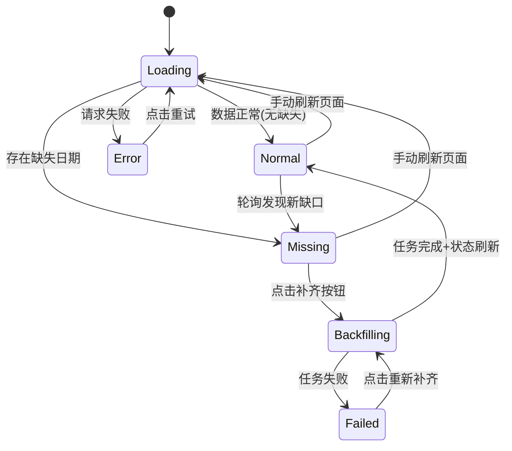
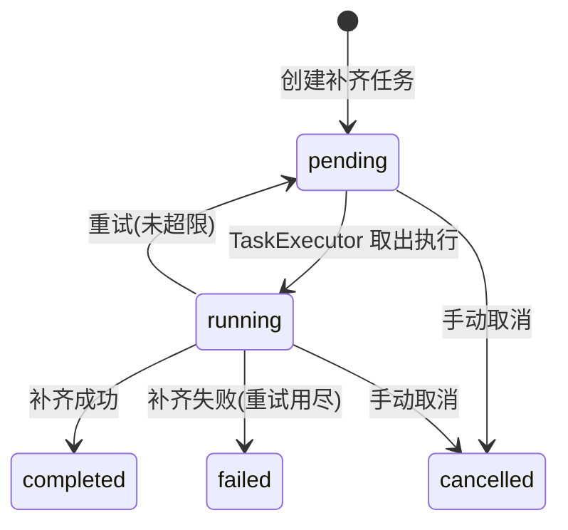

# 02-1 架构设计文档：数据状态总览与一键补齐

_本文件只保留当前版本真正影响实现的架构决策、边界和契约；DDL、目录树、环境变量、实施故事等内容默认不放入正文。_

## 1. 系统摘要

为数据管理页面新增"数据状态"标签页，展示板块历史数据、均线数据、强度数据三类数据的时效性状态卡片，支持一键检测缺口并触发补齐任务。核心闭环锚点：**Status → Detect → Backfill → Refresh**。首版面向管理员，最小改动复用现有任务系统，不引入新基础设施。

## 2. 范围、非目标与成功标准

### 2.1 范围

- 新增后端 API：获取三类板块数据的最新日期、缺失状态、缺失日期范围
- 新增后端 API：按数据类型一键创建补齐任务（自动检测缺口范围）
- 新增前端标签页"数据状态"：三张状态卡片 + 补齐按钮 + 进度展示
- 补齐任务进行中时卡片显示实时进度，完成后自动刷新状态
- 状态获取失败时提供重试能力

### 2.2 明确不做

- 个股数据的状态展示和补齐（数据量大，非当前维护重点）
- 自动定时补齐（已有 APScheduler 定时任务覆盖）
- 数据质量评分或健康度评分
- 历史补齐记录查看
- 数据记录数等统计信息展示
- WebSocket / SSE 实时推送

### 2.3 成功标准

| 指标 | 首版目标 |
|------|---------|
| 状态卡片展示 | 三类数据状态正常展示，含最新日期和状态标记 |
| 缺失检测 | 缺失时正确显示缺口日期范围 |
| 一键补齐 | 点击按钮后自动创建对应任务，无需手动填写日期 |
| 进度展示 | 补齐进行中显示进度百分比，完成后状态自动刷新 |
| 失败处理 | 失败时显示错误信息和重试按钮 |
| 状态 API 响应时间 | < 2s（聚合查询，含 max date 查询） |

### 2.4 验收标准承接矩阵

| AC-ID | PRD 原文摘要 | 承接模块 | 关键链路 / 状态 | 风险 / 降级说明 |
| --- | --- | --- | --- | --- |
| AC-01 | 三类数据状态卡片展示（名称、最新日期、状态标记） | DataStatusPanel + GET /admin/data/status | 状态查询链路 | 无特殊风险；数据表为空时 latest_date 返回 null，前端展示"暂无数据" |
| AC-02 | 缺失检测与日期范围展示 | DataStatusService._detect_gap + 前端卡片 | 状态查询链路 / missing | 依赖交易日历服务准确返回交易日；非交易日时无缺失 |
| AC-03 | 一键补齐触发（自动检测范围、创建任务、显示进度） | POST /admin/data/backfill/{type} + TaskRegistry | 补齐链路 / running | 若补齐期间产生新缺口，需再次点击补齐；不自动链式补齐 |
| AC-04 | 补齐完成后状态自动刷新 | 前端轮询 + 状态 API | 轮询链路 / completed | 轮询间隔 2s；页面不可见时暂停轮询（SWR revalidateOnFocus） |
| AC-05 | 补齐失败处理（红色标记 + 错误信息 + 重新补齐按钮） | DataStatusPanel + task error_message | 补齐链路 / failed | 任务重试次数用尽后标记 failed；前端可重新创建任务 |
| AC-06 | 状态获取失败处理（失败提示 + 重试链接） | DataStatusPanel error state + mutate() | 状态查询链路 / error | 网络异常或后端不可用时前端展示错误态 |

## 3. 用户流程与状态

### 3.1 主流程

1. 管理员打开数据管理页面，默认进入"数据状态"标签页
2. 页面加载，请求 `GET /admin/data/status`，三张卡片展示骨架屏
3. 数据返回，每张卡片展示数据类型名称、最新日期、状态标记
4. **情况 A**：三类数据均正常 → 无需操作
5. **情况 B**：某类数据有缺失 → 卡片显示橙色缺失标记和缺失日期范围，展示"补齐缺失数据"按钮
6. 管理员点击按钮 → 前端调用 `POST /admin/data/backfill/{type}` → 后端自动检测缺口并创建任务
7. 卡片切换到进度展示态（进度条 + 百分比），按钮禁用
8. 前端每 2 秒轮询状态 API，获取任务进度
9. 任务完成 → 卡片刷新为正常态；任务失败 → 卡片显示失败态和重试按钮

### 3.2 关键分支

| 分支名 | 入口 / 触发条件 | 架构处理方式 |
| --- | --- | --- |
| 全部正常 | 三类数据最新日期均覆盖至最近交易日 | 卡片只展示最新日期，不显示按钮 |
| 补齐进行中 | 任务状态为 pending/running | 按钮禁用，显示进度条；通过 active_task 字段关联 |
| 补齐失败 | 任务状态为 failed | 显示错误信息 + "重新补齐"按钮；重新创建任务 |
| 状态加载失败 | API 请求失败或超时 | 卡片显示错误态 + "重试"链接；调用 mutate() 刷新 |
| 数据表为空 | 数据库中无对应类型数据 | latest_date 为 null，显示"暂无数据"，不显示补齐按钮 |

### 3.3 状态机

每类数据卡片独立维护以下状态：



**关键规则**：
- Backfilling 状态下按钮禁用，防止重复创建任务
- Normal → Missing 转换依赖轮询检测（跨天场景）
- 各卡片状态独立，互不影响

## 4. 系统上下文与模块职责

### 4.1 系统上下文

变更点说明（在现有系统基础上新增）：

- **新增后端模块**：`DataStatusService`（检测三类数据状态 + 缺口范围）、`DataStatusAPI`（状态查询 + 补齐触发）
- **新增后端任务类型**：`backfill_history`、`backfill_ma`、`backfill_strength`（封装现有补齐逻辑，便于按类型追踪活跃任务）
- **新增前端组件**：`DataStatusPanel`（状态标签页）、`DataTypeCard`（单类数据状态卡片）
- **复用**：现有 TaskExecutor / TaskRegistry / AsyncTask 模型 / SWR 轮询机制

数据流向：前端 → 状态 API → DataStatusService → Repository 层（查 max date + 查活跃任务）→ 返回聚合状态

### 4.2 模块职责

| 模块 | 职责 | 上游输入 | 下游输出 |
| --- | --- | --- | --- |
| DataStatusService | 聚合三类数据的最新日期、缺失状态、活跃任务 | Repository 层（max date 查询）、AsyncTask 表（活跃任务查询）、TradingCalendar（交易日） | `DataStatusResponse` |
| DataStatusAPI | 提供状态查询和补齐触发端点 | HTTP 请求 | DataStatusService / TaskManager |
| backfill_history 任务 | 补齐板块历史数据缺口 | 日期范围参数 | 复用现有 backfill_by_range 逻辑 |
| backfill_ma 任务 | 补齐板块均线数据缺口 | 日期范围参数 | 复用现有 calculate_sector_ma 逻辑 |
| backfill_strength 任务 | 补齐板块强度数据缺口 | 日期范围参数 | 复用现有 calculate_sector_strength 逻辑 |
| DataStatusPanel | 前端数据状态标签页 | SWR hook（状态 API） | 3 张 DataTypeCard |
| DataTypeCard | 单类数据状态卡片 | 父组件传入的状态数据 | 补齐按钮点击事件 → API 调用 |

**交互细节补充**（承接 PRD §3.1 线框图）：
- 每张 DataTypeCard 包含：标题行（数据类型名 + 状态 Badge）、信息行（最新日期、缺失范围）、操作区（按钮或进度条）
- 补齐按钮点击后立即禁用，同时触发 `mutate()` 刷新状态（获取刚创建的 active_task）
- 进度条使用 div 宽度百分比渲染，每 2 秒通过 SWR `refreshInterval` 自动更新
- 缺失范围格式：`YYYY-MM-DD ~ YYYY-MM-DD`，仅当 status 为 missing 时显示
- 错误信息展示为红色文字，位于缺失范围下方

### 4.3 需要刻意避免的过度设计

- **不引入 WebSocket / SSE**：管理员后台页面，2 秒轮询完全满足实时性需求
- **不引入独立缓存层**：状态查询频率低（每 2 秒一次，仅管理页打开时），直接查数据库
- **不为状态数据建新表**：状态是实时计算的，无需持久化
- **不引入统一健康度评分**：PRD 明确不做，三类数据独立展示即可
- **不自动链式补齐**（如先补历史再补均线）：各类数据独立操作，由管理员判断顺序

## 5. 关键架构决策（ADR）

### ADR-1：复用现有任务系统实现补齐，不新建同步逻辑

- **选择**：补齐操作通过 TaskExecutor 异步任务实现，复用已有的进度跟踪、重试、超时机制
- **理由**：现有任务系统成熟（AsyncTask + TaskRegistry + progress callback），新建同步逻辑会绕过已有能力，增加维护负担
- **风险与对策**：任务执行有队列延迟（轮询间隔 5s）；可接受，管理员不期望毫秒级响应

### ADR-2：新增 3 个专用 task type 封装补齐逻辑

- **选择**：新增 `backfill_history`、`backfill_ma`、`backfill_strength` 三个 task type，内部调用现有服务
- **理由**：便于按 task_type 查询"该数据类型是否有活跃任务"，关联卡片与任务；不用 params 标记分类是因为按 params 查询不方便
- **风险与对策**：增加少量注册代码；每个 handler 仅 10-15 行，内部调用现有函数

### ADR-3：聚合状态 API 一次返回三类数据状态

- **选择**：单一 `GET /admin/data/status` 端点返回三类数据的完整状态
- **理由**：前端一次请求获取全部状态，减少请求次数和加载态管理复杂度；不用 3 个独立端点
- **风险与对策**：单次查询需要 3 个 max(date) + 3 个活跃任务查询；均为索引查询，延迟可控

### ADR-4：前端使用 SWR 轮询获取进度，不用 WebSocket

- **选择**：卡片进度通过 SWR 的 `refreshInterval: 2000` 轮询状态 API
- **理由**：管理员后台页面，并发用户 1-3 人，2 秒轮询完全满足需求；引入 WebSocket 需要新增基础设施（连接管理、断线重连），成本远超收益
- **演进余地**：若未来需要更高实时性，可升级为 SSE

### ADR-5：标签页方式集成到现有数据管理页面

- **选择**：在现有数据管理页面的标签页体系中新增"数据状态"标签，作为默认展示标签
- **理由**：与现有数据管理功能在同一上下文，切换标签页查看历史数据、均线计算等功能时无需跳转
- **风险与对策**：标签页已达 4 个；PRD 已评估可接受，后续增多再考虑页面拆分

### 5.x 待确认问题

无。

## 6. 运行链路

### 6.1 状态查询链路

1. 前端请求 `GET /admin/data/status`
2. API handler 调用 `DataStatusService.get_status()`
3. Service 对每类数据（history / ma / strength）执行：
   a. 查询 `max(date)` 获取 latest_date（history → `daily_market_data`，ma → `moving_average_data`，strength → `strength_scores`，均筛选 `entity_type='sector'`）
   b. 若 latest_date < 今日：调用 `TradingCalendar` 获取 latest_date+1 到今日之间的交易日列表
   c. 过滤掉非交易日后，得到 missing_dates 列表；若列表为空则 status=normal，否则 status=missing
   d. 查询 `AsyncTask` 表中 task_type 为该类数据对应类型、status 为 pending/running 的记录，取最新一条作为 active_task
4. Service 组装 `DataStatusResponse` 返回

**实现原则**：
- max(date) 查询利用现有 date 索引，不新增索引
- 活跃任务查询：`SELECT * FROM async_tasks WHERE task_type IN (...) AND status IN ('pending', 'running') ORDER BY created_at DESC LIMIT 1`，每类数据查一次
- 交易日查询使用 `TradingCalendar` 缓存，不重复调用外部 API
- 数据表为空时（latest_date 为 null）：status 返回 `no_data`，前端展示"暂无数据"

### 6.2 一键补齐链路

1. 前端点击"补齐缺失数据"按钮，请求 `POST /admin/data/backfill/{type}`（type = history | ma | strength）
2. API handler 调用 `DataStatusService.get_backfill_range(type)` 获取缺口范围
3. 若无缺口，返回 400 错误："该类数据无缺失"
4. 若有缺口，调用 `TaskManager.create_task(task_type=对应 type, params={start_date, end_date})`
5. 返回 `{ task_id: "..." }`
6. 前端立即调用 `mutate()` 刷新状态（此时状态 API 会返回新创建的 active_task）

**实现原则**：
- 补齐范围计算逻辑与状态查询一致（latest_date+1 到今日），确保范围一致
- 创建任务前检查是否已有同类型活跃任务，有则返回 409 冲突
- task handler 内部调用现有服务函数，不重复实现数据获取和计算逻辑

### 6.3 进度轮询链路

1. 前端通过 SWR `refreshInterval: 2000` 持续请求状态 API
2. 状态 API 返回 active_task 的 progress/total/error_message
3. 前端根据 active_task.status 更新卡片：
   - running → 显示进度条（progress / total * 100%）
   - completed → 切换为正常态（此轮询周期内会刷新，latest_date 已更新）
   - failed → 切换为失败态，显示 error_message

**实现原则**：
- 轮询仅在标签页可见且有活跃任务时生效（SWR revalidateOnFocus + 页面可见性检测）
- 任务完成后 next poll 自动刷新状态，无需额外机制

## 7. 领域对象与关键契约

### 7.1 核心对象

| 对象名 | Source of Truth | Owner | 用途 |
| --- | --- | --- | --- |
| DataStatusResponse | 后端 API 实时计算 | DataStatusService | 三类数据的聚合状态 |
| DataTypeStatus | 后端 API 实时计算 | DataStatusService | 单类数据的完整状态 |
| AsyncTask（现有） | async_tasks 表 | TaskExecutor | 补齐任务的执行和进度跟踪 |

### 7.2 推荐最小 Schema

```typescript
// 后端响应 Schema
interface DataStatusResponse {
  items: DataTypeStatus[];
}

interface DataTypeStatus {
  type: "history" | "ma" | "strength";
  label: string;             // "板块历史数据" | "板块均线数据" | "板块强度数据"
  latest_date: string | null; // YYYY-MM-DD，null 表示无数据
  status: "normal" | "missing" | "no_data";
  missing_range: {           // 仅 status=missing 时有值
    start: string;           // YYYY-MM-DD
    end: string;             // YYYY-MM-DD
  } | null;
  active_task: {             // 仅存在活跃任务时有值
    task_id: string;
    status: "pending" | "running" | "completed" | "failed";
    progress: number;
    total: number;
    error_message: string | null;
  } | null;
}

// 补齐请求
interface BackfillRequest {
  // 无需请求体，type 在 URL path 中
}

// 补齐响应
interface BackfillResponse {
  task_id: string;
}
```

### 7.3 API 边界

| 接口路径 | 方法 | 用途 | 说明 |
| --- | --- | --- | --- |
| `/api/v1/admin/data/status` | GET | 获取三类数据状态聚合 | 对应 AC-01, AC-02；返回 `DataStatusResponse` |
| `/api/v1/admin/data/backfill/{type}` | POST | 触发指定类型的补齐任务 | 对应 AC-03；type ∈ {history, ma, strength}；自动检测缺口范围 |

### 7.4 状态流转

补齐任务状态流转（复用现有 AsyncTask 状态机）：



### 7.5 数据边界

| 存储层 | 职责 | 本需求涉及的查询 |
| --- | --- | --- |
| PostgreSQL（daily_market_data） | 板块历史数据 | `SELECT MAX(date) WHERE entity_type='sector'` |
| PostgreSQL（moving_average_data） | 板块均线数据 | `SELECT MAX(date) WHERE entity_type='sector'` |
| PostgreSQL（strength_scores） | 板块强度数据 | `SELECT MAX(date) WHERE entity_type='sector'` |
| PostgreSQL（async_tasks） | 异步任务 | 按 task_type 查询活跃任务 |

### 7.6 命名与标识规则

- **API 路径风格**：`/admin/data/status`、`/admin/data/backfill/{type}`，遵循现有 admin API 路径规范
- **数据类型标识**：`history` / `ma` / `strength`，前后端统一使用，不使用中文标识符
- **日期格式**：`YYYY-MM-DD`，所有 API 响应中的日期字段统一使用此格式
- **JSON 命名风格**：`snake_case`，与后端现有 API 保持一致
- **术语映射**：后端 `task_type` 到前端展示名称的映射由前端硬编码（`history` → "板块历史数据" 等）

## 8. 非功能需求、风险与运行策略

### 8.1 性能与吞吐量目标

| 指标 | 目标 | 预期并发 |
| --- | --- | --- |
| 状态 API 响应时间 | < 2s | 1-3 管理员同时查看 |
| 轮询期间后端负载 | 可忽略 | 每 2s 一次聚合查询 |

### 8.2 可靠性、错误处理与降级策略

**基础错误处理**：
- 状态 API 失败：前端展示错误态 + 重试链接（AC-06）
- 补齐任务失败：展示 error_message + 重新补齐按钮（AC-05）
- 补齐进行中重复点击：按钮禁用，后端也做 409 冲突检查

**降级策略**（按影响从小到大）：

| 级别 | 场景 | 系统行为 |
| --- | --- | --- |
| L1 | 交易日历服务不可用 | 无法精确计算缺失天数，状态 API 降级返回 latest_date，不展示 missing_range |
| L2 | 状态 API 超时（> 5s） | 前端展示加载失败，提供重试 |
| L3 | 任务执行器不可用 | 补齐任务创建成功但无法执行，前端显示 pending 状态不推进 |

### 8.3 安全与反滥用策略

| 项目 | 首版策略 |
| --- | --- |
| 访问控制 | 复用现有 admin RBAC，仅管理员可访问状态和补齐 API |
| 输入验证 | type 路径参数限定为 history/ma/strength 枚举值 |
| 并发控制 | 同类型已有活跃任务时拒绝创建（409） |

### 8.4 成本控制预期

本需求不引入新的外部付费服务。补齐操作复用现有 AkShare 数据获取，无额外成本。

### 8.5 可观测性

- 状态 API 和补齐 API 请求日志由现有 FastAPI 中间件自动记录
- 补齐任务执行日志通过现有 `AsyncTaskLog` 记录（INFO / WARNING / ERROR 级别）
- 无需新增独立监控指标

### 8.6 主要风险

| 风险 | 影响 | 缓解方式 |
| --- | --- | --- |
| 聚合查询慢（3 个 max + 3 个活跃任务查询） | 状态 API 响应超时 | 利用现有 date 索引；实测后按需优化（如并行查询） |
| 大量板块数据缺失时补齐任务执行时间过长 | 管理员等待时间过长 | 已有任务超时机制（4h）；前端展示进度百分比缓解感知 |
| 交易日历缓存失效导致缺失检测不准 | 误报或漏报缺失 | 交易日历按日缓存，失效后重新获取 AkShare 数据 |

## 9. 实施方案

### Phase A：后端 — 状态查询与补齐触发

1. `server/src/services/data_status.py` — 新建 `DataStatusService`，实现：
   - `get_status()` → 聚合三类数据状态（max date + 缺失检测 + 活跃任务查询）
   - `get_backfill_range(data_type)` → 计算指定类型的补齐日期范围
   - 各类数据的 max(date) 查询使用 Repository 层现有方法或新增 `get_latest_date(entity_type)` 方法

2. `server/src/api/admin/data_status.py` — 新建路由，实现：
   - `GET /status` → 调用 `DataStatusService.get_status()`
   - `POST /backfill/{type}` → 调用 `get_backfill_range()` + `TaskManager.create_task()`

3. `server/src/services/task_handlers.py` — 新增 3 个 task type 注册：
   - `backfill_history`：调用现有 `backfill_by_range` 逻辑
   - `backfill_ma`：调用现有 MA 计算逻辑
   - `backfill_strength`：调用现有强度计算逻辑

4. `server/src/api/admin/__init__.py` 或路由注册文件 — 注册新路由

**验证目标**：通过 curl/httpie 调用 API 能正确返回三类数据状态，创建补齐任务能正常执行并更新进度

### Phase B：前端 — 数据状态标签页

5. `web/src/hooks/useDataStatus.ts` — 新建 SWR hook：
   - 使用 `useSWR` 请求 `/admin/data/status`
   - 当存在 active_task 时启用 `refreshInterval: 2000`
   - 导出 `data`, `isLoading`, `error`, `mutate`

6. `web/src/components/admin/DataTypeCard.tsx` — 新建单类数据状态卡片组件：
   - 接收 `DataTypeStatus` props
   - 根据 status 渲染：normal（绿色 Badge）、missing（橙色 Badge + 缺失范围 + 补齐按钮）、no_data（灰色提示）
   - 有 active_task 时渲染进度条或失败信息
   - 点击补齐按钮调用 `POST /admin/data/backfill/{type}`，成功后 `mutate()` 刷新

7. `web/src/app/dashboard/admin/data/page.tsx` — 修改：
   - 新增 `data-status` 标签选项，设为默认标签
   - 标签按钮文案："数据状态"
   - 渲染 `DataStatusPanel` 组件

8. `web/src/components/admin/DataStatusPanel.tsx` — 新建面板组件：
   - 使用 `useDataStatus` hook 获取状态
   - 加载中展示骨架屏
   - 错误态展示重试链接
   - 正常态渲染 3 张 `DataTypeCard`

**验证目标**：打开数据管理页面，"数据状态"标签默认展示，三类数据卡片正确显示状态；点击补齐按钮后进度正常推进，完成后状态刷新

## 10. 架构结论

本需求在现有系统上增量建设，核心判断：

- **最小改动原则**：不引入新基础设施，复用任务系统、Repository 层和交易日历服务
- **职责清晰**：`DataStatusService` 负责聚合查询，3 个新 task type 封装补齐逻辑，前端只做展示和触发
- **渐进演进**：首版仅覆盖板块维度三类数据，扩展到个股数据时只需在 Service 层增加查询维度
- **核心风险可控**：聚合查询性能依赖现有索引，补齐逻辑复用已有实现
