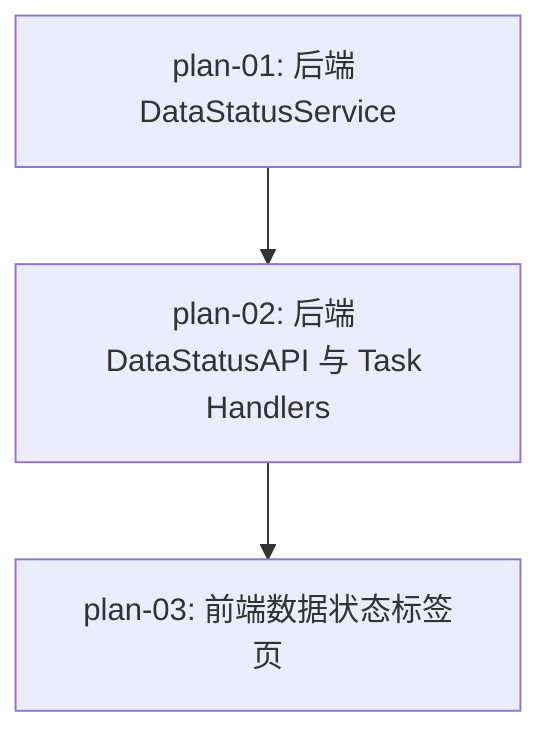

# 实现计划：数据状态总览与一键补齐

## 1. 概览

- **项目**: Sector Strength — 数据状态总览与一键补齐
- **来源架构**: docs/02-数据状态总览与一键补齐/02-1-架构文档-数据状态总览与一键补齐.md
- **组织方式**: 功能维度（Feature-based）
- **项目类型**: brownfield（已有完整前后端代码库）
- **技术栈**: Python 3.11 / FastAPI / SQLAlchemy async / Next.js 16 / React 19 / TypeScript / SWR / Tailwind CSS
- **总阶段数**: 3
- **总功能数**: 3
- **最大并行度**: 1（严格串行，每功能依赖前一功能）
- **关键路径**: plan-01 → plan-02 → plan-03

## 2. 输入摘要

### 2.1 核心闭环与目标

为数据管理页面新增"数据状态"标签页，展示板块历史数据、均线数据、强度数据三类数据的时效性状态卡片，支持一键检测缺口并触发补齐任务。核心闭环：**Status → Detect → Backfill → Refresh**。首版面向管理员，最小改动复用现有任务系统。

### 2.2 关键 ADR 与实施护栏

| ADR | 决策 | 护栏 |
| --- | --- | --- |
| ADR-1 | 补齐操作复用现有 TaskExecutor 异步任务系统 | 不新建同步补齐逻辑 |
| ADR-2 | 新增 3 个专用 task type 封装补齐逻辑 | 不用 params 标记分类 |
| ADR-3 | 单一 GET /admin/data/status 返回三类数据状态 | 不拆 3 个独立端点 |
| ADR-4 | 前端使用 SWR 2 秒轮询获取进度 | 不引入 WebSocket/SSE |
| ADR-5 | 标签页方式集成到现有数据管理页面 | 不新建独立页面 |

### 2.3 现有代码快照

| 组件 | 文件路径 | 现状 |
| --- | --- | --- |
| TaskType 枚举 | `server/src/services/task_handlers.py` | 已有多种 task type，需新增 3 个 |
| TaskManager | `server/src/services/task_manager.py` | 成熟的异步任务管理 |
| TradingCalendar | `server/src/services/trading_calendar.py` | 交易日历服务，带缓存 |
| Admin 路由 | `server/src/api/admin/__init__.py` | 已注册 init/tasks/rbac/sector_classifications |
| DataUpdateService | `server/src/services/data_update.py` | 有 backfill_by_range 方法 |
| SectorMAService | `server/src/services/sector_ma_service.py` | 有 backfill_sector_ma 方法 |
| SectorStrengthService | `server/src/services/sector_strength_service.py` | 有 calculate_sector_strength_by_range 方法 |
| 数据管理页面 | `web/src/app/dashboard/admin/data/page.tsx` | 有 init/ma-calc/strength-calc 三个标签 |
| fetcher | `web/src/lib/fetcher.ts` | 有 fetcher/postFetcher |

### 2.4 架构约束

- 不引入 WebSocket / SSE
- 不引入独立缓存层
- 不为状态数据建新表
- 不自动链式补齐
- API 响应格式遵循现有 `{ "data": ... }` 约定
- 前端 API 请求通过 Next.js proxy（`/api/:path*` → 后端）

## 3. 验收标准追踪矩阵

| AC-ID | 需求原文 | 架构承接 | 计划承接 | 验证方式 | 当前状态 |
| --- | --- | --- | --- | --- | --- |
| AC-01 | 三类数据状态卡片展示（名称、最新日期、状态标记） | DataStatusPanel + GET /admin/data/status | plan-01, plan-03 | plan-01 §5 后端验收 + plan-03 §5 前端验收 | planned |
| AC-02 | 缺失检测与日期范围展示 | DataStatusService._detect_gap + 前端卡片 | plan-01, plan-03 | plan-01 §5 缺失检测 + plan-03 §5 缺失展示 | planned |
| AC-03 | 一键补齐触发（自动检测范围、创建任务、显示进度） | POST /admin/data/backfill/{type} + TaskRegistry | plan-02, plan-03 | plan-02 §5 补齐触发 + plan-03 §5 补齐按钮 | planned |
| AC-04 | 补齐完成后状态自动刷新 | 前端轮询 + 状态 API | plan-03 | plan-03 §5 进度轮询和自动刷新 | planned |
| AC-05 | 补齐失败处理（红色标记 + 错误信息 + 重新补齐按钮） | DataStatusPanel + task error_message | plan-02, plan-03 | plan-02 §5 task handler + plan-03 §5 失败态 | planned |
| AC-06 | 状态获取失败处理（失败提示 + 重试链接） | DataStatusPanel error state + mutate() | plan-03 | plan-03 §5 错误态和重试 | planned |

## 4. 模块地图

按功能聚合展示：

| 功能 | 包含模块 | 类型 | 对应文件 |
| --- | --- | --- | --- |
| plan-01 | DataStatusService, TradingCalendar | service | plan-01-后端DataStatusService.md |
| plan-02 | DataStatusAPI, TaskRegistry, 3 个 backfill handler | api + service | plan-02-后端DataStatusAPI与TaskHandlers.md |
| plan-03 | DataStatusPanel, DataTypeCard, useDataStatus | ui + hook | plan-03-前端数据状态标签页.md |

## 5. 依赖图



plan-01 无依赖可立即开始。plan-02 依赖 plan-01 的 DataStatusService。plan-03 依赖 plan-02 的后端 API。

## 6. 阶段摘要

| Phase | 功能 | 依赖关系 | 并行度 |
| --- | --- | --- | --- |
| Phase 1 | plan-01 | 无 | 1 |
| Phase 2 | plan-02 | 依赖 plan-01 | 1 |
| Phase 3 | plan-03 | 依赖 plan-02 | 1 |

## 7. 任务总览

| 功能 | 阶段 | 包含维度 | 依赖 | 独立验收标准 |
| --- | --- | --- | --- | --- |
| plan-01: 后端 DataStatusService | Phase 1 | backend | 无 | get_status() 返回三类数据完整状态；缺失检测和补齐范围计算正确 |
| plan-02: 后端 DataStatusAPI 与 Task Handlers | Phase 2 | backend | plan-01 | API 端点可创建/查询补齐任务；409 冲突和 400 无缺失场景正确 |
| plan-03: 前端数据状态标签页 | Phase 3 | frontend | plan-02 | 标签页展示三张状态卡片；补齐按钮和进度条正常工作；失败和错误态正确展示 |

### 7.2 开发状态机

| FEAT | 当前步骤 | red_e2e | implement | green_e2e | review | 最近证据 | 阻塞原因 | 更新时间 |
| --- | --- | --- | --- | --- | --- | --- | --- | --- |
| plan-01 | done | waived | done | waived | done | plan-01-review-20260527.md | - | 2026-05-27 |
| plan-02 | done | waived | done | waived | done | plan-02-review-20260527.md | - | 2026-05-27 |
| plan-03 | done | done | done | done | done | plan-03-review-20260527.md | - | 2026-05-27 |

## 8. 未决策项

无。架构文档 `open_questions` 为空，所有决策已落地到 ADR。

## 9. 执行前置

### 9.1 环境准备

- PostgreSQL 运行中（`docker-compose up postgres -d`）
- 后端开发服务器可启动（`uvicorn server.main:app --reload --port 8000`）
- 前端开发服务器可启动（`cd web && npm run dev`）
- 数据库中有 sector 类型的数据（或接受 no_data 状态）

### 9.2 执行顺序

```
Phase 1: plan-01（后端 DataStatusService）
Phase 2: plan-02（后端 API + Task Handlers，等 plan-01 完成）
Phase 3: plan-03（前端标签页，等 plan-02 完成）
```

### 9.3 全局验证

所有功能完成后执行：

```bash
# 后端验证
curl -H "Authorization: Bearer $TOKEN" http://localhost:8000/api/v1/admin/data/status

# 前端验证
cd web && npm run build && npm run lint
# 访问 http://localhost:3000/dashboard/admin/data 验证完整流程
```

## 10. 变更记录

| 日期 | 变更类型 | 功能 | 说明 |
| --- | --- | --- | --- |
| 2026-05-27 | 新增 | plan-01 ~ plan-03 | 初始生成，基于架构文档 v1。替代 docs/02-数据状态总览与一键补齐/ 下的旧 plan-01/02/03.md（非标准格式） |

<!-- 保留目录：reviews/。当 task-review、dev-plan-check 等开始运行时创建。 -->
