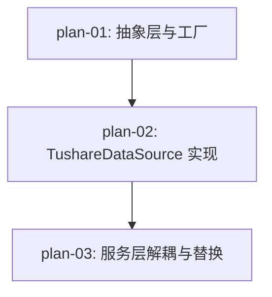

# 实现计划：数据源替换 Tushare

## 1. 概览

- **项目**: Sector Strength — 数据源替换 Tushare
- **来源架构**: docs/03-数据源替换Tushare/03-1-架构文档-数据源替换Tushare.md
- **组织方式**: 功能维度（Feature-based）
- **项目类型**: brownfield（已有完整后端代码库，AkShare 数据源运行中）
- **技术栈**: Python 3.11 / FastAPI / SQLAlchemy async / Tushare SDK
- **总阶段数**: 3
- **总功能数**: 3
- **最大并行度**: 1（严格串行，每功能依赖前一功能）
- **关键路径**: plan-01 → plan-02 → plan-03

## 2. 输入摘要

### 2.1 核心闭环与目标

将数据获取层从 AkShare（爬虫）替换为 Tushare（SDK），解决接口不稳定、无认证、数据获取不可靠的问题。核心闭环：**Factory → DataSource → Pydantic Model → DB**。通过环境变量切换数据源，保留 AkShare 作为可回退后备，用户使用流程无变化。

### 2.2 关键 ADR 与实施护栏

| ADR | 决策 | 护栏 |
| --- | --- | --- |
| ADR-1 | 环境变量 `DATA_SOURCE_TYPE` + 简单工厂 `DataSourceFactory` | 不引入 DI 框架 |
| ADR-2 | `get_trading_calendar` 纳入 `BaseDataSource` 抽象 | TradingCalendar 不再硬编码依赖 AkShare |
| ADR-3 | 个股日线通过 `pro_bar(adj='qfq')` 获取前复权数据 | 不手动计算复权因子 |
| ADR-4 | 板块数据通过同花顺接口 `ths_index` / `ths_daily` | 需 6000 积分 |
| ADR-5 | 请求频率控制内置在 TushareDataSource | 间隔通过环境变量可配 |
| ADR-6 | 支持 `TUSHARE_API_URL` 自定义服务地址 | 默认 `api.tushare.pro` |

### 2.3 现有代码快照

| 组件 | 文件路径 | 现状 |
| --- | --- | --- |
| BaseDataSource | `server/src/services/data_acquisition/base.py` | 4 个抽象方法，无 `get_trading_calendar` |
| AkShareDataSource | `server/src/services/data_acquisition/akshare_client.py` | 完整实现，含 `get_trading_calendar`（非抽象方法） |
| data_acquisition __init__ | `server/src/services/data_acquisition/__init__.py` | 导出 AkShareDataSource，无 Factory |
| exceptions | `server/src/services/data_acquisition/exceptions.py` | DataFetchError / RetryExhaustedError 等 |
| models | `server/src/services/data_acquisition/models.py` | StockInfo / SectorInfo / DailyQuote |
| TradingCalendar | `server/src/services/trading_calendar.py` | 硬编码 `AkShareDataSource()` |
| DataInitService | `server/src/services/data_init.py` | `self.ak_source = AkShareDataSource()` |
| DataUpdateService | `server/src/services/data_update.py` | `self.ak_source = AkShareDataSource()` |
| DataCollector | `server/src/services/data_updater/collector.py` | 3 处 `AkShareDataSource()` |
| DataQualityChecker | `server/src/services/monitoring/data_quality.py` | `self._data_source = AkShareDataSource()` |

### 2.4 架构约束

- 不引入 DI 框架
- 不建数据源配置表
- 不修改 API 路由或接口定义
- 不修改数据库结构
- 不删除 AkShare 实现
- 不引入前端变更
- 环境变量前缀：Tushare 相关使用 `TUSHARE_`

## 3. 验收标准追踪矩阵

| AC-ID | 需求原文 | 架构承接 | 计划承接 | 验证方式 | 当前状态 |
| --- | --- | --- | --- | --- | --- |
| AC-01 | 交易日历获取 | TushareDataSource.get_trading_calendar | plan-02 | plan-02 §5 后端验收 | planned |
| AC-02 | 股票列表获取 | TushareDataSource.get_stock_list | plan-02 | plan-02 §5 后端验收 | planned |
| AC-03 | 板块列表获取 | TushareDataSource.get_sector_list | plan-02 | plan-02 §5 后端验收 | planned |
| AC-04 | 个股日线行情获取 | TushareDataSource.get_daily_data | plan-02 | plan-02 §5 后端验收 | planned |
| AC-05 | 板块日线行情获取 | TushareDataSource.get_sector_daily_data | plan-02 | plan-02 §5 后端验收 | planned |
| AC-06 | 数据源可切换 | DataSourceFactory + env var | plan-01, plan-03 | plan-01 §5 Factory 验收 + plan-03 §5 切换验证 | planned |
| AC-07 | 数据获取失败处理 | TushareDataSource._execute_with_retry | plan-02 | plan-02 §5 重试验收 | planned |

## 4. 模块地图

按功能聚合展示：

| 功能 | 包含模块 | 类型 | 对应文件 |
| --- | --- | --- | --- |
| plan-01 | BaseDataSource, DataSourceFactory | service | plan-01-抽象层与工厂.md |
| plan-02 | TushareDataSource | service | plan-02-TushareDataSource实现.md |
| plan-03 | TradingCalendar, DataInitService, DataUpdateService, DataCollector, DataQualityChecker | service | plan-03-服务层解耦与替换.md |

## 5. 依赖图



plan-01 扩展 BaseDataSource 抽象并引入 DataSourceFactory，无依赖可立即开始。plan-02 依赖 plan-01 的抽象层和工厂。plan-03 依赖 plan-02 的 TushareDataSource 实现完成全链路替换。

## 6. 阶段摘要

| Phase | 功能 | 依赖关系 | 并行度 |
| --- | --- | --- | --- |
| Phase 1 | plan-01: 抽象层与工厂 | 无 | 1 |
| Phase 2 | plan-02: TushareDataSource 实现 | 依赖 plan-01 | 1 |
| Phase 3 | plan-03: 服务层解耦与替换 | 依赖 plan-02 | 1 |

## 7. 任务总览

| 功能 | 阶段 | 包含维度 | 依赖 | 独立验收标准 |
| --- | --- | --- | --- | --- |
| plan-01: 抽象层与工厂 | Phase 1 | backend | 无 | BaseDataSource 新增 get_trading_calendar 抽象方法；DataSourceFactory 在 tushare/akshare 配置下均返回正确实例；非法值报错；.env.example 更新 |
| plan-02: TushareDataSource 实现 | Phase 2 | backend | plan-01 | 5 个数据获取方法 + health_check 均返回符合 Pydantic 模型的数据；重试机制正确；字段映射正确 |
| plan-03: 服务层解耦与替换 | Phase 3 | backend | plan-02 | 5 个服务文件不再 import AkShareDataSource；DATA_SOURCE_TYPE=tushare 全链路使用 Tushare；DATA_SOURCE_TYPE=akshare 回退正常 |

### 7.2 开发状态机

| FEAT | 当前步骤 | red_e2e | implement | green_e2e | review | 最近证据 | 阻塞原因 | 更新时间 |
| --- | --- | --- | --- | --- | --- | --- | --- | --- |
| plan-01 | red-e2e | waived | todo | waived | todo | - | - | 2026-05-31 |
| plan-02 | red-e2e | waived | todo | waived | todo | - | - | 2026-05-31 |
| plan-03 | red-e2e | waived | todo | waived | todo | - | - | 2026-05-31 |

## 8. 未决策项

无。架构文档 `open_questions` 为空，所有决策已落地到 ADR。

## 9. 执行前置

### 9.1 环境准备

- PostgreSQL 运行中（`docker-compose up postgres -d`）
- 后端开发服务器可启动（`uvicorn server.main:app --reload --port 8000`）
- Tushare 账户已注册且积分 ≥ 6000（ths_index / ths_daily 接口所需）
- 已获取 Tushare API Token

### 9.2 执行顺序

```
Phase 1: plan-01（抽象层扩展 + DataSourceFactory）
Phase 2: plan-02（TushareDataSource 实现，等 plan-01 完成）
Phase 3: plan-03（服务层解耦与替换，等 plan-02 完成）
```

### 9.3 全局验证

所有功能完成后执行：

```bash
# 环境变量设为 tushare，验证全链路
export DATA_SOURCE_TYPE=tushare
cd server && python -c "
from src.services.data_acquisition import DataSourceFactory
ds = DataSourceFactory.create()
print(f'数据源: {ds.source_name}')
print(f'健康检查: {ds.health_check()}')
"

# 环境变量设为 akshare，验证回退
export DATA_SOURCE_TYPE=akshare
cd server && python -c "
from src.services.data_acquisition import DataSourceFactory
ds = DataSourceFactory.create()
print(f'数据源: {ds.source_name}')
"
```

## 10. 变更记录

| 日期 | 变更类型 | 功能 | 说明 |
| --- | --- | --- | --- |
| 2026-05-31 | 新增 | plan-01 ~ plan-03 | 初始生成，基于架构文档 v1 |

<!-- 保留目录：reviews/。当 task-review、dev-plan-check 等开始运行时创建。 -->
