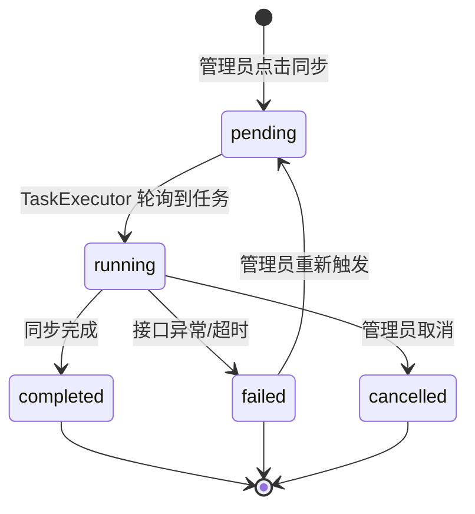

# 04-1 架构文档：A 股基金持仓分析

_本文件只保留当前版本真正影响实现的架构决策、边界和契约；DDL、目录树、环境变量、实施故事等内容默认不放入正文。_

## 1. 系统摘要

在现有板块/个股行情分析基础上，新增独立的"基金持仓分析"模块。系统从 Tushare 拉取全市场 A 股基金（场内 ETF + 场外开放式）基本信息与季度持仓明细，支持按基金搜索查看持仓、按股票反查重仓基金，补齐"机构资金动向"观察维度。

**核心闭环**：Fund → Portfolio → Query（基金信息 → 持仓入库 → 双向查询）。

## 2. 范围、非目标与成功标准

### 2.1 范围

- **基金基本信息库**：全市场 A 股基金（场内 ETF + 场外开放式）名称、类型、管理人、成立日期、业绩比较基准等
- **基金列表与搜索**：按基金代码/名称搜索，按市场（场内/场外）、基金类型（股票型/混合型/债券型/QDII）过滤，分页展示
- **基金详情页**：基本信息 + 最新一期已披露报告期持仓明细（按占净值比降序）
- **股票反查**：输入股票代码，查看最新一期"重仓持有该股"的基金列表（占净值比 ≥ 1%）
- **管理端采集入口**：管理员手动触发基金基本信息同步、指定报告期持仓明细同步，查看同步统计

### 2.2 明确不做

- 实时净值估算与基金日 K 线
- 持仓变动提醒（增减仓通知）
- 历史多期持仓变化趋势图
- 基金经理维度分析
- 持仓行业聚合与板块联动分析
- 自动化定时同步（首版仅手动）
- 用户自选基金 / 自选股票
- 第三方登录与社交分享

### 2.3 成功标准

| 指标 | 首版目标 |
|---|---|
| 基金列表搜索与过滤 | 功能正常完成，搜索匹配代码前缀和名称包含，过滤项与搜索词同时生效 |
| 基金详情页持仓展示 | 正确展示最新一期持仓明细，按占净值比降序排列 |
| 股票反查 | 正确展示重仓持有该股的基金列表，仅展示占净值比 ≥ 1% 的记录 |
| 管理员手动同步 | 同步完成后展示新增/更新/失败统计，数据可用于前端查询 |
| 数据缺失透明呈现 | 无持仓数据的基金明确标注"暂无持仓数据"，不静默隐藏 |
| 基金列表页加载 | < 2s（分页 pageSize=20） |
| 基金持仓明细加载 | < 3s（单只基金最新一期，默认前 20 条） |

### 2.4 验收标准承接矩阵

| AC-ID | PRD 原文摘要 | 承接模块 | 关键链路 / 状态 | 风险 / 降级说明 |
|---|---|---|---|---|
| AC-01 | 基金列表展示与搜索 | FundAPI + FundUI | 链路 6.1（基金列表加载） | 搜索依赖 DB LIKE 查询，大数据量时需关注索引 |
| AC-02 | 基金过滤（市场 + 类型） | FundAPI + FundUI | 链路 6.1（过滤参数传递） | 过滤项为 AND 关系，后端 WHERE 子句组合 |
| AC-03 | 基金详情页展示最新持仓 | FundAPI + FundUI | 链路 6.2（详情页加载） | 持仓数据依赖管理员已执行过同步 |
| AC-04 | 股票反查 | FundAPI + FundUI | 链路 6.3（反查流程） | 反查阈值 1% 为固定值，MVP 不暴露给用户 |
| AC-05 | 数据缺失的透明呈现 | FundAPI + FundUI | 链路 6.2（详情页空数据分支） | Tushare 未收录属正常现象，前端需处理空结果 |
| AC-06 | 管理员手动同步基金数据 | FundAdminAPI + FundTaskHandler | 链路 6.4（管理员同步） | 复用现有 AsyncTask 框架，同步为异步任务 |
| AC-07 | 同步失败的可见提示 | FundAdminAPI + FundUI | 链路 6.4（同步失败分支） | 失败后保留旧数据，前端弹窗提示错误原因 |

## 3. 用户流程与状态

### 3.1 主流程

**流程 A：按基金搜索并查看持仓**
1. 用户从仪表盘"基金分析"入口进入基金列表页
2. 在搜索框输入基金代码或名称（如"沪深 300"）
3. 列表展示匹配基金，可勾选市场/类型过滤
4. 点击某只基金进入详情页
5. 详情页展示基本信息 + 最新一期持仓明细表（按占净值比降序）

**流程 B：按股票反查重仓基金**
1. 用户在基金列表页"按股票反查"搜索框输入股票代码或名称
2. 系统跳转反查结果页，展示"最新一期重仓持有该股的基金"列表
3. 列表按占净值比从高到低排序，展示持仓市值、持股数、占净值比、占流通比
4. 用户点击某只基金可跳转基金详情页

**流程 C：管理员手动同步**
1. 管理员进入"管理 / 数据采集 / 基金"页面
2. 点击"基金基本信息 / 手动同步"按钮，触发全量同步
3. 或选择报告期后点击"同步指定报告期"，触发持仓明细同步
4. 按钮变为"同步中…"并禁用，等待任务完成
5. 完成后展示"新增 X / 更新 Y / 失败 Z"统计

### 3.2 关键分支

| 分支名 | 入口/触发条件 | 架构处理方式 |
|---|---|---|
| 搜索无结果 | 搜索词无匹配基金 | 前端展示空状态文案"未找到匹配基金" |
| 列表为空 | 未执行过任何同步 | 前端提示"暂无基金数据，请管理员先同步" |
| 详情页无持仓 | 基金无持仓数据 | 前端展示基本信息卡 + "暂无持仓数据"提示 |
| 反查无结果 | 股票无基金重仓 | 前端提示"暂无基金披露重仓持有该股票" |
| 同步失败 | Tushare 接口异常/超时 | 任务状态置 failed，前端弹窗提示错误原因，旧数据不受影响 |

### 3.3 状态机

同步任务状态（复用现有 AsyncTask 状态机）：



## 4. 系统上下文与模块职责

### 4.1 系统上下文

系统在现有 sector-strength 架构内新增基金持仓模块，外部依赖仅 Tushare 数据源。新增两张数据表（funds、fund_portfolio），与现有 Sector/Stock 模型平级。前端新增独立路由模块。

数据流向：
- Tushare → FundDataService（拉取）→ PostgreSQL（存储）→ FundAPI（查询）→ 前端展示
- 前端 → FundAdminAPI → AsyncTask → FundTaskHandler → FundDataService → Tushare

### 4.2 模块职责

| 模块 | 职责 | 上游输入 | 下游输出 |
|---|---|---|---|
| **FundDataService** | 封装 Tushare fund_basic/fund_portfolio 接口调用，原始数据清洗与入库 | Tushare API 响应 | 写入 funds / fund_portfolio 表 |
| **FundRepository** | 基金与持仓数据的 DB 查询（列表、详情、反查、聚合） | API 层查询参数 | 返回 ORM 对象列表 |
| **FundAPI** | 前端业务 API（列表/详情/持仓/反查） | HTTP 请求 | JSON 响应 |
| **FundAdminAPI** | 管理端同步触发接口 | 管理员操作 | 创建 AsyncTask 记录 |
| **FundTaskHandler** | 异步任务处理器，编排数据拉取与入库全流程 | AsyncTask 记录 + params | 调用 FundDataService |
| **FundUI** | 基金列表页、详情页、反查页、管理端同步面板 | 用户交互 | HTTP 请求 + 页面渲染 |

**复用声明验证**：

- **复用 AsyncTask 框架**：验证 `TaskRegistry.register` 装饰器 + `TaskExecutor` 轮询机制。数据源：AsyncTask 表（task_type 字段），写入目标：AsyncTask 表状态更新，前置依赖：无。结论：可复用，只需新增 task_type 枚举和 handler 函数。
- **复用 TushareDataSource 基类方法**：验证 `_enforce_rate_limit()` 和 `_execute_with_retry()` 为实例方法，FundDataService 继承后可直接使用。数据源：Tushare pro API，写入目标：无（只读取），前置依赖：Tushare token。结论：可复用。
- **复用 BaseRepository**：验证 `BaseRepository` 提供通用 CRUD（get/list/create/bulk_create/update/count）。数据源：任意 SQLAlchemy 模型，写入目标：对应表，前置依赖：AsyncSession。结论：可复用，FundRepository 继承并扩展专项查询方法。

**外部表依赖**：

- **`stocks` 表（反查时 JOIN 取名）**：链路 6.3 步骤 2 通过 `stock_symbol` JOIN `stocks` 表获取 `stock_name`。前置依赖：`stocks` 表已覆盖 A 股全市场股票代码及名称（依赖项目 03 完成的 `stock_basic` 同步流程）。未覆盖的股票在反查时仍能匹配到 `fund_portfolio` 持仓记录，仅 `stock_name` 字段为 NULL，前端显示"—"；不影响反查核心功能。详见 §8.6 风险表。

### 4.3 需要刻意避免的过度设计

- **不引入独立缓存层**：基金持仓为季度更新数据，查询频率远低于行情数据，PostgreSQL 查询足够
- **不引入消息队列**：复用现有 AsyncTask 轮询机制，不引入 Redis / Celery / RabbitMQ
- **不引入基金净值计算引擎**：MVP 仅展示持仓，不做净值估算
- **不引入 Prompt 版本体系 / AI 模块**：本需求纯数据展示，不涉及 AI 调用
- **不为持仓数据引入独立快照表**：持仓明细直接存入 fund_portfolio 表，按 report_period 区分报告期
- **不引入独立的基金分类服务**：基金类型直接使用 Tushare fund_type 字段，不做二次分类

## 5. 关键架构决策（ADR）

### ADR-1：数据源沿用 Tushare

- **选择**：新增 `fund_basic`（基金基本信息）和 `fund_portfolio`（持仓明细）两个 Tushare 接口调用
- **理由**：与项目 03 决策一致（沿用 Tushare 数据源），避免双源对齐复杂度。Tushare fund_basic 需 2000 积分、fund_portfolio 需 5000 积分。不引入自建爬虫（合规风险高、维护成本大）
- **风险与对策**：Tushare 积分门槛（5000）可能导致部分用户无法使用持仓功能。对策：在管理端同步页面检测积分权限并提前提示

### ADR-2：两表平铺设计

- **选择**：新增 `funds`（基金基本信息）和 `fund_portfolio`（持仓明细）两张表，与现有 Sector/Stock 模型平级
- **理由**：不引入更重的方案（如独立基金库、多表分区）。两表满足 MVP 查询需求：funds 支持列表搜索和基本信息展示，fund_portfolio 支持持仓明细和反查。不把持仓快照存入 funds 表（避免单行过大）
- **风险与对策**：fund_portfolio 数据量可能较大（全市场基金 × 每只基金数百条持仓 ≈ 百万级）。对策：按 (fund_ts_code, report_period) 建联合索引，反查按 (stock_symbol, report_period) 建索引，查询性能足够

### ADR-3：复用现有异步任务框架

- **选择**：新增 `SYNC_FUND_BASIC` 和 `SYNC_FUND_PORTFOLIO` 两个 TaskType，通过 `@TaskRegistry.register` 注册 handler
- **理由**：不引入 Celery/Redis 等独立消息队列，复用现有 TaskExecutor 轮询机制。现有框架已支持进度回调、取消、重试、日志记录。链路最短，实现成本最低
- **演进余地**：若未来数据量增大导致轮询瓶颈，可替换为消息队列驱动

### ADR-4：持仓数据按报告期全量入库

- **选择**：每次同步指定报告期时，先删后写（DELETE + INSERT）该报告期的全量数据
- **理由**：基金持仓不存在"部分更新"语义，同一报告期的数据具有快照性质。先删后写比 upsert 更简单且避免残留脏数据。不引入增量 diff（MVP 不需要变更追踪）
- **风险与对策**：删写之间若有查询会返回空数据。对策：写入新数据后再删除旧数据（先 INSERT 新期，再 DELETE 旧期），保证查询时刻总有数据

### ADR-5：占净值比使用 stk_mkv_ratio 近似

- **选择**：持仓"占净值比"直接映射 Tushare `stk_mkv_ratio`（占股票市值比）字段
- **理由**：Tushare 不提供精确的"占基金净值比"字段。stk_mkv_ratio 对股票型/混合型基金（本系统主要关注类型）近似度很高。不引入自行计算净值比的方案（需要额外获取基金净值数据，MVP 成本过高）
- **演进余地**：后续可接入基金净值数据，计算精确占净值比

### ADR-6：前端独立路由模块

- **选择**：在 `/dashboard/funds/` 下新增三个页面：列表页、详情页 `[ts_code]`、反查页
- **理由**：基金分析是独立功能域，不嵌入现有板块/个股页面。独立路由便于后续扩展（如历史多期对比）。不引入全局状态管理（基金数据用 SWR 按需获取）
- **风险与对策**：无显著风险，与现有页面路由模式一致

### 5.x 待确认问题

无。

## 6. 运行链路

### 6.1 基金列表加载与搜索过滤

1. 前端发起 `GET /api/v1/funds?page=1&pageSize=20&search=沪深300&market=E&fundType=股票型` 请求
2. FundAPI 接收参数，调用 FundRepository 进行分页查询
3. FundRepository 构造 WHERE 子句：search 匹配 ts_code 前缀 OR name 包含；market 和 fundType 精确匹配
4. 查询结果按 ts_code 升序排列，返回分页数据（含 total）
5. 前端渲染列表表格，无数据时展示空状态文案

实现原则：
- search 参数同时匹配 ts_code（前缀匹配，LIKE 'xxx%'）和 name（包含匹配，LIKE '%xxx%'），**均不区分大小写**（使用 ILIKE 或 LOWER() 统一处理）
- market 和 fundType 为可选参数，不传则不过滤
- 列表不 JOIN fund_portfolio 表，避免大表关联影响性能
- fundType 映射：前端传 "股票型"/"混合型"/"债券型"/"QDII" 等中文值，后端直接与 funds.fund_type 字段匹配

### 6.2 基金详情页加载

1. 前端发起 `GET /api/v1/funds/{ts_code}` 获取基本信息
2. 前端发起 `GET /api/v1/funds/{ts_code}/portfolio` 获取最新一期持仓
3. FundRepository 查询 fund_portfolio，WHERE fund_ts_code = ts_code AND report_period = (SELECT MAX(report_period) FROM fund_portfolio WHERE fund_ts_code = ts_code)
4. 持仓记录按 stk_mkv_ratio DESC 排序，分页返回（默认 pageSize=20）
5. 每条持仓记录 JOIN stocks 表获取 stock_name（LEFT JOIN，港股/境外标的可能无匹配）
6. 若该基金无任何持仓数据，返回空列表，前端展示"暂无持仓数据"提示
7. 无持仓基金的列表页行内标注"暂无数据"

实现原则：
- 先查基本信息，再查持仓，两个请求并行发出
- 持仓查询的子查询取最新 report_period 只扫描单基金数据，有索引保障性能
- LEFT JOIN stocks 取 stock_name，无匹配时 stock_name 返回 NULL，前端显示"—"
- 详情页"无持仓"细分两种场景，前端差异化提示：
  - **场景 A：fund_portfolio 表中无该基金任何记录**（Tushare 未收录）：返回空列表 + 标识 `isPortfolioEmpty: true`（无任何数据），前端展示"暂无最新持仓数据（数据源未收录该基金）" + "返回列表"按钮
  - **场景 B：存在该基金记录但最新一期 report_period 尚未披露**：返回空列表 + 标识 `latestPeriodExists: false`（存在旧期但最新期缺失），前端展示"暂无最新一期持仓数据（当前报告期尚未披露，请稍后再试）" + "返回列表" + "触发同步"按钮
- 实现方式：Repository 在返回空列表时附带上述两个布尔字段供前端判断，避免前端仅凭空数组无法区分场景

### 6.3 股票反查流程

1. 前端发起 `GET /api/v1/funds/reverse-lookup?symbol=600519&page=1&pageSize=20` 请求
2. FundAPI 先查询 stocks 表确认股票代码有效，获取 stock_name
3. FundRepository 查询 fund_portfolio，WHERE stock_symbol = symbol AND stk_mkv_ratio >= 1.0 AND report_period = (SELECT MAX(report_period) FROM fund_portfolio)
4. 结果 JOIN funds 表获取基金名称、基金类型、管理人等信息
5. 按 stk_mkv_ratio DESC 排序，分页返回
6. 前端渲染反查结果表格，无结果时展示空状态文案

实现原则：
- symbol 参数支持纯数字（如 "600519"），后端需转换为带后缀格式（如 "600519.SH"）或同时匹配多种格式
- 全市场最新 report_period 通过子查询获取，不硬编码
- stk_mkv_ratio >= 1.0 阈值在后端 SQL 中过滤，不返回给前端让前端过滤
- 反查结果包含 fund_ts_code，前端可点击跳转详情页

### 6.4 管理员同步流程

1. 管理员在管理端页面点击"手动同步"或"同步指定报告期"
2. 前端发起 `POST /api/v1/admin/init/funds`（基本信息）或 `POST /api/v1/admin/init/fund-portfolio`（持仓，body 含 period 参数）
3. FundAdminAPI 创建 AsyncTask 记录（task_type = SYNC_FUND_BASIC 或 SYNC_FUND_PORTFOLIO），返回 task_id
4. TaskExecutor 轮询到任务，调用 FundTaskHandler
5. **基本信息同步**：调用 Tushare fund_basic 两次（market='E' 和 market='O'），清洗后 upsert 到 funds 表
6. **持仓明细同步**：调用 Tushare fund_portfolio(period=指定报告期)，批量入库到 fund_portfolio 表（先 INSERT 新数据，再 DELETE 该期旧数据）
7. 更新 AsyncTask 状态为 completed，记录统计（新增/更新/失败数量）
8. 若接口异常，状态置 failed，error_message 记录原因
9. 前端轮询任务状态，展示进度和结果

实现原则：
- 基本信息同步使用 upsert（ON CONFLICT ts_code DO UPDATE），避免重复插入
- 持仓同步采用"先 INSERT 新数据 → 再 DELETE 旧数据"策略，保证查询时刻总有数据。具体做法：INSERT 到临时批次后，DELETE WHERE report_period = period AND id NOT IN (新数据 id)，或使用临时表
- Tushare fund_basic 单次最大 15000 条，需分页拉取（offset 循环直到无数据）
- fund_portfolio 按 period 查询可能返回大量数据，需分页处理（每次取 5000 条，循环直到无数据）
- 速率限制：复用 TushareDataSource._enforce_rate_limit()，200 次/分钟（5000 积分）或 500 次/分钟（8000 积分）
- 同步过程中通过 progress callback 更新 AsyncTask 的 progress/total 字段

## 7. 领域对象与关键契约

### 7.1 核心对象

| 对象名 | Source of Truth | Owner | 用途 |
|---|---|---|---|
| Fund | PostgreSQL funds 表 | FundDataService（写入） | 基金基本信息，列表搜索与详情展示 |
| FundPortfolio | PostgreSQL fund_portfolio 表 | FundDataService（写入） | 基金持仓明细，详情页与反查展示 |
| Stock（已有） | PostgreSQL stocks 表 | — | 反查时 JOIN 获取股票名称 |

### 7.2 推荐最小 Schema

```typescript
// 基金基本信息
interface Fund {
  id: number;                    // 自增主键
  tsCode: string;                // 基金代码，如 "510300.SH"、"005827.OF"，唯一索引
  name: string;                  // 基金简称
  management: string | null;     // 管理人（基金公司）
  custodian: string | null;      // 托管人
  fundType: string | null;       // 投资类型：股票型/混合型/债券型/QDII 等
  investType: string | null;     // 投资风格：主动/被动指数等
  benchmark: string | null;      // 业绩比较基准（用作跟踪标的展示）
  market: string;                // 交易市场：E=场内，O=场外
  foundDate: string | null;      // 成立日期
  listDate: string | null;       // 上市日期
  delistDate: string | null;     // 退市日期
  status: string | null;         // 存续状态：D=摘牌，I=发行，L=上市
}

// 基金持仓明细
interface FundPortfolio {
  id: number;                    // 自增主键
  fundTsCode: string;            // 基金代码，关联 funds.ts_code
  reportPeriod: string;          // 报告期，如 "2024-12-31"
  annDate: string | null;        // 公告日期
  stockSymbol: string;           // 股票代码，如 "600519"
  stockName: string | null;      // 股票名称（JOIN stocks 表获取，非存储字段）
  marketValue: number | null;    // 持仓市值（元）
  amount: number | null;         // 持仓股数
  stkMkvRatio: number | null;    // 占净值比（%），映射自 Tushare stk_mkv_ratio
  stkFloatRatio: number | null;  // 占流通股比（%）
}

// API 响应结构
interface PaginatedResponse<T> {
  data: T[];
  total: number;
  page: number;
  pageSize: number;
}

// 反查结果项（FundPortfolio + Fund 信息组合）
interface ReverseLookupItem {
  fundTsCode: string;
  fundName: string;
  fundType: string | null;
  management: string | null;
  marketValue: number | null;
  amount: number | null;
  stkMkvRatio: number | null;
  stkFloatRatio: number | null;
}

// 同步结果统计
interface SyncResult {
  added: number;
  updated: number;
  failed: number;
}
```

### 7.3 API 边界

| 接口路径 | 方法 | 用途 | 说明 |
|---|---|---|---|
| `/api/v1/funds` | GET | 基金列表 | 参数：search, market, fundType, page, pageSize。分页默认 pageSize=20 |
| `/api/v1/funds/{ts_code}` | GET | 基金详情（基本信息） | 返回单条 Fund 对象 |
| `/api/v1/funds/{ts_code}/portfolio` | GET | 基金持仓明细 | 参数：page, pageSize。返回最新一期持仓，JOIN stocks 取 stock_name |
| `/api/v1/funds/reverse-lookup` | GET | 按股票反查基金 | 参数：symbol, page, pageSize。返回 ReverseLookupItem 列表 |
| `/api/v1/admin/init/funds` | POST | 触发基金基本信息同步 | 创建 AsyncTask，返回 task_id。需管理员权限 |
| `/api/v1/admin/init/fund-portfolio` | POST | 触发持仓明细同步 | Body：{ period: string }。创建 AsyncTask，返回 task_id。需管理员权限 |

请求字段数据来源说明：
- `search`：user_input（用户输入的搜索词）
- `market`：frontend_computed（用户勾选过滤项后映射为 E/O）
- `fundType`：frontend_computed（用户勾选过滤项后映射为中文类型名）
- `symbol`：user_input（用户输入的股票代码）
- `period`：frontend_computed（用户选择报告期后格式化为 YYYYMMDD）
- `page`/`pageSize`：frontend_computed（分页参数）

### 7.4 状态流转

复用现有 AsyncTask 状态机：pending → running → completed / failed / cancelled（见 §3.3 状态机图）。

新增任务类型：
- `SYNC_FUND_BASIC`：基金基本信息全量同步
- `SYNC_FUND_PORTFOLIO`：指定报告期持仓明细同步（params 含 period）

### 7.5 数据边界

| 存储层 | 职责 | 数据 |
|---|---|---|
| PostgreSQL funds 表 | 基金基本信息，列表搜索与详情展示 | 全市场基金基本信息（约 2 万条） |
| PostgreSQL fund_portfolio 表 | 基金持仓明细，详情页与反查 | 每报告期全市场持仓（约 30-50 万条/期） |
| PostgreSQL stocks 表（已有） | 反查时提供股票名称 | 无变更，只读 JOIN |

### 7.6 命名与标识规则

**术语映射**：

| PRD/前端术语 | 后端字段 | Tushare 字段 | 说明 |
|---|---|---|---|
| 占净值比 | stkMkvRatio | stk_mkv_ratio | Tushare 为"占股票市值比"，MVP 近似为占净值比 |
| 占流通比 | stkFloatRatio | stk_float_ratio | 直接映射 |
| 持仓市值 | marketValue | mkv | 单位：元 |
| 持仓股数 | amount | amount | 单位：股 |
| 跟踪标的 | benchmark | benchmark | 使用业绩比较基准字段展示 |
| 市场类型 | market | market | E=场内，O=场外 |
| 基金类型 | fundType | fund_type | 股票型/混合型/债券型/QDII 等 |
| 报告期 | reportPeriod | end_date | 季报截止日，如 2024-12-31 |
| 公告日 | annDate | ann_date | 基金公告披露日期 |

**ID 策略**：沿用现有 Integer 自增主键 + 业务唯一字段（ts_code）模式。

**JSON 命名风格**：camelCase（前端），snake_case（Python/DB），API 层自动转换。

## 8. 非功能需求、风险与运行策略

### 8.1 性能与吞吐量目标

| 指标 | 目标 | 预期并发 |
|---|---|---|
| 基金列表查询 | < 2s | 单用户，低并发（个人工具） |
| 基金持仓查询 | < 3s | 单用户 |
| 股票反查 | < 3s | 单用户 |
| 基本信息同步 | < 10 分钟（约 2 万条） | 管理员触发，无并发要求 |
| 持仓明细同步 | < 30 分钟（约 30-50 万条/期） | 管理员触发，无并发要求 |

### 8.2 可靠性、错误处理与降级策略

**同步任务错误处理**：
- Tushare API 调用失败：重试 3 次（指数退避），仍失败则任务状态置 failed
- 单条数据入库失败：记录到 failed 计数，不中断整体同步
- 任务超时：沿用 AsyncTask.timeout_seconds（默认 4 小时）

**降级策略**（按用户体验影响从小到大排列）：

| 降级级别 | 触发条件 | 系统行为 |
|---|---|---|
| L1：持仓数据为空 | 管理员未同步过持仓 | 详情页展示基本信息 + "暂无持仓数据"提示，列表页标注"暂无数据" |
| L2：基金列表为空 | 管理员未同步过基本信息 | 列表页提示"暂无基金数据，请管理员先同步" |
| L3：同步失败 | Tushare 接口异常 | 保留上次成功数据，弹窗提示失败原因 |
| L4：Tushare 完全不可用 | 数据源宕机 | 无法触发新同步，已有数据正常查询 |

### 8.3 安全与反滥用策略

| 项目 | 首版策略 |
|---|---|
| 管理端同步权限 | 仅管理员角色可访问 `/admin/init/funds` 和 `/admin/init/fund-portfolio`，复用现有 RBAC |
| API 认证 | 前端业务 API（/funds）需登录后访问，复用现有 JWT 认证 |
| Tushare Token | 仅服务端持有，不暴露给前端 |
| SQL 注入防护 | 使用 SQLAlchemy ORM 参数化查询，不拼接 SQL |

### 8.4 成本控制预期

| 模块 | 预估成本 | 首版控制策略 |
|---|---|---|
| Tushare fund_basic | 每次 2 次调用（E + O），0 元额外成本 | 已有 Tushare 积分 ≥ 2000，同步频率低（月度级） |
| Tushare fund_portfolio | 每报告期 1 次调用，0 元额外成本 | 已有 Tushare 积分 ≥ 5000，季度同步（年 4 次） |
| 数据库存储 | funds ~2 万条，fund_portfolio ~50 万条/期 | 单期数据约 200MB，PostgreSQL 单表无压力 |

**外部依赖**：Tushare（fund_basic 需 ≥ 2000 积分、fund_portfolio 需 ≥ 5000 积分）。积分不足时 fund_portfolio 接口返回权限错误，需在管理端同步页面提前检测并提示。

### 8.5 可观测性

- **日志**：同步任务日志写入 AsyncTaskLog（INFO/WARNING/ERROR），管理端可查看
- **进度**：AsyncTask 的 progress/total 字段实时更新，前端可轮询展示进度条
- **统计**：同步完成后记录 added/updated/failed 数量，写入 AsyncTask.result

### 8.6 主要风险

| 风险 | 影响 | 缓解方式 |
|---|---|---|
| Tushare 积分不足（< 5000） | 无法调用 fund_portfolio，持仓功能不可用 | 管理端同步页面检测积分并提前提示；文档说明积分要求 |
| fund_portfolio 数据量过大 | 同步耗时较长，可能超时 | 分批拉取（5000 条/批），使用 progress callback 实时反馈；任务超时设为 4 小时 |
| Tushare 数据缺失 | 部分基金无持仓数据 | 前端透明呈现"暂无持仓数据"，不静默隐藏 |
| 股票代码格式不一致 | 反查时 stock_symbol 与 stocks 表 symbol 不匹配 | 后端统一转换格式（去除后缀后匹配，或使用纯数字部分匹配） |
| holdings 数据查询性能 | fund_portfolio 表百万级，反查可能慢 | 建立 (stock_symbol, report_period) 和 (fund_ts_code, report_period) 索引 |

## 9. 实施方案

### Phase A：后端数据层

**1. 数据模型**

- `server/src/models/fund.py` — 新建 Fund 模型（__tablename__ = "funds"），字段见 §7.2 Schema
- `server/src/models/fund_portfolio.py` — 新建 FundPortfolio 模型（__tablename__ = "fund_portfolio"），字段见 §7.2 Schema

**2. 数据库迁移**

- `server/alembic/versions/xxx_add_fund_tables.py` — 新建 funds 和 fund_portfolio 表，包含索引：funds.ts_code（唯一）、fund_portfolio(fund_ts_code, report_period)、fund_portfolio(stock_symbol, report_period)

**3. Tushare 数据获取扩展**

- `server/src/services/data_acquisition/models.py` — 新增 FundInfo Pydantic 模型
- `server/src/services/data_acquisition/tushare_client.py` — TushareDataSource 新增 `get_fund_list(market: str)` 和 `get_fund_portfolio(period: str)` 方法

**4. Repository**

- `server/src/repositories/fund_repository.py` — 新建 FundRepository(BaseRepository[Fund])，含 list_with_filters、get_by_ts_code、get_latest_portfolio、reverse_lookup 等方法

**5. 数据初始化服务**

- `server/src/services/data_init_fund.py` — 新建 FundDataInitService，含 sync_fund_basic() 和 sync_fund_portfolio(period) 方法，内部调用 TushareDataSource + FundRepository

**6. 任务处理器**

- `server/src/services/task_handlers.py` — 新增 SYNC_FUND_BASIC 和 SYNC_FUND_PORTFOLIO 两个 TaskType 枚举 + 对应 handler 函数

**验证目标**：通过 admin API 触发同步任务，确认 funds 和 fund_portfolio 表数据正确写入，任务进度和统计正确。

### Phase B：后端 API

**7. 管理 API**

- `server/src/api/admin/init.py` — 新增 `POST /init/funds` 和 `POST /init/fund-portfolio` 端点，参照现有 init 端点模式

**8. 业务 API**

- `server/src/api/v1/funds.py` — 新建 funds router，实现 4 个 GET 端点（列表、详情、持仓、反查）

**验证目标**：通过 curl/Postman 验证所有 API 端点返回正确数据，分页、搜索、过滤、反查功能正常。

### Phase C：前端页面

**9. 基金列表页**

- `web/src/app/dashboard/funds/page.tsx` — 新建基金列表页，含搜索框、反查入口、过滤面板、分页表格
- `web/src/components/funds/FundListTable.tsx` — 基金列表表格组件
- `web/src/components/funds/FundSearchBar.tsx` — 搜索栏组件（含基金搜索 + 股票反查入口）
- `web/src/components/funds/FundFilterPanel.tsx` — 过滤面板组件（市场 + 类型多选）

**10. 基金详情页**

- `web/src/app/dashboard/funds/[ts_code]/page.tsx` — 新建基金详情页
- `web/src/components/funds/FundInfoCard.tsx` — 基金基本信息卡片组件
- `web/src/components/funds/FundPortfolioTable.tsx` — 持仓明细表格组件

**11. 反查结果页**

- `web/src/app/dashboard/funds/reverse-lookup/page.tsx` — 新建反查结果页
- `web/src/components/funds/ReverseLookupTable.tsx` — 反查结果表格组件

**12. 管理端同步面板**

- `web/src/components/admin/FundSyncPanel.tsx` — 基金数据同步面板组件，含同步按钮、报告期选择、进度展示、同步记录表

**13. 数据层**

- `web/src/lib/api.ts` — 新增 fundsApi namespace（getFunds, getFund, getFundPortfolio, reverseLookup）
- `web/src/hooks/useFunds.ts` — 新建 SWR hooks（useFundList, useFundDetail, useFundPortfolio, useReverseLookup）

**验证目标**：完整走通 AC-01 ~ AC-07 所有验收场景。

## 10. 架构结论

首版架构核心判断：

1. **数据源一致性优先**：沿用 Tushare，新增 fund_basic + fund_portfolio 两个接口，不引入双源对齐复杂度
2. **最小新增表设计**：仅新增 funds + fund_portfolio 两张表，与现有模型平级，不引入独立基金库或快照表
3. **复用已有基础设施**：TaskRegistry/TaskExecutor/AsyncTask/BaseRepository/TushareDataSource 全部复用，新增模块量最小化
4. **前端独立模块**：基金分析作为独立功能域，不侵入现有板块/个股代码，便于后续独立迭代

演进方向：首版验证"机构持仓"维度的用户价值后，可按需扩展为定时同步、历史多期对比、持仓行业聚合等功能。
