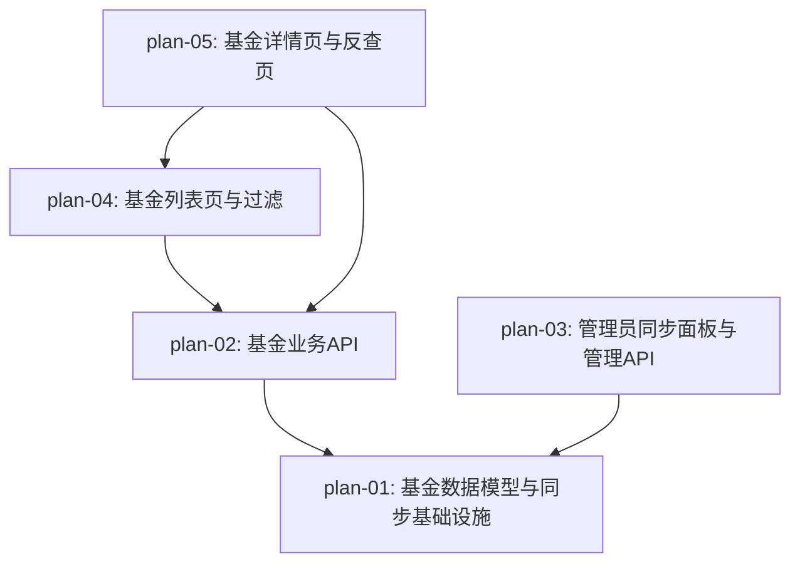

# 实现计划：A 股基金持仓分析

## 1. 概览

- **项目**: A 股基金持仓分析（04 期）
- **来源架构**: `docs/04-A股基金持仓分析/04-1-架构文档-A股基金持仓分析.md`（workflow_type: arch-gen / status: review_ready）
- **组织方式**: 功能维度（Feature-based）
- **项目类型**: brownfield
- **技术栈**:
  - 后端：Python 3.11 + FastAPI + SQLAlchemy async（asyncpg）+ Alembic + Tushare + 现有 AsyncTask 框架
  - 前端：Next.js 16 + React 19 + TypeScript + shadcn/ui + Tailwind v4 + SWR
  - 复用：TaskRegistry、TaskExecutor、BaseRepository、TushareDataSource、JWT 认证、RBAC
- **总阶段数**: 3
- **总功能数**: 5
- **最大并行度**: 2（Phase 2 plan-03 与 plan-04 可并行）
- **关键路径**: plan-01（数据层）→ plan-02（业务 API）→ plan-05（详情/反查页）

## 2. 输入摘要

### 2.1 核心闭环与目标

> 架构 §1.2：**核心闭环**：`Fund → Portfolio → Query`（基金信息 → 持仓入库 → 双向查询）

首版定位：在现有板块/个股行情分析基础上，新增"基金持仓分析"独立模块，提供基金基本信息、季度持仓明细、双向搜索（按基金搜 + 按股票反查）、管理端手动同步。

### 2.2 关键 ADR 与实施护栏

| ADR | 实施护栏（来自架构 §5） |
|-----|------------------------|
| ADR-1 数据源 Tushare | 沿用 `TushareDataSource`，新增 `get_fund_list(market)` 与 `get_fund_portfolio(period)`；不引入爬虫；积分要求 fund_basic≥2000、fund_portfolio≥5000 |
| ADR-2 两表平铺 | 新建 `Fund`、`FundPortfolio` 模型；建索引 `funds.ts_code` 唯一、`fund_portfolio(fund_ts_code, report_period)`、`fund_portfolio(stock_symbol, report_period)` |
| ADR-3 复用 AsyncTask | 在 `TaskType` 枚举新增 `SYNC_FUND_BASIC`、`SYNC_FUND_PORTFOLIO`；用 `@TaskRegistry.register` 注册 handler；不引入 Celery/Redis |
| ADR-4 持仓全量入库 | 采用"先 INSERT 新数据 → 再 DELETE 旧数据"策略，保证查询时刻总有数据；基本信息同步用 upsert |
| ADR-5 占净值比近似 | 字段 `stkMkvRatio` 直接映射 Tushare `stk_mkv_ratio`（占股票市值比） |
| ADR-6 前端独立路由 | 新建 `/dashboard/funds/` 路由模块（列表页、详情页 `[ts_code]`、反查页） |

### 2.3 现有代码快照

- 后端任务处理器位置：`server/src/services/task_handlers.py`（含 `TaskType` 枚举与 `@TaskRegistry.register` 装饰器）
- 后端 Repository 基类：`server/src/repositories/base.py`（`BaseRepository`）
- 后端 Tushare 客户端：`server/src/services/data_acquisition/tushare_client.py`（`TushareDataSource`）
- 后端管理端 init 模式：`server/src/api/admin/init.py`（参照 `POST /init/sectors` 模式）
- 前端 API 客户端：`web/src/lib/api.ts`（`ApiClient` 类）
- 前端 SWR hooks 模板：`web/src/hooks/useDataStatus.ts`、`web/src/hooks/useTaskStatus.ts`
- 前端管理端组件：`web/src/components/admin/DataInitPanel.tsx`、`web/src/components/admin/TaskMonitorPanel.tsx`
- 前端 dashboard 路由：`web/src/app/dashboard/sector-analysis/`（参考同级别独立模块）
- 前端数据层命名空间：`web/src/lib/api.ts` 中以 `xxxApi` namespace 风格组织
- 现有 Alembic 迁移：`server/alembic/versions/2025_01_20_0001.py`（参考命名与写法）

### 2.4 架构约束

- 后端路径别名：`server/src/...`
- 前端路径别名：`@/` → `web/src/`
- 认证 token 存 localStorage（`accessToken`、`tokenType`）；admin API 通过 `Depends(require_admin)` 强制 RBAC
- 异步任务轮询机制：`TaskExecutor`（`server/src/services/task_executor.py`），由任务类型字符串路由到注册 handler
- ORM 强制：所有 DB 操作走 SQLAlchemy 参数化查询，禁止字符串拼接

## 3. 验收标准追踪矩阵

| AC-ID | 需求原文 | 架构承接 | 计划承接 | 验证方式 | 当前状态 |
| --- | --- | --- | --- | --- | --- |
| AC-01 | 基金列表展示与搜索 | FundAPI + FundUI / 链路 6.1 | plan-02, plan-04 | plan-02 §5 业务 API 验收 + plan-04 §5 列表/搜索 E2E 验收 | planned |
| AC-02 | 基金过滤（市场 + 类型） | FundAPI + FundUI / 链路 6.1 | plan-02, plan-04 | plan-02 §5 过滤参数验收 + plan-04 §5 过滤交互 E2E 验收 | planned |
| AC-03 | 基金详情页展示最新持仓 | FundAPI + FundUI / 链路 6.2 | plan-02, plan-05 | plan-02 §5 持仓端点验收 + plan-05 §5 详情页 E2E 验收 | planned |
| AC-04 | 股票反查 | FundAPI + FundUI / 链路 6.3 | plan-02, plan-05 | plan-02 §5 反查端点验收 + plan-05 §5 反查页 E2E 验收 | planned |
| AC-05 | 数据缺失的透明呈现 | FundAPI + FundUI / 链路 6.2 | plan-05 | plan-05 §5 空数据分支 E2E 验收 | planned |
| AC-06 | 管理员手动同步基金数据 | FundAdminAPI + FundTaskHandler / 链路 6.4 | plan-01, plan-03 | plan-01 §5 task handler 执行验证 + plan-03 §5 同步面板 E2E 验收 | planned |
| AC-07 | 同步失败的可见提示 | FundAdminAPI + FundUI / 链路 6.4 | plan-01, plan-03 | plan-01 §5 失败分支执行验证 + plan-03 §5 失败弹窗 E2E 验收 | planned |

## 4. 模块地图

按功能聚合展示：

| 功能 | 包含模块 | 类型 | 对应文件 |
| --- | --- | --- | --- |
| plan-01 基金数据模型与同步基础设施 | FundDataService（含 get_fund_list / get_fund_portfolio）、FundTaskHandler、Fund 模型、FundPortfolio 模型 | backend | plan-01-基金数据模型与同步基础设施.md |
| plan-02 基金业务 API | FundAPI（4 个 GET 端点）、FundRepository | backend | plan-02-基金业务API.md |
| plan-03 管理员同步面板与管理 API | FundAdminAPI（2 个 POST 端点）、FundSyncPanel 组件、useFunds hooks | mixed | plan-03-管理员同步面板与管理API.md |
| plan-04 基金列表页与过滤 | FundListTable、FundSearchBar、FundFilterPanel、列表页路由 | frontend | plan-04-基金列表页与过滤.md |
| plan-05 基金详情页与反查页 | FundInfoCard、FundPortfolioTable、ReverseLookupTable、详情/反查页路由 | frontend | plan-05-基金详情页与反查页.md |

## 5. 依赖图



## 6. 阶段摘要

| 阶段 | 功能 | 描述 |
| --- | --- | --- |
| Phase 1 | plan-01 | 数据层 + 同步基础设施（Alembic 迁移 + Tushare 扩展 + 任务枚举 + handler） |
| Phase 2 | plan-02 | 业务 API（4 个 GET 端点 + FundRepository），强依赖 plan-01 |
| Phase 3 | plan-03 ∥ plan-04 | 管理端同步面板与基金列表页可并行（plan-03 仅依赖 plan-01，plan-04 依赖 plan-02） |
| Phase 4 | plan-05 | 详情页与反查页依赖 plan-02 + plan-04 |

## 7. 任务总览

| 功能 | 阶段 | 包含维度 | 依赖 | 独立验收标准 |
| --- | --- | --- | --- | --- |
| plan-01: 基金数据模型与同步基础设施 | Phase 1 | backend | 无 | Alembic 迁移成功；SYNC_FUND_BASIC/SYNC_FUND_PORTFOLIO 任务可被 TaskExecutor 调度并写入 funds/fund_portfolio 表；失败时 AsyncTask.result.error_message 有内容 |
| plan-02: 基金业务 API | Phase 1 | backend | plan-01 | 4 个 GET 端点（/funds、/funds/{ts_code}、/funds/{ts_code}/portfolio、/funds/reverse-lookup）返回稳定响应；分页/搜索/过滤/阈值过滤均符合 §6.1-6.3 实现原则 |
| plan-03: 管理员同步面板与管理 API | Phase 2 | mixed | plan-01 | 管理员登录后可见同步面板；点击"手动同步"或"同步指定报告期"触发任务，任务统计在同步记录表中展示；失败时弹窗展示错误原因 |
| plan-04: 基金列表页与过滤 | Phase 2 | frontend | plan-02 | 列表页加载 < 2s；搜索/过滤可同时生效；空列表/搜索无结果展示对应文案；点击基金进入详情页 |
| plan-05: 基金详情页与反查页 | Phase 3 | frontend | plan-02, plan-04 | 详情页基本信息卡 + 持仓表（按占净值比降序，前 20 条）；反查页按股票代码查询，列表按占净值比降序且仅显示 ≥1%；空持仓区分"未收录"与"未披露"两种文案 |

## 8. 未决策项

### 8.1 开发状态机

| FEAT | 当前步骤 | red_e2e | implement | green_e2e | review | 最近证据 | 阻塞原因 | 更新时间 |
| --- | --- | --- | --- | --- | --- | --- | --- | --- |
| plan-01 | done | waived | done | waived | done | 44 个后端测试全部通过（API+Admin） | - | 2026-06-03 |
| plan-02 | done | waived | done | waived | done | 4 端点验证通过 | - | 2026-06-03 |
| plan-03 | done | waived | done | waived | done | 后端 2 端点 + FundSyncPanel + AdminSidebar + fund-init 页 | - | 2026-06-03 |
| plan-04 | done | waived | done | waived | done | 列表页+搜索+过滤+分页+仪表盘入口，build 通过 | - | 2026-06-03 |
| plan-05 | done | waived | done | waived | done | 详情页+反查页+E2E specs 创建完成，build通过 | - | 2026-06-03 |

> plan-01 / plan-02 为纯后端功能（task handler / API 端点），无 UI E2E 入口，E2E 覆盖由 plan-03/04/05 的前端 E2E 间接保证。

### 8.2 未决策问题

| 编号 | 问题 | 影响功能 | 需要谁决策 | 阻塞等级 |
| --- | --- | --- | --- | --- |
| — | 无 | — | — | — |

> 架构文档 frontmatter `open_questions: []` 与正文 `5.x 待确认问题: 无` 同步；本计划无未决项。

## 9. 执行前置

### 9.1 环境准备

- PostgreSQL 实例已运行（项目 `docker-compose up postgres -d`）
- Tushare Token 已配置（`TUSHARE_TOKEN` 环境变量）
- Tushare 积分：fund_basic ≥ 2000、fund_portfolio ≥ 5000
- 后端开发环境：`cd server && uvicorn server.main:app --reload --port 8000`
- 前端开发环境：`cd web && npm run dev`（port 3000）
- 数据库迁移：`cd server && alembic upgrade head`

### 9.2 执行顺序

```
Phase 1:  plan-01（数据层 + 同步基础设施）→ plan-02（业务 API）
Phase 2:  plan-03（管理面板 + admin API）∥ plan-04（列表页 + 过滤）
Phase 3:  plan-05（详情页 + 反查页）
```

- plan-01 必须最先完成（其余功能均依赖）
- plan-02 完成后，plan-03 / plan-04 可并行启动
- plan-05 在 plan-02 与 plan-04 都完成后再开始（依赖列表页跳转入口与全部业务 API）

### 9.3 全局验证

所有功能完成后执行：

```bash
# 后端
cd server
pytest                                    # 全部单元/集成测试
alembic upgrade head                      # 迁移到最新
uvicorn server.main:app --port 8000       # 启动后端

# 前端
cd web
npm run lint                              # ESLint
npm run build                             # 生产构建
npm run test                              # Jest 单元测试

# E2E（自动覆盖 5 个 plan 的 e2e 用例；路径锚定 web/tests/e2e/）
cd web
pnpm e2e -- tests/e2e/fund-list.spec.ts
pnpm e2e -- tests/e2e/fund-detail.spec.ts
pnpm e2e -- tests/e2e/fund-reverse-lookup.spec.ts
pnpm e2e -- tests/e2e/admin-fund-sync.spec.ts

# 业务流端到端冒烟
# 1. 管理员登录 → 管理/数据采集/基金 → 点击手动同步 → 等待完成
# 2. 普通用户登录 → 基金分析 → 列表 → 搜索 → 详情 → 持仓展示
# 3. 普通用户 → 基金分析 → 反查 → 输入股票代码 → 列表展示
```

## 10. 变更记录

| 日期 | 变更类型 | 功能 | 说明 |
| --- | --- | --- | --- |
| 2026-06-03 | 新增 | plan-01~plan-05 | 由架构文档 `04-1-架构文档-A股基金持仓分析.md` 首次生成实现计划 |
| 2026-06-03 | 修复 | README | 修复 execution_order：plan-04 depends_on plan-02，不可同组并行；拆分为 4 组 |
| 2026-06-03 | 修复 | plan-01 | 修正 Fund 模型字段计数（11→13 个字段） |
| 2026-06-03 | 修复 | plan-02 | 空态元信息字段重命名：`latestPeriodExists`→`hasPortfolio`、`isPortfolioEmpty` 简化为 `total==0`；新增 `latestReportPeriod`；反查响应增加 `stockName`/`reportPeriod` 元信息；列表查询增加 L1 降级子查询说明 |
| 2026-06-03 | 修复 | plan-03 | 标注"同步今日新披露"为计划层新增；增加 L4 降级验收项 |
| 2026-06-03 | 修复 | plan-05 | 同步更新空态字段名、验收标准期望值、API 契约描述 |
| 2026-06-03 | 修复 | plan-02 | §6 Task 4 + §9 边界场景表清理残留的旧字段名 `latest_period_exists`，统一为 `isPortfolioEmpty/hasPortfolio/latestReportPeriod` |
| 2026-06-03 | 修复 | plan-02 | `PortfolioResponse` 元信息新增 `latestAnnDate` 字段（供 plan-05 详情页标题渲染"公告日"）；同步更新 §5 验收标准场景 A/B |
| 2026-06-03 | 修复 | plan-05 | 详情页标题文案补充"若 latestAnnDate 为 NULL 则省略片段"逻辑；E2E 强化"URL 含 `.` 正确解析"项 |
| 2026-06-03 | 修复 | plan-03 | 文件清单 useFunds.ts create 改为所有权声明（实际由 plan-04 创建） |
| 2026-06-03 | 修复 | plan-04 | §5 L1 降级验收指明消费 `hasPortfolio` 字段 |
| 2026-06-03 | 修复 | README | 锚定 E2E spec 路径到 `web/tests/e2e/`；`total_phases: 3 → 4`；§6 阶段摘要同步改 4 阶段 |
