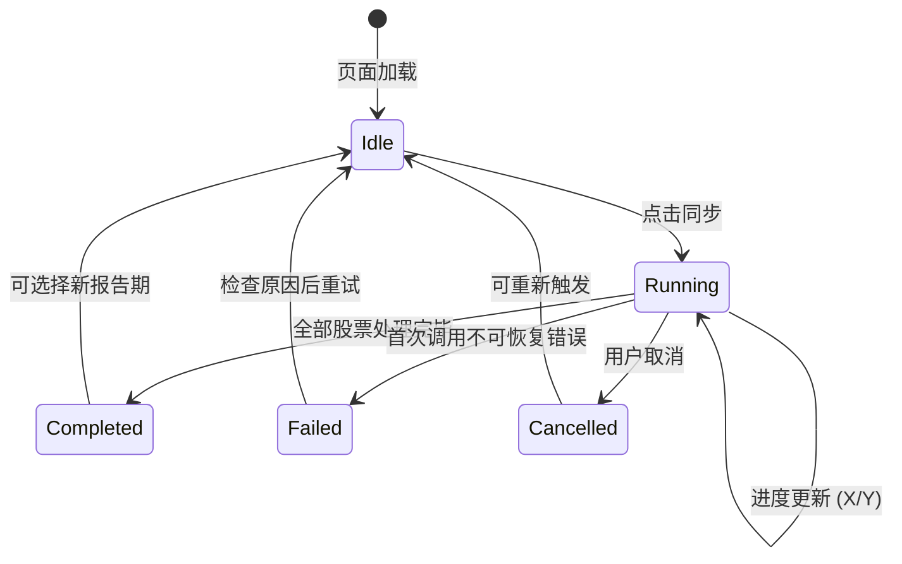
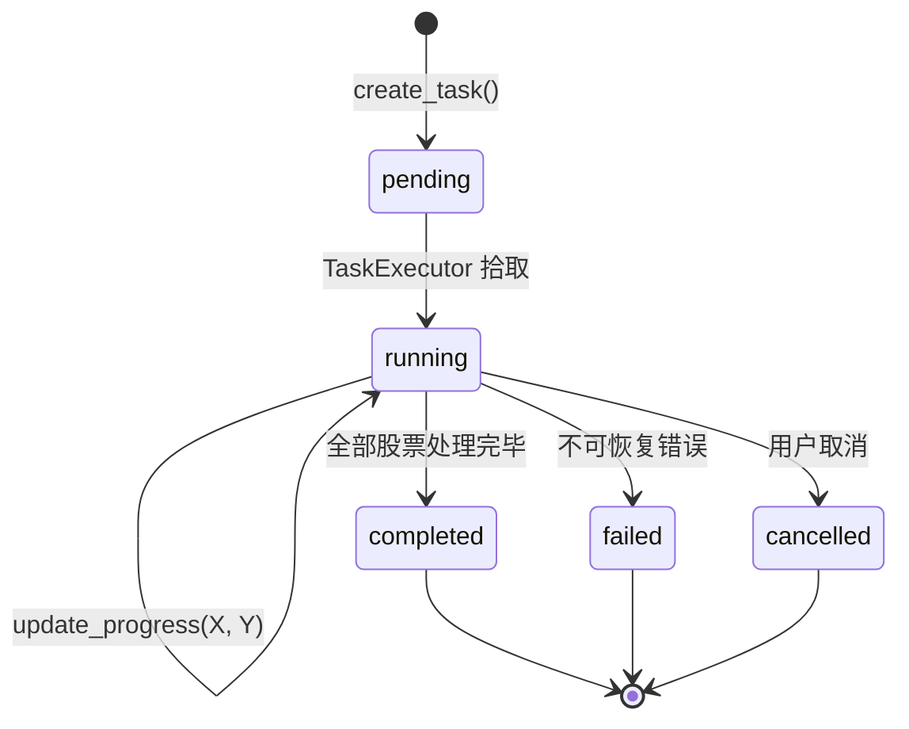

# 05-1 架构设计文档：股票十大流通股东同步

_本文件只保留当前版本真正影响实现的架构决策、边界和契约；DDL、目录树、环境变量、实施故事等内容默认不放入正文。_

## 1. 系统摘要

在现有行情分析和基金持仓两个数据维度基础上，新增"股票十大流通股东"数据采集能力。管理员选择报告期后触发全市场股票逐只同步，实时查看进度，数据可靠入库。本期聚焦数据基础设施，不做面向用户的前端展示。

**核心闭环**：选择报告期 → 逐股票同步 → 数据入库。

## 2. 范围、非目标与成功标准

### 2.1 范围

- 新建 `top10_float_holders` 数据表，存储每只股票每个报告期的前十大流通股东信息
- 在 TushareDataSource 中新增 `get_top10_float_holders(ts_code, period)` 方法，调用 Tushare `top10_floatholders` 接口
- 新建 `Top10HolderDataInitService`，实现逐股票遍历同步逻辑（含进度回调、取消检查、单只失败不中断）
- 在现有任务体系中注册 `SYNC_TOP10_HOLDERS` 任务类型和处理器
- 在管理后台 API 新增 `/admin/init/top10-holders` 端点
- 在前端 `DataInitPanel` 组件中嵌入"股票持仓同步"区块（报告期选择 + 同步按钮 + 进度条 + 统计结果）

### 2.2 明确不做

- 面向用户的十大流通股东展示页（列表、详情）
- 大户持仓分析功能（跨期对比、新进/增持/减持/退出标记）
- 股东维度聚合查询（如"哪些股票被社保基金持有"）
- 股东身份识别与分类标签
- 自动定时同步
- 前十大股东（非流通）数据
- 独立的 top10_holder Repository（首版无前端消费者，查询由 Service 直接执行）

### 2.3 成功标准

| 指标 | 首版目标 |
|------|---------|
| 触发同步 | 管理员能选择报告期并触发同步，任务正常创建并开始执行 |
| 数据入库 | 指定报告期全市场股票十大流通股东数据完整写入数据库 |
| 进度反馈 | 同步过程中前端实时显示已处理/总股票数 |
| 部分失败容错 | 单只股票获取失败不中断整体同步，失败股票单独记录 |
| 幂等性 | 同一报告期重复同步不产生重复数据 |

### 2.4 验收标准承接矩阵

| AC-ID | PRD 原文摘要 | 承接模块 | 关键链路 / 状态 | 风险 / 降级说明 |
|-------|-------------|---------|----------------|----------------|
| AC-01 | 管理员选择报告期并触发"股票持仓同步" | 前端 `DataInitPanel` + Admin API `/admin/init/top10-holders` | 用户点击同步 → API 创建 AsyncTask(status=pending) → TaskExecutor 拾取执行 | 需检查并发保护（同类型任务不可重复运行） |
| AC-02 | 数据完整入库（股票代码、公告日期、报告期、股东名称、持股数量、占比等） | `Top10HolderDataInitService` + Model `Top10FloatHolder` | 逐股票循环：调用 Tushare → 解析字段 → 写入 DB | Tushare `ts_code` 为必选参数，确认逐股票模式可行 |
| AC-03 | 同步过程中前端实时显示进度 | 前端轮询 `tasksApi.getTask()` + `TaskManager.update_progress()` | AsyncTask.progress/total 字段实时更新 → 前端 2s 轮询读取 | 轮询间隔 2s，进度粒度为"已处理 N 只股票" |
| AC-04 | 部分失败不中断 | `Top10HolderDataInitService` 异常捕获 | try/except 包裹单只股票逻辑，失败计入 `failed_stocks` 列表，循环继续 | 无降级，PRD 明确"任务最终完成（非失败）" |
| AC-05 | 同步完成展示统计 | 前端 `DataInitPanel` 展示区 + `TaskManager.log_message()` | 任务完成 → 前端轮询检测到 completed → 解析 result 展示统计 | 统计信息需写入 AsyncTask 的 result 或 log 中 |
| AC-06 | 幂等性：重复同步不产生重复数据 | `Top10HolderDataInitService` 先删后写策略 | 同步前先 DELETE 该股票该报告期的旧数据，再写入新数据 | 与基金持仓同步（04 期）策略一致，已验证可行 |
| AC-07 | 同步失败提示具体原因 | Admin API + 前端弹窗 | 不可恢复错误（认证/权限）→ 任务立即 failed → 前端弹窗展示 | Tushare `_execute_with_retry` 已有不可恢复错误识别机制 |

## 3. 用户流程与状态

### 3.1 主流程

1. 管理员进入"管理 / 数据管理"页面，切换到"数据初始化"tab
2. 在"股票持仓同步"区块选择报告期（如下拉选择 `2025-03-31`）
3. 点击"同步"按钮
4. 按钮变为"同步中…（X / Y）"并禁用，进度条和实时统计随同步推进更新
5. 同步完成，展示"新增 X 条 / 失败 Z 只股票"统计
6. 管理员在下方任务记录中确认本次执行结果

### 3.2 关键分支

| 分支名 | 入口/触发条件 | 架构处理方式 |
|--------|-------------|-------------|
| 部分股票失败 | Tushare 对某只股票返回异常（限流/超时/空数据） | Service 层 try/except 捕获，记录到 `failed_stocks` 列表，继续下一只；完成后统计中体现 |
| 任务立即失败 | 首次调用即返回认证错误或权限不足 | Tushare `_execute_with_retry` 的不可恢复错误机制立即抛异常，TaskExecutor 标记任务 failed |
| 重复触发 | 同一报告期重复点击同步 | 先删后写保证幂等；前端并发保护禁用按钮 |
| 已有同类任务 | 已有 `SYNC_TOP10_HOLDERS` 任务在 running | API 层查询并发保护，返回"已有任务正在运行" |

### 3.3 状态机



关键规则：
- Running 状态下按钮禁用，进度条实时更新
- Completed 包含"全部成功"和"部分失败"两种情况，通过统计字段区分
- Failed 仅在不可恢复错误时触发（认证/权限），部分股票失败不算 Failed

## 4. 系统上下文与模块职责

### 4.1 系统上下文

本功能嵌入现有管理后台"数据初始化"tab，与基金持仓同步（04 期）平级。外部依赖仅有 Tushare `top10_floatholders` 接口。

变更点：
- 新增 `Top10FloatHolder` 数据库表
- 新增 `Top10HolderDataInitService` 同步服务
- 新增 `SYNC_TOP10_HOLDERS` 任务类型
- 新增 Admin API 端点
- 扩展前端 `DataInitPanel` 组件

### 4.2 模块职责

| 模块 | 职责 | 上游输入 | 下游输出 |
|------|------|---------|---------|
| `Top10FloatHolder` Model | 十大流通股东数据持久化 | Service 写入 | DB 表 `top10_float_holders` |
| `TushareDataSource.get_top10_float_holders()` | 调用 Tushare `top10_floatholders` 接口获取单只股票数据 | ts_code + period | 原始 dict 列表 |
| `Top10HolderDataInitService` | 逐股票遍历同步的核心业务逻辑：遍历全市场股票、调用数据源、先删后写、进度上报 | stocks 表（在市股票列表）、Tushare 数据 | top10_float_holders 表 |
| `TaskHandlers.sync_top10_holders_task` | 将 Service 包装为异步任务处理器 | TaskManager (task_id, params) | TaskManager (进度、日志、结果) |
| Admin API `/admin/init/top10-holders` | 接收前端同步请求，创建 AsyncTask | 前端请求 (period) | AsyncTask 记录 + task_id |
| 前端 `DataInitPanel` 扩展 | 报告期选择、同步触发、进度展示、统计结果展示 | 用户交互 | API 调用 + UI 渲染 |

**复用声明验证**：
- `TaskExecutor` / `TaskManager` / `TaskRegistry`：复用现有异步任务框架。**验证**：基金持仓同步（04 期）已使用相同模式（`@TaskRegistry.register` + `_make_progress_callback` + `TaskManager.update_progress`），框架支持 30-60 分钟长时任务（基金持仓 timeout=28800s），十大流通股东预估 25-30 分钟，完全在框架能力范围内。
- `TushareDataSource._execute_with_retry`：复用重试和速率限制机制。**验证**：该方法为通用方法，接受任意 Callable，含指数退避重试（3 次）和不可恢复错误识别，适用于任意 Tushare API 调用。
- `DataInitPanel` 组件：在现有组件中新增区块，不创建独立页面。**验证**：组件已有任务轮询（2s interval）、进度条、任务历史等基础设施，新增区块复用同一套状态管理和 API 调用模式。

### 4.3 需要刻意避免的过度设计

- **不引入独立 Repository 层**：首版无前端消费者查询十大流通股东数据，Service 直接操作 Session 即可。待后续面向用户的展示页需求时再抽取。
- **不引入独立前端页面**：PRD 明确本期仅管理端入口，在 `DataInitPanel` 中嵌入区块即可。
- **不引入定时调度**：PRD 明确手动触发，不配置 APScheduler 定时任务。
- **不引入断点续传**：首版先删后写保证幂等性，重新触发同一报告期即等效于断点续传。单独的断点状态追踪增加复杂度但收益有限。
- **不按板块分批**：PRD 决策记录"若耗时过长可考虑按板块分批"，首版不做，先验证全量同步耗时是否可接受。

## 5. 关键架构决策（ADR）

### ADR-1：数据写入策略 — 先删后写（逐股票粒度）

- **选择**：每只股票同步前，先 DELETE 该股票在该报告期的旧数据，再写入新数据。
- **理由**：与 04 期基金持仓同步策略一致，已在生产验证。逐股票粒度的先删后写既能保证幂等性，又避免了全量删除导致的数据空窗期。不用 upsert 是因为 Tushare 返回的记录没有可靠的自然唯一键（同一股票同一报告期同一股东名可能有多条公告）。
- **风险与对策**：单只股票同步过程中断（进程崩溃）会导致该股票数据为空。对策：重新触发同步即可补齐。

### ADR-2：同步粒度 — 逐股票同步，每只股票独立 commit

- **选择**：遍历全市场在市股票，逐只调用 Tushare 获取数据，每只股票成功后立即 commit。
- **理由**：与 04 期基金持仓逐基金 commit 模式一致。每只股票独立 commit 可确保：已成功的股票数据不丢失，失败股票不影响后续处理，进度反馈粒度精确到"只"。
- **风险与对策**：commit 频率较高（5000+ 次）。PostgreSQL 单行写入性能足够，每次 commit 约 10 条记录（十大股东），不会造成性能瓶颈。

### ADR-3：前端集成方式 — 在 DataInitPanel 中嵌入独立区块

- **选择**：在现有 `DataInitPanel` 组件底部新增"股票持仓同步"区块（分隔线 + 报告期选择 + 同步按钮 + 上次同步信息 + 进度展示）。
- **理由**：PRD 明确在"数据初始化"tab 中新增入口，与现有按钮平级但不混在一起（因为需要报告期选择器）。不创建独立组件文件是因为区块逻辑较简单且与 DataInitPanel 的任务状态管理强耦合。不用独立页面是因为 PRD 未定义独立路由。
- **风险与对策**：DataInitPanel 组件代码量会增加。可接受，该组件本身就是数据初始化功能的聚合入口。

### ADR-4：报告期选择 — 最近 8 个季度下拉 + 手动输入

- **选择**：硬编码生成最近 8 个季度末日期（03-31/06-30/09-30/12-31）作为下拉选项，同时支持手动输入。
- **理由**：报告期是固定的季度末日期，不需要从数据库动态生成。8 个季度覆盖最近 2 年，满足当前需求。手动输入兜底处理更早的报告期。
- **风险与对策**：如果数据源的季报披露时间有特殊规则，可能需要调整。但 Tushare 的报告期格式是标准的 YYYYMMDD，不存在歧义。

### ADR-5：空数据正常化

- **选择**：Tushare 返回空数据（DataFrame 为空）视为正常，计入 `skipped` 而非 `failed`。
- **理由**：PRD 明确"某些股票在指定报告期可能尚未披露或数据源未收录，返回空数据属正常现象"。与 04 期基金持仓同步对空数据的处理一致。
- **演进余地**：后续如需区分"未披露"和"数据源缺失"，可在日志中记录具体原因。

### 5.x 待确认问题

无。关键假设已在 ADR 中记录：Tushare `top10_floatholders` 接口 `ts_code` 为必选参数（已通过 Tushare 官方文档确认）；全市场约 5000 只股票逐只获取，按 0.3s 间隔估算约 25 分钟（与 PRD 预估一致）。

## 6. 运行链路

### 6.1 触发同步任务

1. 前端渲染"股票持仓同步"区块，下拉框展示最近 8 个季度末日期，默认选中最近一个
2. 管理员选择报告期（如 `20250331`），点击"同步"按钮
3. 前端调用 `POST /admin/init/top10-holders`，请求体 `{ "period": "20250331" }`
4. 后端检查是否已有 `SYNC_TOP10_HOLDERS` 类型的 running/pending 任务（并发保护）
5. 若无冲突，通过 `TaskManager.create_task()` 创建 AsyncTask 记录（status=pending, params={"period": "20250331"}, timeout=3600）
6. 返回 `{ success: true, data: { task_id: "xxx" } }`
7. 前端收到 task_id，开始 2s 间隔轮询 `GET /admin/tasks/{task_id}`

实现原则：
- 并发保护查询与任务创建在同一 DB 事务中完成
- 超时设为 3600s（1 小时），留有余量（预估 25-30 分钟）

### 6.2 执行同步

1. `TaskExecutor` 轮询到 status=pending 的任务，标记为 running
2. 调用 `sync_top10_holders_task(task_id, params, manager)` 处理器
3. 处理器创建 `Top10HolderDataInitService` 实例，设置进度回调和取消检查
4. Service 执行 `sync_top10_holders(period)`：
   a. 查询 `stocks` 表中 `list_status IN ('L', 'M')` 的所有在市股票，获取 symbol + ts_code 列表
   b. 对 ts_code 为空的股票，通过 `_symbol_to_ts_code()` 转换（6→.SH, 0/3→.SZ, 8/4→.BJ）
   c. 初始化计数器：added=0, skipped=0, failed=0, failed_stocks=[]
   d. 遍历股票列表，每 50 只检查一次取消状态
   e. 对每只股票：
      - 调用 `tushare.get_top10_float_holders(ts_code, period)`，内部通过 `_execute_with_retry` 执行（含速率限制 0.3s + 指数退避重试 3 次）
      - 若返回空数据，skipped += 1，continue
      - 执行 DELETE：删除 `top10_float_holders` 中 `symbol=xxx AND report_period=period` 的记录
      - 解析返回数据，逐条创建 `Top10FloatHolder` 实例，add 到 Session
      - flush + commit
      - added += 实际写入条数
   f. 若单只股票抛异常：failed += 1，failed_stocks.append({symbol, reason})，continue
   g. 每处理 100 只股票或到达末尾时，调用进度回调更新 progress/total
5. 同步完成，返回 `{ added, skipped, failed, failed_stocks }`
6. 处理器将结果写入任务日志，TaskExecutor 标记任务 completed

实现原则：
- 股票列表查询：使用 `stocks` 表（而非重新从 Tushare 获取），确保只同步系统已收录的股票
- ts_code 转换：复用 `TushareDataSource._symbol_to_ts_code()` 静态方法
- 速率限制：通过 `_execute_with_retry` 内部的 `_enforce_rate_limit()` 控制，0.3s 间隔，无需额外限流
- 进度粒度：以"已处理股票数 / 总股票数"为单位，不细化到"条记录数"

### 6.3 前端进度展示

1. 前端 2s 轮询获取任务状态
2. `status === 'running'` 时，更新进度条：显示 `progress / total` 和百分比
3. `status === 'completed'` 时，解析任务日志中的统计信息，展示"新增 X 条 / 跳过 Y 只 / 失败 Z 只股票"
4. `status === 'failed'` 时，展示错误信息
5. 同时更新"上次同步信息"：显示最近一次成功同步的报告期、时间和记录数

实现原则：
- 进度信息从 AsyncTask 的 progress/total 字段读取
- 统计信息从 AsyncTask 的最新日志读取（或从 result JSON 字段读取）
- 同步中按钮禁用，防止重复触发

## 7. 领域对象与关键契约

### 7.1 核心对象

| 对象名 | Source of Truth | Owner | 用途 |
|--------|----------------|-------|------|
| `Top10FloatHolder` | `top10_float_holders` 表 | `Top10HolderDataInitService` | 存储十大流通股东数据 |
| `AsyncTask` | `async_tasks` 表 | `TaskManager` | 追踪同步任务状态和进度 |

### 7.2 推荐最小 Schema

```typescript
// 数据库表：top10_float_holders
interface Top10FloatHolder {
  id: number;                  // 自增主键
  symbol: string;              // 股票代码（纯数字，如 "600000"）
  ts_code: string;             // Tushare 代码（如 "600000.SH"）
  report_period: string;       // 报告期，YYYY-MM-DD
  ann_date: string | null;     // 公告日期，YYYY-MM-DD
  holder_name: string;         // 股东名称
  hold_amount: number | null;  // 持股数量（股）
  hold_ratio: number | null;   // 占总股本比例(%)
  hold_float_ratio: number | null; // 占流通股本比例(%)
  hold_change: number | null;  // 持股变动
  holder_type: string | null;  // 股东类型
  created_at: string;          // 创建时间
  updated_at: string | null;   // 更新时间
}

// 同步结果
interface SyncTop10HoldersResult {
  added: number;               // 新增记录数
  skipped: number;             // 跳过的股票数（无数据）
  failed: number;              // 失败的股票数
  failed_stocks: Array<{       // 失败股票详情
    symbol: string;
    reason: string;
  }>;
}

// API 请求
interface SyncTop10HoldersRequest {
  period: string;              // 报告期，YYYYMMDD（如 "20250331"）
}
```

### 7.3 API 边界

| 接口路径 | 方法 | 用途 | 说明 |
|---------|------|------|------|
| `/admin/init/top10-holders` | POST | 触发同步 | 请求体 `{ period: "20250331" }`（user_input）。并发保护：已有同类型 running 任务时返回失败。返回 `{ task_id }` |
| `/admin/tasks/{task_id}` | GET | 查询任务状态（复用现有） | 前端轮询获取 progress/total/status。已有端点，不需新建 |
| `/admin/tasks/{task_id}/cancel` | POST | 取消任务（复用现有） | 已有端点，不需新建 |

### 7.4 状态流转



### 7.5 数据边界

| 存储层 | 职责 |
|--------|------|
| PostgreSQL `top10_float_holders` 表 | 十大流通股东数据的唯一 Source of Truth |
| PostgreSQL `async_tasks` 表 | 任务状态、进度、日志 |
| PostgreSQL `stocks` 表 | 同步时读取在市股票列表（只读） |
| Tushare API | 外部数据源，只读 |

### 7.6 命名与标识规则

| 维度 | 规则 |
|------|------|
| 表名 | `top10_float_holders`（snake_case） |
| Model 类名 | `Top10FloatHolder`（PascalCase） |
| 任务类型常量 | `SYNC_TOP10_HOLDERS`（UPPER_SNAKE_CASE） |
| API 路径 | `/admin/init/top10-holders`（kebab-case） |
| 前端任务类型 | `'sync_top10_holders'`（snake_case，与后端 TaskType.value 一致） |
| 报告期格式 | 后端 API 入参 `YYYYMMDD`，数据库存储 `YYYY-MM-DD`（Date 类型） |
| 股票代码 | `symbol` = 纯数字（如 "600000"），`ts_code` = Tushare 格式（如 "600000.SH"） |

术语映射：
- "十大流通股东" = `Top10FloatHolder` / `top10_float_holders`
- "股票持仓同步"（PRD UI 文案）= 后端 `SYNC_TOP10_HOLDERS` 任务
- 报告期（PRD）= `period`（API 参数）/ `report_period`（数据库字段）

## 8. 非功能需求、风险与运行策略

### 8.1 性能与吞吐量目标

| 指标 | 目标 | 预期 |
|------|------|------|
| 全量同步耗时 | ≤ 35 分钟 | ~5000 只股票 × 0.3s 间隔 ≈ 25 分钟，含重试余量 |
| 前端进度刷新延迟 | ≤ 3 秒 | 2s 轮询间隔 |
| API 响应时间 | ≤ 500ms | 仅创建任务，不含同步执行 |

### 8.2 可靠性、错误处理与降级策略

**错误处理层级**：
1. **Tushare API 调用级别**：`_execute_with_retry` 处理可恢复错误（超时、限流），指数退避重试 3 次；不可恢复错误（认证/权限）立即抛出
2. **单只股票级别**：try/except 捕获，记录到 `failed_stocks`，continue 处理下一只
3. **任务级别**：TaskExecutor 检测超时和异常，标记任务 failed/重试

**降级策略**：
- Tushare API 不可用 → 单只股票失败，不影响其他股票 → 最终统计体现失败数 → 管理员可重新触发
- Tushare 认证失败 → 任务立即 failed → 前端弹窗展示错误信息
- 进程崩溃 → 已 commit 的股票数据不丢失 → 重新触发同步补齐

### 8.3 安全与反滥用策略

| 项目 | 首版策略 |
|------|---------|
| API 权限 | 复用 `require_admin` 依赖，仅管理员可触发 |
| Tushare Token | 服务端持有，不暴露给前端 |
| 输入校验 | period 字段通过 Pydantic `pattern=r"^\d{8}$"` 校验 |

### 8.4 成本控制预期

| 模块 | 预估单次成本 | 首版控制策略 |
|------|-------------|-------------|
| Tushare API 调用 | ~5000 次/次同步 | 速率限制 0.3s/次，无额外成本（需 2000+ 积分） |
| 数据库存储 | ~50,000 条/次同步（5000 股 × 10 股东） | 单条记录约 200 字节，单次同步约 10MB，可接受 |

### 8.5 可观测性

- **任务日志**：通过 `TaskManager.log_message()` 记录关键节点（开始、每 100 只股票进度、完成统计、失败详情）
- **进度追踪**：AsyncTask 的 progress/total 字段，前端 2s 轮询读取
- **错误记录**：failed_stocks 列表写入任务日志，包含股票代码和失败原因
- **后端日志**：Service 层通过 Python logging 记录 warning/error 级别日志

### 8.6 主要风险

| 风险 | 影响 | 缓解方式 |
|------|------|---------|
| Tushare 积分不足（需 2000+） | 无法调用 `top10_floatholders` 接口 | 同步前检查首次调用结果，若为权限错误则任务立即 failed 并提示 |
| 全量同步耗时超预期（>35 分钟） | 用户体验差，可能超时 | 设置 timeout=3600s（1 小时），进度实时反馈缓解等待焦虑 |
| 数据源返回字段变更 | 解析失败 | `_parse_float` / `_parse_date` 已有空值容错，未知字段跳过 |
| 某些股票 ts_code 为空 | 无法调用 Tushare 接口 | 通过 `_symbol_to_ts_code()` 转换，无法转换的跳过并记录 |

## 9. 实施方案

### Phase A：后端数据层

**1. 数据库 Model**

- `server/src/models/top10_float_holder.py` — 新建 Model：
  - 字段：id, symbol, ts_code, report_period(Date), ann_date(Date), holder_name, hold_amount(Numeric), hold_ratio(Numeric), hold_float_ratio(Numeric), hold_change(Numeric), holder_type(String), created_at, updated_at
  - 索引：`(symbol, report_period)` 联合索引，`report_period` 单独索引

- `server/src/models/__init__.py` — 注册新 Model

- `server/alembic/` — 生成并执行数据库迁移

**2. 数据源扩展**

- `server/src/services/data_acquisition/tushare_client.py` — 新增方法：
  - `get_top10_float_holders(self, ts_code: str, period: str) -> List[dict]`
  - 调用 `pro.top10_floatholders(ts_code=ts_code, period=period)`
  - 通过 `_execute_with_retry` 包裹
  - 返回 dict 列表，字段：ts_code, ann_date, end_date, holder_name, hold_amount, hold_ratio, hold_float_ratio, hold_change, holder_type

验证目标：Model 可正常迁移，`get_top10_float_holders("600000.SH", "20241231")` 能返回有效数据。

### Phase B：后端服务与任务

**3. 同步服务**

- `server/src/services/data_init_top10_holder.py` — 新建 Service：
  - `Top10HolderDataInitService(session)` 构造函数
  - `set_progress_callback(callback)` / `set_cancel_check(check)` 复用 04 期模式
  - `sync_top10_holders(period: str) -> SyncTop10HoldersResult` 核心方法
  - 参考 `FundDataInitService.sync_fund_portfolio()` 实现：查 stocks 表 → 逐股票循环 → 先删后写 → 每 100 只更新进度 → 异常捕获
  - `_parse_date` / `_parse_float` / `_parse_period_to_date` 工具方法

**4. 任务注册**

- `server/src/services/task_handlers.py` — 新增：
  - `TaskType.SYNC_TOP10_HOLDERS = "sync_top10_holders"`
  - `@TaskRegistry.register(TaskType.SYNC_TOP10_HOLDERS)` 装饰的 `sync_top10_holders_task()` 处理函数
  - 更新 `__all__` 列表

验证目标：通过 Admin API 创建任务，TaskExecutor 能正确拾取并执行，进度字段实时更新。

### Phase C：管理端 API 与前端

**5. Admin API**

- `server/src/api/admin/init_top10_holders.py` — 新建路由文件：
  - `POST /init/top10-holders` 端点
  - 并发保护检查
  - `InitTop10HoldersRequest(period: str)` 请求模型

- `server/src/api/admin/__init__.py` — 注册新路由

**6. 前端**

- `web/src/components/admin/DataInitPanel.tsx` — 扩展：
  - 在组件底部新增"股票持仓同步"区块（分隔线 + 报告期下拉 + 同步按钮 + 上次同步信息）
  - 报告期选项：硬编码最近 8 个季度末日期，默认选中最近一个
  - 同步按钮：调用 `adminApi.initTop10Holders(period)` 或直接用 `tasksApi.createTask({ task_type: 'sync_top10_holders', params: { period } })`
  - 进度展示：复用现有 activeTask 轮询逻辑
  - 统计展示：任务完成后解析 result 展示"新增 X 条 / 跳过 Y 只 / 失败 Z 只股票"
  - "上次同步信息"：从最近一条 `sync_top10_holders` 类型的 completed 任务中读取

- `web/src/lib/api.ts` — 新增 API 方法（如使用 adminApiClient 直接调用）

验证目标：管理员能在前端选择报告期 → 触发同步 → 看到实时进度 → 同步完成后看到统计结果。

## 10. 架构结论

本期架构的核心判断是**最大程度复用 04 期基金持仓同步的基础设施**——异步任务框架（TaskRegistry / TaskExecutor / TaskManager）、Tushare 重试机制、前端任务轮询模式。十大流通股东同步与基金持仓同步在模式上高度一致（逐实体遍历 + 先删后写 + 单条失败不中断），唯一差异是遍历粒度从"基金"变为"股票"。

设计原则：
- 先删后写保证幂等性，不引入额外的去重逻辑
- 逐股票 commit 确保部分成功的数据不丢失
- 空数据正常化，避免误报失败
- 前端嵌入现有组件，不创建新页面

演进方向：
- 同步可靠性验证通过后，进入面向用户的展示页迭代
- 后续可新增"前十大股东"（非流通）任务类型
- 长期可引入股东身份识别、跨期对比分析等高级功能
