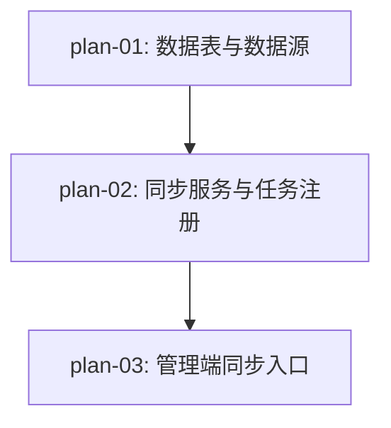

# 实现计划：股票十大流通股东同步

## 1. 概览

- **项目**: Sector Strength — 股票十大流通股东同步（05 期）
- **来源架构**: `docs/05-股票十大流通股东同步/05-1-架构文档-股票十大流通股东同步.md`
- **组织方式**: 功能维度（Feature-based）
- **项目类型**: Brownfield（在现有行情分析和基金持仓基础上扩展）
- **技术栈**: FastAPI + SQLAlchemy async (后端) / Next.js 16 + React 19 + TypeScript (前端)
- **总阶段数**: 3
- **总功能数**: 3
- **最大并行度**: 1（严格串行，后端数据层 → 同步服务 → 管理端入口）
- **关键路径**: plan-01 → plan-02 → plan-03

## 2. 输入摘要

### 2.1 核心闭环与目标

管理员选择报告期 → 触发全市场股票逐只同步十大流通股东数据 → 实时查看进度 → 数据可靠入库。本期聚焦数据基础设施，不做面向用户的前端展示。

核心能力：在现有异步任务框架中新增 `SYNC_TOP10_HOLDERS` 任务类型，遍历全市场 ~5000 只在市股票，逐只调用 Tushare `top10_floatholders` 接口获取前十大流通股东数据，先删后写保证幂等性，逐股票 commit 确保部分成功不丢失。

### 2.2 关键 ADR 与实施护栏

| ADR | 决策 | 实施护栏 |
|-----|------|---------|
| ADR-1 | 先删后写（逐股票粒度），保证幂等 | 每只股票同步前 DELETE 该股票该报告期旧数据，再写入；不用 upsert |
| ADR-2 | 逐股票同步，每只股票独立 commit | 已 commit 数据不因后续失败而丢失；commit 粒度为每只股票（~10 条记录） |
| ADR-3 | 前端在"数据初始化"tab 内嵌入独立区块 | 遵循现有 FundSyncPanel 组件模式，创建 StockTop10SyncPanel |
| ADR-4 | 报告期为最近 8 个季度下拉 + 手动输入 | 硬编码生成季度末日期，不依赖数据库查询 |
| ADR-5 | 空数据正常化，计入 skipped 非 failed | Tushare 返回空 DataFrame 视为正常，不误报失败 |

### 2.3 现有代码快照

本期高度复用 04 期基金持仓同步的基础设施，关键参考文件：

| 层 | 参考文件 | 复用模式 |
|---|---------|---------|
| Model | `server/src/models/fund_portfolio.py` | 表结构设计（report_period, ann_date, 占比字段） |
| Tushare 客户端 | `server/src/services/data_acquisition/tushare_client.py` | `_execute_with_retry` + 速率限制（0.3s） |
| 同步服务 | `server/src/services/data_init_fund.py` | 逐实体遍历 + 先删后写 + 进度回调 + 取消检查 |
| 任务注册 | `server/src/services/task_handlers.py` | `TaskType` 枚举 + `@TaskRegistry.register` 装饰器 |
| Admin API | `server/src/api/admin/init_funds.py` | 并发保护 + 任务创建 + 参数校验 |
| 前端面板 | `web/src/components/admin/FundSyncPanel.tsx` | 报告期选择 + 任务轮询 + 进度条 + 统计展示 |

### 2.4 架构约束

- **数据源约束**：Tushare `top10_floatholders` 接口 `ts_code` 为必选参数，无法按报告期批量拉取，必须逐只股票请求
- **耗时约束**：全量同步约 25-30 分钟（5000 股 × 0.3s 间隔），需 timeout=3600s
- **任务框架约束**：复用现有 AsyncTask / TaskExecutor / TaskManager，不引入新的任务调度机制
- **前端约束**：嵌入现有"数据初始化"tab，不创建独立页面

## 3. 验收标准追踪矩阵

| AC-ID | 需求原文 | 架构承接 | 计划承接 | 验证方式 | 当前状态 |
| --- | --- | --- | --- | --- | --- |
| AC-01 | 管理员选择报告期并触发"股票持仓同步" | 前端 DataInitPanel + Admin API `/admin/init/top10-holders` | plan-03 | plan-03 §5 验收标准：API 返回 task_id + 前端按钮状态变更 | planned |
| AC-02 | 指定报告期全市场股票十大流通股东数据完整入库 | Top10HolderDataInitService + Model Top10FloatHolder | plan-01, plan-02 | plan-01 §5（Model + 迁移）+ plan-02 §5（执行验证：触发任务 → 查询 DB 确认数据写入） | planned |
| AC-03 | 同步过程中前端实时显示进度 | 前端轮询 + TaskManager.update_progress() | plan-03 | plan-03 §5 验收标准：进度条显示 X/Y 并实时更新 | planned |
| AC-04 | 部分失败不中断，失败股票单独记录 | Top10HolderDataInitService 异常捕获 | plan-02 | plan-02 §5 执行验证：模拟单只股票失败 → 任务完成 → 统计含失败数 | planned |
| AC-05 | 同步完成展示统计（新增/失败数量） | 前端 DataInitPanel 展示区 + TaskManager.log_message() | plan-03 | plan-03 §5 验收标准：任务完成后 UI 展示统计数字 | planned |
| AC-06 | 幂等性：重复同步不产生重复数据 | Top10HolderDataInitService 先删后写 | plan-02 | plan-02 §5 执行验证：同一报告期同步两次 → 记录数一致 | planned |
| AC-07 | 同步失败提示具体原因 | Admin API + 前端弹窗 | plan-02, plan-03 | plan-02 §5（任务级失败标记）+ plan-03 §5（前端错误展示） | planned |

## 4. 模块地图

按功能聚合展示：

| 功能 | 包含模块 | 类型 | 对应文件 |
| --- | --- | --- | --- |
| plan-01: 数据表与数据源 | Top10FloatHolder Model, TushareDataSource.get_top10_float_holders() | service / data | plan-01-数据表与数据源.md |
| plan-02: 同步服务与任务注册 | Top10HolderDataInitService, sync_top10_holders_task handler, TaskType.SYNC_TOP10_HOLDERS | service | plan-02-同步服务与任务注册.md |
| plan-03: 管理端同步入口 | Admin API `/admin/init/top10-holders`, StockTop10SyncPanel 组件, top10-holder-init 独立页面 | mixed (API + UI) | plan-03-管理端同步入口.md |

## 5. 依赖图



严格串行：plan-01 提供数据表和 Tushare 方法 → plan-02 基于此构建同步服务和任务处理器 → plan-03 暴露 API 和 UI。

## 6. 阶段摘要

| 阶段 | 功能 | 预期产出 |
| --- | --- | --- |
| Phase 1 | plan-01: 数据表与数据源 | 数据库有 `top10_float_holders` 表；`get_top10_float_holders()` 方法可返回有效数据 |
| Phase 2 | plan-02: 同步服务与任务注册 | 通过 Admin Tasks API 创建任务后，TaskExecutor 能正确执行同步，数据写入 DB，进度实时更新 |
| Phase 3 | plan-03: 管理端同步入口 | 管理员可通过 AdminSidebar 导航至"股票持仓同步"页面 → 选择报告期 → 触发同步 → 看到实时进度 → 同步完成后看到统计 |

## 7. 任务总览

### 7.1 功能列表

| 功能 | 阶段 | 包含维度 | 依赖 | 独立验收标准 |
| --- | --- | --- | --- | --- |
| plan-01: 数据表与数据源 | Phase 1 | backend | 无 | 迁移成功，Tushare 单股查询返回有效数据 |
| plan-02: 同步服务与任务注册 | Phase 2 | backend | plan-01 | 任务执行验证通过：创建任务 → 执行完成 → DB 有数据 |
| plan-03: 管理端同步入口 | Phase 3 | mixed | plan-02 | 前端可触发同步、显示进度、展示统计；API 并发保护生效；AdminSidebar 导航正常 |

### 7.2 开发状态机

| FEAT | 当前步骤 | red_e2e | implement | green_e2e | review | 最近证据 | 阻塞原因 | 更新时间 |
| --- | --- | --- | --- | --- | --- | --- | --- | --- |
| plan-01 | done | waived | done | waived | waived | Model+Tushare方法已验证 | - | 2026-06-09 |
| plan-02 | done | waived | done | waived | waived | Service+TaskHandler已验证 | - | 2026-06-09 |
| plan-03 | done | waived | done | waived | waived | API+前端组件+页面+导航已验证 | - | 2026-06-09 |

## 8. 未决策项

无。架构文档 §5.x 已确认所有关键假设（Tushare `top10_floatholders` 接口 `ts_code` 必选、全市场约 5000 只股票、0.3s 间隔估算约 25 分钟）。

## 9. 执行前置

### 9.1 环境准备

- PostgreSQL 运行中（`docker-compose up postgres -d`）
- 后端 Python 环境就绪（`server/` 目录）
- 前端 Node 环境就绪（`web/` 目录，`npm install` 已执行）
- Tushare Token 有效且积分 ≥ 2000（调用 `top10_floatholders` 需要）
- 已有基金持仓同步功能正常运行（04 期基线）

### 9.2 执行顺序

严格按 Phase 1 → Phase 2 → Phase 3 串行执行。每个 Phase 内按 Task 列表顺序执行。

- **Phase 1 完成标志**：`alembic upgrade head` 成功 + `get_top10_float_holders("600000.SH", "20241231")` 返回有效数据
- **Phase 2 完成标志**：通过 Admin Tasks API 创建 sync_top10_holders 任务，TaskExecutor 执行完成，DB 有数据
- **Phase 3 完成标志**：前端 `npm run build` 通过 + 管理员可从 AdminSidebar 导航至"股票持仓同步"页面并完成完整同步流程

### 9.3 全局验证

所有功能完成后执行：

```bash
# 后端
cd server && alembic upgrade head
cd server && pytest -m "not slow" -x

# 前端
cd web && npm run build
cd web && npm run lint

# 端到端验证（手动）
# 1. 启动后端：cd server && uvicorn server.main:app --reload --port 8000
# 2. 启动前端：cd web && npm run dev
# 3. 登录管理后台，通过 AdminSidebar 进入"股票持仓同步"页面
# 4. 选择报告期，点击"同步"，观察进度和统计
# 5. 重复同步同一报告期，确认数据不重复（幂等性）
```

## 10. 变更记录

| 日期 | 变更类型 | 功能 | 说明 |
| --- | --- | --- | --- |
| 2026-06-08 | 新增 | plan-01, plan-02, plan-03 | 初版生成，3 阶段 3 功能 |
| 2026-06-09 | 修订 | plan-03, README | dev-plan-check 后修正：前端集成路径改为独立页面 + Sidebar 导航（对齐 brownfield FundSyncPanel 模式）；补充 ADR-3 偏差说明；验证命令补充 token 获取方式 |

<!-- 保留目录：reviews/。当 task-review、dev-plan-check 等开始运行时创建。 -->
