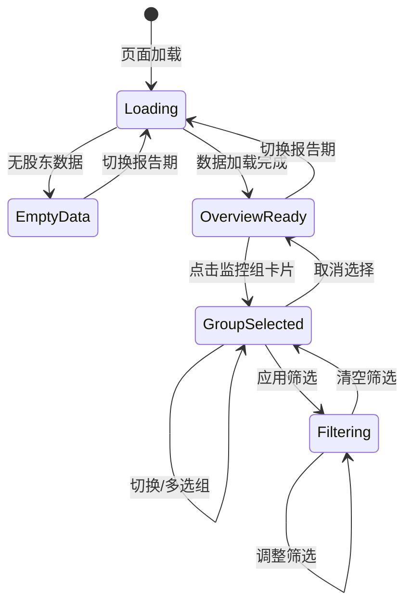

# 06-1 架构设计文档：股东分析面板

_本文件只保留当前版本真正影响实现的架构决策、边界和契约；DDL、目录树、环境变量、实施故事等内容默认不放入正文。_

## 1. 系统摘要

在 05 期十大流通股东数据同步的基础上，新增面向用户的"股东分析面板"。系统通过关键词匹配规则将股东归类到监控组（国家队、外资投行、社保等），按组展示持仓汇总、行业分布和变动趋势，支持按监控组查询持仓股票并按行业/变动方向筛选。管理员可在后台增删改监控组及其匹配规则。

**核心闭环**：Group → Match → Aggregate → Query（分组定义 → 关键词匹配 → 持仓聚合 → 筛选查询）。

## 2. 范围、非目标与成功标准

### 2.1 范围

- **监控组管理**：预定义核心监控组（国家队、社保、外资投行、保险公司、私募基金），每组包含股东名称匹配关键词，管理员可在后台增删改
- **股东分析面板页**：面向用户的独立页面（`/dashboard/shareholder-analysis`），展示报告期选择器、监控组概览卡片、持仓详情区
- **监控组概览**：每张卡片显示组名、持仓股票数、增持/减持/新进/退出数量
- **持仓详情查询**：选中监控组后展示汇总统计、行业分布（水平条形图）、变动趋势、持仓股票列表（分页）
- **筛选**：支持按行业、变动方向筛选持仓股票，筛选后汇总统计联动更新
- **管理后台页面**：新增"股东分组管理"Tab，支持分组列表、新增/编辑/删除、匹配规则编辑和匹配预览

### 2.2 明确不做

- 个股维度十大流通股东详情页
- 股东跨多报告期详细持仓时间线
- 股东关联关系分析
- 用户侧自定义监控组创建
- 持仓变动预警通知
- 个股详情页跳转
- 自动定时同步监控组数据（数据来自 05 期同步的 top10_float_holders 表）
- 监控组匹配结果的预计算/物化视图

### 2.3 成功标准

| 指标 | 首版目标 |
|------|---------|
| 监控组概览展示 | 功能正常完成，所有预定义分组卡片正确展示持仓统计和变动趋势 |
| 持仓详情查询 | 选中监控组后正确展示汇总、行业分布、变动趋势和股票列表 |
| 多组联合查询 | 选中多个组后正确合并展示（去重） |
| 行业/变动方向筛选 | 筛选后股票列表和汇总统计联动更新 |
| 管理员管理分组 | 增删改分组和规则后，用户侧实时生效 |
| 空状态处理 | 数据未同步时展示明确提示 |
| 概览页加载 | < 3s（单报告期全量聚合） |
| 持仓列表加载 | < 2s（分页 page_size=20） |

### 2.4 验收标准承接矩阵

| AC-ID | PRD 原文摘要 | 承接模块 | 关键链路 / 状态 | 风险 / 降级说明 |
|-------|-------------|---------|----------------|----------------|
| AC-01 | 监控组概览展示 | 前端 `ShareholderAnalysisPage` + API `/shareholder-analysis/overview` | 页面加载 → 调用 overview API（默认最新报告期）→ 渲染卡片 | 首次加载需聚合全部分组数据，关注查询性能 |
| AC-02 | 监控组持仓详情查询 | 前端 `HoldingsDetail` + API `/shareholder-analysis/summary` + `/industry-distribution` + `/holdings` | 点击卡片 → 并行调用 3 个接口 → 渲染汇总/行业分布/股票列表 | 行业分布依赖 sector_stocks 关联数据完整性 |
| AC-03 | 多监控组联合查询 | 前端多选交互 + API `group_ids` 参数 | 多卡片高亮 → 3 个接口传入多个 group_id → 后端 UNION 匹配结果去重 | 同一股东可能匹配多个组，需按 (symbol, holder_name) 去重 |
| AC-04 | 行业筛选 | 前端筛选栏 + summary/holdings API `industry` 参数 | 选择行业 → 重发 summary + holdings → 股票列表和汇总统计联动更新 | industry-distribution 不受 industry 筛选影响（自身是筛选 UI 数据源） |
| AC-05 | 变动方向筛选 | 前端筛选栏 + 3 个 API `change_direction` 参数 | 选择变动方向 → 重发 3 个接口 → 股票列表过滤 | "退出"股票不在当前期持仓表中，需额外查询上期匹配但当前期不存在的股票，展示其上期持股数据 |
| AC-06 | 管理员新增监控组 | Admin API `POST /shareholder-groups` + 前端 `GroupManagementPanel` | 填写组名/关键词 → 保存 → 用户侧可见 | 保存后实时生效，无需刷新缓存 |
| AC-07 | 管理员编辑匹配规则 | Admin API `PATCH /shareholder-groups/{id}` | 编辑关键词 → 保存 → 匹配规则更新 | 规则变更后下次查询即生效 |
| AC-08 | 数据未同步空状态 | 前端空状态判断 | overview API 返回空 → 前端展示"暂无股东数据"提示 | 后端检测 top10_float_holders 表是否有数据 |
| AC-09 | 报告期切换 | 前端报告期下拉 + API `report_period` 参数 | 切换报告期 → 重新调用 overview/holdings API | 每个报告期独立聚合计算 |
| AC-10 | 管理员删除监控组 | Admin API `DELETE /shareholder-groups/{id}` | 删除确认 → API 调用 → 用户侧不再展示 | 系统预定义组也可删除 |
| AC-11 | 报告期数据不完整降级 | 后端降级逻辑 + 前端提示 | 上期数据缺失 → 变动趋势提示"暂不可用"，股票列表"较上期"列显示"—" | 前端通过 API 返回的 `has_prev_period` 标志判断 |

## 3. 用户流程与状态

### 3.1 主流程

**流程 A：用户查看监控组持仓分析**

1. 用户从导航栏进入"股东分析"页面
2. 页面加载，报告期下拉默认选中最新有数据的报告期
3. 页面顶部展示监控组概览卡片（按持仓股票数降序），每张卡片显示组名、持仓数、增持/减持/新进/退出数量
4. 用户点击一个或多个监控组卡片（卡片高亮选中态）
5. 下方持仓详情区加载：汇总统计 + 行业分布条形图 + 变动趋势 + 股票列表
6. 用户可通过行业下拉或变动方向下拉筛选，股票列表和汇总统计联动更新
7. 用户可切换报告期，页面数据刷新

**流程 B：管理员管理监控组**

1. 管理员进入"管理后台 → 股东分组管理"Tab
2. 查看分组列表（组名、描述、规则数、匹配股数）
3. 点击"新增分组"或"编辑"按钮，打开编辑表单
4. 编辑组名、描述、匹配关键词（可添加/删除关键词）
5. 表单展示预览匹配股数
6. 保存，返回列表页

### 3.2 关键分支

| 分支名 | 入口/触发条件 | 架构处理方式 |
|--------|-------------|-------------|
| 数据未同步 | top10_float_holders 表无任何数据 | overview API 返回空列表 + `has_data: false`，前端展示全页空状态 |
| 无上期数据 | 当前报告期有数据但上一报告期无数据 | overview/holdings API 返回 `has_prev_period: false`，变动趋势标记"暂不可用"，较上期列显示"—" |
| 无匹配分组 | 数据已同步但无监控组 | overview API 返回空 groups 列表，前端提示"暂无监控组" |
| 选中组无持仓 | 监控组存在但当前期无匹配 | holdings API 返回空列表 + 零统计，前端展示"该组暂无持仓数据" |
| 无行业数据 | 股票未关联行业板块 | 行业列显示"—"，行业分布中归入"未分类" |
| 删除系统预定义组 | 管理员删除 is_system=true 的组 | 允许删除（PRD 未限制），前端弹出二次确认 |
| 股东匹配多组 | 同一股东名称匹配多个组的关键词 | 多组联合查询时按 (symbol, holder_name) 去重 |

### 3.3 状态机

页面交互状态：



关键规则：
- 切换报告期触发全页重新加载（overview + holdings）
- 选择/取消监控组仅刷新持仓详情区
- 筛选条件仅在已选组时可用

## 4. 系统上下文与模块职责

### 4.1 系统上下文

本功能嵌入现有系统，复用 05 期入库的 `top10_float_holders` 数据，不引入外部数据源。

变更点：
- 新增 `shareholder_groups` 和 `shareholder_group_rules` 两张数据库表
- 新增面向用户的 `ShareholderAnalysisService` 聚合查询服务
- 新增管理端 `ShareholderGroupService` CRUD 服务
- 新增前端"股东分析"页面和管理端"股东分组管理"Tab
- 依赖现有 `sectors` + `sector_stocks` 表提供行业维度

### 4.2 模块职责

| 模块 | 职责 | 上游输入 | 下游输出 |
|------|------|---------|---------|
| `ShareholderGroup` Model | 监控组定义持久化 | Service 写入 | DB 表 `shareholder_groups` |
| `ShareholderGroupRule` Model | 匹配规则持久化 | Service 写入 | DB 表 `shareholder_group_rules` |
| `ShareholderAnalysisService` | 面向用户的聚合查询：监控组概览、持仓详情、行业分布、变动趋势 | top10_float_holders（只读）+ shareholder_groups/rules + sectors/sector_stocks（只读） | API 响应 |
| `ShareholderGroupService` | 管理端 CRUD：分组增删改、规则编辑、匹配预览 | 管理员操作 | shareholder_groups/rules 表 |
| `ShareholderGroupRepository` | 监控组及规则的数据访问 | Service 调用 | ORM 查询结果 |
| 前端 `ShareholderAnalysisPage` | 用户侧面板页：概览卡片 + 持仓详情 + 筛选 | 用户交互 + API 数据 | 页面渲染 |
| 前端 `GroupManagementPanel` | 管理端分组管理：列表 + 编辑表单 + 预览 | 管理员操作 | Admin API 调用 + 页面渲染 |

**复用声明验证**：
- `top10_float_holders` 表（05 期）：复用为股东数据的 Source of Truth。**验证**：05 期 `Top10HolderDataInitService` 写入该表，字段包含 symbol、holder_name、hold_amount、hold_float_ratio、report_period，完全满足本功能的聚合查询需求。
- `sectors` + `sector_stocks` 表：复用为行业维度数据源。**验证**：Sector.type 含 "industry" 类型，SectorStock 通过 stock_code 关联股票代码，数据已在板块体系中维护。一只股票可能关联多个行业板块，全部展示（逗号分隔），行业分布中按股票在各行业的独立计数统计。
- `BaseRepository`：复用通用 CRUD。**验证**：提供 get/list/create/update/delete 等通用方法，ShareholderGroupRepository 继承后扩展专项查询。
- Admin 权限控制（`require_admin`）：复用现有 RBAC。**验证**：`get_current_user` + `has_role("admin")` 模式已在 rbac.py 中实现，管理端 API 直接复用。
- 前端导航和侧边栏：复用现有布局。**验证**：AdminSidebar 已有导航项模式，新增"股东分组管理"Tab；主侧边栏已有"基金分析"入口，新增"股东分析"入口。

### 4.3 需要刻意避免的过度设计

- **不引入物化视图或预计算表**：首版查询量小（个人工具，单用户），实时聚合计算足够。top10_float_holders 单期约 5 万条记录，PostgreSQL 聚合查询性能可接受。
- **不引入独立缓存层**：季度报告期数据低频变更，查询频率远低于行情数据。
- **不引入独立的股东实体表/标准化表**：首版使用关键词 LIKE 匹配，不做股东名称标准化。
- **不引入用户自定义分组**：首版仅管理员后台管理分组。
- **不为分组匹配结果创建快照表**：每次查询实时匹配，规则变更立即生效。

## 5. 关键架构决策（ADR）

### ADR-1：监控组存储 — 独立两表设计

- **选择**：新增 `shareholder_groups`（组定义）和 `shareholder_group_rules`（匹配规则）两张表，一对多关系。
- **理由**：规则数量可变（每组 3-10 条关键词），不适合用 JSON 数组存在组表（查询不便）或硬编码。两表设计简洁，支持标准的 CRUD 操作。不用单独的"股东身份表"（首版过重，需要跨报告期维护股东实体）。
- **风险与对策**：规则变更需要重建匹配结果。对策：首版实时查询无需重建，规则变更即生效。

### ADR-2：股东匹配策略 — 关键词 LIKE 匹配

- **选择**：对 `top10_float_holders.holder_name` 字段执行 `LIKE '%keyword%'` 匹配，每个关键词独立匹配，同一股东可同时匹配多个组。
- **理由**：十大流通股东数据的唯一识别依据是名称，关键词匹配实现简单且覆盖主流场景（"全国社保基金一一六组合" 能被 "全国社保基金" 匹配）。不用精确名称匹配（同名变体无法匹配），不用 NLP/模糊匹配（首版过重），不用独立股东实体表（首版过重）。
- **风险与对策**：LIKE '%xxx%' 无法利用 B-tree 索引。对策：单期约 5 万条记录，全表扫描 + 内存过滤性能可接受（< 500ms）。若后续数据量增长或规则增多，可引入 PostgreSQL pg_trgm 全文索引。

### ADR-3：变动方向计算 — 跨期自行对比

- **选择**：查询当前报告期和上一报告期的匹配数据，自行对比持股数量计算变动方向（新进/增持/减持/不变/退出），不依赖 Tushare 的 hold_change 字段。
- **理由**：hold_change 字段无法覆盖新进/退出场景（仅适用于两期都出现的股东），统一用跨期对比可覆盖所有变动方向，且逻辑透明可控。
- **演进余地**：hold_change 可作为辅助校验，当前不做。

### ADR-4：行业数据来源 — 复用 sectors/sector_stocks

- **选择**：通过 `sector_stocks` 关联表 JOIN `sectors`（type='industry'）获取每只股票的行业分类。
- **理由**：行业板块数据已在板块体系中维护，结构化程度高，与站内其他板块分析页面数据源一致。不用 Stock.industry 文本字段（非结构化，可能存在不一致）。
- **风险与对策**：部分股票可能未关联行业板块。对策：未匹配的行业归入"未分类"显示，不影响其他功能。

### ADR-5：持仓聚合粒度 — 按股票聚合

- **选择**：持仓列表按股票粒度聚合展示（一只股票一行），持股数量和占流通比为该组所有匹配持有者之和，变动方向基于总持股数量的跨期对比。
- **理由**：用户视角是"某组持有哪些股票"，而非"某个持有者持有哪些股票"。聚合后表格更简洁，变动方向判定更明确（按总量对比，不存在同一股票多方向矛盾）。
- **风险与对策**：丢失了"具体哪个机构增持"的细节。对策：后续可在表格行展开或 tooltip 中显示明细。

### ADR-6：预定义数据 — Alembic 迁移种子

- **选择**：通过 Alembic 数据迁移插入预定义监控组和匹配规则，系统组标记 `is_system=True`。
- **理由**：Alembic 迁移是项目已有的版本化数据管理方式，确保所有环境（开发/生产）初始数据一致。不用独立 seed 脚本（容易遗忘执行），不用代码中的启动时检查（增加启动复杂度）。
- **风险与对策**：迁移不可重复执行。对策：使用 `INSERT ... ON CONFLICT DO NOTHING` 保证幂等。

### ADR-7：前端页面定位 — 独立面板页

- **选择**：新增独立路由 `/dashboard/shareholder-analysis`，与基金持仓分析页平级，不嵌入现有页面。
- **理由**：股东分析是独立功能域（"看机构"而非"看个股"），独立路由便于后续扩展。不嵌入个股详情页（缺少机构聚合视角）。
- **风险与对策**：无显著风险，与现有页面路由模式一致。

### 5.x 待确认问题

无。关键假设已在 ADR 中记录：top10_float_holders 单期约 5 万条记录实时聚合可接受；sectors/sector_stocks 行业关联覆盖全市场主流股票。

## 6. 运行链路

### 6.1 监控组概览加载

1. 前端渲染页面，报告期下拉初始化（默认空），触发 overview API 调用（不传 report_period，后端默认最新期）
2. 后端 `ShareholderAnalysisService.get_overview(report_period=None)` 执行：
   a. 查询 top10_float_holders 表的 DISTINCT report_period 列表（降序取最近 4 个）
   b. 确定 current_period：使用传入值或最新报告期
   c. 确定 prev_period：取 current_period 的前一个报告期（从 DISTINCT 列表中查找）
   d. 查询所有 shareholder_groups 及其 rules
   e. 对每个 group：
      - 获取 current_period 匹配的 (symbol, holder_name, hold_amount, hold_float_ratio) 列表（JOIN rules 做 LIKE 匹配）
      - 聚合为按 symbol 维度的统计：每只股票的 total_hold_amount、total_hold_float_ratio
      - 若 prev_period 存在，获取 prev_period 匹配的同样数据
      - 对比计算每只股票的变动方向（新进/增持/减持/不变）和退出股票数
      - 统计：stock_count、increase_count、decrease_count、new_count、exit_count
   f. 按 stock_count 降序排列 groups
3. 返回 `{ report_periods, current_period, has_prev_period, groups: GroupOverview[] }`
4. 前端渲染报告期下拉和概览卡片，持仓详情区显示"请选择监控组"

实现原则：
- overview 和 holdings 分两次 API 调用，页面加载只请求 overview（轻量），用户点击后才请求 holdings
- LIKE 匹配算法：对每个 group 的所有 rules 取 OR（`OR t.holder_name LIKE '%' || r.keyword || '%'`），一次查询获取该 group 的所有匹配记录
- 变动方向算法（按股票聚合后）：
  - 计算每只股票在当前期和上期的 total_hold_amount
  - 若上期无记录 → "新进"
  - 若 current > prev → "增持"
  - 若 current < prev → "减持"
  - 若 current == prev → "不变"
- 退出计数：上期匹配的股票中不在当前期匹配股票集合中的数量

### 6.2 持仓详情查询（多接口并行）

用户选中监控组后，持仓详情区由 3 个独立接口并行承载，各接口筛选行为不同：

**公共参数**：`group_ids`（必填）、`report_period`（必填）

| 接口 | 承载数据 | 额外参数 | 筛选行为 |
|------|---------|---------|---------|
| `summary` | 汇总统计 + 变动趋势 | industry（可选）、change_direction（可选） | 全部筛选生效 |
| `industry-distribution` | 行业分布 | change_direction（可选） | 仅 change_direction 生效，industry 不生效 |
| `holdings` | 持仓股票列表（分页） | industry（可选）、change_direction（可选）、page、page_size | 全部筛选生效 |

#### 6.2.1 summary 接口

1. 前端调用 `GET /api/v1/shareholder-analysis/summary?group_ids=1,3&report_period=2025-03-31`
2. 后端 `ShareholderAnalysisService.get_summary(group_ids, report_period, industry, change_direction)` 执行：
   a. 获取所有匹配关键词（UNION 多组）
   b. 匹配 current_period 持仓数据，按 symbol 聚合
   c. 若 prev_period 存在，计算变动方向
   d. 若 change_direction 含 exit，额外查询上期匹配但当前期不存在的退出股票
   e. 应用 industry + change_direction 筛选（含 exit）
   f. 计算汇总统计：stock_count、total_hold_amount、avg_hold_float_ratio
   g. 计算变动趋势（increase/decrease/new/exit 计数，不受 change_direction 筛选影响）
3. 返回 `SummaryResponse { summary, trend, has_prev_period }`

#### 6.2.2 industry-distribution 接口

1. 前端调用 `GET /api/v1/shareholder-analysis/industry-distribution?group_ids=1,3&report_period=2025-03-31`
2. 后端 `ShareholderAnalysisService.get_industry_distribution(group_ids, report_period, change_direction)` 执行：
   a. 获取匹配持仓数据并聚合（同 summary 步骤 a-c）
   b. 若 change_direction 含 exit，额外查询上期匹配但当前期不存在的退出股票
   c. LEFT JOIN sector_stocks + sectors (type='industry') 获取行业
   d. 应用 change_direction 筛选（含 exit；industry 筛选不生效，因为行业分布本身就是筛选 UI 的数据源）
   e. 按行业分组统计股票数和占比
3. 返回 `IndustryDistributionResponse { distribution: IndustryItem[] }`

#### 6.2.3 holdings 接口

1. 前端调用 `GET /api/v1/shareholder-analysis/holdings?group_ids=1,3&report_period=2025-03-31&page=1&page_size=20`
2. 后端 `ShareholderAnalysisService.get_holdings(group_ids, report_period, industry, change_direction, page, page_size)` 执行：
   a. 获取匹配持仓数据并聚合（同上）
   b. 若 change_direction 含 exit，额外查询上期匹配但当前期不存在的退出股票
   c. LEFT JOIN sector_stocks + sectors (type='industry') + stocks（name 字段）获取行业和股票名称
   d. 应用 industry + change_direction 筛选（含 exit）
   e. 按 symbol 排序分页
3. 返回 `HoldingsResponse { holdings: HoldingItem[], total }`

**页面加载流程**：
1. 用户点击一个或多个监控组卡片 → 前端并行发起 3 个请求
2. 3 个请求全部返回后渲染持仓详情区
3. 用户调整筛选 → 根据筛选变化决定重发哪些请求：
   - 切换 industry → 重发 summary + holdings（industry-distribution 不受影响）
   - 切换 change_direction → 重发 summary + industry-distribution + holdings（全部受影响）
   - 翻页 → 仅重发 holdings

实现原则：
- 多组联合查询时，先获取所有组的关键词，合并后一次性 LIKE 匹配，按 (symbol, holder_name) 去重后再聚合
- 行业分布取前 N 个行业（占比 > 5%），其余合并为"其他/未分类"。占比 = 该行业股票数 / 总股票数
- 一只股票关联多个行业板块时全部展示（持仓列表中逗号分隔，行业分布中按独立计数统计）
- 变动趋势统计不受 change_direction 筛选影响（否则会变成"选中增持 → 增持数=总数"无意义）
- 行业分布不受 industry 筛选影响（用于筛选 UI 本身）
- 3 个接口共享 Service 层的"匹配+聚合"基础方法，仅在筛选和返回字段上分化
- "退出"筛选实现：当 change_direction 含 exit 时，额外查询上期匹配但当前期不存在的股票。退出股票的 total_hold_amount 和 total_hold_float_ratio 取上期数值，stock_name 和 industries 通过 stocks/sector_stocks 表获取。summary/industry-distribution 接口同样支持 exit 筛选

### 6.3 报告期切换

1. 用户在报告期下拉选择新报告期（如从 "2025-03-31" 切换到 "2024-12-31"）
2. 前端重新调用 overview API（传入新 report_period）
3. 若已有选中的监控组，同时重新调用 summary + industry-distribution + holdings 三个接口
4. 页面全量刷新数据

实现原则：
- 报告期切换触发 overview + 3 个持仓详情接口并行请求
- 切换后清除已选组状态（不同报告期各组数据不同），用户需重新选择

### 6.4 管理员新增/编辑监控组

1. 管理员在"股东分组管理"页点击"新增分组"或"编辑"按钮
2. 弹出编辑表单：组名输入框 + 描述输入框 + 关键词列表（可添加/删除）
3. 管理员编辑关键词后，前端调用 `GET /api/admin/shareholder-groups/preview`（编辑时带 group_id）预览匹配股数
4. 保存时调用 `POST /api/admin/shareholder-groups`（新增）或 `PATCH /api/admin/shareholder-groups/{id}`（编辑）
5. 后端校验组名唯一性，保存分组和规则（规则整体替换）
6. 返回保存结果，前端刷新分组列表

实现原则：
- 规则编辑采用"整体替换"策略：编辑保存时，先删除该组的所有旧规则，再批量插入新规则
- 预览使用最新报告期数据计算匹配股数
- 组名唯一性校验在后端 API 层执行

### 6.5 管理员删除监控组

1. 管理员在分组列表中点击"删除"按钮
2. 前端弹出确认对话框（"确定删除分组 'xxx'？删除后用户侧将不再展示该组数据"）
3. 确认后调用 `DELETE /api/admin/shareholder-groups/{id}`
4. 后端删除分组及其规则（CASCADE 删除），返回成功
5. 前端刷新分组列表

实现原则：
- 分组删除使用数据库 CASCADE（group_rules.group_id 外键 ON DELETE CASCADE）
- 不保留历史分组配置，删除即永久移除

## 7. 领域对象与关键契约

### 7.1 核心对象

| 对象名 | Source of Truth | Owner | 用途 |
|--------|----------------|-------|------|
| `ShareholderGroup` | `shareholder_groups` 表 | `ShareholderGroupService` | 监控组定义 |
| `ShareholderGroupRule` | `shareholder_group_rules` 表 | `ShareholderGroupService` | 匹配规则 |
| `Top10FloatHolder`（已有） | `top10_float_holders` 表 | 05 期同步服务 | 股东持仓数据（只读） |
| `Sector` / `SectorStock`（已有） | `sectors` / `sector_stocks` 表 | 板块体系 | 行业分类（只读） |

### 7.2 推荐最小 Schema

```typescript
// 监控组
interface ShareholderGroup {
  id: number;                  // 自增主键
  name: string;                // 组名（唯一），如 "国家队"
  description: string | null;  // 描述，如 "汇金、证金等国家队资金"
  sort_order: number;          // 排序权重（默认 0）
  is_system: boolean;          // 是否系统预定义（默认 false）
  created_at: string;          // 创建时间
  updated_at: string | null;   // 更新时间
}

// 匹配规则
interface ShareholderGroupRule {
  id: number;                  // 自增主键
  group_id: number;            // 关联 shareholder_groups.id
  keyword: string;             // 匹配关键词，如 "中央汇金"
  created_at: string;          // 创建时间
}

// API 响应结构（前端消费视角，camelCase；后端 Pydantic model 用 to_camel alias 自动转换，见 §7.6）
interface OverviewResponse {
  reportPeriods: string[];     // 可用报告期列表（最近 4 个）
  currentPeriod: string;       // 当前选中的报告期
  hasPrevPeriod: boolean;      // 是否有上一报告期数据
  groups: GroupOverview[];     // 监控组概览列表
}

interface GroupOverview {
  groupId: number;
  groupName: string;
  description: string | null;
  stockCount: number;          // 持仓股票数
  increaseCount: number;       // 增持股票数
  decreaseCount: number;       // 减持股票数
  newCount: number;            // 新进股票数
  exitCount: number;           // 退出股票数
}

// 持仓详情 — summary 接口
interface SummaryResponse {
  summary: {
    stockCount: number;        // 持仓股票数
    totalHoldAmount: number;   // 总持股数（股）
    avgHoldFloatRatio: number; // 平均占流通股比例（%）
  };
  trend: {
    increaseCount: number;
    decreaseCount: number;
    newCount: number;
    exitCount: number;
  };
  hasPrevPeriod: boolean;
}

// 持仓详情 — industry-distribution 接口
interface IndustryDistributionResponse {
  distribution: IndustryItem[];
}

// 持仓详情 — holdings 接口
interface HoldingsResponse {
  holdings: HoldingItem[];
  total: number;               // 持仓总数（用于分页）
}

interface IndustryItem {
  industry: string;            // 行业名称
  stockCount: number;          // 该行业股票数
  percentage: number;          // 占比（%）
}

interface HoldingItem {
  symbol: string;              // 股票代码
  stockName: string;           // 股票名称
  totalHoldAmount: number;     // 总持股数量（退出股票为上期数值）
  totalHoldFloatRatio: number; // 总占流通股比例（退出股票为上期数值）
  changeDirection: 'increase' | 'decrease' | 'new' | 'unchanged' | 'exit' | null; // null 表示无上期数据
  industries: string[];        // 所属行业列表（一只股票可属于多个行业板块）
}

// Admin API 请求/响应
interface CreateGroupRequest {
  name: string;                // user_input
  description?: string;        // user_input
  keywords: string[];          // user_input
}

interface UpdateGroupRequest {
  name?: string;               // user_input
  description?: string;        // user_input
  keywords?: string[];         // user_input
}

interface GroupListItem {
  id: number;
  name: string;
  description: string | null;
  isSystem: boolean;
  ruleCount: number;           // 匹配规则数
  matchedStockCount: number;   // 当前匹配股数
  keywords: string[];          // 关键词列表
}
```

### 7.3 API 边界

| 接口路径 | 方法 | 用途 | 说明 |
|---------|------|------|------|
| `/api/v1/shareholder-analysis/overview` | GET | 监控组概览 | 参数：report_period（可选，默认最新）。返回所有组概览 + 可用报告期列表 |
| `/api/v1/shareholder-analysis/summary` | GET | 汇总统计 + 变动趋势 | 参数：group_ids（必填，逗号分隔）、report_period（必填）、industry（可选）、change_direction（可选）。全部筛选生效，但趋势计数不受 change_direction 影响 |
| `/api/v1/shareholder-analysis/industry-distribution` | GET | 行业分布 | 参数：group_ids（必填，逗号分隔）、report_period（必填）、change_direction（可选）。industry 筛选不生效（分布本身是筛选 UI 数据源） |
| `/api/v1/shareholder-analysis/holdings` | GET | 持仓股票列表（分页） | 参数：group_ids（必填，逗号分隔）、report_period（必填）、industry（可选）、change_direction（可选，increase/decrease/new/exit）、page（默认 1）、page_size（默认 20）。exit 筛选时查询上期匹配但当前期不存在的股票，展示其上期持股数据 |
| `/api/admin/shareholder-groups` | GET | 分组列表 | 返回分组列表含规则数和匹配股数。需管理员权限 |
| `/api/admin/shareholder-groups` | POST | 新增分组 | Body：CreateGroupRequest。校验组名唯一性。需管理员权限 |
| `/api/admin/shareholder-groups/{id}` | PATCH | 编辑分组 | Body：UpdateGroupRequest。规则整体替换。需管理员权限 |
| `/api/admin/shareholder-groups/{id}` | DELETE | 删除分组 | CASCADE 删除规则。需管理员权限 |
| `/api/admin/shareholder-groups/preview` | GET | 匹配预览 | 参数：keywords（逗号分隔），可选 exclude_group_id。返回匹配股数。需管理员权限 |

### 7.4 状态流转

本功能不引入新的后台任务类型，所有操作为同步 API 调用。无状态机。

### 7.5 数据边界

| 存储层 | 职责 |
|--------|------|
| PostgreSQL `shareholder_groups` 表 | 监控组定义的唯一 Source of Truth |
| PostgreSQL `shareholder_group_rules` 表 | 匹配规则的唯一 Source of Truth |
| PostgreSQL `top10_float_holders` 表（已有） | 股东持仓数据，只读查询 |
| PostgreSQL `sectors` + `sector_stocks` 表（已有） | 行业分类数据，只读 JOIN |
| PostgreSQL `stocks` 表（已有） | 股票名称（字段名为 `name`，非 `stock_name`），只读 JOIN |

### 7.6 命名与标识规则

| 维度 | 规则 |
|------|------|
| 表名 | `shareholder_groups`、`shareholder_group_rules`（snake_case） |
| Model 类名 | `ShareholderGroup`、`ShareholderGroupRule`（PascalCase） |
| API 路径（用户侧） | `/api/v1/shareholder-analysis/*`（kebab-case） |
| API 路径（管理侧） | `/api/admin/shareholder-groups/*`（kebab-case） |
| 前端路由 | `/dashboard/shareholder-analysis`（kebab-case） |
| 变动方向枚举 | `increase` / `decrease` / `new` / `unchanged` / `exit` |
| JSON 命名风格 | camelCase（前端），snake_case（Python/DB），API 层自动转换 |

术语映射：

| PRD/前端术语 | 后端字段 | 说明 |
|-------------|---------|------|
| 监控组 | ShareholderGroup / shareholder_groups | 分组定义 |
| 匹配规则/关键词 | ShareholderGroupRule.keyword | 股东名称包含即匹配 |
| 持仓股票数 | stock_count | 去重股票数量 |
| 总持股数 | total_hold_amount | SUM(hold_amount) |
| 平均占流通比 | avg_hold_float_ratio | AVG(hold_float_ratio) |
| 增持/减持/新进/退出 | change_direction | 跨期对比计算 |
| 行业分布 | industry_distribution | 按 sector type=industry 聚合 |

## 8. 非功能需求、风险与运行策略

### 8.1 性能与吞吐量目标

| 指标 | 目标 | 预期 |
|------|------|------|
| 概览页加载 | < 3s | 单期约 5 万条记录 × 5 个组 × LIKE 匹配，预估 < 1s |
| 持仓详情加载 | < 3s | 3 个接口并行，分页 20 条 + 聚合统计，预估各 < 500ms |
| 管理端 CRUD | < 1s | 标准数据库操作 |
| 预期并发 | 单用户 | 个人工具，低并发 |

### 8.2 可靠性、错误处理与降级策略

**错误处理**：
- 数据库查询异常 → API 返回 500 + 通用错误信息，前端展示"加载失败，请重试"
- 无股东数据 → overview API 返回 `{ has_data: false }`，前端展示空状态
- 无上期数据 → summary API 返回 `{ has_prev_period: false }`，变动趋势标记不可用

**降级策略**：

| 降级级别 | 触发条件 | 系统行为 |
|---------|---------|---------|
| L1：部分股票无行业 | sector_stocks 未覆盖 | 行业列显示"—"，行业分布归入"未分类" |
| L2：无上期数据 | 上个报告期未同步 | 变动趋势提示"暂不可用"，较上期列显示"—" |
| L3：无股东数据 | top10_float_holders 表为空 | 全页展示"暂无股东数据"空状态 |
| L4：无监控组 | shareholder_groups 表为空 | 概览区展示"暂无监控组"提示 |

### 8.3 安全与反滥用策略

| 项目 | 首版策略 |
|------|---------|
| 管理端 API 权限 | 复用 `require_admin` 依赖，仅管理员可操作分组 CRUD |
| 用户侧 API 权限 | 复用现有 JWT 认证，登录后可访问 |
| SQL 注入防护 | SQLAlchemy ORM 参数化查询，keyword 使用参数绑定（`bindparam`） |
| LIKE 通配符注入 | keyword 中的 `%` 和 `_` 需转义（`keyword.replace('%', '\\%').replace('_', '\\_')`） |

### 8.4 成本控制预期

| 模块 | 预估成本 | 首版控制策略 |
|------|---------|-------------|
| 数据库查询 | 纯 PostgreSQL 查询，0 额外成本 | 添加必要索引，单次查询 < 3s |
| 前端渲染 | 标准 React 组件渲染 | 概览和持仓分区渲染，避免全页重渲染 |
| 数据存储 | 2 张新表，预定义数据约 5 组 × 5 规则 ≈ 25 条 | 忽略不计 |

### 8.5 可观测性

- **后端日志**：Service 层通过 Python logging 记录 warning/error 级别日志
- **API 错误**：通过 FastAPI 的 error_handlers 统一处理和记录
- **前端错误**：SWR 的 onError 回调处理 API 错误，控制台记录异常

### 8.6 主要风险

| 风险 | 影响 | 缓解方式 |
|------|------|---------|
| LIKE '%keyword%' 全表扫描性能 | 概览页加载慢 | 单期 5 万条记录可接受；若后续数据量增长，引入 pg_trgm 索引 |
| 关键词匹配误命中（如"中国"匹配过多） | 分组数据不准确 | 预定义关键词已精选（如"中央汇金"而非"汇金"）；管理员可调整规则 |
| 预定义分组不覆盖用户需求 | 用户想要的组不存在 | 管理员可通过后台灵活增删改 |
| sector_stocks 行业关联缺失 | 部分股票无行业分类 | 未匹配的归入"未分类"，不影响核心功能 |
| 预定义数据迁移重复执行 | 数据冲突 | 使用 `ON CONFLICT DO NOTHING` 保证幂等 |

## 9. 实施方案

### Phase A：后端数据层

**1. 数据库 Model**

- `server/src/models/shareholder_group.py` — 新建 Model：
  - `ShareholderGroup`：字段 id, name(String, unique), description(Text, nullable), sort_order(Integer, default=0), is_system(Boolean, default=False), created_at, updated_at
  - `ShareholderGroupRule`：字段 id, group_id(Integer, FK → shareholder_groups.id, ON DELETE CASCADE), keyword(String), created_at
  - 索引：shareholder_group_rules.group_id

- `server/src/models/__init__.py` — 注册新 Model

- `server/alembic/` — 生成迁移：
  - 创建两张表
  - 插入预定义种子数据（5 个组：国家队、外资投行、社保基金、保险公司、私募基金 + 对应匹配关键词，使用 `ON CONFLICT DO NOTHING`）。具体关键词列表见迁移脚本。

**2. Repository**

- `server/src/repositories/shareholder_group_repository.py` — 新建 Repository：
  - 继承 `BaseRepository[ShareholderGroup]`
  - `get_with_rules()` — 查询分组列表及关联规则
  - `get_by_id_with_rules(id)` — 查询单个分组及规则
  - `get_all_groups_with_rules()` — 概览查询用
  - `replace_rules(group_id, keywords)` — 删除旧规则 + 批量插入新规则（事务内）

验证目标：Model 可正常迁移，种子数据正确写入，Repository CRUD 方法通过单元测试。

### Phase B：后端服务与 API

**3. 聚合查询服务**

- `server/src/services/shareholder_analysis_service.py` — 新建 Service：
  - `get_overview(report_period)` — 聚合计算所有组的概览数据
  - `get_summary(group_ids, report_period, industry, change_direction)` — 汇总统计 + 变动趋势
  - `get_industry_distribution(group_ids, report_period, change_direction)` — 行业分布
  - `get_holdings(group_ids, report_period, industry, change_direction, page, page_size)` — 分页持仓列表
  - 内部方法：`_get_matched_holdings(group_ids, report_period)` — 关键词匹配 + 按股票聚合（3 个接口共享）
  - 内部方法：`_compute_change_directions(current_holdings, prev_holdings)` — 变动方向计算
  - 内部方法：`_get_industry_for_stocks(symbols)` — 批量获取股票行业

**4. 分组管理服务**

- `server/src/services/shareholder_group_service.py` — 新建 Service：
  - `list_groups()` — 列表含规则数和匹配股数
  - `create_group(name, description, keywords)` — 创建分组 + 规则
  - `update_group(id, name, description, keywords)` — 更新分组 + 整体替换规则
  - `delete_group(id)` — 删除分组（CASCADE 删除规则）
  - `preview_match(keywords, exclude_group_id)` — 预览匹配股数

**5. 用户侧 API**

- `server/src/api/v1/shareholder_analysis.py` — 新建路由：
  - `GET /overview` — OverviewRequest(report_period: Optional[str]) → OverviewResponse
  - `GET /summary` — SummaryRequest(group_ids, report_period, industry?, change_direction?) → SummaryResponse
  - `GET /industry-distribution` — IndustryDistRequest(group_ids, report_period, change_direction?) → IndustryDistributionResponse
  - `GET /holdings` — HoldingsRequest(group_ids, report_period, industry?, change_direction?, page, page_size) → HoldingsResponse

- `server/src/api/v1/__init__.py` — 注册新路由

**6. 管理端 API**

- `server/src/api/admin/shareholder_groups.py` — 新建路由：
  - `GET /` → 分组列表
  - `POST /` → 新增分组（CreateGroupRequest）
  - `PATCH /{id}` → 编辑分组（UpdateGroupRequest）
  - `DELETE /{id}` → 删除分组
  - `GET /preview` → 匹配预览（keywords: str, exclude_group_id: Optional[int]）

- `server/src/api/admin/__init__.py` — 注册新路由

验证目标：通过 curl 验证所有 API 端点返回正确数据，概览聚合、持仓查询、行业分布、变动方向计算正确，管理端 CRUD 操作正常。

### Phase C：前端页面

**7. 数据层**

- `web/src/lib/api.ts` — 新增 API 方法：
  - `shareholderAnalysisApi.getOverview(params)` / `.getSummary(params)` / `.getIndustryDistribution(params)` / `.getHoldings(params)`
  - `adminApi.getShareholderGroups()` / `.createShareholderGroup()` / `.updateShareholderGroup()` / `.deleteShareholderGroup()` / `.previewShareholderGroupMatch()`

- `web/src/hooks/useShareholderAnalysis.ts` — 新建 SWR hooks：
  - `useShareholderOverview(reportPeriod?)`
  - `useShareholderSummary(params)` — 汇总+趋势
  - `useShareholderIndustryDistribution(params)` — 行业分布
  - `useShareholderHoldings(params)` — 分页持仓列表

**8. 股东分析面板页**

- `web/src/app/dashboard/shareholder-analysis/page.tsx` — 新建页面入口
- `web/src/components/shareholder-analysis/` — 新建组件目录：
  - `ShareholderAnalysisPage.tsx` — 主页面组件（报告期选择器 + 概览卡片 + 持仓详情区）
  - `GroupOverviewCards.tsx` — 监控组概览卡片组（支持多选高亮）
  - `HoldingsDetail.tsx` — 持仓详情区（汇总统计 + 行业分布图 + 变动趋势 + 股票列表）
  - `IndustryDistribution.tsx` — 行业分布水平条形图（ECharts）
  - `HoldingsTable.tsx` — 持仓股票列表（分页 + 筛选栏）
  - `ReportPeriodSelector.tsx` — 报告期下拉选择器

- 更新前端导航：在侧边栏"基金分析"附近新增"股东分析"入口

**9. 管理端分组管理**

- `web/src/app/dashboard/admin/shareholder-groups/page.tsx` — 新建管理页面
- `web/src/components/admin/ShareholderGroupPanel.tsx` — 分组管理组件：
  - 分组列表表格（组名、描述、规则数、匹配股数、操作按钮）
  - 编辑表单弹窗（组名、描述、关键词列表编辑 + 匹配预览）
  - 删除确认对话框

- 更新 `AdminSidebar`：新增"股东分组管理"导航项

验证目标：完整走通 AC-01 ~ AC-11 所有验收场景。

## 10. 架构结论

本期架构的核心判断是**以最少的存储新增实现股东数据的聚合消费能力**——仅新增 2 张轻量表（shareholder_groups + shareholder_group_rules），完全复用 05 期入库的 top10_float_holders 数据和现有板块体系中的行业分类，通过关键词 LIKE 匹配 + 跨期对比实现监控组持仓分析。

设计原则：
- 实时聚合查询，不引入预计算/物化视图/缓存
- 按股票粒度聚合展示，简化用户认知负担
- 规则变更即生效，无需手动刷新或重建索引
- 管理端"整体替换"规则策略，实现简单可靠

演进方向：
- 数据量增长后可引入 pg_trgm 索引优化 LIKE 性能
- 后续可在持仓表格行展开/tooltip 中显示单个持有者明细
- 个股详情页建设后可加回"股东持仓"Tab 跳转
- 长期可引入股东实体标准化表，提升匹配准确率
