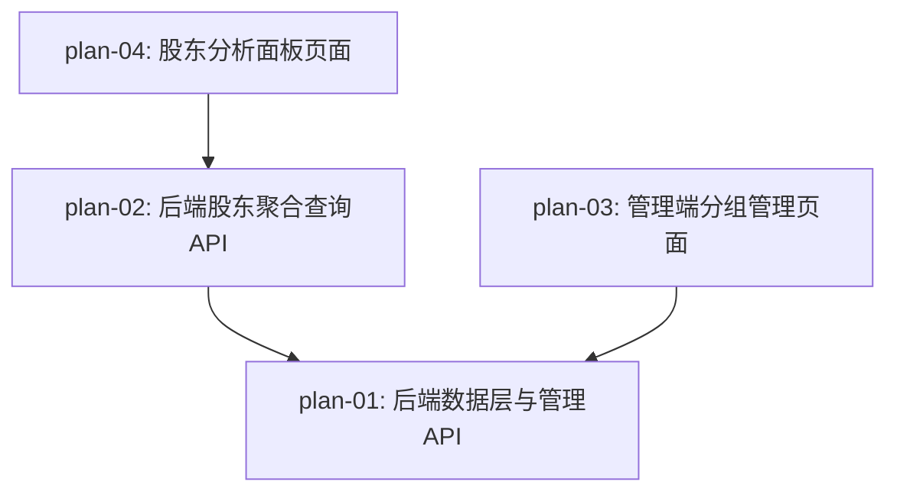

# 实现计划：股东分析面板

## 1. 概览

- **项目**: 06-股东分析面板 — 股东分析面板功能开发
- **来源架构**: docs/06-股东分析面板/06-1-架构文档-股东分析面板.md
- **组织方式**: 功能维度（Feature-based）
- **项目类型**: brownfield（现有项目增量开发）
- **技术栈**: FastAPI + SQLAlchemy async（后端）、Next.js 16 + React 19 + TypeScript + shadcn/ui + ECharts（前端）、PostgreSQL（数据库）
- **总阶段数**: 3
- **总功能数**: 4
- **最大并行度**: 2（Phase 2 中 plan-02 和 plan-03 可并行）
- **关键路径**: plan-01 → plan-02 → plan-04

## 2. 输入摘要

### 2.1 核心闭环与目标

核心闭环：Group → Match → Aggregate → Query（分组定义 → 关键词匹配 → 持仓聚合 → 筛选查询）。

在 05 期十大流通股东数据同步的基础上，新增面向用户的"股东分析面板"。系统通过关键词匹配规则将股东归类到监控组（国家队、外资投行、社保等），按组展示持仓汇总、行业分布和变动趋势，支持按监控组查询持仓股票并按行业/变动方向筛选。管理员可在后台增删改监控组及其匹配规则。

### 2.2 关键 ADR 与实施护栏

| ADR | 核心决策 | 实施护栏 |
| --- | --- | --- |
| ADR-1 | 独立两表设计（shareholder_groups + shareholder_group_rules） | 规则整体替换策略，CASCADE 删除 |
| ADR-2 | 关键词 LIKE '%keyword%' 匹配 | keyword 中 % 和 _ 需转义防注入 |
| ADR-3 | 变动方向跨期自行对比，不依赖 hold_change | 需处理"退出"（上期有本期无）场景 |
| ADR-4 | 行业数据复用 sectors/sector_stocks（type='industry'） | 未关联行业的股票归入"未分类" |
| ADR-5 | 持仓按股票粒度聚合展示 | 一只股票一行，持股数为该组所有匹配持有者之和 |
| ADR-6 | 预定义数据通过 Alembic 迁移种子插入 | 使用 ON CONFLICT DO NOTHING 保证幂等 |
| ADR-7 | 独立面板页 /dashboard/shareholder-analysis | 与基金持仓分析页平级 |

### 2.3 现有代码快照

- **05 期数据表**：`top10_float_holders`（model: `Top10FloatHolder`），字段含 symbol, holder_name, hold_amount, hold_float_ratio, report_period 等
- **板块体系**：`sectors`（model: `Sector`，含 type 字段）+ `sector_stocks`（model: `SectorStock`）
- **股票表**：`stocks`（model: `Stock`，name 字段为股票名称）
- **BaseRepository**：`server/src/repositories/base.py`，泛型 CRUD
- **Admin API 模式**：`server/src/api/admin/__init__.py`，各子模块 router 通过 `include_router` 注册
- **前端导航**：`web/src/components/dashboard/DashboardLayout.tsx`（baseSidebarItems 数组）、`web/src/components/admin/AdminSidebar.tsx`（navItems 数组）
- **API 客户端**：`web/src/lib/api.ts`（ApiClient / AdminApiClient 类）

### 2.4 架构约束

- 不引入物化视图、预计算表或独立缓存层
- 不引入独立股东实体表/标准化表
- 不引入用户自定义分组
- 所有聚合查询为实时计算
- JSON 命名：前端 camelCase，后端 snake_case，API 层自动转换

## 3. 验收标准追踪矩阵

| AC-ID | 需求原文 | 架构承接 | 计划承接 | 验证方式 | 当前状态 |
| --- | --- | --- | --- | --- | --- |
| AC-01 | 监控组概览展示 | ShareholderAnalysisPage + API /overview | plan-02, plan-04 | plan-02 §5 API 验证 + plan-04 §5 页面渲染验证 | planned |
| AC-02 | 监控组持仓详情查询 | HoldingsDetail + API /summary, /industry-distribution, /holdings | plan-02, plan-04 | plan-02 §5 API 验证 + plan-04 §5 页面交互验证 | planned |
| AC-03 | 多监控组联合查询 | 前端多选 + API group_ids 参数 | plan-02, plan-04 | plan-02 §5 多组 API 验证 + plan-04 §5 多选交互验证 | planned |
| AC-04 | 行业筛选 | 前端筛选栏 + API industry 参数 | plan-02, plan-04 | plan-02 §5 筛选 API 验证 + plan-04 §5 筛选交互验证 | planned |
| AC-05 | 变动方向筛选 | 前端筛选栏 + API change_direction 参数 | plan-02, plan-04 | plan-02 §5 变动 API 验证 + plan-04 §5 筛选交互验证 | planned |
| AC-06 | 管理员新增监控组 | Admin API POST /shareholder-groups | plan-01, plan-03 | plan-01 §5 API 验证 + plan-03 §5 页面操作验证 | planned |
| AC-07 | 管理员编辑匹配规则 | Admin API PATCH /shareholder-groups/{id} | plan-01, plan-03 | plan-01 §5 API 验证 + plan-03 §5 编辑操作验证 | planned |
| AC-08 | 数据未同步空状态 | 前端空状态判断 | plan-04 | plan-04 §5 空状态展示验证 | planned |
| AC-09 | 报告期切换 | 前端下拉 + API report_period | plan-02, plan-04 | plan-02 §5 API 验证 + plan-04 §5 切换交互验证 | planned |
| AC-10 | 管理员删除监控组 | Admin API DELETE /shareholder-groups/{id} | plan-01, plan-03 | plan-01 §5 API 验证 + plan-03 §5 删除操作验证 | planned |
| AC-11 | 报告期数据不完整降级 | 后端降级 + 前端提示 | plan-02, plan-04 | plan-02 §5 has_prev_period 验证 + plan-04 §5 降级提示验证 | planned |

## 4. 模块地图

按功能聚合展示：

| 功能 | 包含模块 | 类型 | 对应文件 |
| --- | --- | --- | --- |
| plan-01 | ShareholderGroup Model, ShareholderGroupRule Model, ShareholderGroupRepository, ShareholderGroupService, Admin API routes | backend | plan-01-后端数据层与管理API.md |
| plan-02 | ShareholderAnalysisService, User API routes | backend | plan-02-后端股东聚合查询API.md |
| plan-03 | ShareholderGroupPanel, Admin page, AdminSidebar 更新 | frontend | plan-03-管理端分组管理页面.md |
| plan-04 | ShareholderAnalysisPage, GroupOverviewCards, HoldingsDetail, IndustryDistribution, HoldingsTable, ReportPeriodSelector, SWR hooks, DashboardLayout 更新 | frontend | plan-04-股东分析面板页面.md |

## 5. 依赖图



## 6. 阶段摘要

### Phase 1：数据基础层

- **plan-01 后端数据层与管理API**：新建 shareholder_groups 和 shareholder_group_rules 两张表、Alembic 迁移含预定义种子数据、Repository 和 Service 实现管理端 CRUD、Admin API 路由

### Phase 2：服务与并行开发（最大并行度 2）

- **plan-02 后端股东聚合查询API**：基于 plan-01 的分组规则，实现关键词匹配 + 按股票聚合 + 跨期变动计算 + 行业关联，提供 overview / summary / industry-distribution / holdings 四个用户侧 API
- **plan-03 管理端分组管理页面**：基于 plan-01 的 Admin API，实现分组列表、新增/编辑/删除、匹配关键词编辑和预览的管理端前端页面

### Phase 3：用户面板

- **plan-04 股东分析面板页面**：基于 plan-02 的用户侧 API，实现完整的股东分析面板页面——监控组概览卡片、持仓详情区（汇总统计 + 行业分布条形图 + 变动趋势 + 股票列表分页）、报告期选择、行业/变动方向筛选

## 7. 任务总览

| 功能 | 阶段 | 包含维度 | 依赖 | 独立验收标准 |
| --- | --- | --- | --- | --- |
| plan-01: 后端数据层与管理API | Phase 1 | backend | 无 | Model 迁移成功、种子数据写入、Admin CRUD API 通过 curl 验证 |
| plan-02: 后端股东聚合查询API | Phase 2 | backend | plan-01 | 四个用户侧 API 返回正确聚合数据，变动方向计算正确 |
| plan-03: 管理端分组管理页面 | Phase 2 | frontend | plan-01 | 管理员可新增/编辑/删除分组、匹配预览正常 |
| plan-04: 股东分析面板页面 | Phase 3 | frontend | plan-02 | AC-01~AC-05、AC-08~AC-11 全部走通，E2E 回归通过 |

### 7.2 开发状态机

> 由 auto-dev 维护的流程控制表。功能真实状态以各 `plan-*.md` frontmatter `status` 为准（ready-to-dev → in-progress → review → done）。

| FEAT | 当前步骤 | red_e2e | implement | green_e2e | review | 最近证据 | 阻塞原因 | 更新时间 |
| --- | --- | --- | --- | --- | --- | --- | --- | --- |
| plan-01 | done | done | done | done | done | plan-01-review-20260613.md | - | 2026-06-13 |
| plan-02 | done | done | done | done | done | plan-02-review-20260613.md | - | 2026-06-13 |
| plan-03 | done | done | done | done | done | plan-03-review-20260613.md | - | 2026-06-13 |
| plan-04 | done | done | done | done | done | plan-04-review-20260613.md | - | 2026-06-13 |

## 8. 未决策项

无。架构文档 §5.x 已确认所有待确认问题均已解决。

## 9. 执行前置

### 9.1 环境准备

- PostgreSQL 运行中（`docker-compose up postgres -d`）
- 后端依赖已安装（`server/` 目录下）
- 前端依赖已安装（`web/` 目录下 `npm install`）
- 05 期十大流通股东数据已同步至少一个报告期（验证聚合查询需要数据）

### 9.2 执行顺序

1. **Phase 1**：执行 plan-01（后端数据层与管理 API），完成后运行 Alembic 迁移并通过 curl 验证 Admin API
2. **Phase 2**：并行执行 plan-02 和 plan-03（plan-02 做聚合查询 API，plan-03 做管理端前端）
3. **Phase 3**：执行 plan-04（股东分析面板前端页面），完成后做全流程集成验证

### 9.3 全局验证

所有功能完成后执行：

```bash
# 后端测试
cd server && pytest -v

# 前端构建检查
cd web && npm run build

# 全流程验证：启动前后端服务，手动走通 AC-01 ~ AC-11 所有验收场景
```

## 10. 变更记录

| 日期 | 变更类型 | 功能 | 说明 |
| --- | --- | --- | --- |
| 2026-06-13 | 新增 | plan-01 ~ plan-04 | 初始生成实现计划 |
| 2026-06-13 | 修复 | plan-02/03/04 | dev-plan-check 第三次复查修复：plan-04 用户侧 API 去除双 `/v1` 前缀（B-1）+ hooks 改 useFunds 模式（S-1）+ DashboardLayout 补 `Users` import（S-3）；plan-02 补 `ApiResponse[T]` 包裹契约（S-4）与 `report_period` Date→String 转换（S-5）；plan-03 admin 入口对齐 `AdminLayoutWithSidebar`（S-2）；plan-03/04 补 E2E-TDD 验收项（B-2） |
| 2026-06-13 | 修复 | 架构/plan-01/03/04 | dev-plan-check 第四次独立复审修复：plan-04 `getHoldings` 分页参数 `pageSize`→`page_size`（B-4，后端 Query 约定 snake_case）；架构 §6.4/§7.3/AC-07 + plan-01/plan-03 编辑分组接口 `PUT`→`PATCH`（B-3，对齐项目现有 admin 更新约定，`AdminApiClient` 仅有带鉴权的 patch；架构同步修正以保持基准一致） |
| 2026-06-13 | 修复 | plan-01/02/03 | dev-plan-check 第四次复审建议项：plan-01 §3.4 / plan-02 §3.6 明示新路由文件内 `APIRouter(prefix=...)`（N-1，B-1 修复前提）；plan-02 §3.6 补 Decimal→float 序列化（N-2，参照 funds.py `_serialize_value`）；plan-03 §7 备注架构 §7.3 `/api/admin/` 实际挂载为 `/api/v1/admin/`（N-4） |
| 2026-06-13 | 修复 | 架构/plan-01/02/04 | dev-plan-check 第五次独立复审（recheck4）修复：README 追踪矩阵 AC-07 `PUT`→`PATCH`（B-3′，补 recheck3 漏改）；`pageSize`→`page_size` 全局同步（B-4′，架构+plan-02，plan-04 前端变量保留）；response 字段统一 camelCase（B-5，架构 §7.2 API interface + plan-02 §7 + plan-04 §7，跟随 funds.py `to_camel` + 架构 §7.6，后端 Python 视角 snake_case 保留）；plan-01 §3.2 补 Repository `super().__init__`（N-5）；plan-04 §3.2 补 fetcher 解包层级（N-6） |
| 2026-06-13 | 修复 | plan-01/03 | dev-plan-check 第六次复审（recheck5）确认收敛（0 blocker，判通过），顺手修 S-1：plan-01 §7 + plan-03 §7 的 `GroupListItem` 字段 snake_case→camelCase（补 recheck4 B-5 漏改的 admin 侧）；plan-01 §3.4 补 Admin API response `to_camel` 命名约定说明。S-2（§5/§8 描述性 snake_case）保留，实现以 §7 契约块为准 |

<!-- 保留目录：reviews/。当 task-review、dev-plan-check 等开始运行时创建。 -->
