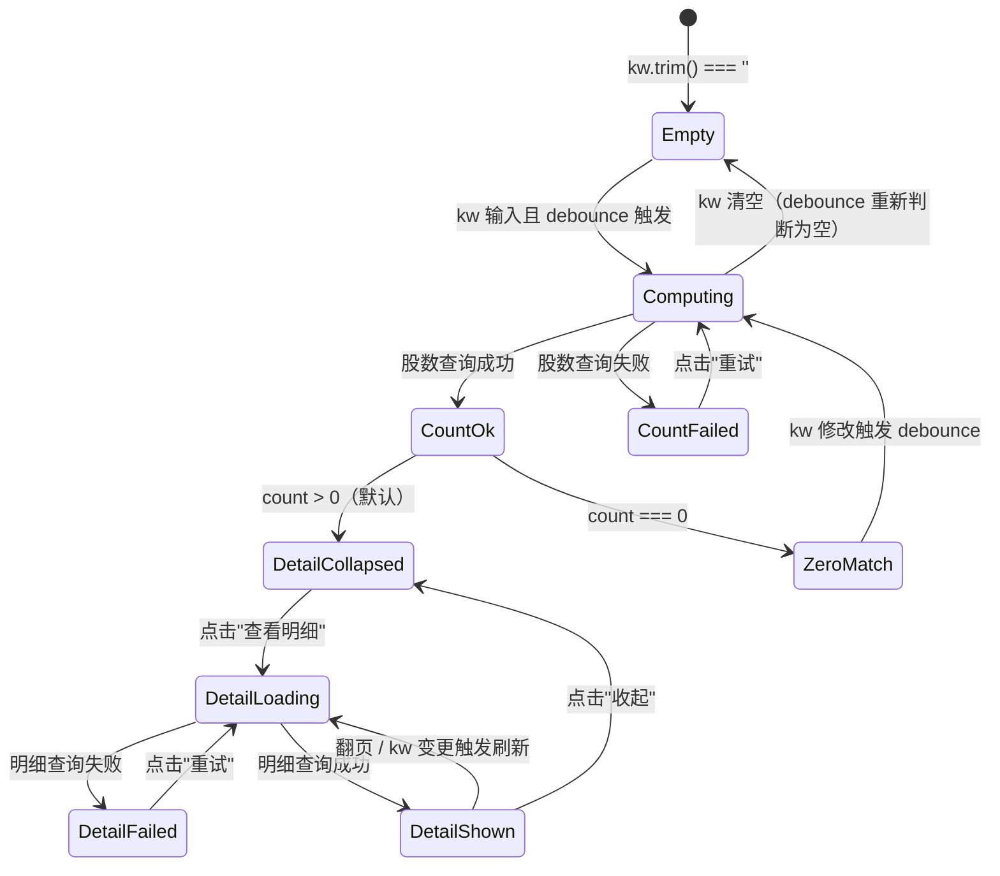
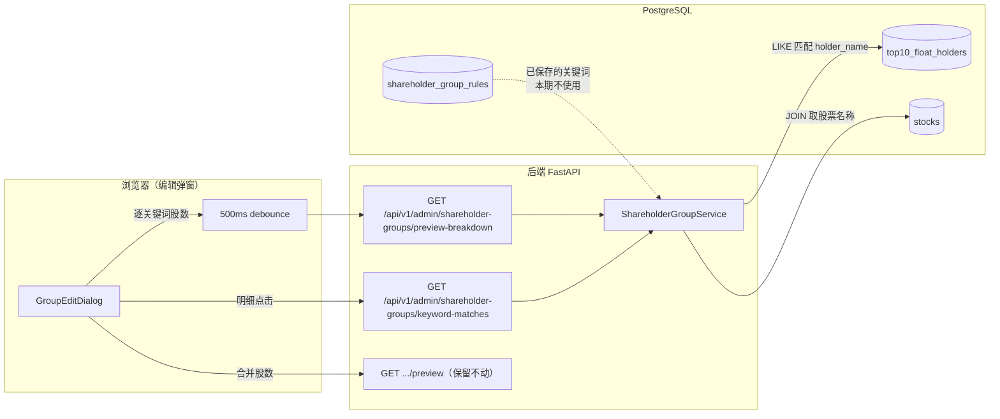

# 07-1 架构文档：股东分组匹配明细

_本文件只保留本期（编辑弹窗内逐关键词股数 + 明细下钻）真正影响实现的架构决策、边界和契约；DDL、目录树、环境变量、实施故事等内容默认不放入正文。_

## 1. 系统摘要

本期是已上线的"股东监控组管理"模块的增量体验改造，不引入新数据表、不改造用户侧分析面板。核心闭环：**Keyword → Match → Detail** —— 管理员在编辑监控组弹窗内，针对每个关键词单独查看去重匹配股数，并能下钻查看该关键词匹配的股票代码 + 股票名称 + 股东名称三列明细，实现"保存前自检"，避免保存出含大量误伤的分组。

技术改动范围：后端在 `ShareholderGroupService` 增加 1 个股数细分查询 + 1 个明细查询方法、对应增加 2 个 admin GET 端点；前端在 `GroupEditDialog` 弹窗内逐关键词渲染股数标签与"查看明细"入口、就地展开明细列表（分页），并复用现有 500ms debounce 节奏刷新股数。所有改动均可通过 `git revert` 单次回滚。

## 2. 范围、非目标与成功标准

### 2.1 范围

- 编辑监控组弹窗内，每个非空关键词旁显示该关键词**单独**匹配的去重股票数
- 每个关键词支持"查看明细"，就地展开（弹窗内）该关键词的明细列表
- 明细三列：股票代码 + 股票名称 + 股东名称；按股票代码升序；每页 20 条；同一股票多个匹配股东分行
- 保留现有底部"所有关键词合并匹配总股数"预览
- 股数与明细均基于编辑框内的关键词草稿实时查询；股数刷新复用现有 500ms debounce
- 股数/明细查询失败时降级：失败区域显示错误提示与重试入口，不阻塞关键词编辑与分组保存

### 2.2 明确不做

- 分组列表表格的行级"查看明细"入口（本期仅限编辑弹窗内）
- 关键词质量评分、误伤高亮等智能建议
- 明细数据导出（CSV/Excel）
- 用户侧股东分析面板（`/api/v1/shareholder-analysis/*`）的明细展示改造
- 跨期变动方向（increase/decrease/new/exit）的展示 —— 明细列表只看当前期匹配结果
- 持股比例、持股数量等扩展列展示 —— 明细仅三列固定字段

### 2.3 成功标准

| 指标 | 首版目标 |
| --- | --- |
| 关键词股数定位 | 编辑弹窗打开后，每个关键词单独股数可见，能一眼定位异常关键词，无需反复删改试错 |
| 明细核验 | 保存前能即时下钻查看关键词匹配的股票与股东清单，判断是否误伤 |
| 实时刷新 | 修改关键词停顿后股数与已展开的明细自动刷新，无需手动点击刷新按钮 |
| 故障降级 | 股数或明细任一查询失败时，对应区域降级但保存主流程可正常完成 |
| 单关键词明细性能 | 单关键词明细查询响应时间 ≤ 1s（典型关键词匹配量 < 200 条，本地 PostgreSQL） |

### 2.4 验收标准承接矩阵

沿用 PRD 的 AC-01 ~ AC-09 编号，逐条承接：

| AC-ID | PRD 原文摘要 | 承接模块 | 关键链路 / 状态 | 风险 / 降级说明 |
| --- | --- | --- | --- | --- |
| AC-01 | 每个非空关键词展示单独匹配的去重股票数 | 后端 `ShareholderGroupService.preview_match_breakdown` + 前端 `GroupEditDialog` 逐关键词渲染 | 链路 6.1 | 单关键词查询失败时该行股数显示错误提示，不影响其他关键词；明细入口置灰 |
| AC-02 | 保留所有关键词合并匹配总数 | 复用现有 `_count_matched_stocks` 合并查询 + 前端现有合并预览区 | 链路 6.1（合并分支） | 与 AC-01 并存展示；合并数因跨关键词去重，通常 ≤ 各关键词股数之和 |
| AC-03 | 点击"查看明细"展示该关键词的明细列表 | 后端 `ShareholderGroupService.list_keyword_matches` + 前端"查看明细"按钮触发的就地展开 | 链路 6.2 | 明细加载失败 → 错误提示 + 重试按钮（PRD 异常旅程） |
| AC-04 | 同一股票被多个匹配股东持有时按股东分行展示 | 后端 `_get_keyword_matches` 按 (symbol, holder_name) 粒度返回，前端每行一条 | 链路 6.2 + §7.2 KeywordMatchItem | SQL 层使用 `DISTINCT ON (symbol, holder_name)`，前端不做聚合 |
| AC-05 | 明细按股票代码升序，同股票多股东相邻 | 后端 SQL `ORDER BY symbol ASC, holder_name ASC`，前端原样渲染 | 链路 6.2 | 后端排序，前端不重排 |
| AC-06 | 修改关键词后股数与明细实时刷新 | 前端 500ms debounce 复用现有机制；明细已展开时同节奏刷新 | 链路 6.1 + 6.3 | 翻页中途关键词变更 → 关闭明细或回到第 1 页（避免页码越界） |
| AC-07 | 预览或明细查询失败均降级且不阻塞编辑与保存 | 前端 try/catch 后置错误状态，不抛错到表单；后端返回错误码即降级 | 链路 6.4 降级 | 失败区显示"加载失败，重试"按钮；保存调用与预览/明细完全解耦 |
| AC-08 | 空关键词不显示股数与明细入口 | 前端过滤 `kw.trim()` 为空时不渲染股数标签与按钮 | 链路 6.1 + 前端 3.3 状态机"关键词为空" | 与现有 debounce 内 `validKeywords.length === 0` 判断一致 |
| AC-09 | 关键词匹配数为 0 时查看明细入口置灰 | 前端依据 AC-01 股数结果，count === 0 时按钮 `disabled` | 前端 3.3 状态机"股数为 0" | 不发起明细请求 |

## 3. 用户流程与状态

### 3.1 主流程

1. 管理员进入"股东监控组管理"页面，点击某分组的"编辑"按钮 → 打开 `GroupEditDialog`
2. 弹窗加载后，针对每个非空关键词（包括已保存的初始关键词），并行触发股数细分查询（500ms debounce）
3. 每个关键词行渲染：关键词输入框 + 删除按钮 + "N 只"标签 + "查看明细 ▾"按钮
4. 弹窗底部保留"合并匹配 N 只股票"预览（与逐关键词股数并存）
5. 管理员若发现某关键词股数异常 → 点击该关键词的"查看明细" → 弹窗内就地展开明细列表
6. 明细列表展示三列（股票代码 / 股票名称 / 股东名称），按股票代码升序，每页 20 条；管理员核对
7. 管理员调整关键词内容（修改/删除/新增）→ 股数与已展开的明细按 debounce 节奏刷新
8. 核验完毕 → 点击"保存"，分组生效（保存逻辑与本期改动完全解耦，未变更）

### 3.2 关键分支

| 分支 | 入口 / 触发条件 | 架构处理方式 |
| --- | --- | --- |
| 空关键词行 | 关键词 `trim()` 为空 | 不渲染股数标签与"查看明细"按钮（不发起请求）；合并总数按剩余非空关键词计算 |
| 股数查询失败 | 后端返回错误或网络异常 | 该关键词行的"N 只"位置渲染"加载失败 重试"，其他关键词不受影响；明细按钮置灰 |
| 明细加载失败 | 后端返回错误或网络异常 | 明细展开区渲染错误提示 + "重试"按钮；关键词行股数正常显示；保存按钮可用 |
| 明细为空 | 该关键词股数为 0 | "查看明细"按钮 `disabled`，不展开明细 |
| 翻页时关键词变更 | 关键词输入触发 debounce 重新查询 | 关闭已展开的明细或重置到第 1 页，避免页码越界 |
| 弹窗关闭 | `onOpenChange(false)` | 清理 debounce 定时器、展开状态与已加载的明细数据 |

### 3.3 状态机

单个关键词行（含明细展开区）的状态机：



关键规则：
- Empty / ZeroMatch / CountFailed 状态下"查看明细"按钮均不可点击
- DetailShown 状态下 kw 变更时，自动重置到第 1 页重新加载，避免页码越界
- 所有失败状态都有独立的"重试"入口，互不阻塞

## 4. 系统上下文与模块职责

### 4.1 系统上下文



数据流说明：本期所有查询（股数与明细）都基于**前端传入的草稿关键词**，不读取 `shareholder_group_rules` 表的已保存关键词。后端只用 `top10_float_holders` 做 LIKE 匹配，并用 `stocks` 表补股票名称。

### 4.2 模块职责

| 模块 | 职责 | 上游输入 | 下游输出 |
| --- | --- | --- | --- |
| `GroupEditDialog`（前端，改造） | 渲染逐关键词股数标签、"查看明细"按钮、明细展开区 | 用户输入的草稿关键词 `string[]` | 触发股数/明细查询、展示列表与分页 |
| `adminApi.previewShareholderGroupMatchBreakdown`（前端，新增） | 调用逐关键词股数细分接口 | 关键词数组 | `{ items: Array<{ keyword, matchedStockCount }> }` |
| `adminApi.listShareholderGroupKeywordMatches`（前端，新增） | 调用单关键词明细接口 | 单关键词 + 分页参数 | `{ items: Array<KeywordMatchItem>, total, page, pageSize }` |
| `GET /api/v1/admin/shareholder-groups/preview-breakdown`（后端，新增） | 接收逗号分隔关键词，返回逐关键词股数 | query: `keywords`、`exclude_group_id?` | `ApiResponse[PreviewBreakdownData]` |
| `GET /api/v1/admin/shareholder-groups/keyword-matches`（后端，新增） | 接收单关键词 + 分页，返回明细列表 | query: `keyword`、`page?`、`page_size?`、`exclude_group_id?` | `ApiResponse[KeywordMatchesData]` |
| `ShareholderGroupService.preview_match_breakdown`（后端，新增） | 对每个关键词单独跑 LIKE，返回去重股数 | 关键词数组 | `dict[str, Any]` 含 items |
| `ShareholderGroupService.list_keyword_matches`（后端，新增） | 对单关键词 LIKE 匹配，JOIN stocks 取股票名称，分页返回 | 单关键词 + 分页 | `dict[str, Any]` 含 items / total |
| `ShareholderGroupService._get_keyword_matches`（后端，新增私有方法） | 单关键词 SQL 查询：DISTINCT ON (symbol, holder_name) + ORDER BY ann_date DESC，JOIN stocks | 单关键词 + 报告期 | 列表 `[(symbol, stock_name, holder_name)]` |
| 复用：`ShareholderAnalysisService._get_industry_for_stocks` | **不直接复用**，但其 JOIN 模式作为参考。本期直接在 `_get_keyword_matches` 内联实现 JOIN stocks | — | — |

**复用声明与可行性验证**：

- **复用现有 admin 路由前缀与认证**：`GET /preview` 端点已挂在 `prefix="/shareholder-groups"`（`server/src/api/admin/shareholder_groups.py:22`），admin 路由通过 `router.include_router(admin_router, prefix="/v1/admin")` 挂载（`server/src/api/router.py:29`），最终路径 `/api/v1/admin/shareholder-groups/*`。验证：前端 `adminApiClient` 的 baseURL 是 `${API_BASE_URL}/api/v1`，调用时 endpoint 写 `/admin/shareholder-groups/...` 拼接得到 `/api/v1/admin/shareholder-groups/...`，无双前缀。
- **复用 `require_admin` 依赖**：两个新端点都用 `Depends(require_admin)`，与现有 `preview` 端点一致（line 88）。可行性：admin 路由已统一加管理员权限校验，无需新增权限模型。
- **复用 `_escape_like_keyword` + `_get_latest_report_period`**：直接复用 `shareholder_group_service.py` 现有方法。可行性：数据源相同（`top10_float_holders` 表）、转义逻辑相同（`%` / `_` 转义）。
- **JOIN stocks 取股票名称的能力已存在**：`ShareholderAnalysisService._get_industry_for_stocks`（`shareholder_analysis_service.py:292-344`）已通过 `select(Stock.symbol, Stock.name, Sector.name).select_from(Stock).outerjoin(SectorStock, SectorStock.stock_code == Stock.symbol)` 实现 symbol→股票名称关联，前提是 `stocks` 表有该 symbol 的记录（缺失时 `stock_name=None`）。本期明细场景的 JOIN 更简单（只需 stocks 表，无需 sector），但同样的"stocks 表缺失该 symbol 时 stock_name=null"的兜底逻辑必须保留 —— 因为 Top10FloatHolder 与 Stock 表无外键约束，存在未同步的 symbol。
- **复用 `ApiResponse[T]` + `_dict_to_camel` + Pydantic `to_camel`**：与现有 admin 端点响应风格一致。

### 4.3 需要刻意避免的过度设计

- **不引入"明细缓存"层**：明细查询量小（单关键词典型 < 200 条），实时查询足够；增加缓存会引入失效/一致性问题
- **不为明细增加导出/批量查询接口**：PRD 明确不做导出，每端点必须对应首版用户流程中的具体交互
- **不抽象"关键词匹配规则引擎"**：现有 `_escape_like_keyword` + LIKE 即可覆盖；抽象层会过度设计
- **不为股数细分引入异步任务队列**：实时同步查询即可（毫秒级），APScheduler / AsyncTask 不适用
- **不修改用户侧 `/api/v1/shareholder-analysis/*` 任何端点**：本期改动仅限 admin 编辑场景
- **不引入新数据表**：Top10FloatHolder + Stock 已包含所需字段，无需新增/扩展表

## 5. 关键架构决策（ADR）

### ADR-1：股数细分通过新增独立端点 `preview-breakdown`，不扩展现有 `preview`

- **选择**：新增 `GET /api/v1/admin/shareholder-groups/preview-breakdown`，返回 `{ items: [{ keyword, matchedStockCount }] }`；保留现有 `preview` 端点原样不动
- **理由**：现有 `preview` 已被前端"合并总数预览"稳定使用（`GroupEditDialog` line 332、adminApi line 618），改其返回结构会破坏现有 UI 与 E2E mock；本期是增量需求，独立端点便于回滚（git revert 一个端点即可）
- **风险与对策**：股数细分查询会按关键词数量重复 LIKE 匹配（N 个关键词 = N 次单关键词查询）。对策：单关键词查询本身是简单的 COUNT(DISTINCT symbol)，且 `ix_top10_symbol_period` 索引可命中；典型 N ≤ 10，总耗时可控。若上线后发现超时，再考虑批量化 SQL（一次查询返回每个关键词的计数）

### ADR-2：明细查询接口入参为单关键词（不是多关键词）

- **选择**：新增 `GET /keyword-matches`，入参 `keyword`（单值）+ `page` + `page_size`；前端逐关键词点击时单独调用
- **理由**：PRD 明确"明细点击触发"且"不自动加载所有关键词明细"（§1.3 决策"明细触发方式"）。单关键词入参语义清晰，与"逐关键词下钻"的用户旅程一致；分页参数附在单关键词上自然
- **风险与对策**：用户连续点击多个关键词的明细时会发起多个请求。对策：前端只在被点击的那个关键词上展开明细（同时只能展开一个），且复用 debounce 后的最新草稿值作为请求参数；后端无状态，可并发处理

### ADR-3：明细 SQL 在后端一次性完成"匹配 + JOIN stocks + 排序 + 分页"

- **选择**：单条 SELECT 语句完成 LIKE 匹配、`DISTINCT ON (symbol, holder_name)`、`ORDER BY symbol ASC, holder_name ASC`、JOIN `stocks` 取股票名称、`LIMIT/OFFSET` 分页
- **理由**：参考现有 `_match_holdings`（`shareholder_analysis_service.py:161-249`）已用 `DISTINCT ON` 处理同 (symbol, holder_name) 多 ann_date 的情况；JOIN stocks 与现有 `_get_industry_for_stocks` 同源（只是更简单）。后端一次性查询避免 N+1，前端只需展示
- **风险与对策**：JOIN stocks 后若该 symbol 在 stocks 表缺失，stock_name 为 null。对策：前端 `stockName` 字段定义为 `string | null`，渲染时为 null 显示"-"（与 holdings 接口的处理方式一致）

### ADR-4：前端明细展开"同时只能展开一个关键词"，避免多列表叠放

- **选择**：组件级维护一个 `expandedKeywordIdx` 状态，点击新关键词的"查看明细"时自动收起前一个
- **理由**：弹窗内空间有限；多列表叠放会让弹窗超长，UX 复杂度陡增；且 PRD 线框图也只展示单个明细区
- **风险与对策**：用户想同时比对两个关键词的明细时需要切换。对策：切换是低成本操作（重新发起一次毫秒级查询），可接受

### ADR-5：股数细分与明细查询失败时各自独立降级，不相互影响

- **选择**：前端对每个关键词的股数查询单独 try/catch，失败时该行渲染错误提示；明细查询单独 try/catch，失败时明细区渲染错误提示；两者失败均不抛错到顶层 formError
- **理由**：PRD AC-07 明确"预览或明细查询失败均降级且不阻塞编辑与保存"；现有 debounce 的 catch 已采用"静默置 0"（`GroupEditDialog` line 338-340）的降级模式，本期延续该思路但增强为"显式错误提示 + 重试"以满足 AC-07 的"重试入口"要求
- **风险与对策**：用户可能不注意到失败提示。对策：错误提示使用 `text-destructive` 红色文案 + 内联"重试"按钮，视觉显著

### 5.6 待确认问题

无。本期所有决策点在 PRD §1.3 已有明确口径，且现有代码层支撑充分。

## 6. 运行链路

### 6.1 逐关键词股数预览（AC-01）

1. 管理员在 `GroupEditDialog` 编辑某关键词（修改/新增/删除），`keywords` state 变化
2. `useEffect` 监听 `keywords`，500ms debounce（复用现有 `debounceRef`）
3. 收集所有非空关键词 `validKeywords`；若 `length === 0`，清空股数状态并 return（AC-08）
4. 调用 `adminApi.previewShareholderGroupMatchBreakdown(validKeywords, editing?.id)`
5. 前端拼成 GET 请求：`/admin/shareholder-groups/preview-breakdown?keywords=kw1,kw2&exclude_group_id=...`
6. 后端 `preview_match_breakdown(keywords, exclude_group_id)`：
   1. 取最新报告期 `_get_latest_report_period()`；为 None 则每个关键词返回 0
   2. 对每个关键词单独跑 `SELECT COUNT(DISTINCT symbol) FROM top10_float_holders WHERE report_period = ? AND holder_name LIKE '%kw%' ESCAPE '\'`
   3. 组装 `{ items: [{ keyword, matchedStockCount }] }` 返回
7. 前端按 `keyword` 字段匹配到对应行（注意：草稿中可能有重复关键词，按"返回 items 的顺序 + 同名关键词遍历匹配"渲染；最简策略：后端按入参顺序原样返回，前端按索引映射）
8. 渲染每个关键词行的"N 只"标签（AC-01）；同时更新"合并总数预览"区（独立调用现有 `preview` 接口，AC-02）

实现原则：
- 股数细分接口的 `keywords` 参数为逗号分隔字符串（与现有 `preview` 端点风格一致），后端按 `,` split 后 `.strip()` 过滤空值
- 后端对每个关键词复用 `_escape_like_keyword` 转义 `%` 和 `_`，禁止 SQL 字符串拼接
- 单关键词查询失败时**不抛错到整体**：用 `try/except` 包住单关键词循环，失败的关键词 `matchedStockCount` 设为 `null`，前端据此渲染"加载失败 重试"
- 前端按 keyword 索引（而非字符串值）匹配，避免草稿中重复关键词时映射混乱

### 6.2 查看明细（AC-03 / AC-04 / AC-05）

1. 管理员点击某关键词（股数 > 0）行的"查看明细"按钮
2. 前端设置 `expandedKeywordIdx = idx`（同时收起其他已展开的，ADR-4）
3. 明细区显示加载指示
4. 调用 `adminApi.listShareholderGroupKeywordMatches(keyword, { page: 1, pageSize: 20, excludeGroupId })`
5. 后端 `list_keyword_matches(keyword, page, page_size, exclude_group_id)`：
   1. 取最新报告期；为 None 直接返回空列表
   2. `_escape_like_keyword(keyword)` → `LIKE '%kw%' ESCAPE '\'`
   3. SQL：
      ```sql
      SELECT DISTINCT ON (h.symbol, h.holder_name)
             h.symbol, s.name AS stock_name, h.holder_name
        FROM top10_float_holders h
        LEFT JOIN stocks s ON s.symbol = h.symbol
       WHERE h.report_period = :period
         AND h.holder_name LIKE :pattern ESCAPE '\'
       ORDER BY h.symbol ASC, h.holder_name ASC, h.ann_date DESC NULLS LAST
       LIMIT :page_size OFFSET :offset
      ```
   4. 单独执行 `COUNT(*)` 查询总数（同样基于上述 WHERE 子句但用 `COUNT(DISTINCT (h.symbol, h.holder_name))`），返回 `total`
   5. 返回 `{ items: [{ symbol, stockName, holderName }], total, page, pageSize }`
6. 前端渲染明细列表三列 + 分页器（`< 1/2 >`）
7. 同股票多个股东天然相邻（因 ORDER BY symbol 升序在前）

实现原则：
- `DISTINCT ON` 必须配合 `ORDER BY` 的前缀匹配（PG 要求），故 `ORDER BY h.symbol, h.holder_name, h.ann_date DESC NULLS LAST` 顺序不可调换
- `COUNT(DISTINCT (h.symbol, h.holder_name))` 用元组形式去重计数（与明细行数口径一致）；不用 `COUNT(DISTINCT h.symbol)` 否则同股票多股东会被压缩
- `LEFT JOIN stocks`：stocks 表缺失该 symbol 时 stock_name 为 null，前端显示"-"
- `exclude_group_id` 参数本期后端实现时可忽略（与现有 `_count_matched_stocks` 一致的占位行为），但保留入参以保持 API 一致性

### 6.3 修改关键词后实时刷新（AC-06）

1. 用户修改已展开明细的关键词
2. 500ms debounce 触发，重新查询 6.1（股数细分）和 6.2（明细）
3. 明细查询时重置 `expandedPage` 为 1（避免新结果 total 变小后页码越界）

实现原则：
- 已展开的关键词内容变化时，明细刷新与股数刷新同步触发，无需用户再次点击"查看明细"
- 关键词被清空（`trim() === ''`）时，自动收起明细并清空状态

### 6.4 降级与重试（AC-07）

1. 任何查询失败 → catch 内将对应 state 置为错误状态
2. 渲染错误提示 + "重试"按钮（与合并预览的 catch 思路一致，但增强为可见 UI）
3. 用户点击重试 → 重新执行对应链路（6.1 或 6.2）

实现原则：
- 失败状态不抛错到 `formError`，保存按钮始终可用
- "重试"按钮独立调用对应 API，不影响其他关键词

## 7. 领域对象与关键契约

### 7.1 核心对象

| 对象 | Source of Truth | Owner | 用途 |
| --- | --- | --- | --- |
| 关键词草稿 | 前端 `GroupEditDialog.keywords: string[]` state | 前端 | 本期所有查询的输入源（不读取已保存的 rules） |
| 单关键词匹配明细行 | `top10_float_holders` 表（最新报告期） | 后端 | 明细列表的数据来源 |
| 股票名称 | `stocks.name` | 后端 | 通过 `stocks.symbol = top10_float_holders.symbol` LEFT JOIN 补全 |
| 合并匹配股数 | `top10_float_holders`（最新报告期，多关键词 OR LIKE） | 后端 | AC-02 底部预览，复用现有 `preview` 端点 |

### 7.2 最小 Schema（TypeScript interface，响应输出视角，camelCase）

```typescript
// 股数细分项（preview-breakdown 返回 items 数组的元素）
interface KeywordCountItem {
  keyword: string                 // user_input（前端传入的草稿关键词原值）
  matchedStockCount: number | null  // system_computed；null 表示该关键词查询失败（前端渲染错误）
}

// preview-breakdown 响应 data
interface PreviewBreakdownData {
  items: KeywordCountItem[]
}

// 单条明细项（keyword-matches 返回 items 数组的元素）
interface KeywordMatchItem {
  symbol: string                  // derived from top10_float_holders.symbol
  stockName: string | null        // derived via LEFT JOIN stocks.name；缺失时 null
  holderName: string              // derived from top10_float_holders.holder_name
}

// keyword-matches 响应 data
interface KeywordMatchesData {
  items: KeywordMatchItem[]
  total: number                   // 符合条件的总明细行数（COUNT(DISTINCT (symbol, holder_name))）
  page: number                    // system_generated（请求原值回显，1-based）
  pageSize: number                // system_generated（请求原值回显）
}
```

### 7.3 API 边界

| 方法 | 路径 | 用途 | 入参（query） | 出参字段（data 内，camelCase） |
| --- | --- | --- | --- | --- |
| GET | `/api/v1/admin/shareholder-groups/preview-breakdown` | 逐关键词股数细分（AC-01） | `keywords: string`（必填，逗号分隔）；`exclude_group_id?: number` | `{ items: Array<{ keyword: string, matchedStockCount: number \| null }> }` |
| GET | `/api/v1/admin/shareholder-groups/keyword-matches` | 单关键词明细列表（AC-03 ~ AC-05） | `keyword: string`（必填，单值）；`page?: number = 1`；`page_size?: number = 20`；`exclude_group_id?: number` | `{ items: Array<{ symbol, stockName, holderName }>, total, page, pageSize }` |

**API 契约约定**：
- 响应外层统一 `ApiResponse{ success, data, message }`（与现有 admin 端点一致，`server/src/api/schemas/response.py`）
- 响应体字段经 Pydantic `alias_generator=to_camel` 转 camelCase；query 参数保持 snake_case（如 `page_size`、`exclude_group_id`）—— 与现有 `preview` 端点风格一致
- 入参字段数据来源：
  - `keywords` / `keyword`：`user_input`（管理员在弹窗编辑的草稿）
  - `exclude_group_id`：`derived`（从 `editing?.id` 透传，与现有 preview 一致）
  - `page` / `page_size`：`frontend_computed`（前端分页器状态）
- 出参字段数据来源（参考 §7.2 注释）
- 默认 `page_size=20`，PRD §3.3 明确"默认每页 20 条"
- 两个端点都需管理员权限（`Depends(require_admin)`），与现有 `/shareholder-groups/*` 端点一致

### 7.4 状态流转

本期无后端任务/作业状态机。前端 `GroupEditDialog` 的关键词行状态机见 §3.3。

### 7.5 数据边界

- **不写入数据库**：本期所有查询均为只读 SELECT，不修改任何表
- **不读取 `shareholder_group_rules`**：所有查询基于前端传入的草稿关键词
- **读取范围**：`top10_float_holders`（最新报告期过滤 + LIKE 匹配）、`stocks`（LEFT JOIN 取股票名称）
- **不引入缓存层**：每次查询实时计算

### 7.6 命名与标识规则

- 后端方法名：`preview_match_breakdown`、`list_keyword_matches`、`_get_keyword_matches`（与现有 `preview_match` / `_count_matched_stocks` 命名风格一致，snake_case）
- 后端响应模型类名：`PreviewBreakdownData` / `KeywordCountItem` / `KeywordMatchesData` / `KeywordMatchItem`（PascalCase，与现有 `PreviewMatchResponse` 一致）
- 前端 adminApi 方法名：`previewShareholderGroupMatchBreakdown`、`listShareholderGroupKeywordMatches`（camelCase，与现有 `previewShareholderGroupMatch` 命名风格一致）
- 前端响应字段：camelCase（`matchedStockCount` / `stockName` / `holderName` / `pageSize`）
- 术语映射：
  - "股数" / "匹配股数" = `matchedStockCount`（与现有 `PreviewMatchResponse.matched_stock_count` 一致）
  - "明细" = `keyword-matches`（端点） / `KeywordMatchItem`（类型）
  - 不使用 "breakdown" 描述业务概念（"breakdown" 仅用于端点名空间），UI 文案统一用"明细"
- 报告期：本期固定取 `top10_float_holders.report_period` 的最新期（`MAX(report_period)`），不接受前端传入 report_period 参数（与现有 `preview` 端点一致）

## 8. 非功能需求、风险与运行策略

### 8.1 性能与吞吐量目标

| 指标 | 目标 | 预期并发 |
| --- | --- | --- |
| 单关键词股数查询（COUNT DISTINCT） | ≤ 200ms | 单管理员编辑场景，无并发压力 |
| 单关键词明细查询（含 JOIN + 分页） | ≤ 1s（典型 < 200 条） | 单管理员逐关键词点击，串行 |
| preview-breakdown 整体响应（N 个关键词） | ≤ 1s（N ≤ 10） | 同上 |

`top10_float_holders` 已有索引 `ix_top10_symbol_period (symbol, report_period)` 和 `ix_top10_report_period (report_period)`，最新期过滤可命中。

### 8.2 可靠性、错误处理与降级策略

| 级别 | 触发条件 | 系统行为 |
| --- | --- | --- |
| L1（最小影响） | 单关键词股数查询失败 | 该关键词行显示"加载失败 重试"；其他关键词不受影响；合并预览独立查询不受影响 |
| L2（中等影响） | 明细查询失败 | 明细区显示"加载失败 重试"；关键词行股数正常显示；保存按钮可用 |
| L3（最大影响） | 整体网络异常 / 后端宕机 | 所有关键词股数 + 合并预览 + 明细均失败；前端展示各自的错误提示；保存操作会因后端不可用失败，但这是预期内的整体不可用 |

**降级链**：单关键词失败 → 明细入口置灰 → 不阻塞合并预览 → 不阻塞保存。每一级降级都保留剩余可用功能，符合 PRD AC-07。

### 8.3 安全与反滥用策略

| 项目 | 首版策略 |
| --- | --- |
| SQL 注入防护 | 复用 `_escape_like_keyword` 转义 `%` 和 `_`，参数绑定 holder_name；不拼接 SQL（与现有 `_count_matched_stocks` 一致） |
| 权限控制 | 两个新端点均 `Depends(require_admin)`，仅管理员可访问（与现有 admin shareholder-groups 端点一致） |
| 关键词长度限制 | 后端对单个 keyword 长度做 sanity check（参考 `ShareholderGroupRule.keyword` 字段 `String(200)`，超过 200 字符的关键词直接返回空结果或 400） |
| 速率限制 | 本期为单管理员后台操作，无 Rate Limit；如未来出现自动化批量调用，再加 |

### 8.4 成本控制预期

本期无按量计费的外部服务调用，仅查询本地 PostgreSQL，无额外成本。

### 8.5 可观测性

- 后端：复用现有 `logger = logging.getLogger(__name__)`，在 `preview_match_breakdown` 和 `list_keyword_matches` 入口记录 INFO（关键词数 / 报告期 / 耗时）；异常 catch 内记录 ERROR + 完整堆栈
- 前端：复用现有 `console.error` 在 catch 内打印（与 `GroupEditDialog` 现有 catch 行为一致）；不引入额外埋点

### 8.6 主要风险

| 风险 | 影响 | 缓解方式 |
| --- | --- | --- |
| `top10_float_holders` 数据未同步，最新期为空 | 所有股数与明细返回 0 / 空 | 前端对 0 / 空有专门 UI 状态（AC-09 / 3.3 状态机），不阻塞保存 |
| `stocks` 表缺失某些 symbol，stockName 为 null | 明细"股票名称"列显示"-" | 已在 ADR-3 风险与对策中明确，前端兜底显示 |
| 草稿中存在重复关键词（如两个空行被填了相同内容） | 后端按入参顺序返回相同 keyword 的多个 item | 前端按索引映射渲染（每行独立查询），不合并；语义上重复关键词的股数相同也无业务冲突 |
| 关键词包含 LIKE 通配符（如"50%"） | 不转义会匹配大量无关股东 | `_escape_like_keyword` 已转义，安全 |
| 编辑弹窗长时间打开期间报告期未变化 | 无影响 | 报告期是查询时实时取 MAX，每次查询独立 |

## 9. 实施方案

### Phase A：后端股数细分与明细查询

**新增/改造文件**：

1. `server/src/api/admin/shareholder_groups.py`
   - 在 `preview` 端点之后新增 `GET /preview-breakdown`（必须在 `/{group_id}` 之前声明，与现有 `preview` 的位置约定一致）
   - 新增 `GET /keyword-matches`
   - 新增 Pydantic 响应模型：`KeywordCountItem`、`PreviewBreakdownData`、`KeywordMatchItem`、`KeywordMatchesData`（均 `ConfigDict(alias_generator=to_camel, populate_by_name=True)`）

2. `server/src/services/shareholder_group_service.py`
   - 新增 `async def preview_match_breakdown(keywords: list[str], exclude_group_id=None) -> dict`
     - 对每个非空关键词调用新私有方法 `_count_matched_stocks_single(keyword, period)`（拆分自现有 `_count_matched_stocks` 的单关键词版）
     - 失败的关键词 `matchedStockCount` 设为 `null`，记录 ERROR 日志，不抛错
     - 返回 `{ "items": [{ "keyword": kw, "matched_stock_count": count_or_none }] }`
   - 新增 `async def list_keyword_matches(keyword, page, page_size, exclude_group_id=None) -> dict`
     - 调用新私有方法 `_get_keyword_matches(keyword, period)` 取全量列表
     - 在 Python 层做分页（与现有 `ShareholderAnalysisService.get_holdings` 一致：`rows.sort(...)` 后切片）
     - 返回 `{ "items": [...], "total": total, "page": page, "page_size": page_size }`
   - 新增 `async def _count_matched_stocks_single(keyword, period) -> int`
     - 现有 `_count_matched_stocks` 的单关键词版（保留 OR 版不动）
   - 新增 `async def _get_keyword_matches(keyword, period) -> list[tuple]`
     - 执行 §6.2 的 SQL，返回 `[(symbol, stock_name, holder_name), ...]`

**验证目标**：
- 启动后端，curl 调用 `/api/v1/admin/shareholder-groups/preview-breakdown?keywords=全国社保,社保基金` 返回两个关键词的逐项计数
- curl 调用 `/api/v1/admin/shareholder-groups/keyword-matches?keyword=全国社保&page=1&page_size=20` 返回明细列表，total 字段与列表行数（同股票多股东按分行）一致
- 用 pytest 写最小集成测试：插入测试 holder 数据，验证 AC-01（逐关键词计数独立）与 AC-04（同股票多股东分行）

### Phase B：前端弹窗改造

**新增/改造文件**：

1. `web/src/lib/api.ts`
   - 在 `adminApi` 对象内（紧邻 `previewShareholderGroupMatch` 之后）新增：
     - `previewShareholderGroupMatchBreakdown(keywords: string[], excludeGroupId?: number) => Promise<ApiResponse<{ items: Array<{ keyword: string; matchedStockCount: number | null }> }>>`
     - `listShareholderGroupKeywordMatches(keyword: string, params: { page?: number; pageSize?: number; excludeGroupId?: number }) => Promise<ApiResponse<{ items: Array<{ symbol: string; stockName: string | null; holderName: string }>; total: number; page: number; pageSize: number }>>`
   - 端点拼接：`/admin/shareholder-groups/preview-breakdown?keywords=...` 与 `/admin/shareholder-groups/keyword-matches?keyword=...&page=...`（与现有 `previewShareholderGroupMatch` 的手动 URLSearchParams 拼接风格一致）

2. `web/src/components/admin/ShareholderGroupPanel.tsx`
   - 在 `GroupEditDialog` 内：
     - 新增 state：`perKeywordCounts: Array<{ keyword: string; matchedStockCount: number | null; error?: boolean } | null>`、`expandedKeywordIdx: number | null`、`detailState: { loading: boolean; items: ...; total: number; page: number; error: boolean } | null`
     - 改造现有 debounce `useEffect`：除了调合并 `previewShareholderGroupMatch`，**同时**调 `previewShareholderGroupMatchBreakdown`，按 `validKeywords` 顺序填充 `perKeywordCounts`；空关键词位置不渲染股数（AC-08）
     - 改造关键词行渲染：每行追加"X 只"标签（count === 0 时按钮置灰，AC-09；count === null 时显示"加载失败 重试"）与"查看明细 ▾"按钮
     - 新增"查看明细"按钮的 onClick：设置 `expandedKeywordIdx`、调用 `listShareholderGroupKeywordMatches`、渲染明细展开区
     - 明细展开区：三列表格 + 分页器；分页器 onChange 重新调 `listShareholderGroupKeywordMatches(keyword, { page })`
     - 关键词变化触发 debounce 时，若 `expandedKeywordIdx` 对应的关键词内容变化，重置 `detailState.page` 为 1 并重新加载（AC-06）
     - 失败的明细区渲染"加载失败 重试"按钮（AC-07）

**验证目标**：
- 编辑弹窗打开后，每个非空关键词旁可见"X 只"标签
- 点击"查看明细"展开三列明细；同股票多股东分行
- 修改关键词后停顿，股数与已展开的明细自动刷新
- 断开后端：股数区/明细区显示"加载失败 重试"，保存按钮仍可点击（验证主流程不阻塞）

### Phase C：E2E 与回归

**新增/改造文件**：

1. E2E spec（参照 `web/test/` 已有 Playwright 套件风格）：
   - 场景 1（AC-01/AC-02）：打开编辑弹窗 → 断言每个非空关键词旁有"X只"标签 + 底部合并预览仍在
   - 场景 2（AC-03/AC-04/AC-05）：点击某关键词的"查看明细" → 断言明细三列、同股票多股东分行、按股票代码升序
   - 场景 3（AC-06）：修改关键词 → debounce 后股数刷新、明细刷新
   - 场景 4（AC-07）：mock 后端 500 → 断言错误提示可见、保存按钮可点击
   - 场景 5（AC-08/AC-09）：空关键词行无"X只"与"查看明细"按钮；0 匹配关键词的按钮置灰

**验证目标**：
- 5 个 E2E 场景全部 green
- 既有"创建/编辑/删除监控组"E2E 用例不受影响（本期未改动保存路径）

## 10. 架构结论

本期是已上线模块的轻量增量改造，核心判断：

1. **后端零数据模型变更**：复用 `top10_float_holders` + `stocks` 两个已有表，不新增表、不扩展字段。股票名称通过 LEFT JOIN `stocks` 补全，沿用现有 `ShareholderAnalysisService` 已验证可行的关联模式。
2. **API 增量而非破坏**：新增 2 个 admin GET 端点（`preview-breakdown` + `keyword-matches`），不动现有 `preview` 端点，确保现有 UI 与 E2E mock 不受影响。
3. **前端复用 debounce 与状态管理**：在 `GroupEditDialog` 内增量加 state 与渲染分支，沿用 500ms debounce 与 catch 降级模式，不重构组件结构。
4. **失败降级是核心约束**：股数与明细查询失败时各自独立降级为"错误提示 + 重试"，不抛错到表单层、不阻塞保存。这是 AC-07 的硬性要求，也是现有 catch 模式的延续。
5. **可单次回滚**：所有改动可一次 `git revert` 回滚到当前线上版本，无数据库迁移、无 feature flag、无灰度配置。

演进方向（不在本期范围）：
- 若管理员反馈需要列表表格行级明细，可在列表页接入 `keyword-matches` 端点（无需改后端）
- 若单关键词匹配量超千条，可考虑在 SQL 层用 `COUNT(*) OVER()` 替代单独 COUNT 查询
- 若需要关键词质量评分，可在 `preview-breakdown` 返回结果中追加 `qualityScore` 字段（向后兼容）
