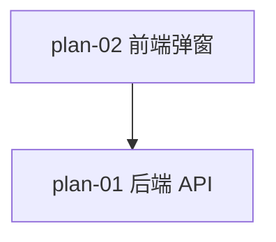

# 实现计划：股东分组匹配明细（07）

## 1. 概览

- **项目**: 股东分组匹配明细（07-股东分组匹配明细）
- **来源架构**: `docs/07-股东分组匹配明细/07-1-架构文档-股东分组匹配明细.md`
- **组织方式**: 功能维度（Feature-based）
- **项目类型**: brownfield（在已上线的 06「股东分析面板」之上做增量改造）
- **技术栈**: FastAPI + SQLAlchemy async + PostgreSQL（后端）/ Next.js 16 + React 19 + shadcn/ui + Playwright（前端）
- **总阶段数**: 2
- **总功能数**: 2
- **最大并行度**: 1（plan-02 强依赖 plan-01 提供的端点契约）
- **关键路径**: plan-01 → plan-02

## 2. 输入摘要

### 2.1 核心闭环与目标

本期是已上线的「股东监控组管理」模块的增量体验改造。核心闭环：**Keyword → Match → Detail** —— 管理员在编辑监控组弹窗内，针对每个关键词单独查看去重匹配股数，并能下钻查看该关键词匹配的「股票代码 + 股票名称 + 股东名称」三列明细，实现保存前自检。

不引入新数据表、不改造用户侧 `/api/v1/shareholder-analysis/*` 任何端点。所有改动可一次 `git revert` 回滚。

### 2.2 关键 ADR 与实施护栏

| ADR | 决策 | 实施护栏 |
| --- | --- | --- |
| ADR-1 | 股数细分通过新增独立端点 `preview-breakdown`，不扩展现有 `preview` | 现有 `preview` 端点（`server/src/api/admin/shareholder_groups.py:81-98`）原样不动；前端现有合并预览调用不动 |
| ADR-2 | 明细查询入参为单关键词（非多关键词） | 前端逐关键词点击时单独调用；同时只能展开一个关键词的明细（ADR-4） |
| ADR-3 | 明细 SQL 在后端一次性完成「匹配 + JOIN stocks + 排序 + 分页」 | 使用 `DISTINCT ON (symbol, holder_name)` 配合 `ORDER BY h.symbol, h.holder_name, h.ann_date DESC NULLS LAST`；`LEFT JOIN stocks` 缺失时 stockName=null，前端兜底显示「-」 |
| ADR-4 | 前端明细展开"同时只能展开一个关键词" | 维护 `expandedKeywordIdx: number \| null`，点击新关键词自动收起前一个 |
| ADR-5 | 股数细分与明细查询失败各自独立降级，不相互影响 | 每个关键词的股数查询独立 try/catch，失败项 `matchedStockCount: null`；明细查询独立 try/catch；均不抛错到顶层 `formError`，不阻塞保存 |

### 2.3 现有代码快照

| 文件 | 当前事实 | 改造方式 |
| --- | --- | --- |
| `server/src/api/admin/shareholder_groups.py` | 已挂载 `router = APIRouter(prefix="/shareholder-groups")`（line 22）；已实现 `GET /preview`（line 81-98）使用 `Query(...)` + `Depends(require_admin)` + `ApiResponse[PreviewMatchResponse]`；helper `_dict_to_camel`（line 70-72）转 snake_case 字典为 camelCase | 在 `preview` 之后、`GET ""` 列表之前新增 2 个端点（必须位于 `/{group_id}` 之前避免被动态路径吞掉） |
| `server/src/services/shareholder_group_service.py` | `class ShareholderGroupService(session: AsyncSession)`（line 98-103）；`_escape_like_keyword`（line 86-95）转义 LIKE 通配符；`_get_latest_report_period`（line 107-111）取 `MAX(report_period)`；`_count_matched_stocks`（line 113-154）OR 多关键词版，过滤空关键词 | 新增 4 个方法，复用上述 3 个工具；现有 `_count_matched_stocks` 不动 |
| `server/src/api/router.py` | admin_router 通过 `router.include_router(admin_router, prefix="/v1/admin")` 挂载（line 29），最终路径 `/api/v1/admin/*` | 不修改 |
| `web/src/lib/api.ts` | `API_BASE_WITH_PREFIX = ${API_BASE_URL}/api/v1`（line 8）；`AdminApiClient extends ApiClient`（line 437）已实现 get/post/patch/delete，自动加 auth headers + 提取 `response.data`；现有 `previewShareholderGroupMatch`（line 618-627）用 `URLSearchParams` 拼 endpoint | 在 `adminApi` 对象内新增 2 个方法，紧邻 `previewShareholderGroupMatch` 之后；沿用 `URLSearchParams` endpoint 拼接风格（便于 E2E mock 精确 URL 匹配） |
| `web/src/components/admin/ShareholderGroupPanel.tsx` | `GroupEditDialog`（line 291-535）已有 `keywords: string[]` state（line 294）+ `debounceRef`（line 301）+ 500ms debounce useEffect（line 320-348）调 `previewShareholderGroupMatch`；现有 catch 静默置 0（line 338-340）；关键词行渲染在 line 442 | 新增 3 个 state（perKeywordCounts / expandedKeywordIdx / detailState），改造现有 debounce 同步调股数细分，改造关键词行渲染加「X 只」标签 + 「查看明细 ▾」按钮 + 明细展开区；catch 改为显式错误提示 + 重试（满足 AC-07） |
| `web/tests/e2e/shareholder-groups.spec.ts` | 已存在（350 行），覆盖管理员登录 → 列表 → 新增 → 编辑 + 预览 → 删除；helpers/mock-shareholder-api.ts 已封装 `mockShareholderGroupsList` 等 helper | 扩展新场景（AC-01~09），在 mock helper 增加新端点的 mock |
| `server/tests/test_shareholder_group_admin_api.py` | 已存在（384 行），覆盖 5 个端点，含权限测试；fixture：admin_user / normal_user / admin_client（注入 dependency override）；pytest_asyncio + httpx AsyncClient；通过 `from main import app` 入口 | 在同一文件追加新端点的 pytest 测试，复用 fixtures |

### 2.4 架构约束

- **API 路径**：后端两个新端点必须挂在 `/api/v1/admin/shareholder-groups/preview-breakdown` 和 `/api/v1/admin/shareholder-groups/keyword-matches`（admin_router 已挂在 `/v1/admin`，子 router 已挂在 `/shareholder-groups`）；前端 endpoint 写 `/admin/shareholder-groups/preview-breakdown`（apiClient.baseURL 已含 `/api/v1`，避免双前缀）
- **响应包裹**：所有 admin 端点统一 `ApiResponse{ success, data, message }`；前端 `AdminApiClient.request` 已自动提取 `response.data`，组件消费时为 `res.data`
- **camelCase 输出**：后端响应体经 Pydantic `ConfigDict(alias_generator=to_camel, populate_by_name=True)`；query 参数仍用 snake_case（`page_size`、`exclude_group_id`）—— 与现有 `preview` 端点风格一致
- **管理员权限**：两个新端点都用 `Depends(require_admin)`，与现有 `preview` 一致
- **不写入数据**：本期所有查询均为只读 SELECT，不修改任何表
- **不引入新表 / 不修改 DDL**：复用 `top10_float_holders` + `stocks` 两个已有表

## 3. 验收标准追踪矩阵

> 架构文档 §2.4 验收标准承接矩阵的 9 条 AC，本期全部覆盖。AC-01/AC-02 同属「逐关键词股数 + 合并预览」并存展示，AC-03~AC-05 同属「明细下钻」一并验证。

| AC-ID | 需求原文 | 架构承接 | 计划承接 | 验证方式 | 当前状态 |
| --- | --- | --- | --- | --- | --- |
| AC-01 | 每个非空关键词展示单独匹配的去重股票数 | `ShareholderGroupService.preview_match_breakdown` + 前端 `GroupEditDialog` 逐关键词渲染 | plan-01, plan-02 | plan-01 §5 pytest（`test_preview_breakdown_returns_per_keyword_count`）+ plan-02 §5 Playwright（场景 1） | todo |
| AC-02 | 保留所有关键词合并匹配总数 | 复用现有 `preview` 端点不动 + 前端现有合并预览区不动 | plan-02 | plan-02 §5 Playwright（场景 1 底部合并数仍显示）+ plan-01 §5 回归（现有 `preview` 端点测试不破坏） | todo |
| AC-03 | 点击「查看明细」展示该关键词的明细列表 | `ShareholderGroupService.list_keyword_matches` + 前端「查看明细」按钮触发的就地展开 | plan-01, plan-02 | plan-01 §5 pytest（`test_keyword_matches_returns_three_columns`）+ plan-02 §5 Playwright（场景 2） | todo |
| AC-04 | 同一股票被多个匹配股东持有时按股东分行展示 | 后端 `_get_keyword_matches` 按 (symbol, holder_name) 粒度 DISTINCT ON，前端每行一条 | plan-01, plan-02 | plan-01 §5 pytest（`test_keyword_matches_same_stock_multi_holders_split_rows`）+ plan-02 §5 Playwright（场景 2 断言行数） | todo |
| AC-05 | 明细按股票代码升序，同股票多股东相邻 | 后端 SQL `ORDER BY h.symbol ASC, h.holder_name ASC, h.ann_date DESC NULLS LAST`，前端原样渲染 | plan-01, plan-02 | plan-01 §5 pytest（`test_keyword_matches_ordered_by_symbol_then_holder`）+ plan-02 §5 Playwright（场景 2） | todo |
| AC-06 | 修改关键词后股数与明细实时刷新 | 前端 500ms debounce 复用现有机制；明细已展开时同节奏刷新并重置到第 1 页 | plan-02 | plan-02 §5 Playwright（场景 3） | todo |
| AC-07 | 预览或明细查询失败均降级且不阻塞编辑与保存 | 前端 try/catch 后置错误状态，不抛错到表单；后端单关键词查询失败时该位置 `matchedStockCount: null` | plan-01, plan-02 | plan-01 §5 pytest（`test_preview_breakdown_partial_failure_returns_null_for_failed_keyword`）+ plan-02 §5 Playwright（场景 4 mock 500 → 错误提示 + 重试 + 保存可用） | todo |
| AC-08 | 空关键词不显示股数与明细入口 | 前端过滤 `kw.trim()` 为空时不渲染股数标签与按钮 | plan-02 | plan-02 §5 Playwright（场景 5 空行无 X 只 + 无查看明细） | todo |
| AC-09 | 关键词匹配数为 0 时查看明细入口置灰 | 前端依据 AC-01 股数结果，count === 0 时按钮 `disabled` | plan-02 | plan-02 §5 Playwright（场景 5 0 匹配按钮 disabled） | todo |

## 4. 模块地图

按功能聚合展示：

| 功能 | 包含模块 | 类型 | 对应文件 |
| --- | --- | --- | --- |
| plan-01 | ShareholderGroupService（新增 4 方法）、admin 路由（新增 2 端点 + 4 Pydantic 模型） | backend | plan-01-后端逐关键词股数与明细查询API.md |
| plan-02 | adminApi（新增 2 方法）、GroupEditDialog（state 扩展 + 渲染分支 + 分页 + 降级）、Playwright spec/mock | frontend | plan-02-前端编辑弹窗逐关键词股数与明细下钻.md |

## 5. 依赖图



节点使用 plan-ID 标识。plan-02 必须等 plan-01 提供 `/preview-breakdown` 和 `/keyword-matches` 端点契约（response shape + camelCase 字段）才能开始 red 阶段写 mock。

## 6. 阶段摘要

### Phase 1：后端 API（plan-01）

- **目标**：新增 `preview-breakdown` 和 `keyword-matches` 两个 admin GET 端点，覆盖 AC-01/03/04/05 的后端语义和 AC-02 的回归不破坏
- **维度**：backend
- **交付**：可被 pytest 集成测试验证的 API 端点，端到端契约稳定后才能交接给前端
- **退出条件**：`pytest tests/test_shareholder_group_admin_api.py` 全部通过（含新增 6+ 个测试用例），现有 `preview` 测试不破坏

### Phase 2：前端弹窗（plan-02）

- **目标**：在 `GroupEditDialog` 内逐关键词渲染股数标签 + 明细下钻 + 失败降级，覆盖 AC-01~AC-09 全部 9 条
- **维度**：frontend
- **依赖**：plan-01（API 契约）
- **退出条件**：`npx playwright test tests/e2e/shareholder-groups.spec.ts` 全部通过，5 个新场景 green

## 7. 任务总览

| 功能 | 阶段 | 包含维度 | 依赖 | 独立验收标准 |
| --- | --- | --- | --- | --- |
| plan-01 | Phase 1 | backend | （无） | §5：6+ 个 pytest 用例（AC-01/03/04/05/07 后端语义）+ 现有 preview 测试不破坏 — **review**（33/33 用例通过） |
| plan-02 | Phase 2 | frontend | plan-01 | §5：5 个 Playwright 场景（AC-01/02/03-05/06/07/08/09）+ `npm run build` / `npm run lint` 通过 — **review**（5 个新场景通过） |

### 7.1 关键路径与并行度

- **关键路径**：plan-01 → plan-02
- **最大并行度**：1（plan-02 强依赖 plan-01 端点契约）
- **说明**：plan-01 的端点签名（URL/query/响应字段）一旦定稿，plan-02 的 red E2E 即可独立编写 mock；但实际开发应串行，避免契约变更返工

### 7.2 开发状态机

| FEAT | 当前步骤 | red_e2e | implement | green_e2e | review | 最近证据 | 阻塞原因 | 更新时间 |
| --- | --- | --- | --- | --- | --- | --- | --- | --- |
| plan-01 | done | done | done | done | done | `docs/07-股东分组匹配明细/07-2-实现计划-股东分组匹配明细/reviews/plan-01-review-20260614.md` | - | 2026-06-14 |
| plan-02 | done | done | done | done | done | `docs/07-股东分组匹配明细/07-2-实现计划-股东分组匹配明细/reviews/plan-02-review-20260614.md` | - | 2026-06-14 |

`当前步骤` 枚举：`red-e2e → implement → green-e2e → task-review → done`（任一步可转 `blocked`）。详见 `.claude/contracts/workflow-schema.json` 的 `auto_dev`。

**说明**：plan-01 为后端 FEAT，red/green 用 pytest API 集成测试（参照 `test_shareholder_group_admin_api.py` 既有 5 个端点测试风格）；plan-02 为前端 FEAT，red/green 用 Playwright E2E（参照 `shareholder-groups.spec.ts` + `helpers/mock-shareholder-api.ts` 既有 mock 风格）。`docs/e2e/evidence/` 中已有的 `plan-01-*.md` 和 `plan-02-*.md` 是 06 需求的旧证据，本期需重新生成（建议文件名带 `-07-` 后缀或使用更新日期避免冲突）。

## 8. 未决策项

| 编号 | 问题 | 影响功能 | 需要谁决策 | 阻塞等级 |
| --- | --- | --- | --- | --- |
| — | 无 | — | — | — |

本期所有决策点在 PRD §1.3 与架构 ADR-1 ~ ADR-5 已闭环，无开放问题。

## 9. 执行前置

### 9.1 环境准备

- **后端**：PostgreSQL 实例运行（开发库已有 `top10_float_holders` 和 `stocks` 表数据，与 05/06 共用）；`cd server && source .venv/bin/activate`
- **前端**：`cd web && npm install` 已完成；Next.js dev server 启动在 `http://localhost:3100`（E2E baseURL）
- **Playwright**：`cd web && npx playwright install` 已完成（一次性）
- **测试数据**：`top10_float_holders` 至少有一个报告期数据（否则所有股数/明细返回 0，pytest 用例需自带 fixture 插入）

### 9.2 执行顺序

1. **plan-01（后端 API）**
   - red 阶段：在 `server/tests/test_shareholder_group_admin_api.py` 追加 6+ 个 pytest 用例（覆盖 AC-01/03/04/05/07 后端语义 + 现有 preview 回归），运行预期失败（端点 404）
   - implement：实现 4 个 service 方法 + 2 个端点 + 4 个 Pydantic 模型
   - green 阶段：同一组 pytest 用例全部通过
   - task-review：通过则状态 → done
2. **plan-02（前端弹窗）**
   - red 阶段：在 `docs/e2e/` 编写 Playwright 用例文档 + 在 `web/tests/e2e/shareholder-groups.spec.ts` 追加 5 个场景，运行预期失败；在 helpers/mock-shareholder-api.ts 追加新端点 mock
   - implement：扩展 `adminApi` 2 个方法 + 改造 `GroupEditDialog`（state + 渲染 + 分页 + 降级）
   - green 阶段：5 个场景全部通过
   - task-review：通过则状态 → done

### 9.3 全局验证

所有功能完成后执行：

```bash
# 后端：所有 admin shareholder 测试通过
cd server && source .venv/bin/activate && pytest tests/test_shareholder_group_admin_api.py -v

# 前端：类型检查 + lint
cd web && npm run build && npm run lint

# 前端：E2E 全套（含本期 5 个新场景 + 既有 shareholder-groups 测试不破坏）
cd web && npx playwright test tests/e2e/shareholder-groups.spec.ts

# 前端：其他相关 E2E（不应被本期改动影响）
cd web && npx playwright test tests/e2e/shareholder-analysis.spec.ts
```

## 10. 变更记录

| 日期 | 变更类型 | 功能 | 说明 |
| --- | --- | --- | --- |
| 2026-06-14 | 初次生成 | plan-01, plan-02 | 从 07-1 架构文档（status: done）拆分为 2 个功能：后端 API + 前端弹窗 |

<!-- 保留目录：reviews/。当 task-review、dev-plan-check 等开始运行时创建。 -->
