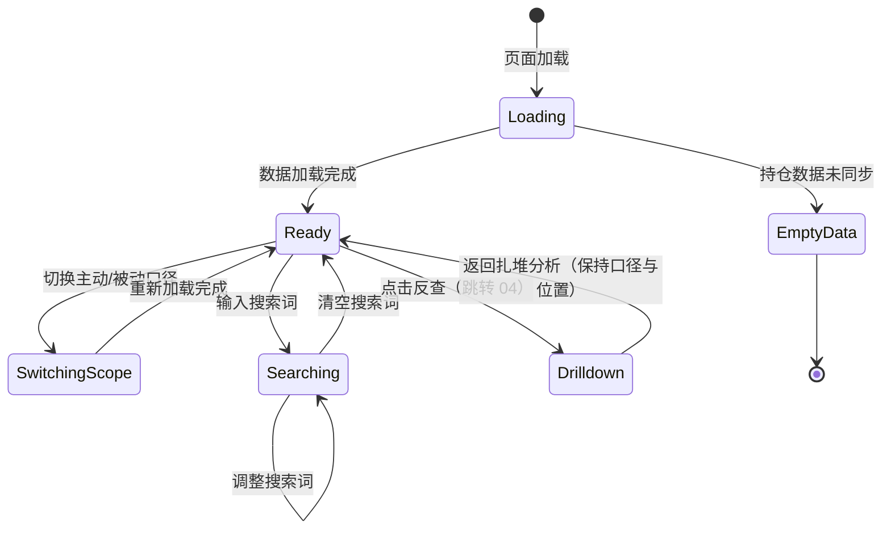

# 08-1 架构文档：基金扎堆股票分析

_本文件只保留当前版本真正影响实现的架构决策、边界和契约；DDL、目录树、环境变量、实施故事等内容默认不放入正文。_

## 1. 系统摘要

在 04 期基金持仓数据入库的基础上，新增面向用户的"基金扎堆股票分析"模块。系统从股票维度聚合 `fund_portfolio` 全市场基金重仓股记录，按"被多少基金持有"排序展示机构抱团排行榜，支持主动/被动口径切换、较上一报告期环比变化、按行业分布聚合，扎堆股可下钻到 04 反查页深挖。

**核心闭环**：Portfolio → Aggregate → Rank → Drilldown（持仓入库 → 股票聚合 → 扎堆排名 → 下钻反查）。

## 2. 范围、非目标与成功标准

### 2.1 范围

- **扎堆度排行榜**：按"被多少基金持有"（COUNT DISTINCT fund_ts_code）降序的股票列表，辅以"合计占流通股比"（SUM stk_float_ratio），含股票代码、名称、所属行业、环比变化
- **主动/被动口径切换**：默认"仅主动基金"，可切换"全部基金"；依据 `funds.invest_type` 字段过滤被动指数型基金
- **环比变化展示**：最新期 vs 上一报告期，"持有基金数变化"与"合计占流通比变化"两项升降，含"新进"标识
- **行业分布聚合**：扎堆股按行业聚合，以"扎堆股数量占比"为主指标可视化
- **下钻反查**：扎堆股行点击"反查"跳转 04 反查页（沿用其"占净值比 ≥1%"展示口径），提供返回入口
- **排行榜内搜索**：按股票代码（前缀）/ 名称（包含）过滤当前榜单

### 2.2 明确不做

- 实时持仓估算与盘中资金流向
- 历史多期扎堆度走势曲线（仅最新两期环比）
- 个股深度下钻到十大流通股东层（属 06 股东面板范畴）
- 用户自定义扎堆度阈值或自定义基金池监控
- 基金经理维度分析与基金业绩对比
- 抱团股预警通知与分享
- 用户手动选择历史报告期（首版固定取最新期）
- 预计算表 / 物化视图 / 独立缓存层

### 2.3 成功标准

| 指标 | 首版目标 |
|---|---|
| 扎堆排行榜展示 | 功能正常完成，按持有基金数降序，仅主动基金口径默认生效 |
| 主动/被动口径切换 | 切换后排行榜按新口径重新计算与重排，切回恢复原结果 |
| 环比变化展示 | 基金数与占流通比两项升降正确，新进股票以"新进"标识 |
| 行业分布展示 | 以扎堆股数量占比为主指标正确可视化 |
| 下钻反查 | 跳转 04 反查页展示基金明细，返回时口径与位置保持一致 |
| 数据缺失降级 | 持仓未同步展示空状态；上期缺失环比列显示"—"不阻断浏览 |
| 排行榜内搜索 | 代码前缀/名称包含匹配，无结果显示提示，清空恢复完整榜单 |
| 排行榜页加载 | < 3s（最新期单期约 15 万行聚合 + 分页 20 条） |

### 2.4 验收标准承接矩阵

| AC-ID | PRD 原文摘要 | 承接模块 | 关键链路 / 状态 | 风险 / 降级说明 |
|---|---|---|---|---|
| AC-01 | 扎堆度排行榜展示 | FundCrowdAPI + FundCrowdUI | 链路 6.1（排行榜加载） | 聚合依赖 fund_portfolio 已同步；最新期取 MAX(report_period) |
| AC-02 | 主动/被动口径切换 | FundCrowdAPI + FundCrowdUI | 链路 6.1（scope 参数传递） | scope=active 时 WHERE 过滤 invest_type；切回 all 时无过滤 |
| AC-03 | 环比变化展示 | FundCrowdAPI + FundCrowdUI | 链路 6.1（环比计算分支） | 依赖上期数据存在；上期无该股记录 → 新进 |
| AC-04 | 行业分布展示 | FundCrowdAPI + FundCrowdUI | 链路 6.2（行业分布加载） | 依赖 sector_stocks 行业关联；无关联归"未分类" |
| AC-05 | 下钻反查 | FundCrowdUI + 04 ReverseLookup | 链路 6.3（下钻跳转） | 复用 04 反查（≥1% 口径），可能"下钻列表数 < 扎堆基金数"，需前端提示 |
| AC-06 | 上期数据缺失的降级呈现 | FundCrowdAPI + FundCrowdUI | 链路 6.1（has_prev_period=false 分支） | 当期排名正常，环比列显示"—"或"数据不完整" |
| AC-07 | 持仓数据未同步的空状态 | FundCrowdAPI + FundCrowdUI | 链路 6.1（空数据分支） | fund_portfolio 表无数据时返回 has_data=false，前端整页空状态 |
| AC-08 | 排行榜内搜索 | FundCrowdAPI + FundCrowdUI | 链路 6.1（search 参数传递） | 后端 SQL 过滤；无结果显示"未找到匹配股票"提示 |

## 3. 用户流程与状态

### 3.1 主流程

**流程 A：用户发现机构抱团股**

1. 用户从导航栏进入"基金扎堆分析"页面
2. 页面默认加载"仅主动基金 · 最新报告期"的扎堆度排行榜（按持有基金数降序）
3. 用户看到榜首股票：被 N 只主动基金共同持有，合计占流通股比 X%，环比基金数 +M
4. 用户在"行业分布"区看到抱团股集中在某些行业
5. 用户点击某只扎堆股的"反查"按钮，跳转 04 反查页深挖具体基金

**流程 B：用户判断抱团方向**

1. 用户在排行榜查看"环比变化"列
2. 看到"基金数 +N、占比 +X%"标记的股票（上行，抱团加强）
3. 看到"基金数 -N、占比 -X%"标记的股票（下行，抱团瓦解）
4. 看到"新进"标记的股票（上期无基金重仓、本期新被抱团）

**流程 C：用户切换主动/被动口径**

1. 用户在口径切换控件点击"全部基金"
2. 排行榜灰显并重新加载，纳入场内 ETF 与被动指数基金
3. 用户对比排名变化，观察加入被动资金后的差异
4. 切回"仅主动基金"恢复原结果

### 3.2 关键分支

| 分支名 | 入口/触发条件 | 架构处理方式 |
|---|---|---|
| 持仓数据未同步 | fund_portfolio 表无任何数据 | API 返回 `has_data: false`，前端整页空状态"暂无基金持仓数据，请联系管理员同步" |
| 上期数据缺失 | 全局最新期存在但上一期无任何记录 | API 返回 `has_prev_period: false`，环比列统一显示"—"或"数据不完整"，当期排名正常 |
| 个股上期无持仓 | 上期数据存在但该股上期无记录 | 该股环比标记"新进"（fund_count_change 显示为 "新进" 而非数值） |
| 下钻列表数 < 扎堆基金数 | 边界情况：大基金某重仓股占净值 <1% | 04 反查页过滤掉该基金，前端反查页顶部展示提示文案（见 §7.6） |
| 搜索无结果 | search 无匹配股票 | 表格区显示"未找到匹配股票，请调整搜索词" |
| 行业分布为空 | 扎堆股均无 sector_stocks 关联 | 隐藏行业分布区或提示"暂无行业分布" |
| 口径切换中 | 用户点击切换 | 排行榜灰显并重新加载，scope 状态在当次会话保持 |

### 3.3 状态机

页面交互状态：



关键规则：
- 切换口径触发排行榜重新加载（scope 参数变化），行业分布与排行榜联动刷新
- 搜索为前端表格过滤或后端 SQL WHERE（取决于搜索词触发频率，见 §6.1），不触发口径变化
- 下钻跳转 04 反查页后返回，前端通过 URL query 或 sessionStorage 恢复原口径与浏览位置

## 4. 系统上下文与模块职责

### 4.1 系统上下文

本功能嵌入现有系统，完全复用 04 期入库的 `fund_portfolio` + `funds` 数据，以及现有 `sectors` + `sector_stocks` 行业体系，不引入外部数据源。

变更点：
- 新增面向用户的 `FundCrowdAnalysisService` 聚合查询服务（按股票维度聚合扎堆度 + 环比 + 行业分布）
- 新增前端"基金扎堆分析"独立路由页（与 04 基金分析、06 股东分析平级）
- 依赖现有 `funds`（invest_type 用于主动/被动过滤）、`fund_portfolio`（聚合源）、`sectors` + `sector_stocks`（行业维度）、`stocks`（股票名 JOIN）

数据流向：
- fund_portfolio（只读）+ funds（只读 JOIN invest_type）+ sectors/sector_stocks（只读 JOIN 行业）+ stocks（只读 JOIN 名称）→ FundCrowdAnalysisService（聚合）→ FundCrowdAPI（JSON）→ 前端展示
- 前端 → FundCrowdUI → 04 ReverseLookup（下钻，跨模块跳转）

### 4.2 模块职责

| 模块 | 职责 | 上游输入 | 下游输出 |
|---|---|---|---|
| `FundCrowdAnalysisService` | 面向用户的扎堆度聚合查询：排行榜、环比、行业分布 | fund_portfolio（只读聚合）+ funds（invest_type 过滤）+ sectors/sector_stocks（行业 JOIN）+ stocks（名称 JOIN） | API 响应 |
| `FundCrowdRepository` | 扎堆度 DB 查询封装（GROUP BY 聚合、环比子查询、行业 JOIN、分页搜索） | Service 调用 | ORM/原始行查询结果 |
| 前端 `FundCrowdAnalysisPage` | 用户侧面板页：口径切换 + 行业分布 + 排行榜 + 搜索 | 用户交互 + API 数据 | 页面渲染 |
| 前端 `CrowdRankingTable` | 排行榜表格（含搜索、口径切换、环比、反查跳转） | 用户交互 + rankings API | 表格渲染 + 路由跳转 |
| 前端 `CrowdIndustryDistribution` | 行业分布水平条形图（ECharts） | industry-distribution API | 图表渲染 |

**复用声明验证**：

- **复用 `fund_portfolio` 表**：验证 `FundPortfolio` 模型字段 `fund_ts_code/report_period/stock_symbol/market_value/amount/stk_mkv_ratio/stk_float_ratio`，完全满足扎堆度聚合（COUNT DISTINCT fund_ts_code + SUM stk_float_ratio）。数据源：04 期 `FundDataInitService.sync_fund_portfolio(period)` 写入。前置依赖：04 期持仓同步任务已执行。结论：可复用，只读聚合，无写入。

- **复用 `funds.invest_type` 字段做主动/被动过滤**：**验证**（代码级 + 数据级）：`invest_type` 字段同时承载投资风格与主动/被动标识。实际枚举值经 DB 查询确认（见 §5 ADR-1）：
  - 被动型枚举：`被动指数型`（5740 条）、`增强指数型`（1106 条）
  - 场内 ETF 与场外联接基金（如 016968.OF 兴业中证500ETF联接）均统一标 `被动指数型`，无需额外看 `market` 字段
  - 其他枚举（成长型/价值型/平衡型/普通股票型 等）均为主动型
  - 结论：被动判定 = `invest_type IN ('被动指数型', '增强指数型')`；主动判定 = `invest_type NOT IN ('被动指数型', '增强指数型') OR invest_type IS NULL`

- **复用 04 `/funds/reverse-lookup` 端点做下钻**：**验证**（代码级）：`server/src/api/v1/funds.py` 的 reverse_lookup 调用 `FundRepository.reverse_lookup`，其 `stk_mkv_ratio >= 1.0` 阈值**硬编码在 Repository 层 SQL WHERE 子句**（`server/src/repositories/fund_repository.py:376`），参数层无法覆盖。08 下钻复用 04 该端点时必然继承 ≥1% 过滤，与 08"存在即重仓"计数口径产生边界差异。结论与对策见 §5 ADR-4。

- **复用 `sectors` + `sector_stocks` 行业维度**：**验证**（代码级，参考 06 service `_get_industry_for_stocks`）：JOIN 方式 `SectorStock.stock_code == Stock.symbol AND Sector.code == SectorStock.sector_code AND Sector.type == 'industry'`。一只股票可关联多个行业板块，全部展示（与 06 一致）。结论：可复用，JOIN 范式直接借鉴 06。

- **复用 `BaseRepository`**：验证提供通用 CRUD；FundCrowdRepository 继承后扩展聚合专项方法。

- **复用 04 前端 `ReverseLookupTable` 与反查页路由**：**验证**（代码级）：`web/src/app/dashboard/funds/reverse-lookup/` + `web/src/components/funds/ReverseLookupTable.tsx`。08 下钻直接路由跳转到该页（带 query 参数 `symbol` + 返回标记），不重复造反查能力。

### 4.3 需要刻意避免的过度设计

- **不引入独立缓存层 / 预计算表 / 物化视图**：fund_portfolio 最新期单期约 15 万行（经 DB 查询确认），PostgreSQL GROUP BY 聚合在合理索引下性能可接受；季度报告期数据低频变更，无需缓存。与 06 范式一致。
- **不引入扎堆度快照表**：实时聚合即满足查询，参考 06 实时聚合范式。
- **不新建独立反查端点**：复用 04 reverse-lookup（接受 ≥1% 差异 + 前端提示），不重复造一致口径的反查能力（见 ADR-4 决策）。
- **不引入用户报告期选择**：首版固定取最新期，环比自动取上一期。
- **不引入 Prompt / AI 模块**：本需求纯数据聚合与展示。

## 5. 关键架构决策（ADR）

### ADR-1：主动/被动判定口径 — 基于 funds.invest_type 字段过滤

- **选择**：被动型判定 = `invest_type IN ('被动指数型', '增强指数型')`；主动型判定 = 其余所有值（含 NULL）。`scope=active`（默认）时 WHERE `invest_type NOT IN ('被动指数型','增强指数型') OR invest_type IS NULL`；`scope=all` 时无 invest_type 过滤。
- **理由**：经 DB 实际数据核实，`invest_type` 字段同时承载投资风格与主动/被动标识，被动型枚举明确为"被动指数型"（含场内 ETF 与场外联接基金）+ "增强指数型"。无需额外字段或 market 字段辅助判定，链路最短。"增强指数型"虽含主动管理成分，但其核心跟踪指数会机械重复持有成份股，符合 PRD"被动指数型干扰共识"的剔除诉求，归入被动。
- **风险与对策**：invest_type 为 NULL 的基金（少量）默认归主动。对策：NULL 在 SQL `NOT IN` 中需 `OR invest_type IS NULL` 显式包含，避免被动过滤时漏掉主动基金。

### ADR-2：扎堆度聚合 — 按股票维度 GROUP BY，持仓计入 = 存在即重仓

- **选择**：聚合 SQL = `SELECT stock_symbol, COUNT(DISTINCT fund_ts_code) AS fund_count, SUM(stk_float_ratio) AS total_float_ratio FROM fund_portfolio WHERE report_period = :latest GROUP BY stock_symbol ORDER BY fund_count DESC, total_float_ratio DESC`。**不加 stk_mkv_ratio 阈值**（数据源为基金披露十大重仓股，存在即重仓）。
- **理由**：持仓明细数据源本身已是基金定期报告披露的十大重仓股，二次过滤冗余且会误剔合法重仓。COUNT DISTINCT 反映"共识广度"，SUM 反映"资金深度"，主排序用 COUNT 最符合"抱团"直觉。不引入复合加权得分（口径难向用户解释）。
- **风险与对策**：stk_float_ratio 为 NULL（港股/境外标的）不计入 SUM 但仍计入 fund_count。对策：SUM 时数据库自动忽略 NULL；前端对 total_float_ratio=NULL 显示"—"。

### ADR-3：环比计算 — 最新期 vs 上一期，跨期 Python 内存对比

- **选择**：最新期 = `MAX(report_period)`（全局，不分 scope）；上一期 = `DISTINCT report_period DESC` 取次大值。Service 层分别聚合 current 与 prev 两期数据，按 stock_symbol 做 dict 对比：fund_count_change = cur_count - prev_count；total_float_ratio_change = cur - prev；若 prev 中无该 stock_symbol → "新进"（is_new=true）。
- **理由**：复用 06 `_compute_change_directions` 范式（Python 内存对比），逻辑透明可控，避免复杂 SQL 自连接。两期数据各一次聚合查询，单期 ~15 万行 GROUP BY 在索引保障下单次 < 1s，可接受。
- **风险与对策**：上期数据完全缺失时 has_prev_period=false，所有股票环比统一显示"—"。对策：API 返回 has_prev_period 标志，前端按标志决定整列渲染。

### ADR-4：S-3 双轨下钻契约 — 复用 04 reverse-lookup + 前端提示，不新建端点

- **选择**：08 下钻**直接复用** `/api/v1/funds/reverse-lookup`（沿用其 stk_mkv_ratio ≥1% 展示口径），不新建 08 一致口径的反查端点。前端在反查页顶部展示差异提示文案（见 §7.6）。
- **理由**：复用反查能力链路最短，避免维护两个反查端点的代码与口径漂移成本。"下钻列表数 < 扎堆基金数"是边界情况（仅大基金某重仓股占净值 <1% 时出现），十大重仓股占净值通常 ≥1%，绝大多数情况下两者一致。前端提示即可让用户理解差异，无需为边界情况新建端点。新建一致口径端点的收益（消除边界差异）小于其成本（重复代码 + 口径维护）。
- **风险与对策**：用户可能困惑"为什么扎堆基金数和下钻列表数对不上"。对策：反查页顶部固定提示文案"扎堆统计计入全部重仓记录，本表按占净值比 ≥1% 展示，个别大基金的边界持仓可能未在下钻列表中显示"。

### ADR-5：行业分布聚合 — 复用 sectors/sector_stocks，主指标 = 扎堆股数量占比

- **选择**：行业分布通过 `sector_stocks JOIN sectors(type='industry')` 获取每只扎堆股的行业（一股多行业全部展示），按行业分组 `COUNT(DISTINCT stock_symbol) / 总扎堆股数` 为主指标；辅以 `SUM(total_float_ratio)` 作参考。
- **理由**：行业板块数据已在站内板块体系中结构化维护，与 06 范式一致。一只股票关联多个行业板块时按独立计数统计（与 06 一致）。不引入主行业判定（06 的 TODO 同样未做），首版接受行业分布可能偏分散。
- **风险与对策**：行业分布可能极度分散（GICS 多级分类，一股均 ~6 行业）。对策：前端图表自行截断 Top N 展示，与 06 行为一致。

### ADR-6：性能策略 — 依赖索引，不引入缓存

- **选择**：依赖 fund_portfolio 已有索引 `(stock_symbol, report_period)` 和 `(fund_ts_code, report_period)`，单期 15 万行 GROUP BY 聚合 < 1s，不引入 Redis / 内存缓存 / 预聚合表。
- **理由**：fund_portfolio 季度更新（年 4 次），查询频率远低于行情数据；单用户个人工具，并发低；与 06 范式一致。引入缓存的复杂度收益不抵成本。
- **风险与对策**：若后续数据量增长（多期堆积），WHERE report_period = :latest 已限制单期扫描量，性能可控。对策：监控查询耗时，必要时增加 `report_period` 单字段索引或分区。

### ADR-7：前端独立路由 — 与 04/06 平级

- **选择**：新增 `/dashboard/fund-crowd-analysis` 独立路由，与 `/dashboard/funds`（04）和 `/dashboard/shareholder-analysis`（06）平级。
- **理由**：扎堆分析是独立功能域（"全市场股票看扎堆度"），与 04（"按基金查持仓"）、06（"按机构聚合持仓"）形成对称互补视角。独立路由便于导航入口清晰。不嵌入 04 基金分析页（视角混淆，发现入口被埋没）。
- **风险与对策**：无显著风险，与现有页面路由模式一致。

### 5.x 待确认问题

无。关键假设已在 ADR 中记录并通过代码级核实：invest_type 主动/被动枚举已确认；fund_portfolio 量级已确认（150 万行 / 最新期 15 万行）；04 reverse-lookup 阈值硬编码位置已确认。

## 6. 运行链路

### 6.1 扎堆排行榜加载（含口径切换、搜索、环比）

1. 前端渲染页面，发起 `GET /api/v1/fund-crowd-analysis/rankings?scope=active&page=1&pageSize=20&search=` 请求（scope 默认 active）
2. FundCrowdAPI 接收参数，调用 `FundCrowdAnalysisService.get_rankings(scope, search, page, page_size)`
3. Service 执行：
   a. 查询 `SELECT DISTINCT report_period FROM fund_portfolio ORDER BY report_period DESC LIMIT 4`，确定 `current_period`（最新）与 `prev_period`（次大）
   b. 若无任何 report_period → 返回 `{ has_data: false }`，前端展示空状态
   c. 构建 current 期扎堆度聚合：JOIN funds（取 invest_type）+ WHERE `report_period = current_period` + scope 过滤（scope=active 时 `WHERE invest_type NOT IN ('被动指数型','增强指数型') OR invest_type IS NULL`）+ GROUP BY stock_symbol → `{ stock_symbol, fund_count, total_float_ratio }`
   d. 若 has_prev_period：构建 prev 期同样聚合（dict 索引）
   e. 计算环比：对 current 每只股票，对比 prev 同 symbol 的 fund_count 与 total_float_ratio；prev 无该 symbol → `is_new=true`；has_prev_period=false 时所有股票 fund_count_change / total_float_ratio_change 返回 null
   f. JOIN stocks 取 stock_name，JOIN sector_stocks + sectors 取行业（一股多行业逗号分隔）
   g. 应用 search 过滤（stock_symbol 前缀 OR stock_name 包含，ILIKE 不区分大小写）
   h. ORDER BY fund_count DESC, total_float_ratio DESC，分页返回
4. 返回 `{ has_data, current_period, prev_period, has_prev_period, items: RankingItem[], total, page, pageSize }`
5. 前端渲染排行榜表格，含环比列（数值+箭头 或 "新进" 或 "—"）

实现原则：
- scope 过滤在 SQL WHERE 层实现，避免取出全部数据再 Python 过滤
- search 在 SQL WHERE 层过滤（stock_symbol LIKE 'xxx%' OR stock_name ILIKE '%xxx%'），分页后再返回；不前端过滤（保证分页 total 正确）
- 主动/被动过滤的 invest_type 枚举值在后端定义为常量（`PASSIVE_INVEST_TYPES = ('被动指数型', '增强指数型')`），便于后续调整
- 聚合查询用 SQLAlchemy `func.count(FundPortfolio.fund_ts_code.distinct())` + `func.sum(FundPortfolio.stk_float_ratio)`
- stk_float_ratio 为 NULL 的记录不计入 SUM（数据库自动忽略 NULL），但仍计入 fund_count
- 环比对比算法（Python 内存，复用 06 范式）：
  - 构建 `prev_map: { stock_symbol: (fund_count, total_float_ratio) }`
  - 对 current 每只股票：若 symbol not in prev_map → `is_new=true, fund_count_change=null`；否则 `fund_count_change = cur_count - prev_count`
- 排序稳定性：fund_count 相同时按 total_float_ratio DESC（数据库 ORDER BY 双字段保证）

### 6.2 行业分布加载

1. 前端在排行榜加载后并行发起 `GET /api/v1/fund-crowd-analysis/industry-distribution?scope=active` 请求
2. FundCrowdAPI 调用 `FundCrowdAnalysisService.get_industry_distribution(scope)`
3. Service 执行：
   a. 复用 6.1 步骤 a-b（确定 current_period，无数据返回空）
   b. 构建 current 期扎堆度聚合（同 6.1 步骤 c，但只需 stock_symbol 集合）
   c. JOIN `sector_stocks ON sector_stocks.stock_code = stock_symbol` + `sectors ON sectors.code = sector_stocks.sector_code AND sectors.type = 'industry'`，获取每只股票的行业列表
   d. 按行业分组 `COUNT(DISTINCT stock_symbol)`，计算占比 = 该行业股票数 / 总扎堆股数
   e. 同时计算每行业 `SUM(total_float_ratio)` 作为参考字段
   f. 行业为空的股票归入"未分类"桶
4. 返回 `{ has_data, current_period, distribution: IndustryItem[] }`
5. 前端渲染行业分布水平条形图（Top N 截断，与 06 一致）

实现原则：
- industry-distribution 接口与 rankings 接口 scope 参数同步（口径切换时两者都重发）
- 一股多行业时各行业独立计数（与 06 范式一致）
- 前端图表自行截断 Top N（如 Top 10），其余合并"其他"
- distribution 返回全量行业（不后端截断），保证筛选 UI 数据源完整

### 6.3 下钻反查（跳转 04 反查页）

1. 用户在排行榜某行点击"反查"按钮
2. 前端记录当前 scope 与浏览位置（page、search、scroll）到 sessionStorage 或 URL query
3. 前端路由跳转 `/dashboard/funds/reverse-lookup?symbol={stock_symbol}&from=fund-crowd` （新增 from 参数标识来源，供 04 反查页展示"返回扎堆分析"入口）
4. 04 反查页加载，调用 `GET /api/v1/funds/reverse-lookup?symbol=...`（沿用 04 既有端点，stk_mkv_ratio ≥1% 过滤由 Repository 层自动应用）
5. 04 反查页顶部检测到 `from=fund-crowd` query 参数，展示差异提示文案（见 §7.6）+ "返回扎堆分析"按钮
6. 用户点击"返回扎堆分析"，前端从 sessionStorage / URL query 恢复原 scope、page、search 状态，路由回 `/dashboard/fund-crowd-analysis`

实现原则：
- 不修改 04 反查页核心逻辑，仅新增 `from` query 参数处理（条件渲染提示 + 返回按钮）
- 返回状态恢复通过 sessionStorage（key 如 `fund-crowd-return-state`）承载，避免 URL 过长
- 提示文案仅在 `from=fund-crowd` 时展示，不影响 04 原生入口的反查体验
- 边界情况"下钻列表数 < 扎堆基金数"由前端在 04 反查页加载完成后对比（如有）或固定展示提示，不做精确数值对比（避免再次请求扎堆数据）

## 7. 领域对象与关键契约

### 7.1 核心对象

| 对象名 | Source of Truth | Owner | 用途 |
|---|---|---|---|
| `FundPortfolio`（已有） | `fund_portfolio` 表 | 04 期同步服务 | 扎堆度聚合数据源（只读） |
| `Fund`（已有） | `funds` 表 | 04 期同步服务 | invest_type 过滤（主动/被动判定） |
| `Sector` / `SectorStock`（已有） | `sectors` / `sector_stocks` 表 | 板块体系 | 行业维度（只读 JOIN） |
| `Stock`（已有） | `stocks` 表 | 03 期同步服务 | 股票名 JOIN（只读） |

08 不新增任何数据表。

### 7.2 推荐最小 Schema

```typescript
// 排行榜单项（API 响应输出视角，camelCase；后端 Pydantic model 用 to_camel alias 自动转换）
interface RankingItem {
  stockSymbol: string;              // 股票代码，如 "600519"
  stockName: string | null;         // 股票名称（JOIN stocks.name，无匹配为 null，前端显示 "—"）
  industries: string[];             // 所属行业列表（一股多行业，逗号分隔展示）
  fundCount: number;                // 持有该股的基金数（COUNT DISTINCT fund_ts_code）
  totalFloatRatio: number | null;   // 合计占流通股比（%，SUM stk_float_ratio；全 NULL 时为 null）
  fundCountChange: number | null;   // 基金数环比变化（cur - prev）；has_prev_period=false 或 is_new 时为 null
  totalFloatRatioChange: number | null; // 占流通比环比变化（百分点）；同上
  isNew: boolean | null;            // 是否新进（上期无该股任何记录）；has_prev_period=false 时为 null
}

// 排行榜响应
interface RankingsResponse {
  hasData: boolean;                 // 是否有持仓数据
  currentPeriod: string | null;     // 当前报告期 ISO 字符串，如 "2026-03-31"
  prevPeriod: string | null;        // 上一报告期 ISO 字符串；无上期为 null
  hasPrevPeriod: boolean;           // 是否有上一期数据
  items: RankingItem[];
  total: number;
  page: number;
  pageSize: number;
}

// 行业分布单项
interface IndustryItem {
  industry: string;                 // 行业名称（如 "食品饮料"）；"未分类" 为兜底桶
  stockCount: number;               // 该行业扎堆股数
  percentage: number;               // 占比（%，= stockCount / 总扎堆股数）
  totalFloatRatio: number;          // 该行业扎堆股合计占流通比参考值
}

// 行业分布响应
interface IndustryDistributionResponse {
  hasData: boolean;
  currentPeriod: string | null;
  distribution: IndustryItem[];
}
```

### 7.3 API 边界

| 接口路径 | 方法 | 用途 | 说明 |
|---|---|---|---|
| `/api/v1/fund-crowd-analysis/rankings` | GET | 扎堆度排行榜 | 参数：scope（active 默认 / all）、search（可选，股票代码前缀或名称包含）、page（默认 1）、pageSize（默认 20）。返回 RankingsResponse |
| `/api/v1/fund-crowd-analysis/industry-distribution` | GET | 行业分布 | 参数：scope（active 默认 / all）。返回 IndustryDistributionResponse。不受 search 影响（分布是排行榜全集的行业聚合） |
| `/api/v1/funds/reverse-lookup`（04 已有，复用） | GET | 下钻反查 | 参数：symbol（必填）、page、pageSize。沿用 04 stk_mkv_ratio ≥1% 过滤。新增 `from=fund-crowd` query 参数由前端路由层传递（非 API 参数，仅前端识别） |

请求字段数据来源说明：
- `scope`：user_input（用户点击口径切换控件）
- `search`：user_input（用户在搜索框输入）
- `page` / `pageSize`：frontend_computed（分页参数）
- `symbol`：derived（从排行榜点击行的 stockSymbol 派生）
- `from`：system_generated（前端路由层固定传 `fund-crowd`，标识来源）

**API 契约约定**（与 04/06 既有约定对齐）：
- **响应包裹结构**：统一 `{ success: true, data: {...} }`，data 内含业务字段（与 04 funds API、06 shareholder-analysis API 一致）
- **命名转换边界**：响应输出 camelCase（Pydantic `to_camel` alias）；query / 路径参数保持原风格（scope / search / page / pageSize，camelCase 参数名与 04 funds 端点的 page / page_size 一致——注意 04 实际接收为 page_size snake_case，前端 apiClient 已统一处理，08 沿用同一客户端封装）
- **序列化约定**：date → ISO 字符串；Decimal → float（参照 04 `_serialize_value` 实现，避免高精度数值序列化为字符串破坏前端图表渲染）；stk_float_ratio 等数值字段必须为 number 而非 string
- **Schema 视角**：§7.2 的 RankingItem / IndustryItem 均为 API 响应输出视角（camelCase）；后端 Pydantic model 字段用 snake_case（stock_symbol / fund_count 等），通过 `ConfigDict(alias_generator=to_camel, populate_by_name=True)` 自动转换，与 04 FundOut / 06 schema 范式一致

### 7.4 状态流转

本功能不引入新的后台任务类型，所有操作为同步 API 调用。无后端状态机。

前端会话状态（scope、page、search）通过 sessionStorage 或 URL query 维护，支持下钻返回后恢复。

### 7.5 数据边界

| 存储层 | 职责 |
|---|---|
| PostgreSQL `fund_portfolio` 表（已有，04） | 扎堆度聚合数据源，只读查询 |
| PostgreSQL `funds` 表（已有，04） | invest_type 主动/被动过滤，只读 JOIN |
| PostgreSQL `sectors` + `sector_stocks` 表（已有） | 行业分类数据，只读 JOIN |
| PostgreSQL `stocks` 表（已有，03） | 股票名称（字段名 `name`），只读 JOIN |

### 7.6 命名与标识规则

| 维度 | 规则 |
|---|---|
| 表名 | 不新增表，全部复用既有（snake_case） |
| Service 类名 | `FundCrowdAnalysisService`（PascalCase） |
| Repository 类名 | `FundCrowdRepository`（PascalCase） |
| API 路径（用户侧） | `/api/v1/fund-crowd-analysis/*`（kebab-case，与 06 `/shareholder-analysis/*` 范式一致） |
| 前端路由 | `/dashboard/fund-crowd-analysis`（kebab-case） |
| 口径枚举 | `scope` = `active` / `all`（小写字符串，便于 URL query 传递） |
| JSON 命名风格 | camelCase（前端），snake_case（Python/DB），API 层自动转换 |

术语映射：

| PRD/前端术语 | 后端字段 / 枚举 | 说明 |
|---|---|---|
| 扎堆度 / 持有基金数 | `fund_count`（COUNT DISTINCT fund_ts_code） | 主排序指标 |
| 合计占流通比 | `total_float_ratio`（SUM stk_float_ratio） | 辅展示指标 |
| 仅主动基金 | `scope=active` | invest_type NOT IN ('被动指数型','增强指数型') OR NULL |
| 全部基金 | `scope=all` | 无 invest_type 过滤 |
| 被动型基金 | invest_type IN ('被动指数型', '增强指数型') | 含场内 ETF + 场外联接 + 增强指数 |
| 新进 | `is_new=true` | 上期无该股任何基金记录 |
| 行业分布 | `industry_distribution` | 按 sector type=industry 聚合 |
| 反查 / 下钻 | `/funds/reverse-lookup`（04 复用） | 沿用 04 ≥1% 展示口径 |

**下钻差异提示文案预案**（04 反查页顶部，仅 `from=fund-crowd` 时展示）：

> 扎堆统计计入全部重仓记录，本表按占净值比 ≥1% 展示，个别大基金的边界持仓可能未在下钻列表中显示。

## 8. 非功能需求、风险与运行策略

### 8.1 性能与吞吐量目标

| 指标 | 目标 | 预期 |
|---|---|---|
| 排行榜加载（含环比） | < 3s | 单期 15 万行 GROUP BY + 环比二期聚合 + 分页，预估各 < 1s |
| 行业分布加载 | < 2s | 扎堆股集合 JOIN sectors，预估 < 500ms |
| 下钻反查（复用 04） | < 3s | 04 已有性能保障 |
| 预期并发 | 单用户 | 个人工具，低并发 |

### 8.2 可靠性、错误处理与降级策略

**错误处理**：
- 数据库查询异常 → API 返回 500 + 通用错误信息，前端展示"加载失败，请重试"
- 无持仓数据 → rankings API 返回 `{ has_data: false }`，前端整页空状态
- 无上期数据 → rankings API 返回 `{ has_prev_period: false }`，环比列统一显示"—"

**降级策略**（按用户体验影响从小到大排列）：

| 降级级别 | 触发条件 | 系统行为 |
|---|---|---|
| L1：部分股票无行业 | sector_stocks 未覆盖 | 行业列显示"—"，行业分布归入"未分类" |
| L2：部分股票无 stock_name | stocks 表未覆盖（港股/境外） | stock_name 显示"—"，不影响扎堆度计算 |
| L3：stk_float_ratio 全 NULL | 港股/境外标的无流通比 | total_float_ratio=null，前端显示"—"；fund_count 正常 |
| L4：无上期数据 | 上个报告期未同步 | 环比列统一"—"，当期排名正常 |
| L5：无持仓数据 | fund_portfolio 表为空 | 全页空状态"暂无基金持仓数据" |

### 8.3 安全与反滥用策略

| 项目 | 首版策略 |
|---|---|
| 用户侧 API 权限 | 复用现有 JWT 认证（`get_current_user`），登录后可访问，与 04/06 一致 |
| SQL 注入防护 | SQLAlchemy ORM 参数化查询；search 参数使用 `bindparam` 或 ILIKE 模板拼接（参数绑定） |
| LIKE 通配符注入 | search 中的 `%` 和 `_` 需转义（参照 06 `_escape_like_keyword` 实现） |
| 数据写入 | 08 全模块只读，无写入操作 |

### 8.4 成本控制预期

| 模块 | 预估成本 | 首版控制策略 |
|---|---|---|
| 数据库查询 | 纯 PostgreSQL 查询，0 额外成本 | 依赖已有索引，单次查询 < 3s |
| 前端渲染 | 标准 React + ECharts 渲染 | 排行榜与行业分布分区渲染，避免全页重渲染 |
| 数据存储 | 不新增表 | 忽略不计 |

**外部依赖**：无新增外部依赖。所有数据来自既有 PostgreSQL 表。

### 8.5 可观测性

- **后端日志**：Service 层通过 Python logging 记录 warning/error 级别日志
- **API 错误**：通过 FastAPI 的 error_handlers 统一处理和记录（与 04/06 一致）
- **前端错误**：SWR 的 onError 回调处理 API 错误，控制台记录异常

### 8.6 主要风险

| 风险 | 影响 | 缓解方式 |
|---|---|---|
| fund_portfolio 全表聚合性能 | 排行榜加载慢 | WHERE report_period = :latest 限制单期扫描；已有 (stock_symbol, report_period) 索引；监控查询耗时 |
| invest_type 枚举变化（Tushare 调整） | 主动/被动过滤口径漂移 | 被动枚举值在后端定义为常量 `PASSIVE_INVEST_TYPES`，便于调整；定期核对 DB 实际分布 |
| 下钻列表数 < 扎堆基金数 | 用户困惑 | 04 反查页顶部固定提示文案（见 §7.6） |
| 行业分布极度分散 | 图表可读性差 | 前端 Top N 截断（与 06 一致）；后续可评估主行业判定（06 TODO 同步） |
| stocks 表未覆盖所有持仓股票 | stock_name 缺失 | LEFT JOIN，无匹配显示"—"，不影响扎堆度计算 |
| 上期数据完全缺失 | 环比列无法计算 | has_prev_period=false，前端统一"—"标识，当期排名正常 |

## 9. 实施方案

### Phase A：后端聚合服务与 Repository

**1. Repository**

- `server/src/repositories/fund_crowd_repository.py` — 新建 `FundCrowdRepository(BaseRepository[FundPortfolio])`，含方法：
  - `get_report_periods(limit=4)` — DISTINCT report_period DESC
  - `get_crowd_aggregation(report_period, scope)` — 单期扎堆度聚合（JOIN funds + invest_type 过滤 + GROUP BY stock_symbol，返回 `{ stock_symbol, fund_count, total_float_ratio }` dict 索引）
  - `get_industry_for_stocks(symbols)` — 批量获取股票行业（JOIN sector_stocks + sectors type=industry），复用 06 `_get_industry_for_stocks` 范式
  - `search_filter(query, items)` — 若 search 在 Python 层过滤（小数据量场景），或集成到 `get_crowd_aggregation` 的 SQL WHERE

**2. 聚合查询服务**

- `server/src/services/fund_crowd_analysis_service.py` — 新建 `FundCrowdAnalysisService`：
  - 常量 `PASSIVE_INVEST_TYPES = ('被动指数型', '增强指数型')`
  - `get_rankings(scope, search, page, page_size)` — 排行榜（含环比）
  - `get_industry_distribution(scope)` — 行业分布
  - 内部方法 `_compute_changes(current_agg, prev_agg)` — 环比对比（复用 06 `_compute_change_directions` 思路，按 stock_symbol 对比 fund_count / total_float_ratio）

验证目标：Repository 聚合查询返回正确数据，环比计算覆盖新进/数值变化/上期缺失三种场景，主动/被动过滤口径与 DB 实际枚举对齐。

### Phase B：后端 API

**3. 用户侧 API**

- `server/src/api/v1/fund_crowd_analysis.py` — 新建路由：
  - `GET /rankings` — RankingsRequest(scope, search, page, page_size) → RankingsResponse
  - `GET /industry-distribution` — IndustryDistRequest(scope) → IndustryDistributionResponse
  - Pydantic 响应 model 用 `ConfigDict(alias_generator=to_camel, populate_by_name=True)`，与 04/06 范式一致
  - 响应通过 `_serialize_value`（Decimal→float）确保数值字段为 number

- `server/src/api/v1/__init__.py` — 注册新路由

**4. 04 反查页差异提示增强**

- `web/src/app/dashboard/funds/reverse-lookup/page.tsx` — 新增 `from` query 参数识别：当 `from=fund-crowd` 时顶部渲染差异提示文案（§7.6）+ "返回扎堆分析"按钮。不修改 04 反查核心逻辑。

验证目标：通过 curl 验证 rankings / industry-distribution 端点返回正确数据，scope 切换、search 过滤、环比计算、行业分布聚合均符合预期。

### Phase C：前端页面

**5. 数据层**

- `web/src/lib/api.ts` — 新增 `fundCrowdAnalysisApi` namespace：
  - `.getRankings(params)` / `.getIndustryDistribution(params)`
  - 参照 `shareholderAnalysisApi` 封装范式（client.get + 类型化响应）

- `web/src/hooks/useFundCrowdAnalysis.ts` — 新建 SWR hooks：
  - `useFundCrowdRankings(params)` — 排行榜（含 scope、search、分页）
  - `useFundCrowdIndustryDistribution(scope)` — 行业分布

**6. 扎堆分析面板页**

- `web/src/app/dashboard/fund-crowd-analysis/page.tsx` — 新建页面入口（'use client'）
- `web/src/components/fund-crowd-analysis/` — 新建组件目录：
  - `FundCrowdAnalysisPage.tsx` — 主页面组件（口径切换 + 行业分布 + 排行榜 + 搜索）
  - `CrowdRankingTable.tsx` — 排行榜表格（含搜索框、口径切换控件、环比列、反查按钮）
  - `CrowdIndustryDistribution.tsx` — 行业分布水平条形图（ECharts，Top N 截断）
  - `ScopeSelector.tsx` — 口径切换控件（仅主动 / 全部，单选按钮组）

- 更新前端导航：在侧边栏"基金分析"附近新增"基金扎堆分析"入口（参照 06 "股东分析"入口位置）

**7. 下钻与返回状态恢复**

- 排行榜"反查"按钮 onClick：记录当前 scope/page/search 到 sessionStorage（key `fund-crowd-return-state`），路由跳转 `/dashboard/funds/reverse-lookup?symbol=...&from=fund-crowd`
- 扎堆分析页加载时检测 sessionStorage 是否有返回状态，有则恢复 scope/page/search 并清除 sessionStorage
- 04 反查页"返回扎堆分析"按钮 onClick：路由回 `/dashboard/fund-crowd-analysis`

验证目标：完整走通 AC-01 ~ AC-08 所有验收场景，含口径切换、环比、行业分布、下钻反查与返回恢复、搜索、空状态。

## 10. 架构结论

首版架构的核心判断是**以零存储新增实现基金持仓数据的"股票维度扎堆度"消费能力**——完全复用 04 期入库的 fund_portfolio + funds 数据和现有板块体系中的行业分类，通过实时聚合（GROUP BY + 跨期 Python 对比）实现扎堆度排名、主动/被动口径切换、环比变化、行业分布聚合。

设计原则：
- 实时聚合查询，不引入预计算 / 物化视图 / 缓存层（与 06 范式一致）
- 主动/被动判定基于 `funds.invest_type` 字段枚举（已代码级核实），不引入额外字段或市场辅助判定
- 持仓计入 = 存在即重仓（全部记录），不加占净值比阈值（贴合数据源重仓属性）
- 下钻复用 04 reverse-lookup 端点（接受 ≥1% 差异 + 前端提示），不重复造反查能力
- 行业分布复用 sectors/sector_stocks，与 06 范式一致

演进方向：
- 数据量增长后可评估增加 report_period 单字段索引或分区表
- 行业分布可引入主行业判定（缓解 GICS 多级分类的分散问题，与 06 TODO 同步）
- 若用户反馈"下钻列表数 < 扎堆基金数"困惑明显，可评估新建 08 一致口径的反查端点（接受 stk_mkv_ratio 无阈值），消除边界差异
- 后续可扩展历史多期扎堆度走势曲线、自定义基金池监控（PRD 明确不做项）
