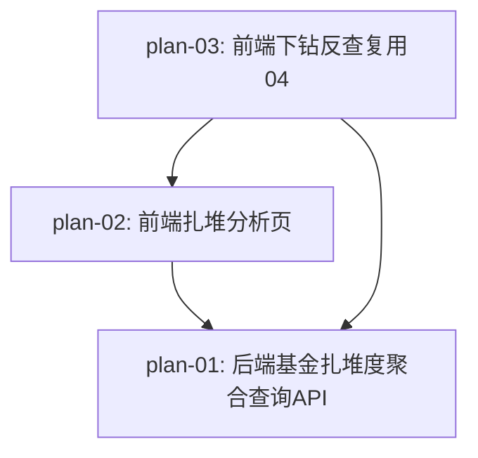

# 实现计划：基金扎堆股票分析（08）

## 1. 概览

- **项目**: 08-基金扎堆股票分析 — 基金扎堆股票分析功能开发
- **来源架构**: `docs/08-基金扎堆股票分析/08-1-架构文档-基金扎堆股票分析.md`
- **组织方式**: 功能维度（Feature-based）
- **项目类型**: brownfield（在已上线的 04「基金持仓分析」+ 06「股东分析面板」之上做增量开发）
- **技术栈**: FastAPI + SQLAlchemy async + PostgreSQL（后端）/ Next.js 16 + React 19 + shadcn/ui + ECharts + Playwright（前端）
- **总阶段数**: 2
- **总功能数**: 3
- **最大并行度**: 1（plan-02 强依赖 plan-01 端点契约；plan-03 强依赖 plan-02 的反查按钮 wire 入口）
- **关键路径**: plan-01 → plan-02 → plan-03

## 2. 输入摘要

### 2.1 核心闭环与目标

核心闭环：**Portfolio → Aggregate → Rank → Drilldown**（持仓入库 → 股票聚合 → 扎堆排名 → 下钻反查）。

在 04 期基金持仓数据入库的基础上，新增面向用户的「基金扎堆股票分析」模块。系统从股票维度聚合 `fund_portfolio` 全市场基金重仓股记录，按「被多少基金持有」排序展示机构抱团排行榜，支持主动/被动口径切换、较上一报告期环比变化、按行业分布聚合，扎堆股可下钻到 04 反查页深挖。

**零存储新增**：完全复用 04 期 `fund_portfolio` + `funds` 表和现有 `sectors` / `sector_stocks` / `stocks` 行业体系，通过实时聚合（GROUP BY + 跨期 Python 对比）实现全部能力。

### 2.2 关键 ADR 与实施护栏

| ADR | 核心决策 | 实施护栏 |
| --- | --- | --- |
| ADR-1 | 主动/被动判定基于 `funds.invest_type` 字段枚举过滤 | 被动型 = `IN ('被动指数型', '增强指数型')`；NULL 必须用 `.is_(None)` 显式包含到主动型（避免 `NOT IN` 漏掉 NULL） |
| ADR-2 | 扎堆度聚合按股票维度 GROUP BY，持仓计入 = 存在即重仓（不加 stk_mkv_ratio 阈值） | `COUNT(DISTINCT fund_ts_code)` 反映共识广度（主排序）；`SUM(stk_float_ratio)` 反映资金深度（辅展示）；stk_float_ratio NULL 自动忽略但不影响 fund_count |
| ADR-3 | 环比计算跨期 Python 内存对比（复用 06 `_compute_change_directions` 范式） | 上期完全缺失时 `hasPrevPeriod=false`，所有股票 `fundCountChange/totalFloatRatioChange/isNew` 统一 null；symbol 上期无记录 → `isNew=true` |
| ADR-4 | 下钻反查复用 04 `/funds/reverse-lookup` 端点（沿用 ≥1% 口径），不新建端点 | 接受「下钻列表数 < 扎堆基金数」边界差异；前端在 04 反查页顶部固定展示差异提示文案 |
| ADR-5 | 行业分布复用 sectors/sector_stocks，主指标 = 扎堆股数量占比 | 一股多行业独立计数（与 06 一致）；无行业关联归「未分类」桶；前端 Top N 截断 |
| ADR-6 | 依赖索引，不引入缓存层 / 预计算表 / 物化视图 | 与 06 范式一致；非阻塞优化：新增 `ix_fund_portfolio_period_symbol (report_period, stock_symbol)` 索引前缀（plan-01 §3 #10） |
| ADR-7 | 前端独立路由 `/dashboard/fund-crowd-analysis`，与 04/06 平级 | 不嵌入 04 基金分析页（视角混淆） |

### 2.3 现有代码快照

| 文件 / 模块 | 当前事实 | 复用方式 |
| --- | --- | --- |
| 04 `fund_portfolio` 表 + `FundPortfolio` 模型 | 字段 `fund_ts_code/report_period/stock_symbol/market_value/amount/stk_mkv_ratio/stk_float_ratio`（`server/src/models/fund_portfolio.py:14-21`） | plan-01 只读聚合数据源 |
| 04 `funds` 表 + `Fund` 模型 | 字段 `ts_code/invest_type`（`server/src/models/fund.py`） | plan-01 JOIN 取 invest_type 做 scope 过滤 |
| 04 `/funds/reverse-lookup` 端点 | `server/src/api/v1/funds.py:196-238`；Repository `fund_repository.py:376` 硬编码 `stk_mkv_ratio >= 1.0` | plan-03 完全复用（后端零改动）；ADR-4 边界来源 |
| 04 前端反查页 + 表格 + hook | `web/src/app/dashboard/funds/reverse-lookup/page.tsx`（`ReverseLookupContent`）+ `ReverseLookupTable.tsx` + `useReverseLookup`（`useFunds.ts:108-145`） | plan-03 仅新增 `from=fund-crowd` 条件渲染 + 返回入口；核心逻辑零改动 |
| 06 `_compute_change_directions` + `_get_industry_for_stocks` | `server/src/services/shareholder_analysis_service.py:264-302` + `:304-352` | plan-01 复用范式（环比对比 + 行业 JOIN） |
| 06 前端组件结构 | `web/src/components/shareholder-analysis/`（`ShareholderAnalysisPage` / `IndustryDistribution` / `HoldingsTable` 等）+ `useShareholderAnalysis.ts` | plan-02 参照范式（SWR hooks + ECharts 双轨标签 + 表格 + 主页面状态管理） |
| `BaseRepository` | `server/src/repositories/base.py:18`（泛型 CRUD 基类） | plan-01 `FundCrowdRepository` 继承 |
| `ApiResponse` + `_dict_to_camel` + Pydantic `to_camel` | `server/src/api/schemas/response.py` + `funds.py` 的 `_dict_to_camel` helper | plan-01 响应包裹 + camelCase 输出范式 |
| 前端 `apiClient` | `web/src/lib/api.ts:32-362`（baseURL = `${API_BASE_URL}/api/v1`，line 8） | plan-02 `fundCrowdAnalysisApi` 复用；endpoint 不带 `/v1` 避免双前缀 |
| 前端 `DashboardLayout` 侧边栏 | `web/src/components/dashboard/DashboardLayout.tsx:16-42`（`baseSidebarItems`） | plan-02 追加「基金扎堆分析」导航项 |

### 2.4 架构约束

- **不引入** 独立缓存层 / 预计算表 / 物化视图 / 扎堆度快照表（ADR-6）
- **不新建** 08 一致口径的反查端点（ADR-4，接受 ≥1% 差异 + 前端提示）
- **不引入** 用户报告期手动选择（首版固定取最新期，PRD §1.4）
- **不引入** 复合加权得分排序（ADR-2，口径难向用户解释）
- **不引入** 历史多期扎堆度走势曲线（PRD §1.4，仅最新两期环比）
- **JSON 命名**：前端 camelCase，后端 snake_case，API 层 `to_camel` + `_dict_to_camel` 自动转换（query 参数保持 snake_case：`page_size` / `scope` / `search`）
- **只读模块**：08 全模块只读，无写入操作（架构 §8.3）

## 3. 验收标准追踪矩阵

> 架构文档 §2.4 验收标准承接矩阵的 8 条 AC，本期全部覆盖。AC-01/02/03/04/06/07/08 由 plan-01（后端语义）+ plan-02（前端呈现）共同承接；AC-05（下钻反查 + 返回恢复）由 plan-03 独立承接。

| AC-ID | 需求原文摘要 | 架构承接 | 计划承接 | 验证方式 | 当前状态 |
| --- | --- | --- | --- | --- | --- |
| AC-01 | 扎堆度排行榜展示 | FundCrowdAPI + FundCrowdUI | plan-01, plan-02 | plan-01 §5 pytest（`test_rankings_returns_active_scope_only` 等）+ plan-02 §5 Playwright 场景 1 | planned |
| AC-02 | 主动/被动口径切换 | FundCrowdAPI + FundCrowdUI | plan-01, plan-02 | plan-01 §5 pytest（`test_rankings_all_scope_includes_passive`）+ plan-02 §5 Playwright 场景 2 | planned |
| AC-03 | 环比变化展示（含新进） | FundCrowdAPI + FundCrowdUI | plan-01, plan-02 | plan-01 §5 pytest（`test_rankings_change_computation`）+ plan-02 §5 Playwright 场景 3 | planned |
| AC-04 | 行业分布展示 | FundCrowdAPI + FundCrowdUI | plan-01, plan-02 | plan-01 §5 pytest（`test_industry_distribution_active_scope`）+ plan-02 §5 Playwright 场景 4 | planned |
| AC-05 | 下钻反查 + 返回口径/位置保持 | FundCrowdUI + 04 ReverseLookup | plan-03 | plan-03 §5 Playwright（04 反查页侧 3 场景 + 扎堆页侧 2 场景） | planned |
| AC-06 | 上期数据缺失降级呈现 | FundCrowdAPI + FundCrowdUI | plan-01, plan-02 | plan-01 §5 pytest（`test_rankings_no_prev_period_returns_null_changes`）+ plan-02 §5 Playwright 场景 5 | planned |
| AC-07 | 持仓数据未同步空状态 | FundCrowdAPI + FundCrowdUI | plan-01, plan-02 | plan-01 §5 pytest（`test_rankings_empty_portfolio_returns_has_data_false`）+ plan-02 §5 Playwright 场景 6 | planned |
| AC-08 | 排行榜内搜索 | FundCrowdAPI + FundCrowdUI | plan-01, plan-02 | plan-01 §5 pytest（`test_rankings_search_by_code_prefix` / `test_rankings_search_by_name_contains` / `test_rankings_search_no_match`）+ plan-02 §5 Playwright 场景 7 | planned |

## 4. 模块地图

按功能聚合展示：

| 功能 | 包含模块 | 类型 | 对应文件 |
| --- | --- | --- | --- |
| plan-01 | `FundCrowdRepository`（4 方法）、`FundCrowdAnalysisService`（`get_rankings` / `get_industry_distribution` / `_compute_changes`）、用户侧路由 `fund_crowd_analysis.py`（2 端点 + 7 Pydantic 模型）、v1 路由注册、非阻塞索引迁移 `ix_fund_portfolio_period_symbol` | backend | `plan-01-后端基金扎堆度聚合查询API.md` |
| plan-02 | `fundCrowdAnalysisApi`（2 方法 + 5 TS 类型）、`useFundCrowdRankings` / `useFundCrowdIndustryDistribution` SWR hooks、`FundCrowdAnalysisPage` / `CrowdScopeSelector` / `CrowdIndustryDistribution` / `CrowdRankingTable` 组件、页面路由 `/dashboard/fund-crowd-analysis`、`DashboardLayout` 侧边栏新增项、mock helper + Playwright spec（7 场景） | frontend | `plan-02-前端扎堆分析页.md` |
| plan-03 | `FundCrowdAnalysisPage.handleReverseLookup`（sessionStorage 写入 + router.push）、返回状态恢复（含 scroll 恢复）、04 反查页 `from=fund-crowd` 条件渲染（差异提示 + 返回扎堆分析入口）、`syncUrl` 保留 `from` 参数、Playwright spec（04 侧 3 场景 + 扎堆页侧 2 场景） | frontend | `plan-03-前端下钻反查复用04.md` |

## 5. 依赖图



节点使用 plan-ID 标识。

- **plan-02 → plan-01**：plan-02 的 SWR hooks 调用 plan-01 的 `/rankings` + `/industry-distribution` 端点，契约（response shape + camelCase 字段）必须先稳定
- **plan-03 → plan-01**：plan-03 反查按钮跳转的 `stockSymbol` 来自 plan-01 排行榜数据
- **plan-03 → plan-02**：plan-03 复用 plan-02 的 `CrowdRankingTable.onReverseLookup` 回调 wire 入口 + `FundCrowdAnalysisPage` 的 `RETURN_STATE_STORAGE_KEY` sessionStorage key 约定 + 返回状态恢复 `useEffect` 入口

## 6. 阶段摘要

### Phase 1：后端聚合服务与 API（plan-01）

- **目标**：新建 `FundCrowdRepository`（4 方法）+ `FundCrowdAnalysisService`（排行榜 + 环比 + 行业分布）+ 2 个用户侧 API 端点 + 7 个 Pydantic 响应模型，零存储新增，完全复用 04 期数据。覆盖 AC-01/02/03/04/06/07/08 的后端语义
- **维度**：backend
- **交付**：可被 pytest 集成测试验证的 API 端点（参照 `test_fund_api.py` 风格），端到端契约稳定后才能交接给前端
- **非阻塞改进项**：新增 `ix_fund_portfolio_period_symbol (report_period, stock_symbol)` 索引前缀（arch-check 标注，alembic 迁移；若迁移受阻可降级为运维阶段手动建索引）
- **退出条件**：`cd server && pytest tests/test_fund_crowd_api.py --no-cov -v` 全部通过（含 18 个新增用例），现有 `test_fund_api.py` 测试不破坏

### Phase 2：前端页面与下钻闭环（plan-02 + plan-03，串行）

- **plan-02 前端扎堆分析页**：基于 plan-01 的用户侧 API，实现完整的「基金扎堆分析」独立路由页（口径切换 + 行业分布 + 排行榜 + 搜索 + 分页 + 空状态 + 环比降级）。覆盖 AC-01/02/03/04/06/07/08 的前端呈现
- **plan-03 前端下钻反查复用 04**：基于 plan-02 的反查按钮 wire 入口，实现扎堆页 ↔ 04 反查页的下钻闭环（sessionStorage 状态承载 + scroll 恢复 + 差异提示文案 + 返回入口）。覆盖 AC-05
- **维度**：frontend
- **退出条件**：
  - plan-02：`cd web && npx playwright test tests/e2e/fund-crowd-analysis.spec.ts` 7 个场景全部通过；现有 `shareholder-analysis.spec.ts` / `fund-reverse-lookup.spec.ts` 不破坏
  - plan-03：`cd web && npx playwright test tests/e2e/fund-reverse-lookup.spec.ts tests/e2e/fund-crowd-analysis.spec.ts` 全部通过（含 plan-03 追加的 5 个场景）；04 原生入口零影响回归通过

## 7. 任务总览

| 功能 | 阶段 | 包含维度 | 依赖 | 独立验收标准 |
| --- | --- | --- | --- | --- |
| plan-01: 后端基金扎堆度聚合查询API | Phase 1 | backend | （无） | §5：18 个 pytest 用例（AC-01/02/03/04/06/07/08 后端语义）+ 现有 funds 测试不破坏 + 非阻塞索引迁移 |
| plan-02: 前端扎堆分析页 | Phase 2 | frontend | plan-01 | §5：7 个 Playwright 场景（AC-01/02/03/04/06/07/08 前端呈现）+ `npm run build` / `npm run lint` 通过 |
| plan-03: 前端下钻反查复用04 | Phase 2 | frontend | plan-01, plan-02 | §5：5 个 Playwright 场景（AC-05 下钻 + 返回恢复）+ 04 原生入口零影响回归 + scroll 恢复（非阻塞改进项） |

### 7.1 关键路径与并行度

- **关键路径**：plan-01 → plan-02 → plan-03
- **最大并行度**：1
  - plan-02 强依赖 plan-01 端点契约（response shape + camelCase 字段）
  - plan-03 强依赖 plan-02 的反查按钮 wire 入口 + sessionStorage key 约定 + 返回状态恢复 `useEffect` 入口
- **说明**：plan-01 端点签名一旦定稿，plan-02 的 red E2E 即可独立编写 mock；但实际开发应串行，避免契约变更返工。plan-03 必须在 plan-02 完成后开始（依赖 plan-02 的组件 props 与 data-testid 约定）

### 7.2 开发状态机

> 由 auto-dev 维护的流程控制表。功能真实状态以各 `plan-*.md` frontmatter `status` 为准（ready-to-dev → in-progress → review → done）。

| FEAT | 当前步骤 | red_e2e | implement | green_e2e | review | 最近证据 | 阻塞原因 | 更新时间 |
| --- | --- | --- | --- | --- | --- | --- | --- | --- |
| plan-01 | done | done | done | done | done | plan-01-review-20260624.md | - | 2026-06-24 |
| plan-02 | done | done | done | done | done | plan-02-review-2026-06-24.md | - | 2026-06-24 |
| plan-03 | done | done | done | done | done | plan-03-review-2026-06-24.md | - | 2026-06-24 |

`当前步骤` 枚举：`red-e2e → implement → green-e2e → task-review → done`（任一步可转 `blocked`）。详见 `.claude/contracts/workflow-schema.json` 的 `auto_dev`。

**测试方式说明**：
- **plan-01（后端 FEAT）**：red/green 用 **pytest API 集成测试**（参照 `server/tests/test_fund_api.py` 既有风格），不写 Playwright（参照 MEMORY `后端 FEAT E2E 适配 pytest`）。证据命名 `plan-01-08-pytest-red-{date}.md` / `plan-01-08-pytest-green-{date}.md`
- **plan-02 / plan-03（前端 FEAT）**：red/green 用 **Playwright E2E**（参照 `web/tests/e2e/shareholder-analysis.spec.ts` + `helpers/mock-shareholder-analysis-api.ts` 既有 mock 风格）。证据命名 `plan-02-08-e2e-red-{date}.md` / `plan-02-08-e2e-green-{date}.md` / `plan-03-08-e2e-red-{date}.md` / `plan-03-08-e2e-green-{date}.md`

> **注**：`docs/e2e/evidence/` 中已有的 `plan-01-*.md` / `plan-02-*.md` 是 06/07 需求的旧证据，本期需重新生成（文件名带 `-08-` 后缀避免冲突）。

## 8. 未决策项

无。架构文档 §5.x 已确认所有待确认问题均已解决：
- `invest_type` 主动/被动枚举已代码级 + 数据级核实（ADR-1）
- `fund_portfolio` 量级已确认（150 万行 / 最新期 15 万行）
- 04 reverse-lookup 阈值硬编码位置已确认（`fund_repository.py:376`，ADR-4 边界来源）

## 9. 执行前置

### 9.1 环境准备

- **后端**：PostgreSQL 实例运行（开发库已有 `fund_portfolio` + `funds` + `sectors` + `sector_stocks` + `stocks` 表数据，与 04/06 共用）；`cd server && source .venv/bin/activate`
- **前端**：`cd web && npm install` 已完成；Next.js dev server 启动在 `http://localhost:3100`（E2E baseURL）
- **Playwright**：`cd web && npx playwright install` 已完成（一次性）
- **测试数据**：`fund_portfolio` 至少有一个报告期数据（否则所有扎堆度返回 0，pytest 用例需自带 fixture 插入；前端走 AC-07 空状态分支）

### 9.2 执行顺序（如何用 auto-dev / dev-plan-check 推进）

本 README 是 auto-dev 的调度 SSOT。推荐推进流程：

1. **plan-01（后端 API）** — 用 `auto-dev` 启动
   - **red 阶段**：在 `server/tests/test_fund_crowd_api.py` 追加 18 个 pytest 用例（覆盖 AC-01/02/03/04/06/07/08 后端语义 + 现有 funds 回归），运行 `pytest tests/test_fund_crowd_api.py --no-cov -v` 预期失败（端点 404 / ImportError）
   - **implement**：实现 `FundCrowdRepository`（4 方法）+ `FundCrowdAnalysisService` + 7 Pydantic 模型 + 2 端点 + v1 路由注册
   - **green 阶段**：同一组 pytest 用例全部通过（含 `_dict_to_camel` camelCase 输出 + NULL 处理 + scope 过滤）
   - **非阻塞**：新增 `ix_fund_portfolio_period_symbol` 索引迁移（Task 9，最后做；若 alembic 受阻可降级）
   - **task-review**：通过则状态 → done，更新本 README §7.2 状态机 + plan-01 frontmatter `status: done`

2. **plan-02（前端扎堆分析页）** — 用 `auto-dev` 启动（plan-01 done 后）
   - **red 阶段**：在 `docs/e2e/08-e2e-用例-基金扎堆股票分析.md` 编写 7 个场景；在 `web/tests/e2e/fund-crowd-analysis.spec.ts` 新建 spec；在 `helpers/mock-fund-crowd-api.ts` 新建 mock helper。运行 `npx playwright test tests/e2e/fund-crowd-analysis.spec.ts` 预期失败（页面 404 / 组件未实现）
   - **implement**：新增 `fundCrowdAnalysisApi` + SWR hooks + 4 组件（ScopeSelector / IndustryDistribution / RankingTable / 主页面）+ 页面路由 + DashboardLayout 侧边栏
   - **green 阶段**：7 个场景全部通过；现有 shareholder-analysis / fund-reverse-lookup spec 不破坏
   - **task-review**：通过则状态 → done

3. **plan-03（前端下钻反查复用 04）** — 用 `auto-dev` 启动（plan-02 done 后）
   - **red 阶段**：在 `docs/e2e/08-e2e-用例-基金扎堆股票分析.md` 追加 AC-05 章节；在 `fund-reverse-lookup.spec.ts` 追加 3 场景；在 `fund-crowd-analysis.spec.ts` 追加 2 场景。运行预期失败（条件渲染未实现 / handleReverseLookup 占位）
   - **implement**：实现 `handleReverseLookup` 路由跳转 + scroll 恢复 + 04 反查页 `from=fund-crowd` 条件渲染 + `syncUrl` 保留 `from`
   - **green 阶段**：5 个场景全部通过；04 原生入口零影响回归通过
   - **task-review**：通过则状态 → done

**dev-plan-check 使用**：每个 plan 在进入 implement 前建议用 `dev-plan-check` skill 复查实现对齐架构（重点核查：复用声明带 file:line、前后端契约四件套、AC 全覆盖、非阻塞改进项纳入交付）。

### 9.3 全局验证

所有功能完成后执行：

```bash
# 后端：fund-crowd 全套测试通过
cd server && source .venv/bin/activate && pytest tests/test_fund_crowd_api.py --no-cov -v

# 后端：现有 funds 测试不破坏
cd server && source .venv/bin/activate && pytest tests/test_fund_api.py --no-cov -v

# 前端：类型检查 + lint
cd web && npm run build && npm run lint

# 前端：plan-02 + plan-03 E2E 全套
cd web && npx playwright test tests/e2e/fund-crowd-analysis.spec.ts
cd web && npx playwright test tests/e2e/fund-reverse-lookup.spec.ts

# 前端：其他相关 E2E（不应被本期改动影响）
cd web && npx playwright test tests/e2e/shareholder-analysis.spec.ts
cd web && npx playwright test tests/e2e/fund-list.spec.ts

# 非阻塞索引迁移（若 plan-01 Task 9 实施）
cd server && alembic upgrade head

# 全流程验证：启动前后端服务，手动走通 AC-01 ~ AC-08 所有验收场景
cd server && uvicorn main:app --reload --port 8000
cd web && npm run dev  # localhost:3100
# 浏览器：普通用户登录 → 侧边栏「基金扎堆分析」→ 验证排行榜/行业分布/口径切换/环比/搜索/空状态/下钻反查/返回恢复
```

## 10. AC → FEAT 完整映射表

> 用于快速定位每个 AC 的承接 FEAT 与验证方式。

| AC-ID | AC 简述 | 后端承接（plan-01） | 前端呈现（plan-02） | 下钻反查（plan-03） | 验证方式 |
| --- | --- | --- | --- | --- | --- |
| AC-01 | 扎堆度排行榜展示（按基金数降序） | ✓ `get_rankings` + `get_crowd_aggregation` + `RankingItem` | ✓ `CrowdRankingTable` 8 列表格 | — | plan-01 pytest（`test_rankings_returns_active_scope_only` / `test_rankings_order_by_fund_count_desc`）+ plan-02 Playwright 场景 1 |
| AC-02 | 主动/被动口径切换 | ✓ `scope` 参数 + `PASSIVE_INVEST_TYPES` 过滤 + NULL 处理 | ✓ `CrowdScopeSelector`（默认 active）+ scope 变化重发 rankings + industry-distribution | — | plan-01 pytest（`test_rankings_all_scope_includes_passive`）+ plan-02 Playwright 场景 2 |
| AC-03 | 环比变化展示（含新进标识） | ✓ `_compute_changes`（复用 06 范式）+ `is_new` 三态 | ✓ `CrowdRankingTable` 环比列渲染（数值+箭头 / 新进 / —） | — | plan-01 pytest（`test_rankings_change_computation`）+ plan-02 Playwright 场景 3 |
| AC-04 | 行业分布展示（扎堆股数量占比为主指标） | ✓ `get_industry_distribution` + 一股多行业独立计数 + 未分类桶 | ✓ `CrowdIndustryDistribution`（ECharts 水平条形图 Top N + 双轨标签） | — | plan-01 pytest（`test_industry_distribution_active_scope` / `test_industry_distribution_multi_industries_per_stock`）+ plan-02 Playwright 场景 4 |
| AC-05 | 下钻反查 + 返回口径/位置保持 | —（复用 04 端点，后端零改动） | ✓（反查按钮渲染 + `onReverseLookup` 回调 wire 入口预留） | ✓ `handleReverseLookup` 跳转 + sessionStorage 状态承载 + scroll 恢复 + 04 反查页 `from=fund-crowd` 条件渲染 + 返回入口 | plan-03 Playwright（04 侧 3 场景 + 扎堆页侧 2 场景） |
| AC-06 | 上期数据缺失降级呈现 | ✓ `hasPrevPeriod=false` 时所有 change 字段统一 null | ✓ 环比列统一「—」（`hasPrevPeriod` prop 传递） | — | plan-01 pytest（`test_rankings_no_prev_period_returns_null_changes`）+ plan-02 Playwright 场景 5 |
| AC-07 | 持仓数据未同步空状态 | ✓ `hasData=false` + `items=[]`（空表分支） | ✓ 整页空状态「暂无基金持仓数据」 | — | plan-01 pytest（`test_rankings_empty_portfolio_returns_has_data_false`）+ plan-02 Playwright 场景 6 |
| AC-08 | 排行榜内搜索（代码前缀 / 名称包含） | ✓ search 在 SQL WHERE 层过滤（路径 A）+ `_escape_like_keyword` 转义 | ✓ 搜索框 + debounce + 无结果提示 + 清空恢复 | — | plan-01 pytest（`test_rankings_search_by_code_prefix` / `test_rankings_search_by_name_contains` / `test_rankings_search_no_match` / `test_rankings_search_escapes_like_wildcards`）+ plan-02 Playwright 场景 7 |

## 11. 变更记录

| 日期 | 变更类型 | 功能 | 说明 |
| --- | --- | --- | --- |
| 2026-06-24 | 新增 | plan-01, plan-02, plan-03 | 从 08-1 架构文档（status: review_ready）拆分为 3 个功能：后端聚合 API（plan-01）+ 前端扎堆分析页（plan-02）+ 前端下钻反查复用 04（plan-03）。plan-01 承接 AC-01/02/03/04/06/07/08 后端语义 + 非阻塞索引优化；plan-02 承接同组 AC 的前端呈现；plan-03 独立承接 AC-05 下钻反查闭环（含 scroll 恢复非阻塞改进项） |

<!-- 保留目录：reviews/。当 task-review、dev-plan-check 等开始运行时创建。 -->
