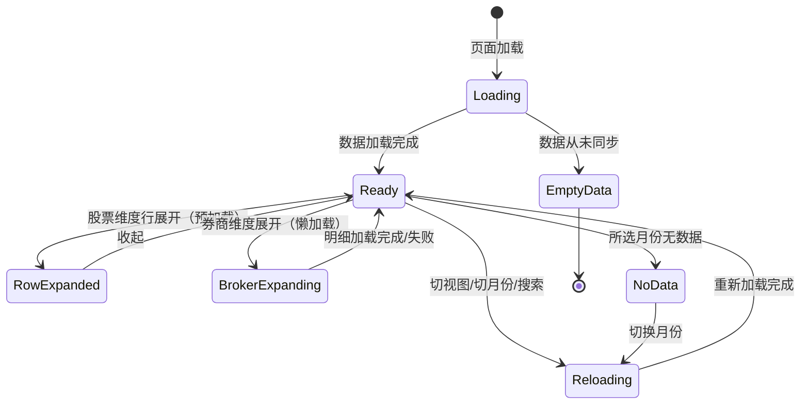
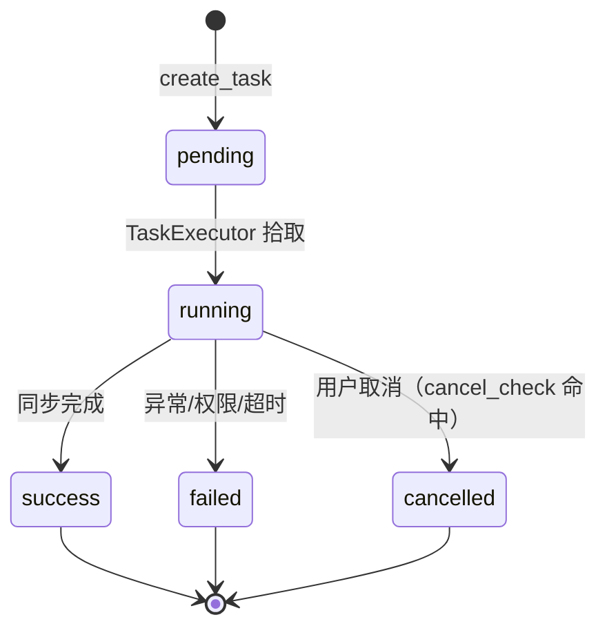

# 09-1 架构文档：券商月度金股

_本文件只保留当前版本真正影响实现的架构决策、边界和契约；DDL、目录树、环境变量、实施故事等内容默认不放入正文。_

## 1. 系统摘要

新增"券商每月荐股"模块，按月从 Tushare 同步券商金股（卖方共识）数据，提供股票维度（被多少家券商推荐排行）与券商维度（每家券商本月推荐清单）双视图，支持月份切换。与 08 基金扎堆（买方共识）形成对称互补视角。

**核心闭环**：Sync(month) → Snapshot → Aggregate(dual-view) → Browse（按月同步 → 月末快照入库 → 双维度聚合 → 浏览/反查）。

## 2. 范围、非目标与成功标准

### 2.1 范围

- **数据同步**：数据管理页新增"券商月度金股同步"任务，按月（YYYYMM）触发，复用异步任务体系（进度/取消/并发保护）；取该月最后一个交易日的 `broker_recommend` 快照写入，同一月份覆盖式更新
- **股票维度排行**：按"推荐券商家数"（按券商名称去重 `COUNT(DISTINCT broker)`）降序的股票列表，含代码、名称、所属行业、家数、前 3 家券商；行展开看全部券商及理由（数据随列表预加载）
- **券商维度反查**：按券商分组列出本月推荐，折叠态显示家名+推荐股票数，展开懒加载该券商本月推荐明细
- **月份选择**：月份选择器（YYYY-MM 显示 / YYYYMM 传参），默认最新已同步月份（YYYYMM 值最大者），可切换历史月份
- **搜索 + 分页**：双视图均服务端全量搜索（股票按代码前缀/名称包含、券商按名称包含）+ 分页（每页 20，≤20 隐藏分页器）；搜索/切视图/切月份均回第 1 页
- **侧边栏菜单**：在"基金扎堆分析"后新增"券商每月荐股"

### 2.2 明确不做

- 推荐收益/涨跌幅跟踪（需接入行情）
- 买卖方共识交叉推荐
- 多期走势曲线与环比变化
- 行业分布聚合与可视化（个股行业字段仍展示，不做行业维度统计聚合）
- 用户自定义券商池监控与推送
- 推荐理由 NLP 摘要与情感分析
- 用户手动选择历史报告期（首版固定取最新期）
- 预计算表 / 物化视图 / 独立缓存层（月度数据量小，实时聚合足够）

### 2.3 成功标准

| 指标 | 首版目标 |
|---|---|
| 双视图展示 | 股票维度按家数降序、券商维度按推荐数降序，均功能正常 |
| 月份切换 | 切换后两视图按新月重载、回第 1 页，默认月为 YYYYMM 最大者 |
| 数据同步 | 任务创建/进度/取消/并发保护正常，同月覆盖式刷新不堆积 |
| 搜索+分页 | 全量重查+回第 1 页，无结果提示，清空恢复，≤20 隐藏分页器 |
| 展开 | 股票维度预加载（无 loading），券商维度懒加载（带 loading/失败重试） |
| 数据缺失降级 | 从未同步展示空状态；所选月无数据提示；同步失败可重试 |
| 页面加载 | < 2s（单月数百到数千行聚合 + 分页 20） |

### 2.4 验收标准承接矩阵

| AC-ID | PRD 原文摘要 | 承接模块 | 关键链路 / 状态 | 风险 / 降级说明 |
|---|---|---|---|---|
| AC-01 | 侧边栏菜单与页面入口 | 前端 DashboardLayout + BrokerPage | 链路 6.4（页面加载） | 菜单注册于 baseSidebarItems |
| AC-02 | 股票维度排行榜展示 | BrokerAPI + BrokerUI | 链路 6.1（股票维度加载） | 依赖 broker_recommend 已同步；默认月取 MAX(month) |
| AC-03 | 股票维度展开推荐详情 | BrokerUI | 链路 6.1（行展开，预加载） | 数据随列表返回，无二次请求 |
| AC-04 | 券商维度反查与展开 | BrokerAPI + BrokerUI | 链路 6.1（券商维度）+ 链路 6.2（展开懒加载） | 展开单独请求明细 |
| AC-05 | 月份切换 | BrokerAPI + BrokerUI | 链路 6.1（month 参数） | 切月清空搜索词+回第1页，保持当前视图 |
| AC-06 | 分页加载 | BrokerAPI + BrokerUI | 链路 6.1（page/page_size） | total=搜索条件下总数；≤20 隐藏分页器 |
| AC-07 | 次级排序 | BrokerAPI | 链路 6.1（ORDER BY 双字段） | 股票：家数相同按代码升序；券商：推荐数相同按名称 |
| AC-08 | 数据同步任务 | AdminAPI + SyncTask + SyncService | 链路 6.3（同步） | YYYYMM 直接作 month 入参拉取该月数据；覆盖式更新；并发保护 |
| AC-09 | 数据从未同步的空状态 | BrokerAPI + BrokerUI | 链路 6.1（空数据分支） | 表无数据返回 has_data=false，前端整页空状态 |
| AC-10 | 默认月份 | BrokerAPI | 链路 6.1（MAX(month)） | 不按同步时间，按 YYYYMM 值 |
| AC-11 | 股票维度搜索 | BrokerAPI + BrokerUI | 链路 6.1（search） | 服务端全量重查+回第1页 |
| AC-12 | 券商维度搜索 | BrokerAPI + BrokerUI | 链路 6.1（search） | 同上 |
| AC-13 | 券商维度展开懒加载 | BrokerAPI + BrokerUI | 链路 6.2（展开明细） | 带骨架占位，失败可重试 |
| AC-14 | 切换视图/月份时的搜索词与分页重置 | BrokerUI | 链路 6.1（前端状态管理） | 切换清空搜索词+回第1页 |

## 3. 用户流程与状态

### 3.1 主流程

**流程 A：用户发现卖方共识股（股票维度）**

1. 用户从侧边栏进入"券商每月荐股"页面
2. 页面默认加载"股票维度 · 最新已同步月份"的卖方共识排行榜（按推荐家数降序）
3. 用户看到榜首股票：本月被 N 家券商共同推荐（按券商名称去重）
4. 用户点击该股票行"展开"，查看全部推荐券商及各自理由（预加载，无 loading）

**流程 B：用户反查某券商（券商维度）**

1. 用户将视图切换为"券商维度"（清空搜索词+回第1页+保持月份）
2. 页面按券商分组列出本月有推荐的券商（按本月推荐股票数降序）
3. 用户点击某券商分组展开，显示"展开加载中"骨架，懒加载该券商本月推荐明细

**流程 C：用户回顾历史月份**

1. 用户在月份选择器切换到另一历史月份（清空搜索词+回第1页+保持视图）
2. 页面按所选月份重新加载当前视图数据

**流程 D：管理员同步金股**

1. 管理员进入数据管理页，选择月份（YYYYMM）触发"券商月度金股同步"
2. 任务创建，按该月最后一个交易日快照拉取数据，显示进度/日志，可取消
3. 同步成功后该月数据可查询；重复触发同月为覆盖式刷新

### 3.2 关键分支

| 分支名 | 入口/触发条件 | 架构处理方式 |
|---|---|---|
| 数据从未同步 | broker_recommend 表无任何数据 | API 返回 `has_data: false`，前端整页空状态 |
| 所选月份无数据 | 切到无数据的月份（边界：数据被清空） | API 返回 `items: [], total: 0`，前端提示"所选月份暂无数据" |
| 股票维度展开为空 | 某股推荐券商/理由异常为空 | 展开行显示"暂无推荐理由"，不阻断其他行 |
| 券商维度展开失败 | 懒加载请求失败 | 展开区显示"加载失败，请重试"，可重新展开 |
| 同步任务并发 | 已有同类型 running 任务 | Admin API 拒绝创建，返回"已有任务运行中"提示 |
| 同步失败 | 接口权限不足/网络超时 | 任务标记 failed + 记录原因，不影响历史数据，可重试 |
| 搜索无结果 | search 无匹配 | 表格区"未找到匹配结果，请调整搜索词" |

### 3.3 状态机

页面交互状态：



关键规则：
- 切换视图/月份/搜索均触发 Reloading（清空搜索词+回第1页+重查）
- 股票维度展开无中间态（数据随列表预加载）
- 券商维度展开有 BrokerExpanding 中间态（懒加载）

## 4. 系统上下文与模块职责

### 4.1 系统上下文

本功能嵌入现有系统，复用现有 Tushare 数据源、异步任务体系、行业板块体系与前端布局。引入一个新数据表 `broker_recommend`。

变更点：
- 新增数据表 `broker_recommend`（券商金股快照）+ SQLAlchemy 模型 `BrokerRecommend`
- 新增 Tushare 客户端方法 `get_broker_recommend(month)`（接口原生支持 month 入参，无需 trade_cal 映射）
- 新增同步服务 `BrokerRecommendDataInitService`（复用 Top10 同步范式：先删后写、逐批 commit、进度回调、取消检查）
- 新增查询服务 `BrokerRecommendAnalysisService`（双视图聚合 + 月份 + 搜索 + 分页）
- 新增 TaskType `SYNC_BROKER_RECOMMEND` + task handler
- 新增用户侧 API `/api/v1/broker-recommend-analysis/*` + admin API `/api/init/broker-recommend`
- 新增前端路由 `/dashboard/broker-recommend-analysis` + 侧边栏菜单
- 依赖现有 `stocks`（名称/行业 JOIN）、`sectors` + `sector_stocks`（行业 JOIN）、异步任务体系（TaskManager/TaskExecutor）

数据流向：
- Tushare → BrokerRecommendDataInitService（写）→ broker_recommend 表
- broker_recommend（只读聚合）+ stocks（只读 JOIN 名称）+ sectors/sector_stocks（只读 JOIN 行业）→ BrokerRecommendAnalysisService（聚合）→ API → 前端

### 4.2 模块职责

| 模块 | 职责 | 上游输入 | 下游输出 |
|---|---|---|---|
| `BrokerRecommendDataInitService` | 按月同步券商金股：month 入参拉取该月数据→按 (ts_code,broker) 去重→先删后写 | YYYYMM 月份参数 + Tushare | broker_recommend 表写入 + 同步结果 dict |
| `BrokerRecommendAnalysisService` | 双视图聚合查询：股票维度排行、券商维度分组、月份列表、券商明细 | broker_recommend（只读聚合）+ stocks（名称 JOIN）+ sectors/sector_stocks（行业 JOIN） | API 响应 |
| `BrokerRecommendRepository` | DB 查询封装：聚合、搜索、分页、月份列表、券商明细 | Service 调用 | ORM 查询结果 |
| Tushare 客户端扩展 | `get_broker_recommend(month)`（接口原生支持 month 入参） | month（YYYYMM） | dict 列表 |
| 前端 `BrokerRecommendPage` | 双视图面板：视图切换 + 月份选择 + 搜索 + 排行榜 + 展开 | 用户交互 + API 数据 | 页面渲染 |
| 前端 `BrokerStockRanking` | 股票维度表格（搜索、展开看券商理由） | 用户交互 + rankings API | 表格渲染 |
| 前端 `BrokerGroupList` | 券商维度分组列表（搜索、懒加载展开） | 用户交互 + group API | 列表渲染 |

**复用声明验证**：

- **复用异步任务体系（TaskManager/TaskExecutor/TaskRegistry）**：验证（代码级）：`task_handlers.py` 的 `sync_top10_holders_task`（L1172-1236）是完整范式——接收 task_id/params/manager，取 `params['period']`，`service = Top10HolderDataInitService(manager.db)`，设 `set_progress_callback` + `set_cancel_check`（直接查 `AsyncTask.status` 标量列），调 `service.sync_top10_holders(period)`，结果 dict 含 added/skipped/failed。`BrokerRecommendDataInitService` 沿用同一构造签名 `(session)` + 同一回调接口（`set_progress_callback`/`set_cancel_check`）+ 同一 `_check_cancelled`/`_update_progress` 实现范式。结论：可复用，同步服务与 handler 形态与 Top10 完全对称。

- **复用 admin API 触发范式（`/api/init/top10-holders`）**：验证（代码级，`init_top10_holders.py`）：`InitTop10HoldersRequest(period: str, pattern=^\d{8}$)` + 并发保护（查 `AsyncTask.task_type == SYNC_TOP10_HOLDERS AND status IN ('pending','running')`）+ `TaskManager(session).create_task(task_type, params={'period':...}, max_retries=3, timeout_seconds=3600, created_by=admin.id)`。09 沿用此范式，仅 TaskType 改 `SYNC_BROKER_RECOMMEND`、参数键改为 `month`、pattern 改 `^\d{6}$`。结论：可复用。

- **复用查询服务范式（`FundCrowdAnalysisService`/`shareholder_analysis_service`）**：验证（代码级）：08/06 的 service 都是注入 `AsyncSession` + 依赖注入 repository/直接 ORM 查询 + `_serialize_value`（Decimal→float）。09 沿用同一范式。结论：可复用。

- **复用 stocks + sector_stocks 行业 JOIN**：验证（代码级，06 `_get_industry_for_stocks` + 08 ADR-5）：JOIN 方式 `SectorStock.stock_code == Stock.symbol AND Sector.code == SectorStock.sector_code AND Sector.type == 'industry'`。结论：可复用，JOIN 范式直接借鉴 06/08。

- **复用前端 API 客户端范式（`fundCrowdAnalysisApi`）**：验证（代码级，`api.ts:1033`）：`apiClient.get<{success, data}>(endpoint, queryObj)`，query 参数 snake_case（`page_size` 而非 `pageSize`），endpoint 不带 `/v1`（baseURL 已含）。结论：可复用，`brokerRecommendApi` 沿用同范式。

- **复用侧边栏菜单注册（`DashboardLayout`）**：验证（代码级，`DashboardLayout.tsx:16-47`）：`baseSidebarItems` 数组追加项 `{title, href, icon}`。结论：可复用，在"基金扎堆分析"项后追加"券商每月荐股"。

### 4.3 需要刻意避免的过度设计

- **不引入缓存层**：月度金股数据量小（每月数百到数千条，远小于基金持仓 150 万行），双视图聚合简单（单月 GROUP BY + 一次 JOIN），实时聚合 < 500ms，无需缓存
- **不引入预计算表/物化视图**：同上，实时聚合足够
- **不引入独立券商维度表**：券商维度直接从 broker_recommend 表按 broker 字段聚合，不单独建券商表
- **不引入 Prompt/AI 模块**：纯数据聚合与展示
- **不引入用户报告期选择**：首版固定取最新月，月份选择器仅切历史（默认最新）
- **不引入定时同步**：手动触发足够（金股按月发布，低频）

## 5. 关键架构决策（ADR）

### ADR-1：数据模型 — 单表 `broker_recommend`，按 (month, ts_code, broker) 维度存快照

- **选择**：新建 `broker_recommend` 表，字段 `id / month(Date) / trade_date(Date) / ts_code / symbol / broker / name / reason / created_at / updated_at`，索引 `(symbol, month)` + `(broker, month)` + `(month)`。一份券商-股票推荐记录对应一行；同步按月覆盖式更新。
- **理由**：与 `top10_float_holders` 范式一致（symbol+ts_code+周期字段+维度字段）；单表足以支撑股票维度（GROUP BY symbol COUNT DISTINCT broker）与券商维度（GROUP BY broker）两个聚合方向，无需拆表。`month` 字段独立于 `trade_date`（前者用于月份切换与默认值 MAX，后者记录快照来源日期用于追溯）。
- **风险与对策**：Tushare 实际字段名待接口验证（见待确认问题 Q1）。对策：同步服务字段映射在 `BrokerRecommendDataInitService._parse_record` 集中处理，字段名变化只改一处。

### ADR-2：YYYYMM 月份直接作为接口入参（接口原生支持 month 参数）

- **选择**：同步服务直接用 `pro.broker_recommend(month='YYYYMM')` 拉取该月数据，无需 YYYYMM→trade_date 映射。`broker_recommend` 表的 `month` 字段存为该月第一天（Date，作为月份标识与 MAX 比较键），`trade_date` 字段直接取接口返回的推荐日期（YYYYMMDD 解析为 Date，用于追溯）。
- **理由**：经 Tushare 官方文档（doc 267）核实，`broker_recommend` 接口**原生支持 `month` 入参**（YYYYMM），调用 `pro.broker_recommend(month='202606')` 即返回该月全部券商推荐记录（含各自 trade_date）。无需先用 trade_cal 推算月末交易日再调接口——这使链路从"trade_cal + broker_recommend 两次调用"简化为"单次 broker_recommend 调用"，且不再依赖站内交易日历。
- **风险与对策**：同一个月内可能有多个 trade_date（券商分批发布），接口按 month 入参返回该月全部记录。对策：同步服务对返回记录按 (ts_code, broker) 去重保留最新 trade_date 的那条（若同券商对同股当月多次推荐），避免重复堆积；month 字段统一为月初保证 MAX 比较稳定。

### ADR-3：股票维度展开预加载 vs 券商维度展开懒加载

- **选择**：股票维度排行榜接口在 `RankingItem` 内嵌 `brokers: {broker, reasons: string[]}[]`（该股全部推荐券商+理由，随列表返回；同券商多条理由聚合到同一元素的 reasons 数组，不丢弃），展开纯前端渲染无二次请求；券商维度分组列表接口仅返回 `broker + stockCount`，展开时单独调 `/broker-recommend-analysis/broker-detail?month=&broker=` 懒加载该券商本月推荐明细。
- **理由**：股票维度单股被推荐券商数通常个位到数十，预加载开销小、省一次往返；券商维度一页 20 家×每家 N 只明细，全量预加载会膨胀，懒加载避免列表接口臃肿。
- **风险与对策**：单股被百家推荐（极端）会导致单行预加载膨胀。对策：股票维度展开数据加 LIMIT 100 兜底，超 100 在展开区提示"更多券商请下载"；实际券商金股单股极难达百家，首版接受。

### ADR-4：搜索为服务端全量重查，触发/清空均回第 1 页

- **选择**：股票维度 search 在 SQL WHERE 层（`symbol LIKE 'x%' OR name ILIKE '%x%'`），券商维度 search 在 SQL WHERE 层（`broker ILIKE '%x%'`）；搜索词变化即重查并 page=1，"共 N"按新结果重新计算。
- **理由**：PRD AC-11/12 要求全量重查（非当前页过滤），与 AC-06 total 口径一致；回第 1 页避免越界空页。
- **风险与对策**：LIKE 通配符注入。对策：复用 06 `_escape_like_keyword` 转义 `%`/`_`。

### ADR-5：双视图共用一个月份+视图状态，前端会话内保持

- **选择**：前端以 React state 维护 `{view: 'stock'|'broker', month: string, search: string, page: number}`；切视图/切月份时清空 search + page=1；搜索时 page=1。状态在会话内保持（不写 sessionStorage，无需跨页恢复，因为不下钻到其他路由）。
- **理由**：09 不像 08 有跨路由下钻（08 跳 04 反查页需 sessionStorage 恢复），09 双视图都在同一页内切换，React state 足够。
- **风险与对策**：无显著风险。

### ADR-6：性能 — 不缓存，实时聚合

- **选择**：查询服务直接实时聚合，不引入缓存层（区别于 08 的两级缓存）。
- **理由**：broker_recommend 单月数据量数百到数千行（vs 08 单期 15 万行），聚合 `COUNT(DISTINCT broker)` + 一次 stocks/sector JOIN 在索引保障下单次 < 500ms，缓存收益小于其维护成本。
- **风险与对策**：若未来数据量增长或查询变复杂，再评估引入与 08 同款两级缓存（范式已存在，可直接复用）。

### 5.x 待确认问题

无。关键假设已在 ADR 中记录并通过代码级核实。原 Q1（broker_recommend 接口字段名）已通过 Tushare 官方文档 doc 267 核实：输出字段为 `ts_code/trade_date/name/broker/reason`，输入原生支持 `month`（YYYYMM）入参——据此简化了 ADR-2（移除 trade_cal 映射）。字段映射在 `_parse_record` 集中处理，不阻塞架构定稿。

## 6. 运行链路

### 6.1 双视图加载（含视图切换、月份切换、搜索、分页）

1. 前端渲染页面，根据 `view` 发起请求：
   - 股票维度：`GET /api/v1/broker-recommend-analysis/stock-ranking?month=&search=&page=1&page_size=20`
   - 券商维度：`GET /api/v1/broker-recommend-analysis/broker-list?month=&search=&page=1&page_size=20`
2. 若 month 未传，Service 先查 `SELECT DISTINCT month FROM broker_recommend ORDER BY month DESC LIMIT 1` 确定 latest_month；无数据 → 返回 `{has_data: false}`，前端整页空状态
3. Service 执行聚合（见下方算法）
4. 返回 `{has_data, month, total, page, page_size, items}`；所选 month 无数据时 `items: [], total: 0`，前端提示"所选月份暂无数据"
5. 前端渲染对应视图表格/分组列表

**股票维度聚合算法**：
```sql
SELECT b.symbol,
       MAX(s.name)            AS name,            -- LEFT JOIN stocks，无匹配 NULL→前端"—"
       COUNT(DISTINCT b.broker) AS broker_count,
       -- 行业 JOIN（一股多行业，service 层另查或子查询聚合为 array）
FROM broker_recommend b
LEFT JOIN stocks s ON s.symbol = b.symbol
WHERE b.month = :month
  [AND (b.symbol LIKE :search% OR s.name ILIKE :%search%))]
GROUP BY b.symbol
ORDER BY broker_count DESC, b.symbol ASC
LIMIT :page_size OFFSET :offset
```
每行 `brokers: [{broker, reasons}]` 通过同表二次查询或 `ARRAY_AGG`/`GROUP_CONCAT` 聚合（实现时择优），随列表预加载返回。**同券商多理由归并算法**：对同一 symbol 下的记录，按 broker 分组，将该 broker 的全部 reason 值聚合到 `reasons: string[]`（去掉空字符串/重复），不丢弃任何理由文本——对齐 PRD §3.3「同一券商多条理由合并 1 家计数、展开全部展示不丢弃」与 AC-03。

**券商维度聚合算法**：
```sql
SELECT b.broker,
       COUNT(DISTINCT b.symbol) AS stock_count
FROM broker_recommend b
WHERE b.month = :month
  [AND b.broker ILIKE :%search%]
GROUP BY b.broker
ORDER BY stock_count DESC, b.broker ASC
LIMIT :page_size OFFSET :offset
```

**行业获取**：service 层对当页 symbols 批量 JOIN `sector_stocks + sectors(type='industry')`（复用 06 `_get_industry_for_stocks` 范式），一股多行业返回数组，前端逗号展示；无行业显示"—"。

实现原则：
- search 在 SQL WHERE 层（服务端全量重查），LIKE 通配符用 `_escape_like_keyword` 转义
- 默认月份 = `MAX(month)`（YYYYMM 值最大者，不按同步时间），见 ADR 对应决策
- 排序稳定性：双字段 ORDER BY（股票：broker_count DESC, symbol ASC；券商：stock_count DESC, broker ASC）
- 不缓存，实时聚合（ADR-6）
- 月份选择器可选月份 = `SELECT DISTINCT month FROM broker_recommend ORDER BY month DESC`（仅已同步月份）

### 6.2 券商维度展开懒加载

1. 用户点击券商分组展开控件，前端发 `GET /api/v1/broker-recommend-analysis/broker-detail?month=&broker=`
2. 前端展示"展开加载中"骨架
3. Service 查询：`SELECT symbol, name, reason FROM broker_recommend WHERE month=:month AND broker=:broker ORDER BY symbol ASC`
4. name 取 stocks JOIN（无匹配 NULL）；同一 symbol 若该 broker 有多条记录，reason 合并为 `reasons: string[]`（去空去重，不丢弃）；reasons 为空数组时前端显示"—"
5. 返回 `{items: BrokerDetailItem[]}`（每项含 `reasons: string[]`，同 symbol 多记录的 reason 合并去空去重）
6. 前端渲染明细；失败时显示"加载失败，请重试"，可重新展开

实现原则：
- broker 参数做精确匹配（=），不做 LIKE（避免误匹配）
- 明细为空（该券商该月无推荐，边界）→ items 空数组，前端显示"暂无推荐理由"

### 6.3 数据同步任务

1. 管理员在数据管理页选月份（YYYYMM），POST `/api/admin/init/broker-recommend`（`{month: "202606"}`）
2. Admin API 并发保护：查 `AsyncTask.task_type == SYNC_BROKER_RECOMMEND AND status IN ('pending','running')`，有则拒绝返回提示
3. `TaskManager(session).create_task(task_type=SYNC_BROKER_RECOMMEND, params={'month':...}, max_retries=3, timeout_seconds=3600, created_by=admin.id)`，commit，返回 task_id
4. TaskExecutor 拾取任务，调 `sync_broker_recommend_task` handler
5. handler 取 `params['month']`，构造 `BrokerRecommendDataInitService(manager.db)`，设 progress_callback + cancel_check（查 AsyncTask.status 标量）
6. Service 执行：
   a. 调 `tushare.get_broker_recommend(month)` 拉取该月全部券商推荐记录（接口原生支持 month 入参，见 ADR-2）
   b. 按 (ts_code, broker) 去重：同券商对同股当月多次推荐时，保留 trade_date 最新的一条（避免重复堆积）
   c. DELETE 已有该 month 记录（覆盖式更新）
   d. 逐条解析 → `BrokerRecommend` 实例（month=该月第一天，trade_date=接口返回的推荐日期，symbol/ts_code/broker/name/reason）
   e. batch add_all + flush + commit，逐批更新进度
   f. 每批后 `_check_cancelled`
7. 返回 `{added, failed}`，handler 记录完成日志

实现原则：
- 先删后写（DELETE WHERE month=:month → 重新写入），保证幂等（与 Top10 同步范式一致）
- 逐批 commit 确保部分成功不丢失（与 Top10 一致）
- 取消检查在每批后执行（与 Top10 一致）
- month 存为该月第一天（Date），作为月份标识与去重键；trade_date 存接口返回的实际推荐日期用于追溯
- 不依赖 trade_cal 交易日历（接口 month 入参直接返回该月数据，见 ADR-2）

### 6.4 页面与菜单加载

1. 用户登录后，`DashboardLayout` 渲染 `baseSidebarItems`，其中含新增项 `{title: '券商每月荐股', href: '/dashboard/broker-recommend-analysis', icon: <StarIcon/>}`
2. 用户点击菜单，前端路由到 `/dashboard/broker-recommend-analysis/page.tsx`（'use client'）
3. 页面组件 `BrokerRecommendPage` 渲染，初始 view='stock'、month=undefined（让后端取最新）、search=''、page=1
4. 触发链路 6.1 加载数据

## 7. 领域对象与关键契约

### 7.1 核心对象

| 对象名 | Source of Truth | Owner | 用途 |
|---|---|---|---|
| `BrokerRecommend`（新增） | `broker_recommend` 表 | 09 同步服务 | 券商金股快照，聚合数据源 |
| `Stock`（已有） | `stocks` 表 | 03 同步服务 | 股票名/行业 JOIN（只读） |
| `Sector` / `SectorStock`（已有） | `sectors`/`sector_stocks` 表 | 板块体系 | 行业维度（只读 JOIN） |

### 7.2 推荐最小 Schema

```typescript
// 股票维度排行榜单项（API 响应输出视角，camelCase）
interface BrokerStockRankingItem {
  symbol: string;              // 股票代码，如 "600519"
  name: string | null;         // 股票名称（JOIN stocks.name，无匹配为 null，前端显示 "—"）
  industries: string[];        // 所属行业列表（一股多行业）
  brokerCount: number;         // 推荐券商家数（COUNT DISTINCT broker，按券商名称去重）
  brokers: { broker: string; reasons: string[] }[];  // 全部推荐券商及理由（预加载，展开用）。同一券商若有多条理由，聚合到同一元素的 reasons 数组，不丢弃任何理由文本（对齐 PRD AC-03）
}

// 券商维度分组单项
interface BrokerGroupItem {
  broker: string;              // 券商名称
  stockCount: number;          // 本月推荐股票数
}

// 券商明细单项（懒加载）
interface BrokerDetailItem {
  symbol: string;
  name: string | null;
  reasons: string[];        // 推荐理由数组（同 symbol 该 broker 多条记录合并，去空去重，不丢弃）；空数组前端显示 "—"
}

// 通用列表响应
interface BrokerRankingResponse {
  hasData: boolean;            // 是否有金股数据（全表无数据时 false）
  month: string | null;        // 当前月份 ISO 字符串（YYYY-MM-01），null 表示无数据
  total: number;
  page: number;
  pageSize: number;
  items: BrokerStockRankingItem[] | BrokerGroupItem[];
}

// 月份列表响应
interface BrokerMonthsResponse {
  hasData: boolean;
  months: string[];            // 已同步月份，YYYY-MM 格式，降序
}
```

### 7.3 API 边界

| 接口路径 | 方法 | 用途 | 说明 |
|---|---|---|---|
| `/api/v1/broker-recommend-analysis/months` | GET | 月份列表 + 是否有数据 | 供月份选择器。返回 `{hasData, months:[]}`。months 降序，前端首项作默认 |
| `/api/v1/broker-recommend-analysis/stock-ranking` | GET | 股票维度排行（AC-02/03/06/07/11） | 参数：month（可选，缺省取最新）、search（可选）、page（默认1）、page_size（默认20）。返回 BrokerRankingResponse（items 为 BrokerStockRankingItem[]，含预加载 brokers） |
| `/api/v1/broker-recommend-analysis/broker-list` | GET | 券商维度分组（AC-04/06/07/12） | 参数：month、search、page、page_size。返回 BrokerRankingResponse（items 为 BrokerGroupItem[]） |
| `/api/v1/broker-recommend-analysis/broker-detail` | GET | 券商明细懒加载（AC-13） | 参数：month（必填）、broker（必填）。返回 `{items: BrokerDetailItem[]}` |
| `/api/admin/init/broker-recommend` | POST | 触发同步任务（AC-08） | 管理员权限。请求 `{month: "202606"}`（pattern `^\d{6}$`）。并发保护。返回 `{task_id}` |

请求字段数据来源说明：
- `month`：user_input（用户选月份选择器；stock-ranking 首次加载时缺省，后端取最新）
- `search`：user_input（用户输入搜索框）
- `page` / `page_size`：frontend_computed（分页参数）
- `broker`：derived（从券商维度点击展开的 broker 字段派生）

**API 契约约定**（与 04/06/08 既有约定对齐）：
- **响应包裹结构**：统一 `{ success: true, data: {...} }`，data 内含业务字段（与 fund-crowd-analysis / shareholder-analysis 一致）
- **命名转换边界**：响应输出 camelCase（Pydantic `to_camel` alias）；**query / 路径参数保持 snake_case**（`page_size` 而非 `pageSize`，与 fundCrowdAnalysisApi 一致——FastAPI Query 不经 alias 转换，前端 apiClient 写 query 时必须转 `page_size`）
- **序列化约定**：date → ISO 字符串；Decimal → float（参照 08 `_serialize_value`）；数值字段必须为 number
- **Schema 视角**：§7.2 为 API 响应输出视角（camelCase）；后端 Pydantic model 字段用 snake_case（`broker_count`/`stock_count` 等），通过 `ConfigDict(alias_generator=to_camel, populate_by_name=True)` 自动转换
- **路径前缀**：用户侧 `/api/v1/broker-recommend-analysis/*`（kebab-case，与 fund-crowd-analysis 范式一致）；admin 同步触发 `/api/admin/init/broker-recommend`（注意：admin 路由在 `router.py` 统一注册，挂载前缀与 init-top10-holders 一致）

### 7.4 状态流转

后端任务状态机（复用 AsyncTask 通用状态）：



前端无后端状态机，所有查询为同步 API。

### 7.5 数据边界

| 存储层 | 职责 |
|---|---|
| PostgreSQL `broker_recommend` 表（新增） | 券商金股快照，同步写入 + 查询聚合 |
| PostgreSQL `stocks` 表（已有，03） | 股票名称（字段名 `name`），只读 JOIN |
| PostgreSQL `sectors` + `sector_stocks` 表（已有） | 行业分类数据，只读 JOIN |
| Tushare（外部） | broker_recommend 数据源（month 入参），仅同步时调用 |

### 7.6 命名与标识规则

| 维度 | 规则 |
|---|---|
| 表名 | `broker_recommend`（snake_case，单数） |
| 模型类名 | `BrokerRecommend`（PascalCase） |
| Service 类名 | `BrokerRecommendAnalysisService` / `BrokerRecommendDataInitService` |
| Repository 类名 | `BrokerRecommendRepository` |
| API 路径（用户侧） | `/api/v1/broker-recommend-analysis/*`（kebab-case，与 fund-crowd-analysis 一致） |
| API 路径（admin 同步） | `/api/admin/init/broker-recommend`（与 init/top10-holders 一致） |
| 前端路由 | `/dashboard/broker-recommend-analysis`（kebab-case） |
| TaskType 枚举 | `SYNC_BROKER_RECOMMEND = "sync_broker_recommend"` |
| 视图枚举 | `view` = `stock` / `broker`（小写字符串） |
| JSON 命名风格 | camelCase（前端），snake_case（Python/DB），API 层自动转换 |

术语映射：

| PRD/前端术语 | 后端字段 / 枚举 | 说明 |
|---|---|---|
| 推荐券商家数 | `broker_count`（COUNT DISTINCT broker） | 主排序指标，按券商名称去重 |
| 股票维度 | `view=stock` | 按股票聚合排行 |
| 券商维度 | `view=broker` | 按券商分组反查 |
| 月份 | `month`（Date，该月第一天） | 月份标识与 MAX 比较键；接口 month 入参直接拉取该月数据 |
| 推荐日期 | `trade_date`（Date） | 接口返回的推荐日期 YYYYMMDD，用于追溯（同月可能有多个 trade_date） |
| 最新已同步月份 | `MAX(month)` | YYYYMM 值最大者，不按同步时间 |

## 8. 非功能需求、风险与运行策略

### 8.1 性能与吞吐量目标

| 指标 | 目标 | 预期 |
|---|---|---|
| 股票/券商维度加载 | < 2s | 单月数百到数千行 GROUP BY + JOIN + 分页，预估 < 500ms |
| 券商明细懒加载 | < 1s | 单券商单月明细，预估 < 200ms |
| 月份列表加载 | < 500ms | DISTINCT month 查询，极轻 |
| 同步任务 | < 5min | 单月快照拉取（单次 broker_recommend 调用）+ 写入 |
| 预期并发 | 单用户 | 个人工具，低并发 |

### 8.2 可靠性、错误处理与降级策略

**错误处理**：
- 数据库查询异常 → API 返回 500 + 通用错误信息，前端"加载失败，请重试"
- 无金股数据 → months/stock-ranking 返回 `{has_data: false}`，前端整页空状态
- 所选月份无数据 → items 空数组 + total 0，前端"所选月份暂无数据"
- 同步失败 → 任务标记 failed + 记录原因，可重试

**降级策略**（按用户体验影响从小到大排列）：

| 降级级别 | 触发条件 | 系统行为 |
|---|---|---|
| L1：部分股票无行业 | sector_stocks 未覆盖 | 行业显示"—"，不影响家数计算 |
| L2：部分股票无 name | stocks 表未覆盖 | name 显示"—"，不影响家数 |
| L3：券商明细为空 | 边界：该券商该月无推荐 | 显示"暂无推荐理由" |
| L4：所选月份无数据 | 该月未同步 | 提示"所选月份暂无数据"，可切其他月 |
| L5：无金股数据 | 表为空 | 整页空状态"暂无券商金股数据，请联系管理员同步" |

### 8.3 安全与反滥用策略

| 项目 | 首版策略 |
|---|---|
| 用户侧 API 权限 | 复用现有 JWT 认证（`get_current_user`），登录后可访问，与 06/08 一致 |
| admin 同步权限 | `require_admin` 依赖，仅管理员可触发（与 init/top10-holders 一致） |
| SQL 注入防护 | SQLAlchemy ORM 参数化查询；search 用参数绑定 + `_escape_like_keyword` 转义通配符 |
| 数据写入 | 仅同步服务写入，用户侧全只读 |

### 8.4 成本控制预期

| 模块 | 预估成本 | 首版控制策略 |
|---|---|---|
| Tushare 调用 | broker_recommend（6000 积分，特色数据）；每月同步 1 次 `pro.broker_recommend(month=...)` 单次调用 | 手动触发（非高频），单月 1 次调用（接口原生支持 month 入参，无需 trade_cal） |
| 数据库查询 | 纯 PostgreSQL，0 额外成本 | 依赖索引，单次 < 500ms |
| 数据存储 | 新增 1 表，月增数百到数千行 | 忽略不计 |

**外部依赖**：Tushare（broker_recommend，month 入参）。积分已满足（代理服务相当于 15000 积分，broker_recommend 需 6000）。

### 8.5 可观测性

- **后端日志**：Service 层 logging 记录 warning/error；同步任务通过 `manager.log_message` 记录 INFO/ERROR 到任务日志
- **API 错误**：FastAPI error_handlers 统一处理（与 06/08 一致）
- **同步任务**：TaskManager 进度更新 + 日志，数据管理页可查看进度与失败原因
- **前端错误**：SWR onError 回调处理，控制台记录异常

### 8.6 主要风险

| 风险 | 影响 | 缓解方式 |
|---|---|---|
| broker_recommend 接口字段名与预期不符 | 同步解析失败 | 字段映射集中在 `_parse_record` 单点；开发阶段用真实接口验证（原 Q1） |
| Tushare 积分不足 | 同步失败 | task handler 捕获权限错误记录；管理员知悉需积分 |
| YYYYMM 该月无推荐数据 | 同步返回空 | service 正常处理（added=0），不报错；分析页该月显示"暂无数据" |
| 单股被百家推荐（极端） | 股票维度预加载膨胀 | brokers 加 LIMIT 100 兜底 + 展开提示 |
| 月份切换与搜索组合状态错乱 | 用户体验差 | 前端统一：切视图/切月/搜索均清搜索词+回第1页（AC-14） |
| broker 名称在数据源中不稳定 | 去重计数偏差 | 首版按名称去重；若有权威券商代码再切换（决策记录已留余地） |

## 9. 实施方案

### Phase A：数据层与同步服务

**1. 数据模型 + 迁移**

- `server/src/models/broker_recommend.py` — 新建 `BrokerRecommend(Base)`，字段 `id/month/trade_date/ts_code/symbol/broker/name/reason/created_at/updated_at`，索引 `(symbol, month)` + `(broker, month)` + `(month)`（范式参照 `top10_float_holder.py`）
- `server/src/models/__init__.py` — 导出 `BrokerRecommend`
- alembic 迁移 — 新建 `broker_recommend` 表

**2. Tushare 客户端扩展**

- `server/src/services/data_acquisition/tushare_client.py` — 新增：
  - `get_broker_recommend(month)` — 调 `pro.broker_recommend(month=YYYYMM)`，返回 dict 列表（范式参照 `get_top10_float_holders`）。接口原生支持 month 入参（doc 267），返回该月全部券商推荐记录（含各自 trade_date）

**3. 同步服务**

- `server/src/services/data_init_broker_recommend.py` — 新建 `BrokerRecommendDataInitService(session)`：
  - `set_progress_callback` / `set_cancel_check` / `_check_cancelled` / `_update_progress`（完全复用 Top10 范式）
  - `sync_broker_recommend(month)` — 调 `get_broker_recommend(month)` 拉取 → 按 (ts_code, broker) 去重保留最新 trade_date → DELETE 已有该 month → 逐批解析写入 → commit
  - `_parse_record(record, month)` — 字段映射集中点（ts_code/trade_date/name/broker/reason，已与 doc 267 核实一致）

**4. 任务注册**

- `server/src/services/task_handlers.py` — `TaskType` 新增 `SYNC_BROKER_RECOMMEND = "sync_broker_recommend"`；新增 `sync_broker_recommend_task` handler（范式照搬 `sync_top10_holders_task`，取 `params['month']`，构造 service，设回调，调 `sync_broker_recommend`）

验证目标：手动调用 `sync_broker_recommend("202605")` 能拉取并写入数据；重复调用同月为覆盖式刷新；取消检查生效。

### Phase B：后端查询服务与 API

**5. Repository**

- `server/src/repositories/broker_recommend_repository.py` — 新建 `BrokerRecommendRepository(BaseRepository[BrokerRecommend])`：
  - `get_months()` — DISTINCT month DESC
  - `get_stock_ranking(month, search, page, page_size)` — 股票维度聚合（GROUP BY symbol + COUNT DISTINCT broker + JOIN stocks name + 预加载 brokers）
  - `get_broker_list(month, search, page, page_size)` — 券商维度聚合（GROUP BY broker + COUNT DISTINCT symbol）
  - `get_broker_detail(month, broker)` — 单券商明细

**6. 查询服务**

- `server/src/services/broker_recommend_analysis_service.py` — 新建 `BrokerRecommendAnalysisService`：
  - `get_months()` — 月份列表 + has_data
  - `get_stock_ranking(month, search, page, page_size)` — 含 latest_month 兜底 + 行业批量 JOIN（复用 06 `_get_industry_for_stocks`）
  - `get_broker_list(...)` + `get_broker_detail(...)`
  - `_serialize_value`（Decimal→float，参照 08）

**7. 用户侧 API**

- `server/src/api/v1/broker_recommend_analysis.py` — 新建路由（kebab-case prefix）：
  - `GET /months` / `GET /stock-ranking` / `GET /broker-list` / `GET /broker-detail`
  - Pydantic 响应 model 用 `ConfigDict(alias_generator=to_camel, populate_by_name=True)`
- `server/src/api/v1/__init__.py` — 注册 `broker_recommend_analysis_router`

**8. admin 同步 API**

- `server/src/api/admin/init_broker_recommend.py` — 新建路由（范式照搬 `init_top10_holders.py`）：
  - `InitBrokerRecommendRequest(month: str, pattern=^\d{6}$)`
  - `POST /broker-recommend` — 并发保护 + create_task(SYNC_BROKER_RECOMMEND)
- `server/src/api/admin/__init__.py` 或 router 注册处 — 注册路由
- 数据管理页任务列表若按 task_type 白名单展示同步任务，需将 `SYNC_BROKER_RECOMMEND` 加入展示白名单（实现时确认）

验证目标：curl 验证 4 个用户侧端点 + admin 同步端点；双视图聚合、搜索、分页、月份默认值、懒加载明细均符合 AC。

### Phase C：前端页面

**9. 数据层**

- `web/src/lib/api.ts` — 新增 `brokerRecommendApi` namespace（范式参照 `fundCrowdAnalysisApi`）：
  - `.getMonths()` / `.getStockRanking(params)` / `.getBrokerList(params)` / `.getBrokerDetail(params)`
  - query 参数 snake_case（`page_size`）

- `web/src/types/broker-recommend.ts`（或并入现有 types）— 新增 TS interface（对齐 §7.2）

**10. 分析面板页**

- `web/src/app/dashboard/broker-recommend-analysis/page.tsx` — 新建页面入口（'use client'）
- `web/src/components/broker-recommend-analysis/` — 新建组件目录：
  - `BrokerRecommendPage.tsx` — 主页面（视图切换 + 月份选择器 + 搜索框 + 内容区）
  - `BrokerStockRanking.tsx` — 股票维度表格（搜索、家数列、前3家券商列、行展开看全部券商理由——预加载）
  - `BrokerGroupList.tsx` — 券商维度分组列表（搜索、折叠分组、懒加载展开明细带骨架/失败重试）
  - `MonthSelector.tsx` — 月份选择器（YYYY-MM 显示，仅已同步月份，默认最新）
  - `ViewSwitcher.tsx` — 视图切换控件（股票/券商单选）

**11. 菜单注册**

- `web/src/components/dashboard/DashboardLayout.tsx` — `baseSidebarItems` 在"基金扎堆分析"项后追加 `{title: '券商每月荐股', href: '/dashboard/broker-recommend-analysis', icon: <Star/>}`（lucide-react 图标）

**12. 状态管理**

- 主页面用 React state 维护 `{view, month, search, page}`；切视图/切月/搜索时统一处理：清 search + page=1（AC-14）；不下钻其他路由，无需 sessionStorage

验证目标：完整走通 AC-01 ~ AC-14 所有验收场景，含双视图、展开（预加载/懒加载）、月份切换、搜索、分页、空状态、同步任务。

## 10. 架构结论

首版架构的核心判断是**以最小新增（1 表 + 双视图聚合）实现券商金股的"卖方共识"消费能力**，与 08 基金扎堆（买方共识）对称互补。完全复用现有 Tushare 数据源、异步任务体系（Top10 同步范式）、行业板块体系与前端布局范式，新增面收敛在数据模型、同步服务、查询服务、双视图 API 与前端组件。

设计原则：
- 单表 `broker_recommend` 支撑股票/券商双维度聚合，不拆表、不预计算、不缓存（数据量小，实时聚合 < 500ms）
- 同步复用 Top10 同步范式（先删后写、逐批 commit、进度回调、取消检查），TaskType 与 admin API 范式对称
- YYYYMM 直接作 month 入参（接口原生支持，无需 trade_cal 映射），month 字段存月初作月份标识与 MAX 比较键
- 股票维度展开预加载（单股券商数小）、券商维度展开懒加载（明细数据量大），按数据特征差异化处理
- 搜索服务端全量重查 + 回第 1 页，与 total 口径一致；LIKE 通配符转义防注入
- 月份默认值 = MAX(month)（不按同步时间），避免覆盖式更新带偏默认月

演进方向：
- 若 Tushare 提供权威券商代码字段，去重口径从券商名称切换为券商代码
- 若数据量增长或查询变复杂，复用 08 两级缓存范式（FundCrowdCache 模板已存在）
- 后续可扩展多期环比、行业分布聚合、买卖方交叉推荐（PRD 明确不做项）
- 若 broker_recommend 接口字段与预期不符，仅改 `_parse_record` 单点（已兜底）
