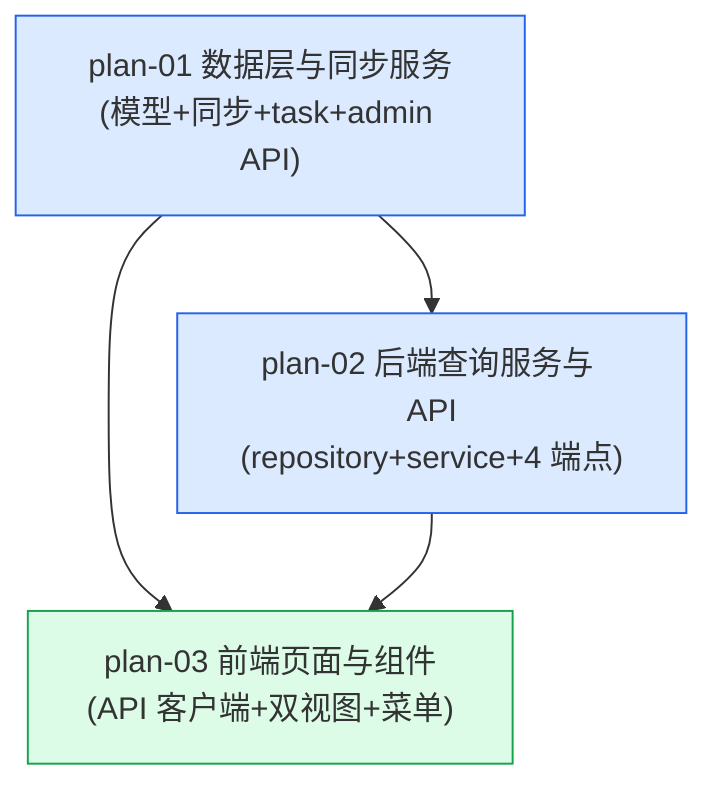

# 实现计划：券商月度金股

## 1. 概览

- **项目**: 券商月度金股（卖方共识视角，与 08 基金扎堆"买方共识"对称互补）
- **来源架构**: docs/09-券商月度金股/09-1-架构文档-券商月度金股.md（status: done）
- **组织方式**: 功能维度（Feature-based）
- **项目类型**: brownfield（现有项目加功能）
- **技术栈**: 后端 Python FastAPI + SQLAlchemy + Alembic + PostgreSQL；前端 Next.js + React + TypeScript + SWR + ECharts；数据源 Tushare
- **总阶段数**: 2（Phase 1 = 后端两功能串行；Phase 2 = 前端）
- **总功能数**: 3
- **最大并行度**: 1（后端两功能有模型/枚举依赖关系，串行；前端依赖后端 API）
- **关键路径**: plan-01 → plan-02 → plan-03

## 2. 输入摘要

### 2.1 核心闭环与目标

新增"券商每月荐股"模块，按月从 Tushare 同步券商金股（卖方共识）数据，提供股票维度（被多少家券商推荐排行）与券商维度（每家券商本月推荐清单）双视图，支持月份切换。核心闭环：Sync(month) → Snapshot → Aggregate(dual-view) → Browse（按月同步 → 月末快照入库 → 双维度聚合 → 浏览/反查）。

首版以最小新增（1 张表 + 双视图聚合）实现券商金股消费能力：单表 `broker_recommend` 支撑股票/券商双维度聚合，不拆表、不预计算、不缓存（数据量小，实时聚合 < 500ms）。完全复用现有 Tushare 数据源、异步任务体系（Top10 同步范式）、行业板块体系与前端布局范式。

### 2.2 关键 ADR 与实施护栏

- **ADR-1**：单表 `broker_recommend`，字段 `id/month/trade_date/ts_code/symbol/broker/name/reason/created_at/updated_at`，索引 `(symbol, month)` + `(broker, month)` + `(month)`。`month` 字段存该月第一天（Date），独立于 `trade_date`（接口返回的推荐日期，同月可能有多个）。
- **ADR-2**：YYYYMM 月份**直接作为接口入参**（`pro.broker_recommend(month=YYYYMM)`），无需 trade_cal 映射。经 Tushare 官方文档 doc 267 核实接口原生支持 month 入参。护栏：同券商对同股当月多次推荐时按 (ts_code, broker) 去重保留最新 trade_date，避免堆积。
- **ADR-3**：股票维度展开**预加载**（brokers 随列表返回），券商维度展开**懒加载**（展开单独请求 broker-detail）。护栏：单股百家推荐极端场景加 LIMIT 100 兜底。
- **ADR-4**：搜索服务端全量重查 + 回第 1 页，LIKE 通配符用 `_escape_like_keyword` 转义防注入。
- **ADR-5**：双视图共用一个月份+视图状态，React state 维护，切视图/切月份清 search + page=1。
- **ADR-6**：不缓存，实时聚合（区别于 08 两级缓存）。
- **过度设计护栏（§4.3）**：不引入缓存层 / 预计算表 / 物化视图 / 独立券商维度表 / AI 模块 / 用户报告期选择 / 定时同步。

> Tushare 接口字段已通过 doc 267 核实（输入 `ts_code/trade_date/month`，输出 `ts_code/trade_date/name/broker/reason`）；积分已满足（代理服务相当于 15000 积分，broker_recommend 需 6000）。原 OQ-1/OQ-3 已闭环。

### 2.3 现有代码快照

Brownfield repo 扫描确认的约定锚点（计划照抄真实代码约定，见各功能实现规格"前后端契约四件套校验"）：

- **后端用户侧路由范式**：`server/src/api/v1/fund_crowd_analysis.py` — `router = APIRouter(prefix="/fund-crowd-analysis", tags=[...])`；query 参数 snake_case（`page_size`）；响应 `{"success": True, "data": _dict_to_camel(result)}`；`_dict_to_camel` + `_serialize_value`（Decimal→float, date→isoformat）helper。注册于 `server/src/api/v1/__init__.py`（`router.include_router(...)`）。
- **后端 admin 同步路由范式**：`server/src/api/admin/init_top10_holders.py` — `router = APIRouter(prefix="/init", ...)`；`InitTop10HoldersRequest(period, pattern=^\d{8}$)`；并发保护查 `AsyncTask.task_type == ... AND status IN ('pending','running')`；`ApiResponse(success, data, message)`；注册于 `server/src/api/admin/__init__.py`。
- **后端 task handler 范式**：`server/src/services/task_handlers.py` — `class TaskType(str, Enum)`（已含 `SYNC_TOP10_HOLDERS = "sync_top10_holders"`，第 65 行）；`@TaskRegistry.register(TaskType.X)` + `sync_top10_holders_task(task_id, params, manager)`（取 `params['period']`，构造 service，`_make_progress_callback`，cancel_check 直查 `AsyncTask.status` 标量，try/except `manager.log_message`）。
- **后端同步服务范式**：`server/src/services/data_init_top10_holder.py` — `Top10HolderDataInitService(session)` 构造签名；`set_progress_callback` / `set_cancel_check` / `_check_cancelled` / `_update_progress`；先删后写逐批 commit。
- **后端模型范式**：`server/src/models/top10_float_holder.py` — `class Top10FloatHolder(Base)`，`__table_args__` 定义 `Index(...)`，`created_at`/`updated_at` 用 `server_default=func.now()` / `onupdate=func.now()`。导出于 `server/src/models/__init__.py`（`__all__` 列表）。
- **后端 Repository 基类**：`server/src/repositories/base.py` — `class BaseRepository(Generic[ModelType])`，`__init__(self, model, session)`。同类型现有 `FundCrowdRepository(BaseRepository[FundPortfolio])` 用 `super().__init__(FundPortfolio, session)`。
- **后端查询服务范式**：`server/src/services/fund_crowd_analysis_service.py` — `__init__(self, session)`，注入 `FundCrowdRepository(session)`。行业 JOIN 范式在 `server/src/services/shareholder_analysis_service.py` 的 `_get_industry_for_stocks`（显式 JOIN，无 ORM relationship）。`_escape_like_keyword` / `_to_float` helper 同文件。
- **Tushare 客户端范式**：`server/src/services/data_acquisition/tushare_client.py` — `get_top10_float_holders(ts_code, period)` 用 `pro = self._get_pro_api()` + `df = self._execute_with_retry(_fetch)`，空数据返回 `[]`。
- **前端 API 客户端范式**：`web/src/lib/api.ts` — `apiClient = new ApiClient()`，`baseURL = API_BASE_WITH_PREFIX = ${API_BASE_URL}/api/v1`（已含 /v1，endpoint 不再带 /v1）；`fundCrowdAnalysisApi.getRankings` 用 `apiClient.get<{success, data}>('/fund-crowd-analysis/rankings', { page_size: ... })`（query snake_case）。类型用 camelCase 接口。
- **前端页面范式**：`web/src/app/dashboard/fund-crowd-analysis/page.tsx` — `'use client'` + `<DashboardLayout>` 包裹主组件；组件在 `web/src/components/fund-crowd-analysis/`。
- **前端菜单注册**：`web/src/components/dashboard/DashboardLayout.tsx` — `baseSidebarItems` 数组（line 16-47），在"基金扎堆分析"项（line 42-46）后追加。
- **E2E 测试基础设施**：Playwright 已就绪（`web/playwright.config.ts`，testDir `./tests/e2e`，dev 端口 3100，mock 模式不依赖真实后端）。spec 在 `web/tests/e2e/*.spec.ts`，mock helpers 在 `web/tests/e2e/helpers/mock-*-api.ts`。E2E 用例文档在 `docs/e2e/`。server 单元测试用 pytest（`server/pytest.ini`，testpaths=tests，`--asyncio-mode=auto`）。

### 2.4 架构约束

- 响应包裹结构统一 `{ success, data }`；响应输出 camelCase（Pydantic `to_camel` alias），query/路径参数保持 snake_case。
- date → ISO 字符串；Decimal → float；数值字段必须为 number。
- 用户侧 API 路径 `/api/v1/broker-recommend-analysis/*`（kebab-case）；admin 同步 `/api/admin/init/broker-recommend`。
- TaskType 枚举 `SYNC_BROKER_RECOMMEND = "sync_broker_recommend"`；视图枚举 `view` = `stock` / `broker`。
- 月份默认值 = `MAX(month)`（YYYYMM 值最大者，不按同步时间）。

## 3. 验收标准追踪矩阵

> 每条来自架构 §2.4 的 AC-XX 都在本表出现一次，回溯到 PRD §第四部分。

| AC-ID | 需求原文 | 架构承接 | 计划承接 | 验证方式 | 当前状态 |
| --- | --- | --- | --- | --- | --- |
| AC-01 | 侧边栏菜单与页面入口 | 前端 DashboardLayout + BrokerPage | plan-03 | plan-03 §5 菜单注册验收 + E2E TC | planned |
| AC-02 | 股票维度排行榜展示 | BrokerAPI + BrokerUI | plan-02, plan-03 | plan-02 §5 股票维度聚合 + plan-03 §5 排行榜 E2E | planned |
| AC-03 | 股票维度展开推荐详情（预加载） | BrokerUI | plan-02, plan-03 | plan-02 §5 brokers 预加载验收 + plan-03 §5 行展开 E2E | planned |
| AC-04 | 券商维度反查与展开（懒加载） | BrokerAPI + BrokerUI | plan-02, plan-03 | plan-02 §5 券商分组+明细 + plan-03 §5 券商维度 E2E | planned |
| AC-05 | 月份切换 | BrokerAPI + BrokerUI | plan-02, plan-03 | plan-02 §5 month 参数 + plan-03 §5 月份切换 E2E | planned |
| AC-06 | 分页加载 | BrokerAPI + BrokerUI | plan-02, plan-03 | plan-02 §5 page/page_size + plan-03 §5 分页 E2E（≤20 隐藏分页器） | planned |
| AC-07 | 次级排序 | BrokerAPI | plan-02 | plan-02 §5 双字段 ORDER BY 验收 | planned |
| AC-08 | 数据同步任务 | AdminAPI + SyncTask + SyncService | plan-01, plan-03 | plan-01 §5 执行验证（触发任务→completed→查表）+ plan-03 §5 AC-08-ui（前端 BrokerRecommendSyncPanel 触发与进度） | planned |
| AC-09 | 数据从未同步的空状态 | BrokerAPI + BrokerUI | plan-02, plan-03 | plan-02 §5 has_data=false + plan-03 §5 空状态 E2E | planned |
| AC-10 | 默认月份 MAX(month) | BrokerAPI | plan-02 | plan-02 §5 latest_month 兜底验收 | planned |
| AC-11 | 股票维度搜索（服务端全量重查） | BrokerAPI + BrokerUI | plan-02, plan-03 | plan-02 §5 股票 search + plan-03 §5 搜索 E2E | planned |
| AC-12 | 券商维度搜索 | BrokerAPI + BrokerUI | plan-02, plan-03 | plan-02 §5 券商 search + plan-03 §5 搜索 E2E | planned |
| AC-13 | 券商维度展开懒加载（骨架/失败重试） | BrokerAPI + BrokerUI | plan-02, plan-03 | plan-02 §5 broker-detail + plan-03 §5 懒加载 E2E | planned |
| AC-14 | 切换视图/月份时搜索词与分页重置 | BrokerUI | plan-03 | plan-03 §5 状态重置 E2E | planned |

## 4. 模块地图

按功能聚合展示：

| 功能 | 包含模块 | 类型 | 对应文件 |
| --- | --- | --- | --- |
| plan-01 | BrokerRecommend 模型、Tushare 客户端扩展、BrokerRecommendDataInitService、SYNC_BROKER_RECOMMEND task handler、admin 同步 API | backend | plan-01-数据层与同步服务.md |
| plan-02 | BrokerRecommendRepository、BrokerRecommendAnalysisService、4 个用户侧 v1 端点 | backend | plan-02-后端查询服务与API.md |
| plan-03 | brokerRecommendApi、BrokerRecommendPage、BrokerStockRanking、BrokerGroupList、MonthSelector、ViewSwitcher、用户菜单注册、BrokerRecommendSyncPanel、admin 同步页路由、AdminSidebar 菜单 | frontend | plan-03-前端页面与组件.md |

## 5. 依赖图



节点说明：
- plan-02 依赖 plan-01 的 `BrokerRecommend` 模型与 alembic 迁移（聚合查询的数据源）。
- plan-03 依赖 plan-01 的 admin 同步 API（数据管理页触发）+ plan-02 的 4 个用户侧 API 端点（页面数据源）。

## 6. 阶段摘要

| 阶段 | 功能 | 维度 | 说明 |
| --- | --- | --- | --- |
| Phase 1 | plan-01, plan-02 | backend | 数据层与同步（plan-01）先行，后端查询服务与 API（plan-02）紧随；两者串行（plan-02 依赖 plan-01 模型与迁移） |
| Phase 2 | plan-03 | frontend | 前端页面与组件，依赖 plan-01/plan-02 的 API 契约 |

阶段依赖：Phase 2 必须在 Phase 1 完成后开始（前端消费后端 API 契约）。

## 7. 任务总览

| 功能 | 阶段 | 包含维度 | 依赖 | 独立验收标准 |
| --- | --- | --- | --- | --- |
| plan-01: 数据层与同步服务 | Phase 1 | backend | 无 | 手动调用 `sync_broker_recommend("202605")` 写入数据；重复调用同月覆盖式刷新；admin 触发任务 status=completed 且 broker_recommend 表有数据 |
| plan-02: 后端查询服务与 API | Phase 1 | backend | plan-01 | curl 4 个用户侧端点：双视图聚合、搜索、分页、月份默认值、懒加载明细、空状态均符合 AC |
| plan-03: 前端页面与组件 | Phase 2 | frontend | plan-01, plan-02 | 完整走通 AC-01~AC-14 全部 E2E 场景（双视图、预加载/懒加载展开、月份切换、搜索、分页、空状态、状态重置） |

> README 任务总览为展示缓存；功能文件 frontmatter status 为状态唯一可信源，冲突时以 plan-*.md 为准。

### 7.2 开发状态机

| FEAT | 当前步骤 | red_e2e | implement | green_e2e | review | 最近证据 | 阻塞原因 | 更新时间 |
| --- | --- | --- | --- | --- | --- | --- | --- | --- |
| plan-01 | done | done | done | done | done | reviews/plan-01-review-2026-06-28.md | - | 2026-06-28 |
| plan-02 | done | done | done | done | done | reviews/plan-02-review-2026-06-28.md | - | 2026-06-28 |
| plan-03 | done | done | done | done | done | reviews/plan-03-review-2026-06-28.md | - | 2026-06-28 |

## 8. 未决策项

无遗留未决策项。原 OQ-1/OQ-2/OQ-3 均已闭环：

- **OQ-1（接口字段名）已决策**：经 Tushare 官方文档 doc 267 核实，`broker_recommend` 输入参数 `ts_code/trade_date/month`（原生支持 month 入参），输出字段 `ts_code/trade_date/name/broker/reason`。字段映射在 plan-01 `_parse_record` 集中处理，无偏差风险。
- **OQ-2（同步任务展示）已决策**：用户确认需要在数据管理页展示同步任务。方案：plan-03 新建 `BrokerRecommendSyncPanel`（范式照搬 StockTop10SyncPanel）+ `admin/broker-recommend-init/page.tsx` 子页 + AdminSidebar 菜单项；后端 tasks.py 的 `task_types` 参数为通用逗号分隔过滤（无白名单），前端用固定 SWR key `task_types=sync_broker_recommend` 查询。
- **OQ-3（Tushare 积分）已决策**：用户使用代理服务相当于 15000 积分，broker_recommend 需 6000 积分，满足。无积分风险。

## 9. 执行前置

### 9.1 环境准备

- 后端：PostgreSQL 可用、Alembic 迁移环境就绪（`server/alembic/versions/`）、Tushare token 配置就绪（`server/src/services/data_acquisition/`）。
- 前端：`web` 依赖已安装（Next 16 + React 19 + SWR + ECharts + lucide-react + Playwright）。
- 测试：server pytest 环境（`server/pytest.ini`，`--asyncio-mode=auto`）；web Playwright（`npx playwright test`，dev 端口 3100，mock 模式）。

### 9.2 执行顺序

1. **plan-01**（无依赖）— 模型 + alembic + Tushare 客户端扩展 + 同步服务 + task handler + admin API。完成后 broker_recommend 表可写入数据。
2. **plan-02**（依赖 plan-01 模型/迁移）— repository + 查询服务 + 4 个用户侧端点。完成后 API 契约就绪，可 curl 验证。
3. **plan-03**（依赖 plan-01/plan-02 API 契约）— 前端 API 客户端 + 双视图页面 + 菜单注册 + 管理员同步面板（BrokerRecommendSyncPanel + admin 子页 + AdminSidebar 菜单）。

plan-01 → plan-02 串行（同后端，模型/枚举依赖）；plan-03 必须在 plan-02 完成后开始（plan-03 同时消费 plan-01 的 admin 同步 API 与 plan-02 的 4 个查询端点）。

### 9.3 全局验证

所有功能完成后执行：

```bash
# 后端
cd server
# 迁移与启动校验
alembic upgrade head
uvicorn src.main:app --reload   # 启动后端，确认无 import 错误

# 前端
cd web
npx playwright test             # 跑全部 E2E（含 09 新增 spec）
npm run build                   # 构建校验
npx tsc --noEmit                # 类型校验（若无 tsc script 用 npx）
```

## 10. 变更记录

| 日期 | 变更类型 | 功能 | 说明 |
| --- | --- | --- | --- |
| 2026-06-28 | create | plan-01, plan-02, plan-03 | 首版生成实现计划（基于 09-1 架构文档 status: done） |
| 2026-06-28 | update | plan-01, plan-03, README | 据 Tushare doc 267 核实结果更新：①架构 ADR-2 简化为直接用 month 入参（移除 trade_cal 映射），plan-01 同步移除 get_last_trade_date_of_month；②OQ-1（字段名）/OQ-3（积分）闭环；③OQ-2（同步任务展示）决策为新建前端 BrokerRecommendSyncPanel + admin 子页 + AdminSidebar 菜单，纳入 plan-03 范围 |

<!-- 保留目录：reviews/。当 task-review、dev-plan-check 等开始运行时创建。 -->
