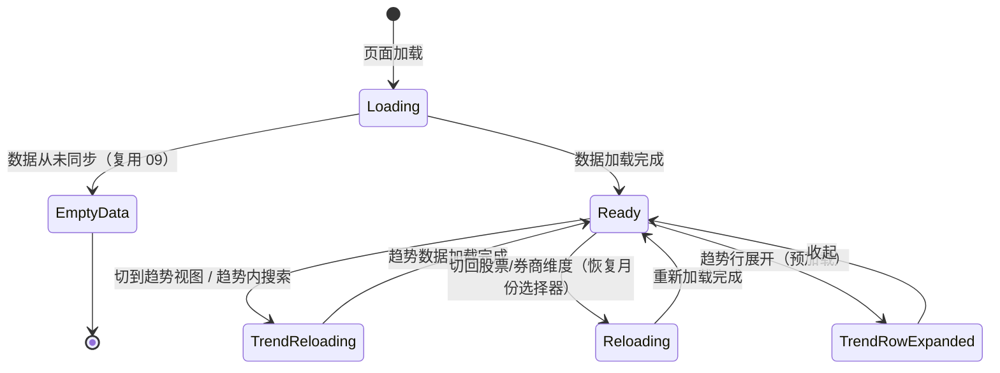

# 10-1 架构文档：券商荐股趋势

_本文件只保留当前版本真正影响实现的架构决策、边界和契约；DDL、目录树、环境变量、实施故事等内容默认不放入正文。_

## 1. 系统摘要

在 09 券商荐股页面新增"推荐趋势"第三视图，跨全部已同步月份对 `broker_recommend` 表做只读聚合，用"连续被推荐月数 + 累计券商家数 + 最新月家数 + 月度家数序列"四项指标 + 迷你折线图，呈现个股的跨月推荐持续性。**不新增数据表、不新增同步链路**，纯属对已有数据的新消费维度。

**核心闭环**：Aggregate(all-months) → Rank(continuity) → Render(sparkline)（跨月聚合 → 连续性排序 → 折线图渲染）。

## 2. 范围、非目标与成功标准

### 2.1 范围

- **趋势视图入口**：现有视图切换器（`ViewSwitcher`）新增第三选项 `trend`，与 `stock`/`broker` 平级；切到趋势视图时隐藏月份选择器与板块筛选，固定全窗口
- **持续性排行榜**：跨全部已同步月份聚合，按"连续被推荐月数"降序（多级排序：连续月数 ↓ → 累计家数 ↓ → 最新月家数 ↓ → 代码 ↑），每行展示四项指标 + 迷你折线图；分页加载
- **趋势展开**：展开某行查看窗口内每月家数与推荐券商（前 3 + 省略），数据随列表预加载
- **趋势搜索**：按股票代码前缀 / 名称包含搜索，服务端全量重查
- **趋势视图口径一致**：最新月家数与 09 股票维度排行同月数字一致（均按券商名称去重）

### 2.2 明确不做

- 不新增数据表 / 不新增同步链路（完全复用 09 `broker_recommend` 表与同步服务）
- 时间窗口切换器（固定全部已同步月份）
- 趋势行下钻单月排行（三视图不联动）
- 大图弹窗式完整走势图（首版用迷你折线图）
- 券商维度的持续性趋势（本期仅股票维度）
- 预计算表 / 物化视图 / 独立缓存层（数据量小，实时聚合足够）
- 推荐收益/涨跌幅跟踪、买卖方交叉推荐（沿用 09 不做项）

### 2.3 成功标准

| 指标 | 首版目标 |
|---|---|
| 趋势榜展示 | 跨月聚合 + 连续月数主排序 + 四项指标 + 迷你折线图，功能正常 |
| 多级排序 | 连续月数 → 累计家数 → 最新月家数 → 代码，稳定无抖动 |
| 口径一致 | 最新月家数与 09 股票维度同月家数一致 |
| 视图切换 | 切到趋势隐藏月份选择器/板块筛选、清搜索词、回第1页；切离恢复 |
| 展开 | 预加载、按月降序、断档月 0 家，无二次请求 |
| 搜索+分页 | 全量重查+回第1页，无结果提示，清空恢复，≤20 隐藏分页器 |
| 单月/空状态降级 | 单月数据正常展示连续月数=1；从未同步沿用 09 整页空状态 |
| 页面加载 | < 2s（窗口内数万行聚合 + 连续性计算 + 分页 20） |

### 2.4 验收标准承接矩阵

| AC-ID | PRD 原文摘要 | 承接模块 | 关键链路 / 状态 | 风险 / 降级说明 |
|---|---|---|---|---|
| AC-01 | 趋势视图入口（第三选项 + 隐藏月份选择器） | 前端 ViewSwitcher + BrokerRecommendPage | 链路 6.4（视图切换状态） | OPTIONS 数组加 trend；view==='trend' 时隐藏 MonthSelector/板块筛选 |
| AC-02 | 持续性排行榜展示（跨月聚合 + 连续月数降序 + 四指标 + 折线图） | TrendAPI + TrendRepo + TrendService + BrokerTrendRanking + Sparkline | 链路 6.1（趋势榜加载） | 连续月数依赖全窗口计算，混合策略（见 ADR-2） |
| AC-03 | 多级排序 | TrendService（Python 层排序） | 链路 6.1（排序算法） | 连续月数↓→累计家数↓→最新月家数↓→代码↑ |
| AC-04 | 指标口径一致（最新月家数 = 09 同月家数） | TrendService（COUNT DISTINCT broker，同口径） | 链路 6.1（聚合） | 与 09 股票维度 repo 同一表同去重口径，天然一致 |
| AC-05 | 迷你折线图走势呈现 | Sparkline 组件 | 链路 6.4（前端渲染） | SVG 自绘，窗口内各月含 0 家断档点 |
| AC-06 | 展开月度明细（按月降序 + 家数 + 券商前3 + 预加载） | TrendRepo（get_trend_brokers）+ BrokerTrendRanking | 链路 6.1（展开数据随列表预加载） | 数据随列表返回，无二次请求 |
| AC-07 | 断档股的连续月数（从最新月向前断档即停） | TrendService（连续性计数算法） | 链路 6.1（连续性计算） | 沿已同步月份序列向前，遇缺月停止 |
| AC-08 | 分页加载 | TrendService（Python 层分页） | 链路 6.1（分页） | total=全窗口符合条件股票总数；≤20 隐藏分页器 |
| AC-09 | 趋势视图搜索 | TrendRepo（WHERE 层 search）+ TrendService | 链路 6.1（search） | 服务端全量重查+回第1页；LIKE 转义 |
| AC-10 | 切换视图时的状态重置 | BrokerRecommendPage（前端状态管理） | 链路 6.4（视图切换） | 切到/切离趋势均清搜索词+回第1页+显隐月份选择器 |
| AC-11 | 仅单月数据可用 | TrendService（连续性=1 降级） | 链路 6.1（单月分支） | 序列仅一点，连续月数均为1，落入次级排序 |
| AC-12 | 数据从未同步的空状态 | 复用 09 整页空状态 | 链路 6.4（hasNoData 分支） | months.hasData=false 时不发起 trend 请求 |

## 3. 用户流程与状态

### 3.1 主流程

**流程 A：用户发现持续被推荐的长期共识股**

1. 用户从侧边栏进入"券商每月荐股"页面（默认股票维度）
2. 用户将视图切换为"推荐趋势"（清空搜索词+回第1页+隐藏月份选择器与板块筛选）
3. 页面跨全部已同步月份聚合，按"连续被推荐月数"降序展示榜单
4. 用户看到榜首：连续 N 个月被推荐、累计 M 家、最新月 K 家，迷你折线图呈上升形态
5. 用户点击该行展开，查看窗口内每月家数与推荐券商（预加载，无 loading）

**流程 B：用户搜索特定股票的推荐趋势**

1. 用户在趋势视图搜索框输入股票代码或名称
2. 页面对全窗口全部股票重新查询过滤，仅保留匹配股票并回第 1 页
3. 用户查看该股持续性指标与走势曲线

### 3.2 关键分支

| 分支名 | 入口/触发条件 | 架构处理方式 |
|---|---|---|
| 数据从未同步 | `broker_recommend` 表无任何数据 | 复用 09：months API 返回 `has_data: false`，前端整页空状态，不发起 trend 请求 |
| 仅一个已同步月份 | months 仅一项 | 趋势榜正常展示，连续月数均为 1，折线图单点；落入次级排序 |
| 断档股 | 某股窗口中间某月无推荐 | 连续月数从最新月向前计到断档即停；累计家数与走势序列仍含断档前的更早月份 |
| 搜索无结果 | search 无匹配 | 表格区"未找到匹配结果，请调整搜索词" |
| 趋势榜加载失败 | 聚合查询异常 | 表格区"加载失败，请重试" |

### 3.3 状态机

前端页面交互状态（在 09 双视图状态机基础上增加 trend 分支）：



关键规则：
- 切到 trend 时隐藏 MonthSelector + 板块筛选，清空 search + 回第1页
- 切离 trend（到 stock/broker）时恢复 MonthSelector（默认最新月），清空 search + 回第1页
- 趋势行展开无中间态（数据随列表预加载）

## 4. 系统上下文与模块职责

### 4.1 系统上下文

本功能嵌入 09 已有的券商荐股页面，**不引入任何新数据表、不新增同步链路、不新增外部依赖**。仅在现有查询服务、Repository、API 路由、前端组件上扩展一个"趋势"消费维度。

变更点（全部是对 09 既有文件的增量扩展，无新建独立模块）：
- 后端 `BrokerRecommendRepository` 新增趋势聚合方法（跨月 GROUP BY + 连续性数据查询）
- 后端 `BrokerRecommendAnalysisService` 新增 `get_trend_ranking`（连续性计算 + 排序 + 分页）
- 后端 `broker_recommend_analysis.py` API 路由新增 `GET /trend-ranking` 端点
- 前端 `ViewSwitcher` OPTIONS 数组新增 `trend` 第三项
- 前端 `BrokerRecommendPage` 增加 trend 视图分支（隐藏月份选择器/板块筛选、调用趋势 hook）
- 前端新增 `BrokerTrendRanking` 组件 + `Sparkline` 迷你折线图组件
- 前端 `useBrokerRecommend.ts` 新增 `useBrokerTrendRanking` hook
- 前端 `lib/api.ts` 的 `brokerRecommendApi` 新增 `getTrendRanking` 方法 + `BrokerView` 类型扩展

数据流向：
- `broker_recommend`（只读跨月聚合）+ `stocks`（只读 JOIN 名称）+ `sectors`/`sector_stocks`（只读 JOIN 行业）→ `BrokerRecommendAnalysisService.get_trend_ranking`（聚合+连续性计算）→ API → 前端

### 4.2 模块职责

| 模块 | 职责 | 上游输入 | 下游输出 |
|---|---|---|---|
| `BrokerRecommendRepository`（09 已有，新增方法） | 新增跨月聚合查询：窗口内 (symbol,month,broker_count) 矩阵 + 各股券商明细 | Service 调用 | ORM 查询结果（跨月聚合行） |
| `BrokerRecommendAnalysisService`（09 已有，新增方法） | 新增 `get_trend_ranking`：SQL 取原始聚合 → Python 层计算连续月数/累计家数/最新月家数/走势序列 → 排序 → 分页 → 行业 JOIN + 展开券商预加载 | Repository + stocks/sectors JOIN | API 响应 dict |
| `broker_recommend_analysis.py` API 路由（09 已有，新增端点） | 新增 `GET /trend-ranking` | 用户 query（search/page/page_size） | `{success, data}` camelCase 响应 |
| 前端 `BrokerRecommendPage`（09 已有，改造） | 增加 trend 视图分支：view==='trend' 时隐藏 MonthSelector/板块筛选，渲染 BrokerTrendRanking | 用户交互 | 页面渲染 |
| 前端 `BrokerTrendRanking`（新增） | 趋势榜表格：四指标列 + 迷你折线图列 + 行展开月度明细 | trend hook 数据 | 表格渲染 |
| 前端 `Sparkline`（新增） | 轻量 SVG 迷你折线图：给定数值序列渲染趋势形态 | 数值序列 + 尺寸 props | SVG 元素 |

**复用声明验证**：

- **复用 09 `BrokerRecommendRepository`（同表同 session）**：验证（代码级）：`broker_recommend_repository.py` 的 `__init__(self, session: AsyncSession)` + `super().__init__(BrokerRecommend, session)`，操作同一 `broker_recommend` 表。趋势方法在同一 Repository 类内新增，共享同一表与 session。结论：直接同类扩展，无需新建 Repository。

- **复用 09 `BrokerRecommendAnalysisService`（同 session + 同 repo）**：验证（代码级）：`broker_recommend_analysis_service.py:36-38` `__init__(self, session)` 注入 `self.repo = BrokerRecommendRepository(session)`，已有 `_get_industry_for_stocks`（行业批量 JOIN，L42-87）、`_to_float`（Decimal→float，L91-98）、`_resolve_month`（月份解析，L110-116）。趋势方法复用同 session、同 repo、同行业 JOIN helper、同序列化 helper。结论：同类扩展。

- **复用 09 API 约定（`broker_recommend_analysis.py`）**：验证（代码级）：路由 `prefix="/broker-recommend-analysis"`，`_dict_to_camel`（L152-166）递归转 camelCase，`_serialize_value`（L141-149）Decimal/date 序列化，`Depends(get_current_user)` 普通用户认证，query 参数 snake_case（`page_size`）。趋势端点在同一 router 内新增，复用全部 helper。结论：同文件扩展。

- **复用 09 前端 `ViewSwitcher`（OPTIONS 数组扩展）**：验证（代码级）：`ViewSwitcher.tsx:21-24` `OPTIONS: Array<{value: BrokerView, label: string}>`，`data-testid={`broker-view-${opt.value}`}`，`aria-pressed`。加 `{value: 'trend', label: '推荐趋势'}` 即可，渲染逻辑无需改动。结论：数组追加一项。

- **复用 09 前端 `BrokerRecommendPage` 状态管理范式**：验证（代码级）：`BrokerRecommendPage.tsx` 已有 `handleViewChange`（L72-79，切视图清 search + 回第1页）、`handleMonthChange`。趋势分支在此基础上：view==='trend' 时隐藏 MonthSelector（L191）与板块筛选（L234），渲染 BrokerTrendRanking 替代 BrokerStockRanking/BrokerGroupList。结论：现有状态机可直接扩展。

- **复用 09 SWR hook 范式（`useBrokerStockRanking`）**：验证（代码级）：`useBrokerRecommend.ts:66-96`，`enabled` 控制 key null（避免非激活视图无效请求），`brokerRecommendApi.getXxx(query).then(res => res.data)`。趋势 hook 照搬同范式。结论：可复用。

- **复用 09 `brokerRecommendApi` 范式**：验证（代码级）：`apiClient.get<{success,data}>(endpoint, queryObj)`，query snake_case。趋势方法 `.getTrendRanking(query)` 照搬。结论：可复用。

- **迷你折线图实现选型**：验证（代码级，`web/package.json`）：项目已有 `echarts ^6.0.0` + `echarts-for-react ^3.0.5`。但 echarts 实例创建开销大，趋势榜每页 20 行 × 20 个 echarts 实例会显著拖慢渲染。sparkline 本质是无坐标轴、无 tooltip、无交互的趋势形态折线，SVG 几十行即可自绘。结论：用轻量 SVG 自绘 Sparkline 组件，不复用 echarts（见 ADR-6）。

### 4.3 需要刻意避免的过度设计

- **不新增数据表**：趋势是 `broker_recommend` 表的跨月只读聚合，是查询问题不是存储问题；新增表会引入同步冗余与口径漂移
- **不新增同步链路**：数据来源完全是 09 已同步的 `broker_recommend` 表，无需任何新同步
- **不引入预计算表/物化视图**：窗口内数据量小（数万行、去重后上千股），实时聚合 + Python 层连续性计算 < 500ms
- **不引入缓存层**：与 09 一致，实时聚合足够；趋势数据随每次月份同步自然刷新，缓存维护成本 > 收益
- **不引入大图交互**：迷你折线图已足够表达趋势形态，首版不做可交互大图弹窗
- **不引入窗口切换器**：固定全窗口，语义自洽
- **不引入趋势维度的券商排行**：本期仅股票维度趋势

## 5. 关键架构决策（ADR）

### ADR-1：数据模型 — 不新增表，复用 `broker_recommend` 跨月只读聚合

- **选择**：不新建任何数据表，趋势排行榜的全部数据来自 09 已有的 `broker_recommend` 表的跨月只读聚合。
- **理由**：趋势是"同一份数据的新消费维度"，不是新数据。新增表会导致：(a) 同步冗余（需在 09 同步后二次写入趋势表）；(b) 口径漂移风险（两份数据可能不一致，破坏 AC-04 口径一致要求）；(c) 覆盖式更新时需同步刷新趋势表。复用单表保证趋势与单月视图永远同源同口径。
- **演进余地**：若未来窗口极长（数十月）导致聚合变慢，可评估物化视图，但首版数据量无需。

### ADR-2：趋势聚合策略 — SQL 聚合原始数据 + Python 层连续性计算/排序/分页（混合策略）

- **选择**：分两阶段——(1) SQL 层一次性查出窗口内所有 `(symbol, month)` 组合及各月 `COUNT(DISTINCT broker)`，附带搜索过滤；(2) Python 层对每只股票构建"月份→家数"映射，计算连续月数/累计家数/最新月家数/走势序列，完成多级排序后内存分页。
- **理由**：主排序键"连续被推荐月数"是**序列连续性问题**（从最新月向前不间断计数），无法用纯 SQL 单查询高效表达（需窗口函数 + 自连接或递归 CTE，复杂且数据库可移植性差）。Python 层拿到每只股票的月份集合后，连续性计数是 O(月份数) 线性扫描，上千只股票总计算量极小（< 50ms）。SQL 负责"取数 + 过滤"（它擅长的），Python 负责"连续性判断 + 排序 + 分页"（它擅长的），职责清晰。
- **风险与对策**：Python 层分页需加载窗口内全部符合条件股票到内存。对策：窗口内去重股票通常上千只（每月数百股 × 去重），每只仅几字段，内存占用 < 1MB，完全可控。

### ADR-3：连续月数计数口径 — 从全局最新已同步月份向前，沿已同步月份序列不间断计数

- **选择**：连续月数 = 从全局最新已同步月份（`MAX(month)`）开始，沿"已同步月份序列"（非自然月）向前逐个检查，该股在该月份有推荐则 +1，遇到该股无推荐的月份即停止。若该股在最新月本身无推荐，连续月数为 0。
- **理由**：PRD AC-07 明确"从最新月向前断档即停"，且 AC-07 前置以"最新月有推荐"为前提。从全局最新月（而非该股最后一次被推荐月）向前计数，确保榜首是"截至当前仍在被持续推荐"的股票——一只历史连续 12 月但最新月断档的股票，连续月数为 0，不会占据榜首。沿"已同步月份序列"而非"自然月"计数，是因为窗口本身就是已同步月份的集合（可能存在非连续的自然月，如只同步了 1/3/6 月）。
- **风险与对策**：无显著风险。该口径在 Python 层实现简单（见链路 6.1 算法）。

### ADR-4：展开明细随列表预加载（与 09 股票维度一致）

- **选择**：趋势榜接口在 `TrendRankingItem` 内嵌展开所需数据（该股窗口内每月家数 + 各月券商前 3），展开纯前端渲染无二次请求。
- **理由**：与 09 股票维度展开机制一致（ADR-3）。单股窗口内涉及月份数十几个、每月券商数个位到数十，预加载开销可控；趋势榜每页仅 20 行，总数据量适中。
- **风险与对策**：若窗口极长（数十月）导致单股券商明细膨胀，对策：各月券商列表加 LIMIT 3 兜底（只取前 3 家用于展开省略展示），完整券商数仍通过 brokerCount 准确呈现。

### ADR-5：搜索为服务端全量重查，触发/清空均回第 1 页

- **选择**：趋势 search 在 SQL WHERE 层（`symbol LIKE 'x%' OR name ILIKE '%x%'`，name 来自 LEFT JOIN stocks），搜索词变化即重查并 page=1。
- **理由**：与 09 AC-11/12 与本需求 AC-09 一致，搜索结果总数会变，回第 1 页避免越界空页。LIKE 通配符复用 09 `_escape_like_keyword` 转义防注入。
- **风险与对策**：无显著风险。

### ADR-6：迷你折线图用轻量 SVG 自绘，不复用 echarts

- **选择**：趋势榜每行的迷你折线图用自绘 SVG 组件实现（约 30 行：给定数值序列，归一化后画 polyline + 可选端点），不使用项目已有的 echarts-for-react。
- **理由**：sparkline 本质是无坐标轴、无 tooltip、无交互的趋势形态折线。趋势榜每页 20 行需 20 个图表实例；echarts 实例创建开销大（每个实例含完整渲染引擎），20 个实例会显著拖慢首屏。SVG polyline 对十几个数据点的折线是最轻量方案，性能极佳且无额外依赖。echarts 留给真正需要交互/坐标轴的场景。
- **风险与对策**：无显著风险。SVG sparkline 是成熟模式，数据点少。

### ADR-7：性能 — 不缓存，实时聚合

- **选择**：趋势查询服务直接实时聚合，不引入缓存层。
- **理由**：与 09 一致（09 ADR-6 也不缓存）。窗口内 broker_recommend 行数：假设 12 月 × 每月 2000 行 = 2.4 万行，去重股票约 500-1000 只。SQL 跨月 GROUP BY + Python 连续性计算 + 排序分页，预估 < 500ms。趋势数据随月份同步自然刷新（覆盖式更新），无热点缓存价值。
- **演进余地**：若未来窗口极长或用户量增长，可复用 08 两级缓存范式（已存在模板）。

### 5.x 待确认问题

无。关键假设（数据量、echarts 性能、连续性口径）已通过代码级核实与 PRD AC-07 明确。

## 6. 运行链路

### 6.1 趋势榜加载（含搜索、连续性计算、排序、分页、展开预加载）

1. 前端渲染趋势视图，发起请求：`GET /api/v1/broker-recommend-analysis/trend-ranking?search=&page=1&page_size=20`（**无 month 参数**，趋势固定全窗口）
2. Service 先查窗口：`SELECT DISTINCT month FROM broker_recommend ORDER BY month` 得到已同步月份序列 `months_desc`（降序）；无数据 → 返回 `{has_data: false}`，前端整页空状态（复用 09）
3. **SQL 阶段（取数 + 过滤）**：Repository 查窗口内全部聚合行：
   ```sql
   SELECT b.symbol,
          b.month,
          COUNT(DISTINCT b.broker) AS broker_count
   FROM broker_recommend b
   LEFT JOIN stocks s ON s.symbol = b.symbol   -- name 用于 search
   WHERE b.month IN (:all_months)
     [AND (b.symbol LIKE :search% OR s.name ILIKE :%search%)]
   GROUP BY b.symbol, b.month
   ```
   返回窗口内所有 `(symbol, month, broker_count)` 三元组。
4. **Python 阶段（连续性 + 指标计算）**：Service 对每只股票构建 `{month: broker_count}` 映射，计算：
   - `consecutive_months`：从 `months_desc[0]`（全局最新月）沿 `months_desc` 序列向前，该股在该月有记录（broker_count > 0）则 +1，遇到无记录月即停（算法见下方）
   - `cumulative_broker_count`：该股窗口内 `COUNT(DISTINCT broker)`（跨月去重，需对该股全部月份的 broker 集合求并集大小）
   - `latest_month_broker_count`：该股在 `months_desc[0]` 的 broker_count（无记录则 0）
   - `monthly_series`：按月份升序（旧→新）的 `{month, broker_count}` 序列（窗口内全部已同步月份，无推荐的月份 broker_count=0）
5. **Python 阶段（排序 + 分页）**：按 `consecutive_months DESC, cumulative_broker_count DESC, latest_month_broker_count DESC, symbol ASC` 排序；`total = len(排序后列表)`；取 `offset=(page-1)*page_size` 到 `offset+page_size` 的当页股票
6. **当页补充数据（行业 + 展开券商）**：
   - 行业：对当页 symbols 批量调用 `_get_industry_for_stocks(symbols)`（复用 09，L42-87）
   - 展开券商：Repository 查当页 symbols 窗口内全部 `(symbol, month, broker)`，Service 按 `(symbol, month)` 分组，每月取前 3 家券商名（`top_brokers`）用于展开省略展示
7. 返回 `{has_data, total, page, page_size, items: TrendRankingItem[]}`；前端渲染

**连续性计数算法**（步骤 4 细化）：
```
months_desc = 已同步月份降序序列  # 如 [2026-06, 2026-05, 2026-04, ...]
latest = months_desc[0]
for each symbol:
    month_counts = 该股的 {month: broker_count} 映射
    consecutive = 0
    for m in months_desc:                # 从最新月向前遍历
        if m in month_counts:            # 该股在该月有推荐
            consecutive += 1
        else:
            break                        # 断档即停
    symbol.consecutive_months = consecutive
```
注意：沿"已同步月份序列"（months_desc）而非自然月，确保窗口内非连续自然月场景正确。

**累计家数算法**（步骤 4 细化）：累计家数需跨月 DISTINCT broker，SQL GROUP BY (symbol, month) 只得到每月家数。对策：Repository 额外查一次窗口内 `(symbol, broker)` 去重计数：
```sql
SELECT symbol, COUNT(DISTINCT broker) AS cumulative_count
FROM broker_recommend
WHERE month IN (:all_months)
  [AND 搜索过滤]      -- 必须与主聚合 SQL（步骤3）完全同口径，否则聚合有值但累计家数缺失
GROUP BY symbol
```
Service 用此结果填充 `cumulative_broker_count`。**实现约束**：主聚合 SQL（步骤 3）与累计家数 SQL 的搜索过滤条件必须抽公共 WHERE 片段复用，禁止各自手写，确保两查询命中同一批 symbol 集合。

这条链路的实现原则：
- 趋势视图**不接收 month 参数**，窗口固定为全部已同步月份（`SELECT DISTINCT month`）
- search 在 SQL WHERE 层（服务端全量重查），LIKE 通配符用 `_escape_like_keyword` 转义
- 连续性计数在 Python 层（序列连续性问题，见 ADR-2/ADR-3）
- 多级排序在 Python 层（连续月数↓→累计家数↓→最新月家数↓→代码↑），保证稳定
- 分页在 Python 层（offset/limit），total = 全窗口符合条件股票总数
- 展开数据随列表预加载（ADR-4），各月券商前 3 兜底
- 不缓存，实时聚合（ADR-7）

### 6.2 视图切换（趋势 ↔ 股票/券商）

1. 用户点击 ViewSwitcher 的"推荐趋势"（或从趋势切回）
2. 前端 `handleViewChange`：`setView(nextView)` + `setSearch('')` + `setDebouncedSearch('')` + `setSectorName(undefined)` + `setPage(1)`（对齐 09 Page `handleViewChange` 既有重置逻辑）
3. view==='trend' 时：隐藏 MonthSelector、隐藏板块筛选（BrokerSectorTypeSelector + SimpleSelect），渲染 BrokerTrendRanking，调用 `useBrokerTrendRanking`
4. view!=='trend' 时：恢复 MonthSelector（默认最新月 months[0]）、恢复板块筛选，渲染 09 原有组件
5. 板块分布排行榜（BrokerSectorRankings）：仅在 view!=='trend' 时展示（趋势视图隐藏，因趋势不依赖单月板块分布）

这条链路的实现原则：
- 切到/切离趋势均清空 search + 回第1页（AC-10）
- 趋势视图不发起 months 请求（复用页面已加载的 monthsData 判断 hasNoData）；趋势 hook 的 enabled = `!hasNoData && view === 'trend'`
- 月份选择器与板块筛选的显隐由 `view === 'trend'` 控制

### 6.3 页面加载与空状态

1. 页面初始加载复用 09：`useBrokerMonths` 查月份列表 + hasData
2. `hasNoData`（months.hasData=false）→ 整页空状态（复用 09，09 hasNoData 分支仅渲染标题+空状态块、不渲染视图切换器），不发请求
3. view==='trend' 且 !hasNoData → 发起 `useBrokerTrendRanking`（链路 6.1）

## 7. 领域对象与关键契约

### 7.1 核心对象

| 对象名 | Source of Truth | Owner | 用途 |
|---|---|---|---|
| `BrokerRecommend`（09 已有） | `broker_recommend` 表 | 09 同步服务 | 券商金股快照，趋势聚合数据源（只读） |
| `Stock`（已有） | `stocks` 表 | 03 同步服务 | 股票名/行业 JOIN（只读） |
| `Sector` / `SectorStock`（已有） | `sectors`/`sector_stocks` 表 | 板块体系 | 行业维度（只读 JOIN） |

无新增核心对象。

### 7.2 推荐最小 Schema

```typescript
// 视图枚举（扩展 09 的 BrokerView）
type BrokerView = 'stock' | 'broker' | 'trend';   // 新增 'trend'

// 趋势榜单项（API 响应输出视角，camelCase）
interface TrendRankingItem {
  symbol: string;                       // 股票代码
  name: string | null;                  // 股票名称（JOIN stocks.name，无匹配 null → 前端 "—"）
  industries: string[];                 // 所属行业列表（一股多行业）
  consecutiveMonths: number;            // 连续被推荐月数（从全局最新月向前不间断计数）
  cumulativeBrokerCount: number;        // 累计推荐券商家数（窗口内 DISTINCT broker，跨月去重）
  latestMonthBrokerCount: number;       // 最新月推荐家数（= 09 股票维度同月家数，AC-04）
  monthlySeries: TrendMonthPoint[];     // 月度推荐家数序列（折线图数据源，旧→新升序）
  monthlyBrokers: TrendMonthBroker[];   // 展开明细（按月，预加载；新→旧降序，与展开展示方向一致）
}

// 月度序列点（折线图用，扁平）
interface TrendMonthPoint {
  month: string;          // 月份 ISO 字符串 YYYY-MM-01
  brokerCount: number;    // 该月推荐券商家数（无推荐为 0）
}

// 展开明细月度券商（预加载，扁平）
interface TrendMonthBroker {
  month: string;          // 月份
  brokerCount: number;    // 该月家数
  topBrokers: string[];   // 该月推荐券商前 3 家（超出省略，完整家数见 brokerCount）
}

// 趋势榜列表响应
interface TrendRankingResponse {
  hasData: boolean;       // 是否有金股数据（全表无数据时 false）
  total: number;          // 全窗口符合条件股票总数
  page: number;
  pageSize: number;
  items: TrendRankingItem[];
}
```

### 7.3 API 边界

| 接口路径 | 方法 | 用途 | 说明 |
|---|---|---|---|
| `/api/v1/broker-recommend-analysis/trend-ranking` | GET | 趋势榜（AC-02/03/04/05/06/07/08/09/11） | 参数：search（可选）、page（默认1）、page_size（默认20）。**无 month 参数**（趋势固定全窗口）。返回 TrendRankingResponse |

请求字段数据来源说明：
- `search`：user_input（用户输入搜索框）
- `page` / `page_size`：frontend_computed（分页参数）

**API 契约约定**（与 09 既有约定完全对齐，无新增约定）：
- **响应包裹结构**：统一 `{ success: true, data: {...} }`（复用 09 `_dict_to_camel`）
- **命名转换边界**：响应输出 camelCase（Pydantic `to_camel` alias）；query 参数保持 snake_case（`page_size`）
- **序列化约定**：date → ISO 字符串；Decimal → float（复用 09 `_serialize_value`）；数值字段必须为 number
- **Schema 视角**：§7.2 为 API 响应输出视角（camelCase）；后端 Pydantic model 字段用 snake_case（`consecutive_months`/`cumulative_broker_count` 等），通过 `ConfigDict(alias_generator=to_camel, populate_by_name=True)` 转换
- **路径前缀**：`/api/v1/broker-recommend-analysis/trend-ranking`（09 同前缀，kebab-case）
- **认证**：`Depends(get_current_user)` 普通用户认证（与 09 一致）

### 7.4 状态流转

趋势查询为同步 API，无后端任务状态机。前端无后端状态机，所有查询为同步 SWR 请求。

### 7.5 数据边界

| 存储层 | 职责 |
|---|---|
| PostgreSQL `broker_recommend` 表（09 已有） | 券商金股快照，趋势跨月只读聚合数据源 |
| PostgreSQL `stocks` 表（已有，03） | 股票名称，只读 JOIN |
| PostgreSQL `sectors` + `sector_stocks` 表（已有） | 行业分类，只读 JOIN |

无新增存储层。

### 7.6 命名与标识规则

| 维度 | 规则 |
|---|---|
| 数据表 | 无新增（复用 09 `broker_recommend`） |
| Service 方法名 | `get_trend_ranking`（09 同类 snake_case 方法名风格） |
| Repository 方法名 | `get_trend_aggregations`（跨月聚合取数）、`get_trend_cumulative_counts`（跨月累计去重）、`get_trend_brokers`（展开券商预加载） |
| API 路径 | `/api/v1/broker-recommend-analysis/trend-ranking`（09 同前缀） |
| 前端组件名 | `BrokerTrendRanking`（趋势榜表格）、`Sparkline`（迷你折线图） |
| 前端 hook 名 | `useBrokerTrendRanking` |
| 前端 API 方法名 | `brokerRecommendApi.getTrendRanking` |
| 视图枚举 | `view` = `stock` / `broker` / `trend`（新增 `trend`） |
| JSON 命名风格 | camelCase（前端），snake_case（Python/DB），API 层自动转换 |

术语映射：

| PRD/前端术语 | 后端字段 | 说明 |
|---|---|---|
| 连续被推荐月数 | `consecutive_months` | 从全局最新月向前不间断计数，主排序键 |
| 累计推荐券商家数 | `cumulative_broker_count` | 窗口内 DISTINCT broker 跨月去重 |
| 最新月推荐家数 | `latest_month_broker_count` | = 09 股票维度同月 broker_count（AC-04） |
| 月度推荐家数序列 | `monthly_series` | 各月家数有序序列，折线图数据源 |
| 展开明细券商 | `monthly_brokers[].top_brokers` | 各月推荐券商前 3 家 |

## 8. 非功能需求、风险与运行策略

### 8.1 性能与吞吐量目标

| 指标 | 目标 | 预期 |
|---|---|---|
| 趋势榜加载 | < 2s | 窗口内数万行 GROUP BY + Python 连续性计算（上千股）+ 排序分页，预估 < 500ms |
| 单月数据降级 | < 1s | 单月聚合极轻，连续性均为 1 |
| 预期并发 | 单用户 | 个人工具，低并发 |

### 8.2 可靠性、错误处理与降级策略

**错误处理**：
- 数据库查询异常 → API 返回 500 + 通用错误信息，前端"加载失败，请重试"
- 无金股数据 → trend-ranking 返回 `{has_data: false}`，前端整页空状态（复用 09）
- 仅单月数据 → 正常返回，连续月数均为 1，折线图单点
- 搜索无结果 → items 空数组 + total 0，前端"未找到匹配结果，请调整搜索词"

**降级策略**（按用户体验影响从小到大排列）：

| 降级级别 | 触发条件 | 系统行为 |
|---|---|---|
| L1：部分股票无行业 | sector_stocks 未覆盖 | 行业显示"—"，不影响指标计算 |
| L2：部分股票无 name | stocks 表未覆盖 | name 显示"—"，不影响指标 |
| L3：单月数据 | 仅一个已同步月份 | 连续月数均为 1，折线图单点，正常排序 |
| L4：搜索无结果 | search 无匹配 | 提示"未找到匹配结果，请调整搜索词" |
| L5：无金股数据 | 表为空 | 整页空状态（复用 09） |

### 8.3 安全与反滥用策略

| 项目 | 首版策略 |
|---|---|
| API 权限 | 复用 09 `Depends(get_current_user)` JWT 认证，登录后可访问 |
| SQL 注入防护 | SQLAlchemy ORM 参数化查询；search 用 `_escape_like_keyword` 转义通配符（复用 09） |
| 数据写入 | 全只读，无写入操作 |

### 8.4 成本控制预期

| 模块 | 预估成本 | 首版控制策略 |
|---|---|---|
| 数据库查询 | 纯 PostgreSQL，0 额外成本 | 依赖索引（`(symbol, month)` + `(month)`），单次 < 500ms |
| 外部依赖 | 无 | 不调用任何外部服务（数据全部来自已有表） |

无外部按量计费依赖（与 09 不同，趋势不触发 Tushare 调用）。

### 8.5 可观测性

- **后端日志**：Service 层 logging 记录 warning/error（复用 09 模式）
- **API 错误**：FastAPI error_handlers 统一处理（与 09 一致）
- **前端错误**：SWR onError 回调处理，控制台记录异常

### 8.6 主要风险

| 风险 | 影响 | 缓解方式 |
|---|---|---|
| 窗口极长（数十月）导致聚合变慢 | 趋势榜加载变慢 | 首版数据量可控（< 500ms）；若变慢可复用 08 缓存范式或物化视图 |
| Python 层全量加载股票到内存 | 内存占用 | 窗口内去重股票上千只，每只几字段，< 1MB，可控 |
| 累计家数跨月去重需额外查询 | 多一次 SQL 往返 | 单次 GROUP BY 查询，开销极小（< 50ms） |
| echarts 用于 sparkline 的性能误判 | 渲染卡顿 | ADR-6 已决策用 SVG 自绘，规避此风险 |
| 月份选择器/板块筛选在趋势视图的显隐状态错乱 | 用户体验差 | 前端统一由 `view === 'trend'` 控制显隐（AC-10） |

## 9. 实施方案

### Phase A：后端趋势聚合与 API

**1. Repository 扩展**

- `server/src/repositories/broker_recommend_repository.py` — 新增方法：
  - `get_trend_aggregations(all_months, search)` — 跨月 `GROUP BY symbol, month` + `COUNT(DISTINCT broker)`，附搜索过滤（symbol LIKE / name ILIKE JOIN stocks），返回 `[(symbol, month, broker_count)]`
  - `get_trend_cumulative_counts(all_months, search)` — 跨月 `GROUP BY symbol` + `COUNT(DISTINCT broker)`（累计去重家数），返回 `{symbol: cumulative_count}`
  - `get_trend_brokers(all_months, symbols)` — 当页股票窗口内全部 `(symbol, month, broker)`，供 Service 按 (symbol, month) 分组取前 3

**2. Service 扩展**

- `server/src/services/broker_recommend_analysis_service.py` — 新增 `get_trend_ranking(search, page, page_size)`：
  - 查窗口月份序列（`self.repo.get_months()`）
  - 调 `get_trend_aggregations` + `get_trend_cumulative_counts`
  - Python 层连续性计数（ADR-3 算法）+ latest_month_broker_count + monthly_series 构建
  - 多级排序（连续月数↓→累计家数↓→最新月家数↓→代码↑）+ Python 分页
  - 当页 `_get_industry_for_stocks`（复用 09）+ `get_trend_brokers` 取前 3
  - 返回 `{has_data, total, page, page_size, items}`

**3. API 端点**

- `server/src/api/v1/broker_recommend_analysis.py` — 新增：
  - `TrendMonthPoint` / `TrendMonthBroker` / `TrendRankingItem` / `TrendRankingData` Pydantic model（`ConfigDict(alias_generator=to_camel)`）
  - `GET /trend-ranking` 端点（search/page/page_size query，无 month）

验证目标：curl 验证 `/trend-ranking` 返回正确的连续月数、累计家数、最新月家数、走势序列、展开券商；多级排序、搜索、分页、单月降级、空状态均符合 AC-02~AC-09/AC-11/AC-12。

### Phase B：前端趋势视图

**4. 类型与 API 客户端**

- `web/src/lib/api.ts` — `BrokerView` 类型加 `'trend'`；`brokerRecommendApi` 新增 `.getTrendRanking(query)`；新增 `TrendRankingItem` / `TrendRankingResponse` 等 interface（对齐 §7.2）

**5. Hook**

- `web/src/hooks/useBrokerRecommend.ts` — 新增 `useBrokerTrendRanking(params)`（范式照搬 `useBrokerStockRanking`，`enabled` 控制 key null）

**6. 迷你折线图组件**

- `web/src/components/broker-recommend-analysis/Sparkline.tsx` — 新建（SVG 自绘）：props `{values: number[], width, height}`，归一化后画 polyline + 可选端点圆点；无交互

**7. 趋势榜表格组件**

- `web/src/components/broker-recommend-analysis/BrokerTrendRanking.tsx` — 新建：
  - 表头：排名 / 代码 / 名称 / 行业 / 连续月数 / 累计家数 / 最新月家数 / 推荐走势（Sparkline）/ 操作
  - 行展开（预加载）：按月降序展示 monthlyBrokers（月份 + 家数 + 券商前3+省略）
  - 分页器（total ≤ 20 隐藏）
  - data-testid：`broker-trend-table` / `broker-trend-expand-{symbol}` / `broker-trend-expand-content-{symbol}` / `broker-trend-pagination` / `broker-trend-sparkline-{symbol}`

**8. 主页面与视图切换器改造**

- `web/src/components/broker-recommend-analysis/ViewSwitcher.tsx` — OPTIONS 数组追加 `{value: 'trend', label: '推荐趋势'}`
- `web/src/components/broker-recommend-analysis/BrokerRecommendPage.tsx` — 改造：
  - view==='trend' 时隐藏 MonthSelector（L191 区域）与板块筛选（L234 区域）与板块分布 BrokerSectorRankings（L201）
  - view==='trend' 时渲染 BrokerTrendRanking，调用 useBrokerTrendRanking（enabled = `!hasNoData && view === 'trend'`）
  - 搜索 placeholder 趋势视图用"搜索股票代码或名称"
  - 标题区"卖方共识排行榜"在趋势视图显示"持续推荐排行榜"

验证目标：完整走通 AC-01~AC-12 所有验收场景，含视图切换（显隐月份选择器）、趋势榜四指标、迷你折线图、展开明细、多级排序、搜索、分页、单月降级、空状态。

## 10. 架构结论

首版架构的核心判断是**以零新增数据表、零新增同步链路，纯通过对 09 `broker_recommend` 表的跨月只读聚合，实现"跨期持续性"消费维度**。这是 09 决策记录中"多期走势"演进方向的最小成本兑现。

设计原则：
- 不新增表、不新增同步——趋势是查询问题不是存储问题，复用单表保证与 09 单月视图永远同源同口径（AC-04）
- 混合聚合策略——SQL 取数过滤（它擅长的）+ Python 连续性计算/排序/分页（它擅长的），因主排序键"连续月数"是序列连续性问题无法纯 SQL 高效表达（ADR-2）
- 连续月数从全局最新月向前沿已同步月份序列不间断计数，确保榜首是"至今仍坚守"的股票（ADR-3）
- 展开明细随列表预加载，与 09 股票维度展开机制一致（ADR-4）
- 迷你折线图用 SVG 自绘而非 echarts，规避 20 实例/页的渲染开销（ADR-6）
- 不缓存，实时聚合，数据量小（ADR-7）

演进方向：
- 若窗口极长导致聚合变慢，可复用 08 两级缓存范式或引入物化视图
- 若用户需要聚焦近期，可评估时间窗口切换器
- 若需要券商维度的持续性趋势，可扩展同范式券商趋势榜
- 若需要趋势行下钻单月排行，可增加视图间联动
