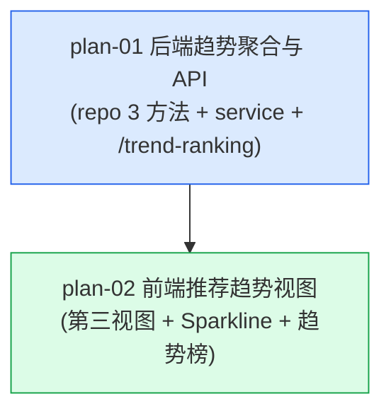

# 实现计划：券商荐股趋势

## 1. 概览

- **项目**: 券商荐股趋势（09 券商月度金股的演进——新增"推荐趋势"第三视图）
- **来源架构**: docs/10-券商荐股趋势/10-1-架构文档-券商荐股趋势.md（status: done，arch-check 100% 通过）
- **组织方式**: 功能维度（Feature-based）
- **项目类型**: brownfield（现有项目加功能，09 已交付的券商荐股页面扩展）
- **技术栈**: 后端 Python FastAPI + SQLAlchemy + PostgreSQL；前端 Next.js + React + TypeScript + SWR；数据复用 09 broker_recommend 表（无新增数据源/同步）
- **总阶段数**: 2（Phase 1 = 后端趋势聚合与 API；Phase 2 = 前端推荐趋势视图）
- **总功能数**: 2
- **最大并行度**: 1（后端先行，前端依赖后端 API 契约）
- **关键路径**: plan-01 → plan-02

## 2. 输入摘要

### 2.1 核心闭环与目标

在 09 券商荐股页面新增"推荐趋势"第三视图，跨全部已同步月份对 `broker_recommend` 表做只读聚合，用"连续被推荐月数 + 累计券商家数 + 最新月家数 + 月度家数序列"四项指标 + 迷你折线图，呈现个股的跨月推荐持续性。核心闭环：Aggregate(all-months) → Rank(continuity) → Render(sparkline)（跨月聚合 → 连续性排序 → 折线图渲染）。

首版以**零新增数据表、零新增同步链路**实现对 09 已沉淀数据的跨期持续性消费——纯通过 `broker_recommend` 表的跨月只读聚合，回答"哪些股票持续被推荐且被很多券商推荐"。混合聚合策略（SQL 取数 + Python 连续性计算），与 09 单月视图永远同源同口径（AC-04）。

### 2.2 关键 ADR 与实施护栏

- **ADR-1**：不新增表，复用 `broker_recommend` 跨月只读聚合。护栏：趋势是查询问题不是存储问题，新增表会引入同步冗余与口径漂移。
- **ADR-2**：混合聚合策略——SQL 聚合原始数据（GROUP BY symbol,month）+ Python 层连续性计算/排序/分页。护栏：主排序键"连续月数"是序列连续性问题，无法纯 SQL 高效表达。
- **ADR-3**：连续月数从全局最新已同步月份向前沿"已同步月份序列"不间断计数，遇断档即停。护栏：沿 months 序列（非自然月），确保窗口内非连续自然月场景正确（AC-07）。
- **ADR-4**：展开明细随列表预加载（与 09 股票维度一致）。护栏：各月券商前 3 兜底。
- **ADR-5**：搜索服务端全量重查 + 回第1页，LIKE 通配符用 `_escape_like_keyword` 转义。
- **ADR-6**：迷你折线图用轻量 SVG 自绘，不复用 echarts。护栏：趋势榜每页 20 行 × 20 echarts 实例渲染开销过大；sparkline 无交互，SVG polyline 最轻量。
- **ADR-7**：不缓存，实时聚合（数据量小，< 500ms）。
- **过度设计护栏（架构 §4.3）**：不新增数据表/同步链路/预计算表/物化视图/缓存层/大图交互/窗口切换器/券商维度趋势。

### 2.3 现有代码快照

Brownfield repo 扫描确认的约定锚点（计划照抄真实代码约定，见各功能实现规格"前后端契约四件套校验"）：

- **后端趋势聚合扩展点**：`server/src/repositories/broker_recommend_repository.py`（09 已有 `BrokerRecommendRepository(BaseRepository[BrokerRecommend])`，含 get_months/get_stock_ranking/get_stock_brokers 等范式）；`server/src/services/broker_recommend_analysis_service.py`（09 已有 `BrokerRecommendAnalysisService`，含 `_get_industry_for_stocks` L42-87、`_to_float` L91-98、`_resolve_month` L110-116）；`server/src/api/v1/broker_recommend_analysis.py`（09 已有路由 prefix `/broker-recommend-analysis`，`_dict_to_camel` L152-166、`_serialize_value` L141-149、`Depends(get_current_user)`、query snake_case）。
- **前端扩展点**：`web/src/components/broker-recommend-analysis/ViewSwitcher.tsx`（L21-24 OPTIONS 数组）；`web/src/components/broker-recommend-analysis/BrokerRecommendPage.tsx`（L72-79 handleViewChange 含 sectorName 重置、L156-178 空状态、L191 MonthSelector、L201 板块分布、L208-293 排行榜 section）；`web/src/hooks/useBrokerRecommend.ts`（L66-96 useBrokerStockRanking 范式）；`web/src/lib/api.ts`（brokerRecommendApi + BrokerView 类型）；`web/src/components/broker-recommend-analysis/BrokerStockRanking.tsx`（表格+展开+分页范式锚点）。
- **E2E 测试基础设施**：Playwright 已就绪（`web/playwright.config.ts`，testDir `./tests/e2e`，dev 端口 3100，mock 模式不依赖真实后端）。09 spec 在 `web/tests/e2e/broker-recommend-analysis.spec.ts`，mock helper 在 `web/tests/e2e/helpers/mock-broker-recommend-api.ts`。server 单元测试用 pytest（`--asyncio-mode=auto`）。

### 2.4 架构约束

- 响应包裹结构统一 `{ success, data }`；响应输出 camelCase（Pydantic `to_camel` + 路由 `_dict_to_camel`），query/路径参数保持 snake_case。
- date → ISO 字符串；趋势数值字段均为 int，无 Decimal 风险。
- 趋势 API 路径 `/api/v1/broker-recommend-analysis/trend-ranking`（09 同前缀，kebab-case），**无 month 参数**（趋势固定全窗口）。
- 视图枚举 `view` = `stock` / `broker` / **`trend`**（新增）。
- 连续月数沿"已同步月份序列"（非自然月）计数；窗口固定为全部已同步月份。

## 3. 验收标准追踪矩阵

> 每条来自架构 §2.4 的 AC-XX 都在本表出现一次，回溯到 PRD §第四部分。

| AC-ID | 需求原文 | 架构承接 | 计划承接 | 验证方式 | 当前状态 |
| --- | --- | --- | --- | --- | --- |
| AC-01 | 趋势视图入口（第三选项 + 隐藏月份选择器） | 前端 ViewSwitcher + BrokerRecommendPage | plan-02 | plan-02 §5 视图入口验收 + E2E TC | planned |
| AC-02 | 持续性排行榜展示（跨月聚合 + 连续月数降序 + 四指标 + 折线图） | TrendAPI + TrendRepo + TrendService + BrokerTrendRanking + Sparkline | plan-01, plan-02 | plan-01 §5 趋势聚合验收 + plan-02 §5 趋势榜展示 E2E | planned |
| AC-03 | 多级排序（连续月数↓→累计家数↓→最新月家数↓→代码↑） | TrendService（Python 层排序） | plan-01 | plan-01 §5 多级排序验收 | planned |
| AC-04 | 指标口径一致（最新月家数 = 09 同月家数） | TrendService（COUNT DISTINCT broker 同口径） | plan-01 | plan-01 §5 口径一致验收（pytest 对照 09 股票维度） | planned |
| AC-05 | 迷你折线图走势呈现 | Sparkline 组件 | plan-02 | plan-02 §5 走势呈现 E2E（Sparkline 渲染） | planned |
| AC-06 | 展开月度明细（按月降序 + 家数 + 券商前3 + 预加载） | TrendRepo（get_trend_brokers）+ BrokerTrendRanking | plan-01, plan-02 | plan-01 §5 展开数据预加载 + plan-02 §5 行展开 E2E | planned |
| AC-07 | 断档股的连续月数（从最新月向前断档即停） | TrendService（连续性计数算法） | plan-01 | plan-01 §5 断档验收（pytest 多场景） | planned |
| AC-08 | 分页加载（total 全窗口数，≤20 隐藏） | TrendService（Python 层分页） | plan-01, plan-02 | plan-01 §5 分页验收 + plan-02 §5 分页 E2E | planned |
| AC-09 | 趋势视图搜索（服务端全量重查） | TrendRepo（WHERE 层 search）+ TrendService | plan-01, plan-02 | plan-01 §5 搜索验收 + plan-02 §5 搜索 E2E | planned |
| AC-10 | 切换视图时的状态重置 | BrokerRecommendPage（前端状态管理） | plan-02 | plan-02 §5 状态验收 + E2E（切到/切离趋势） | planned |
| AC-11 | 仅单月数据可用（连续月数=1 降级） | TrendService（连续性=1） | plan-01, plan-02 | plan-01 §5 单月验收 + plan-02 §5 单月降级 E2E | planned |
| AC-12 | 数据从未同步的空状态 | 复用 09 整页空状态 | plan-02 | plan-02 §5 空状态验收（复用 09，hasData=false） | planned |

## 4. 模块地图

按功能聚合展示：

| 功能 | 包含模块 | 类型 | 对应文件 |
| --- | --- | --- | --- |
| plan-01 | BrokerRecommendRepository（扩展 3 方法）、BrokerRecommendAnalysisService（扩展 get_trend_ranking）、趋势 API 端点（GET /trend-ranking + 4 Pydantic model） | backend | plan-01-后端趋势聚合与API.md |
| plan-02 | brokerRecommendApi.getTrendRanking + TrendRankingItem 类型、useBrokerTrendRanking hook、Sparkline 组件、BrokerTrendRanking 组件、ViewSwitcher（扩展）、BrokerRecommendPage（改造 trend 分支） | frontend | plan-02-前端推荐趋势视图.md |

## 5. 依赖图



节点说明：
- plan-02 依赖 plan-01 的 GET /trend-ranking 端点契约（趋势榜数据源）。

## 6. 阶段摘要

| 阶段 | 功能 | 维度 | 说明 |
| --- | --- | --- | --- |
| Phase 1 | plan-01 | backend | 后端趋势聚合与 API：repo 3 跨月聚合方法 + service 连续性计算/排序/分页 + GET /trend-ranking 端点 |
| Phase 2 | plan-02 | frontend | 前端推荐趋势视图：第三视图接入 + Sparkline + 趋势榜表格 + 状态机改造 |

阶段依赖：Phase 2 必须在 Phase 1 完成后开始（前端消费后端 API 契约）。

## 7. 任务总览

| 功能 | 阶段 | 包含维度 | 依赖 | 独立验收标准 |
| --- | --- | --- | --- | --- |
| plan-01: 后端趋势聚合与 API | Phase 1 | backend | 无 | curl/pytest 验证 GET /trend-ranking：连续月数/多级排序/累计家数/最新月家数/走势序列/搜索/分页/单月/空状态均符合 AC |
| plan-02: 前端推荐趋势视图 | Phase 2 | frontend | plan-01 | 完整走通 AC-01~AC-12 全部 E2E 场景（视图切换、趋势榜四指标、Sparkline、展开月度明细、搜索、分页、状态重置、单月降级、空状态） |

> README 任务总览为展示缓存；功能文件 frontmatter status 为状态唯一可信源，冲突时以 plan-*.md 为准。

### 7.2 开发状态机

| FEAT | 当前步骤 | red_e2e | implement | green_e2e | review | 最近证据 | 阻塞原因 | 更新时间 |
| --- | --- | --- | --- | --- | --- | --- | --- | --- |
| plan-01 | done | done | done | done | done | reviews/plan-01-review-2026-06-29.md | - | 2026-06-29 |
| plan-02 | done | done | done | done | done | reviews/plan-02-review-2026-06-29.md | - | 2026-06-29 |

> plan-01 为纯后端 API，质量门为 pytest + curl（无独立 UI，E2E 由 plan-02 联调覆盖）。plan-02 为用户可观察功能，须遵循 E2E-TDD（red→implement→green）。

## 8. 未决策项

无遗留未决策项。架构 §5.x 待确认问题为空（连续性口径、数据量、echarts 性能等假设均通过代码级核实与 PRD AC-07 收敛）。

## 9. 执行前置

### 9.1 环境准备

- 后端：PostgreSQL 可用；09 已交付（`broker_recommend` 表存在、至少一个月数据已同步）；pytest 环境（`server/pytest.ini`，`--asyncio-mode=auto`）。
- 前端：`web` 依赖已安装（Next 16 + React 19 + SWR + Playwright）；09 前端组件已就绪（ViewSwitcher/BrokerRecommendPage 等）。
- 测试：web Playwright（`npx playwright test`，dev 端口 3100，mock 模式）。

### 9.2 执行顺序

1. **plan-01**（无依赖）— repo 3 方法 + service get_trend_ranking + GET /trend-ranking 端点。完成后趋势 API 契约就绪，可 curl/pytest 验证。
2. **plan-02**（依赖 plan-01 API 契约）— 类型+API 客户端 + hook + Sparkline + TrendRanking 组件 + ViewSwitcher 扩展 + Page 改造 + E2E spec。

### 9.3 全局验证

所有功能完成后执行：

```bash
# 后端
cd server
pytest tests/ -k "trend" -v          # 趋势聚合单元测试
uvicorn src.main:app --reload         # 启动后端，确认无 import 错误

# 前端
cd web
npx tsc --noEmit                      # 类型校验
npm run build                         # 构建校验
npx playwright test                   # 全量 E2E（含 10 新增 trend spec + 09 既有 spec 回归）
```

## 10. 变更记录

| 日期 | 变更类型 | 功能 | 说明 |
| --- | --- | --- | --- |
| 2026-06-29 | create | plan-01, plan-02 | 首版生成实现计划（基于 10-1 架构文档 status: done，arch-check 100% 通过） |

<!-- 保留目录：reviews/。当 task-review、dev-plan-check 等开始运行时创建。 -->
