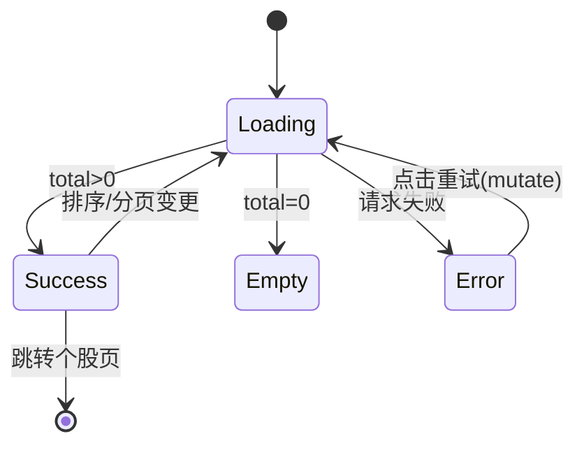

# 架构设计文档

_本文件只保留当前版本真正影响实现的架构决策、边界和契约；DDL、目录树、环境变量、实施故事等内容默认不放入正文。_

## 1. 系统摘要

在板块详情页强度/均线图表下方接入"板块成分股列表"，让用户从板块聚合强度下钻到具体个股。核心闭环锚点：**Sector → Stocks → Stock**（板块 → 成分股 → 个股）。后端成分股查询接口已就绪，本期为纯前端接入 + 补齐个股分析页最小落地页，打通"板块强度 → 成分股明细 → 个股分析"的可下钻链路。

## 2. 范围、非目标与成功标准

### 2.1 范围

- 板块详情页（`/dashboard/sector-analysis/[sectorId]`）图表区下方新增"板块成分股"区块
- 成分股列表展示列：股票代码、名称、强度分、趋势（升/平/降）、最新价、市值
- 排序：支持按强度分、市值排序（升降序可切换），默认强度分降序
- 分页：复用现有分页器，支持翻页与每页条数切换（20/50/100）
- 三态呈现：加载中（骨架屏）、加载失败（重试）、空数据（引导文案）
- 点击成分股行跳转个股分析页
- 新建个股分析页最小落地页（展示代码/名称/强度分/趋势/最新价/市值），作为下钻目标

### 2.2 明确不做

- 个股分析页深度功能（个股强度趋势图、均线分析、K线、资金流等）
- 成分股在板块内的权重占比展示（后端接口不返回此字段）
- 成分股二级筛选（按行业、市值区间过滤）
- 列表导出、收藏、加入自选
- 列表项内嵌迷你走势图
- 后端成分股接口的新增或改造（已就绪，仅做参数对齐）

### 2.3 成功标准

| 指标 | 首版目标 |
| --- | --- |
| 成分股列表呈现 | 板块详情页能加载、排序、分页展示成分股，三态呈现正常，无异常 |
| 下钻闭环 | 点击成分股能正确跳转到个股分析页且落地页不空，Sector → Stocks → Stock 闭环可走通 |
| 排序正确性 | 按强度分、市值排序结果与后端返回一致，切换方向正确 |
| 组件独立性 | 成分股区块与上方图表加载相互独立，互不阻塞 |
| 成分股列表首屏响应 | 单次成分股请求响应时间 < 500ms（page_size=20） |

### 2.4 验收标准承接矩阵

| AC-ID | PRD 原文摘要 | 承接模块 | 关键链路 / 状态 | 风险 / 降级说明 |
| --- | --- | --- | --- | --- |
| AC-01 | 图表下方出现成分股区块，按强度分降序，含六列+总数 | SectorStocksTable + useSectorStocks | 链路 L1（默认加载）→ 成功态 | 后端已支持默认 strength_score desc；无数据走空态 |
| AC-02 | 点击强度分表头切换升降序 | SectorStocksTable | 排序状态切换 → 链路 L1 重载 | 排序参数透传后端，前端不做本地排序 |
| AC-03 | 点击市值表头降序，不可排序列不响应 | SectorStocksTable | 排序状态切换；sort_by 锁定 market_cap/strength_score | sort_by 白名单限制，防任意字段穿透 |
| AC-04 | 翻页+切换每页条数，总页数更新，滚动到区块顶部 | SectorStocksTable + Pagination | 分页状态切换 → 链路 L1 重载 | page_size 上限 100（后端约束） |
| AC-05 | 加载失败显示重试，图表不受影响，重试重载 | useSectorStocks + SectorStocksTable | 失败态 → 重试 → L1 | SWR mutate 重发，独立于图表 hook |
| AC-06 | 无成分股显示空态文案 | SectorStocksTable | 空态（total=0） | 不显示表格与分页器 |
| AC-07 | 点击行跳转个股分析页，落地页展示基础信息，不空白 | StockAnalysisPage（新建） | 跳转链路 L2 | 个股数据通过 stocksApi.getStock 获取；失败由落地页自身处理 |

## 3. 用户流程与状态

### 3.1 主流程

进入板块详情页 → 页面并行加载（图表 hook / 成分股 hook 各自独立） → 成分股区块进入加载态 → 数据返回后渲染表格（默认强度分降序，显示总数） → 用户可：点击表头切换排序 / 翻页或切每页条数 / 点击某行 → 跳转到个股分析页查看该股基础信息。

### 3.2 关键分支

| 分支名 | 入口 / 触发条件 | 架构处理方式 |
| --- | --- | --- |
| 排序切换 | 点击强度分/市值表头 | 更新 sort_by/sort_order 状态 → SWR key 变化自动重载，page 重置为 1 |
| 分页切换 | 翻页 / 改每页条数 | 更新 page/page_size → SWR key 变化重载，列表滚动到区块顶部 |
| 加载失败 | 请求异常 | 区块显示失败态 + 重试按钮，调用 SWR mutate 重发，不影响图表 |
| 空数据 | total=0 | 显示空态文案，不渲染表格/分页器 |
| 下钻个股 | 点击成分股行 | router.push 到 `/dashboard/stock-analysis/[id]`，id 取成分股项的 `id` 字段 |

### 3.3 状态机



关键规则：排序/分页变更都回到 Loading；Error 仅通过重试回到 Loading；Empty 为终态（除非切换板块）。

## 4. 系统上下文与模块职责

### 4.1 系统上下文

```mermaid
flowchart LR
    A[板块详情页] --> B[强度/均线图表 hook]
    A --> C[成分股 hook useSectorStocks]
    C --> D[(后端 /sectors/{id}/stocks)]
    A --> E[成分股表格组件]
    E -->|点击行| F[个股分析页]
    F --> G[(后端 /stocks/{id})]
```

变更点：板块详情页新增成分股区块（C+E）；新增个股分析页（F）；后端无变更（D、G 复用现有）。

### 4.2 模块职责

| 模块名 | 职责 | 上游输入 | 下游输出 |
| --- | --- | --- | --- |
| `useSectorStocks`（新建 hook） | 按板块 id+排序+分页拉取成分股，返回 data/isLoading/isError/mutate | sectorId, sort_by, sort_order, page, page_size | `SectorStockItem[]` + 分页元信息 |
| `SectorStocksTable`（新建组件） | 渲染成分股表格、表头排序交互、分页器接入、三态呈现、行点击跳转 | useSectorStocks 的返回值 + 排序/分页状态 | 渲染 UI；触发 router.push |
| 板块详情页 `[sectorId]/page.tsx`（改造） | 在图表区下方挂载 SectorStocksTable，传入 sectorId | 当前路由 sectorId | 渲染成分股区块 |
| `StockAnalysisPage`（新建，`stock-analysis/[id]/page.tsx`） | 个股分析最小落地页，展示代码/名称/强度分/趋势/最新价/市值 | 路由 id 参数（成分股项的 `id`） | 渲染个股基础信息 |
| `sectorsApi.getSectorStocks`（修正） | 修正参数为 page/page_size/sort_by/sort_order，补返回类型 | 前端调用 | 类型化的 ApiResponse |
| 后端 `get_sector_stocks`（既有，不改） | 查询成分股并分页 | sector_id, sort_by, sort_order, page, page_size | `{success, data:{items,total,page,page_size,total_pages}}` |

复用声明可行性验证：
- `Pagination`（`web/src/components/ui/Pagination.tsx`）：已支持翻页 + 每页条数切换 + 跳页，CrowdRankingTable 已用相同模式，可直接复用。
- `SimpleSelect`（`web/src/components/ui/SimpleSelect.tsx`）：用作每页条数下拉，已在 CrowdRankingTable 验证。
- 后端 `get_sector_stocks`（`server/src/api/v1/sectors.py:254`）：验证数据源——从 `StockModel` 通过 `SectorStockModel.stock_code == StockModel.symbol` 关联，`where SectorStockModel.sector_code == sector.code`，返回 id/symbol/name/current_price/market_cap/strength_score/trend_direction，场景完全匹配。
- `stocksApi.getStock`（`web/src/lib/api.ts:160`）：验证存在，用于个股落地页取数；其参数为数据库 id（与后端 `/stocks/{stock_id}` 的 isdigit 校验一致），成分股项返回的 `id` 字段即为此 id。

### 4.3 需要刻意避免的过度设计

- 不为成分股引入独立的二级筛选/搜索（PRD 明确不做）
- 不引入虚拟滚动长列表（成分股量级分页可控，无需 react-window）
- 不为个股分析页提前搭建趋势图/均线/K线框架（本期仅最小落地页）
- 不新增后端表或接口（成分股接口已就绪）
- 不在成分股列表做本地排序缓存（排序完全由后端驱动）

## 5. 关键架构决策（ADR）

### ADR-1：成分股数据完全由后端驱动，前端不做本地排序/分页
- **选择**：排序（sort_by/sort_order）、分页（page/page_size）作为参数透传给后端，前端只负责状态管理与渲染。
- **理由**：后端 `get_sector_stocks` 已原生支持这四个参数；本地排序会与分页冲突（只能排当前页），且增加前端复杂度。链路最短，无额外失败点。
- **演进余地**：未来如需前端缓存可再加，当前不提前付出。

### ADR-2：成分股区块与图表区加载完全独立
- **选择**：成分股使用独立的 SWR hook（`useSectorStocks`），query key 与图表 hook 分离，各自独立加载/失败。
- **理由**：PRD AC-05 要求"成分股加载失败不影响图表"；独立 hook 是最直接的实现，符合板块详情页现有两个图表 hook（useSectorStrengthHistory / useSectorMAHistory）已相互独立的模式。
- **风险与对策**：无额外风险，与既有模式一致。

### ADR-3：复用项目既有的表格+分页呈现范式（以 CrowdRankingTable 为模板）
- **选择**：SectorStocksTable 的结构、骨架屏、错误态、空态、data-testid 约定参考 CrowdRankingTable。
- **理由**：保持全站股票类列表的视觉与交互一致；复用 Pagination/SimpleSelect 组件，降低开发与测试成本。不用更重的方案（独立设计系统/通用表格原子组件）。
- **演进余地**：若后续多个列表趋同，可再抽通用 FilterTable，当前不过早抽象。

### ADR-4：修正既有 getSectorStocks 参数以对齐后端契约
- **选择**：将前端 `sectorsApi.getSectorStocks` 的参数从 `skip/limit` 改为 `page/page_size/sort_by/sort_order`，并补 TypeScript 返回类型。
- **理由**：现有方法参数与后端实际契约不符（后端是 page/page_size，见 sectors.py:259-260），是潜在 bug；必须修正才能支持排序分页。这是 brownfield 对齐，非新设计。
- **风险与对策**：该方法当前无调用方（前端从未真正使用），修正无破坏性影响。

### ADR-5：个股分析页作为本期最小落地页一并补齐
- **选择**：新建 `/dashboard/stock-analysis/[id]/page.tsx`，仅展示代码/名称/强度分/趋势/最新价/市值，数据来自现有 `stocksApi.getStock`。
- **理由**：PRD AC-07 要求点击成分股能落地且不空白；当前仓库无个股页（RankingItem 的 `/stock/${id}` 也是悬空引用）。不补齐则 AC-07 无法验收。不引入个股深度功能（PRD 明确不做）。
- **风险与对策**：跳转参数须用成分股项的 `id`（数据库主键），非 symbol——后端 `/stocks/{stock_id}` 以 id 查询并 isdigit 校验（stocks.py:170-172）；返回字段含 strength_score/trend_direction/current_price/market_cap（stocks.py:201-212），落地页可完整渲染。

### 5.x 待确认问题

无。Q1 已决策：`stocksApi.getStock`（`/stocks/{stock_id}`，以数据库 id 查询）返回的 StockDetail 含 strength_score、trend_direction、current_price、market_cap 等字段（stocks.py:201-212，与成分股项同源 StockModel），个股分析页据此完整渲染。跳转参数用成分股项的 `id`（数据库主键），非 symbol。

## 6. 运行链路

### 6.1 链路 L1：成分股加载与交互

1. 板块详情页挂载，从路由取 `sectorId`，传给 `SectorStocksTable`
2. `useSectorStocks` 以 `sectorId + sort_by + sort_order + page + page_size` 组成 SWR key 发起请求
3. apiClient 调用 `GET /api/v1/sectors/{sectorId}/stocks?sort_by=&sort_order=&page=&page_size=`
4. 后端校验板块存在 → JOIN SectorStockModel 查询成分股 → 排序 → count 总数 → 分页 → 返回 `{success, data:{items,total,page,page_size,total_pages}}`
5. 前端 hook 解包 `.data.data`，返回 items 与分页元信息
6. 组件据 total 判断：>0 渲染表格+分页器；=0 渲染空态；请求异常渲染失败态+重试

实现原则：
- 排序/分页状态变化 → SWR key 变化 → 自动重载，无需手动触发
- 切换排序或每页条数时，page 强制重置为 1（避免越界）
- 翻页后调用区块 ref 滚动到顶部
- 前端 sort_by 白名单：仅 `strength_score`、`market_cap` 两个值能透传后端，防任意字段穿透

### 6.2 链路 L2：点击成分股下钻个股页

1. 用户点击成分股表格行（非表头、非分页器）
2. 组件调用 `router.push('/dashboard/stock-analysis/' + id)`，id 取该成分股项的 `id` 字段（数据库主键）
3. 个股分析页从路由取 `id`，调用 `stocksApi.getStock(id)` 获取详情
4. 渲染代码/名称/强度分/趋势/最新价/市值；加载中/失败由落地页自身处理

实现原则：
- 跳转参数用成分股项的 `id`（数据库主键），与后端 `/stocks/{stock_id}` 的 isdigit 校验匹配；**不要用 symbol**（symbol 非数字，会被后端 isdigit 校验拒绝）
- 个股页加载失败不回退，在页内呈现失败态

## 7. 领域对象与关键契约

### 7.1 核心对象

| 对象名 | Source of Truth | Owner | 用途 |
| --- | --- | --- | --- |
| SectorStockItem（API 响应项） | 后端 `GET /sectors/{id}/stocks` 返回的 items | 后端 sectors 路由 | 成分股表格单行数据 |
| SectorStocksResult（分页响应） | 同上接口的 data 包裹 | 后端 | 列表 + 分页元信息 |
| 排序/分页 UI 状态 | 前端组件 state | SectorStocksTable | 驱动 SWR key |
| 个股详情 | 后端 `GET /stocks/{id}` | 后端 stocks 路由 | 个股分析页渲染 |

### 7.2 推荐最小 Schema

注意：后端返回 snake_case，前端在边界处定义响应类型时保持 snake_case 以对齐后端真实输出；UI 渲染时按需取用。嵌套不超过 2 层。

```ts
// 成分股列表项（对齐后端 sectors.py:309-318 实际返回字段）
interface SectorStockItem {
  id: string
  symbol: string
  name: string
  current_price: number | null
  market_cap: number | null
  strength_score: number | null
  trend_direction: number | null  // 1=上升, 0=横盘, -1=下降
}

// 分页响应 data（对齐 PaginatedData）
interface SectorStocksData {
  items: SectorStockItem[]
  total: number
  page: number
  page_size: number
  total_pages: number
}

// API 整体响应（对齐既有 { success, data } 包裹约定）
interface SectorStocksResponse {
  success: boolean
  data: SectorStocksData
}

// 排序/分页 UI 状态
interface SectorStocksTableState {
  sort_by: 'strength_score' | 'market_cap'
  sort_order: 'asc' | 'desc'
  page: number
  page_size: 20 | 50 | 100
}
```

> 现有 `web/src/types/index.ts` 的 `SectorStock`（含 sector_id/stock_id/weight）与后端实际返回不符，本需求不修改它，而是新增上述 `SectorStockItem` 类型作为成分股列表的契约类型。

### 7.3 API 边界

| 接口路径 | 方法 | 用途 | 关键参数（数据来源） | 说明 |
| --- | --- | --- | --- | --- |
| `/api/v1/sectors/{sector_id}/stocks` | GET | 成分股列表（既有） | sector_id（路由）；sort_by/sort_order/page/page_size（query，前端 UI 状态） | 前端 getSectorStocks 需修正参数对齐 |
| `/api/v1/stocks/{id}` | GET | 个股详情（既有） | id（路由，=成分股项的 `id`，数据库主键） | 个股分析页取数；后端按 id 查询并 isdigit 校验 |

API 契约约定（对齐既有代码）：
- 响应包裹：统一 `{ success, data }`，列表类 data 为 PaginatedData（items/total/page/page_size/total_pages）
- 命名转换边界：后端输出 snake_case，前端响应类型保持 snake_case 对齐后端；query 参数亦用 snake_case（page_size、sort_by 等，与后端 Query 一致）。前端不在此接口做 camelCase 转换
- 序列化：strength_score/current_price/market_cap 为 number 或 null；日期字段本接口不涉及
- apiClient 返回 `ApiResponse<T>`，业务数据在 `.data`；页面消费需 `.data.data` 取 data 包裹（参考 useSectorStrengthHistory 的解包模式）

Brownfield 对齐锚点：
- 后端锚点：`server/src/api/v1/sectors.py:254-324`（路由实现）、`server/src/api/schemas/sector.py:72-76`（SectorStocksResponse）、`server/src/api/schemas/response.py:40`（PaginatedData）
- 前端锚点：`web/src/lib/api.ts:191`（getSectorStocks 待修正）、`web/src/lib/api.ts:160`（getStock）、`web/src/hooks/useSectorStrengthHistory.ts`（SWR hook 范式）

### 7.4 状态流转

成分股区块前端状态机见 3.3（Loading/Success/Empty/Error），无后端任务状态机（同步只读接口）。

### 7.5 数据边界

- 数据库层：成分股关联存于 `sector_stocks` 表（sector_code + stock_code 关联），StockModel 提供个股字段。本期不读写数据库，仅消费后端接口
- 接口层：后端聚合 StockModel 字段并分页返回，前端只读消费
- 浏览器层：仅 SWR 内存缓存（query key 粒度），无持久化

### 7.6 命名与标识规则

- 标识符：成分股项有两个标识——`id`（数据库主键，用于下钻跳转参数）与 `symbol`（股票代码，用于展示）。下钻跳转用 `id`，不用 symbol（后端 `/stocks/{stock_id}` 按 id 查询并 isdigit 校验）
- 排序字段白名单：`strength_score`、`market_cap`（与后端 StockModel 字段名一致）
- 术语映射：`trend_direction` 数值含义固定（1=上升/0=横盘/-1=下降），UI 渲染为红▲/绿▼/灰▬（A 股红涨绿跌惯例）
- 市值量级简写：万亿/亿，前端按量级格式化展示

## 8. 非功能需求、风险与运行策略

### 8.1 性能与吞吐量目标

| 指标 | 目标 | 预期并发 |
| --- | --- | --- |
| 成分股列表响应 | < 500ms（page_size=20） | 单用户单板块，无高并发 |
| 个股详情响应 | < 500ms | 单用户单次 |

### 8.2 可靠性、错误处理与降级策略

- 成分股请求失败：区块显示失败态 + 重试按钮，不影响上方图表（独立 hook）
- 个股详情失败：落地页页内显示失败态，不回退
- 板块无成分股：显示空态引导文案
- 排序/分页越界：page 强制重置为 1；page_size 受后端 ≤100 约束
- 降级级别（影响从小到大）：空态 > 排序/分页失败重试 > 整块加载失败

### 8.3 安全与反滥用策略

| 项目 | 首版策略 |
| --- | --- |
| 接口鉴权 | 复用既有 get_current_user（接口已要求登录） |
| sort_by 注入防护 | 前端白名单（strength_score/market_cap）+ 后端 getattr 兜底（默认 strength_score） |
| 越权 | 接口只读，按 sector_id 查询公开板块数据，无敏感数据 |

### 8.4 成本控制预期

无按量计费外部服务。成本仅为既有后端接口的数据库查询，无新增调用费用。

### 8.5 可观测性

- 复用既有前端 console.error（与板块详情页现有错误日志模式一致）
- 后端接口异常进入既有日志体系，不新增埋点

### 8.6 主要风险

| 风险 | 影响 | 缓解方式 |
| --- | --- | --- |
| getStock 返回字段与预期不完全一致 | 个股落地页个别字段缺失 | 缺失字段显示占位符，不阻塞；Q1 已决策 |
| 既有 SectorStock 类型误导开发 | 字段错配 | 新增 SectorStockItem 契约类型，不复用旧类型 |
| sort_by 任意穿透 | 排序异常/潜在风险 | 前端白名单 + 后端 getattr 默认值 |

## 9. 实施方案

### Phase A：前端契约层对齐

1. `web/src/lib/api.ts:191` — 修正 `getSectorStocks` 参数为 `{ page?, page_size?, sort_by?, sort_order? }`，补返回类型 `ApiResponse<SectorStocksResponse>`
2. `web/src/types/index.ts`（或 `sectorTypes.ts`）— 新增 `SectorStockItem`、`SectorStocksData`、`SectorStocksResponse`、`SectorStocksTableState` 类型（见 7.2）

验证目标：类型可被后续 hook/组件正确引用，编译通过。

### Phase B：数据获取与表格组件

3. `web/src/hooks/useSectorStocks.ts` — 新建 SWR hook，仿 useSectorStrengthHistory 范式，参数 sectorId/sort_by/sort_order/page/page_size，返回 data/isLoading/isError/mutate
4. `web/src/components/sector-analysis/SectorStocksTable.tsx` — 新建组件，含表格（六列）、表头排序交互（白名单）、分页器接入、三态呈现、行点击 router.push、data-testid 约定（参考 CrowdRankingTable）

验证目标：组件独立可用，AC-01~AC-06 可观察通过。

### Phase C：接入与下钻落地页

5. `web/src/app/dashboard/sector-analysis/[sectorId]/page.tsx` — 在图表区下方（约 313 行后）挂载 SectorStocksTable，传入 sectorId
6. `web/src/app/dashboard/stock-analysis/[id]/page.tsx` — 新建个股分析最小落地页，调用 stocksApi.getStock(id)（id 取路由参数，即成分股项的数据库主键）渲染代码/名称/强度分/趋势/最新价/市值

验证目标：AC-07 通过，Sector → Stocks → Stock 闭环可走通。

## 10. 架构结论

本期是纯前端接入 + 最小补齐的 brownfield 需求，核心判断有三：

1. **后端零改动**：成分股接口（含排序/分页）已完整就绪，前端只需对齐既有契约并修正历史参数不一致。
2. **独立性优先**：成分股区块用独立 SWR hook，与图表区解耦，天然满足"互不阻塞"与"失败可重试"的验收要求，且与详情页现有两个图表 hook 的模式一致。
3. **复用而非重造**：表格/分页/三态呈现复用 CrowdRankingTable 已验证的范式与 Pagination/SimpleSelect 组件；个股分析页只做最小落地，不预建深度框架。

设计原则：链路最短（参数透传、前端不本地排序分页）、复用既有约定（响应包裹、SWR 范式、data-testid）、不过早抽象。演进方向：后续若多个列表趋同可抽通用表格组件；个股分析页可在后续需求中扩展趋势/均线等功能，本期为其预留了路由入口。
