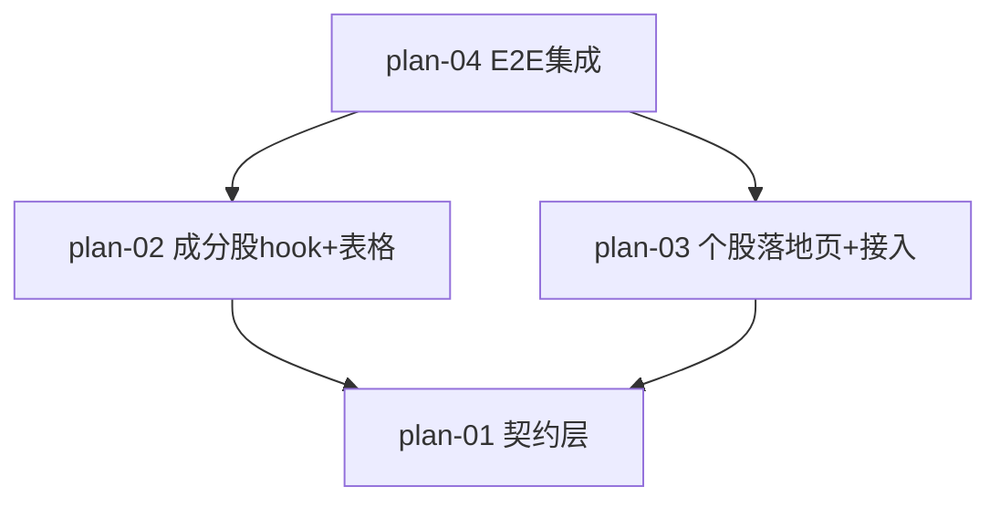

# 实现计划：板块成分股列表

## 1. 概览

- **项目**: 板块成分股列表
- **来源架构**: docs/11-板块成分股列表/11-1-架构文档-板块成分股列表.md
- **组织方式**: 功能维度（Feature-based）
- **项目类型**: brownfield
- **技术栈**: Next.js (App Router) + React + TypeScript + SWR（前端）；FastAPI + SQLAlchemy（后端，本期零改动）
- **总阶段数**: 3
- **总功能数**: 4
- **最大并行度**: 2（Phase 2 的 plan-02 与 plan-03 可并行）
- **关键路径**: plan-01 → plan-02 → plan-04（成分股主链路 + E2E 闭环）

## 2. 输入摘要

### 2.1 核心闭环与目标

核心闭环锚点：**Sector → Stocks → Stock**（板块 → 成分股 → 个股）。在板块详情页强度/均线图表下方接入成分股列表，打通板块强度到成分股明细、再到个股分析的可下钻链路。后端成分股查询接口已就绪，本期为纯前端接入 + 补齐个股分析页最小落地页。

### 2.2 关键 ADR 与实施护栏

| ADR | 护栏要点（实现时必须遵守） |
| --- | --- |
| ADR-1 后端驱动排序分页 | 前端 sort_by/page/page_size 透传后端，**禁止本地排序/分页**；page 切换排序/每页条数时重置为 1 |
| ADR-2 区块加载独立 | useSectorStocks 独立 SWR key，与图表 hook 互不阻塞 |
| ADR-3 复用 CrowdRankingTable 范式 | 三态/骨架/分页/data-testid 照抄既有约定 |
| ADR-4 修正 getSectorStocks 参数 | skip/limit → page/page_size/sort_by/sort_order，补返回类型 |
| ADR-5 个股分析页最小落地页 | 跳转参数用成分股项的 `id`（数据库主键），**不用 symbol**（后端 isdigit 校验会拒绝 symbol） |

### 2.3 现有代码快照

- 后端成分股接口已实现：`server/src/api/v1/sectors.py:254-324`（`GET /sectors/{sector_id}/stocks`），返回 `{success, data:{items,total,page,page_size,total_pages}}`，items 字段 id/symbol/name/current_price/market_cap/strength_score/trend_direction（snake_case）
- 后端个股详情：`server/src/api/v1/stocks.py:159`（`GET /stocks/{stock_id}`），按 id 查询 + isdigit 校验，返回含 strength_score/trend_direction/current_price/market_cap
- 前端 apiClient：`web/src/lib/api.ts`，返回 `ApiResponse<T>`（业务数据在 `.data`），页面消费需 `.data.data`
- 前端既有 getSectorStocks（`api.ts:191`）参数 skip/limit 与后端不匹配，待修正
- 前端 SWR hook 范式：`web/src/hooks/useSectorStrengthHistory.ts`
- 参考组件：`web/src/components/fund-crowd-analysis/CrowdRankingTable.tsx`（表格+分页+三态+data-testid）
- 复用 UI：`web/src/components/ui/Pagination.tsx`、`web/src/components/ui/SimpleSelect.tsx`
- 板块详情页：`web/src/app/dashboard/sector-analysis/[sectorId]/page.tsx`（图表区在 291-313 行，新增区块挂在其后）

### 2.4 架构约束

- 后端零改动（成分股接口、个股接口均既有）
- sort_by 前端白名单：仅 `strength_score`、`market_cap`
- 响应字段保持 snake_case，前端不做 camelCase 转换
- 外层包裹 `{success, data}`，前端解包层级 `.data.data`
- 趋势渲染：trend_direction 数值 1=上升(红▲)/0=横盘(灰▬)/-1=下降(绿▼)（A 股红涨绿跌）

## 3. 验收标准追踪矩阵

| AC-ID | 需求原文 | 架构承接 | 计划承接 | 验证方式 | 当前状态 |
| --- | --- | --- | --- | --- | --- |
| AC-01 | 图表下方出现成分股区块，按强度分降序，含六列+总数 | SectorStocksTable + useSectorStocks | plan-02 | plan-02 §5 + e2e TC（plan-04） | planned |
| AC-02 | 点击强度分表头切换升降序 | SectorStocksTable | plan-02 | plan-02 §5 + e2e TC（plan-04） | planned |
| AC-03 | 点击市值表头降序，不可排序列不响应 | SectorStocksTable | plan-02 | plan-02 §5 + e2e TC（plan-04） | planned |
| AC-04 | 翻页+切换每页条数，总页数更新，滚动到区块顶部 | SectorStocksTable + Pagination | plan-02 | plan-02 §5 + e2e TC（plan-04） | planned |
| AC-05 | 加载失败显示重试，图表不受影响，重试重载 | useSectorStocks + SectorStocksTable | plan-02 | plan-02 §5 + e2e TC（plan-04） | planned |
| AC-06 | 无成分股显示空态文案 | SectorStocksTable | plan-02 | plan-02 §5 + e2e TC（plan-04） | planned |
| AC-07 | 点击行跳转个股分析页，落地页展示基础信息，不空白 | StockAnalysisPage | plan-03 | plan-03 §5 + e2e TC（plan-04） | planned |

## 4. 模块地图

按功能聚合展示：

| 功能 | 包含模块 | 类型 | 对应文件 |
| --- | --- | --- | --- |
| plan-01 | sectorsApi.getSectorStocks、契约类型 | service | plan-01-契约层类型与api修正.md |
| plan-02 | useSectorStocks、SectorStocksTable | ui | plan-02-成分股hook与表格组件.md |
| plan-03 | StockAnalysisPage、详情页接入 | ui | plan-03-个股分析落地页与接入.md |
| plan-04 | E2E 用例与 spec | ui | plan-04-E2E集成用例.md |

## 5. 依赖图



节点使用 plan-ID 标识。

## 6. 阶段摘要

| 阶段 | 功能 | 说明 |
| --- | --- | --- |
| Phase 1 | plan-01 | 契约层对齐，无依赖，必须先完成 |
| Phase 2 | plan-02, plan-03 | 可并行：成分股主功能 + 个股落地页 |
| Phase 3 | plan-04 | E2E 集成验证，依赖前两个阶段可观察功能完成 |

## 7. 任务总览

| 功能 | 阶段 | 包含维度 | 依赖 | 独立验收标准 |
| --- | --- | --- | --- | --- |
| plan-01: 契约层类型与 API 修正 | Phase 1 | frontend | 无 | getSectorStocks 参数对齐后端，类型可被引用，build 通过 |
| plan-02: 成分股 hook 与表格组件 | Phase 2 | frontend | plan-01 | 表格加载/排序/分页/三态呈现正常（AC-01~06） |
| plan-03: 个股分析落地页与接入 | Phase 2 | frontend | plan-01 | 点击成分股跳转个股页且落地页不空（AC-07） |
| plan-04: E2E 集成用例 | Phase 3 | frontend | plan-02, plan-03 | red/green 证据覆盖 AC-01~07 全流程 |

## 8. 未决策项

无。架构 §5.x 待确认问题 Q1 已决策（getStock 返回字段已核实，跳转参数用 id）。

## 9. 执行前置

### 9.1 环境准备

- Node.js + 项目依赖已安装（`pnpm install` 于 web/）
- dev server：`pnpm dev`（端口 3100），E2E 需手动启动 dev server（playwright.config 无 webServer）
- 后端可选：E2E 走 mock 模式，不依赖真实后端

### 9.2 执行顺序

按 execution_order 分批：先 plan-01（契约层），再并行 plan-02 + plan-03，最后 plan-04（E2E）。E2E-TDD：plan-02/03 的 ready-to-dev 前先生成对应 red E2E 用例（在 plan-04 文档中），implementer 在 red 证据有效后开始实现。

### 9.3 全局验证

所有功能完成后执行：

```bash
cd web && pnpm type-check && pnpm build && pnpm test
# E2E（需先启动 pnpm dev）
pnpm exec playwright test tests/e2e/sector-stocks.spec.ts
```

## 10. 变更记录

| 日期 | 变更类型 | 功能 | 说明 |
| --- | --- | --- | --- |
| 2026-07-05 | 初次生成 | plan-01~04 | 基于架构文档 11-1 首次生成实现计划 |

<!-- 保留目录：reviews/。当 task-review、dev-plan-check 等开始运行时创建。 -->
