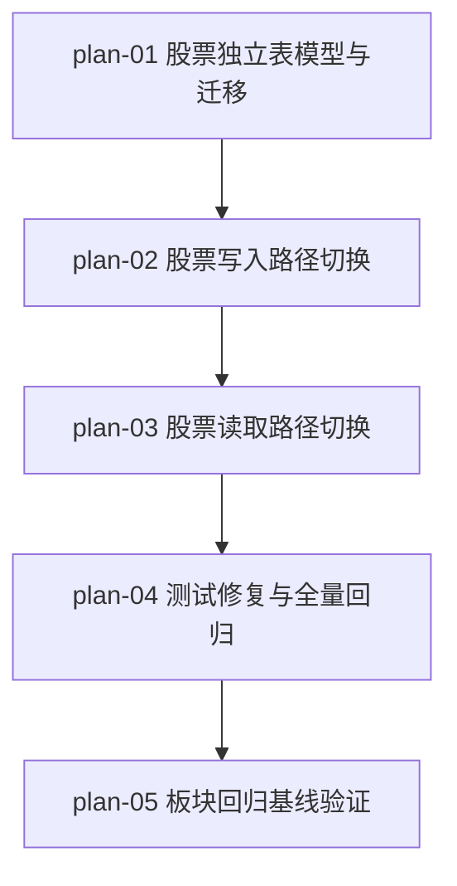

# 实现计划：股票数据独立建表

## 1. 概览

- **项目**: 股票数据独立建表
- **来源架构**: docs/12-股票数据独立建表/12-1-架构文档-股票数据独立建表.md
- **组织方式**: 功能维度（Feature-based）
- **项目类型**: brownfield（既有系统的数据存储层改造）
- **技术栈**: Python 3 + FastAPI + SQLAlchemy（异步）+ Alembic + PostgreSQL；前端 Next.js（本期零改动）
- **总阶段数**: 4
- **总功能数**: 5
- **最大并行度**: 1（严格串行依赖：模型 → 写 → 读 → 测试 → 板块回归）
- **关键路径**: plan-01 → plan-02 → plan-03 → plan-04 → plan-05

## 2. 输入摘要

### 2.1 核心闭环与目标

把股票的行情/均线/强度三类时序数据从与板块共用的三张表（`daily_market_data` / `moving_average_data` / `strength_scores`）拆出为独立的股票表（`stock_daily_market_data` / `stock_moving_average_data` / `stock_strength_scores`）。板块继续使用原表，代码完全不动；股票读写路径整体切换到新表，旧股票数据留在原表不迁移、不读取。

核心闭环锚点：**Collect → Write(new) → Read(new)**。

### 2.2 关键 ADR 与实施护栏

| ADR | 护栏意义 |
|---|---|
| ADR-1 物理拆表 | 新表必须真实物理独立，不得与旧表共享约束名 |
| ADR-2 旧数据不迁移 | 读路径**禁止** union 新旧表，只读新表 |
| ADR-3 字段裁剪 | **必须保留 percentile 列**（模型未定义但 ranking_service.py:91 setattr + strength_snapshot_service.py:342/363 写库，DB 必须有列）；个股死字段（ma5_score 等）照搬 |
| ADR-4 共享工具内部分发 | ma_data_loader / ranking_service / strength_service_v2 等保持外部签名不变，按 entity_type 内部分发模型类；**板块分支零改动作为门禁** |
| ADR-5 写入策略保持现状 | 不借机统一写入策略（行情 pg_insert / 均线 read-modify-write / 强度逐条 commit 各自照搬） |
| ADR-6 alembic 手写迁移 | 手写 op.create_table，不用 autogenerate（避免噪音） |

### 2.3 现有代码快照

- 当前三张共用表模型：`server/src/models/{daily_market_data,moving_average_data,strength_score}.py`，靠 `entity_type` + `entity_id` 软外键
- 当前 alembic head：`687ec547d98e`（新迁移 down_revision 指向它）
- 共享工具方法现状：`ma_data_loader.load_ma_values/load_current_price` 用 `entity_type` 参数 where；`ranking_service.calculate_rankings` 用 `for entity_type in entity_types` 循环；`strength_service_v2._save_strength_score` 用 entity_type 参数透传到 StrengthScore 字段
- 前端零依赖 entity_type（web/src 全量 grep 0 命中）

### 2.4 架构约束

- 旧表（板块用）结构与数据完全不动
- API 响应字段名、类型、结构、包裹方式保持不变
- 缓存 key 命名不变（含 entity_type 段）
- 不激活死代码 Repository 层、不为股票新增 task handler、不重设字段语义

## 3. 验收标准追踪矩阵

| AC-ID | 需求原文 | 架构承接 | 计划承接 | 验证方式 | 当前状态 |
|---|---|---|---|---|---|
| AC-01 | 股票数据彻底分开：新采集个股数据落入新存储，原存储不再新增个股记录 | collector 股票分支 + 新表模型 | plan-01, plan-02 | plan-02 §5（采集后 SELECT count 新表 + 旧表无新增） | todo |
| AC-02 | 个股读取动作切换：个股接口返回数据来源于新存储 | ma_data_loader / stock_ma_service / strength_service_v2 / stocks.py / rankings.py | plan-03 | plan-03 §5（个股接口返回新表数据） | todo |
| AC-03 | 板块功能零回归 | 全部板块 service + sectors.py | plan-05 | plan-05 §5（板块全功能 e2e + 单测零回归） | todo |
| AC-04 | 随个股删除清理数据 | data_init._cascade_delete_stock_data | plan-02 | plan-02 §5（级联删除测试新三表清理 + 板块数据不动） | todo |
| AC-05 | 字段语义收敛 | 三张新表模型定义 | plan-01 | plan-01 §5（新表无 entity_type/period/板块字段，含 percentile） | todo |
| AC-06 | 对外接口约定不变 | stocks.py / rankings.py / strength.py + api/schemas/strength.py | plan-03, plan-04 | plan-04 §5（接口响应字段 diff 为空） | todo |
| AC-07 | 长周期指标空窗期呈现 | ma_data_loader / stock_ma_service | plan-03 | plan-03 §5（ma240 缺失时返回空，呈现"数据不足"） | todo |

## 4. 模块地图

按功能聚合展示：

| 功能 | 包含模块 | 类型 | 对应文件 |
|---|---|---|---|
| plan-01 | 新表模型层（StockDailyMarketData / StockMovingAverageData / StockStrengthScore）+ alembic 迁移 | service | plan-01-股票独立表模型与迁移.md |
| plan-02 | collector 股票分支 / DataInitService 股票路径 / DataUpdateService 股票路径 / StockMAService / StrengthServiceV2 个股分支 / data_quality 个股分支 | service | plan-02-股票写入路径切换.md |
| plan-03 | MADataLoader / RankingService / StrengthHistoryService / StrengthSnapshotService / data_quality 读分支 / API 股票端点 | service | plan-03-股票读取路径切换.md |
| plan-04 | 受影响测试修复 + 全量 pytest | service | plan-04-测试修复与全量回归.md |
| plan-05 | 板块全部模块（回归基线） | service | plan-05-板块回归基线验证.md |

## 5. 依赖图



节点使用 plan-ID 标识。严格串行：模型必须先于写，写必须先于读，读必须先于测试，测试必须先于板块回归基线。

## 6. 阶段摘要

| 阶段 | 功能 | 验证目标 |
|---|---|---|
| Phase A | plan-01 | `alembic upgrade head` 成功；新模型测试通过；旧表零影响 |
| Phase B | plan-02 | 触发股票采集后数据落入新表（AC-01）；级联删除正确（AC-04） |
| Phase C | plan-03 | 个股接口返回新表数据（AC-02）；空窗期呈现正确（AC-07） |
| Phase D | plan-04 + plan-05 | 全量 pytest 通过（AC-06）；板块全功能零回归（AC-03） |

## 7. 任务总览

| 功能 | 阶段 | 包含维度 | 依赖 | 独立验收标准 |
|---|---|---|---|---|
| plan-01 股票独立表模型与迁移 | A | backend | [] | 三新模型字段正确含 percentile；alembic upgrade/downgrade 可逆 |
| plan-02 股票写入路径切换 | B | backend | [plan-01] | 采集入库落新表；级联删除清新三表 |
| plan-03 股票读取路径切换 | C | backend | [plan-02] | 个股接口返回新表数据；空窗期呈现 |
| plan-04 测试修复与全量回归 | D | backend | [plan-03] | 全量 pytest 通过；接口响应字段不变 |
| plan-05 板块回归基线验证 | D | backend | [plan-04] | 板块全功能零回归 |

### 7.2 开发状态机

> 本需求为纯后端数据存储层改造，无前端 Playwright 改动（AC-06 已确认前端零依赖）。red/green 证据对应 pytest 失败/通过的证据文件。plan-01（DDL/模型层）按其声明 E2E 不适用，直接走 implement + task-review。

| FEAT | 当前步骤 | red_e2e | implement | green_e2e | review | 最近证据 | 阻塞原因 | 更新时间 |
| --- | --- | --- | --- | --- | --- | --- | --- | --- |
| plan-01 | done | waived | done | waived | done | reviews/plan-01-review-2026-07-07.md（通过） | - | 2026-07-07 |
| plan-02 | done | done | done | done | done | reviews/plan-02-review-2026-07-07.md（通过；板块 57/57 零回归） | - | 2026-07-07 |
| plan-03 | done | done | done | done | done | reviews/plan-03-review-2026-07-07.md（通过；板块 57/57 零回归） | - | 2026-07-07 |
| plan-04 | done | done | done | done | done | reviews/plan-04-review-2026-07-07.md（通过；新表切换失败已修复，剩 12 既有失败非本期） | - | 2026-07-07 |
| plan-05 | done | done | done | done | done | reviews/plan-05-review-2026-07-07.md（通过；板块 7 文件零改动 + 125 测试零回归） | - | 2026-07-07 |

## 8. 未决策项

无。所有架构决策已确定（架构文档 §5.x 待确认问题已清空）。

## 9. 执行前置

### 9.1 环境准备

- PostgreSQL 服务可用，`sector_strength` 数据库可连接
- Python 虚拟环境：`cd server && source .venv/bin/activate`
- alembic 当前 head 为 `687ec547d98e`（`alembic current` 确认）
- 既有板块数据存在于旧三表（作为回归基线）

### 9.2 执行顺序

严格串行执行 plan-01 → plan-02 → plan-03 → plan-04 → plan-05。每个功能 task-review 通过后才能开始下一个。

### 9.3 全局验证

所有功能完成后执行：

```bash
cd server
# 1. 迁移可逆性
alembic upgrade head && alembic downgrade -1 && alembic upgrade head
# 2. 全量测试
pytest
# 3. 接口契约核对（手动）
# - 调用个股相关 API，对比改造前后响应字段
# - 调用板块相关 API，确认行为完全不变
```

## 10. 变更记录

| 日期 | 变更类型 | 功能 | 说明 |
|---|---|---|---|
| 2026-07-07 | 初始化 | 全部 | 基于 12-1 架构文档首次生成实现计划 |

<!-- 保留目录：reviews/。当 task-review、dev-plan-check 等开始运行时创建。 -->
