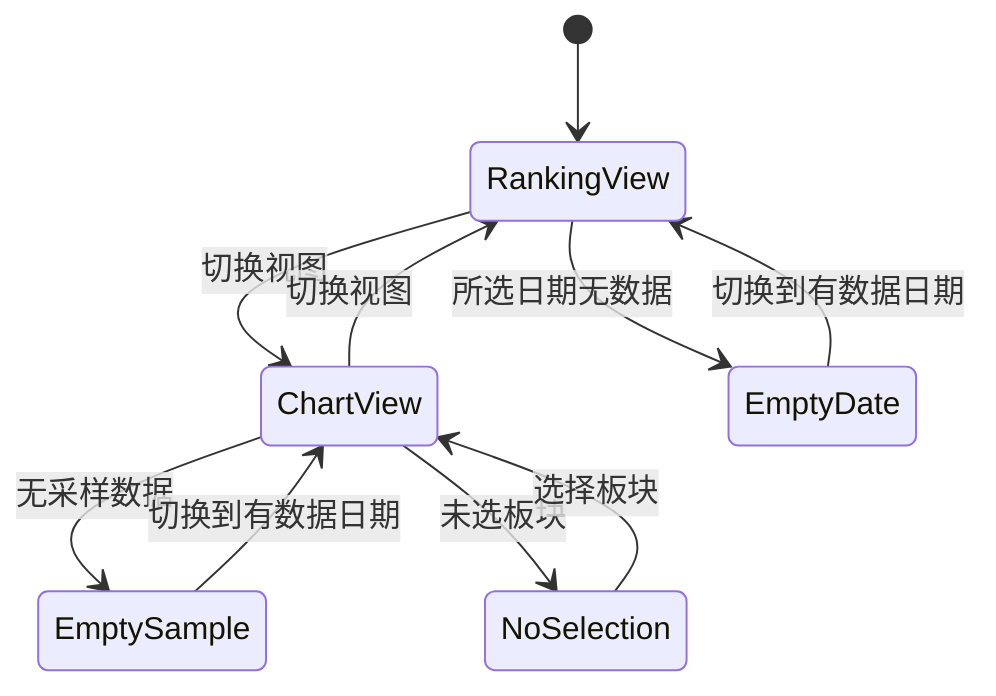

# 13-1 架构文档：板块资金流

_本文件只保留当前版本真正影响实现的架构决策、边界和契约；DDL、目录树、环境变量、实施故事等内容默认不放入正文。_

## 1. 系统摘要

接入同花顺板块资金流数据，提供两个互补视图：当日资金流排行表（看结果）与盘中资金流变化曲线（看过程）。核心闭环：**采集 → 入库 → 查询 → 双视图渲染**。交易时段每 1 分钟全板块采样构建变化曲线，收盘定稿保存当日最终值，前端独立页面按净额排序展示排行、按自选板块叠加展示盘中净额变化。

## 2. 范围、非目标与成功标准

### 2.1 范围

1. 同花顺板块资金流采集器：封装 `stock_fund_flow_industry(symbol="即时")` / `stock_fund_flow_concept(symbol="即时")`，含限流与重试。
2. 资金流数据落库：行业/概念两个维度、每个采样点带时间戳，交易时段每 1 分钟采样、收盘定稿。
3. 采集编排：接入 collector 的每日更新链路，新增定时采样任务（遵循项目"注释注册"惯例），新增管理员手动触发入口。
4. 资金流排行查询 API：行业/概念维度切换、按净额/流入/流出排序、日期切换、分页。
5. 盘中变化曲线查询 API：按板块名 + 日期返回净额时间序列。
6. 前端独立"板块资金流"页面：排行视图 + 变化曲线视图，视图切换、维度切换、日期切换、自选板块叠加、跳转强度页。

### 2.2 明确不做

- 跨日资金流历史趋势图（单日盘中变化已覆盖核心诉求，跨日趋势列入后续）。
- 在板块详情页内嵌资金流（本期为独立页面）。
- 地域维度资金流。
- 主力/超大单等分级资金流细分（数据源不提供）。
- 服务端推送式（WebSocket/SSE）自动刷新（曲线随用户手动刷新延长）。

### 2.3 成功标准

| 指标 | 首版目标 |
| --- | --- |
| 排行视图功能 | 行业/概念切换、净额/流入/流出排序、日期切换、分页均正常工作 |
| 变化曲线功能 | 自选板块叠加曲线正常绘制、刷新延长、无采样/未选板块空态正确 |
| 采集功能 | 交易时段每 1 分钟采样成功落库、收盘定稿、管理员手动触发可用 |
| 采集性能 | 单次全板块采样（约 476 板块）在 30 秒内完成 |
| 排行查询响应 | 单次查询（含分页）< 500ms |

### 2.4 验收标准承接矩阵

| AC-ID | PRD 原文摘要 | 承接模块 | 关键链路 / 状态 | 风险 / 降级说明 |
| --- | --- | --- | --- | --- |
| AC-01 | 从导航进入默认显示行业排行 | 前端页面 + 排行 API | 导航入口 → 排行视图默认态 | 库无数据时走排行空态 |
| AC-02 | 行业/概念维度切换 | 排行 API + 前端 | 维度参数切换重新加载 | 概念数据量更大 |
| AC-03 | 净额/流入/流出排序切换 | 排行 API | sort_by + order 参数 | 不可排序列忽略 |
| AC-04 | 切换日期查看历史排行 | 排行 API | trade_date 参数 | 无数据日期走空态 |
| AC-05 | 切换到盘中变化视图 | 前端页面 + 曲线 API | 视图切换 + 未选板块引导态 | 无采样数据走曲线空态 |
| AC-06 | 选板块叠加净额曲线 | 曲线 API + 前端 | sector_names 参数 → 时间序列叠加 | 板块名无匹配则该线无数据 |
| AC-07 | 盘中刷新曲线延长 | 曲线 API | 手动刷新重新拉取 | 依赖采样持续进行 |
| AC-08 | 无采样数据与历史回看 | 曲线 API | 空态判定 + 历史日期序列 | 非交易日无采样 |
| AC-09 | 加载失败可重试 | 前端 + 两个 API | 错误态 + 重试 | 两视图独立降级 |
| AC-10 | 板块名跳转强度页 | 前端 + 名称匹配 | name→sector 查询匹配 | 不匹配则不可点 |
| AC-11 | 管理员手动触发采集 | admin API + 采集器 | AsyncTask + 采集器 | 并发保护 |
| AC-12 | 分页浏览 | 排行 API + 前端 | page/page_size | 滚动到顶部 |

## 3. 用户流程与状态

### 3.1 主流程

1. 用户从主导航进入"板块资金流"页面。
2. 默认进入"资金流排行"视图、"行业"维度，看到当日（或最新有数据日）净额降序排行表。
3. 用户可：切换行业/概念维度、切换净额/流入/流出排序、切换日期、翻页。
4. 用户切换到"盘中变化"视图，从板块选择区勾选要对比的板块，曲线叠加显示净额变化。
5. 盘中查看时用户点击"刷新"，曲线延长。
6. 回到排行视图，点击可匹配的板块名称，跳转到该板块强度分析详情页。

### 3.2 关键分支

| 分支名 | 入口/触发条件 | 架构处理方式 |
| --- | --- | --- |
| 排行日期无数据 | 选择无采样数据的日期 | 排行 API 返回 has_data=false，前端渲染空态 |
| 曲线无采样数据 | 变化视图所选日期无采样 | 曲线 API 返回空序列，前端渲染曲线空态 |
| 曲线未选板块 | 进入变化视图未勾选板块 | 前端本地状态判定，渲染"请选择板块"引导，不请求 API |
| 板块名不匹配 | 名称与 sectors 表无法 JOIN | 排行 API 返回 sector_id=null，前端该名称不可点击 |
| 采集失败 | 同花顺接口不可用 | 采集器重试耗尽后记录日志，页面已有数据不受影响 |

### 3.3 状态机

页面级视图状态（不涉及后端持久化任务状态）：



关键规则：视图切换保留维度与日期选择；维度切换保留视图与排序；变化视图的已选板块在维度切换后若新维度无该板块则移除。

## 4. 系统上下文与模块职责

### 4.1 系统上下文

外部依赖：同花顺板块资金流接口（经 akshare 调用）。数据流向：同花顺 → 采集器 → 资金流表 → 查询 API → 前端双视图。资金流页面不依赖现有 tushare 数据源，是独立的 akshare 能力；但板块名称匹配需读取现有 sectors 表（只读 JOIN）。

变更点：新增资金流表、新增采集器、新增 2 个查询 API、新增 1 个 admin 触发端点、新增前端页面。不改造现有数据源抽象层（DataSourceFactory 保持只接受 tushare）。

### 4.2 模块职责

| 模块名 | 职责 | 上游输入 | 下游输出 |
| --- | --- | --- | --- |
| 资金流采集器 `AkshareFundFlowFetcher` | 封装同花顺即时接口调用，限流+重试，返回标准化板块资金流列表 | 同花顺 API | `SectorFundFlowInfo` 列表 |
| 采集编排 `DataCollector._update_sector_fund_flow` | 调采集器取行业+概念数据，upsert 到资金流表 | 采集器 | 资金流表记录 |
| 资金流服务 `SectorFundFlowService` | 排行查询（维度/排序/日期/分页+名称匹配）、曲线查询（板块名+日期→时间序列） | 资金流表 + sectors 表 | 排行结果 dict / 曲线序列 |
| 排行 API `sector_fund_flow.py` | GET 排行、GET 曲线、GET 最新日期 | 服务层 | camelCase 响应 |
| admin 触发端点 | 创建资金流采集 AsyncTask | 管理员请求 | task_id |
| 前端模块 `sector-fund-flow` 页面+`useSectorFundFlow` hook | 双视图渲染、维度/排序/日期/板块选择交互、SWR 数据获取（排行+曲线）、跳转 | 查询 API | 用户界面 |

**复用声明与可行性验证**：
- **重试/限流范式**：复用 `tushare_client._execute_with_retry`（src/services/data_acquisition/tushare_client.py:100）的"限流+指数退避+不可恢复关键词短路"思路。验证：该方法针对 tushare 设计但模式通用，资金流采集器新建独立实例不耦合 tushare 配置。
- **落库 upsert 范式**：复用 `collector._update_market_data`（src/services/data_updater/collector.py:218）的 `pg_insert(...).on_conflict_do_nothing(constraint=...)`。验证：现有范式按唯一约束去重，资金流表用 `(trade_date, sample_time, sector_type, sector_name)` 唯一约束，upsert 改用 `on_conflict_do_update`（盘中同一采样点重采需覆盖最新值）。
- **admin 触发范式**：复用 `init_funds.py` 的 AsyncTask + TaskManager + require_admin + 并发保护（src/api/admin/init_funds.py）。验证：新增 `SYNC_SECTOR_FUND_FLOW` 到 `TaskType` 枚举（src/services/task_handlers.py:28），注册对应 handler。
- **camelCase 响应范式**：复用 `fund_crowd_analysis.py` 的 `_dict_to_camel` + `to_camel`（src/api/v1/fund_crowd_analysis.py:104）。验证：响应 `{success, data}` 包裹，data 内 camelCase。
- **前端 SWR hook 范式**：复用 `useFundCrowdAnalysis.ts`（web/src/hooks/）。验证：SWR 数组 key + apiClient（baseURL 含 /api/v1）+ `.then(res=>res.data)` 解包。
- **板块名匹配**：服务层查询时 LEFT JOIN sectors 表（按 name 字段），匹配上返回 sector.id 供前端跳转。验证：sectors.name 为 String(100) 有索引（src/models/sector.py:12），同花顺板块名可直接 JOIN。

### 4.3 需要刻意避免的过度设计

- **不把 akshare 设为全局数据源**：资金流采集器是独立 fetcher，不改 DataSourceFactory.VALID_TYPES（保持只接受 tushare）。资金流是单一能力，无需完整数据源抽象。
- **不为资金流建独立 Repository 基类**：查询直接在 service 层用 SQLAlchemy，不复刻 BaseRepository 泛型（资金流只有 2 种查询场景）。
- **不引入缓存层**：资金流排行/曲线查询是直接的表查询，数据量可控，无需 L1/L2 缓存（区别于 fund_crowd 的高频 CPU 密集聚合）。
- **不引入消息队列/Worker**：采集是同步轮询型任务，APScheduler + AsyncTask 已够，无需 Redis/Queue。
- **不为采样数据建独立聚合表**：变化曲线直接从原始采样表按时间排序查询，11 万条/天的量级 PostgreSQL 直接处理，无需预聚合。

## 5. 关键架构决策（ADR）

### ADR-1：资金流采集器作为独立 fetcher，不扩展数据源抽象层
- **选择**：新建 `AkshareFundFlowFetcher`，只封装同花顺 2 个接口，不复用 BaseDataSource，不改 DataSourceFactory。
- **理由**：项目已从 akshare 迁到 tushare，资金流是 tushare 不提供的单一补充能力。扩展 BaseDataSource 需实现 7 个抽象方法且与"已迁移"现状相悖，过重。
- **风险与对策**：采集器与 tushare_client 风格不统一。对策：复用其 `_execute_with_retry` 限流/重试模式，保持错误处理范式一致。

### ADR-2：盘中采样与收盘定稿存同一张表，用 sample_time 区分
- **选择**：单一 `sector_fund_flow` 表，每条记录含 `trade_date`（交易日）+ `sample_time`（采样时刻）。盘中每次采样插入新记录（不同 sample_time），收盘定稿即最后一次采样。
- **理由**：盘中曲线需要每个采样点的净额时间序列，每点独立成行最直接。分两张表（盘中表+定稿表）增加同步复杂度且无收益。
- **风险与对策**：数据量大（约 11 万条/天）。对策：按 `(trade_date, sector_type)` 分区或索引；历史数据可定期归档。曲线查询按 `(trade_date, sector_name)` 走索引。

### ADR-3：每 1 分钟全板块采样
- **选择**：交易时段 9:30-15:00 每 1 分钟采样一次，每次采行业(90)+概念(386)全部板块。
- **理由**：1 分钟粒度曲线足够平滑；全板块保证事后任意板块可画曲线。已实测高频调用同花顺即时接口稳定无风控（连续 5 次 2 秒间隔全部成功）。
- **风险与对策**：数据增长快。对策：索引优化 + 定期归档；若存储压力大可后续降为 2-3 分钟或仅采前 N。

### ADR-4：排行与曲线分两个 API 端点
- **选择**：`GET /sector-fund-flow/rankings`（排行）+ `GET /sector-fund-flow/timeseries`（曲线）+ `GET /sector-fund-flow/latest-date`（最新日期）。
- **理由**：两个视图数据形态完全不同（排行是某日快照列表、曲线是某板块时间序列），合并会导致响应臃肿且前端无法独立刷新。
- **演进余地**：若后续要合并视图，可在服务层聚合。

### ADR-5：板块按名称 LEFT JOIN sectors 表做松关联
- **选择**：排行查询时 LEFT JOIN sectors ON name 匹配，匹配上返回 sector_id 供跳转，不匹配 sector_id=null。
- **理由**：同花顺与 tushare 板块命名体系不同，强制精确匹配会大量丢数据。松关联最大化展示且不阻塞。
- **风险与对策**：命名差异导致部分不可跳转。对策：PRD 已明确"不匹配则不可点击"，体验可接受。

### ADR-6：定时任务遵循项目"注释注册"惯例
- **选择**：在 job_manager 新增资金流采样任务方法，但按现有惯例注释注册（当前所有 job 都注释停用），以管理员手动触发 + collector 每日更新为主要落地路径。
- **理由**：项目所有定时任务当前都处于注释停用状态（开发期间），资金流任务应保持一致，避免开发期间后台自动执行。
- **演进余地**：上线时统一取消注释启用。

### ADR-7：资金流数值用 Numeric 存储与传输，序列化为 float
- **选择**：表字段用 `Numeric(15,2)` 存储资金额（亿元），API 响应经 `_serialize_value` 转 float。
- **理由**：资金额需要精度但前端图表消费 float；沿用项目 fund_crowd 的 `_serialize_value` Decimal→float 范式。
- **风险与对策**：float 精度。对策：亿元单位下两位小数，float 精度足够。

### 5.x 待确认问题

无。

## 6. 运行链路

### 6.1 资金流采集链路（盘中采样 / 收盘定稿 / 手动触发）

1. 触发源：APScheduler 盘中定时任务（注释停用）/ 管理员手动触发（admin API 创建 AsyncTask）/ collector 每日更新。
2. `AkshareFundFlowFetcher.fetch(sector_type="industry")` 调 `stock_fund_flow_industry(symbol="即时")`，限流+重试，返回行业板块资金流列表。
3. 同样 `fetch(sector_type="concept")` 取概念板块。
4. 采集编排遍历返回列表，为每条数据标记 `trade_date`（当日）+ `sample_time`（当前时刻）+ `sector_type`。
5. 批量 upsert 到 `sector_fund_flow` 表：`pg_insert.on_conflict_do_update`，冲突键 `(trade_date, sample_time, sector_type, sector_name)`，冲突时用最新值覆盖。
6. 记录采集日志（板块数、耗时）。

这条链路的实现原则：
- 采集器内部复用 tushare_client 的 `_execute_with_retry` 模式：限流（API_INTERVAL）+ 指数退避 + 不可恢复关键词短路。同花顺不可恢复关键词至少包含空数据类异常。
- 行业与概念两次调用之间强制 sleep，避免连续请求触发风控。
- `sample_time` 精度到分钟（秒/微秒置零），保证同一分钟内重采覆盖而非新增。
- 收盘定稿：15:00 后的最后一次定时/手动触发即为定稿，无需特殊标记（曲线查询取当日所有采样点，定稿值即末点）。

### 6.2 排行查询链路

1. 前端请求 `GET /sector-fund-flow/rankings?sector_type=&trade_date=&sort_by=&order=&page=&page_size=`。
2. 服务层取该 trade_date + sector_type 下，每个 sector_name 的**最新采样点**（子查询取 max(sample_time) 对应行）。
3. LEFT JOIN sectors ON name 匹配，取 sector.id。
4. 按 sort_by（net_inflow/inflow/outflow）+ order（desc/asc）排序。
5. 分页（LIMIT/OFFSET，默认 page=1, page_size=20）。
6. 返回 `{has_data, trade_date, items[], total, page, page_size}`，camelCase。

实现原则：
- "最新采样点"用窗口函数或子查询 `WHERE (trade_date, sector_type, sector_name, sample_time) IN (SELECT ..., MAX(sample_time) ...)`，保证排行反映当日最新资金状态。
- 名称匹配用 sectors.name 精确匹配（同花顺与 tushare 命名差异是已知约束，不模糊匹配）。

### 6.3 曲线查询链路

1. 前端请求 `GET /sector-fund-flow/timeseries?sector_names=&sector_type=&trade_date=`（sector_names 逗号分隔）。
2. 服务层取该 trade_date + sector_type + sector_names 下，所有采样点（按 sample_time 升序）。
3. 按 sector_name 分组，每组返回 `[{sample_time, net_inflow}]` 时间序列。
4. 返回 `{has_data, trade_date, series: [{sector_name, data: [{sample_time, net_inflow}]}]}`，camelCase。

实现原则：
- 单板块单日约 240 个采样点，多板块叠加（用户自选，通常 ≤10）查询量可控。
- 无采样数据返回 has_data=false + 空 series，前端走曲线空态。

## 7. 领域对象与关键契约

### 7.1 核心对象

| 对象名 | Source of Truth | Owner | 用途 |
| --- | --- | --- | --- |
| SectorFundFlow（资金流采样记录） | sector_fund_flow 表 | 采集器写入 / 服务层查询 | 排行与曲线的数据源 |
| Sector（现有板块） | sectors 表（只读） | tushare 同步 | 名称匹配供跳转 |

### 7.2 推荐最小 Schema

存储字段视角（ORM，snake_case）：

```typescript
// sector_fund_flow 表（存储视角）
interface SectorFundFlowRecord {
  id: number
  trade_date: string        // YYYY-MM-DD 交易日
  sample_time: string       // ISO 采样时刻，精度到分钟
  sector_type: string       // 'industry' | 'concept'
  sector_name: string       // 板块名（同花顺原始名）
  sector_index: number | null   // 行业指数
  change_percent: number | null // 板块涨跌幅
  inflow: number | null     // 流入资金（亿元）
  outflow: number | null    // 流出资金（亿元）
  net_inflow: number | null // 净额（亿元）
  company_count: number | null
  leading_stock: string | null      // 领涨股
  leading_stock_change: number | null // 领涨股涨跌幅
  current_price: number | null
}
```

API 响应输出视角（经 to_camel，camelCase）：

```typescript
// 排行响应
interface FundFlowRankingsData {
  hasData: boolean
  tradeDate: string | null
  items: FundFlowRankingItem[]
  total: number
  page: number
  pageSize: number
}
interface FundFlowRankingItem {
  rank: number
  sectorName: string
  sectorId: number | null   // 匹配上 sectors 表才有，供跳转；null 则不可点
  changePercent: number | null
  inflow: number | null
  outflow: number | null
  netInflow: number | null
  companyCount: number | null
  leadingStock: string | null
  leadingStockChange: number | null
  currentPrice: number | null
}

// 曲线响应
interface FundFlowTimeseriesData {
  hasData: boolean
  tradeDate: string | null
  series: FundFlowSeriesItem[]
}
interface FundFlowSeriesItem {
  sectorName: string
  data: { sampleTime: string; netInflow: number | null }[]
}
```

### 7.3 API 边界

| 接口路径 | 方法 | 用途 | 对应交互 | 关键参数 |
| --- | --- | --- | --- | --- |
| `/api/v1/sector-fund-flow/rankings` | GET | 资金流排行 | AC-01/02/03/04/12 排行视图 | sector_type, trade_date, sort_by(net_inflow/inflow/outflow), order(desc/asc), page(默认1), page_size(默认20) |
| `/api/v1/sector-fund-flow/timeseries` | GET | 盘中变化曲线 | AC-06/07/08 变化视图 | sector_names(逗号分隔), sector_type, trade_date |
| `/api/v1/sector-fund-flow/latest-date` | GET | 最新有数据交易日 | 日期选择器默认定位 | sector_type |
| `/api/v1/admin/init/sector-fund-flow` | POST | 管理员手动触发采集 | AC-11 | 无（require_admin） |

API 契约约定（对齐既有代码）：
- **响应包裹**：`{ success: boolean, data: <业务对象> }`，与 fund_crowd_analysis 一致。
- **命名转换边界**：响应体 camelCase（经 `_dict_to_camel`），query 参数 snake_case（sector_type/trade_date/sort_by/page_size），与 fundCrowdAnalysisApi 一致。
- **序列化**：日期→ISO 字符串，Numeric→float（经 `_serialize_value`），与 fund_crowd 一致。
- **路径前缀**：业务端点挂 `/api/v1/sector-fund-flow`（v1 主路由），admin 端点挂 `/api/v1/admin/init/sector-fund-flow`（admin 路由，require_admin），与 init_funds.py 一致。
- **认证**：业务 GET 端点用 `Depends(get_current_user)`（普通登录用户），admin POST 用 `Depends(require_admin)`，与 fund_crowd / init_funds 一致。
- **admin 触发**：创建 `SYNC_SECTOR_FUND_FLOW` 类型 AsyncTask（TaskType 枚举新增成员），并发保护查重，返回 task_id，与 init_funds 完全一致。
- **admin 路由挂载**：admin 路由实际挂载前缀为 `/api/v1/admin`（src/api/router.py:29），新端点文件 init_sector_fund_flow.py 的 router prefix 为 `/init`（与 init_funds.py 一致），需在 `src/api/admin/__init__.py` 的 `router.include_router(init_sector_fund_flow_router)` 注册（init_funds 同位置注册，见 src/api/admin/__init__.py:31）。完整路径为 `/api/v1/admin/init/sector-fund-flow`。

### 7.4 状态流转

无后端持久化任务状态（采集是即时完成的同步操作，不似持仓同步有长耗时）。AsyncTask 仅用于手动触发的并发保护与日志记录。

### 7.5 数据边界

| 存储层 | 职责 |
| --- | --- |
| sector_fund_flow 表 | 所有板块资金流采样数据，排行与曲线的唯一数据源 |
| sectors 表（只读） | 名称匹配供跳转，资金流功能不写入此表 |
| 前端本地状态 | 当前视图、维度、排序、日期、已选板块（用户操作态，不入库） |

### 7.6 命名与标识规则

- **ID 策略**：资金流表自增 id；sector_id 复用 sectors.id。
- **JSON 命名**：响应 camelCase，query snake_case。
- **术语映射**：全文档统一用"净额"(net_inflow/netInflow)、"流入资金"(inflow)、"流出资金"(outflow)；前端 UI 文案"净额"。
- **sector_type 值**：`industry`（行业）/ `concept`（概念），与项目 SECTOR_TYPES 常量对齐（排除 region）。

## 8. 非功能需求、风险与运行策略

### 8.1 性能与吞吐量目标

| 指标 | 目标 | 预期并发 |
| --- | --- | --- |
| 单次全板块采样耗时 | < 30s（行业+概念两次调用 + 落库） | 单次（盘中定时） |
| 排行查询响应 | < 500ms | 低并发（单用户浏览） |
| 曲线查询响应 | < 500ms（10 板块 × 240 点） | 低并发 |

### 8.2 可靠性、错误处理与降级策略

| 降级级别 | 触发条件 | 系统行为 |
| --- | --- | --- |
| L1（最轻） | 单次采样部分板块失败 | 成功部分落库，失败部分跳过，日志记录 |
| L2 | 单次采样整体失败（接口不可用） | 重试耗尽后记录日志，不影响已有数据与页面展示 |
| L3 | 同花顺接口长期不可用 | 页面展示历史已有数据，排行/曲线用最近有数据日 |
| L4 | 库中完全无数据 | 页面空态文案，引导管理员触发采集 |

### 8.3 安全与反滥用策略

| 项目 | 首版策略 |
| --- | --- |
| API 鉴权 | 业务 GET 需登录用户，admin 触发需管理员 |
| 外部接口调用 | 服务端发起，不暴露 akshare 配置到前端 |
| 采集频率 | 定时 1 分钟，避免高频触发风控 |

### 8.4 成本控制预期

| 模块 | 预估单次成本 | 首版控制策略 |
| --- | --- | --- |
| 同花顺接口调用 | 免费（爬虫型，无按量计费） | 限流 + 重试上限，避免被风控封禁 |
| 数据库存储 | 约 11 万条/天 | 索引优化，定期归档历史采样 |

### 8.5 可观测性

- 采集日志：每次采样记录板块数、成功/失败数、耗时（沿用 collector 日志风格）。
- admin 触发：AsyncTask 记录执行状态与日志。
- 接口错误：标准 logger 异常记录。

### 8.6 主要风险

| 风险 | 影响 | 缓解方式 |
| --- | --- | --- |
| 同花顺接口被风控/改版 | 采集中断 | 重试 + 降级展示历史数据；监控采集失败率 |
| 板块命名差异大 | 部分板块不可跳转 | PRD 已接受松关联；后续可补名称映射表 |
| 采样数据量增长 | 存储与查询压力 | 索引优化；定期归档；必要时降频 |
| py_mini_racer 兼容 | 同花顺接口 JS 解析失败 | 已升级至 mini-racer 0.14.1（arm64 平台 wheel） |

## 9. 实施方案

### Phase A：数据层与采集

**后端**

1. `server/src/models/sector_fund_flow.py` — 新建 `SectorFundFlow` ORM 模型，字段见 7.2，唯一约束 `(trade_date, sample_time, sector_type, sector_name)`，索引 `(trade_date, sector_type)` + `(trade_date, sector_type, sector_name, sample_time)`。
2. `server/src/models/__init__.py` — 注册导出 `SectorFundFlow`。
3. `server/alembic/versions/` — 新建迁移建 `sector_fund_flow` 表（仿 `997425b1a9a8_add_fund_tables.py`）。
4. `server/src/services/data_acquisition/akshare_fund_flow.py` — 新建 `AkshareFundFlowFetcher`，封装行业/概念即时接口，复用 `_execute_with_retry` 模式（限流+退避+不可恢复关键词），返回标准化 pydantic `SectorFundFlowInfo` 列表。
5. `server/src/services/data_updater/collector.py` — 新增 `_update_sector_fund_flow()` 方法（调采集器 → 标记 trade_date/sample_time/sector_type → `pg_insert.on_conflict_do_update` 批量 upsert），编入 `run_daily_update()`。
6. `server/src/services/task_handlers.py` — `TaskType` 新增 `SYNC_SECTOR_FUND_FLOW`，注册对应 handler 调 `_update_sector_fund_flow()`。
7. `server/src/services/scheduler/job_manager.py` — 新增 `_sector_fund_flow_snapshot()` 方法（盘中每 1 分钟采样），按惯例注释注册。
8. `server/requirements.txt` — 新增 `akshare>=1.18.75`。

验证目标：手动调 `_update_sector_fund_flow()` 能成功采集行业+概念数据并落库；脚本 `server/scripts/test_fund_flow.py` 验证 fetcher → 落库链路。

### Phase B：查询 API

**后端**

9. `server/src/services/sector_fund_flow_service.py` — 新建 `SectorFundFlowService`，实现 `get_rankings()`（最新采样点子查询 + LEFT JOIN sectors + 排序 + 分页）、`get_timeseries()`（按板块名分组时间序列）、`get_latest_date()`。
10. `server/src/api/v1/sector_fund_flow.py` — 新建路由，GET `/rankings`、`/timeseries`、`/latest-date`，复用 `_dict_to_camel` + `_serialize_value`，`{success, data}` 包裹，`get_current_user` 认证。
11. `server/src/api/v1/__init__.py` — 注册 sector_fund_flow_router。
12. `server/src/api/admin/init_sector_fund_flow.py` — 新建 admin 触发端点（AsyncTask + require_admin + 并发保护，仿 init_funds.py），并在 `server/src/api/admin/__init__.py` 注册 `router.include_router(init_sector_fund_flow_router)`（与 init_funds 同位置）。

验证目标：3 个业务 GET + 1 个 admin POST 可用，返回结构与 7.2 Schema 一致。

### Phase C：前端

**前端**

13. `web/src/lib/api.ts` — 新增 `sectorFundFlowApi`（getRankings/getTimeseries/getLatestDate），类型定义 `FundFlowRankingItem` / `FundFlowTimeseriesData` 等。
14. `web/src/hooks/useSectorFundFlow.ts` — 新建 SWR hooks（useFundFlowRankings / useFundFlowTimeseries / useFundFlowLatestDate），仿 useFundCrowdAnalysis.ts。
15. `web/src/app/dashboard/sector-fund-flow/page.tsx` — 新建页面，双视图（排行/变化）、维度切换、日期切换、排序、分页、板块选择叠加、曲线图、空/错/载态、跳转强度页。
16. `web/src/components/dashboard/DashboardLayout.tsx` — 导航新增"板块资金流"入口（href `/dashboard/sector-fund-flow`，置于"板块分析"后）。

验证目标：页面双视图完整可用，覆盖 AC-01~AC-12 所有交互；曲线叠加、刷新延长、空态引导正确。

## 10. 架构结论

首版采用"独立 fetcher + 单表采样 + 双查询 API + 双视图前端"的最小闭环，刻意不扩展数据源抽象层、不引入缓存/队列、不为资金流建 Repository 基类。核心判断：资金流是 tushare 不提供的单一补充能力，按独立模块实现最符合项目现状与演进成本。盘中 1 分钟全板块采样经实测可行（同花顺高频调用稳定），数据量（11 万条/天）在 PostgreSQL 索引优化下可控。主要演进方向：上线启用定时任务、积累数据后做跨日资金流趋势、必要时降频或归档。
