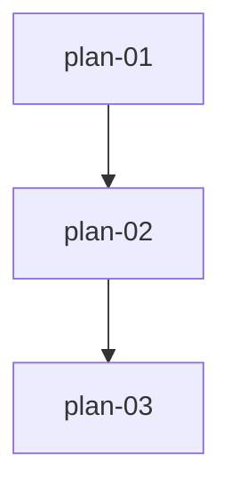

# 实现计划：板块资金流

## 1. 概览

- **项目**: 板块资金流（需求 13）
- **来源架构**: docs/13-板块资金流/13-1-架构文档-板块资金流.md
- **组织方式**: 功能维度（Feature-based）
- **项目类型**: brownfield
- **技术栈**: 后端 FastAPI + SQLAlchemy2.0(async) + Alembic + APScheduler + PostgreSQL；前端 Next.js(AppRouter) + TypeScript + Zustand + SWR + Tailwind
- **总阶段数**: 3
- **总功能数**: 3
- **最大并行度**: 1（严格串行依赖链 01→02→03）
- **关键路径**: plan-01 → plan-02 → plan-03

## 2. 输入摘要

### 2.1 核心闭环与目标

采集 → 入库 → 查询 → 双视图渲染。接入同花顺板块资金流，提供排行表（看结果）与盘中变化曲线（看过程）两个视图。

### 2.2 关键 ADR 与实施护栏

- ADR-1：资金流采集器作为独立 fetcher，不扩展 DataSourceFactory（保持只接受 tushare）
- ADR-2：盘中采样与收盘定稿存同一张表，sample_time 区分
- ADR-3：每 1 分钟全板块采样
- ADR-5：板块按名称 LEFT JOIN sectors 表松关联
- ADR-6：定时任务遵循"注释注册"惯例（开发期间停用）
- 护栏：不改造现有数据源抽象层；不引入缓存/队列；资金流表名 sector_fund_flow

### 2.3 现有代码快照

- 后端入口：server/src/api/v1/__init__.py（v1 主路由，prefix=/v1）
- admin 入口：server/src/api/admin/__init__.py（router.include_router 注册，主 router.py:29 挂 prefix=/v1/admin）
- 采集编排：server/src/services/data_updater/collector.py（_update_market_data 是 upsert 范式锚点）
- 任务处理：server/src/services/task_handlers.py（TaskType 枚举 + @TaskRegistry.register）
- 前端 API 客户端：web/src/lib/api.ts（apiClient.baseURL 含 /api/v1，endpoint 不带 /v1）
- 前端导航：web/src/components/dashboard/DashboardLayout.tsx（baseSidebarItems 数组）

### 2.4 架构约束

- 资金流表唯一约束 (trade_date, sample_time, sector_type, sector_name)，upsert 用 on_conflict_do_update
- 响应 {success, data} 包裹，data 内 camelCase（_dict_to_camel + _serialize_value）
- query 参数 snake_case（sector_type/trade_date/sort_by/page_size）
- 业务 GET 用 get_current_user，admin POST 用 require_admin

## 3. 验收标准追踪矩阵

| AC-ID | 需求原文 | 架构承接 | 计划承接 | 验证方式 | 当前状态 |
| --- | --- | --- | --- | --- | --- |
| AC-01 | 从导航进入默认显示行业排行 | 排行 API + 前端页面 | plan-02, plan-03 | plan-03 §5 排行视图 E2E | todo |
| AC-02 | 行业/概念维度切换 | 排行 API sector_type | plan-02, plan-03 | plan-03 §5 维度切换 | todo |
| AC-03 | 净额/流入/流出排序切换 | 排行 API sort_by/order | plan-02, plan-03 | plan-03 §5 排序切换 | todo |
| AC-04 | 切换日期查看历史排行 | 排行 API trade_date | plan-02, plan-03 | plan-03 §5 日期切换 | todo |
| AC-05 | 切换到盘中变化视图 | 前端视图切换 + 曲线 API | plan-03 | plan-03 §5 视图切换 | todo |
| AC-06 | 选板块叠加净额曲线 | 曲线 API sector_names | plan-02, plan-03 | plan-03 §5 板块叠加 | todo |
| AC-07 | 盘中刷新曲线延长 | 曲线 API 手动刷新 | plan-03 | plan-03 §5 刷新延长 | todo |
| AC-08 | 无采样数据与历史回看 | 曲线 API 空态判定 | plan-02, plan-03 | plan-03 §5 空态回看 | todo |
| AC-09 | 加载失败可重试 | 前端错误态 + 两 API | plan-03 | plan-03 §5 失败重试 | todo |
| AC-10 | 板块名跳转强度页 | 排行 API 名称匹配 sector_id | plan-02, plan-03 | plan-03 §5 跳转 | todo |
| AC-11 | 管理员手动触发采集 | admin API + AsyncTask | plan-01, plan-02 | plan-01 §5 采集触发 | todo |
| AC-12 | 分页浏览 | 排行 API page/page_size | plan-02, plan-03 | plan-03 §5 分页 | todo |

## 4. 模块地图

| 功能 | 包含模块 | 类型 | 对应文件 |
| --- | --- | --- | --- |
| plan-01 | SectorFundFlow 模型、AkshareFundFlowFetcher、采集编排、TaskType handler、定时任务 | backend | plan-01-数据层与采集.md |
| plan-02 | SectorFundFlowService、排行/曲线/最新日期 API、admin 触发端点 | backend | plan-02-查询API与管理触发.md |
| plan-03 | sectorFundFlowApi、useSectorFundFlow hooks、双视图页面、导航入口 | frontend | plan-03-前端双视图页面.md |

## 5. 依赖图



严格串行：plan-01（建表+采集）→ plan-02（查询 API 依赖表）→ plan-03（前端依赖 API）。

## 6. 阶段摘要

| 阶段 | 功能 | 维度 | 说明 |
| --- | --- | --- | --- |
| 1 | plan-01 | backend | 数据层与采集，资金流入库闭环 |
| 2 | plan-02 | backend | 查询 API + admin 触发，提供前端消费接口 |
| 3 | plan-03 | frontend | 双视图页面，覆盖全部用户交互 |

## 7. 任务总览

| 功能 | 阶段 | 包含维度 | 依赖 | 独立验收标准 |
| --- | --- | --- | --- | --- |
| plan-01 数据层与采集 | 1 | backend | 无 | 手动触发采集→落库→查询 sector_fund_flow 有数据 |
| plan-02 查询API与管理触发 | 2 | backend | plan-01 | 3 个业务 GET + 1 个 admin POST 返回正确结构 |
| plan-03 前端双视图页面 | 3 | frontend | plan-02 | 双视图完整可用，覆盖 AC-01~AC-12 交互 |

## 8. 未决策项

无。

## 9. 执行前置

### 9.1 环境准备

- server/.venv 已安装 akshare 1.18.75 + mini-racer 0.14.1（已验证可用）
- 同花顺即时接口已实测可用（行业 90 条/概念 386 条）
- PostgreSQL 运行中，alembic 可执行迁移

### 9.2 执行顺序

严格按 plan-01 → plan-02 → plan-03 串行执行。每个功能 review 通过后再开始下一个。

### 9.3 全局验证

所有功能完成后执行：

```bash
# 后端
cd server && .venv/bin/python -m pytest tests/ -k "fund_flow" -v
.venv/bin/python scripts/test_fund_flow.py

# 前端
cd web && pnpm type-check && pnpm build
```

## 10. 变更记录

| 日期 | 变更类型 | 功能 | 说明 |
| --- | --- | --- | --- |
| 2026-07-24 | create | plan-01/02/03 | 首版实现计划生成 |

<!-- 保留目录：reviews/。当 task-review、dev-plan-check 等开始运行时创建。 -->
