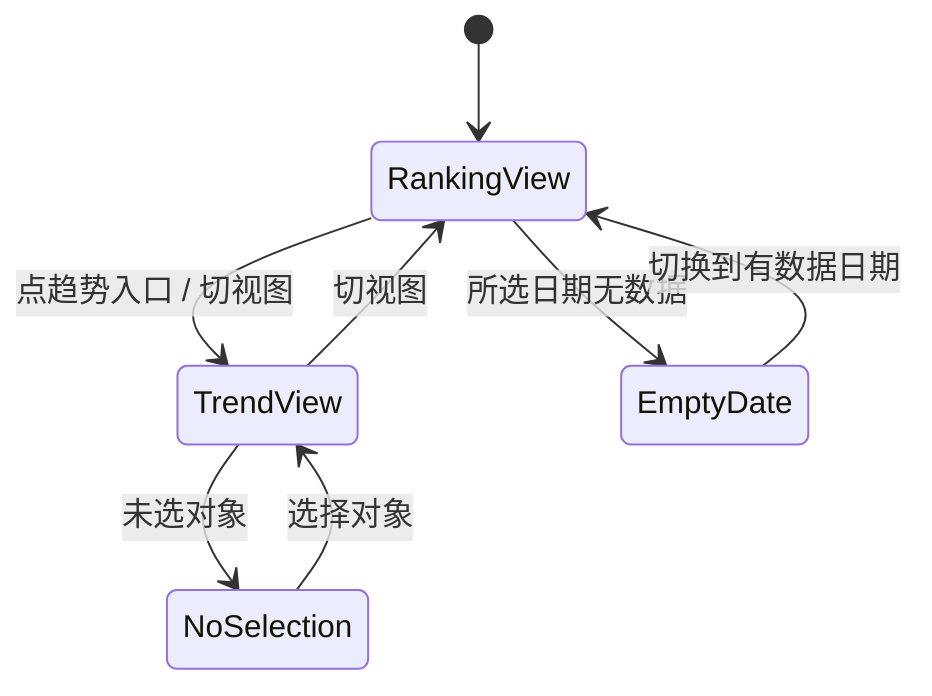

# 14-1 架构文档：ETF 份额与资金流监控

_本文件只保留当前版本真正影响实现的架构决策、边界和契约；DDL、目录树、环境变量、实施故事等内容默认不放入正文。_

## 1. 系统摘要

接入 Tushare 的 ETF 份额、净值与基础信息数据，每日收盘后采集并入库，按跟踪指数分组提供"指数排行"（看各宽基/行业指数当日份额变化与估算净流入）和"历史趋势"（看指数或单只 ETF 近 N 日份额与净流入曲线）两个视图。核心闭环：**采集 → 归集 → 聚合 → 渲染**。净流入额由"份额变化 × 单位净值"估算，指数级数值为该指数下所有 ETF 加总。

## 2. 范围、非目标与成功标准

### 2.1 范围

1. ETF 基础信息采集：封装 Tushare `fund_basic`（market=E，筛 name 含 ETF）+ `fund_share`（fund_type=ETF）+ `fund_nav`，含限流与重试；维护 ETF 与"跟踪指数""类型维度（宽基/行业）"的映射。
2. 份额与净值数据落库：每个交易日收盘后采集当日 ETF 份额、单位净值，计算份额变化与估算净流入额并入库。
3. 历史数据初始化：管理员按日期范围手动触发，复用与日常采集同口径的采集逻辑回填历史交易日。
4. 采集编排：接入 collector 每日更新链路，新增定时任务（遵循项目"注释注册"惯例），新增管理员手动触发入口（当日采集 + 历史回填）。
5. 指数排行查询 API：宽基/行业维度切换、按净流入额/份额变化/份额排序、日期切换、指数行展开 ETF 明细、分页。
6. 历史趋势查询 API：按指数或单只 ETF，返回近 N 日（7/30/90）份额与净流入额时间序列。
7. 前端独立"ETF 监控"页面：指数排行视图（含展开明细）+ 历史趋势视图，维度/视图/排序/日期/区间切换、趋势入口跳转。

### 2.2 明确不做

- 跨境/商品/债券/货币 ETF（仅宽基 + 行业股票型 ETF）。
- ETF 盘中实时份额估算与盘中高频采样（份额为日终数据）。
- IOPV、折溢价率、跟踪误差、成分股权重等专业分析。
- ETF 资金流与板块资金流的自动联动关联。
- 指数成分股/强度分析（本期只看 ETF 聚合资金）。
- 数据导出、收藏、加入自选。
- 服务端推送式自动刷新。

### 2.3 成功标准

| 指标 | 首版目标 |
| --- | --- |
| 排行视图功能 | AC-01~05/11/13 全路径可走通：宽基/行业切换、净流入额/份额变化/份额排序、日期切换、展开明细、分页、趋势入口跳转均正常 |
| 趋势视图功能 | AC-06~09 全路径可走通：指数/单只 ETF 切换、份额/净流入额指标切换、7/30/90 区间切换均正常绘制曲线，历史不足区间画已有部分、完全无数据走空态 |
| 采集功能 | 当日收盘采集、历史按日期回填、管理员手动触发均可用，历史与日常数据口径一致 |
| 采集性能 | 单日全量 ETF（约 700 只）份额+净值采集在 5 分钟内完成 |
| 排行查询响应 | 单次查询（含分页）< 500ms |
| 趋势查询响应 | 单次查询（90 日）< 500ms |
| 指数归集正确性 | 同一跟踪指数的多只 ETF 正确归集，指数汇总值 = 各只之和 |

### 2.4 验收标准承接矩阵

| AC-ID | PRD 原文摘要 | 承接模块 | 关键链路 / 状态 | 风险 / 降级说明 |
| --- | --- | --- | --- | --- |
| AC-01 | 从导航进入默认显示宽基指数排行 | 前端页面 + 排行 API | 导航入口 → 排行视图默认态 + 骨架屏 | 库无数据时走空态 |
| AC-02 | 宽基/行业维度切换 | 排行 API + 前端 | category 参数切换重新加载 | 两维度指数集合不同 |
| AC-03 | 净流入额/份额变化/份额排序切换 | 排行 API | sort_by + order | 不可排序列忽略 |
| AC-04 | 展开指数查看 ETF 明细 | 排行 API（明细子查询）+ 前端 | 指数行展开 → 该指数 ETF 明细 | 明细按净流入额降序 |
| AC-05 | 切换日期查看历史排行 | 排行 API | trade_date 参数 | 无数据日期走空态 |
| AC-06 | 切换到历史趋势视图并选对象 | 前端页面 + 趋势 API | 视图切换 + 未选对象引导态 | 未选对象不画坐标系 |
| AC-07 | 查看指数/ETF 份额与净流入额曲线 | 趋势 API + 前端 | 对象 + 指标 + 区间 → 时间序列 | 历史不足区间画已有部分 |
| AC-08 | 趋势视图下钻到单只 ETF | 趋势 API + 前端 | 对象切换为单只 ETF | 单只量级小于指数汇总 |
| AC-09 | 趋势对象历史不足所选区间 | 趋势 API | 返回已有部分序列 | 不报错不空坐标系 |
| AC-10 | 加载失败可重试 | 前端 + 两个 API | 错误态 + 重试 | 两视图独立降级 |
| AC-11 | 从排行跳转趋势视图 | 前端页面 | 趋势入口 → 视图切换 + 对象定位 | 展开标记不跳转 |
| AC-12 | 管理员手动触发采集 | admin API + 采集器 | AsyncTask + 采集器 | 并发保护 |
| AC-13 | 分页浏览 | 排行 API + 前端 | page/page_size | 滚动到顶部、展开行收起 |
| AC-14 | 管理员按日期初始化历史数据 | admin API + 历史回填 | AsyncTask + 按日期回填 | 历史与日常口径一致、曲线无断裂 |

## 3. 用户流程与状态

### 3.1 主流程

1. 用户从主导航进入"ETF 监控"页面。
2. 默认进入"指数排行"视图、"宽基"维度，看到当日（或最新有数据日）按合计净流入额降序的指数分组排行表。
3. 用户可：切换宽基/行业维度、切换净流入额/份额变化/份额排序、切换日期、翻页、展开某指数行看其下 ETF 明细。
4. 用户点击某指数或 ETF 的"趋势"入口，切换到"历史趋势"视图，对象自动定位。
5. 用户在趋势视图可：切换查看对象（指数/单只 ETF）、切换曲线指标（份额/净流入额）、切换区间（7/30/90 日）。

### 3.2 关键分支

| 分支名 | 入口/触发条件 | 架构处理方式 |
| --- | --- | --- |
| 排行日期无数据 | 选择无采集数据的日期 | 排行 API 返回 hasData=false，前端渲染空态 |
| 趋势未选对象 | 进入趋势视图未选对象 | 前端本地状态判定，渲染"请选择对象"引导，不请求 API |
| 趋势对象历史不足 | 所选对象数据点少于区间 | 趋势 API 返回已有部分序列，前端正常绘制 |
| 采集失败 | Tushare 接口不可用 | 采集器重试耗尽后记录日志，页面已有数据不受影响 |
| 指数映射缺失 | 某 ETF 的跟踪指数未命中标准指数 | 该 ETF 归入"其他/未分类"，不阻断采集与展示 |

### 3.3 状态机

页面级视图状态（不涉及后端持久化任务状态）：



关键规则：视图切换保留维度与日期选择；趋势视图已选对象在切换视图后保留；展开的指数行在切换维度/排序/翻页时收起。

## 4. 系统上下文与模块职责

### 4.1 系统上下文

外部依赖：Tushare（经自建代理 `fund_basic` / `fund_share` / `fund_nav` 接口）。数据流向：Tushare → 采集器 → ETF 基础信息表 + ETF 日份额表 → 查询 API（按指数聚合）→ 前端双视图。

变更点：新增 ETF 基础信息表、ETF 日份额表、指数映射表（可选，见 ADR-2）、采集方法、3 个查询 API、2 个 admin 触发端点、前端页面。复用现有 TushareDataSource（在 `tushare_client.py` 内新增 3 个获取方法），不改造数据源抽象层。

### 4.2 模块职责

| 模块名 | 职责 | 上游输入 | 下游输出 |
| --- | --- | --- | --- |
| Tushare ETF 获取方法（`tushare_client.py` 新增） | `get_fund_basic_etf()` / `get_fund_share(trade_date)` / `get_fund_nav(ts_code)`，offset 分页 + 限流重试，返回原始 dict 列表 | Tushare API | dict 列表 |
| 指数归集器（`EtfIndexClassifier`） | 把 ETF 的 benchmark 文本标准化为跟踪指数名 + 宽基/行业分类 | fund_basic 的 benchmark/name | `index_name` + `category` |
| ETF 采集/初始化服务（`EtfDataInitService`） | 同步基础信息、按日采集份额净值、计算份额变化与净流入额、按日期范围回填历史 | Tushare 方法 + 指数归集器 | ETF 基础信息表 + 日份额表记录 |
| 采集编排（`DataCollector._update_etf_daily`） | 调服务采集当日数据，编入 `run_daily_update()` | EtfDataInitService | 表记录 |
| ETF 查询服务（`EtfMonitorService`） | 指数排行（按指数聚合 + 排序 + 分页）、指数明细、历史趋势（指数/单只 × 指标 × 区间）、最新日期 | ETF 基础信息表 + 日份额表 | 排行 dict / 明细 dict / 趋势序列 / 最新日期 |
| 查询 API（`etf_monitor.py`） | GET 指数排行、GET 趋势、GET 指数明细、GET 最新日期 | 服务层 | camelCase 响应 |
| admin 触发端点 | 创建当日采集 / 历史回填 AsyncTask | 管理员请求 | task_id |
| 前端模块（`etf-monitor` 页面 + `useEtfMonitor` hook） | 双视图渲染、维度/视图/排序/日期/对象/指标/区间交互、SWR 数据获取 | 查询 API | 用户界面 |

**复用声明与可行性验证**：

- **Tushare 获取方法范式**：复用 `tushare_client.get_fund_list`（`src/services/data_acquisition/tushare_client.py:544`）的 offset 分页（15000/批）+ `_execute_with_retry` + 返回原始 dict 模式。验证：`get_fund_list` 同样调 `pro.fund_basic`，新方法 `get_fund_share` / `get_fund_nav` 调 `pro.fund_share` / `pro.fund_nav`，签名结构一致，限流重试骨架（`_enforce_rate_limit` / `_NON_RETRYABLE_KEYWORDS`）已实测可用。`fund_share` 按 trade_date 全量返回约 728 条、`fund_nav` 按 ts_code 返回历史，单批即够，无需 offset 分页（但 `get_fund_basic_etf` 沿用 offset）。
- **落库 upsert 范式**：复用 `collector._update_sector_fund_flow`（`src/services/data_updater/collector.py:356`）的 `pg_insert(...).on_conflict_do_update(constraint=...)`。验证：日份额表用 `(trade_date, ts_code)` 唯一约束，同日重采覆盖最新值，与板块资金流同范式。
- **异步任务范式**：复用 `FundDataInitService`（`src/services/data_init_fund.py`）的 `sync_fund_basic()` → pg upsert + `set_progress_callback` / `set_cancel_check` 回调。验证：`FundDataInitService.sync_fund_basic` 从 Tushare 拉基金基础信息写入 funds 表，ETF 服务同构（拉 ETF 基础信息 + 份额写入对应表）；`init_historical_data_by_date_range`（`data_init.py:851`）的按日期范围回填签名（含日期校验、10 年上限、progress/cancel 回调）可直接参照用于历史回填 handler。
- **admin 触发范式**：复用 `init_sector_fund_flow.py`（`src/api/admin/init_sector_fund_flow.py`）的 AsyncTask + TaskManager + require_admin + 并发保护。验证：新增 `SYNC_ETF_DAILY` / `BACKFILL_ETF_HISTORY` 到 `TaskType` 枚举（`src/services/task_handlers.py:27`），注册对应 handler 并加入 `__all__`。
- **camelCase 响应范式**：复用 `sector_fund_flow.py`（`src/api/v1/sector_fund_flow.py:42`）的 `_dict_to_camel` + `_serialize_value`（Decimal→float、date→isoformat）。验证：响应 `{success, data}` 包裹，data 内 camelCase，与前端 `fundFlowTypes.ts` 全 camelCase 消费一致。
- **前端 SWR hook 范式**：复用 `useSectorFundFlow.ts`（`web/src/hooks/useSectorFundFlow.ts`）。验证：SWR 数组 key + `apiClient`（baseURL 已含 `/api/v1`）+ `.then(res=>res.data)` 解包 + `SWR_OPTIONS`（revalidateOnFocus:false / dedupingInterval:30000）。
- **ECharts 范式**：复用 `FundFlowTimeseriesChart.tsx`（`web/src/components/sector-fund-flow/`）的 `dynamic(() => import('echarts-for-react'), {ssr:false})`。验证：所有图表组件均用此范式，不建全局 wrapper。

### 4.3 需要刻意避免的过度设计

- **不为 ETF 建独立 Repository 基类**：查询直接在 service 层用 SQLAlchemy（聚合查询是按指数 group by + sum，单表为主），不复刻 BaseRepository 泛型。
- **不引入缓存层**：排行/趋势查询是直接的表查询 + 聚合，宽基指数约 20 个、单日约 700 只 ETF，数据量可控，无需 L1/L2 缓存。
- **不引入消息队列/Worker**：日级采集是低频同步任务，APScheduler + AsyncTask 已够，无需 Redis/Queue。
- **不做盘中采样**：ETF 份额是日终数据，无权威盘中值，不建分钟级采样表（区别于板块资金流）。
- **不为样本数据建独立聚合表**：指数汇总值在查询时按 index_name group by + sum 实时聚合，不预聚合（700 只/日 × 90 日 ≈ 6.3 万行，PostgreSQL 直接处理）。
- **不做精确的指数代码体系**：不引入完整的指数代码主数据表，用 benchmark 文本标准化 + 宽基/行业分类规则覆盖首版（见 ADR-2）。

## 5. 关键架构决策（ADR）

### ADR-1：ETF 数据存两张表——基础信息表 + 日份额表

- **选择**：`etf_basic`（ETF 基础信息：ts_code、name、跟踪指数、分类、上市日期等，低频更新）+ `etf_daily`（每日份额/净值/份额变化/净流入额，按交易日累积）。
- **理由**：基础信息是慢变维度（基金不常新增/变更），日份额是高频累积事实，分表避免每日全量重复存基础信息、且查询时基础信息表做维度 JOIN 更清晰。混在一张表会让历史回填和基础信息更新互相干扰。
- **风险与对策**：多一张表多一次 JOIN。对策：两表按 ts_code 关联，基础信息表数据量小（约 1800 只 ETF），JOIN 成本可忽略。

### ADR-2：跟踪指数用 benchmark 文本规则标准化，不建指数代码主数据

- **选择**：从 `fund_basic.benchmark` 文本（如"沪深300指数收益率×100%"）用规则提取指数名（"沪深300"），并用宽基/行业关键词规则归类；归类失败的 ETF 入"其他/未分类"。
- **理由**：Tushare 不提供 ETF→指数代码的权威映射，benchmark 是唯一的指数信息来源且为自由文本。建完整指数主数据 + 人工维护映射表是过度设计（首版只有约 20 个宽基指数 + 常见行业指数）。规则标准化覆盖 90%+ 场景，归类失败兜底为"其他"不阻断。
- **风险与对策**：规则误归类（如"沪深300自由现金流"误归"沪深300"）。对策：宽基匹配用精确指数名边界规则（见 6.x 实现原则），增强型/策略型 ETF 优先归入其特定指数；归类结果可人工复核，规则可迭代。可演进为映射表。

### ADR-3：净流入额入库时计算并存储，不查询时计算

- **选择**：采集时即计算 `share_change = 当日份额 - 前一日份额`、`net_inflow = share_change × unit_nav`，连同份额、净值一起存入 `etf_daily`。
- **理由**：份额变化依赖前一日数据，查询时逐条回溯前一日代价高且易错；入库时计算可保证查询直接读现成字段，排行与趋势查询都走聚合 sum，性能最优。历史回填时按日期顺序逐日计算，天然有前一日。
- **风险与对策**：首日（无前一日）份额变化为 null。对策：首日 share_change/net_inflow 存 null，前端首日点不画净流入曲线（份额曲线仍可画）；历史回填从最早可取日开始，首日同样 null。

### ADR-4：指数排行与历史趋势分多个 API 端点

- **选择**：`GET /etf-monitor/index-rankings`（指数排行）、`GET /etf-monitor/index-detail`（指数下 ETF 明细）、`GET /etf-monitor/trend`（历史趋势）、`GET /etf-monitor/latest-date`（最新日期）。
- **理由**：排行（指数聚合列表）、明细（单指数下 ETF 列表）、趋势（时间序列）三种数据形态完全不同，合并会导致响应臃肿且前端无法独立刷新；明细独立端点支持展开懒加载。
- **演进余地**：若后续要合并，可在服务层聚合。

### ADR-5：历史回填复用日常采集同口径逻辑

- **选择**：历史回填 handler 循环日期范围，逐日调用与当日采集完全相同的 `EtfDataInitService.sync_etf_daily(trade_date)` 方法，按日期升序逐日处理（保证 share_change 的前一日依赖）。
- **理由**：PRD 明确要求历史与日常数据口径一致、曲线无断裂。复用同一方法保证计算逻辑、字段口径、归集规则完全一致，杜绝两套实现产生不可比数据。按日期升序保证 share_change 的前一日依赖在回填时就地满足。
- **风险与对策**：回填范围大时耗时长。对策：AsyncTask 支持进度回调与取消，单日约 700 只采集约 1-2 分钟，90 日约 1.5-3 小时，可接受；TaskManager 超时上限 14400s（4h）足够。

### ADR-6：定时任务遵循项目"注释注册"惯例

- **选择**：在 job_manager 新增 ETF 每日采集任务方法，但按现有惯例注释注册（当前除板块资金流外所有 job 都注释停用），以管理员手动触发 + collector 每日更新为主要落地路径。
- **理由**：项目所有定时任务当前都处于注释停用状态（开发期间），ETF 任务应保持一致，避免开发期间后台自动执行。
- **演进余地**：上线时统一取消注释启用（收盘后 CronTrigger，如 15:30）。

### ADR-7：数值用 Numeric 存储与传输，序列化为 float

- **选择**：表字段用 `Numeric`（份额万份 `Numeric(20,4)`、净值 `Numeric(10,4)`、净流入额亿元 `Numeric(18,4)`），API 响应经 `_serialize_value` 转 float。
- **理由**：金融数据需精度但前端图表消费 float；沿用项目板块资金流的 `_serialize_value` Decimal→float 范式。份额单位万份需较高精度（最大 ETF 约 1500 亿份 = 1500 万万份）。
- **风险与对策**：float 精度。对策：份额以万份整数级存储保证精度，仅在 API 输出时换算亿份；亿元/亿份单位下四位小数，float 精度足够。

### 5.x 待确认问题

| 编号 | 问题描述 | 影响范围 |
| --- | --- | --- |
| Q1 | 指数归类规则是否覆盖足够多的行业指数？宽基约 20 个易枚举，行业指数（如半导体/新能源/医药）数量多，规则覆盖率需实测 | 指数归集器、归类失败的 ETF 体验 |

## 6. 运行链路

### 6.1 ETF 当日采集链路（收盘后 / 手动触发）

1. 触发源：APScheduler 每日定时任务（注释停用）/ 管理员手动触发（admin API 创建 `SYNC_ETF_DAILY` AsyncTask）/ collector 每日更新。
2. `EtfDataInitService.sync_etf_basic()`：调 `get_fund_basic_etf()`（offset 分页）拉全量场内 ETF 基础信息，经 `EtfIndexClassifier` 归类得到 `index_name` + `category`，upsert 到 `etf_basic` 表（冲突键 ts_code）。
3. `EtfDataInitService.sync_etf_daily(trade_date)`：
   a. 调 `get_fund_share(trade_date)` 拉当日全量 ETF 份额（fund_type=ETF，约 728 条）。
   b. 调 `get_fund_nav` 补当日单位净值（按需，取 nav_date=trade_date 的 unit_nav）。
   c. 查前一日（最近有数据的上一交易日）同 ts_code 的份额，计算 `share_change = 当日份额 - 前日份额`，`net_inflow = share_change × unit_nav / 10000`（份额万份 × 净值 ÷ 10000 = 亿元）。
   d. 批量 upsert 到 `etf_daily` 表，冲突键 `(trade_date, ts_code)`，冲突时覆盖。
4. 记录采集日志（ETF 数、成功率、耗时）。

这条链路的实现原则：
- 复用 `tushare_client._execute_with_retry` 的限流（`TUSHARE_API_INTERVAL`，默认 0.3s）+ 指数退避 + 不可恢复关键词短路。`fund_share` / `fund_nav` 是按量接口，已实测连续调用稳定。
- 前一日份额查询：取该 ts_code 在 `trade_date` 之前、`trade_date < 给定日` 的最大 trade_date 记录；历史回填按日期升序时，前一日即上一次循环写入的记录，可缓存上一日份额 dict 优化查询。
- 净流入额单位换算：份额字段 `fd_share` 单位为万份，`net_inflow(亿元) = share_change(万份) × unit_nav(元) / 10000`。
- 首日（无前一日数据）：share_change / net_inflow 存 null。
- 并发保护：同类型 pending/running 任务存在时拒绝新任务（沿用 init_sector_fund_flow 范式）。

### 6.2 ETF 历史回填链路（管理员按日期触发）

1. 管理员在 admin API 指定 `start_date` / `end_date`，创建 `BACKFILL_ETF_HISTORY` AsyncTask（含并发保护、日期校验、范围上限）。
2. handler 调 `EtfDataInitService.backfill_etf_history(start_date, end_date)`。
3. 先调 `sync_etf_basic()` 确保基础信息最新（ETF 清单 + 指数归类）。
4. 用交易日历筛选范围内的交易日，**按日期升序**逐日循环。
5. 对每个交易日调用与当日采集**完全相同**的 `sync_etf_daily(trade_date)`（含前一日份额查询、share_change、net_inflow 计算）。
6. 每日处理完更新 AsyncTask 进度（progress/total），支持取消（`_check_cancelled`）。

这条链路的实现原则：
- **同口径复用**：回填与日常采集调用同一个 `sync_etf_daily(trade_date)`，保证字段口径、计算逻辑、归集规则完全一致，曲线上无断裂。
- 按日期升序保证 share_change 的前一日依赖在回填过程中就地满足（上一日已写入）。
- **首日 null 非断裂**：历史回填首个交易日因无前一日数据，share_change/net_inflow 为 null（与日常采集首日一致，见 ADR-3），此为预期行为而非数据断裂——前端净流入额曲线首日不画该点、份额曲线正常绘制；这与 PRD AC-14 "无明显断裂"不冲突（断裂指口径不一致的跳变，首日缺前值是数据特性）。
- 复用 `init_historical_data_by_date_range`（`data_init.py:851`）的日期校验、10 年上限、progress/cancel 回调范式。

### 6.3 指数排行查询链路

1. 前端请求 `GET /etf-monitor/index-rankings?category=&trade_date=&sort_by=&order=&page=&page_size=`。
2. 服务层对 `etf_daily` JOIN `etf_basic`（按 ts_code），筛 `category` + `trade_date`。
3. 按 `etf_basic.index_name` 分组，`SUM(share)` / `SUM(share_change)` / `SUM(net_inflow)` 得指数级汇总，`COUNT(ts_code)` 得 ETF 数量。
4. 按 sort_by（net_inflow / share_change / share）+ order（desc/asc）排序。
5. 分页（LIMIT/OFFSET，默认 page=1, page_size=20）。
6. 返回 `{hasData, tradeDate, items[], total, page, pageSize}`，camelCase。

实现原则：
- 指数汇总值：份额、份额变化、净流入额均直接 SUM（份额变化负值求和正确反映净赎回）。
- 排序字段映射：sort_by 接受 `netInflow` / `shareChange` / `share`（前端 camelCase），服务层映射到聚合列。

### 6.4 指数明细查询链路

1. 前端请求 `GET /etf-monitor/index-detail?index_name=&category=&trade_date=`。
2. 服务层 JOIN etf_basic + etf_daily，筛 `index_name` + `category` + `trade_date`。
3. 返回该指数下所有 ETF 明细，按 net_inflow 降序。

实现原则：明细不分页（单指数下 ETF 通常 ≤30 只），跟随指数行所在页展开展示。

### 6.5 历史趋势查询链路

1. 前端请求 `GET /etf-monitor/trend?target_type=&target_code=&metric=&days=&end_date=`。
   - target_type: `index`（指数）或 `etf`（单只 ETF）。
   - target_code: index 时为 index_name，etf 时为 ts_code。
   - metric: `share` 或 `netInflow`。
   - days: 7 / 30 / 90。
2. 服务层取 `trade_date <= end_date` 的最近 `days` 个交易日数据。
3. target_type=index 时按 index_name 聚合（SUM），target_type=etf 时按 ts_code 取单只。
4. 按 trade_date 升序返回 `[{tradeDate, value}]` 序列。
5. 返回 `{hasData, series: [{tradeDate, value}]}`，camelCase。

实现原则：
- 交易日筛选：取 etf_daily 表中实际有数据的最近 N 个 trade_date（而非日历日），避免非交易日空点。
- 指数聚合：同排行，按 index_name SUM。份额曲线为累计规模变化（输出亿份），净流入额曲线有正负（零轴基线由前端绘制）。
- 历史不足区间：返回实际有的数据点（少于 N），前端正常绘制已有部分（AC-09）。
- 完全无数据：若所选对象在区间内完全没有数据点（如新上市 ETF 尚无任何采集记录、或采集未覆盖），返回 `hasData=false` + 空 series，前端渲染"该对象暂无数据"提示（区别于历史不足的正常绘制，不画空坐标系）。

## 7. 领域对象与关键契约

### 7.1 核心对象

| 对象名 | Source of Truth | Owner | 用途 |
| --- | --- | --- | --- |
| EtfBasic（ETF 基础信息） | etf_basic 表 | 采集服务写入 | ETF 维度信息 + 跟踪指数 + 分类（归集键） |
| EtfDaily（ETF 日份额净值） | etf_daily 表 | 采集服务写入 | 排行与趋势的数据源（含计算的 share_change / net_inflow） |
| IndexName（跟踪指数，逻辑对象） | etf_basic.index_name 派生 | 指数归集器 | 分组聚合键，无独立表（见 ADR-2） |

### 7.2 推荐最小 Schema

存储字段视角（ORM，snake_case）。注意单位口径：**存储用万份（贴合 Tushare `fd_share` 原始口径），API 输出时份额/份额变化换算为亿份（÷10000，贴合 PRD 展示口径），净流入额直接输出亿元**：

```typescript
// etf_basic 表（存储视角）
interface EtfBasicRecord {
  ts_code: string            // 基金代码，主键关联键（如 510300.SH）
  name: string               // 基金简称
  management: string | null  // 管理人
  fund_type: string | null   // 基金类型（原始，如"股票型"）
  list_date: string | null   // 上市日期
  benchmark: string | null   // 跟踪基准原文（如"沪深300指数收益率×100%"）
  index_name: string | null  // 标准化跟踪指数名（归集器产出，如"沪深300"）
  category: string | null    // 分类维度：'broad'（宽基）/ 'industry'（行业）/ 'other'
  status: string | null      // 存续状态（L/D/I）
  market: string             // 'E' 场内
}

// etf_daily 表（存储视角，份额类字段单位=万份）
interface EtfDailyRecord {
  id: number
  trade_date: string         // YYYY-MM-DD 交易日
  ts_code: string            // 基金代码
  share: number | null       // 份额（万份，与 Tushare fd_share 一致）
  unit_nav: number | null    // 单位净值（元）
  share_change: number | null   // 份额变化（万份，当日-前日；首日 null）
  net_inflow: number | null     // 估算净流入额（亿元，= share_change(万份) × unit_nav / 10000；首日 null）
  change_percent: number | null // 二级市场涨跌幅（%）
}
```

API 响应输出视角（经 to_camel，camelCase）。**份额类字段输出时已 ÷10000 换算为亿份**：

```typescript
// 指数排行响应
interface EtfIndexRankingsData {
  hasData: boolean
  tradeDate: string | null
  items: EtfIndexRankingItem[]
  total: number
  page: number
  pageSize: number
}
interface EtfIndexRankingItem {
  indexName: string
  category: string
  etfCount: number
  totalShare: number | null        // 合计份额（亿份，存储万份÷10000）
  totalShareChange: number | null  // 合计份额变化（亿份）
  totalNetInflow: number | null    // 合计净流入额（亿元）
}

// 指数明细响应
interface EtfIndexDetailData {
  hasData: boolean
  items: EtfDetailItem[]
}
interface EtfDetailItem {
  tsCode: string
  name: string
  unitNav: number | null
  share: number | null            // 份额（亿份）
  shareChange: number | null      // 份额变化（亿份）
  netInflow: number | null        // 净流入额（亿元）
  changePercent: number | null
}

// 趋势响应
interface EtfTrendData {
  hasData: boolean
  metric: string          // 'share' | 'netInflow'
  unit: string            // metric=share 时 '亿份'；metric=netInflow 时 '亿元'
  series: { tradeDate: string; value: number | null }[]
}
```

### 7.3 API 边界

| 接口路径 | 方法 | 用途 | 对应交互 | 关键参数 |
| --- | --- | --- | --- | --- |
| `/api/v1/etf-monitor/index-rankings` | GET | 指数分组排行 | AC-01/02/03/05/13 | category(broad/industry), trade_date, sort_by(netInflow/shareChange/share), order(desc/asc), page(默认1), page_size(默认20) |
| `/api/v1/etf-monitor/index-detail` | GET | 指数下 ETF 明细 | AC-04 | index_name, category, trade_date |
| `/api/v1/etf-monitor/trend` | GET | 历史趋势曲线 | AC-06/07/08/09 | target_type(index/etf), target_code, metric(share/netInflow), days(7/30/90), end_date |
| `/api/v1/etf-monitor/latest-date` | GET | 最新有数据交易日 | 日期选择器默认定位 | category |
| `/api/v1/admin/init/etf-daily` | POST | 管理员手动触发当日采集 | AC-12 | 无（require_admin） |
| `/api/v1/admin/init/etf-history` | POST | 管理员按日期回填历史 | AC-14 | start_date, end_date（require_admin） |

API 契约约定（对齐既有代码）：
- **响应包裹**：`{ success: boolean, data: <业务对象> }`，与 sector_fund_flow 一致。
- **命名转换边界**：响应体 camelCase（经 `_dict_to_camel`），query 参数 snake_case（category/trade_date/sort_by/page_size/target_type/target_code），与 sectorFundFlowApi 一致。
- **序列化**：日期→ISO 字符串，Numeric→float（经 `_serialize_value`），与板块资金流一致。
- **路径前缀**：业务端点挂 `/api/v1/etf-monitor`（v1 主路由），admin 端点挂 `/api/v1/admin/init/etf-daily` / `etf-history`（admin 路由，require_admin），与 init_sector_fund_flow.py 一致。
- **认证**：业务 GET 端点用 `Depends(get_current_user)`，admin POST 用 `Depends(require_admin)`。
- **admin 触发**：创建 `SYNC_ETF_DAILY` / `BACKFILL_ETF_HISTORY` 类型 AsyncTask（TaskType 枚举新增成员），并发保护查重，返回 task_id。
- **前端 API 客户端**：`web/src/lib/api.ts` 新增 `etfMonitorApi` 对象（仿 `sectorFundFlowApi`，api.ts:1086），endpoint **不带 `/api/v1`**（apiClient baseURL 已含）；前端类型定义 `web/src/types/etfMonitorTypes.ts`（全 camelCase 业务对象，仿 `fundFlowTypes.ts`）。

### 7.4 状态流转

无后端持久化业务状态（采集是即时完成的同步操作）。AsyncTask 仅用于手动触发的并发保护、进度记录与日志。历史回填任务有 progress/total 推进，状态 pending→running→completed/failed。

### 7.5 数据边界

| 存储层 | 职责 |
| --- | --- |
| etf_basic 表 | ETF 基础信息 + 跟踪指数标准化结果 + 分类，归集维度来源 |
| etf_daily 表 | 所有 ETF 每日份额/净值/份额变化/净流入额，排行与趋势的唯一事实表 |
| 前端本地状态 | 当前视图、维度、排序、日期、展开行、趋势对象/指标/区间（用户操作态，不入库） |

### 7.6 命名与标识规则

- **ID 策略**：etf_daily 自增 id；ts_code 作为 ETF 与基础信息表的关联键（非自增，业务编码）；index_name 为逻辑聚合键（无独立表）。
- **JSON 命名**：响应 camelCase，query 参数名 snake_case；**特例**：sort_by / metric 的**参数值**用 camelCase（如 sort_by=netInflow、metric=netInflow），与前端字段命名一致，服务层做值映射。
- **术语映射**：全文档统一"份额"(share，存储万份/展示亿份)、"份额变化"(share_change，同上)、"净流入额"(net_inflow，亿元)、"单位净值"(unit_nav，元)、"跟踪指数"(index_name)；前端 UI 文案"合计净流入额""合计份额变化"。
- **category 值**：`broad`（宽基）/ `industry`（行业）/ `other`（未分类）。
- **数值单位契约**：份额/份额变化**存储为万份**（与 Tushare `fd_share` 一致，避免存浮点失真），**API 输出换算为亿份**（÷10000，与 PRD 展示口径一致）；净流入额在采集时即按亿元计算并存储（`net_inflow(亿元) = share_change(万份) × unit_nav(元) / 10000`）；单位净值为"元"。指数聚合时：份额/份额变化先在万份口径 SUM（保证精度），输出时再统一 ÷10000 转亿份；净流入额直接 SUM（亿元口径）。

## 8. 非功能需求、风险与运行策略

### 8.1 性能与吞吐量目标

| 指标 | 目标 | 预期并发 |
| --- | --- | --- |
| 单日全量 ETF 采集耗时 | < 5min（约 700 只份额 + 净值 + 前日查询 + 落库） | 单次 |
| 排行查询响应 | < 500ms | 低并发（单用户浏览） |
| 趋势查询响应 | < 500ms（90 日 × 单只或指数聚合） | 低并发 |
| 历史回填 90 日耗时 | < 3h（每日约 1-2min） | 单次（AsyncTask） |

### 8.2 可靠性、错误处理与降级策略

| 降级级别 | 触发条件 | 系统行为 |
| --- | --- | --- |
| L1（最轻） | 单日采集部分 ETF 净值缺失 | 份额照常入库，net_inflow 用已有净值计算或存 null |
| L2 | 单次采集整体失败（Tushare 不可用） | 重试耗尽后记录日志，不影响已有数据与页面展示 |
| L3 | Tushare 接口长期不可用 | 页面展示历史已有数据，排行/趋势用最近有数据日 |
| L4 | 库中完全无数据 | 页面空态文案，引导管理员触发采集 |
| L5 | 指数归类规则未覆盖某 ETF | 该 ETF 归入 other 分类，不阻断采集，归类规则可迭代 |

### 8.3 安全与反滥用策略

| 项目 | 首版策略 |
| --- | --- |
| API 鉴权 | 业务 GET 需登录用户，admin 触发需管理员 |
| 外部接口调用 | 服务端发起，Tushare token 不暴露到前端 |
| 采集频率 | 日级采集，避免高频触发限流；复用 0.3s 间隔限流 |
| 历史回填并发 | 并发保护，同类回填任务不重复创建 |

### 8.4 成本控制预期

| 模块 | 预估单次成本 | 首版控制策略 |
| --- | --- | --- |
| Tushare 接口调用 | 按量积分（fund_share/fund_nav） | 0.3s 限流 + 重试上限；日级采集，非盘中高频 |
| 数据库存储 | 约 700 条/日 × 永久累积 | 索引优化；份额净值表按需归档超长历史 |

### 8.5 可观测性

- 采集日志：每次采集记录 ETF 数、成功/失败数、耗时（沿用 collector 日志风格）。
- 历史回填：AsyncTask 记录 progress/total 与逐日日志。
- 指数归类：记录归类失败（category=other）的 ETF 数量与样本，供规则迭代。
- **归集正确性自检**（成功标准"指数汇总值=各只之和"的可观测手段）：采集落库后抽样核对——取某指数当日所有 ETF 的 share/net_inflow 之和，与按 index_name 聚合查询返回的指数汇总值比对，两者应一致；归集正确性同时通过指数排行展开明细（§6.4）的前端可见性间接验证（展开明细的 ETF 列表 + 数值加总应等于指数行汇总值）。
- 接口错误：标准 logger 异常记录。

### 8.6 主要风险

| 风险 | 影响 | 缓解方式 |
| --- | --- | --- |
| 指数归类规则覆盖率不足 | 行业指数归入 other，该类 ETF 无法按指数聚合展示 | 宽基精确枚举 + 行业关键词规则 + 归类失败兜底；规则可迭代（Q1） |
| benchmark 文本格式变化 | 归类规则失效 | 规则容错（正则 + 关键词组合），归类失败不阻断 |
| 份额/净值取数时点不一致 | net_inflow 计算偏差 | 取同 trade_date 的份额与 nav_date=trade_date 的净值 |
| Tushare 按量积分耗尽 | 采集中断 | 限流 + 日级采集；监控失败率；降级展示历史数据 |
| 历史回填耗时长 | 管理员等待 | AsyncTask 进度回调 + 可取消；分批回填 |

## 9. 实施方案

### Phase A：数据层与采集

**后端**

1. `server/src/models/etf.py` — 新建 `EtfBasic`（ts_code 主键、name、management、fund_type、list_date、benchmark、index_name、category、status、market）+ `EtfDaily`（id、trade_date、ts_code、share、unit_nav、share_change、net_inflow、change_percent，唯一约束 `(trade_date, ts_code)`，索引 `(trade_date, category)`需经 JOIN、`(ts_code, trade_date)`）两个 ORM 模型。
2. `server/src/models/__init__.py` — 注册导出 `EtfBasic` / `EtfDaily`。
3. `server/alembic/versions/` — 新建迁移建 `etf_basic` / `etf_daily` 表（仿 `e77af8b630f7_add_sector_fund_flow_table.py`）。
4. `server/src/services/data_acquisition/tushare_client.py` — 新增 `get_fund_basic_etf()`（offset 分页拉 market=E，筛 name 含 ETF）、`get_fund_share(trade_date)`（fund_type=ETF）、`get_fund_nav(ts_code)`，复用 `_execute_with_retry` + `_enforce_rate_limit`，返回原始 dict 列表。
5. `server/src/services/data_acquisition/models.py` — 新增 `EtfShareInfo` / `EtfNavInfo` DTO（仿 `FundInfo`）。
6. `server/src/services/data_acquisition/etf_index_classifier.py` — 新建 `EtfIndexClassifier`：`classify(benchmark, name) -> (index_name, category)`，含宽基精确枚举规则（沪深300/中证500/中证1000/上证50/创业板指/科创50 等）+ 行业关键词规则 + other 兜底。
7. `server/src/services/data_init_etf.py` — 新建 `EtfDataInitService`：`sync_etf_basic()`（拉基础信息 → 归类 → upsert etf_basic）、`sync_etf_daily(trade_date)`（拉份额+净值 → 查前日份额 → 计算 share_change/net_inflow → upsert etf_daily）、`backfill_etf_history(start_date, end_date)`（升序逐日调 sync_etf_daily，含 progress/cancel 回调）。仿 `FundDataInitService` 的 `set_progress_callback` / `set_cancel_check`。
8. `server/src/services/data_updater/collector.py` — 新增 `_update_etf_daily()` 方法（调 `EtfDataInitService.sync_etf_daily(当日)`），编入 `run_daily_update()`。
9. `server/src/services/task_handlers.py` — `TaskType` 新增 `SYNC_ETF_DAILY` / `BACKFILL_ETF_HISTORY`，注册对应 handler（调 `sync_etf_daily` / `backfill_etf_history`），加入 `__all__`。
10. `server/src/services/scheduler/job_manager.py` — 新增 `_etf_daily_snapshot()` 方法（收盘后每日采集），按惯例注释注册。

验证目标：手动调 `sync_etf_daily(当日)` 能成功采集约 700 只 ETF 份额净值并落库、share_change/net_inflow 计算正确；`EtfIndexClassifier` 对抽样宽基/行业 ETF 的归类结果人工核验正确率（宽基应 100%、行业核对典型样本）；`backfill_etf_history` 回填若干日，曲线连续无断裂（首日 null 为预期）。

### Phase B：查询 API

**后端**

11. `server/src/services/etf_monitor_service.py` — 新建 `EtfMonitorService`：`get_index_rankings()`（JOIN + 按 index_name group by + SUM + 排序 + 分页）、`get_index_detail()`（单指数 ETF 明细）、`get_trend()`（指数聚合或单只 × 指标 × 区间 → 时间序列）、`get_latest_date()`。
12. `server/src/api/v1/etf_monitor.py` — 新建路由，GET `/index-rankings`、`/index-detail`、`/trend`、`/latest-date`，复用 `_dict_to_camel` + `_serialize_value`，`{success, data}` 包裹，`get_current_user` 认证。建议顺手把 `_dict_to_camel`/`_serialize_value` 提取到公共 helper（当前 sector_fund_flow / funds 各一份重复）。
13. `server/src/api/v1/__init__.py` — 注册 etf_monitor_router。
14. `server/src/api/admin/init_etf.py` — 新建 admin 触发端点：POST `/init/etf-daily`（当日采集）、POST `/init/etf-history`（历史回填，接 start_date/end_date），AsyncTask + require_admin + 并发保护，仿 `init_sector_fund_flow.py`；在 `server/src/api/admin/__init__.py` 注册 router。

验证目标：4 个业务 GET + 2 个 admin POST 可用，返回结构与 7.2 Schema 一致；指数汇总值 = 各 ETF 之和。

### Phase C：前端

**前端**

15. `web/src/lib/api.ts` — 新增 `etfMonitorApi`（getIndexRankings/getIndexDetail/getTrend/getLatestDate），endpoint 不带 `/api/v1`。
16. `web/src/types/etfMonitorTypes.ts` — 新建类型定义（全 camelCase，仿 `fundFlowTypes.ts`）。
17. `web/src/hooks/useEtfMonitor.ts` — 新建 SWR hooks（useEtfIndexRankings / useEtfIndexDetail / useEtfTrend / useEtfLatestDate），仿 `useSectorFundFlow.ts`，深路径导入不改 `hooks/index.ts`。
18. `web/src/components/etf-monitor/EtfMonitorPage.tsx` — 新建页面主组件，双视图（指数排行/历史趋势）、维度切换、视图切换、排序、日期切换、分页、展开明细、趋势对象/指标/区间切换、空/错/载态、趋势入口跳转；纯 `useState`/`useMemo` 管理状态，不引入 Redux slice。
19. `web/src/components/etf-monitor/EtfIndexRankingTable.tsx` — 排行表格组件（原生 `<table>` + 四态 + data-testid + 列头排序 + 行展开 + 趋势入口），仿 `FundFlowRankingTable.tsx`。
20. `web/src/components/etf-monitor/EtfTrendChart.tsx` — 趋势曲线组件（`dynamic` 导入 echarts-for-react + `ssr:false` + 份额/净流入额切换 + 零轴基线），仿 `FundFlowTimeseriesChart.tsx`。
21. `web/src/components/etf-monitor/helpers.ts` — 工具函数（formatShare/formatSignedAmount/formatPercent/getAmountColorClass），仿 sector-fund-flow/helpers.ts。
22. `web/src/app/dashboard/etf-monitor/page.tsx` — 新建路由壳（`'use client'` + `DashboardLayout` 包裹），仿 sector-fund-flow/page.tsx。
23. `web/src/components/dashboard/DashboardLayout.tsx` — 导航 `baseSidebarItems` 新增"ETF 监控"入口（href `/dashboard/etf-monitor`，置于"板块资金流"后）。

验证目标：页面双视图完整可用，覆盖 AC-01~AC-14 所有交互；指数排行展开明细、趋势曲线指标/区间切换、历史不足区间正常绘制、趋势入口跳转正确。

## 10. 架构结论

首版采用"基础信息表 + 日份额表双表 + benchmark 文本规则归集指数 + 入库时计算净流入 + 四查询 API + 双视图前端"的最小闭环，刻意不建指数代码主数据表、不引入缓存/队列、不为 ETF 建 Repository 基类、不做盘中采样。核心判断：ETF 份额是日终数据，采集频率低、数据量可控（约 700 只/日），按指数 group by + sum 实时聚合即可满足查询性能；净流入额入库时计算保证查询直接读现成字段；历史回填复用日常采集同口径方法保证曲线无断裂。数据源（Tushare fund_basic/fund_share/fund_nav）已实测可用，份额按 trade_date 全量 728 条、净值按 ts_code 取历史。主要风险在指数归类规则覆盖率（行业指数数量多），通过宽基精确枚举 + 行业关键词 + other 兜底缓解，规则可迭代演进为映射表。主要演进方向：上线启用收盘定时任务、归类规则成熟后沉淀为指数映射表、积累数据后做跨指数资金流向对比。
