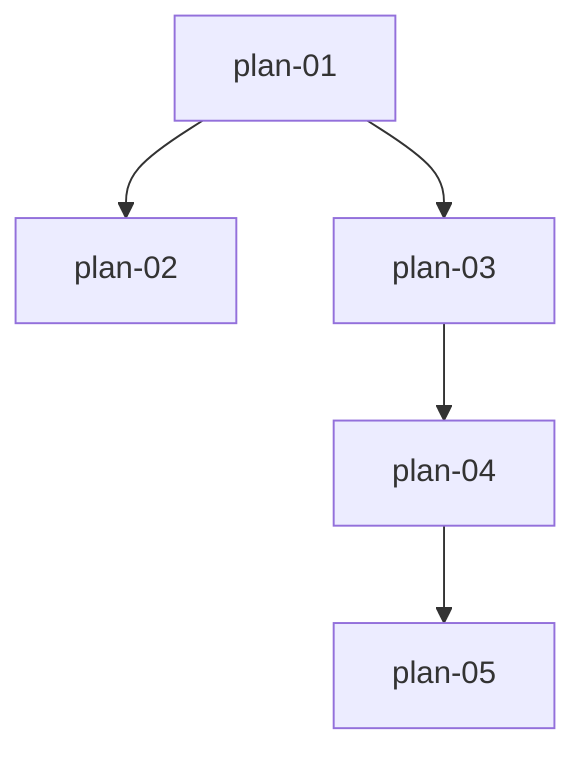

# 实现计划：ETF 份额与资金流监控

## 1. 概览

- **项目**: ETF 份额与资金流监控（第 14 期）
- **来源架构**: docs/14-ETF份额与资金流监控/14-1-架构文档-ETF份额与资金流监控.md
- **组织方式**: 功能维度（Feature-based）
- **项目类型**: brownfield
- **技术栈**: 后端 FastAPI + Python 3.11 + SQLAlchemy async + PostgreSQL + Tushare；前端 Next.js 16 + React 19 + TypeScript + SWR + ECharts + Tailwind
- **总阶段数**: 3
- **总功能数**: 5
- **最大并行度**: 2（Phase 2 的 plan-02 与 plan-03 可并行）
- **关键路径**: plan-01 → plan-03 → plan-04 → plan-05

## 2. 输入摘要

### 2.1 核心闭环与目标

接入 Tushare ETF 份额/净值/基础信息，每日收盘采集入库，按跟踪指数分组提供"指数排行"与"历史趋势"双视图。核心闭环：**采集 → 归集 → 聚合 → 渲染**。净流入额 = 份额变化 × 单位净值（估算），指数级数值为该指数下所有 ETF 加总。

### 2.2 关键 ADR 与实施护栏

| ADR | 要点 | 实施护栏 |
| --- | --- | --- |
| ADR-1 | 基础信息表 + 日份额表双表 | plan-01 必须同时建两表，慢变维度与高频事实分离 |
| ADR-2 | benchmark 文本规则标准化指数 | plan-01 的 EtfIndexClassifier 必须有宽基精确枚举 + 行业关键词 + other 兜底；归类失败不阻断 |
| ADR-3 | 净流入额入库时计算 | plan-01 采集时即算 share_change/net_inflow 并存储，查询直接读现成字段 |
| ADR-4 | 排行/明细/趋势分多端点 | plan-03 的 4 个查询端点各自独立，数据形态不同不可合并 |
| ADR-5 | 历史回填复用日常采集同口径方法 | plan-02 的 backfill_etf_history 必须调用 plan-01 的 sync_etf_daily，按日期升序，保证曲线无断裂 |
| ADR-6 | 定时任务遵循项目"注释注册"惯例 | plan-01 §9 的 _etf_daily_snapshot 注释注册，与现有所有 job 停用状态一致 |
| ADR-7 | 数值 Numeric 存储、float 序列化 | 份额存储万份、API 输出换算亿份；net_inflow 采集时按亿元算 |

### 2.3 现有代码快照

- **后端复用锚点**：`tushare_client.get_fund_list`（offset 分页范式）、`collector._update_sector_fund_flow`（on_conflict upsert）、`FundDataInitService`（progress/cancel 回调）、`init_sector_fund_flow.py`（admin 触发 + 并发保护）、`sector_fund_flow.py` 的 `_dict_to_camel`/`_serialize_value`（响应转换）、`TaskType` 枚举 + `@TaskRegistry.register`（任务注册）
- **前端复用锚点**：`sectorFundFlowApi`（apiClient.get + endpoint 不带 /api/v1）、`useSectorFundFlow.ts`（SWR 数组 key + .then(res=>res.data)）、`FundFlowRankingTable.tsx`（原生 table 四态）、`FundFlowTimeseriesChart.tsx`（dynamic echarts ssr:false）、`DashboardLayout.tsx` 的 `baseSidebarItems`（导航）

### 2.4 架构约束

- 数值单位契约：份额存储万份 / API 输出亿份（÷10000）；net_inflow 亿元；单位净值元
- 命名约定：query 参数 snake_case，响应 camelCase；sort_by/metric 参数值用 camelCase（特例）
- API 包裹 `{success, data}`；分页 page/page_size 默认 20
- 数据源已实测：fund_share 按 trade_date 全量 728 条、fund_nav 按 ts_code、fund_basic benchmark 自由文本

## 3. 验收标准追踪矩阵

| AC-ID | 需求原文 | 架构承接 | 计划承接 | 验证方式 | 当前状态 |
| --- | --- | --- | --- | --- | --- |
| AC-01 | 从导航进入默认显示宽基指数排行+骨架屏 | 前端页面 + 排行 API | plan-03, plan-05 | plan-05 §5 E2E + plan-03 §5 接口 | planned |
| AC-02 | 宽基/行业维度切换 | 排行 API + 前端 | plan-03, plan-05 | plan-05 §5 E2E | planned |
| AC-03 | 净流入额/份额变化/份额排序切换 | 排行 API | plan-03, plan-05 | plan-05 §5 E2E | planned |
| AC-04 | 展开指数查看 ETF 明细 | 排行 API（明细子查询）+ 前端 | plan-03, plan-05 | plan-05 §5 E2E | planned |
| AC-05 | 切换日期查看历史排行 | 排行 API | plan-03, plan-05 | plan-05 §5 E2E | planned |
| AC-06 | 切换到历史趋势视图并选对象 | 前端页面 + 趋势 API | plan-03, plan-05 | plan-05 §5 E2E | planned |
| AC-07 | 查看指数/ETF 份额与净流入额曲线 | 趋势 API + 前端 | plan-03, plan-05 | plan-05 §5 E2E | planned |
| AC-08 | 趋势视图下钻到单只 ETF | 趋势 API + 前端 | plan-03, plan-05 | plan-05 §5 E2E | planned |
| AC-09 | 趋势对象历史不足所选区间 | 趋势 API | plan-03, plan-05 | plan-05 §5 E2E | planned |
| AC-10 | 加载失败可重试 | 前端 + 两个 API | plan-03, plan-05 | plan-05 §5 E2E | planned |
| AC-11 | 从排行跳转趋势视图 | 前端页面 | plan-05 | plan-05 §5 E2E | planned |
| AC-12 | 管理员手动触发采集 | admin API + 采集器 | plan-01, plan-03 | plan-01 §5 执行验证（handler 直调）+ plan-03 §5 接口验证（admin POST /etf-daily 端点） | planned |
| AC-13 | 分页浏览 | 排行 API + 前端 | plan-03, plan-05 | plan-05 §5 E2E | planned |
| AC-14 | 管理员按日期初始化历史数据 | admin API + 历史回填 | plan-02 | plan-02 §5 执行验证 | planned |

## 4. 模块地图

| 功能 | 包含模块 | 类型 | 对应文件 |
| --- | --- | --- | --- |
| plan-01 | EtfBasic/EtfDaily 模型、Tushare 获取方法、EtfIndexClassifier、EtfDataInitService、collector、当日采集 task handler、定时任务、迁移 | service | plan-01-数据层与采集.md |
| plan-02 | backfill_etf_history service、历史回填 task handler、admin 历史回填端点 | service | plan-02-历史回填.md |
| plan-03 | EtfMonitorService、4 个查询路由、admin 当日采集端点 | service | plan-03-查询API.md |
| plan-04 | etfMonitorApi、etfMonitorTypes、SWR hooks、路由壳、导航菜单 | ui | plan-04-前端基础设施.md |
| plan-05 | EtfMonitorPage、EtfIndexRankingTable、EtfTrendChart、helpers | ui | plan-05-ETF监控页面.md |

## 5. 依赖图



节点使用 plan-ID 标识。

## 6. 阶段摘要

| 阶段 | 功能 | 说明 |
| --- | --- | --- |
| Phase 1 | plan-01 | 数据层与采集地基，后续所有功能依赖 |
| Phase 2 | plan-02, plan-03 | 历史回填与查询 API，可并行（两者都只依赖 plan-01，互不依赖） |
| Phase 3 | plan-04, plan-05 | 前端基础设施与监控页面，串行（plan-04 先于 plan-05） |

## 7. 任务总览

| 功能 | 阶段 | 包含维度 | 依赖 | 独立验收标准 |
| --- | --- | --- | --- | --- |
| plan-01: 数据层与采集 | Phase 1 | backend | 无 | 手动调 sync_etf_daily 采集约 700 只 ETF 落库、share_change/net_inflow 计算正确、归类正确率达标 |
| plan-02: 历史回填 | Phase 2 | backend | plan-01 | 按日期回填后趋势曲线连续无断裂、复用 sync_etf_daily 同口径 |
| plan-03: 查询 API | Phase 2 | backend | plan-01 | 4 个查询 + 1 个采集 admin 端点可用、指数汇总值=各 ETF 之和 |
| plan-04: 前端基础设施 | Phase 3 | frontend | plan-03 | API 客户端/SWR hooks/路由壳/导航菜单就绪、页面可空载渲染 |
| plan-05: ETF 监控页面 | Phase 3 | frontend | plan-04 | 双视图完整可用、覆盖 AC-01~AC-11/AC-13 所有交互 |

### 7.2 开发状态机

| FEAT | 当前步骤 | red_e2e | implement | green_e2e | review | 最近证据 | 阻塞原因 | 更新时间 |
| --- | --- | --- | --- | --- | --- | --- | --- | --- |
| plan-01 | done | done | done | done | done | docs/e2e/evidence/plan-01-e2e-green-2026-07-29.md | - | 2026-07-29 |
| plan-02 | done | done | done | done | done | docs/e2e/evidence/plan-02-e2e-green-2026-07-29.md | - | 2026-07-29 |
| plan-03 | done | done | done | done | done | docs/e2e/evidence/plan-03-e2e-green-2026-07-29.md | - | 2026-07-29 |
| plan-04 | done | done | done | done | done | docs/e2e/evidence/plan-04-e2e-green-2026-07-29.md | - | 2026-07-29 |
| plan-05 | done | done | done | done | done | docs/e2e/evidence/plan-05-e2e-green-2026-07-29.md | - | 2026-07-29 |

## 8. 未决策项

| 编号 | 问题 | 影响功能 | 需要谁决策 | 阻塞等级 |
| --- | --- | --- | --- | --- |
| Q1 | 指数归类规则对行业指数的覆盖率（宽基约 20 个易枚举，行业指数数量多，规则覆盖率需实测） | plan-01 | 开发者实测后迭代归类规则 | 低（归类失败兜底 other 不阻断，规则可迭代） |

## 9. 执行前置

### 9.1 环境准备

- PostgreSQL 运行中（`docker-compose up postgres -d`）
- `.env` 配置 `TUSHARE_TOKEN` / `TUSHARE_API_URL`（已存在）
- 后端依赖已安装（`cd server && pip install -r requirements.txt`）
- 前端依赖已安装（`cd web && npm install`）
- 可用 ETF 接口验证脚本 `scripts/test_etf_apis.py`（已存在，plan-01 前可重跑确认数据源可用）

### 9.2 执行顺序

1. **Phase 1**：plan-01（数据层与采集）— 必须最先，是所有功能的依赖
2. **Phase 2**：plan-02（历史回填）与 plan-03（查询 API）可并行 — 两者都只依赖 plan-01
3. **Phase 3**：plan-04（前端基础设施）→ plan-05（监控页面）— 串行，plan-05 依赖 plan-04 的 hooks/类型

### 9.3 全局验证

所有功能完成后执行：

```bash
# 后端
cd server
pytest
alembic upgrade head   # 确认迁移可执行

# 前端
cd web
npm run build
npx playwright test tests/e2e/etf-monitor.spec.ts
```

## 10. 变更记录

| 日期 | 变更类型 | 功能 | 说明 |
| --- | --- | --- | --- |
| 2026-07-29 | create | 全部 | 从架构文档 14-1 首次生成实现计划（plan-01~05） |

<!-- 保留目录：reviews/。当 task-review、dev-plan-check 等开始运行时创建。 -->
