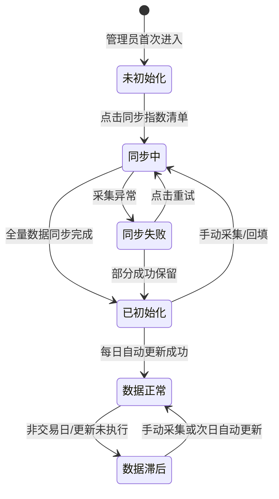
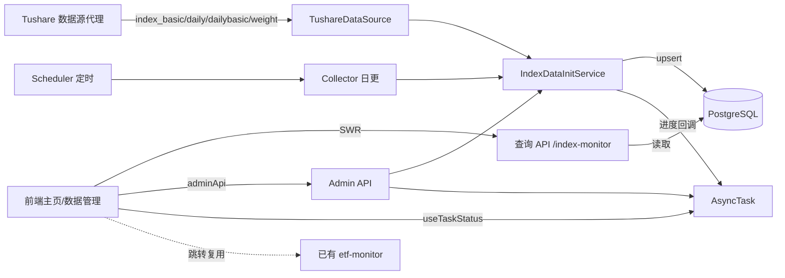
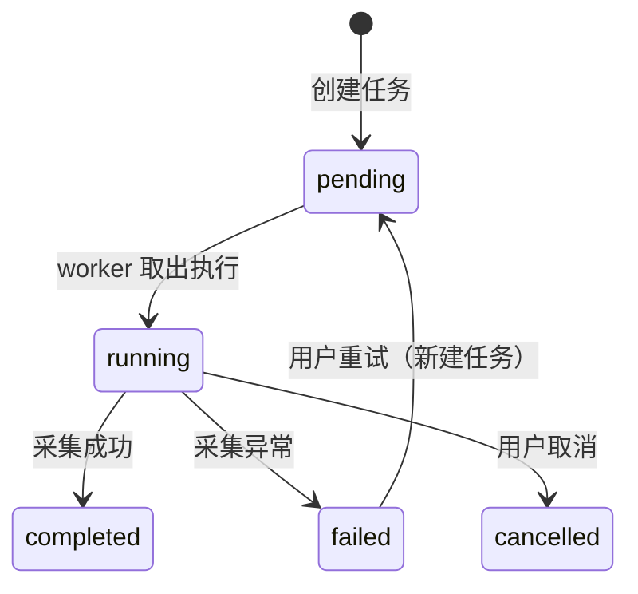

# 架构设计文档

_本文件只保留当前版本真正影响实现的架构决策、边界和契约；DDL、目录树、环境变量、实施故事等内容默认不放入正文。_

## 1. 系统摘要

基于已验证的指数数据接口，为管理员构建一个真实宽基指数监控面板，替换主页中的模拟市场强度模块。系统采集指数清单、日线行情、估值指标、成分权重四类数据，在主页呈现指数总览卡片、走势对比、估值水位、成分权重四个区块，并通过跳转复用已有 ETF 资金流监控。核心闭环：**采集 → 入库 → 查询 → 展示**。

## 2. 范围、非目标与成功标准

### 2.1 范围

1. 指数数据采集层：在 `TushareDataSource` 新增 4 个采集方法（指数清单 / 日线行情 / 估值指标 / 成分权重），复用现有重试限流机制
2. 指数数据模型：新建 4 张数据表（`index_basic` / `index_daily` / `index_dailybasic` / `index_weight`）
3. 指数采集服务：新建 `IndexDataInitService`，提供清单同步、历史回填、当日增量三个操作
4. 指数查询 API：新建 `/api/v1/index-monitor` 路由，提供总览、走势、估值、权重、关注清单查询
5. 指数数据同步入口：在管理后台数据管理页新增「指数数据」Tab，含同步操作 + 关注指数管理 + 同步记录
6. 指数监控主页：替换 `/dashboard` 主页内容，展示指数监控面板（仅管理员可见）
7. 每日自动更新：collector 日更流程加步骤 9，交易日收盘后增量同步指数数据

### 2.2 明确不做

- 指数级资金流向（数据源不提供；ETF 资金流归已有 etf-monitor 模块，面板跳转复用）
- 指数成分股的个股资金流聚合（个股资金流未采集，成本过高）
- 普通用户可见指数面板（仅管理员功能）
- 全球指数（数据源不支持）
- 指数技术指标计算（MACD/KDJ 等，后续迭代）
- 不替换现有 `market_index.py`（板块强度自算指数，两者并存）

### 2.3 成功标准

| 指标 | 首版目标 |
|------|---------|
| 指数行情数据真实性 | 全部来自真实接口，无模拟数据，数值与数据源一致 |
| 主页加载 | 总览接口响应时间 ≤ 2 秒（14 只指数 + 1 年数据量级） |
| 估值覆盖 | 6 只有估值的指数正常展示 PE/PB，8 只无估值的如实提示"暂无" |
| 历史回填 | 近 1 年数据（约 240 交易日 × 14 指数）分钟级完成 |
| 每日更新 | 交易日 18:00 后自动增量同步，次日首页展示最新行情 |

### 2.4 验收标准承接矩阵

| AC-ID | PRD 原文摘要 | 承接模块 | 关键链路 / 状态 | 风险 / 降级说明 |
|-------|-------------|---------|----------------|----------------|
| AC-01 | 主页指数总览展示 | 前端 IndexOverviewCards + 后端 /overview | 采集→入库→查询→渲染 | 数据未初始化时走空状态（AC-08） |
| AC-02 | 多指数走势对比 | 前端 IndexTrendChart + 后端 /trend | 查询 index_daily 多指数时间序列 | 无数据时图表显示空态 |
| AC-03 | 估值水位与分位 | 前端 IndexValuationChart + 后端 /valuation | 查询 index_dailybasic + 计算分位 | 无估值指数返回 has_data=false（AC-03 异常分支） |
| AC-04 | 成分权重展示 | 前端 IndexWeightTable + 后端 /weights | 查询 index_weight + 计算集中度 | 月度数据，取最近月快照 |
| AC-05 | ETF 资金跳转 | 前端 IndexOverviewCards 跳转链接 | 跳转 /dashboard/etf-monitor 带 index_code 参数 | 复用已有 etf-monitor，无新建 |
| AC-06 | 成分股跳转个股 | 前端 IndexWeightTable 跳转链接 | 跳转 /dashboard/stock-analysis/[id] | 复用已有个股分析页 |
| AC-07 | 关注指数管理 | 前端 IndexSyncPanel + 后端 /watchlist | 数据管理页→关注管理区→PUT /watchlist | 前置依赖：清单已同步 |
| AC-08 | 数据空状态 | 前端主页空状态组件 | 检测 index_daily 表为空→显示引导 | 跳转数据管理页指数数据Tab |
| AC-08a | 指数清单同步 | 后端 IndexDataInitService.sync_index_basic + admin /index-basic | pro.index_basic 全量拉取→upsert | 进度通过 AsyncTask 回调上报 |
| AC-08b | 历史数据回填 | 后端 IndexDataInitService.backfill_index_history + admin /index-history | 逐交易日升序采集→逐指数拉取→upsert | 失败按 AC-08d 恢复 |
| AC-08c | 同步互斥与进度 | 前端 IndexSyncPanel isAnySyncRunning + AsyncTask 状态 | isAnySyncRunning 禁用所有按钮 | 互斥在前端 + 后端 max_instances=1 双重保障 |
| AC-08d | 同步失败与恢复 | 后端 AsyncTask 重试 + 前端重试按钮 | 失败→记录错误→保留已成功→重试从失败点继续 | 已成功部分因 upsert 幂等不重复 |
| AC-09 | 真实数据验证 | 后端采集层 + 前端渲染 | 数据源原始值 vs 入库值 vs 页面值 | 三处一致即通过 |
| AC-10 | 每日自动更新 | 后端 collector 步骤 9 + scheduler | run_daily_update→_update_index_daily | 失败不中断主流程（try/except） |
| AC-11 | 非管理员不可见 | 前端主页 is_admin 判断 + 后端 get_current_user | isAdmin=false→主页回退通用内容 | 前端 + 后端双重校验 |
| AC-12 | 当日未更新降级 | 后端 /overview 查最近有数据日 + 前端角标注日期 | 查询 index_daily 最大 trade_date | 非交易日/未同步时自动回退 |
| AC-13 | 个别指数失败隔离 | 前端卡片独立错误态 + 后端逐指数 try/except | 单指数查询失败→该卡片显示错误 | 不影响其他指数卡片 |

## 3. 用户流程与状态

### 3.1 主流程

```
管理员登录
→ 进入主页（/dashboard）
→ 系统检测 is_admin
  ├─ 是 → 渲染指数监控面板（AC-11）
  │   ├─ 加载 /overview → 总览卡片网格（AC-01）
  │   ├─ 滚动 → 走势对比图（AC-02）
  │   ├─ 估值水位图（AC-03）
  │   └─ 成分权重表（AC-04）
  │       ├─ 点击「ETF 资金」→ 跳转 etf-monitor（AC-05）
  │       └─ 点击成分股 → 跳转个股分析（AC-06）
  └─ 否 → 渲染通用内容（AC-11）
→（按需）跳转数据管理页→指数数据Tab→同步/关注管理（AC-07/08a/08b）
→ 返回主页，完成研判
```

### 3.2 关键分支

| 分支名 | 入口/触发条件 | 架构处理方式 |
|--------|-------------|-------------|
| 数据未初始化 | index_daily 表为空 | 主页渲染空状态组件，引导跳转数据管理页 |
| 当日未更新 | 非交易日或数据未同步 | /overview 查询最近有数据交易日，卡片角标注日期 |
| 个别指数失败 | 某指数采集/查询异常 | 该卡片独立错误态，其余正常 |
| 无估值指数 | index_dailybasic 无该指数记录 | 估值区显示"暂无估值数据"提示 |
| 同步任务运行中 | 某采集任务进行中 | 所有同步按钮禁用 + 进度展示 |
| 同步失败 | 采集任务异常终止 | 进度暂停 + 错误提示 + 可重试 |

### 3.3 状态机



关键规则：
- "未初始化"指 index_daily 表为空，主页触发空状态
- "同步中"为互斥态，同时只允许一个采集任务
- "同步失败"保留已成功部分（upsert 幂等），重试从失败点继续
- "数据滞后"不阻塞使用，展示最近有数据交易日

## 4. 系统上下文与模块职责

### 4.1 系统上下文



### 4.2 模块职责

| 模块 | 职责 | 上游输入 | 下游输出 |
|------|------|---------|---------|
| `TushareDataSource`（扩展） | 新增 4 个指数采集方法 | Tushare pro 接口 | 原始 dict 列表 |
| `IndexDataInitService`（新建） | 指数数据采集编排：清单同步/历史回填/当日增量 | TushareDataSource + 关注清单 | upsert 4 张指数表 + 进度回调 |
| `index_monitor.py` 查询 API（新建） | 指数行情/估值/权重/关注查询 | PostgreSQL 指数表 | JSON 响应（camelCase） |
| `IndexDataInitService` admin 路由（新建） | 异步任务触发：清单/历史/当日 | 前端 adminApi 调用 | AsyncTask task_id |
| 前端 `IndexMonitorPage`（新建） | 主页面板容器：总览卡片+走势+估值+权重 | 查询 API | 渲染指数监控面板 |
| 前端 `IndexSyncPanel`（新建） | 数据管理页指数Tab：同步操作+关注管理+记录表 | admin API + useTaskStatus | 同步触发+关注更新+进度展示 |
| `Collector`（扩展步骤 9） | 每日增量同步指数数据 | IndexDataInitService.sync_index_daily | results['index_daily_updated'] |

**复用声明与验证：**
- 复用 `DataSourceFactory.create()` 获取 `TushareDataSource` 实例 → 验证：工厂返回的实例已注入代理 URL 和 token，新增方法直接 `_get_pro_api()` 即可
- 复用 `AsyncTask` 异步任务框架 → 验证：已有 ETF admin 路由验证该范式，task_type 注册 + BackgroundTasks 异步执行 + 进度回调
- 复用 `useTaskStatus` Hook → 验证：已有 ETF 同步面板验证轮询 + onProgress/onComplete/onFailed 回调
- 复用已有 etf-monitor 页面 → 验证：支持 index_code query 参数筛选（index-detail 端点）
- 复用 `_dict_to_camel` / `_serialize_value` / `{success,data}` 包裹 → 验证：已有 ETF 监控路由已定义，新建路由照抄

> 注：上表中 TushareDataSource、Collector 为已有模块的扩展（新增方法/步骤），非新建模块。实际新建模块为 4 个：IndexDataInitService、index_monitor 查询 API、IndexMonitorPage 前端面板、IndexSyncPanel 同步面板。符合精简模式模块 ≤6 约束。

### 4.3 需要刻意避免的过度设计

| 不引入的模块/组件 | 原因 |
|------------------|------|
| 指数数据独立同步页面（独立路由） | PRD 决策：放入已有数据管理页 Tab，不新建路由页 |
| 关注指数独立表 | 用 `index_basic.is_watched` 布尔字段，不建独立 watchlist 表 |
| 指数资金流模块 | 数据源不提供，不做 |
| 个股资金流采集 | 成本过高，后续迭代 |
| 指数技术指标计算引擎 | 本期只做行情展示与估值水位 |
| Redis/消息队列 | 采集量级小（14 指数 × 240 日），AsyncTask 足够 |
| 多数据源抽象 | 当前只有一个数据源代理，不需要 Provider 注册中心 |

## 5. 关键架构决策（ADR）

### ADR-1：采集方法挂在 TushareDataSource，不新建数据源类
- **选择**：在现有 `TushareDataSource` 类中新增 4 个 `get_index_*` 方法
- **理由**：数据源工厂模式已统一，代理 URL/token/重试限流全部复用；新建类会破坏工厂一致性且无独立数据源需求。不新建独立 DataSource 的理由：只有一个数据源代理，无需多态
- **风险与对策**：TushareDataSource 方法增多 → 可接受，已有 20 个方法，新增 4 个不构成维护负担

### ADR-2：关注清单用 is_watched 字段，不建独立表
- **选择**：在 `index_basic` 表增加 `is_watched Boolean default false` 字段
- **理由**：关注关系是 index_basic 的简单布尔属性，1:1 关系，无独立查询场景。不建独立 watchlist 表的理由：只有单一读写场景（标记/取消标记），独立表增加 JOIN 成本无收益
- **演进余地**：如未来需要多用户各自关注清单，再升级为 user_id + ts_code 关联表

### ADR-3：估值分位前端计算，不在后端存储
- **选择**：PE/PB 分位数由前端 /valuation 接口返回时间序列后在前端计算百分位
- **理由**：分位依赖时间窗口（近1年），是查询时动态计算的派生值，预计算存储会引入窗口变更同步问题。不在后端计算的理由：后端返回原始序列，前端 ECharts 渲染时顺带算分位，链路最短
- **风险与对策**：前端计算精度 → JS 浮点运算对分位数足够（取整百分比展示）

### ADR-4：数据同步入口挂入数据管理页 Tab，不建独立路由页
- **选择**：在 `/dashboard/admin/data` 页面新增「指数数据」Tab，复用 Tab 切换框架
- **理由**：PRD 明确要求"放在数据管理页面"；已有 Tab 框架（`data/page.tsx` 5 个 Tab），新增一个成本极低。不建独立路由页的理由：与 ETF/Fund/Limit 的独立页模式不同是 PRD 显式决策
- **风险与对策**：Tab 内容较多（同步+关注+记录三区块） → 用卡片分区，垂直排列

### ADR-5：主页指数面板通过 is_admin 条件渲染，不新建独立路由
- **选择**：修改 `/dashboard/page.tsx`，isAdmin 时渲染指数面板，否则渲染原有通用内容
- **理由**：PRD 明确"替换主页内容"，不需要独立路由。is_admin 已由前端 auth context 提供。保留原有内容给非管理员，避免功能回归
- **风险与对策**：主页代码膨胀 → 指数面板抽取为 `IndexMonitorPage` 组件，主页只做条件渲染分发

### 5.x 待确认问题

无。所有关键决策已确定。

## 6. 运行链路

### 6.1 指数清单同步

1. 管理员在数据管理页「指数数据」Tab 点击「同步指数清单」
2. 前端调用 `adminApi.initIndexBasic()` → POST `/api/v1/admin/init/index-basic`
3. 后端创建 AsyncTask（task_type=`sync_index_basic`），BackgroundTasks 异步执行
4. `IndexDataInitService.sync_index_basic()` 调用 `TushareDataSource.get_index_basic()` 拉全量
5. 逐行映射字段 → pg upsert `index_basic`（冲突键 ts_code，on_conflict_do_update）
6. 预置 14 只关注指数 `is_watched=true`
7. 进度通过 AsyncTask progress_callback 上报，前端 useTaskStatus 轮询展示

实现原则：
- 全量拉取约 11610 条，单次接口返回，无需分页
- upsert 保证幂等，重复同步不产生重复记录
- `index_basic(name=...)` 参数在代理上不生效（已验证），无需传 name 过滤
- 前置依赖：清单未同步时，历史回填、当日采集和关注管理操作均不可用（前端按钮禁用 + 后端校验 index_basic 表非空）

### 6.2 历史数据回填

1. 管理员选择日期范围（默认近1年），点击「开始回填」
2. 前端调用 `adminApi.initIndexHistory(start, end)` → POST `/api/v1/admin/init/index-history`
3. 后端创建 AsyncTask（task_type=`backfill_index_history`）
4. `IndexDataInitService.backfill_index_history(start, end)`：
   a. 查询交易日历获取日期范围内的交易日列表（升序）
   b. 查询 `index_basic WHERE is_watched=true` 获取关注指数清单
   c. 逐交易日、逐指数调用 `get_index_daily` / `get_index_dailybasic` / `get_index_weight`
   d. 每个交易日完成后 upsert 入库 + 上报进度（current/total）
5. 前端 useTaskStatus 轮询展示进度条「回填中（N / 总量交易日）」

实现原则：
- 交易日升序处理，失败时已成功部分保留（upsert 幂等）
- 每个采集方法走 `_execute_with_retry`（3 次重试 + 指数退避）
- 单指数单日失败不中断，记 error 继续下一只
- `get_index_dailybasic` 对无估值的指数返回空 DataFrame，跳过即可
- `get_index_weight` 是月度数据，同月内多日只取一次（缓存当月已拉取标记）

### 6.3 当日增量采集

1. 管理员点击「立即采集」或 scheduler 触发
2. `IndexDataInitService.sync_index_daily(trade_date)`：
   a. 查询关注指数清单
   b. 逐指数调用 `get_index_daily` / `get_index_dailybasic`（当日）
   c. 调用 `get_index_weight`（当月，如已入库则跳过）
   d. upsert 入库
3. collector 日更步骤 9 调用此方法（try/except 不中断主流程）

实现原则：
- collector 集成：`run_daily_update` 在步骤 8（ETF）后加步骤 9，`results` 加 `index_daily_updated` 计数键
- 失败 append 到 `results['errors']`，不抛出

### 6.4 主页查询渲染

1. 管理员进入 `/dashboard`，前端检测 `isAdmin`
2. isAdmin=true → 渲染 `IndexMonitorPage`
3. IndexMonitorPage 并发请求：
   a. `GET /index-monitor/overview` → 总览卡片数据
   b. `GET /index-monitor/watchlist` → 关注清单（用于走势/估值/权重选择器）
4. 用户在走势对比图选择指数 → `GET /index-monitor/trend?ts_codes=...&start_date=...&end_date=...`
5. 用户在估值图选择指数 → `GET /index-monitor/valuation?ts_code=...`
6. 用户在权重表选择指数 → `GET /index-monitor/weights?index_code=...&top_n=20`
7. 点击 ETF 资金 → 跳转 `/dashboard/etf-monitor?index_code=000300.SH`

实现原则：
- SWR 缓存查询结果，key 按 endpoint + 参数区分
- overview 查最近有数据交易日：`SELECT MAX(trade_date) FROM index_daily`
- 估值分位前端计算：对返回的 pe_ttm 序列排序，计算当前值的百分位
- 归一化模式：以选择区间首日收盘价为基准（=100），展示后续日期相对基准的百分比变化
- ETF 跳转：EtfMonitorPage 需新增 useSearchParams 读取 index_code 参数并自动展开对应指数详情（小幅改造已有页面，非新建）

## 7. 领域对象与关键契约

### 7.1 核心对象

| 对象名 | Source of Truth | Owner | 用途 |
|--------|----------------|-------|------|
| IndexBasic | `index_basic` 表 | IndexDataInitService | 指数清单 + 关注标记 |
| IndexDaily | `index_daily` 表 | IndexDataInitService | 指数日线行情 |
| IndexDailyBasic | `index_dailybasic` 表 | IndexDataInitService | 估值指标（PE/PB/换手率） |
| IndexWeight | `index_weight` 表 | IndexDataInitService | 成分股权重（月度） |

### 7.2 推荐最小 Schema

**领域对象（存储字段，snake_case）：**

```typescript
// === 存储层（数据库列名，snake_case）===

interface IndexBasic {
  id: number;
  ts_code: string;           // 唯一，如 "000300.SH"
  name: string;              // 简称，如 "沪深300"
  market: string;            // SSE/SZSE/CSI/SW
  publisher: string;         // 发布方
  category: string;          // 规模指数/综合指数等
  base_date: string;         // 基期 YYYY-MM-DD
  base_point: number;        // 基点
  list_date: string;         // 发布日期
  is_watched: boolean;       // 是否关注（用户可配置）
}

interface IndexDaily {
  id: number;
  trade_date: string;        // YYYY-MM-DD
  ts_code: string;
  open: number; high: number; low: number; close: number;
  pre_close: number;
  change: number;            // 涨跌点
  pct_chg: number;           // 涨跌幅 %
  vol: number;               // 成交量（手）
  amount: number;            // 成交额（千元）
}

interface IndexDailyBasic {
  id: number;
  trade_date: string;
  ts_code: string;
  total_mv: number;          // 总市值（元）
  float_mv: number;          // 流通市值（元）
  total_share: number;       // 总股本（股）
  float_share: number;       // 流通股本（股）
  free_share: number;        // 自由流通股本（股）
  turnover_rate: number;     // 换手率 %
  turnover_rate_f: number;   // 自由流通换手率 %
  pe: number; pe_ttm: number; pb: number;
}

interface IndexWeight {
  id: number;
  index_code: string;        // 指数代码
  con_code: string;          // 成分股代码
  trade_date: string;        // 月度日期
  weight: number;            // 权重 %
}
```

**API 响应输出（经 _dict_to_camel 转 camelCase）：**

```typescript
// === API 响应层（输出字段，camelCase）===

interface IndexOverviewItem {
  tsCode: string;
  name: string;
  close: number;
  pctChg: number;            // 涨跌幅 %
  amount: number;            // 成交额（亿元，后端已换算）
  peTtm: number | null;      // 无估值时 null
  tradeDate: string;         // 行情日期
}

interface IndexOverviewResponse {
  success: boolean;
  data: {
    indices: IndexOverviewItem[];
    tradeDate: string;       // 最近有数据交易日
  };
}

interface IndexTrendResponse {
  success: boolean;
  data: {
    series: Array<{
      tsCode: string;
      name: string;
      points: Array<{ tradeDate: string; close: number }>;
    }>;
    hasData: boolean;
  };
}

interface IndexValuationResponse {
  success: boolean;
  data: {
    tsCode: string;
    points: Array<{
      tradeDate: string;
      peTtm: number | null;
      pb: number | null;
      turnoverRate: number | null;
    }>;
    hasData: boolean;        // false 时前端显示"暂无估值数据"
  };
}

interface IndexWeightResponse {
  success: boolean;
  data: {
    indexCode: string;
    tradeDate: string;
    weights: Array<{
      conCode: string;
      name: string;         // JOIN stock_basic 取名称
      weight: number;
    }>;
    concentration: {
      top5: number;         // 前5合计权重 %
      top10: number;        // 前10合计权重 %
    };
  };
}
```

### 7.3 API 边界

**查询 API（prefix `/api/v1/index-monitor`）：**

| 接口路径 | 方法 | 用途 | 对应交互 |
|---------|------|------|---------|
| `/index-monitor/overview` | GET | 关注指数当日总览 | AC-01 主页总览卡片 |
| `/index-monitor/trend` | GET | 多指数收盘点位时间序列 | AC-02 走势对比图 |
| `/index-monitor/valuation` | GET | 单指数 PE/PB/换手率时间序列 | AC-03 估值水位图 |
| `/index-monitor/weights` | GET | 指数前 N 成分权重 + 集中度 | AC-04 成分权重表 |
| `/index-monitor/watchlist` | GET | 关注指数清单 | AC-07 走势/估值/权重选择器 |
| `/index-monitor/watchlist` | PUT | 更新关注清单 | AC-07 关注管理保存 |

**查询参数约定：**
- `ts_codes`（trend）：逗号分隔多指数代码，如 `000300.SH,000001.SH`
- `ts_code`（valuation）：单指数代码
- `index_code`（weights）：单指数代码
- `start_date` / `end_date`：YYYY-MM-DD，默认近1年
- `top_n`（weights）：10/20/30，默认 20
- `ts_codes`（trend）数量约束：最少 1 只，不限制最多数量（关注指数级 ≤50），前端默认全选
- `ts_codes`（watchlist PUT）：数组顺序即关注清单顺序，后端按 index_basic.sort_order 持久化（0 起）；GET /watchlist、/overview 按 sort_order 升序（未设置排后，ts_code 兜底）返回，保证主页展示顺序与清单一致
- 分页：列表类 GET 默认支持 page + page_size，但 overview/watchlist 为关注指数级（≤50），无需分页

**Admin 同步 API（prefix `/api/v1/admin/init`）：**

| 接口路径 | 方法 | 用途 | 返回 |
|---------|------|------|------|
| `/admin/init/index-basic` | POST | 同步指数清单 | `{ task_id }` |
| `/admin/init/index-history` | POST | 历史回填 | `{ task_id }`，body: `{ start_date, end_date }` |
| `/admin/init/index-daily` | POST | 当日增量采集 | `{ task_id }` |

**API 契约约定：**
- 响应包裹：`{ success: boolean, data: {...} }`（与 etf_monitor.py 一致）
- 命名转换：后端 snake_case → 响应经 `_dict_to_camel` 转 camelCase；query 参数保持 snake_case（如 `ts_codes`、`start_date`）
- 序列化：date → ISO 字符串（`_serialize_value`）、Decimal → float、成交额后端 ÷10000 转亿元再输出
- 安全：业务 GET 用 `Depends(get_current_user)`，admin POST 用管理员校验
- task_type 常量：`SYNC_INDEX_BASIC` / `BACKFILL_INDEX_HISTORY` / `SYNC_INDEX_DAILY`，需注册到 `api.ts` TaskType 和 TaskMonitorPanel 中文映射

### 7.4 状态流转

异步任务状态机（复用已有 AsyncTask）：



### 7.5 数据边界

| 存储层 | 职责 | 数据 |
|--------|------|------|
| PostgreSQL `index_basic` | 指数清单 + 关注标记 | 全量指数目录（约1万条），is_watched 标记关注 |
| PostgreSQL `index_daily` | 指数日线行情 | 关注指数近1年，约 240 日 × 14 指数 |
| PostgreSQL `index_dailybasic` | 估值指标 | 仅6只有估值的指数，同范围 |
| PostgreSQL `index_weight` | 成分权重 | 月度，关注指数的最新月快照 |
| 前端 SWR 缓存 | 查询结果临时缓存 | 按 endpoint+params 为 key，focus 重验证 |

### 7.6 命名与标识规则

| 项目 | 规则 |
|------|------|
| 指数代码 | Tushare 格式 `000300.SH` / `399006.SZ` / `931643.CSI` / `899050.BJ`，原样存储不做转换 |
| 数据库列名 | snake_case（`ts_code` / `pe_ttm` / `pct_chg`） |
| API 响应字段 | camelCase（`tsCode` / `peTtm` / `pctChg`），经 `_dict_to_camel` 转换 |
| API query 参数 | snake_case（`ts_code` / `start_date`），与 etf_monitor 一致 |
| task_type | `sync_index_basic` / `backfill_index_history` / `sync_index_daily` |
| 成交额单位 | 数据库存千元（Tushare 原始），API 输出转亿元（÷10000） |
| 成交量单位 | 手（Tushare 原始），前端直接展示 |

## 8. 非功能需求、风险与运行策略

### 8.1 性能与吞吐量目标

| 指标 | 目标 | 预期并发 |
|------|------|---------|
| /overview 响应 | ≤ 2 秒（14 指数当日行情） | 单管理员 |
| /trend 响应 | ≤ 1 秒（6 指数 × 240 日） | 单管理员 |
| /valuation 响应 | ≤ 500ms（单指数 × 240 日） | 单管理员 |
| /weights 响应 | ≤ 500ms（单指数 × 300 成分股） | 单管理员 |
| 历史回填 | ≤ 10 分钟（14 指数 × 240 交易日） | 单任务 |
| 数据源限流 | 0.3 秒/请求（200 次/分钟） | 串行 |

### 8.2 可靠性、错误处理与降级策略

| 降级级别 | 触发条件 | 系统行为 |
|---------|---------|---------|
| L1 个别指数失败 | 单指数采集/查询异常 | 该指数卡片显示"数据获取失败"，其余正常（AC-13） |
| L2 估值不可用 | index_dailybasic 无该指数数据 | 估值区显示"暂无估值数据"（AC-03 异常分支） |
| L3 当日未更新 | 非交易日/同步未执行 | 展示最近有数据交易日，角标注日期（AC-12） |
| L4 数据未初始化 | index_daily 表为空 | 全页空状态 + 引导跳转（AC-08） |
| L5 同步任务失败 | 采集异常终止 | 进度暂停 + 错误提示 + 可重试（AC-08d） |

### 8.3 安全与反滥用策略

| 项目 | 首版策略 |
|------|---------|
| 指数面板可见性 | 仅管理员（is_admin），前端条件渲染 + 后端 get_current_user 双重校验 |
| Admin 同步接口 | 管理员权限校验（与 etf-basic 等一致） |
| 数据源 Token | 服务端持有，不暴露前端 |
| SQL 注入 | SQLAlchemy 参数化查询（与 etf_monitor_service 一致） |

### 8.4 成本控制预期

| 模块 | 预估单次成本 | 首版控制策略 |
|------|------------|-------------|
| 历史回填 | 14 指数 × 240 日 × 3 接口 ≈ 10080 次请求 | 仅回填一次，后续增量 |
| 每日更新 | 14 指数 × 1 日 × 2 接口 ≈ 28 次/日 | 仅交易日执行 |
| 成分权重 | 14 指数 × 1 次/月 ≈ 14 次/月 | 月度缓存，同月不重复拉 |

### 8.5 可观测性

| 项目 | 方案 |
|------|------|
| 采集日志 | IndexDataInitService 内 logger.info/warning，与 etf 一致 |
| 任务监控 | AsyncTask 状态 + 进度 + 日志，复用 /admin/tasks 监控页 |
| 日更日志 | DataUpdateLog 记录 index_daily_updated 计数 + errors |
| 前端错误 | SWR onError + toast 提示（与 EtfSyncPanel 一致） |

### 8.6 主要风险

| 风险 | 影响 | 缓解方式 |
|------|------|---------|
| 数据源代理不稳定 | 采集失败 | _execute_with_retry 3 次重试 + 指数退避；不可恢复错误短路 |
| 估值覆盖不全（仅6只） | 8 只指数无估值 | 如实展示"暂无估值"，不混数据源补齐 |
| index_weight 月度更新滞后 | 权重不是最新 | 取最近月快照，标注日期 |
| 成分股名称需 JOIN | 权重表只有 con_code 无名称 | weights 接口 JOIN stock_basic 取 name，如无则显示代码 |
| 主页替换影响非管理员 | 普通用户看到空白 | is_admin 条件渲染，非管理员走原有内容 |

## 9. 实施方案

### Phase A：数据层 + 采集层

**后端**

1. `server/src/models/index_monitor.py` — 新建 4 个模型（IndexBasic / IndexDaily / IndexDailyBasic / IndexWeight），范式对齐已有 ETF 模型（Integer 主键 + Numeric + UniqueConstraint + Index）。IndexBasic 加 `is_watched` 布尔字段。
2. `server/src/models/__init__.py` — 注册 4 个模型（import + `__all__`）。
3. `server/alembic/versions/` — 新建 alembic 迁移文件，autogenerate 建表，接当前 head，迁移可正常执行。
4. `server/src/services/data_acquisition/tushare_client.py` — 新增 4 个方法：`get_index_basic()` / `get_index_daily(ts_code, start_date, end_date)` / `get_index_dailybasic(ts_code, start_date, end_date)` / `get_index_weight(index_code, start_date, end_date)`，范式对齐已有申万行业采集方法，返回原始 dict 列表。
5. `server/src/services/data_init_index.py` — 新建 `IndexDataInitService`（范式对齐已有 ETF 采集服务），方法：`sync_index_basic()` / `backfill_index_history(start, end)` / `sync_index_daily(trade_date)`。含 progress/cancel 回调 + pg upsert。

验证目标：admin 手动触发 init-index-basic → index_basic 表有数据（≥10000 条，14 只 is_watched=true）；init-index-history → 4 张表有近1年数据。

### Phase B：查询 API + Admin 路由

**后端**

6. `server/src/api/v1/index_monitor.py` — 新建查询路由（prefix `/index-monitor`），端点：`GET /overview` / `GET /trend` / `GET /valuation` / `GET /weights` / `GET /watchlist` / `PUT /watchlist`。范式对齐已有 ETF 监控路由（helper + 响应包裹 + 鉴权）。
7. `server/src/api/v1/__init__.py` — 注册 index_monitor 路由。
8. `server/src/api/admin/init_index_basic.py` — 新建 admin 路由：POST /index-basic / /index-history / /index-daily，BackgroundTasks 异步 + AsyncTask，prefix `/admin/init`。
9. `server/src/api/admin/__init__.py` — 注册 init_index_basic 路由。

验证目标：curl 各查询端点返回真实数据（非空、非模拟）；admin 触发同步返回 task_id，任务监控页可见。

### Phase C：日更集成 + 前端

**后端**

10. `server/src/services/data_updater/collector.py` — `run_daily_update` 加步骤 9 `_update_index_daily()`（try/except 不中断主流程），`results` 加计数键。
11. `server/src/services/scheduler/job_manager.py` — 新增指数日更 job（注释停用，admin 手动触发为主）。

**前端**

12. `web/src/types/indexMonitorTypes.ts` — 定义 TS 类型（IndexOverviewItem / TrendSeries / ValuationPoint / WeightItem）。
13. `web/src/lib/api.ts` — 新增 `indexMonitorApi`；admin 区块加指数同步方法；TaskType 加 3 个常量 + 中文映射。
14. `web/src/components/dashboard/DashboardLayout.tsx` — 无需改菜单（主页替换，不加侧边栏项）。
15. `web/src/app/dashboard/page.tsx` — 改造：`isAdmin` 时渲染 `<IndexMonitorPage />`，否则保留原有内容。
16. `web/src/components/index-monitor/IndexMonitorPage.tsx` — 面板容器：顶部关注指数概览 + 下方分析区。
17. `web/src/components/index-monitor/IndexOverviewCards.tsx` — 总览卡片网格（收盘/涨跌幅红涨绿跌/成交额亿元/市盈率TTM 或"暂无估值"），含 ETF 资金跳转按钮。
18. `web/src/components/index-monitor/IndexTrendChart.tsx` — ECharts 多指数走势对比（归一化切换 + 量级不同可分别对比）。
19. `web/src/components/index-monitor/IndexValuationChart.tsx` — ECharts 估值水位（市盈率TTM/市净率时间序列 + 前端算分位 + 无估值提示）。
20. `web/src/components/index-monitor/IndexWeightTable.tsx` — 成分权重表（前 N + 集中度 + 跳转个股分析）。
21. `web/src/components/index-monitor/IndexSyncPanel.tsx` — 数据管理页指数Tab 内容：三同步卡片 + 关注管理区 + 同步记录表（范式对齐已有 ETF 同步面板，含互斥锁 + 任务轮询）。
22. `web/src/components/index-monitor/helpers.ts` — 格式化/颜色（红涨绿跌）/单位换算工具。
23. `web/src/app/dashboard/admin/data/page.tsx` — 新增「指数数据」Tab（渲染 `<IndexSyncPanel />`）。
24. `web/src/components/admin/TaskMonitorPanel.tsx` — 任务类型中文映射补 3 个指数 task_type。

验证目标：管理员登录主页 → 看到指数监控面板（AC-01~06）；数据管理页指数Tab → 同步/关注管理正常（AC-07/08a-d）；非管理员 → 主页原有内容（AC-11）。

## 10. 架构结论

首版架构的核心判断：

1. **最大化复用第 14 期 ETF 链路范式**——数据模型（etf.py）、采集服务（data_init_etf.py）、查询 API（etf_monitor.py）、admin 路由（init_etf_daily.py）、前端同步面板（EtfSyncPanel.tsx）均有成熟模板，指数监控严格对齐，降低实现风险。

2. **数据入口收敛到数据管理页**——同步操作和关注管理同页，不建独立路由页，符合 PRD 决策且减少前端路由膨胀。

3. **关注标记用字段不用表**——is_watched 布尔字段满足 1:1 标记场景，避免过度设计。

4. **估值如实展示覆盖范围**——6 只有估值、8 只提示暂无，不混数据源补齐，保持口径统一。

5. **主页条件渲染不新建路由**——isAdmin 分发，指数面板和原有内容并存，降低回归风险。

演进方向：若后续需要科创/中证1000 估值补齐，可调研 akshare 等替代数据源；若需多用户关注清单，is_watched 升级为 user_id + ts_code 关联表；若需指数资金流，评估成分股资金流聚合方案。
