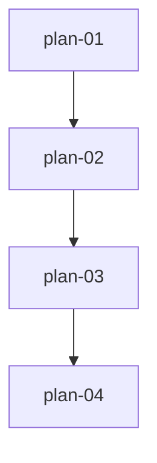

# 实现计划：关键指数监控面板

## 1. 概览

- **项目**: 关键指数监控面板（第 15 期）
- **来源架构**: `docs/15-关键指数监控面板/15-1-架构文档-关键指数监控面板.md`
- **组织方式**: 功能维度（Feature-based）
- **项目类型**: Brownfield（在已有板块强度分析平台上新增指数监控能力）
- **技术栈**: 后端 Python 3.12 / FastAPI / SQLAlchemy 2.0 async / PostgreSQL / Alembic / APScheduler；前端 Next.js 16 / React 19 / TypeScript / Tailwind 4 / ECharts 6 / SWR
- **总阶段数**: 2
- **总功能数**: 4
- **最大并行度**: 1（同一时刻执行一个功能，链式依赖）
- **关键路径**: plan-01 → plan-02 → plan-03 → plan-04

## 2. 输入摘要

### 2.1 核心闭环与目标

核心闭环：**采集 → 入库 → 查询 → 展示**。基于已验证的 Tushare 指数接口（index_basic / index_daily / index_dailybasic / index_weight），为管理员构建真实宽基指数监控面板，替换主页中的模拟市场强度模块。面板展示指数总览卡片、走势对比、估值水位、成分权重四个区块，数据同步和关注管理合并到数据管理页的指数数据 Tab。

### 2.2 关键 ADR 与实施护栏

| ADR | 核心决策 | 实施护栏 |
|-----|---------|---------|
| ADR-1 | 采集方法挂在 TushareDataSource | 不新建数据源类，复用 `_get_pro_api()` + `_execute_with_retry` |
| ADR-2 | 关注清单用 is_watched 字段 | 不建独立 watchlist 表，IndexBasic 加布尔字段 |
| ADR-3 | 估值分位前端计算 | 不在后端预存储分位，/valuation 返回原始序列 |
| ADR-4 | 同步入口挂数据管理页 Tab | 不建独立路由页，扩 data/page.tsx 的 Tab 枚举 |
| ADR-5 | 主页 is_admin 条件渲染 | 不新建路由，改 dashboard/page.tsx 条件分发 |

### 2.3 现有代码快照

- **后端范式锚点**: ETF 全链路（etf.py / data_init_etf.py / etf_monitor.py / init_etf_daily.py）是最贴近的模板，严格对齐
- **前端范式锚点**: EtfSyncPanel.tsx（同步面板）、EtfMonitorPage.tsx（查询页面）、data/page.tsx（Tab 聚合页）
- **路由前缀链**: 业务路由 `APIRouter(prefix="/index-monitor")` → v1 挂 `/v1` → app 挂 `/api` = `/api/v1/index-monitor/*`；admin 路由 `APIRouter(prefix="/init")` → admin 挂 `/v1/admin` → 端点 `/index-basic` = `/api/v1/admin/init/index-basic`
- **前端 baseURL**: `API_BASE_WITH_PREFIX = ${API_BASE_URL}/api/v1`，endpoint 字符串不带 `/api/v1` 前缀
- **数据源代理**: `TUSHARE_API_URL=https://ts.gyzcloud.top/api`，`TUSHARE_TOKEN` 已配置

### 2.4 架构约束

- 成交额：数据库存千元（Tushare 原始），API 输出转亿元（÷10000）
- 成交量：手（Tushare 原始），前端直接展示
- 涨跌幅颜色：红涨绿跌（中国市场惯例）
- 估值覆盖：仅 6 只核心指数有 index_dailybasic 数据，其余 8 只如实提示"暂无估值"
- index_basic(name=...) 参数在代理上不生效，不能靠 name 过滤查代码
- 清单同步是回填/采集/关注管理的前置条件

## 3. 验收标准追踪矩阵

| AC-ID | 需求原文 | 架构承接 | 计划承接 | 验证方式 | 当前状态 |
|-------|---------|---------|---------|---------|---------|
| AC-01 | 主页指数总览展示 | IndexOverviewCards + /overview | plan-03, plan-04 | plan-04 §5 总览验收 | planned |
| AC-02 | 多指数走势对比 | IndexTrendChart + /trend | plan-03, plan-04 | plan-04 §5 走势验收 | planned |
| AC-03 | 估值水位与分位 | IndexValuationChart + /valuation | plan-03, plan-04 | plan-04 §5 估值验收 | planned |
| AC-04 | 成分权重展示 | IndexWeightTable + /weights | plan-03, plan-04 | plan-04 §5 权重验收 | planned |
| AC-05 | ETF 资金跳转 | IndexOverviewCards 跳转 | plan-04 | plan-04 §5 ETF 跳转验收 | planned |
| AC-06 | 成分股跳转个股 | IndexWeightTable 跳转 | plan-04 | plan-04 §5 成分股跳转验收 | planned |
| AC-07 | 关注指数管理 | IndexSyncPanel + /watchlist | plan-03, plan-04 | plan-04 §5 关注管理验收 | planned |
| AC-08 | 数据空状态 | 主页空状态组件 | plan-04 | plan-04 §5 空状态验收 | planned |
| AC-08a | 指数清单同步 | IndexDataInitService.sync_index_basic | plan-02 | plan-02 §5 清单同步验收 | planned |
| AC-08b | 历史数据回填 | IndexDataInitService.backfill | plan-02 | plan-02 §5 回填验收 | planned |
| AC-08c | 同步互斥与进度 | IndexSyncPanel + AsyncTask | plan-02, plan-04 | plan-04 §5 互斥进度验收 | planned |
| AC-08d | 同步失败与恢复 | AsyncTask 重试 + 重试按钮 | plan-02, plan-04 | plan-04 §5 失败恢复验收 | planned |
| AC-09 | 真实数据验证 | 采集层 + 渲染 | plan-02, plan-04 | plan-02 §5 + plan-04 §5 | planned |
| AC-10 | 每日自动更新 | collector 步骤 9 | plan-04 | plan-04 §5 日更验收 | planned |
| AC-11 | 非管理员不可见 | is_admin 条件渲染 | plan-04 | plan-04 §5 权限验收 | planned |
| AC-12 | 当日未更新降级 | /overview 最近交易日 | plan-03, plan-04 | plan-04 §5 降级验收 | planned |
| AC-13 | 个别指数失败隔离 | 卡片独立错误态 | plan-04 | plan-04 §5 隔离验收 | planned |

## 4. 模块地图

| 功能 | 包含模块 | 类型 | 对应文件 |
|------|---------|------|---------|
| plan-01 | IndexBasic/IndexDaily/IndexDailyBasic/IndexWeight 模型 + Alembic 迁移 + TushareDataSource 4 方法 | backend | plan-01-指数数据模型与采集方法.md |
| plan-02 | IndexDataInitService 采集服务 + admin 同步路由 + AsyncTask 注册 | backend | plan-02-指数采集服务与同步路由.md |
| plan-03 | index_monitor.py 查询 API（6 端点） + 路由注册 | backend | plan-03-指数查询API.md |
| plan-04 | 主页面板（4 组件）+ 数据管理页 Tab + IndexSyncPanel + 日更集成 + ETF 跳转 | mixed | plan-04-指数监控面板与前端集成.md |

## 5. 依赖图



链式依赖：plan-01（模型+采集方法）→ plan-02（采集服务+admin路由）→ plan-03（查询API）→ plan-04（前端面板+集成）。

## 6. 阶段摘要

| 阶段 | 功能 | 目标 |
|------|------|------|
| Phase 1 | plan-01, plan-02 | 数据层 + 采集层：建表、采集方法、采集服务、admin 同步入口，数据可入库 |
| Phase 2 | plan-03, plan-04 | 查询 API + 前端面板：查询端点、主页面板、数据管理 Tab、日更集成 |

## 7. 任务总览

| 功能 | 阶段 | 包含维度 | 依赖 | 独立验收标准 |
|------|------|---------|------|-------------|
| plan-01: 指数数据模型与采集方法 | Phase 1 | backend | 无 | 4 张表建表成功 + 4 个采集方法返回真实数据 |
| plan-02: 指数采集服务与同步路由 | Phase 1 | backend | plan-01 | admin 触发同步 → 数据入库 + 任务监控可见 |
| plan-03: 指数查询 API | Phase 2 | backend | plan-02 | 6 个查询端点返回真实数据（非空非模拟） |
| plan-04: 指数监控面板与前端集成 | Phase 2 | mixed | plan-03 | 主页面板全功能可见 + 数据管理 Tab 正常 + 非管理员隔离 |

### 7.2 开发状态机

| FEAT | 当前步骤 | red_e2e | implement | green_e2e | review | 最近证据 | 阻塞原因 | 更新时间 |
| --- | --- | --- | --- | --- | --- | --- | --- | --- |
| plan-01 | implement | waived | done | waived | done | 2026-08-10 task-review 通过，0 blocker，真实数据源验证全绿（11612 指数 / 5 条日线 / pe_ttm=14.4663 / weight 600 条） | - | 2026-08-10 |
| plan-02 | implement | waived | done | waived | done | 2026-08-10 task-review 通过，0 blocker，静态验证+契约对齐+handler 注册全绿（2 个非 blocker 移交 plan-03/04） | - | 2026-08-10 |
| plan-03 | implement | waived | done | waived | todo | plan-03 已实现，6端点注册验证通过 | - | 2026-08-10 |
| plan-04 | done | waived | done | waived | done | 2026-08-10 task-review 通过，0 blocker，前后端集成全绿（15 文件 + 16 Task + 9 边界 + 契约对齐 + build 通过）；运行时 AC（依赖真实数据）延期至数据同步后回填 | - | 2026-08-10 |

> E2E red/green 标记 waived：指数面板是数据驱动型功能，E2E 价值有限，采用简化流程（implement → task-review）。

## 8. 未决策项

无。所有关键决策已在架构文档 ADR 中确定。

## 9. 执行前置

### 9.1 环境准备

- `.env` 中 `TUSHARE_API_URL` 和 `TUSHARE_TOKEN` 已配置（代理 `https://ts.gyzcloud.top/api`）
- PostgreSQL 数据库运行中，Alembic 可正常执行
- 后端虚拟环境 `.venv` 已激活，依赖已安装
- 前端 `web/` 可正常 `pnpm dev` / `pnpm build`

### 9.2 执行顺序

严格按依赖链执行：plan-01 → plan-02 → plan-03 → plan-04。

每个功能完成后：
1. 运行该功能的验证命令
2. 确认验收标准 checklist
3. 状态推进到 review，等 task-review 确认后设 done

### 9.3 全局验证

所有功能完成后执行：

```bash
# 后端
cd server && source ../.venv/bin/activate
alembic upgrade head
python -c "from src.models import IndexBasic, IndexDaily, IndexDailyBasic, IndexWeight; print('模型注册OK')"
pytest tests/ -k index -v  # 如有测试

# 前端
cd web && pnpm type-check && pnpm build

# E2E（如已编写）
cd web && pnpm e2e -- e2e/index-monitor.spec.ts
```

## 10. 变更记录

| 日期 | 变更类型 | 功能 | 说明 |
|------|---------|------|------|
| 2026-08-10 | 初始创建 | plan-01~04 | 首版实现计划生成 |

<!-- 保留目录：reviews/。当 task-review、dev-plan-check 等开始运行时创建。 -->
