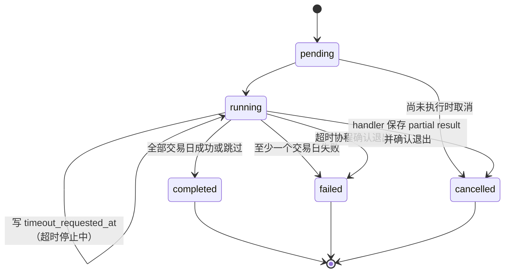

# 16-1 架构设计：A股全市场量价指标

_本文件只保留当前版本真正影响实现的架构决策、边界和契约；DDL、目录树、环境变量和完整 backlog 不放入正文。_

## 1. 系统摘要

基于 Tushare 单交易日全市场未复权行情，按历史上市生命周期和停牌状态校验沪深北 A 股完整集合，原子保存成交量、成交额及简单平均股价；复用现有后台任务和首页框架完成历史回填、日更与趋势展示。核心闭环：**拉取 → 核验 → 汇总 → 展示**。

## 2. 范围、非目标与成功标准

### 2.1 范围

- 新增单日全市场行情、每日停牌及 `L/D/P/G` 全生命周期股票基础信息的 Tushare 批量采集能力。
- 新增日级汇总表及服务，完整性通过后幂等保存三项指标和参与数拆分。
- 将 Tushare 开市日持久化到轻量本地交易日表；同步/日更负责刷新，首页查询只读 PostgreSQL 构造缺口时间轴。
- 新增 `sync_market_metrics` 范围任务及 collector 日更步骤；管理员可查看进度、失败日期并重跑。
- 新增登录用户查询 API 和首页 `MarketMetricsPanel`，支持三指标及 30/90/250 日切换。
- 数据管理页新增“市场量价”分类，复用现有任务列表、轮询与管理员鉴权。

### 2.2 P1 预留

暂无。输入 PRD 未定义 P1，本期不为未来能力预埋模块或契约；所有非本期范围统一按下一节处理。

### 2.3 明确不做

- 不做盘中或分钟级指标、分交易所对比、加权平均价、行业聚合及信号告警。
- 不将个股全市场原始响应再落一份明细表，也不改写现有逐股前复权 `stock_daily_market_data`。
- 不引入 Redis、消息队列、独立 worker 或多 Provider 注册中心；现有 AsyncTask 执行器足够。
- 不把盘后补充字段 `ah_vol/ah_amount` 叠加进主口径，避免历史区间口径不一致。

### 2.4 成功标准

| 指标 | 首版目标 |
| --- | --- |
| 单日正确性 | 完整性核验通过后唯一保存一条结果，量、额、简单平均价均可由原始行复算 |
| 历史同步 | 合法日期范围仅处理交易日，单日失败不回滚其他成功日，可幂等重跑 |
| 首页闭环 | 两类首页正常完成最新值、指标和时间范围切换；缺口、空态和错误态不伪造数据 |
| 查询性能 | 250 个交易日趋势接口 P95 ≤ 500ms，首页图表交互不触发整页刷新 |
| 日更 | 全市场日行情可用后生成当日指标；非交易日明确跳过 |

### 2.5 验收标准承接矩阵

| AC-ID | PRD 原文摘要 | 承接模块 | 关键链路 / 状态 | 风险 / 降级说明 |
| --- | --- | --- | --- | --- |
| AC-01 | 完整行情生成单日指标 | 采集适配器、汇总服务 | 6.1 `valid → saved` | 任一关键值或集合不平衡则整日不写 |
| AC-02 | 按日期范围同步 | 任务入口与编排、同步面板 | 6.2 `pending → running → completed/failed` | 逐日事务，失败日进日志，成功日保留 |
| AC-03 | 重复同步安全覆盖 | 汇总服务 | 唯一键 `trade_date` + upsert | 同日事务覆盖，不新增重复行 |
| AC-04 | 两套首页与指标切换 | 首页量价模块 | 6.4 `loading → ready` | 管理员置于指数总览前；普通用户置于快捷入口后 |
| AC-05 | 30/90/250 日切换 | 查询 API、首页量价模块 | `range=30/90/250` | 服务端只返回所需交易日数 |
| AC-06 | 无数据与日期缺口 | 查询 API、首页量价模块 | `empty / partial` | 返回预期交易日，缺失点为 null，不补 0/前值 |
| AC-07 | 缺失/重复失败与恢复 | 汇总服务、任务入口与编排 | `invalid → failed_date → retry` | 失败原因含缺失/重复代码并截断展示，恢复后重算 |
| AC-08 | 自动更新最新交易日 | collector、汇总服务 | 6.3 行情完成后再汇总 | Provider 未就绪则记错，不覆盖最近成功结果 |
| AC-09 | 非交易日不生成 | TradingCalendarRepository、collector | `non_trading → skipped` | 本地日历记录为休市时不创建日结果，日志记录原因 |
| AC-10 | 日期范围校验 | 管理路由、同步面板 | 请求校验后才建任务 | 起止倒置、未来结束日、零交易日均拒绝 |
| AC-11 | 权限与任务互斥 | 管理路由、同步面板 | `require_admin` + 单类型运行锁 | 前后端双重互斥；普通用户 API 返回 403 |
| AC-12 | 首页失败后重试 | 首页量价模块 | `error → retrying → ready` | SWR 局部 mutate，不刷新整页 |
| AC-13 | 全天停牌参与计算 | 采集适配器、汇总服务 | `missing_daily + full_day_suspend → carry_close` | suspend 信息或前收盘缺失则整日失败 |

## 3. 用户流程与状态

### 3.1 主流程

1. 管理员进入数据管理“市场量价”，选择合法起止日并启动任务。
2. 系统枚举交易日，逐日拉取全市场行情、历史在市集合及停牌信息，核验后保存；面板轮询任务进度与当前日期。
3. 登录用户进入对应首页，查看最新三项数值，切换指标和 30/90/250 日趋势。
4. 交易日每日更新先同步股票基础信息与当日行情，再生成当日汇总；失败日由管理员重跑。

### 3.2 关键分支

| 分支 | 触发条件 | 架构处理 |
| --- | --- | --- |
| 无交易日 | 范围内交易日列表为空 | 管理 API 不建任务并返回明确提示 |
| 全市场响应超过单页 | `daily` 返回满页 | `limit=3000`，`offset += 3000` 拉到不足一页；页签名重复、满页无新 key 或页数超过 `ceil(expected/limit)+1` 立即失败，跨页重复作为完整性错误保留 |
| 全天停牌 | 预期股票无 daily、`suspend_d` 为整日停牌 | 取目标日前最近有效收盘价，量额置 0 |
| 盘中临停 | daily 有有效行，即使 suspend 有记录 | 优先用 daily 行，不按全天停牌补值 |
| 单日不完整 | 缺失、重复、关键值非法，或停牌补齐后某交易所最终参与仍为空 | 回滚该日，记录失败日期与原因，继续下一日 |
| 首页缺口 | 交易日存在但汇总不存在 | 时间轴保留 null 点并提示部分日期无数据 |

### 3.3 状态机



关键规则：任务 `failed` 表示范围内存在失败日期，不撤销成功日。运行中取消/超时先写请求标记，仍为 running，协程退出后才 finalize。`sync_market_metrics` 每次成功取得专属 owner lock 都生成全新 `executor_acquisition_token` 并持久化到任务行；token 而非进程实例 ID 是唯一 fencing 身份，新 acquisition 回收 token 不同或 NULL 的本类型旧 running。其他任务保持原语义，终态不可逆，重跑创建新任务。

## 4. 系统上下文与模块职责

### 4.1 系统上下文

```text
Tushare daily / suspend_d / stock_basic(L/D/P/G) ---> [采集适配器]
Tushare trade_cal ---> [采集适配器] ---> [TradingCalendarRepository]
                                                   |
                                                   v
                                      [trading_calendar_days]
                                                   |
                                                   +-------------------+
                                                                       v
[Admin API + AsyncTask] ---> [市场量价汇总服务] <--- [每日 Collector]  [市场量价查询 API]
                                      |                                ^
                                      v                                |
                          [market_daily_metrics] -----------------------+
                                                                       |
                                                                       v
                                                            [两套首页量价模块]

[Admin API + AsyncTask] --------------------> [数据管理同步面板]
```

### 4.2 模块职责

| 模块 | 职责 | 上游输入 | 下游输出与复用验证 |
| --- | --- | --- | --- |
| 采集与本地日历适配（扩展 `BaseDataSource/TushareDataSource`，新增 `TradingCalendarRepository`） | 参数化 daily 分页；提供停牌、L/D/P/G 生命周期及全量开休市日范围接口；验证日历闭区间后同批写本地表 | Tushare DataApi | 输出扁平行情/停牌/基础集合和持久化的 `trading_calendar_days`。现 `get_daily_data` 是逐股 qfq，不能复用；现 `get_trading_calendar()` 只回开市日，也不能复用。本功能新增无 `is_open` 过滤的 range 方法，repository 是同步拆分、非交易日守卫和首页缺口轴唯一日历入口 |
| 市场量价汇总服务（新建 `MarketMetricsService(session)`） | 构建日期历史参与集合、核验、停牌补值、计算、日期级 upsert | 采集适配器、`stocks`、未复权 `daily` 回溯窗口 | 写 `market_daily_metrics`。验证：`Stock` 已有 `ts_code/exchange/list_date/delist_date/list_status`，但现有 `get_stock_list()` 只请求 L，`init_stocks()` 还会做 set-diff 清理；因此新增生命周期同步必须联合分页拉取 L/D/P/G、upsert 后以该联合全集做 A 股清理，不能仅复用现表。既有 `stock_daily_market_data` 来自 qfq，禁止作为停牌补价源；补价只读 Tushare 未复权 `daily` 的有界批量回溯结果 |
| 任务入口与编排（扩展 TaskType/handler/admin/collector） | 范围校验、市场量价执行 ownership、同类任务互斥、逐日进度、结构化结果、部分失败/停止/重启恢复、自动日更顺序 | 专用 Admin POST、每日 collector | AsyncTask + `result` JSON。验证：现 TaskExecutor 仅用进程内 task set；Phase B 为 `sync_market_metrics` 增加专属 session advisory owner lock/recovery/fencing，所有查询显式带 `task_type`。其他约 28 类任务不读写 owner/result 扩展、不被 recovery。每轮并发 gate 前消费本类型 cancel/timeout；任务固定 `max_retries=0`、reserved |
| 市场量价查询 API（新建） | 从本地交易日表左连接汇总，返回最新值和带缺口的趋势 | PostgreSQL | `{success,data}` camelCase 响应。验证：锚点 `src/api/v1/index_monitor.py` 使用 `get_current_user`、`_dict_to_camel`、Decimal/date 序列化并挂载 `/api/v1`；现 `TradingCalendar` 缓存未命中会实时访问 Provider，禁止用于 GET 读路径。新路由只查 `trading_calendar_days + market_daily_metrics`，不复用指数表或指数计算 |
| 首页量价模块（新建 `MarketMetricsPanel`） | 最新值、单指标柱/线图、范围切换、空/缺失/错误/重试 | 查询 API | 渲染到两类首页。验证：`web/src/app/dashboard/page.tsx` 现由 `isAdmin` 分支；管理员 `IndexMonitorPage` 可新增首个子模块，普通分支快捷入口后插入；ECharts 已以 dynamic `ssr:false` 使用，SWR 可局部 `mutate` |
| 数据管理同步面板（新建 `MarketMetricsSyncPanel`） | 日期输入、建任务、2s 轮询、进度/结果/历史记录/互斥 | Admin API、tasks API | 触发 `sync_market_metrics`。验证：`IndexSyncPanel` 已用 `adminApi`、`useTaskStatus(taskId)` 与 `/api/v1/admin/tasks?task_types=...&page=1&page_size=20`；任务记录写既有 AsyncTask，无新表，前置为管理员鉴权 |

### 4.3 需要刻意避免的过度设计

| 不引入 | 原因 |
| --- | --- |
| 原始全市场行情快照表 | 日汇总只有单一计算用途，失败时可从 Provider 重拉；避免复制约 5500 行/日 |
| 日期任务明细表 | `AsyncTask.result` JSON 能承载日期清单和计数，首版无独立查询消费者 |
| 队列和外部锁服务 | 不引入新中间件；事务级 lock 保证同类创建原子性，专属会话级 lock 只保证 `sync_market_metrics` 单 owner |
| 通用缓存服务 | 交易日仅约数千行，直接用 PostgreSQL 轻量表；无需 Redis，且读请求不访问 Provider |
| 多接口首页拆分 | 最新值和趋势同一消费者，一个查询端点可避免多次往返 |

## 5. 关键架构决策（ADR）

### ADR-1：按交易日批量拉取未复权行情
- **选择**：新增参数化 `daily` 分页器：单日模式校验 `date=T`，历史模式校验 `window_start<=date<=window_end<T` 且代码属于批次；单页 3000，并按各模式最大候选行数给出硬页数。
- **理由**：三项指标需同批原始量价；现有逐股 `pro_bar(qfq)` 调用多且复权，不适合。无需更重的明细仓库。
- **风险与对策**：两模式均检查页签名、新 key 与重复；首张空页由调用者判为空数据，合法满页后的空探测页正常结束，避免静默截断、死循环或整页误报。

### ADR-2：用完整历史生命周期构造参与集合
- **选择**：按状态分别分页拉取并合并 `stock_basic(L/D/P/G)`；L/P 按 `list_date<=T` 参与，D 还须 `T<delist_date`，G 无论日期字段是否为空都固定排除。
- **理由**：L 会漏历史退市股，L/D 又会漏已上市未退市的 P；无需新证券主数据表，扩展既有 `stocks` 即可。
- **风险与对策**：L/D/P 必须有 list_date、D 必须有 delist_date；G 允许日期为空，但 ts_code/exchange 仍必填。A 股 set-diff 以四状态联合源清理；逐股日更只遍历目标日在市集合。

### ADR-3：停牌以 suspend_d 确认并沿用最近收盘
- **选择**：预期集合缺 daily 时，仅 `suspend_d(suspend_type=S)` 且无日内时段/判定整日停牌者补值；按代码分块、固定窗口向前分页扫描未复权 `daily`，逐股取 T 前最近有效 close，量额为 0。
- **理由**：daily 官方口径停牌无数据，缺行情不能直接等同停牌；不做更重的停牌状态仓库。
- **风险与对策**：扫描最远到各股 `list_date` 且有页数/请求预算硬限；范围任务跨日缓存 last close，仍未找到则整日失败，禁止 qfq 后备、逐股无界 N+1 或缩小集合。

### ADR-4：单表日期级原子 upsert
- **选择**：`market_daily_metrics` 以 `trade_date` 唯一，核验与计算完成后在单事务 `ON CONFLICT DO UPDATE`。
- **理由**：三项指标和参与数是同一日聚合，拆表会增加不一致；无需保存失败半成品。
- **风险与对策**：重算覆盖审计依靠 AsyncTask 记录；后续若需版本追踪再加快照表。

### ADR-5：范围任务逐日提交、聚合判定部分失败
- **选择**：一个 `sync_market_metrics` 任务串行处理交易日；成功日立即提交，失败日回滚并继续；每个日期都以统一 `dateResults` 保存状态和四类完整性计数，存在失败日时末尾抛一次摘要。任务创建固定 `max_retries=0`，由现有执行器直接落 failed。
- **理由**：历史回填应保留成果且可精准重跑；不引入子任务/队列，链路更短。
- **风险与对策**：采集器内部仍做 3 次单请求退避；任务级不重放整个范围，结果保存成功/跳过/失败计数及逐日完整性结果。

### ADR-6：首页读预聚合结果并复用现有 ECharts/SWR
- **选择**：同步侧把 Tushare 开市日 upsert 到本地 `trading_calendar_days`；一个登录态 GET 从本地交易日轴左连接最近 N 个预聚合点，前端切换指标，两套首页复用同一组件。
- **理由**：避免每次首页扫描个股行情；不为三种指标创建三个端点或多纵轴图。
- **风险与对策**：读请求永不访问 Provider；缺失日返回 null 并断线。日历刷新失败则同步任务在处理日期前失败，首页继续使用最近一次本地日历和已保存指标。

### 5.x 待确认问题

无。退市日边界、停牌判定、单位和任务部分失败语义均已在本架构中确定。

## 6. 运行链路

### 6.1 单交易日计算与原子保存

1. 服务入口接收可选 `TaskFenceContext(task_id, acquisition_token, owner_generation_guard)`：管理员任务必须传入，自动日更传 `None`。Provider 拉取前检查绑定该 token 的本地 generation active，所有持久化通过 fence-aware 方法；自动日更不读写 AsyncTask。调用方从本地日历取得 T 记录，休市返回 skipped，缺覆盖则失败。
2. 接收调用方已完成 preflight 的 `LifecycleSnapshot`。按状态校验：所有记录 `ts_code/exchange` 必填；L/D/P 必须有 `list_date`，D 还必须有 `delist_date`；G 允许 `list_date/delist_date` 为空并固定不进入任一 T 的参与集合。其余预期集合为交易所 `SSE/SZSE/BSE`、`list_date <= T` 且 `delist_date` 为空或 `T < delist_date`。snapshot 必须带同一 preflight 的 L/D/P/G 四类成功标记；不合格则失败，不能用当前 L 集合降级。范围任务和自动日更各只同步一次生命周期，再把 snapshot 传给各 `sync_date`。
3. 调参数化分页器的单日模式：`daily(trade_date=T, fields=ts_code,trade_date,close,pre_close,vol,amount, limit=3000, offset=...)`。非空页须满足 `rows<=limit` 且每行 `trade_date==T`；首张 0 行由本链路判为全市场空并失败，至少一张合法满页后的 0 行页是正常终止。短页结束、满页推进 offset，维护页签名与新增 key 数；签名重复、满页无新增 key 或请求页数超过 `ceil(expected_count/limit)+1`（含尾部探测页）均失败，跨页重复 key 记为完整性错误而非去重修复。
4. 只保留 `.SH/.SZ/.BJ` 且在预期集合内的行。适配器以原始字符串或 `Decimal(str(value))` 建数值，先验证 finite、`close>0`、`vol>=0`、`amount>=0`，再保留 `vol`（手）和 `amount`（千元）；禁止用 binary float 累加。任一重复、越界代码、日期不符或关键值非法均失败。
5. 对预期集合中无 daily 的代码查询当日 `suspend_d`：daily 已存在者（含盘中临停）直接使用；只有 `suspend_type=S` 且 `suspend_timing` 为空或被适配器规则明确识别为覆盖全天者进入补价集合，无法判定者失败。
6. 对补价集合按至多 100 个 `ts_code` 分块，从 `[T-60日,T-1日]` 起按固定 60 日窗口向前调用参数化分页器的历史模式：只允许批次内代码和 `window_start<=trade_date<=window_end<T`，最大候选行为 `batch_size × window_calendar_days`，最大请求页数为 `ceil(max_candidates/limit)+1`（含尾部探测页）。两模式共享页签名、新 key、重复和“合法满页后空页终止”守卫，但不共享首张空页的业务处理、日期谓词或候选行上限：历史窗口首张空页表示该窗口无命中，正常推进到更早窗口，不把整日判失败。逐代码取 `<T` 的最大有效 `trade_date/close` 后从未决集合移除；扫描下界为各股 `list_date`，每批最多 250 个窗口，范围任务按升序缓存 daily close 和 last close。扫描到底仍未命中才整日失败，永不读取 qfq 表或发起逐股无界请求。
7. 将全天停牌行补为 `{close:last_close, vol:0, amount:0}`，再校验 `daily_count + full_day_suspended_count = expected_count = final_count`。仅在某交易所预期集合非空、完成 daily 与合法停牌补齐后最终参与仍为零时，才判定该交易所整体缺失。
8. 计算：`volume_shares = Σ(Decimal(vol) × 100)`；`amount_yuan = Σ(Decimal(amount) × 1000)`；`average_price = ΣDecimal(close) / final_count`。全程 Decimal，平均价保存 4 位、API 展示 2 位。
9. 管理员任务在同一数据库事务中先由 `TaskFenceContext.lock_and_validate(session)` 对 AsyncTask 行 `SELECT ... FOR UPDATE`，校验本任务类型、running、`executor_acquisition_token=context.token` 且 `cancel_requested_at/timeout_requested_at` 均为空，再 upsert `market_daily_metrics` 与当日 `dateResults/progress/log`；任一不符让业务写和任务写一起 rollback。自动日更无 task context，只原子 upsert 指标。任何异常都不保留部分日结果。

实现原则：普通成交口径不叠加 `ah_*`；Provider 页间数据先合并再校验，不能把 `drop_duplicates` 当作重复数据的静默修复；停牌补价必须早于汇总且保留拆分计数。

### 6.2 管理员日期范围同步

1. 前端和 `POST /api/v1/admin/init/market-metrics` 同时校验必填、`start_date <= end_date <= today`。写入口调用新增 `TushareDataSource.get_trading_calendar_range(start,end)`：内部执行 `pro.trade_cal(exchange='SSE', start_date=..., end_date=..., fields='cal_date,is_open')`，明确不传 `is_open` 过滤，并返回 `TradingCalendarEntry[]`。Repository 对本次响应做闭区间每个自然日一一对应、无重复/越界校验；通过后才单事务 upsert 同一 `refresh_batch_id/refreshed_at`，并仅从该批拆分交易/非交易日。Provider 失败、部分/重复/越界响应或零交易日均不提交、不建任务，旧行不能掩盖本次响应。旧 `get_trading_calendar()` 保持原调用方兼容，本功能不使用。
2. `sync_market_metrics` 是 reserved task type：现有通用 `POST /api/v1/admin/tasks` 在类型校验后必须明确拒绝它并提示使用专用端点，不允许调用者传入 `max_retries` 旁路。专用管理路由调用 `TaskManager.create_exclusive_task()`：在一个数据库事务内使用代码常量 `MARKET_METRICS_LOCK_KEY` 执行 PostgreSQL `pg_advisory_xact_lock(key)`，再查询同类型 pending/running 并创建；锁在 commit 后释放，等待者随后看到已提交任务并被拒绝。前端禁用不承担一致性。
3. TaskExecutor 用独立长连接取得专属 session advisory lock；**每次成功 acquisition 后**立即生成全新的 UUID `acquisition_token`（同一进程断线重连也必须更换），并创建绑定此 token 的新 OwnerGenerationGuard。guard 只有持锁且 recovery 完成时 active；锁断开先失效旧 guard、cancel 旧 token 的全部 coroutine，再重连。新 acquisition 在接受 pending 前，对 `task_type='sync_market_metrics' AND status='running' AND executor_acquisition_token IS DISTINCT FROM current_token`（含 NULL）的任务逐行开启 recovery 事务并 `SELECT ... FOR UPDATE`；重新校验类型、running 和旧/NULL token 后，以任务参数、本地日历和已提交 `dateResults` 重建计数与 `unprocessedDates`，未处理日不计入 `failedCount`。随后只按行内已持久化的停止首因执行一个原子终态：仅 `cancel_requested_at` 非空时，同事务写 partial result、recovery 日志并置 `cancelled`；仅 `timeout_requested_at` 非空时写 partial result、日志并置 `failed(task_timeout)`；两字段均空时写 partial result、日志并置 `failed(executor_restarted)`。两字段同时非空属于不变量破坏；记录 critical 告警并按较早数据库时间选首因（同一时间固定以 cancel 优先）执行对应终态，确保不遗留 running。recovery 不要求旧 token 的 guard active，但只能由仍持专属 advisory lock 的当前 acquisition 执行；事务提交前再次验证当前 acquisition 未失效。recovery 完成后才激活新 guard。
4. 专用入口原子创建 AsyncTask，固定 `max_retries=0`。持锁 owner 将本类型 pending 改为 running 时写当前 `executor_acquisition_token`，并构造绑定同 token/guard 的 TaskFenceContext；其他任务沿用旧路径。handler 拉取 L/D/P/G 后在 fence 事务中执行联合 upsert/set-diff 与 preflight 任务写，成功后复用不可变 snapshot。
5. 每个交易日处理结束都向统一 `dateResults` 追加完整性计数。取消 API 对 pending 立即置 cancelled；对 running 用条件更新“仅当 `cancel_requested_at/timeout_requested_at` 均为空时写 `cancel_requested_at=now`”。超时扫描使用对称条件更新写 `timeout_requested_at=now`。因此首个停止请求按数据库时间胜出，另一请求不得再写标记。执行器维护本类型 `task_id → asyncio.Task` 映射；每轮并发 gate 前扫描当前 owner 的 running，消费胜出的取消/超时原因并 cancel coroutine。
6. TaskFenceContext 在事务前和锁 Task 行后双检绑定 generation active，并校验 type/running、`executor_acquisition_token=context.token`、停止字段。生命周期、指标、审计和 complete 均使用它；正常持锁期间的 `finalize_cancel_with_result` / `finalize_timeout_with_result` 也双检 token/guard。锁丢失后的 recovery 使用第 3 步的专用原子终态方法消费已经胜出的停止字段，不能统一覆盖为 `executor_restarted`。旧事务与新 acquisition recovery 共用 Task 行锁：旧先提交则其最新结果和停止首因被 recovery 纳入，recovery 先提交则旧 token 谓词失败回滚，禁止 recovery 后旧提交。
7. 非交易日不进入 handler 计算；`skippedCount` 等于原始闭区间自然日数减交易日数。`progress/total` 只统计交易日，页面同时显示三类日期计数。
8. 全部结束先持久化 `result={successCount,skippedCount,failedCount,dateResults,unprocessedDates}`；所有已处理日含四类计数。日志只保存过程及问题代码样本并使用真实 count。失败数大于 0 时抛一次摘要；因 `max_retries=0` 直接落 failed，已提交成功日期不回滚。

实现原则：任务重跑始终重拉并 upsert；错误详情包含 `expected/daily/suspended/final` 数量和最多 50 个问题代码，避免日志/响应失控。

### 6.3 交易日自动日更

1. scheduler 触发现有 `DataCollector.run_daily_update()`；先用 `get_trading_calendar_range(today,today)` 和与 6.2 相同的完整响应规则刷新本地当前日期闭区间，再由本批记录执行交易日守卫。本次响应部分、重复、越界或 Provider 失败时日更失败，不用旧行冒充本次验证，也不能按工作日猜测；旧日历仍保留供首页只读降级。
2. 保持“股票基础信息 → 当日股票行情”在前；当次日更只做一次 L/D/P/G 联合 preflight，完成 upsert/set-diff 并生成 `LifecycleSnapshot`；逐股行情只遍历快照中的当日在市集合，不遍历历史退市全表。
3. `_update_market_metrics()` 在 `_update_market_data()` 成功后调用同一 `MarketMetricsService.sync_date(today, lifecycle_snapshot)`，保证手动和自动口径一致且不重复拉 stock_basic。
4. 指标失败写 `results.errors` 和 `market_metrics_updated=0`，不覆盖旧值，也不阻断指数/ETF 等独立后续任务；日志明确可重试日期。

实现原则：生产恢复每日 job 时统一安排在 Tushare 日线通常入库后的缓冲时段（建议 18:00 北京时间）；collector 内的交易日、完整性守卫不可依赖 cron 工作日表达式。

### 6.4 首页查询与渲染

1. 两类首页挂载同一 `MarketMetricsPanel`，请求 `GET /api/v1/market-metrics/trend?range=30`。
2. API 只查询 PostgreSQL：从 `trading_calendar_days` 取最近 N 个 `is_open=true` 日期，左连接 `market_daily_metrics`；输出 latest 和 points，缺结果日三项为 null。GET 不实例化现有 `TradingCalendar`、不调用 DataSourceFactory/Tushare；本地日历没有任何开市日时返回明确服务端数据未初始化错误，不能用自然日或工作日伪造。
3. 组件同时显示最近结果日三项值；默认成交额柱图，成交量柱图、平均价折线图；范围切换重新请求 30/90/250。
4. 管理员 `IndexMonitorPage` 将面板置于关键指数区之前；普通首页将面板置于快捷入口之后、市场强度之前。
5. 空数据时管理员显示数据管理链接；部分缺口提示且断线；失败时“重试”只调用 SWR mutate。

实现原则：前端只做显示单位换算：`amountYuan / 1e8 → 亿元`、`volumeShares / 1e8 → 亿股`；tooltip 使用完整精度，卡片平均价两位小数。

## 7. 领域对象与关键契约

### 7.1 核心对象

| 对象 | Source of Truth | Owner | 用途 |
| --- | --- | --- | --- |
| TradingCalendarDay | Tushare `trade_cal` → `trading_calendar_days` | TradingCalendarRepository | 同步日期拆分与首页缺口时间轴；读 API 只查本地表 |
| AStockLifecycle | Tushare `stock_basic` → `stocks` | 采集适配器/股票基础同步 | 还原目标日预期集合 |
| MarketDailyQuote | Tushare `daily` 当批响应 | 采集适配器 | 计算交易股票的未复权价、量、额 |
| SuspensionEvidence | Tushare `suspend_d` 当日响应 | 采集适配器 | 区分全天停牌与行情遗漏 |
| MarketDailyMetric | `market_daily_metrics` | MarketMetricsService | 首页与同步结果的日级事实 |
| MarketMetricsSyncTask | `async_tasks` + `params/logs/result` | TaskManager/handler | 范围进度与终态、逐日四类完整性计数、失败/取消日期结果和过程审计 |

### 7.2 推荐最小 Schema

```typescript
// 领域/存储视角（数据库 snake_case）
interface MarketDailyMetricRecord {
  trade_date: string;
  volume_shares: string;       // Numeric(24,2)，股
  amount_yuan: string;         // Numeric(24,2)，元
  average_price: string;       // Numeric(16,4)，元
  expected_stock_count: number;
  daily_quote_count: number;
  suspended_stock_count: number;
  final_stock_count: number;
  created_at: string;
  updated_at: string;
}

// API 响应视角（camelCase，数值转 number 供 ECharts）
interface MarketMetricsTrendData {
  latest: MarketMetricPoint | null;
  points: MarketMetricPoint[];
  range: 30 | 90 | 250;
  hasMissingDates: boolean;
}

interface MarketMetricPoint {
  tradeDate: string;
  volumeShares: number | null;
  amountYuan: number | null;
  averagePrice: number | null;
  finalStockCount: number | null;
  suspendedStockCount: number | null;
}

interface MarketMetricsTaskResult {
  successCount: number;
  skippedCount: number;
  failedCount: number;
  dateResults: MarketMetricsDateResult[];
  unprocessedDates: string[]; // 取消、超时或 executor_restarted 恢复时可非空；完整处理范围时为空
}

interface MarketMetricsDateResult {
  tradeDate: string;
  status: 'success' | 'failed';
  expected: number;
  daily: number;
  suspended: number;
  final: number;
  reason?: string;
}
```

数据库新增 `market_daily_metrics` 与轻量 `trading_calendar_days` 两张业务支持表。既有 `async_tasks` 增加 nullable JSON `result`、`cancel_requested_at`、`timeout_requested_at`、`executor_acquisition_token`；token 每次成功取得专属 lock 都重新生成。这些扩展仅由 `sync_market_metrics` 新路径读写，其他任务保持字段为 NULL 和原有状态语义。

采集/领域契约新增 Python/Pydantic 模型 `TradingCalendarEntry { cal_date: date; is_open: bool }`。`BaseDataSource.get_trading_calendar_range(start,end)` 与 Tushare 实现均返回闭区间全量开/休市记录；旧 `get_trading_calendar(): List[date]` 继续服务既有代码，本需求不得调用它。只有 API 响应层才把 snake_case 转成 camelCase。

### 7.3 API 边界

| 接口 | 用途 | 契约 |
| --- | --- | --- |
| `GET /api/v1/market-metrics/trend?range=30` | 首页最新值与趋势 | 登录用户；`range` 仅 30/90/250，默认 30；返回 `{success,data}` |
| `POST /api/v1/admin/init/market-metrics` | 唯一合法的范围同步创建入口 | 管理员；body `start_date/end_date` 来源 `user_input`，snake_case；原子互斥创建且固定 `max_retries=0`，返回 `data.task_id`；L/D/P/G preflight 在 handler 启动时只执行一次 |
| `GET /api/v1/admin/tasks?task_types=sync_market_metrics&page=1&page_size=20` | 同步记录 | 扩展既有管理员分页响应携带 nullable `result`；query 保持 snake_case |
| `GET /api/v1/admin/tasks/{task_id}` | 轮询任务进度和结果 | 扩展既有端点，返回 AsyncTask camelCase 字段及 `MarketMetricsTaskResult | null` |
| `GET /api/v1/admin/tasks/{task_id}/logs?page=1&page_size=50` | 查看过程日志与问题代码样本 | 复用既有端点并把 `total` 修为数据库真实 count；完整失败日期以 task `result` 为准 |

响应约定：后端统一 `{ success, data, error?, message? }`；仅响应业务字段 snake_case→camelCase，query、path 和管理请求体仍为 snake_case。日期为 ISO `YYYY-MM-DD`/ISO datetime；数据库 Decimal 在 API 序列化为有限 `number`，不得输出字符串破坏图表运算。`web/src/lib/fetcher.ts` 会解包外层 `data`，`AdminApiClient` 也返回 `json.data`，组件不得再多解一层。

创建入口约定：`sync_market_metrics` 虽注册到 `TaskRegistry` 供执行器调度，但列入 `RESERVED_TASK_TYPES`；通用 `POST /api/v1/admin/tasks` 必须在创建前返回失败提示，不能复用其通用 `max_retries` 请求字段。专用入口和未来任何内部创建者都必须调用同一 `create_exclusive_task`。

### 7.4 状态流转

任务沿用 `pending | running | completed | failed | cancelled`。只有本类型需要专属 lock。每次 acquisition 创建新 token/guard；断线重连必须换 token，旧 guard 先失效并取消旧 token coroutine。TaskFenceContext 双检 guard 并校验持久化 token。取消/超时首因胜出且原子 finalize；若首因写入后发生 lock loss，新 token recovery 必须按该持久化首因落 `cancelled` 或 `failed(task_timeout)`，只有不存在停止字段才落 `failed(executor_restarted)`。新 token recovery 与旧事务共用 Task 行锁，只允许“旧先提交且被纳入”或“recovery 先提交、旧回滚”。自动日更传 None，其他任务不套用。

### 7.5 数据边界

- Tushare 是行情、停牌、证券生命周期和开市日源；瞬时全市场行情仅存在采集内存。
- PostgreSQL `trading_calendar_days` 保存本地开/休市日轴，`stocks` 保存 L/D/P/G 生命周期主数据，`market_daily_metrics` 保存日汇总事实，AsyncTask 保存任务过程、取消请求与结构化结果。
- `stock_daily_market_data` 是既有逐股分析事实，不是本功能成交额 source of truth，也不由本服务写入。
- 浏览器仅持有 SWR 缓存和指标/范围 UI 状态，不持久化或重算业务指标。

### 7.6 命名与标识规则

- 数据库/Python 领域字段 snake_case；响应字段 camelCase；日期 query/request 仍 snake_case。
- 任务类型固定 `sync_market_metrics`；UI 统一称“市场量价”，领域对象称 `MarketDailyMetric`。
- `volume_shares` 统一指“股”，不是 Tushare 的“手”；`amount_yuan` 统一指“元”，不是“千元”。
- `average_price` 统一指有效收盘价简单算术平均，不称指数、典型价或中位数。
- 日结果标识使用 `trade_date` 自然唯一键；任务沿用现有 `task_<12 hex>` 系统生成 ID。

## 8. 非功能需求、风险与运行策略

### 8.1 性能与吞吐量目标

| 指标 | 目标 | 预期并发 |
| --- | --- | --- |
| 单日 Provider 拉取 | 常态 2 个 daily 页面 + 1 次 suspend；仅有全天停牌未命中缓存时执行分块窗口补价，均按 0.3s 节流和硬上限 | 单任务串行 |
| 250 日查询 | P95 ≤ 500ms，≤250 点；只走本地 `cal_date/is_open` 索引和汇总日索引，0 次 Provider 调用 | 普通登录用户并发读 |
| 范围回填 | 逐日串行、每日日级提交；进度至少每处理一日更新 | 同类型最多 1 个 |
| 首页渲染 | 单个 ECharts 实例，切换不刷新整页 | 每页面 1 实例 |

### 8.2 可靠性、错误处理与降级策略

1. **最小影响**：首页最新交易日未更新时展示最近成功结果及其日期，不伪装成今天。
2. **局部影响**：趋势存在失败日时返回 null 断点和提示，其他日期仍可用。
3. **同步影响**：Provider 单请求失败由现有 3 次指数退避重试；仍失败则回滚该日、继续范围任务。任务自身 `max_retries=0`，不会把已完成范围整体重放。
4. **完全不可用**：Tushare/数据库不可用时不写任何新汇总；首页保留已有数据，加载请求失败可局部重试。
5. **日历降级**：写侧每次必须用本次响应完整覆盖闭区间，失败则不提交、不建任务/不执行日更；旧批次不能为写任务降级。读侧永远使用最后成功批次的本地表，Provider 故障不影响既有趋势和缺口轴；本地日历未初始化则返回明确空/错误状态。

应用级事务边界是一个 lifecycle preflight、一个交易日或一个原子停止终态。锁连接丢失时先失效当前 acquisition guard/cancel 其 coroutine；重连生成全新 token，旧 token running 必被 recovery 的 `IS DISTINCT FROM` 命中。recovery 在 Task 行锁内从已提交结果重建 partial result，并严格区分“已有 cancel 首因”“已有 timeout 首因”“无停止首因”三个终态分支；不得用 `executor_restarted` 覆盖前两者。已在途事务与 recovery 依靠 Task 行锁串行化，禁止 recovery 后旧提交。自动日更无 context，历史范围上限 10 年。

### 8.3 安全与反滥用策略

| 项目 | 首版策略 |
| --- | --- |
| 查询权限 | `get_current_user`，所有登录用户可读 |
| 同步权限 | `require_admin`；前端隐藏入口不能替代后端鉴权 |
| 任务滥用 | 日期/跨度校验；事务级 lock 保证同类创建，专属 session lock 只保证市场量价单 owner；本类型 running 含停止中/待 recovery 均占用，确认退出或新 owner 回收后才释放 |
| 凭据 | `TUSHARE_TOKEN` 和代理 URL 仅服务端环境持有，日志不输出 token |
| 查询安全 | Pydantic/Query 枚举范围，SQLAlchemy 参数化查询 |

### 8.4 成本控制预期

| 模块 | 预估单次成本 | 首版控制 |
| --- | --- | --- |
| Tushare 日行情 | 按账号积分/频次计，无独立货币单价可确认 | 每交易日约 2 页，limit/offset；停牌补价按 100 代码×60 日窗口批量回溯，不逐股调用 |
| suspend_d/stock_basic | 每日各少量批量调用 | 生命周期 L/D/P/G 每任务/日更批量同步一次；停牌每目标日一次 |
| trade_cal | 每个手动范围/每次日更一次刷新 | 写侧必须刷新并验证本次完整响应，Provider 故障时不得复用旧批；仅首页 GET 读侧可复用最后成功的本地日历 |
| PostgreSQL | 单日 1 行汇总 + task result/日志 | 不保存重复原始快照；result 保存完整日期结果，日志问题代码截断 |

外部调用预算以“每目标交易日常态 ≤4 次”为软上限；补价仅允许每批 100 代码、60 日窗口的有界扫描，每批最多 250 个窗口且总请求预算写入配置常量，命中预算仍有未决代码则该日失败。禁止逐股 N+1；达到账号限额时停止并保留已成功日期。

### 8.5 可观测性

- 每日结构化日志：`trade_date/page_count/expected/daily/suspended/final/duplicate_count/duration_ms/status`。
- 任务 `result` 记录 success/skipped/failed 计数和统一 `dateResults`；每个成功/失败交易日都含 expected/daily/suspended/final 四类计数。进度日志记录当前日期与累计数，失败日志只记录 endpoint、错误类别和问题代码样本，日志分页 `total` 由 count 查询返回。
- 日历日志记录刷新范围、开/休市行数、`refreshed_at` 与是否使用本地覆盖降级；首页查询指标包含 DB 耗时，禁止记录任何 Provider 调用。
- collector 结果增加 `market_metrics_updated`，自动日更失败进入 `results.errors`。
- 告警最小集：连续两个交易日无新结果、单日集合不平衡、Tushare 权限/限流不可恢复错误、同类任务异常长时间 running。
- 执行器告警记录市场量价 owner lock 获取/丢失、该类型 orphan recovery 数量、owner fencing 拒绝和 standby 状态；未持专属 lock 时不得拉取 `sync_market_metrics` pending，但不影响其他任务。

### 8.6 主要风险

| 风险 | 影响 | 缓解 |
| --- | --- | --- |
| 当前 stocks 只同步 L 状态 | 历史回填漏 D/P 或 set-diff 误清理 | 按状态分页联合 L/D/P/G 后 upsert/清理；L/D/P 强制 list_date、D 强制 delist_date，G 日期可空且固定排除；逐股日更只读目标日在市集合 |
| daily 超过单次 6000 或异常重复满页 | 静默截断或分页死循环 | 3000 分页，页签名/新增 key/预期页数硬停止，再做集合平衡 |
| suspend_d 的日内时段语义变化 | 把盘中临停误判全天停牌 | daily 优先；仅明确整日停牌补值；边界样本测试，不能确认则失败 |
| 最近未复权收盘历史缺失 | 停牌股无法定价 | 分块固定窗口扫描未复权 daily，缓存命中，最远到 list_date；禁止 qfq 后备，仍无值整日失败 |
| Tushare 当日数据尚未齐 | 自动任务产生假缺失 | 18:00 后运行；完整性失败不写库，可重试 |
| Decimal/单位转换错误 | 图表数值放大或缩小 | `Decimal(str(raw))` + finite/正负约束；存储统一股/元，测试手×100、千元×1000和禁止 float 累加 |
| 取消请求提前释放任务占用 | 新旧 handler 短暂并行 | running 只写 `cancel_requested_at`，exclusive create 仍视为占用；handler 保存结果并退出后原子 finalize cancelled |
| 超时提前落 failed 但协程继续 | 旧协程与新任务并行、终态被覆盖 | 执行器维护 task_id→asyncio.Task；先写 timeout 请求并 cancel，保存 partial result/确认退出后 finalize failed |
| 取消与超时同时竞争 | partial result 丢失或双重终态 | 两个停止字段仅在均为空时条件写入，首个请求胜出；对应 finalize_with_result 同事务写 result 与唯一终态 |
| 执行器重启/同实例重连遗留 running | 永久占用互斥，或旧协程继续写 | 每次 lock acquisition 使用新持久化 token；recovery 回收本类型不同/NULL token running，旧 token 写受 fencing 拒绝 |
| 停止首因写入后 acquisition 丢失 | 用户取消/任务超时被错误改写为 executor_restarted | recovery 锁行后按 cancel、timeout、无停止字段三分支原子保存 partial result 与唯一终态；双字段异常按时间确定首因并 critical 告警 |
| owner 切换时旧 handler 提交非指标副作用 | stocks/进度/结果覆盖新 recovery | 手动任务所有持久化边界统一使用 TaskFenceContext；新 owner 回收后旧生命周期、指标和审计写全部回滚 |
| owner lock 丢失到 recovery 的竞态 | 旧 owner 在接管窗口继续开事务或提交 | OwnerGenerationGuard 先失效并 cancel；TaskFenceContext 事务前/行锁后双检，recovery 与在途事务同 Task 行锁串行化 |
| 首页实时依赖交易日 Provider | Tushare 故障或延迟破坏缺口与 P95 | 同步写侧维护本地日历；GET 只读 PostgreSQL，日历未覆盖时明确报错而非猜测 |
| trade_cal 部分响应被旧行掩盖 | 错误交易日轴与 skip 计数 | 本次响应必须对闭区间自然日一一覆盖且无重复越界，单批次事务提交；写任务不使用旧批降级 |

## 9. 实施方案

### Phase A：采集、模型与单日闭环

1. `server/src/services/data_acquisition/base.py`、`models.py`、`tushare_client.py` — 新增全市场行情/停牌模型、单日/历史窗口参数化分页器、`get_suspensions`、L/D/P/G 生命周期、分块未复权前收盘，以及 `get_trading_calendar_range(start,end) -> TradingCalendarEntry[]`（无 is_open 过滤）；旧日历方法保持兼容。
2. `server/src/models/market_daily_metric.py`、`server/src/models/trading_calendar_day.py`、`server/src/models/__init__.py`、`server/alembic/versions/<revision>_add_market_metrics_and_calendar.py` — 新增唯一日汇总模型及带 `refresh_batch_id/refreshed_at` 的本地开市日模型，分别建立 `trade_date` 与 `cal_date/is_open` 索引和迁移。
3. `server/src/services/market_metrics_service.py`、`server/src/services/data_init.py`、`server/src/services/data_updater/collector.py` — 实现生命周期集合、L/D/P/G 联合 set-diff、逐股行情目标日在市过滤、全天停牌判定、有界最近未复权收盘批量补值、完整性校验、Decimal 计算和日级原子 upsert。
4. `server/tests/services/test_market_metrics_service.py`、`server/tests/services/data_acquisition/test_tushare_market_daily.py`、`server/tests/services/test_data_init.py` — 覆盖单日/历史谓词、exact-3000/6000 空尾页、分页硬停止、Decimal/单位、G 空日期合法排除、L/D/P 日期约束、四状态 set-diff、重复/缺失、合法停牌后的交易所覆盖和 AC-01/07/13。

验证目标：单日完整数据精确生成；任何不完整场景不落库；重复运行同日唯一覆盖。

### Phase B：任务、自动更新与查询契约

1. `server/src/models/async_task.py`、`server/alembic/versions/<revision>_add_async_task_result.py`、`server/src/services/task_manager.py`、`server/src/services/task_executor.py`、`server/src/services/task_handlers.py` — 增加 acquisition token 等扩展；每次 lock acquisition 生成新 UUID token/guard并持久化，重连旧 token 由 recovery 回收；TaskFenceContext 双检 guard/token，recovery 与旧事务共用行锁并按 cancel/timeout/无停止字段分支保存 partial result 与终态；停止 result+终态原子。其他任务保持旧路径。
2. `server/src/services/trading_calendar_repository.py`、`server/src/api/admin/init_market_metrics.py`、`server/src/api/admin/__init__.py`、`server/src/api/admin/tasks.py` — 写侧以内存集合严格验证本次 `trade_cal` 闭区间一一覆盖/无重复越界后单批提交；新增唯一管理员 POST、日期/跨度、零交易日、互斥、reserved 封堵、一次生命周期 preflight、result 与日志 true total。
3. `server/src/services/data_updater/collector.py`、`server/src/services/scheduler/job_manager.py` — 自动日更传 `TaskFenceContext=None`，用 collector 自身事务完成一次生命周期与行情/汇总；在股票行情成功后执行市场汇总并记录结果，恢复日更时安排 18:00 北京时间且 `max_instances=1`。
4. `server/src/api/v1/market_metrics.py`、`server/src/api/v1/__init__.py` — 新增登录态趋势 GET、camelCase/Decimal/date 契约；只用本地开市日表左连接汇总，GET 路径禁止调用 Provider。
5. `server/tests/api/test_market_metrics.py`、`server/tests/api/admin/test_init_market_metrics.py`、`server/tests/services/test_task_manager.py`、`server/tests/services/test_task_executor.py`、`server/tests/services/test_trading_calendar_repository.py` — 覆盖全部数据/API/停止/重启；无新 owner 时 lock loss 后旧协程不能开下一事务；接管竞态保持行锁二选一；同一 TaskExecutor 断线重连必须生成新 acquisition token，分别验证“cancel 标记后断线→partial result + cancelled”“timeout 标记后断线→partial result + failed(task_timeout)”“无停止标记断线→partial result + failed(executor_restarted)”及双标记不变量告警，三类正常分支均释放互斥并允许新任务，旧 token coroutine 不能提交；另覆盖 counts 只来自已处理 `dateResults`、`unprocessedDates` 准确、停止原子性、自动日更无 context、非市场任务不受影响。

验证目标：手动/自动走同一计算方法；任务可观测、可重跑；API 准确表达最近值和缺口。

### Phase C：两套首页与同步管理

1. `web/src/types/marketMetricsTypes.ts`、`web/src/lib/api.ts` — 增加查询、建任务类型及 snake_case 请求/camelCase 响应类型。
2. `web/src/components/market-metrics/MarketMetricsPanel.tsx` — 最新三值、ECharts 柱/折线、范围切换、tooltip、空/缺失/错误及局部重试。
3. `web/src/components/index-monitor/IndexMonitorPage.tsx`、`web/src/app/dashboard/page.tsx` — 分别在管理员指数总览前和普通快捷入口后插入同一面板。
4. `web/src/components/market-metrics/MarketMetricsSyncPanel.tsx`、`web/src/app/dashboard/admin/data/page.tsx` — 新增“市场量价”Tab，复用 `useTaskStatus`、任务记录分页与互斥交互；从统一 `dateResults` 展示选中成功/失败日期的应参与、当日日行情、全天停牌、最终参与四类计数和失败原因。
5. `web/src/components/market-metrics/__tests__/MarketMetricsPanel.test.tsx`、`MarketMetricsSyncPanel.test.tsx` — 覆盖 AC-04~06、10~12 和停牌参与数展示。

验证目标：管理员与普通用户布局、单位、三指标、三个范围、缺口/空态/失败恢复、同步交互及成功/失败日期四类完整性计数全部通过。

## 10. 架构结论

首版以“单交易日批量拉取、L/D/P/G 历史生命周期定集合、停牌证据与有界未复权回溯补值、完整后原子保存”为可信数据边界。它明确拒绝复用不匹配的逐股前复权链路，以一张日汇总表、AsyncTask 的结构化 result、事务级同类任务锁和一个首页组件完成最短闭环；日期级提交与关闭任务级自动重试兼顾回填效率、明确终态和失败恢复。后续若出现多源校验、版本审计或分市场对比，再在已稳定的日级契约之上演进，无需提前平台化。
