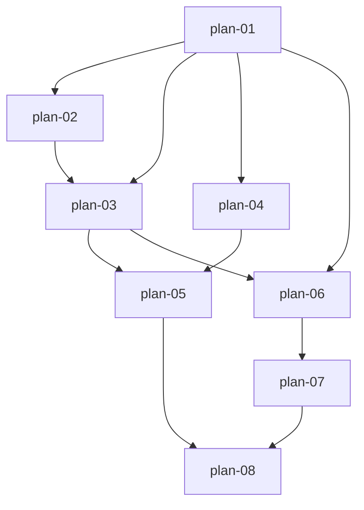

# 实现计划：A股全市场量价指标

## 1. 概览

- **项目**: A股全市场量价指标（第 16 期）
- **来源架构**: `docs/16-A股全市场量价指标/16-1-架构文档-A股全市场量价指标.md`
- **组织方式**: 功能维度（Feature-based）
- **项目类型**: Brownfield（在既有板块强度平台上新增全市场量价指标闭环）
- **技术栈**: 后端 Python 3.12 / FastAPI / SQLAlchemy 2.0 async / PostgreSQL（advisory lock）/ Alembic / APScheduler；前端 Next.js 16 / React 19 / TypeScript / Tailwind 4 / ECharts 6 / SWR / Playwright
- **总阶段数**: 3
- **总功能数**: 8
- **最大并行度**: 2（组内功能文件不相交时可并行；同文件功能必须串行，见 §9.2）
- **关键路径**: plan-01 → plan-02 → plan-03 → plan-06 → plan-07 → plan-08（6 节点最长链；plan-05 分支在 plan-08 前汇入）

## 2. 输入摘要

### 2.1 核心闭环与目标

核心闭环：**拉取 → 核验 → 汇总 → 展示**。基于 Tushare 单交易日全市场未复权行情（3000/页参数化分页），按 L/D/P/G 历史生命周期与 suspend_d 停牌证据校验沪深北 A 股完整集合，完整性通过后 Decimal 原子保存成交量（股）、成交额（元）与简单平均价；本地交易日表承接同步拆分、非交易日守卫与首页缺口轴；范围任务逐日提交、可幂等重跑；两套首页复用同一 `MarketMetricsPanel`，数据管理页新增"市场量价"同步 Tab。

### 2.2 关键 ADR 与实施护栏

| ADR | 核心决策 | 实施护栏 |
| --- | --- | --- |
| ADR-1 | 按交易日批量拉取未复权行情 | 不复用逐股 qfq `get_daily_data`；单日/历史双模式分页守卫，禁 drop_duplicates 静默修复 |
| ADR-2 | L/D/P/G 完整生命周期构造参与集合 | G 固定排除；L/D/P 强制 list_date、D 强制 delist_date；四状态联合 set-diff 清理 |
| ADR-3 | suspend_d 确认停牌并沿用最近收盘 | 仅明确整日停牌补值；分块 100×60 日有界回溯，禁 qfq 后备与逐股 N+1 |
| ADR-4 | 单表日期级原子 upsert | `trade_date` 唯一 + ON CONFLICT DO UPDATE；失败不留半成品 |
| ADR-5 | 范围任务逐日提交、聚合判定部分失败 | 成功日立即提交；任务 max_retries=0；result 携带 dateResults |
| ADR-6 | 首页读预聚合 + 本地日历 | GET 零 Provider 调用；缺失日 null 断线，不补 0/前值 |

任务侧硬护栏（§3.3/§7.4）：`sync_market_metrics` 专属 session advisory owner lock，每次 acquisition 新 UUID token + guard fencing；recovery 按 cancel / timeout / 无停止字段三分支原子终态；其他约 28 类任务保持原路径、新列恒 NULL。

### 2.3 现有代码快照（约定锚点实测）

- **路由前缀链（后端）**: 业务路由 `APIRouter(prefix="/market-metrics")` → v1 主路由 `/v1`（src/api/v1/__init__.py:30）→ main.py `prefix="/api"` = `/api/v1/market-metrics/*`；admin 路由 `APIRouter(prefix="/init")` → src/api/router.py `prefix="/v1/admin"` = `/api/v1/admin/init/market-metrics`（与架构 §7.3 一致）
- **前端 baseURL**: `API_BASE_WITH_PREFIX = ${API_BASE_URL}/api/v1`（web/src/lib/api.ts:9），endpoint 字符串**不带** `/api/v1` 前缀
- **响应解包**: `fetcher` 返回 `result.data`；`AdminApiClient.request` 返回 `json.data`；`ApiClient`+SWR 范式为 `res.data` = `{success, data}` 再取一层 `.data`（IndexMonitorPage.tsx:38-52）
- **序列化**: 后端 `{success, data}` 包裹 + `_dict_to_camel` + Decimal→float + date→ISO（index_monitor.py:55-80）；query/body 保持 snake_case
- **任务范式**: handler 三参签名 `(task_id, params, manager)` + `@TaskRegistry.register`；范围同步参照 `backfill_index_history_task`（task_handlers.py:1638-1688）；互斥创建参照 `init_index_basic.py:60-72`（查 pending/running 后 ApiResponse 拒绝）
- **venv 位置**: `server/.venv`（注意：15 期计划写的 `../.venv` 已失效）
- **测试布局**: pytest 配置在 `server/pytest.ini`（cov-fail-under=80，单文件跑须加 `--no-cov`）；jest 只收 `web/tests/**`（jest.config.ts testMatch）；Playwright spec 在 `web/tests/e2e/`（mock 模式，baseURL 3100）
- **包管理器**: web 使用 pnpm（pnpm-lock.yaml）

### 2.4 架构约束

- 单位口径：存储统一股/元（Tushare 手×100、千元×1000 在服务层转换）；前端显示层 ÷1e8 转亿
- 全程 Decimal 累加，禁 binary float；平均价存 4 位、展示 2 位
- GET 读路径禁止实例化 `TradingCalendar`（缓存未命中会实时访问 Provider）与任何 DataSourceFactory 调用
- 既有 `stock_daily_market_data`（qfq）禁止作为停牌补价源
- 每交易日外部调用软上限 ≤4 次；补价预算常量化；达到账号限额停止并保留成功日
- 盘后 `ah_vol/ah_amount` 不叠加主口径

### 2.5 与架构文档的路径偏离（以代码约定为准）

| 架构原文 | 实际约定 | 影响 |
| --- | --- | --- |
| §9 Phase C 测试在 `web/src/components/market-metrics/__tests__/` | jest testMatch 只收 `web/tests/**` → 放 `web/tests/market-metrics/` | plan-07/08 |
| §9 Phase A 测试 `server/tests/services/test_data_init.py` | 现有文件为 `server/tests/test_data_init.py`（flat）→ 修改现有文件 | plan-03 |

## 3. 验收标准追踪矩阵

| AC-ID | 需求原文 | 架构承接 | 计划承接 | 验证方式 | 当前状态 |
| --- | --- | --- | --- | --- | --- |
| AC-01 | 完整行情生成单日指标 | 采集适配器、汇总服务 | plan-02, plan-03 | plan-02 §5 原料验收 + plan-03 §5 单日闭环验收（复算/不落库） | planned |
| AC-02 | 按日期范围同步 | 任务入口与编排、同步面板 | plan-04, plan-05, plan-08 | plan-05 §5 执行验证（触发→等待→查库）+ plan-08 §5 面板闭环 | planned |
| AC-03 | 重复同步安全覆盖 | 汇总服务 | plan-03 | plan-03 §5 同日覆盖验收 | planned |
| AC-04 | 两套首页与指标切换 | 首页量价模块 | plan-07 | plan-07 §5 布局顺序 + 指标切换 E2E | planned |
| AC-05 | 30/90/250 日切换 | 查询 API、首页量价模块 | plan-06, plan-07 | plan-06 §5 服务端裁剪 + plan-07 §5 范围切换 E2E | planned |
| AC-06 | 无数据与日期缺口 | 查询 API、首页量价模块 | plan-06, plan-07 | plan-06 §5 null 点契约 + plan-07 §5 缺口断线展示 | planned |
| AC-07 | 缺失/重复失败与恢复 | 汇总服务、任务入口与编排 | plan-02, plan-03, plan-04, plan-05, plan-08 | plan-02 §5 完整性错误 + plan-03 §5 整日失败 + plan-05 §5 重跑恢复 + plan-08 §5 失败日计数展示 | planned |
| AC-08 | 自动更新最新交易日 | collector、汇总服务 | plan-05 | plan-05 §5 collector 日更验收（守卫/失败不阻断） | planned |
| AC-09 | 非交易日不生成 | TradingCalendarRepository、collector | plan-01, plan-03, plan-05 | plan-01 §5 日历基础 + plan-03 §5 skipped 守卫 + plan-05 §5 collector 跳过 | planned |
| AC-10 | 日期范围校验 | 管理路由、同步面板 | plan-05, plan-08 | plan-05 §5 四类拒绝不建任务 + plan-08 §5 前端拦截 | planned |
| AC-11 | 权限与任务互斥 | 管理路由、同步面板 | plan-04, plan-05, plan-08 | plan-04 §5 advisory lock 互斥 + plan-05 §5 403/专用入口 + plan-08 §5 互斥交互 | planned |
| AC-12 | 首页失败后重试 | 首页量价模块 | plan-07 | plan-07 §5 SWR 局部 mutate 重试验证 | planned |
| AC-13 | 全天停牌参与计算 | 采集适配器、汇总服务 | plan-02, plan-03 | plan-02 §5 停牌证据/前收盘原料 + plan-03 §5 补值与计数验收 | planned |

## 4. 模块地图

架构 §4.2 六个模块按功能聚合：

| 功能 | 包含模块 | 类型 | 对应文件 |
| --- | --- | --- | --- |
| plan-01 | 采集与本地日历适配（日历部分）、TradingCalendarRepository、两模型 + 迁移 | backend | plan-01-数据模型与本地交易日历.md |
| plan-02 | 采集与本地日历适配（行情/停牌/生命周期部分） | backend | plan-02-全市场量价采集适配器.md |
| plan-03 | 市场量价汇总服务 + L/D/P/G 联合同步 | backend | plan-03-市场量价汇总服务与生命周期同步.md |
| plan-04 | 任务入口与编排（fencing/互斥/恢复基础设施） | backend | plan-04-异步任务fencing基础设施.md |
| plan-05 | 任务入口与编排（handler/路由/collector/scheduler） | backend | plan-05-市场量价范围同步与自动日更.md |
| plan-06 | 市场量价查询 API | backend | plan-06-市场量价查询API.md |
| plan-07 | 首页量价模块 | mixed | plan-07-首页市场量价面板.md |
| plan-08 | 数据管理同步面板 | frontend | plan-08-数据管理市场量价同步面板.md |

## 5. 依赖图



- plan-01→plan-02：同文件顺序编辑（base.py / models.py / tushare_client.py）
- plan-07→plan-08：同文件顺序编辑（marketMetricsTypes.ts / api.ts）
- plan-04 仅依赖 plan-01（迁移链），可与 plan-03 并行（文件不相交）

## 6. 阶段摘要

| 阶段 | 功能 | 目标 |
| --- | --- | --- |
| Phase 1 | plan-01, plan-02 | 数据与采集基础：两表两迁移、本地日历仓库、四组采集方法（分页守卫齐备） |
| Phase 2 | plan-03, plan-04, plan-05, plan-06 | 汇总、任务与查询契约：单日闭环、fencing 任务基础设施、范围同步与自动日更、趋势查询 API |
| Phase 3 | plan-07, plan-08 | 前端集成：两套首页面板（E2E red/green）、数据管理同步 Tab |

## 7. 任务总览

| 功能 | 阶段 | 包含维度 | 依赖 | 独立验收标准 |
| --- | --- | --- | --- | --- |
| plan-01: 数据模型与本地交易日历 | Phase 1 | backend | 无 | 迁移成功 + 日历闭区间校验拒绝部分/重复/越界响应 + upsert 覆盖 |
| plan-02: 全市场量价采集适配器 | Phase 1 | backend | plan-01 | 分页守卫四类完整性错误 + 双模式谓词 + Decimal 数值校验 |
| plan-03: 市场量价汇总服务与生命周期同步 | Phase 2 | backend | plan-01, plan-02 | 单日指标可复算 + 不完整不落库 + 同日覆盖 + 全天停牌补值 |
| plan-04: 异步任务 fencing 基础设施 | Phase 2 | backend | plan-01 | 互斥创建 + token 轮换 + recovery 三分支 + fencing 拒绝旧写 |
| plan-05: 市场量价范围同步与自动日更 | Phase 2 | backend | plan-01~04 | 触发→等待→查库执行验证 + 四类校验拒绝 + collector 日更守卫 |
| plan-06: 市场量价查询 API | Phase 2 | backend | plan-01, plan-03 | 三范围裁剪 + 缺口 null 契约 + 零 Provider + P95 ≤500ms |
| plan-07: 首页市场量价面板 | Phase 3 | mixed | plan-06 | 两套首页布局 + 指标/范围切换 + 缺口/空/错误态 + E2E red/green |
| plan-08: 数据管理市场量价同步面板 | Phase 3 | frontend | plan-05, plan-07 | 前端校验拦截 + 轮询进度 + dateResults 四类计数展示 + 互斥交互 + E2E red/green |

### 7.2 开发状态机

> 流程控制表（非功能状态唯一可信源，功能状态以 plan-*.md frontmatter 为准）。
> plan-01~06 为纯后端功能，plan 文件 §5 已声明 `E2E 不适用` 及理由，red/green E2E 步骤按 `waived` 处理，质量门为各自 §6 验证命令 + task-review；plan-07/08 为用户可见功能，走完整 E2E-TDD 红绿循环。

| FEAT | 当前步骤 | red_e2e | implement | green_e2e | review | 最近证据 | 阻塞原因 | 更新时间 |
| --- | --- | --- | --- | --- | --- | --- | --- | --- |
| plan-01 | done | waived | done | waived | done | reviews/plan-01-review-20260814.md（通过，0 blocker） | E2E 豁免：纯数据层（plan-01 §5） | 2026-08-14 |
| plan-02 | done | waived | done | waived | done | reviews/plan-02-review-20260814.md（通过，0 blocker） | E2E 豁免：纯采集层（plan-02 §5） | 2026-08-14 |
| plan-03 | done | waived | done | waived | done | reviews/plan-03-review-20260814.md（通过，0 blocker；S1 后补丁已修，head=e5c1f3a90b2d） | E2E 豁免：纯服务层（plan-03 §5） | 2026-08-14 |
| plan-04 | done | waived | done | waived | done | reviews/plan-04-review-20260814.md（通过，0 blocker；双 advisory lock key 裁定正确） | E2E 豁免：任务基础设施（plan-04 §5） | 2026-08-14 |
| plan-05 | done | waived | done | waived | done | reviews/plan-05-review-20260814.md（通过，0 blocker；真实执行器失败日链路亦实证） | E2E 豁免：后端任务功能，执行验证见 plan-05 §5 | 2026-08-14 |
| plan-06 | done | waived | done | waived | done | reviews/plan-06-review-20260814.md（通过，0 blocker；Query 签名偏差裁定等价） | E2E 豁免：纯 API，浏览器侧由 plan-07 E2E 覆盖 | 2026-08-14 |
| plan-07 | done | done | done | done | done | reviews/plan-07-review-20260814.md（通过，0 blocker；三处偏离均裁定接受） | - | 2026-08-14 |
| plan-08 | done | done | done | done | done | reviews/plan-08-review-20260814.md（通过，0 blocker；AdminApiClient 变更裁定为行为改进） | - | 2026-08-14 |

## 8. 未决策项

| 编号 | 问题 | 影响功能 | 需要谁决策 | 阻塞等级 |
| --- | --- | --- | --- | --- |
| — | 无（架构文档 §5.x 与 frontmatter open_questions 均为空） | — | — | — |

## 9. 执行前置

### 9.1 环境准备

- 本地 PostgreSQL 可用（`server/tests/conftest.py` 拒绝 SQLite；advisory lock 测试需真 PG）
- `server/.venv` 激活：`cd server && source .venv/bin/activate`
- `TUSHARE_TOKEN` 等环境变量已配置（真实冒烟与执行验证需要）
- web 依赖：`cd web && pnpm install`；Playwright 浏览器：`pnpm exec playwright install`
- E2E 前置：`pnpm dev` 起本地 3100 端口（mock 模式，不依赖真实后端）

### 9.2 执行顺序

按 `execution_order` 分组推进，**组内仅文件不相交时可并行**：

1. `["plan-01"]` → 2. `["plan-02"]` → 3. `["plan-03", "plan-04"]`（文件不相交，可并行）→ 4. `["plan-05", "plan-06"]`（文件不相交，可并行）→ 5. `["plan-07"]` → 6. `["plan-08"]`

开发必须遵循 E2E-TDD：plan-07/08 在实现前先生成 red E2E 用例/spec 并记录失败证据；纯后端功能以 pytest（含 plan-05 执行验证）为质量门。

### 9.3 全局验证

所有功能完成后执行：

```bash
# 后端全量（覆盖率门槛 80% 生效）
cd server && source .venv/bin/activate && pytest tests/ -v

# 迁移链完整
alembic upgrade head && alembic check

# 前端
cd web && pnpm exec tsc --noEmit && pnpm build && pnpm test

# E2E 全量（先 pnpm dev）
pnpm test:e2e
```

## 10. 变更记录

| 日期 | 变更类型 | 功能 | 说明 |
| --- | --- | --- | --- |
| 2026-08-14 | 初始生成 | plan-01 ~ plan-08 | 从 16-1 架构文档首次生成实现计划（brownfield，8 功能 / 3 阶段） |
| 2026-08-14 | 质检修复 R1 | README, plan-03, plan-05, plan-06, plan-07, plan-08 | 修正 critical_path 为真实最长链（01→02→03→06→07→08）；plan-07 API 泛型改为完整业务包 + `as unknown as`；统一 result 键 camelCase 三方契约（plan-05 产出/plan-04 透传/plan-08 直消费）；锚点行号校准；Query regex→pattern |
| 2026-08-14 | 质检修复 R2 | plan-03, plan-08 | 锚点行号精校（`_safe_nested_tx` L30、互斥 isAnySyncRunning L488/L535、initIndexHistory L626/initLimit L631）；R2 另两项经 grep 实证为 checker 误报未改动；R3 终检 0 问题通过 |
| 2026-08-14 | 开发执行 | plan-01 ~ plan-08 | auto-dev 全循环完成：8/8 done（后端 6 个 waive E2E 走 pytest+执行验证质量门，前端 2 个完整 red/green E2E-TDD）；过程中修复 suspend_d 上游缺陷（trade_date 双键归一化）、plan-03 updated_at 恒 NULL（S1）、init_stocks_lifecycle 递归崩溃（blocker）；迁移链 head=a7d2e9f4c1b8；终验 E2E 30 passed + 后端 197 passed |
| 2026-08-14 | 遗留事项清理 | 测试基建 / scheduler / plan-05 / plan-08 | ① 修复双层中间件解包根因（11 个测试文件，49+99+148 ERROR 清零）；② 日更 job 落地为 `ENABLE_DAILY_UPDATE_JOB` env 开关（默认停用保开发惯例，true=每日 18:00 Asia/Shanghai，无工作日表达式），scheduler 测试适配新契约；③ 修复基金退市过滤产品 bug（`status=="D"`→`"E"`，与 docstring/测试契约对齐）；④ plan-08 S-1（running 时隐藏历史结果区，E2E 10/10 保持）；⑤ plan-05 handler 级单测 8 用例。终验：后端全量 1177 passed / 0 failed / 0 errors，前端 jest 241 + E2E 全量 205 全绿。注：全局覆盖率 61.96% 未达 pytest.ini 80% 门槛，缺口集中在预存老模块（tushare_client/task_executor 后台循环/data_init 老段），16 期新模块 90-100%，属仓库预存债务，需单独立项决策 |

<!-- 保留目录：reviews/。当 task-review、dev-plan-check 等开始运行时创建。 -->
