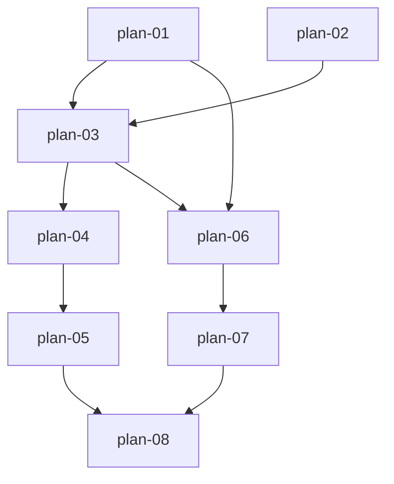

# 实现计划：融资融券数据同步与首页曲线图

## 1. 概览

- **项目**: 融资融券数据同步与首页曲线图（第 17 期，FEAT-0002）
- **来源 spec**: `docs/FEAT-0002-market-margin.md`（status: approved，意图/边界/REQ/AC 冻结）
- **范式母本**: `docs/16-A股全市场量价指标/16-2-实现计划-A股全市场量价指标/`（第 16 期 market-metrics 全链路，plan-01~08 一一同构）
- **组织方式**: 功能维度（Feature-based）
- **项目类型**: Brownfield（在既有板块强度平台上，照搬 market-metrics 范式新增融资融券数据闭环）
- **技术栈**: 后端 Python 3.12 / FastAPI / SQLAlchemy 2.0 async / PostgreSQL（advisory lock）/ Alembic；前端 Next.js / React 19 / TypeScript / Tailwind / ECharts 6 + echarts-for-react / SWR / Playwright
- **总阶段数**: 3
- **总功能数**: 8
- **最大并行度**: 2（组内功能文件不相交时可并行，见 §9.2）
- **关键路径**: plan-01 → plan-03 → plan-04 → plan-05 → plan-08（5 节点；plan-06→07→08 分支同长，在 plan-08 前汇入）

## 2. 输入摘要

### 2.1 核心闭环与目标

核心闭环：**拉取 → 聚合 → 存储 → 触发 → 展示**。基于 Tushare `margin` 融资融券交易汇总接口（doc_id=58，2000 积分），按交易日拉取全部交易所行（实测 2026-08 起为沪 SSE+深 SZSE+北 BSE 三行，2026-08-14 用户裁定全量入聚合）原始数据，服务层五字段求和并重算 `rzrqye` 后 Decimal 原子 upsert 为全市场单行（`market_margin_daily`）；异步范围同步任务复用第 16 期 fencing 范式（专属 advisory owner lock + token + 互斥 + stale 恢复 + 通用入口封堵）；查询端 `trading_calendar_days` LEFT JOIN 输出缺口 null；首页新增融资融券双 Y 轴曲线面板，数据管理页新增"融资融券"同步 Tab。

### 2.2 关键决策与实施护栏（spec 冻结，锁定不可改）

| # | 决策 | 实施护栏 |
| --- | --- | --- |
| D1 | 数据源固定 tushare `margin` 汇总接口 | 输入 trade_date/exchange_id/start_date/end_date；输出 rzye/rzmre/rzche/rqye/rqmcl/rqyl/rzrqye（元/股口径）；单日返回全部交易所行（实测 SSE/SZSE/BSE 三行，聚合对全部返回行求和，对未来行数变化稳健），**无需分页**；不引入 margin_detail 个股明细 |
| D2 | 全市场合计口径 | rzye/rqye/rzmre/rzche/rqmcl 五字段对全部交易所行求和（行数以接口实际返回为准）；**`rzrqye = sum(rzye) + sum(rqye)` 服务层重算，禁止直接 sum 每行 rzrqye** |
| D3 | 单表日期级原子 upsert | `market_margin_daily` 每交易日唯一一行（trade_date 唯一约束 + 索引）；六指标 Numeric(20,2)；`on_conflict_do_update(trade_date)`；成功立即 commit、失败回滚当日 |
| D4 | 任务 fencing 照搬 16 期 plan-04 范式 | 专属 advisory lock + owner lock + fencing token + stale 恢复 + `RESERVED_TASK_TYPES` 通用入口封堵；**不改动 market-metrics 现有代码逻辑（仅扩展，以新增为主）** |
| D5 | 前端展示层 ÷1e8 转亿 | 双 Y 轴：左轴万亿级 rzye+rzrqye 线图，右轴千亿级 rqye+rzmre（含 legend；右轴统一元口径，rqmcl 股口径不入图、仅存类型与数据契约）；ECharts 6 + echarts-for-react dynamic import ssr:false；不引入新图表库/状态管理库 |

### 2.3 现有代码快照（约定锚点实测，2026-08-14）

- **交易日历已存在**：`trading_calendar_days` 表与 `TradingCalendarRepository`（`server/src/services/trading_calendar_repository.py`）由 16 期 plan-01 交付，**本期复用、不重建**
- **async_task 四列已存在**：`result/cancel_requested_at/timeout_requested_at/executor_acquisition_token` 由 16 期迁移 `a7d2e9f4c1b8` 交付，**本期 plan-04 无需新迁移**
- **路由前缀链（后端）**: 业务路由 `APIRouter(prefix="/margin")` → v1 主路由 `/v1`（`server/src/api/v1/__init__.py`）→ main.py `prefix="/api"` = `/api/v1/margin/*`；admin 路由 `APIRouter(prefix="/init")` → `/v1/admin` = `/api/v1/admin/init/margin`
- **前端 baseURL**: `API_BASE_WITH_PREFIX = ${API_BASE_URL}/api/v1`（web/src/lib/api.ts:9），endpoint 字符串不带 `/api/v1` 前缀
- **响应解包**: `apiClient.get` 泛型必须写完整业务包 `{success, data}`（`ApiClient.request` 返回 `{data: 完整响应体}`）；SWR 范式 `res.data` = `{success,data}` 再取一层 `.data`（MarketMetricsPanel.tsx:93-105）
- **任务范式**: handler 三参签名 `(task_id, params, manager)` + `@TaskRegistry.register`；范围同步范式 `sync_market_metrics_task`（task_handlers.py:1876）；result 键 camelCase、`to_dict()` 原样透传不经 `_dict_to_camel`，前端直消费
- **Query pattern 实测教训（16 期）**: Pydantic 2.12 禁止对 int schema 应用 pattern，trend 端点 `range` 声明为 pattern 约束的 `str` 后端点内 `int()`（market_metrics.py:110/130），17 期 plan-06 照抄
- **updated_at 实测教训（16 期 S1）**: `on_conflict_do_update` 不触发 ORM onupdate，upsert `set_` 必须显式 `updated_at=func.now()`（market_metrics_service.py:839-843），17 期 plan-03 照抄
- **迁移链 head**: `a7d2e9f4c1b8`（`server/alembic/versions/2026_08_15_0001-a7d2e9f4c1b8_add_async_task_result.py`），本期 plan-01 新迁移 `down_revision='a7d2e9f4c1b8'`
- **venv / 测试**: `server/.venv`；pytest 配置 `server/pytest.ini`（cov-fail-under=80，单文件跑须加 `--no-cov`）；jest 只收 `web/tests/**`；Playwright spec 在 `web/tests/e2e/`（mock 模式，baseURL 3100）；web 包管理器 pnpm

### 2.4 spec 约束（frozen-after-approval）

- 必须复用 market-metrics 三大范式：单表日期级原子 upsert、异步任务专属锁 + fencing + 互斥 + 恢复、查询端 `trading_calendar_days` LEFT JOIN 缺口 null
- 数值全程 `Decimal(str())` 强约束，禁 binary float
- 不改动 market-metrics 现有代码逻辑（复用范式、以新增文件为主；对共享文件的扩展必须保持 16 期行为语义不变）
- 不引入 margin_detail、不引入新图表库/状态管理库

## 3. 验收标准追踪矩阵

| AC-ID | 需求原文 | 架构承接 | 计划承接 | 验证方式 | 当前状态 |
| --- | --- | --- | --- | --- | --- |
| AC-1 | 聚合正确（全部交易所行求和、rzrqye 重算） | MarginService 汇总（spec REQ-3） | plan-03 | plan-03 §5 聚合复算验收（spec 数值用例）+ §6 pytest | planned |
| AC-2 | 幂等 upsert（同日覆盖非新增） | MarginService 汇总（spec REQ-2/3） | plan-03 | plan-03 §5 同日覆盖验收 + §6 pytest | planned |
| AC-3 | 同步任务互斥（重复触发被拒） | 任务 fencing（spec REQ-4） | plan-04 | plan-04 §5 互斥创建验收 + 执行验证 | planned |
| AC-4 | 同步端点校验（end>today 拒绝不建任务） | admin 管理路由（spec REQ-5） | plan-05 | plan-05 §5 五项校验拒绝 + §6 pytest | planned |
| AC-5 | 查询缺口（缺失日 null、hasMissingDates） | 查询 API（spec REQ-6） | plan-06 | plan-06 §5 null 点契约 + §6 pytest | planned |
| AC-6 | 首页面板渲染（4 卡片 + 双 Y 轴 + 范围切换） | 首页面板（spec REQ-7） | plan-07 | plan-07 §5 面板 E2E red/green | planned |
| AC-7 | 同步面板（进度/明细/历史记录） | 同步面板（spec REQ-8） | plan-08 | plan-08 §5 同步面板 E2E red/green | planned |
| AC-8 | 通用入口封堵（POST /admin/tasks 拒绝保留类型） | 任务 fencing（spec REQ-4） | plan-04 | plan-04 §5 RESERVED 封堵验收 + §6 pytest | planned |

## 4. 模块地图

spec REQ-1~REQ-8 按功能聚合（与 16 期一一同构）：

| 功能 | 包含模块 | 类型 | 对应文件 |
| --- | --- | --- | --- |
| plan-01 | 数据模型与迁移（market_margin_daily 表；trading_calendar_days 复用） | backend | plan-01-数据模型与迁移.md |
| plan-02 | 融资融券采集适配器（tushare_client.get_margin） | backend | plan-02-融资融券采集适配器.md |
| plan-03 | 融资融券汇总服务（全部交易所行聚合 + rzrqye 重算 + 原子 upsert） | backend | plan-03-融资融券汇总服务.md |
| plan-04 | 异步任务与 fencing（TaskType/handler/锁 key/互斥/恢复/封堵） | backend | plan-04-异步任务与fencing.md |
| plan-05 | admin 同步触发端点（POST /api/v1/admin/init/margin） | backend | plan-05-admin同步触发端点.md |
| plan-06 | 融资融券查询 API（GET /api/v1/margin/trend） | backend | plan-06-融资融券查询API.md |
| plan-07 | 首页融资融券面板（MarginPanel） | mixed | plan-07-首页融资融券面板.md |
| plan-08 | 数据管理融资融券同步面板（MarginSyncPanel + admin tab） | frontend | plan-08-数据管理融资融券同步面板.md |

## 5. 依赖图



- plan-03→plan-04：handler 调 `MarginService.sync_date`（17 期 handler 落在 plan-04，与 16 期 plan-05 落 handler 不同，见 plan-04 功能概要）
- plan-07→plan-08：同文件顺序编辑（marginTypes.ts / api.ts / useTaskStatus.ts）
- plan-05 与 plan-06 文件不相交（admin/__init__.py vs v1/__init__.py），可并行
- plan-01 与 plan-02 文件不相交（models+alembic vs tushare_client），可并行

## 6. 阶段摘要

| 阶段 | 功能 | 目标 |
| --- | --- | --- |
| Phase 1 | plan-01, plan-02 | 数据与采集基础：market_margin_daily 表 + 迁移、get_margin 采集方法（Decimal 强约束） |
| Phase 2 | plan-03, plan-04, plan-05, plan-06 | 汇总、任务与查询契约：多行聚合单日闭环、fencing 任务扩展（含 handler）、admin 触发端点、趋势查询 API |
| Phase 3 | plan-07, plan-08 | 前端集成：首页双 Y 轴面板（E2E red/green）、数据管理同步 Tab（E2E red/green） |

## 7. 任务总览

| 功能 | 阶段 | 包含维度 | 依赖 | 独立验收标准 |
| --- | --- | --- | --- | --- |
| plan-01: 数据模型与迁移 | Phase 1 | backend | 无 | 迁移成功可回退 + 模型注册 + 唯一约束/索引/列型正确 + 日历表复用不重建 |
| plan-02: 融资融券采集适配器 | Phase 1 | backend | 无 | 交易所行原始数据 Decimal 强约束 + 空/非法字段拒绝 + 旧方法回归 |
| plan-03: 融资融券汇总服务 | Phase 2 | backend | plan-01, plan-02 | AC-1 数值复算 + rzrqye 重算 + AC-2 同日覆盖 + 日历守卫 + 失败回滚 |
| plan-04: 异步任务与fencing | Phase 2 | backend | plan-03 | AC-3 互斥创建 + AC-8 通用入口封堵 + 执行验证（触发→等待→查库）+ 16 期任务系统回归 |
| plan-05: admin同步触发端点 | Phase 2 | backend | plan-04 | AC-4 五项校验拒绝不建任务 + 403 非管理员 + 互斥提示 |
| plan-06: 融资融券查询API | Phase 2 | backend | plan-01, plan-03 | AC-5 三范围裁剪 + 缺口 null + 零 Provider + camelCase/float 契约 |
| plan-07: 首页融资融券面板 | Phase 3 | mixed | plan-06 | AC-6 4 卡片亿单位 + 双 Y 轴 + legend + 30/90/250 切换 + E2E red/green |
| plan-08: 数据管理融资融券同步面板 | Phase 3 | frontend | plan-05, plan-07 | AC-7 前端校验拦截 + 轮询进度 + 三类计数 + 逐日明细展开 + E2E red/green |

### 7.2 开发状态机

> 流程控制表（非功能状态唯一可信源，功能状态以 plan-*.md frontmatter 为准）。
> plan-01~06 为纯后端功能，plan 文件 §5 已声明 `E2E 不适用` 及理由（plan-04 含 task handler 执行验证、plan-05 含路由级执行验证，均不可豁免），red/green 浏览器 E2E 步骤按 `waived` 处理，质量门为各自 §6 验证命令 + task-review；plan-07/08 为用户可见功能，走完整 E2E-TDD 红绿循环。

| FEAT | 当前步骤 | red_e2e | implement | green_e2e | review | 最近证据 | 阻塞原因 | 更新时间 |
| --- | --- | --- | --- | --- | --- | --- | --- | --- |
| plan-01 | done | waived | done | waived | done | reviews/plan-01-review-20260814.md（通过，0 blocker；迁移 63164af1c44c） | E2E 豁免：纯数据层（plan-01 §5） | 2026-08-14 |
| plan-02 | done | waived | done | waived | done | reviews/plan-02-review-20260814.md（通过，0 blocker；W1 docstring 口径已由主 agent 顺手修正） | E2E 豁免：纯采集层（plan-02 §5） | 2026-08-14 |
| plan-03 | done | waived | done | waived | done | reviews/plan-03-review-20260814.md（通过，0 blocker；W2 模型 docstring 口径已由主 agent 顺手修正） | E2E 豁免：纯服务层（plan-03 §5） | 2026-08-14 |
| plan-04 | done | waived | done | waived | done | reviews/plan-04-review-20260814.md（通过，0 blocker；W1 is_fenced 预初始化已由主 agent 顺手修复） | E2E 豁免：后端任务功能，执行验证见 plan-04 §5 | 2026-08-14 |
| plan-05 | done | waived | done | waived | done | reviews/plan-05-review-20260814.md（通过，0 blocker；五项校验/互斥/403/16期母本零改动逐项属实） | E2E 豁免：后端路由功能，执行验证见 plan-05 §5 | 2026-08-14 |
| plan-06 | done | waived | done | waived | done | reviews/plan-06-review-20260814.md（通过，0 blocker；零 Provider/缺口 null/契约逐项复核属实） | E2E 豁免：纯 API，浏览器侧由 plan-07 E2E 覆盖 | 2026-08-14 |
| plan-07 | done | done | done | done | done | reviews/plan-07-review-20260814.md（通过，0 blocker；两处母本偏离均裁定合理改进） | - | 2026-08-14 |
| plan-08 | done | done | done | done | done | reviews/plan-08-review-20260814.md（通过，0 blocker；useTaskStatus 泛型化裁定合理，5 条 warning 均不阻塞） | - | 2026-08-14 |

## 8. 未决策项

| 编号 | 问题 | 影响功能 | 需要谁决策 | 阻塞等级 |
| --- | --- | --- | --- | --- |
| — | 无（spec "先问：无"，意图/边界已冻结；代码路径均已锚点实测） | — | — | — |

## 9. 执行前置

### 9.1 环境准备

- 本地 PostgreSQL 可用（`server/tests/conftest.py` 拒绝 SQLite；advisory lock 测试需真 PG）
- `server/.venv` 激活：`cd server && source .venv/bin/activate`
- `TUSHARE_TOKEN` 已配置且账号具备 margin 接口权限（2000 积分；真实冒烟与执行验证需要）
- web 依赖：`cd web && pnpm install`；Playwright 浏览器：`pnpm exec playwright install`
- E2E 前置：`pnpm dev` 起本地 3100 端口（mock 模式，不依赖真实后端）
- 迁移链起点：`alembic upgrade head` 当前为 `a7d2e9f4c1b8`（16 期终态）

### 9.2 执行顺序

按 `execution_order` 分组推进，组内仅文件不相交时可并行：

1. `["plan-01", "plan-02"]`（文件不相交，可并行）→ 2. `["plan-03"]` → 3. `["plan-04"]` → 4. `["plan-05", "plan-06"]`（文件不相交，可并行）→ 5. `["plan-07"]` → 6. `["plan-08"]`

开发必须遵循 E2E-TDD：plan-07/08 在实现前先生成 red E2E 用例/spec 并记录失败证据；纯后端功能以 pytest（含 plan-04/05 执行验证）为质量门。plan-04 扩展共享文件（task_manager/task_fence/task_executor/admin tasks）时必须先跑 16 期既有任务系统回归（见 plan-04 §6）。

### 9.3 全局验证

所有功能完成后执行：

```bash
# 后端全量（覆盖率门槛 80% 生效）
cd server && source .venv/bin/activate && pytest tests/ -v

# 迁移链完整
alembic upgrade head && alembic check

# 前端
cd web && pnpm exec tsc --noEmit && pnpm build && pnpm test

# E2E 全量（先 pnpm dev）
pnpm test:e2e
```

## 10. 变更记录

| 日期 | 变更类型 | 功能 | 说明 |
| --- | --- | --- | --- |
| 2026-08-14 | 初始生成 | plan-01 ~ plan-08 | 从 FEAT-0002 spec（approved）+ 16 期黄金参照首次生成实现计划（brownfield，8 功能 / 3 阶段） |

<!-- 保留目录：reviews/。当 task-review、dev-plan-check 等开始运行时创建。 -->
