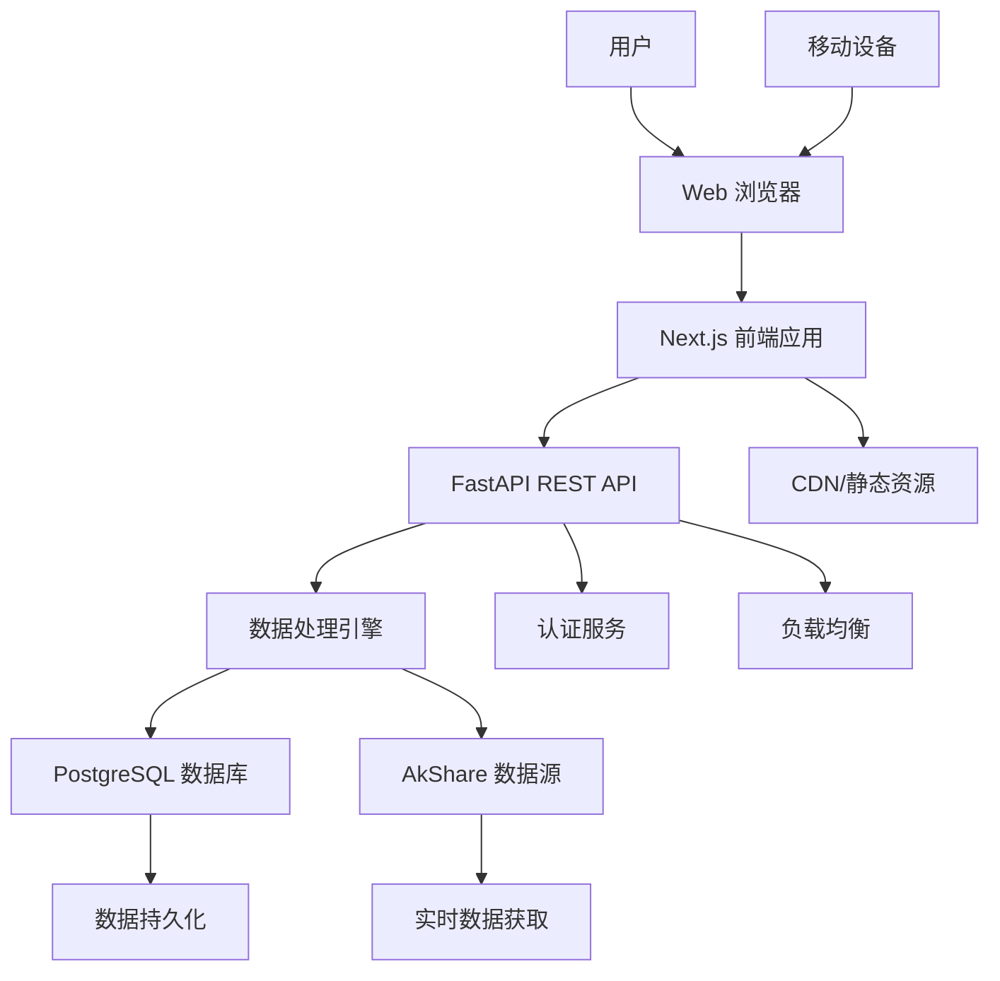

# Sector Strength 全栈架构文档

## 介绍

本文档概述了 Sector Strength 股票分析系统的完整全栈架构，包括后端系统、前端实现及其集成。它作为 AI 驱动开发的单一事实来源，确保整个技术栈的一致性。

### 变更日志

| 日期 | 版本 | 描述 | 作者 |
|------|---------|-------------|--------|
| 2025-09-21 | v1.0 | 初始架构文档创建 | Winston (架构师) |

## 高级架构

### 技术摘要

本项目采用现代化的全栈架构，结合 Next.js 前端和 FastAPI 后端，专注于实时股票数据分析和可视化。架构采用 Docker 容器化部署，支持开发和生产环境的一致性。前端使用 TypeScript + React + Tailwind CSS 构建响应式金融数据界面，后端使用 Python + FastAPI 处理实时数据计算和 API 服务。通过 PostgreSQL 数据库进行数据持久化，利用 AkShare 作为主要数据源。

### 平台和基础设施选择

**推荐方案: Docker + 自托管部署**

**理由:**
- **灵活性:** 完全控制部署环境和配置
- **成本效益:** 避免云平台锁定和潜在的高额费用
- **数据安全:** 金融数据在自有环境中更安全可控
- **性能优化:** 可以根据具体需求精细调整资源分配

**核心服务:**
- **应用部署:** Docker Compose + Nginx 反向代理
- **数据库:** PostgreSQL 14+ 容器化部署
- **文件存储:** 本地存储或兼容 S3 的对象存储

### 仓库结构

**结构:** Hybrid 扁平化结构
**管理工具:**
- 前端: Turborepo (在 web 目录内)
- 后端: 独立的 Python 项目
- 整体: Docker Compose 协调

```
sector-strength/
├── web/                             # Next.js 前端 monorepo
├── server/                          # FastAPI 后端应用
├── docker-compose.yml               # Docker Compose 配置
├── scripts/                         # 构建和部署脚本
├── docs/                            # 文档
├── .env.example                     # 环境变量模板
└── README.md                        # 项目总说明
```

### 架构图



### 架构模式

**Jamstack 架构:** 静态生成与动态 API 结合 - _理由:_ 提供优秀的性能和用户体验，同时支持复杂的实时数据需求

**组件化 UI:** 基于 React 的可复用组件 - _理由:_ 提高开发效率，确保界面一致性，支持复杂的金融数据可视化

**REST API 模式:** 资源导向的 API 设计 - _理由:_ 简单明了，工具生态丰富，适合金融数据接口

**Repository 模式:** 抽象数据访问逻辑 - _理由:_ 提高测试性，支持未来数据库迁移灵活性

## 技术栈

### 技术栈表格

| 类别 | 技术 | 版本 | 用途 | 理由 |
|------|------|------|------|------|
| 前端语言 | TypeScript | 5.x | 类型安全的客户端开发 | 提供更好的开发体验和代码质量 |
| 前端框架 | Next.js | 14.x | React 全栈框架 | 支持 SSR、API 路由和优化性能 |
| UI 组件库 | shadcn/ui + Radix UI | 最新 | 可访问的组件库 | 基于 PRD 要求，提供专业金融界面 |
| 状态管理 | Zustand | 4.x | 轻量级状态管理 | 简单易用，适合中等复杂度应用 |
| 后端语言 | Python | 3.11+ | 数据处理和 API | 强大的数据科学生态，适合金融计算 |
| 后端框架 | FastAPI | 0.104+ | 高性能 API 框架 | 异步支持好，自动文档生成 |
| API 风格 | REST | - | 资源导向 API | 简单明了，工具生态丰富 |
| 数据库 | PostgreSQL | 14+ | 关系型数据存储 | 稳定可靠，支持复杂查询 |
| 文件存储 | 本地存储 | - | 静态文件服务 | 初期简单，可通过 Nginx 服务 |
| 认证 | JWT | - | 用户认证和授权 | 无状态，适合 REST API |
| 前端测试 | Jest + React Testing Library | 最新 | 单元和集成测试 | 社区标准，React 生态完善 |
| 后端测试 | pytest + HTTPX | 最新 | Python 单元和 API 测试 | Python 测试标准，异步支持好 |
| E2E 测试 | Playwright | 1.40+ | 端到端测试 | 跨浏览器支持，可靠性高 |
| 构建工具 | Turborepo (前端) | 最新 | 前端 monorepo 构建 | 高效的增量构建和缓存 |
| 打包工具 | Webpack (Next.js 内置) | - | 前端资源打包 | Next.js 默认，配置简单 |
| IaC 工具 | Docker Compose | 2.x | 基础设施即代码 | 开发和生产环境一致性 |
| CI/CD | GitHub Actions | - | 自动化流水线 | 与 GitHub 集成良好 |
| CSS 框架 | Tailwind CSS | 3.x | 实用优先的 CSS | 与 shadcn/ui 完美集成 |

## 数据模型

### 板块 (Sector)

**用途:** 代表股票市场中的行业板块或概念板块

**关键属性:**
- `id`: string - 板块唯一标识符
- `name`: string - 板块名称
- `code`: string - 板块代码
- `type`: string - 板块类型（'industry': 行业板块, 'concept': 概念板块）
- `description`: string - 板块描述
- `strength_score`: number - 当前综合强度得分
- `trend_direction`: number - 趋势方向

### 个股 (Stock)

**用途:** 代表具体的股票，可以属于多个板块

**关键属性:**
- `id`: string - 股票唯一标识符
- `symbol`: string - 股票代码
- `name`: string - 股票名称
- `current_price`: number - 当前价格
- `market_cap`: number - 市值

### 板块-个股关联 (SectorStock)

**用途:** 多对多关联表，记录个股所属的板块

**关键属性:**
- `id`: string - 关联记录ID
- `sector_id`: string - 板块ID
- `stock_id`: string - 个股ID

### 周期配置 (PeriodConfig)

**用途:** 管理系统支持的均线周期配置

**关键属性:**
- `id`: string - 配置唯一标识符
- `period`: string - 周期标识（如：'5d', '10d', '20d', '30d', '60d'）
- `name`: string - 周期名称（如：'5日均线', '10日均线'）
- `days`: number - 实际天数
- `weight`: number - 在综合得分中的权重
- `is_active`: boolean - 是否启用

### 日线行情数据 (DailyMarketData)

**用途:** 存储个股和板块的日线行情数据

**关键属性:**
- `id`: string - 数据唯一标识符
- `entity_type`: string - 实体类型（'stock': 个股, 'sector': 板块）
- `entity_id`: string - 实体ID（股票ID或板块ID）
- `date`: Date - 交易日
- `open`: number - 开盘价
- `high`: number - 最高价
- `low`: number - 最低价
- `close`: number - 收盘价
- `volume`: number - 成交量
- `turnover`: number - 成交额
- `change`: number - 涨跌幅
- `change_percent`: number - 涨跌百分比

### 均线数据 (MovingAverageData)

**用途:** 存储计算好的均线数据，支持个股和板块

**关键属性:**
- `id`: string - 数据唯一标识符
- `entity_type`: string - 实体类型（'stock': 个股, 'sector': 板块）
- `entity_id`: string - 实体ID
- `date`: Date - 计算日期
- `period`: string - 均线周期
- `ma_value`: number - 均线值
- `price_ratio`: number - 价格与均线的比率
- `trend`: number - 趋势方向

### 用户 (User)

**用途:** 存储用户账户信息和认证数据

**关键属性:**
- `id`: string - 用户唯一标识符
- `email`: string - 电子邮箱（登录用）
- `password_hash`: string - 加密后的密码
- `username`: string - 用户名
- `created_at`: Date - 创建时间
- `updated_at`: Date - 更新时间
- `is_active`: boolean - 账户是否激活
- `last_login`: Date - 最后登录时间

### 关注列表 (Watchlist)

**用途:** 存储用户关注的板块和个股

**关键属性:**
- `id`: string - 关注记录唯一标识符
- `user_id`: string - 用户ID（外键）
- `entity_type`: string - 实体类型（'stock': 个股, 'sector': 板块）
- `entity_id`: string - 实体ID（股票ID或板块ID）
- `created_at`: Date - 添加关注时间
- `notes`: string - 用户备注（可选）

## API 规范

### REST API 规范

基于选择的技术栈中的 REST API 风格，创建 OpenAPI 3.0 规范。主要接口包括：

- `GET /sectors` - 获取板块列表
- `GET /sectors/{sectorId}` - 获取板块详情
- `GET /sectors/{sectorId}/stocks` - 获取板块成分股
- `GET /stocks` - 获取个股列表
- `GET /stocks/{stockId}` - 获取个股详情
- `GET /strength` - 获取强度数据
- `GET /market-data` - 获取行情数据
- `GET /heatmap` - 获取热力图数据
- `GET /rankings` - 获取排名数据

**认证相关 API:**
- `POST /auth/register` - 用户注册
- `POST /auth/login` - 用户登录
- `POST /auth/logout` - 用户注销
- `POST /auth/refresh` - 刷新令牌
- `GET /auth/profile` - 获取用户信息
- `PUT /auth/profile` - 更新用户信息

**关注功能 API:**
- `GET /watchlist` - 获取关注列表
- `POST /watchlist/{entityType}/{entityId}` - 添加关注
- `DELETE /watchlist/{entityType}/{entityId}` - 取消关注
- `PUT /watchlist/{entityType}/{entityId}` - 更新关注备注

## 组件

### 前端组件

**数据可视化组件 (DataVisualizationComponent)**
- **职责:** 负责金融数据可视化渲染
- **技术栈:** React + TypeScript + ECharts + echarts-for-react

**数据服务组件 (DataServiceComponent)**
- **职责:** 前后端数据通信和状态管理
- **技术栈:** React Hooks + Zustand + Axios

**用户界面组件 (UIComponentLibrary)**
- **职责:** 可复用的 UI 组件
- **技术栈:** shadcn/ui + Radix UI + Tailwind CSS

### 后端组件

**数据获取服务 (DataAcquisitionService)**
- **职责:** 从 AkShare 获取实时股票数据
- **技术栈:** Python + APScheduler + AkShare

**数据处理引擎 (DataProcessingEngine)**
- **职责:** 计算均线和强度数据
- **技术栈:** Python + Pandas/Numpy + PostgreSQL

**API 服务组件 (APIServiceComponent)**
- **职责:** 处理 HTTP 请求和响应
- **技术栈:** FastAPI + Pydantic + SQLAlchemy

**数据库服务 (DatabaseService)**
- **职责:** 数据持久化和访问
- **技术栈:** SQLAlchemy + asyncpg + PostgreSQL

## 开发工作流

### 本地开发设置

**先决条件:**
- Node.js >= 18.0.0
- Python >= 3.11.0
- Docker >= 20.10.0
- Docker Compose >= 2.0.0

**初始设置:**
```bash
git clone <repository-url>
cd sector-strength

# 安装前端依赖
cd web
npm install

# 安装后端依赖
cd ../server
pip install -r requirements.txt
pip install -r requirements-dev.txt

# 复制环境文件
cp .env.example .env
```

**开发命令:**
```bash
##分别启动
cd server && uvicorn src.main:app --reload  # 后端
cd web && npm run dev                      # 前端

# 运行测试
cd web && npm test         # 前端测试
cd server && pytest tests/ # 后端测试
```

## 部署架构

### 部署策略

**前端部署:**
- **平台:** Docker 容器部署
- **构建命令:** `cd web && npm run build`
- **输出目录:** `web/apps/frontend/.next`
- **CDN/边缘:** 通过 Nginx 提供静态文件服务

**后端部署:**
- **平台:** Docker 容器部署
- **构建命令:** 通过 Dockerfile 多阶段构建
- **部署方法:** Docker Compose

### 环境配置

| 环境 | 前端URL | 后端URL | 用途 |
|------|---------|---------|------|
| 开发 | http://localhost:3000 | http://localhost:8000 | 本地开发环境 |
| 测试 | https://test.sector-strength.com | https://api-test.sector-strength.com | 预生产测试 |
| 生产 | https://sector-strength.com | https://api.sector-strength.com | 生产环境 |

## 安全与性能

### 安全要求

**前端安全:**
- **CSP 头:** 严格的内容安全策略
- **XSS 防护:** React 内置防护 + 输入验证
- **安全存储:** HttpOnly cookies 存储 JWT

**后端安全:**
- **输入验证:** Pydantic 严格验证
- **速率限制:** API 速率限制保护
- **CORS 策略:** 仅允许信任域名访问

### 性能优化

**前端性能:**
- **包大小目标:** 主包 < 500KB
- **加载策略:** SSR + 静态生成 + 懒加载
- **缓存策略:** Service Worker 缓存

**后端性能:**
- **响应时间目标:** API 平均 < 200ms
- **数据库优化:** 索引优化 + 查询优化
- **连接池:** 数据库连接池管理

## 测试策略

### 测试金字塔

```
        E2E 测试
       /        \
  集成测试
  /            \
前端单元测试   后端单元测试
```

### 测试覆盖率目标

**前端测试覆盖率:**
- 单元测试: > 80%
- 集成测试: > 70%
- E2E测试: 关键用户流程100%覆盖

**后端测试覆盖率:**
- 单元测试: > 85%
- 集成测试: > 75%
- API测试: 所有端点100%覆盖

## 编码标准

### 关键全栈规则

**类型共享:** 始终在 `packages/shared` 中定义类型并从那里导入

**API 调用:** 永远不要直接进行 HTTP 调用 - 使用服务层

**环境变量:** 只能通过配置对象访问，永远不要直接使用 `process.env`

**错误处理:** 所有 API 路由必须使用标准错误处理器

**状态更新:** 永远不要直接突变状态 - 使用适当的状态管理模式

### 命名约定

| 元素 | 前端 | 后端 | 示例 |
|------|------|------|------|
| 组件 | PascalCase | - | `SectorHeatmap.tsx` |
| Hook | camelCase 带 'use' | - | `useMarketData.ts` |
| 函数/方法 | camelCase | snake_case | `fetchSectorData` / `calculate_strength` |
| 变量 | camelCase | snake_case | `sectorList` / `sector_list` |
| 常量 | UPPER_SNAKE_CASE | UPPER_SNAKE_CASE | `API_TIMEOUT` |
| 接口/类型 | PascalCase | PascalCase | `SectorData` |
| API 路由 | - | kebab-case | `/api/sector-strength` |
| 数据库表 | - | snake_case | `sector_strength_data` |

## 错误处理策略

### 错误响应格式

```typescript
interface ApiError {
  error: {
    code: string;
    message: string;
    details?: Record<string, any>;
    timestamp: string;
    requestId: string;
  };
}
```

### 错误代码枚举

```typescript
const ErrorCodes = {
  VALIDATION_ERROR: 'VALIDATION_ERROR',
  NOT_FOUND: 'NOT_FOUND',
  UNAUTHORIZED: 'UNAUTHORIZED',
  FORBIDDEN: 'FORBIDDEN',
  INTERNAL_ERROR: 'INTERNAL_ERROR',
  DATABASE_ERROR: 'DATABASE_ERROR',
  NETWORK_ERROR: 'NETWORK_ERROR',
  TIMEOUT_ERROR: 'TIMEOUT_ERROR',
} as const;
```

## 日志方案

### 简化日志配置

**前端日志:** 仅开发环境输出到控制台
**后端日志:** 结构化日志输出到文件，定时归档删除

**日志保留策略:**
- 保留最近7天日志
- 每天自动清理过期日志
- 使用 crontab 或 systemd timer 定时清理

### 日志清理脚本

```bash
#!/bin/bash
# 清理超过7天的日志文件
find "logs" -name "*.log*" -type f -mtime +7 -delete
```

---

*文档版本: 1.0*
*最后更新: 2025-09-21*