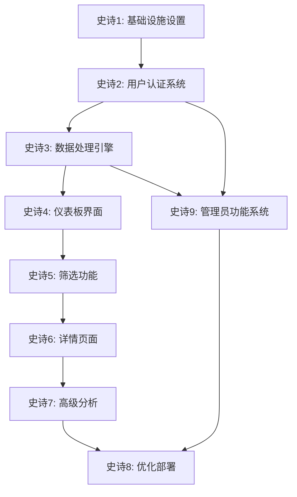

# 史诗开发路线图

## 概述
本文档定义了Sector Strength股票分析系统的完整开发顺序和史诗依赖关系。

## 开发顺序总览

## 详细史诗规划

### 史诗1: 基础设施和核心服务设置
- **状态**: ✅ 已定义
- **优先级**: 最高
- **依赖**: 无
- **包含FR**: 基础架构
- **输出**: Docker环境、数据库、API框架、前端基础

### 史诗2: 用户认证系统
- **状态**: ✅ 已定义
- **优先级**: 高
- **依赖**: 史诗1
- **包含FR**: 用户管理功能（关注列表基础）
- **输出**: 认证服务、用户管理、安全机制

### 史诗3: 数据采集和处理引擎
- **状态**: ✅ 已定义
- **优先级**: 高
- **依赖**: 史诗1
- **包含FR**: FR2（强度计算）
- **输出**: 数据采集、计算引擎、API端点

### 史诗4: 核心仪表板界面
- **状态**: ✅ 已定义
- **优先级**: 高
- **依赖**: 史诗3
- **包含FR**: FR1（热力图）、FR3（排名列表）
- **输出**: 主页仪表板、热力图、排名列表

### 史诗5: 筛选和交互功能
- **状态**: ✅ 已定义
- **优先级**: 中
- **依赖**: 史诗4
- **包含FR**: FR4（板块筛选）、FR5（时间周期）
- **输出**: 筛选控件、时间选择器、交互功能

### 史诗6: 详情页面和用户关注功能
- **状态**: ✅ 已定义
- **优先级**: 中
- **依赖**: 史诗2、史诗5
- **包含FR**: FR6（板块详情）、FR7（个股详情）
- **输出**: 详情页面、深度分析、关注列表

### 史诗7: 高级分析功能
- **状态**: ✅ 已定义
- **优先级**: 低
- **依赖**: 史诗6
- **包含FR**: FR8（趋势图表）
- **输出**: 趋势图表、历史分析、高级工具

### 史诗8: 性能优化和部署
- **状态**: ✅ 已定义
- **优先级**: 高（序列最后）
- **依赖**: 所有功能史诗
- **包含NFR**: 所有非功能需求
- **输出**: 生产部署、性能优化、监控系统

### 史诗9: 管理员功能系统
- **状态**: ✅ 已定义
- **优先级**: 高
- **依赖**: 史诗1、史诗2
- **包含FR**: FR5-FR7（管理员权限）、FR26-FR37（数据管理）
- **包含NFR**: NFR-SEC-003/004/008/009/010、NFR-REL-003、NFR-SCALE-009
- **输出**: RBAC权限系统、数据初始化、数据更新补齐、异步任务系统、管理员界面、操作审计
- **子任务**:
  - Story 9.1: 管理员角色和权限（RBAC）
  - Story 9.2: 数据初始化功能
  - Story 9.3: 数据更新和补齐
  - Story 9.4: 异步任务系统
  - Story 9.5: 管理员界面
  - Story 9.6: 操作审计日志

## 功能需求覆盖情况

### 核心功能需求（FR）
| 功能需求 | 描述 | 所属史诗 | 状态 |
|---------|------|----------|------|
| FR1 | 板块热力图 | 史诗4 | ✅ 已规划 |
| FR2 | 强度得分计算 | 史诗3 | ✅ 已规划 |
| FR3 | 排名列表 | 史诗4 | ✅ 已规划 |
| FR4 | 板块筛选 | 史诗5 | ✅ 已规划 |
| FR5 | 时间周期选择 | 史诗5 | ✅ 已规划 |
| FR6 | 板块详情页 | 史诗6 | ✅ 已规划 |
| FR7 | 个股详情页 | 史诗6 | ✅ 已规划 |
| FR8 | 趋势图表 | 史诗7 | ✅ 已规划 |

### 管理员功能需求（FR-Admin）
| 功能需求 | 描述 | 所属史诗 | 状态 |
|---------|------|----------|------|
| FR5 | 区分普通用户和管理员角色 | 史诗9 | ✅ 已规划 |
| FR6 | 管理员可访问数据管理功能 | 史诗9 | ✅ 已规划 |
| FR7 | 非管理员无法访问管理员功能 | 史诗9 | ✅ 已规划 |
| FR26 | 初始化所有板块数据 | 史诗9 | ✅ 已规划 |
| FR27 | 自定义数据回溯时间范围 | 史诗9 | ✅ 已规划 |
| FR28 | 初始化所有股票数据 | 史诗9 | ✅ 已规划 |
| FR29 | 按日期补齐数据 | 史诗9 | ✅ 已规划 |
| FR30 | 按时间段拉取历史数据 | 史诗9 | ✅ 已规划 |
| FR31 | 选择覆盖已有数据 | 史诗9 | ✅ 已规划 |
| FR32 | 异步执行数据初始化任务 | 史诗9 | ✅ 已规划 |
| FR33 | 显示数据任务实时进度 | 史诗9 | ✅ 已规划 |
| FR34 | 显示任务状态（成功/失败/进行中） | 史诗9 | ✅ 已规划 |
| FR35 | 查看任务操作日志 | 史诗9 | ✅ 已规划 |
| FR36 | 记录管理员操作到审计日志 | 史诗9 | ✅ 已规划 |
| FR37 | 任务失败后自动重试 | 史诗9 | ✅ 已规划 |

## 非功能需求覆盖情况

所有非功能需求将在史诗8中统一处理和验证，除以下需求由史诗9实现：

| 非功能需求 | 描述 | 所属史诗 | 状态 |
|-----------|------|----------|------|
| NFR-SEC-003 | 管理员功能必须有 RBAC | 史诗9 | ✅ 已规划 |
| NFR-SEC-004 | 非管理员无法访问管理员功能 | 史诗9 | ✅ 已规划 |
| NFR-SEC-008 | 记录所有管理员操作到审计日志 | 史诗9 | ✅ 已规划 |
| NFR-SEC-009 | 审计日志包含操作人、时间、操作内容、IP | 史诗9 | ✅ 已规划 |
| NFR-SEC-010 | 审计日志保留至少 6 个月 | 史诗9 | ✅ 已规划 |
| NFR-REL-003 | 数据初始化任务成功率 > 95% | 史诗9 | ✅ 已规划 |
| NFR-SCALE-009 | 后台任务应有重试机制和超时控制 | 史诗9 | ✅ 已规划 |

## 风险评估

1. **高风险**: 用户认证安全（史诗2）、数据处理性能（史诗3、史诗7）、异步任务系统稳定性（史诗9）
2. **中风险**: 界面性能优化（史诗4、史诗8）、管理员权限安全（史诗9）
3. **低风险**: 基础功能开发（史诗1、史诗5、史诗6）

## 下一步行动

1. **立即开始**: 史诗1的实施（用户故事已准备就绪）
2. **后续准备**: 史诗2和史诗9的用户故事已准备就绪，可并行开发
3. **长期规划**: 按依赖关系推进后续史诗

---
## 变更日志
| 日期 | 版本 | 描述 | 作者 |
|------|------|------|------|
| 2025-09-21 | v1.0 | 初始路线图创建 | PO Agent |
| 2025-12-24 | v1.1 | 添加史诗9：管理员功能系统及6个用户故事 | PM Agent (John) |