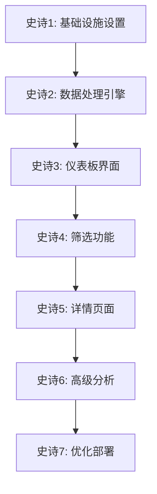

# 史诗开发路线图

## 概述
本文档定义了Sector Strength股票分析系统的完整开发顺序和史诗依赖关系。

## 开发顺序总览

## 详细史诗规划

### 史诗1: 基础设施和核心服务设置
- **状态**: ✅ 已定义
- **优先级**: 最高
- **依赖**: 无
- **包含FR**: 基础架构
- **输出**: Docker环境、数据库、API框架、前端基础

### 史诗2: 数据采集和处理引擎
- **状态**: ✅ 已定义
- **优先级**: 高
- **依赖**: 史诗1
- **包含FR**: FR2（强度计算）
- **输出**: 数据采集、计算引擎、API端点

### 史诗3: 核心仪表板界面
- **状态**: ✅ 已定义
- **优先级**: 高
- **依赖**: 史诗2
- **包含FR**: FR1（热力图）、FR3（排名列表）
- **输出**: 主页仪表板、热力图、排名列表

### 史诗4: 筛选和交互功能
- **状态**: ✅ 已定义
- **优先级**: 中
- **依赖**: 史诗3
- **包含FR**: FR4（板块筛选）、FR5（时间周期）
- **输出**: 筛选控件、时间选择器、交互功能

### 史诗5: 详情页面开发
- **状态**: ✅ 已定义
- **优先级**: 中
- **依赖**: 史诗4
- **包含FR**: FR6（板块详情）、FR7（个股详情）
- **输出**: 详情页面、深度分析、对比功能

### 史诗6: 高级分析功能
- **状态**: ✅ 已定义
- **优先级**: 低
- **依赖**: 史诗5
- **包含FR**: FR8（趋势图表）
- **输出**: 趋势图表、历史分析、高级工具

### 史诗7: 性能优化和部署
- **状态**: ✅ 已定义
- **优先级**: 高（序列最后）
- **依赖**: 所有功能史诗
- **包含NFR**: 所有非功能需求
- **输出**: 生产部署、性能优化、监控系统

## 功能需求覆盖情况

| 功能需求 | 描述 | 所属史诗 | 状态 |
|---------|------|----------|------|
| FR1 | 板块热力图 | 史诗3 | ✅ 已规划 |
| FR2 | 强度得分计算 | 史诗2 | ✅ 已规划 |
| FR3 | 排名列表 | 史诗3 | ✅ 已规划 |
| FR4 | 板块筛选 | 史诗4 | ✅ 已规划 |
| FR5 | 时间周期选择 | 史诗4 | ✅ 已规划 |
| FR6 | 板块详情页 | 史诗5 | ✅ 已规划 |
| FR7 | 个股详情页 | 史诗5 | ✅ 已规划 |
| FR8 | 趋势图表 | 史诗6 | ✅ 已规划 |

## 非功能需求覆盖情况

所有非功能需求（NFR1-NFR5）将在史诗7中统一处理和验证。

## 风险评估

1. **高风险**: 数据处理性能（史诗2、史诗6）
2. **中风险**: 界面性能优化（史诗3、史诗7）
3. **低风险**: 基础功能开发（史诗1、史诗4、史诗5）

## 下一步行动

1. **立即开始**: 史诗1的实施（用户故事已准备就绪）
2. **后续准备**: 史诗2的用户故事定义
3. **长期规划**: 按顺序推进后续史诗

---
## 变更日志
| 日期 | 版本 | 描述 | 作者 |
|------|------|------|------|
| 2025-09-21 | v1.0 | 初始路线图创建 | PO Agent |