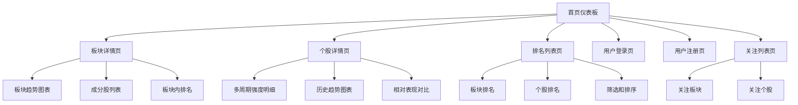
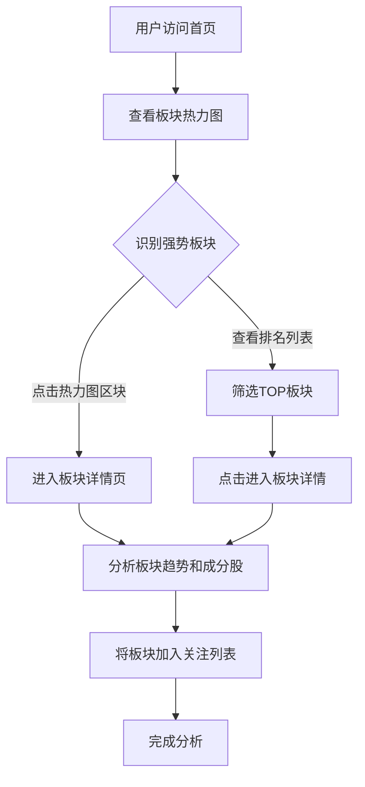
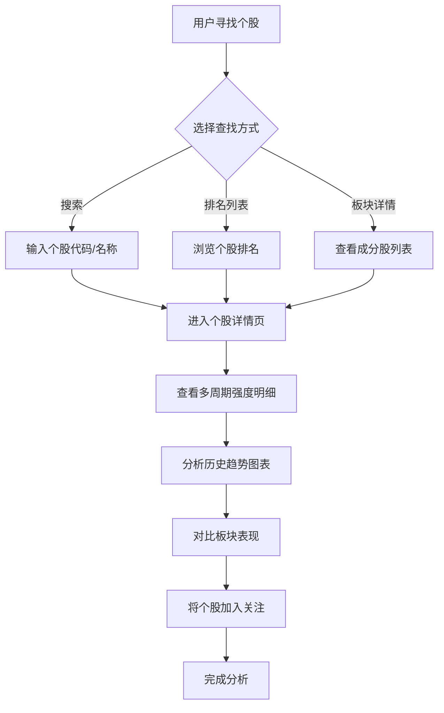

# 股票市场板块强弱指标系统 UI/UX 规范

## 1. 介绍

本文档定义了股票市场板块强弱指标系统的用户体验目标、信息架构、用户流程和视觉设计规范。它作为视觉设计和前端开发的基础，确保一致性和以用户为中心的体验。

## 2. 整体UX目标与原则

### 目标用户画像
1. **投资者**: 需要快速识别强势板块和个股，寻找投资机会
2. **分析师**: 需要深入分析板块轮动规律和市场趋势
3. **交易员**: 需要实时监控市场强弱变化，制定交易策略

### 可用性目标
- **易学性**: 新用户5分钟内能理解热力图和排名功能
- **效率**: 熟练用户30秒内找到目标板块/个股
- **错误预防**: 数据加载状态清晰，操作反馈明确
- **可记忆性**: 界面布局一致，功能位置 predictable

### 设计原则
1. **数据清晰优先**: 复杂数据简单化呈现，避免信息过载
2. **渐进式披露**: 首页展示概要，详情页提供深度分析
3. **一致性模式**: 统一交互模式和视觉语言 throughout
4. **即时反馈**: 所有操作都有明确视觉反馈

### 变更日志
| 日期 | 版本 | 描述 | 作者 |
|------|---------|-------------|--------|
| 2025-09-20 | v1.0 | 初始前端规范创建 | UX专家 |

## 3. 信息架构 (IA)

### 网站地图 / 屏幕清单

### 导航结构
**主导航**: 顶部导航栏 - 首页、板块排名、个股排名、关注列表、用户账户
**次级导航**: 侧边栏筛选器 - 板块类型、行业分类、时间周期
**面包屑策略**: 显示当前位置路径，支持快速返回上级页面

## 4. 用户流程

### 流程 1: 发现强势板块

**用户目标**: 快速识别当前市场中的强势板块并查看详情

**入口点**: 首页热力图、板块排名列表

**成功标准**: 用户能够从首页快速定位到强势板块并查看详细分析

**边缘情况与错误处理**:
- 热力图数据加载失败时显示备用表格视图
- 板块详情数据缺失时显示友好错误提示
- 网络延迟时显示加载状态和进度指示

### 流程 2: 分析个股强度

**用户目标**: 深入分析特定个股的多周期强度表现

**入口点**: 个股排名列表、板块详情页中的成分股、搜索功能

**成功标准**: 用户能够找到目标个股并查看完整的强度分析数据

**边缘情况与错误处理**:
- 搜索无结果时提供建议和热门个股
- 个股数据暂时不可用时显示最近可用数据
- 图表渲染失败时提供数据表格视图

## 5. 线框图和原型

### 主要设计文件
**主要设计工具**: Figma - 高保真交互原型和设计规范

### 关键屏幕布局

#### 屏幕 1: 首页仪表板
**目的**: 提供市场整体概览和快速入口

**关键元素**:
- 板块热力图（核心可视化）
- 强势板块TOP5卡片
- 强势个股TOP10列表
- 市场强度指数指示器
- 时间周期选择器
- 快速筛选工具栏

**交互备注**:
- 热力图支持点击和悬停交互
- 排名列表支持点击进入详情
- 时间选择实时更新所有数据
- 筛选条件即时应用

**设计文件参考**: `首页仪表板.fig`

#### 屏幕 2: 板块详情页
**目的**: 展示板块深度分析信息

**关键元素**:
- 板块基础信息头部
- 多周期强度得分卡片
- 历史趋势折线图
- 成分股列表表格
- 板块内个股排名
- 关注/取消关注按钮

**交互备注**:
- 趋势图支持缩放和平移
- 成分股列表可排序和筛选
- 点击个股跳转到个股详情
- 关注状态实时更新

**设计文件参考**: `板块详情页.fig`

#### 屏幕 3: 个股详情页
**目的**: 提供个股全面强度分析

**关键元素**:
- 个股基本信息头部
- 多周期均线强度明细表
- 强度历史趋势图表
- 相对板块表现对比
- 相关技术指标显示
- 关注操作按钮

**交互备注**:
- 多周期数据表格化展示
- 趋势图支持多指标叠加
- 表现对比使用可视化图表
- 数据支持时间范围选择

**设计文件参考**: `个股详情页.fig`

## 6. 组件库 / 设计系统

### 设计系统方法
**设计系统方法**: 基于shadcn/ui + Tailwind CSS构建，专注于金融数据可视化需求

### 核心组件

#### 组件 1: 热力图组件
**目的**: 可视化展示板块强度分布

**变体**:
- 基础热力图（颜色编码强度）
- 交互式热力图（悬停提示+点击跳转）
- 迷你热力图（摘要视图）

**状态**:
- 加载中（骨架屏）
- 数据就绪（正常显示）
- 数据错误（降级视图）
- 空状态（无数据提示）

**使用指南**: 用于首页仪表板和板块概览页面，确保颜色编码一致性

#### 组件 2: K线图组件
**目的**: 显示个股价格走势和技术分析

**变体**:
- 基础K线图（OHLC数据）
- 带均线的K线图（多周期均线叠加）
- 带交易量的K线图（量价结合）
- 技术指标K线图（MACD、RSI等）

**状态**:
- 数据加载中
- 图表渲染完成
- 交互状态（缩放、平移、十字光标）
- 指标切换状态

**使用指南**: 用于个股详情页，支持技术分析和趋势判断

#### 组件 3: 均线图组件
**目的**: 专门展示多周期移动平均线

**变体**:
- 单一均线趋势图
- 多均线对比图
- 均线强度热力图
- 均线交叉信号图

**状态**:
- 均线计算中
- 图表渲染完成
- 周期切换状态
- 均线配置状态

**使用指南**: 用于强度分析和趋势判断，支持自定义周期配置

#### 组件 4: 数据表格组件
**目的**: 展示排名列表和详细数据

**变体**:
- 排序表格（支持多列排序）
- 分页表格（大数据集分页）
- 可筛选表格（内置筛选功能）

**状态**:
- 加载中（骨架行）
- 数据就绪（正常显示）
- 筛选中（筛选状态指示）
- 空结果（无匹配数据）

**使用指南**: 用于排名列表、成分股展示等数据密集型界面

## 7. 品牌与样式指南

### 视觉识别
**品牌指南**: 基于shadcn/ui的现代金融数据可视化风格，结合专业性和设计一致性

### 技术栈整合
**组件库**: shadcn/ui + Tailwind CSS
**设计系统**: 基于Radix UI原语构建，确保交互一致性
**主题**: 自定义金融数据主题，扩展shadcn默认主题

### 色彩调色板 (shadcn兼容)
| 色彩类型 | CSS变量 | 用途 |
|----------|---------|------|
| 主要色 | `--primary` | 主要品牌色、重要操作 |
| 次要色 | `--secondary` | 背景、卡片底色 |
| 强调色 | `--accent` | 成功状态、正向变化 |
| 警告色 | `--warning` | 警告提示、中性变化 |
| 错误色 | `--destructive` | 错误状态、负向变化 |

### 强度颜色编码
| 强度等级 | CSS变量 | 用途 |
|----------|---------|------|
| 超强 | `--destructive` | 强度最高板块 |
| 强 | `--warning` | 强度较高板块 |
| 中 | `--accent` | 强度中等板块 |
| 弱 | `--muted-foreground` | 强度较低板块 |
| 超弱 | `--muted` | 强度最低板块 |

### 字体排版 (shadcn标准)
**字体家族**:
- **主要字体**: `var(--font-sans)` - Inter或Geist
- **等宽字体**: `var(--font-mono)` - JetBrains Mono

**字体尺度**:
- `text-4xl` (H1) - 2.25rem
- `text-3xl` (H2) - 1.875rem
- `text-2xl` (H3) - 1.5rem
- `text-base` (正文) - 1rem
- `text-sm` (小字) - 0.875rem

### 图标系统
**图标库**: Lucide Icons + @radix-ui/react-icons

### 间距与布局 (Tailwind标准)
**间距系统**: 使用Tailwind spacing scale (0.25rem increments)
- `p-1`: 0.25rem (4px)
- `p-2`: 0.5rem (8px)
- `p-4`: 1rem (16px)
- `p-6`: 1.5rem (24px)
- `p-8`: 2rem (32px)

## 8. 响应式策略

### 断点设置
| 断点 | 最小宽度 | 目标设备 |
|------|----------|----------|
| 大桌面端 | 1440px | 台式机和大屏显示器 |

### 适配模式
**布局变化**: 多列扩展布局，最大化数据可视区域
**导航变化**: 顶部主导航 + 左侧次级导航完整展示
**内容优先级**: 高密度数据展示，充分利用屏幕空间
**交互优化**: 鼠标精确交互，支持多窗口并排查看

### 性能目标
- **页面加载**: 2秒内完成初始渲染
- **交互响应**: 100ms内响应操作
- **图表渲染**: 复杂图表1秒内渲染完成
- **数据更新**: 实时数据500ms内更新

## 9. 动画与微交互

### 运动原则
**运动原则**: subtle but meaningful - 微妙但有意义的动画，专注于增强数据理解

### 关键动画
- **数据加载动画**: 骨架屏渐变显示 (Duration: 300ms, Easing: ease-out)
- **页面过渡动画**: 平滑的页面切换效果 (Duration: 200ms, Easing: ease-in-out)
- **图表渲染动画**: 数据系列渐入效果 (Duration: 400ms, Easing: ease-out)
- **悬停反馈动画**: 轻微的 elevation 变化 (Duration: 150ms, Easing: ease-in-out)
- **筛选器展开**: 流畅的高度变化 (Duration: 250ms, Easing: ease-out)
- **数据更新动画**: 数值变化时的脉冲效果 (Duration: 180ms, Easing: ease-out)
- **关注状态切换**: 心形图标填充动画 (Duration: 200ms, Easing: ease-in-out)
- **排序指示器**: 箭头方向旋转动画 (Duration: 180ms, Easing: ease-in-out)

## 10. 下一步行动

### 立即行动
1. 与利益相关者评审此UI/UX规范
2. 在Figma中创建/更新视觉设计文件
3. 准备移交給设计架构师进行前端架构设计
4. 验证技术可行性并调整设计约束

### 设计移交清单
- [ ] 所有用户流程已文档化
- [ ] 组件清单完整
- [ ] 响应式策略明确
- [ ] 品牌指南已整合
- [ ] 性能目标已确立
- [ ] 动画规范已定义

### 待决问题
- K线图和均线图的具体技术实现细节
- shadcn/ui组件与自定义图表的集成方案
- 大数据量下的图表性能优化策略
- 实时数据更新的用户体验设计

---
*文档版本: 1.0*
*最后更新: 2025-09-20*