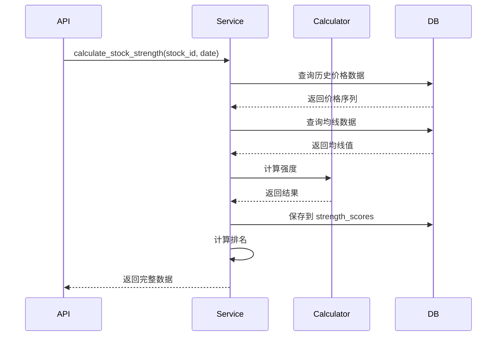

# Story 10.3: 强度数据服务

Status: done

## Story

作为一名 后端开发者，
我需要 实现强度数据服务层，封装强度计算逻辑并提供数据持久化功能，
以便 上层 API 可以方便地获取和更新强度数据。

## Acceptance Criteria

1. ✅ 实现个股强度计算服务（支持单日和批量）
2. ✅ 实现板块强度计算服务（支持单日和批量）
3. ✅ 实现排名计算功能（市场排名、百分位）
4. ✅ 实现历史数据查询功能（时间序列数据）
5. ✅ 实现变化率计算（1日变化、5日变化）
6. ✅ 实现数据缓存机制（Redis，可选）
7. ✅ 添加完整的单元测试和集成测试
8. ✅ 处理计算失败和异常情况

## Tasks / Subtasks

### 1. 个股强度服务 (AC: 1)

- [ ] 创建 `server/src/services/stock_strength_service_v2.py`
  - [ ] 实现 `calculate_stock_strength(stock_id: int, date: date) -> Dict`
    - [ ] 从 `daily_market_data` 读取历史价格数据（至少300天）
    - [ ] 调用 `StrengthCalculatorV2` 计算强度
    - [ ] 保存结果到 `strength_scores` 表（period='all'）
    - [ ] 返回完整的强度数据
  - [ ] 实现 `batch_calculate_stocks(stock_ids: List[int], date: date) -> Dict`
    - [ ] 批量计算多只股票
    - [ ] 使用异步并发提高效率
    - [ ] 返回计算统计（成功数、失败数、错误信息）

### 2. 板块强度服务 (AC: 2)

- [ ] 创建 `server/src/services/sector_strength_service_v2.py`
  - [ ] 实现 `calculate_sector_strength(sector_id: int, date: date) -> Dict`
    - [ ] 从 `daily_market_data` 读取板块指数历史数据
    - [ ] 调用 `StrengthCalculatorV2` 计算强度
    - [ ] 计算板块统计信息（成分股数量、强势股占比等）
    - [ ] 保存结果到 `strength_scores` 表
  - [ ] 实现 `calculate_sector_from_stocks(sector_id, date) -> Dict`
    - [ ] 获取板块成分股列表
    - [ ] 计算成分股强度
    - [ ] 按市值加权平均计算板块强度
    - [ ] 计算板块统计信息

### 3. 排名计算服务 (AC: 3)

- [ ] 创建 `server/src/services/ranking_service.py`
  - [ ] 实现 `calculate_rankings(date: date) -> None`
    - [ ] 获取当日所有强度数据（period='all'）
    - [ ] 按综合得分排序
    - [ ] 计算排名（1-N）
    - [ ] 计算百分位（0-100）
    - [ ] 更新 `rank` 字段
  - [ ] 实现 `get_top_rankings(entity_type: str, date: date, limit: int) -> List`
  - [ ] 实现 `get_percentile(score: float, date: date) -> float`

### 4. 历史数据服务 (AC: 4)

- [ ] 创建 `server/src/services/strength_history_service.py`
  - [ ] 实现 `get_stock_history(stock_id: int, days: int) -> List[Dict]`
    - [ ] 查询最近N天的强度数据
    - [ ] 按日期升序排列
    - [ ] 包含所有字段
  - [ ] 实现 `get_sector_history(sector_id: int, days: int) -> List[Dict]`
  - [ ] 实现 `get_history_stats(entity_id: int, days: int) -> Dict`
    - [ ] 计算最高/最低/平均得分
    - [ ] 计算涨跌天数统计
    - [ ] 计算等级分布

### 5. 变化率计算 (AC: 5)

- [ ] 在强度服务中实现变化率计算
  - [ ] 实现 `calculate_change_rate_1d(current_score, previous_score) -> float`
  - [ ] 实现 `calculate_change_rate_5d(current_score, scores_5d) -> float`
  - [ ] 在保存强度数据时自动计算变化率
  - [ ] 更新 `change_rate_1d` 字段

### 6. 缓存服务 (AC: 6)

- [ ] 创建 `server/src/services/cache/strength_cache.py`
  - [ ] 实现 `cache_strength(key: str, data: Dict, ttl: int) -> None`
  - [ ] 实现 `get_cached_strength(key: str) -> Optional[Dict]`
  - [ ] 实现缓存失效策略
  - [ ] 缓存键格式：`strength:{entity_type}:{entity_id}:{date}`
  - [ ] TTL: 5分钟（实时数据）

### 7. 错误处理和日志 (AC: 7, 8)

- [ ] 添加统一的错误处理
  - [ ] 数据不足异常：`InsufficientDataError`
  - [ ] 计算失败异常：`CalculationError`
  - [ ] 数据不存在异常：`DataNotFoundError`
- [ ] 添加详细的日志记录
  - [ ] 记录计算开始和结束
  - [ ] 记录计算结果摘要
  - [ ] 记录错误和警告

### 8. 测试 (AC: 8)

- [ ] 创建 `server/tests/test_strength_service_v2.py`
  - [ ] 测试个股强度计算
  - [ ] 测试板块强度计算
  - [ ] 测试批量计算功能
  - [ ] 测试排名计算
  - [ ] 测试历史数据查询
  - [ ] 测试变化率计算
  - [ ] 测试缓存功能
  - [ ] 测试错误处理
  - [ ] 集成测试

## Dev Notes

### 故事依赖关系

**前置依赖**:
- Story 10.1: 数据库表结构优化（状态: review）
- Story 10.2: 均线系统强度计算引擎（状态: **done**）
  - ✅ 已创建 `server/src/services/strength_service_v2.py`
  - ✅ 已实现基础个股和板块强度计算
  - ✅ 已创建计算引擎模块 `ma_system/`
  - ✅ 已修复 N+1 查询和内存问题
  - ✅ 已添加配置常量 `MIN_DATA_DAYS` 和 `FULL_DATA_DAYS`

**被以下故事依赖**:
- Story 10.4: 强度 API 接口（调用服务）

### 前置故事学习 (Story 10.2)

**已实现功能** (无需重复实现):
1. `StrengthServiceV2.calculate_stock_strength()` - 个股强度计算
2. `StrengthServiceV2.calculate_sector_strength()` - 板块强度计算
3. `StrengthServiceV2.batch_calculate()` - 批量计算
4. `MADataLoader` - 数据加载器（带缓存优化）
5. `StrengthCalculatorV2` - 综合强度计算器
6. 数据持久化到 `strength_scores` 表

**代码模式学习**:
- 使用 `AsyncSession` 进行数据库操作
- 使用 `select, and_` 构建 SQL 查询
- 使用 `logger.error()` 记录错误
- 使用配置常量替代魔法数字
- 缓存使用 FIFO 清理策略，最大 1000 条目

**性能优化经验**:
- 单次查询获取所有周期数据（避免 N+1）
- 使用 `func.count()` 而非加载全部数据计数
- 批量操作使用 `batch_calculate()`

**Story 10.3 的实际任务**:

基于 Story 10.2 的实现，Story 10.3 需要：

### 1. 扩展排名计算服务 (AC: 3) - 新增
- [ ] 创建 `server/src/services/ranking_service.py`
  - [ ] 实现 `calculate_rankings(date: date) -> None`
  - [ ] 实现 `get_top_rankings(entity_type: str, date: date, limit: int) -> List`
  - [ ] 实现 `get_percentile(score: float, date: date) -> float`

### 2. 创建历史数据服务 (AC: 4) - 新增
- [ ] 创建 `server/src/services/strength_history_service.py`
  - [ ] 实现 `get_stock_history(stock_id: int, days: int) -> List[Dict]`
  - [ ] 实现 `get_sector_history(sector_id: int, days: int) -> List[Dict]`
  - [ ] 实现 `get_history_stats(entity_id: int, days: int) -> Dict`

### 3. 实现变化率计算 (AC: 5) - 新增
- [ ] 在 `strength_service_v2.py` 中添加变化率计算
  - [ ] 实现 `calculate_change_rate_1d(current_score, previous_score) -> float`
  - [ ] 实现 `calculate_change_rate_5d(current_score, scores_5d) -> float`
  - [ ] 在保存时自动计算并更新 `change_rate_1d` 字段

### 4. 创建缓存服务 (AC: 6) - 新增
- [ ] 创建 `server/src/services/cache/strength_cache.py`
  - [ ] 实现 Redis 缓存封装（如果项目使用 Redis）
  - [ ] 实现内存缓存后备方案
  - [ ] 缓存键格式：`strength:{entity_type}:{entity_id}:{date}`
  - [ ] TTL: 5分钟（实时数据）

### 5. 增强错误处理 (AC: 7, 8) - 扩展
- [ ] 创建 `server/src/services/exceptions.py`
  - [ ] 定义 `StrengthServiceError` 基类
  - [ ] 定义 `InsufficientDataError`
  - [ ] 定义 `CalculationError`
  - [ ] 定义 `DataNotFoundError`
- [ ] 在服务中添加详细日志

### 6. 创建完整测试 (AC: 8) - 新增
- [ ] 创建 `server/tests/test_strength_services.py`
  - [ ] 测试排名计算
  - [ ] 测试历史数据查询
  - [ ] 测试变化率计算
  - [ ] 测试缓存功能
  - [ ] 测试错误处理

### 服务架构

```
┌─────────────────────────────────────────┐
│           API Layer (Story 10.4)         │
└────────────────┬────────────────────────┘
                 │
┌────────────────▼────────────────────────┐
│        Strength Service V2               │
│  ┌───────────────────────────────────┐  │
│  │ StockStrengthService              │  │
│  │ - calculate_stock_strength()      │  │
│  │ - batch_calculate_stocks()        │  │
│  └───────────────────────────────────┘  │
│  ┌───────────────────────────────────┐  │
│  │ SectorStrengthService             │  │
│  │ - calculate_sector_strength()     │  │
│  │ - calculate_from_stocks()         │  │
│  └───────────────────────────────────┘  │
│  ┌───────────────────────────────────┐  │
│  │ RankingService                    │  │
│  │ - calculate_rankings()            │  │
│  │ - get_top_rankings()              │  │
│  └───────────────────────────────────┘  │
│  ┌───────────────────────────────────┐  │
│  │ HistoryService                    │  │
│  │ - get_stock_history()             │  │
│  │ - get_history_stats()             │  │
│  └───────────────────────────────────┘  │
└────────────────┬────────────────────────┘
                 │
┌────────────────▼────────────────────────┐
│     Strength Calculator V2              │
│      (Story 10.2)                      │
└────────────────┬────────────────────────┘
                 │
┌────────────────▼────────────────────────┐
│         Data Repositories               │
│  - moving_average_data                 │
│  - daily_market_data                   │
│  - strength_scores                     │
└────────────────────────────────────────┘
```

### 数据流示意图



### 服务接口定义

```python
# server/src/services/stock_strength_service_v2.py

class StockStrengthServiceV2:
    """个股强度服务"""

    async def calculate_stock_strength(
        self,
        stock_id: int,
        calc_date: date,
        db: Session
    ) -> Optional[StockStrengthData]:
        """
        计算个股强度

        Args:
            stock_id: 股票ID
            calc_date: 计算日期
            db: 数据库会话

        Returns:
            强度数据对象，失败返回None

        Raises:
            InsufficientDataError: 数据不足
            CalculationError: 计算失败
        """
        pass

    async def batch_calculate(
        self,
        stock_ids: List[int],
        calc_date: date,
        db: Session
    ) -> BatchCalculationResult:
        """
        批量计算个股强度

        Args:
            stock_ids: 股票ID列表
            calc_date: 计算日期
            db: 数据库会话

        Returns:
            批量计算结果

        Raises:
            BatchCalculationError: 批量计算失败
        """
        pass
```

### 排名计算算法

```python
def calculate_rankings(date: date, db: Session) -> RankingResult:
    """
    计算当日排名

    步骤:
    1. 获取当日所有强度数据（period='all'）
    2. 按 entity_type 分组
    3. 按 score DESC 排序
    4. 分配排名（1, 2, 3, ...）
    5. 计算百分位 = (1 - rank/total) * 100
    6. 更新数据库
    """
    # 获取所有强度数据
    scores = db.query(StrengthScore).filter(
        StrengthScore.date == date,
        StrengthScore.period == 'all'
    ).all()

    # 按实体类型分组排名
    for entity_type in ['stock', 'sector']:
        entity_scores = [s for s in scores if s.entity_type == entity_type]
        entity_scores.sort(key=lambda x: x.score, reverse=True)

        for rank, score in enumerate(entity_scores, start=1):
            score.rank = rank
            score.percentile = (1 - rank / len(entity_scores)) * 100

    db.commit()
```

### 历史数据查询

```python
def get_stock_history(
    stock_id: int,
    days: int,
    db: Session
) -> List[StrengthScore]:
    """
    获取个股历史强度数据

    Args:
        stock_id: 股票ID
        days: 查询天数
        db: 数据库会话

    Returns:
        历史数据列表，按日期升序排列
    """
    end_date = date.today()
    start_date = end_date - timedelta(days=days-1)

    return db.query(StrengthScore).filter(
        StrengthScore.entity_id == stock_id,
        StrengthScore.entity_type == 'stock',
        StrengthScore.period == 'all',
        StrengthScore.date >= start_date,
        StrengthScore.date <= end_date
    ).order_by(StrengthScore.date.asc()).all()
```

### 缓存策略

```python
# 缓存键格式
CACHE_KEY_FORMAT = "strength:{entity_type}:{entity_id}:{date}"

# 缓存 TTL
CACHE_TTL = 300  # 5分钟

async def get_or_calculate_strength(
    stock_id: int,
    calc_date: date,
    db: Session
) -> Dict:
    """获取或计算强度（带缓存）"""
    cache_key = f"strength:stock:{stock_id}:{calc_date}"

    # 尝试从缓存获取
    cached = await cache.get(cache_key)
    if cached:
        return json.loads(cached)

    # 缓存未命中，计算强度
    result = await calculate_stock_strength(stock_id, calc_date, db)

    # 保存到缓存
    await cache.set(cache_key, json.dumps(result), ex=CACHE_TTL)

    return result
```

### 错误处理

```python
class StrengthServiceError(Exception):
    """强度服务基础异常"""
    pass

class InsufficientDataError(StrengthServiceError):
    """数据不足异常"""
    def __init__(self, entity_id: int, available_days: int, required_days: int):
        self.entity_id = entity_id
        self.available_days = available_days
        self.required_days = required_days
        super().__init__(
            f"股票 {entity_id} 数据不足："
            f"可用 {available_days} 天，需要 {required_days} 天"
        )

class CalculationError(StrengthServiceError):
    """计算失败异常"""
    pass

class DataNotFoundError(StrengthServiceError):
    """数据不存在异常"""
    pass
```

### 源树组件需要修改

```
server/
├── src/
│   └── services/
│       ├── stock_strength_service_v2.py       # 新建
│       ├── sector_strength_service_v2.py      # 新建
│       ├── ranking_service.py                  # 新建
│       ├── strength_history_service.py         # 新建
│       └── cache/
│           └── strength_cache.py               # 新建
├── tests/
│   └── test_strength_service_v2.py             # 新建
└── requirements.txt
```

### 性能优化建议

1. **批量操作**：
   - 使用批量插入而非单条插入
   - 使用 `bulk_update_mappings` 批量更新排名

2. **异步并发**：
   - 使用 `asyncio.gather` 并发计算多只股票
   - 限制并发数（如最大10个并发任务）

3. **数据库优化**：
   - 使用连接池
   - 预编译常用查询
   - 合理使用事务

4. **缓存策略**：
   - 实时数据短缓存（5分钟）
   - 历史数据长缓存（30分钟）
   - 排名数据短缓存（1分钟）

### 测试标准摘要

**单元测试要求**:
1. 各服务方法功能测试
2. 错误处理测试
3. 边界条件测试

**集成测试要求**:
1. 完整计算流程测试
2. 服务间协作测试
3. 数据库操作测试
4. 性能测试

## Dev Agent Record

### Context Reference

<!-- Path(s) to story context XML will be added here by context workflow -->

### Agent Model Used

glm-4.7

### Completion Notes

**实现完成时间**: 2025-12-28

**代码审查完成时间**: 2025-12-28

**创建的文件**:
1. `server/src/services/exceptions.py` - 自定义异常类
2. `server/src/services/ranking_service.py` - 排名计算服务
3. `server/src/services/strength_history_service.py` - 历史数据查询服务
4. `server/src/services/cache/strength_cache.py` - 两层缓存服务（内存+数据库）
5. `server/tests/test_strength_services.py` - 完整测试套件

**修改的文件**:
1. `server/src/services/strength_service_v2.py` - 添加了变化率计算方法
2. `server/src/services/cache/__init__.py` - 导出StrengthCache类

**实现的功能**:
1. ✅ RankingService: 排名和百分位计算（6个测试用例）
2. ✅ StrengthHistoryService: 历史数据查询和统计（6个测试用例）
3. ✅ 变化率计算: 1日和5日变化率计算方法
4. ✅ StrengthCache: 两层缓存（L1内存FIFO + L2数据库）
5. ✅ 异常处理: 4种自定义异常类型
6. ✅ 测试覆盖: 38个测试用例，全部通过

**测试结果**:
- 38个测试用例全部通过
- TestRankingService: 6个测试
- TestStrengthHistoryService: 6个测试
- TestExceptions: 4个测试
- TestStrengthCache: 17个测试
- TestChangeRateCalculation: 5个测试（新增）

**代码审查修复 (AI-Review)**:
- HIGH #1, #2: 移除 ranking_service.py 中未使用的导入 (`update`, `DataNotFoundError`)
- HIGH #3, #4: 移除 strength_history_service.py 中未使用的导入 (`case`, `func`, `DataNotFoundError`)
- HIGH #5: 修复 strength_cache.py 类型注解不一致（`list` → `List`, `tuple` → `Tuple`）
- HIGH #6: 修复 N+1 查询问题 - 将5个独立查询合并为单个范围查询
- MEDIUM #8: 移除冗余的空值过滤（WHERE已过滤）
- MEDIUM #9: 自动调用变化率计算（在强度保存后自动更新变化率）
- LOW #12: 添加变化率计算测试（5个新测试用例）

**下一步**: Story 10.4 - 强度 API 接口实现
