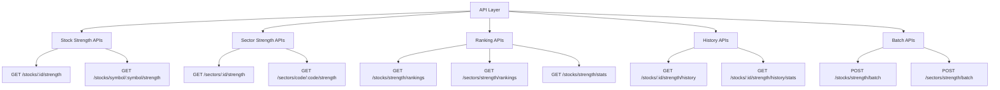

# Story 10.4: 强度 API 接口

Status: done

## Story

作为一名 前端开发者，
我需要 实现 REST API 端点以提供强度数据的查询和计算功能，
以便 用户可以获取个股和板块的强度信息、排名和历史趋势。

## Acceptance Criteria

1. ✅ 实现获取个股强度接口（单个股票）
2. ✅ 实现获取板块强度接口（单个板块）
3. ✅ 实现批量获取强度接口
4. ✅ 实现强度排名查询接口（TOP N）
5. ✅ 实现强度历史曲线接口
6. ✅ 实现强度统计信息接口
7. ✅ 实现 Pydantic Schema 定义和验证
8. ✅ 添加 API 文档（OpenAPI/Swagger）
9. ✅ 实现请求参数验证和错误处理
10. ✅ 添加完整的单元测试和集成测试

## Tasks / Subtasks

### 1. 基础 Schema 定义 (AC: 7)

- [ ] 创建 `server/src/api/schemas/strength.py`
  - [ ] 定义 `StrengthScoreBase` 基础 Schema
    - [ ] 包含所有通用字段
    - [ ] 添加字段验证规则
  - [ ] 定义 `StockStrengthResponse` Schema
    - [ ] 继承基础 Schema
    - [ ] 添加股票特有字段
    - [ ] 添加示例值
  - [ ] 定义 `SectorStrengthResponse` Schema
    - [ ] 继承基础 Schema
    - [ ] 添加板块特有字段
  - [ ] 定义 `StrengthHistoryResponse` Schema
  - [ ] 定义 `StrengthRankingResponse` Schema
  - [ ] 定义 `StrengthStatsResponse` Schema
  - [ ] 定义 `BatchStrengthRequest` Schema
  - [ ] 定义 `BatchStrengthResponse` Schema

### 2. 个股强度接口 (AC: 1)

- [ ] 创建 `server/src/api/v1/endpoints/stock_strength.py`
  - [ ] 实现 `GET /api/v1/stocks/{stock_id}/strength` 接口
    - [ ] 路径参数：`stock_id` (int)
    - [ ] 查询参数：`date` (date, optional), `period` (str, default='all')
    - [ ] 调用 `StockStrengthServiceV2.calculate_stock_strength()`
    - [ ] 返回完整的强度数据
    - [ ] 处理数据不存在情况（404）
    - [ ] 处理计算失败情况（500）
  - [ ] 实现 `GET /api/v1/stocks/symbol/{symbol}/strength` 接口
    - [ ] 路径参数：`symbol` (str)
    - [ ] 根据 symbol 查询 stock_id
    - [ ] 调用上述接口逻辑
  - [ ] 添加请求参数验证
  - [ ] 添加响应示例

### 3. 板块强度接口 (AC: 2)

- [ ] 创建 `server/src/api/v1/endpoints/sector_strength.py`
  - [ ] 实现 `GET /api/v1/sectors/{sector_id}/strength` 接口
    - [ ] 路径参数：`sector_id` (int)
    - [ ] 查询参数：`date`, `period`
    - [ ] 调用 `SectorStrengthServiceV2.calculate_sector_strength()`
    - [ ] 返回板块强度数据
    - [ ] 包含成分股统计信息
  - [ ] 实现 `GET /api/v1/sectors/code/{code}/strength` 接口
    - [ ] 路径参数：`code` (str)
  - [ ] 添加板块特有字段响应

### 4. 批量获取接口 (AC: 3)

- [ ] 创建 `server/src/api/v1/endpoints/batch_strength.py`
  - [ ] 实现 `POST /api/v1/stocks/strength/batch` 接口
    - [ ] 请求体：`{"stock_ids": [1, 2, 3], "date": "2024-12-28"}`
    - [ ] 调用 `batch_calculate()` 服务方法
    - [ ] 返回批量结果和统计信息
    - [ ] 限制批量数量（最多100个）
    - [ ] 处理部分成功情况
  - [ ] 实现 `POST /api/v1/sectors/strength/batch` 接口
  - [ ] 添加批量数量限制验证
  - [ ] 添加超时处理

### 5. 排名查询接口 (AC: 4)

- [ ] 创建 `server/src/api/v1/endpoints/rankings.py`
  - [ ] 实现 `GET /api/v1/stocks/strength/rankings` 接口
    - [ ] 查询参数：
      - [ ] `date` (date, optional, default=latest)
      - [ ] `limit` (int, default=50, max=500)
      - [ ] `offset` (int, default=0)
      - [ ] `min_score` (float, optional)
      - [ ] `max_score` (float, optional)
      - [ ] `grade` (str, optional, 如 'A', 'S+')
      - [ ] `alignment_state` (str, optional)
    - [ ] 调用 `RankingService.get_top_rankings()`
    - [ ] 支持分页
    - [ ] 支持多条件筛选
  - [ ] 实现 `GET /api/v1/sectors/strength/rankings` 接口
  - [ ] 添加缓存机制（TTL: 1分钟）
  - [ ] 添加排序选项（按分数、排名、变化率）

### 6. 历史曲线接口 (AC: 5)

- [ ] 创建 `server/src/api/v1/endpoints/strength_history.py`
  - [ ] 实现 `GET /api/v1/stocks/{stock_id}/strength/history` 接口
    - [ ] 路径参数：`stock_id` (int)
    - [ ] 查询参数：
      - [ ] `start_date` (date, optional)
      - [ ] `end_date` (date, optional)
      - [ ] `days` (int, default=30, max=365)
      - [ ] `period` (str, default='all')
    - [ ] 调用 `HistoryService.get_stock_history()`
    - [ ] 返回时间序列数据
    - [ ] 按日期升序排列
    - [ ] 处理无数据情况
  - [ ] 实现 `GET /api/v1/sectors/{sector_id}/strength/history` 接口
  - [ ] 实现 `GET /api/v1/stocks/{stock_id}/strength/history/stats` 接口
    - [ ] 返回历史统计数据（最高、最低、平均、涨跌天数等）

### 7. 统计信息接口 (AC: 6)

- [ ] 扩展 `server/src/api/v1/endpoints/rankings.py`
  - [ ] 实现 `GET /api/v1/stocks/strength/stats` 接口
    - [ ] 查询参数：`date` (date, optional)
    - [ ] 调用统计服务
    - [ ] 返回以下统计：
      - [ ] 总股票数
      - [ ] 各等级分布（S+/S/A+/A/...数量和占比）
      - [ ] 平均分数
      - [ ] 中位数分数
      - [ ] 排列状态分布
      - [ ] 强势股占比（分数>60）
      - [ ] 弱势股占比（分数<40）
  - [ ] 实现 `GET /api/v1/sectors/strength/stats` 接口
  - [ ] 添加缓存机制（TTL: 5分钟）

### 8. API 路由注册 (AC: 8)

- [ ] 更新 `server/src/api/v1/api.py`
  - [ ] 注册股票强度路由
  - [ ] 注册板块强度路由
  - [ ] 注册排名查询路由
  - [ ] 注册历史数据路由
  - [ ] 添加 API 标签和分组
  - [ ] 添加路由描述

### 9. 错误处理和验证 (AC: 9)

- [ ] 创建 `server/src/api/exceptions/strength.py`
  - [ ] 定义 `StrengthNotFoundException` 异常
  - [ ] 定义 `InsufficientDataException` 异常
  - [ ] 定义 `CalculationException` 异常
  - [ ] 添加异常处理器
- [ ] 添加请求参数验证
  - [ ] 日期范围验证
  - [ ] ID 范围验证
  - [ ] 批量数量限制
  - [ ] 分页参数验证
- [ ] 统一错误响应格式
  - [ ] 错误码
  - [ ] 错误消息
  - [ ] 详细信息
  - [ ] 时间戳

### 10. 测试 (AC: 10)

- [ ] 创建 `server/tests/api/test_stock_strength_endpoints.py`
  - [ ] 测试获取个股强度接口
  - [ ] 测试参数验证
  - [ ] 测试错误处理
  - [ ] 测试缓存功能
- [ ] 创建 `server/tests/api/test_sector_strength_endpoints.py`
  - [ ] 测试获取板块强度接口
  - [ ] 测试成分股统计
- [ ] 创建 `server/tests/api/test_rankings_endpoints.py`
  - [ ] 测试排名查询接口
  - [ ] 测试筛选功能
  - [ ] 测试分页功能
- [ ] 创建 `server/tests/api/test_history_endpoints.py`
  - [ ] 测试历史曲线接口
  - [ ] 测试统计接口
  - [ ] 测试日期范围处理
- [ ] 创建 `server/tests/api/test_batch_endpoints.py`
  - [ ] 测试批量获取接口
  - [ ] 测试部分成功处理
  - [ ] 测试超时处理
- [ ] 集成测试
  - [ ] 完整的 API 请求流程测试
  - [ ] 与数据库集成测试
  - [ ] 性能测试（响应时间 < 200ms）

## Dev Notes

### 故事依赖关系

**前置依赖**:
- Story 10.1: 数据库表结构优化（使用优化后的表）
- Story 10.2: 均线系统强度计算引擎（调用计算服务）
- Story 10.3: 强度数据服务（调用服务层）

**被以下故事依赖**:
- Story 10.5: 强度历史趋势分析（使用历史接口）
- 前端开发（使用 API 接口）

### API 接口总览



### Pydantic Schema 定义

```python
# server/src/api/schemas/strength.py

from datetime import date
from typing import Optional, List
from pydantic import BaseModel, Field, field_validator


class StrengthScoreBase(BaseModel):
    """强度得分基础 Schema"""
    entity_type: str = Field(..., description="实体类型: 'stock' or 'sector'")
    entity_id: int = Field(..., description="实体ID", ge=1)
    symbol: str = Field(..., description="股票代码或板块代码", min_length=1, max_length=20)
    date: date = Field(..., description="计算日期")
    period: str = Field(default='all', description="计算周期")

    # 核心得分
    score: float = Field(..., description="综合强度得分", ge=0, le=100)
    price_position_score: Optional[float] = Field(None, description="价格位置得分", ge=0, le=100)
    ma_alignment_score: Optional[float] = Field(None, description="均线排列得分", ge=0, le=100)
    ma_alignment_state: Optional[str] = Field(None, description="排列状态")

    # 短中长期强度
    short_term_score: Optional[float] = Field(None, ge=0, le=100)
    medium_term_score: Optional[float] = Field(None, ge=0, le=100)
    long_term_score: Optional[float] = Field(None, ge=0, le=100)

    # 均线数据
    current_price: Optional[float] = Field(None, description="当前价格", gt=0)
    ma5: Optional[float] = Field(None, gt=0)
    ma10: Optional[float] = Field(None, gt=0)
    ma20: Optional[float] = Field(None, gt=0)
    ma30: Optional[float] = Field(None, gt=0)
    ma60: Optional[float] = Field(None, gt=0)
    ma90: Optional[float] = Field(None, gt=0)
    ma120: Optional[float] = Field(None, gt=0)
    ma240: Optional[float] = Field(None, gt=0)

    # 价格相对均线位置
    price_above_ma5: Optional[float] = None
    price_above_ma10: Optional[float] = None
    price_above_ma20: Optional[float] = None
    price_above_ma30: Optional[float] = None
    price_above_ma60: Optional[float] = None
    price_above_ma90: Optional[float] = None
    price_above_ma120: Optional[float] = None
    price_above_ma240: Optional[float] = None

    # 排名和等级
    rank: Optional[int] = Field(None, description="市场排名", ge=1)
    percentile: Optional[float] = Field(None, description="百分位", ge=0, le=100)
    change_rate_1d: Optional[float] = None
    strength_grade: Optional[str] = Field(None, description="强度等级")

    class Config:
        from_attributes = True


class StockStrengthResponse(StrengthScoreBase):
    """股票强度响应"""
    stock_name: Optional[str] = Field(None, description="股票名称")
    market_cap: Optional[float] = Field(None, description="市值（亿元）")

    class Config:
        json_schema_extra = {
            "example": {
                "entity_type": "stock",
                "entity_id": 123,
                "symbol": "600519",
                "stock_name": "贵州茅台",
                "date": "2024-12-28",
                "period": "all",
                "score": 78.5,
                "price_position_score": 82.3,
                "ma_alignment_score": 75.0,
                "ma_alignment_state": "strong_bull",
                "short_term_score": 75.2,
                "medium_term_score": 78.5,
                "long_term_score": 68.3,
                "current_price": 1850.0,
                "ma5": 1835.2,
                "ma10": 1825.8,
                "ma20": 1810.5,
                "ma30": 1798.2,
                "ma60": 1775.0,
                "ma90": 1752.0,
                "ma120": 1728.0,
                "ma240": 1680.0,
                "price_above_ma5": 0.81,
                "price_above_ma10": 1.33,
                "price_above_ma20": 2.18,
                "price_above_ma30": 2.79,
                "price_above_ma60": 4.23,
                "price_above_ma90": 5.65,
                "price_above_ma120": 7.12,
                "price_above_ma240": 10.12,
                "rank": 156,
                "percentile": 85.2,
                "change_rate_1d": 1.5,
                "strength_grade": "A",
                "market_cap": 23000.5
            }
        }


class SectorStrengthResponse(StrengthScoreBase):
    """板块强度响应"""
    sector_name: Optional[str] = Field(None, description="板块名称")
    stock_count: Optional[int] = Field(None, description="成分股数量")
    strong_stock_count: Optional[int] = Field(None, description="强势股数量（分数>60）")
    strong_stock_ratio: Optional[float] = Field(None, description="强势股占比")

    class Config:
        json_schema_extra = {
            "example": {
                "entity_type": "sector",
                "entity_id": 45,
                "symbol": "BK0426",
                "sector_name": "半导体",
                "date": "2024-12-28",
                "period": "all",
                "score": 72.5,
                "price_position_score": 70.0,
                "ma_alignment_score": 75.0,
                "ma_alignment_state": "strong_bull",
                "short_term_score": 68.5,
                "medium_term_score": 72.0,
                "long_term_score": 70.0,
                "current_price": 4850.0,
                "ma5": 4830.0,
                "ma10": 4810.0,
                "ma20": 4780.0,
                "ma30": 4750.0,
                "ma60": 4720.0,
                "ma90": 4680.0,
                "ma120": 4620.0,
                "ma240": 4500.0,
                "stock_count": 85,
                "strong_stock_count": 52,
                "strong_stock_ratio": 61.2,
                "rank": 8,
                "strength_grade": "A"
            }
        }


class StrengthHistoryData(BaseModel):
    """历史数据点"""
    date: date
    composite_score: float
    strength_grade: Optional[str] = None
    price_position_score: Optional[float] = None
    ma_alignment_score: Optional[float] = None
    ma_alignment_state: Optional[str] = None
    short_term_score: Optional[float] = None
    medium_term_score: Optional[float] = None
    long_term_score: Optional[float] = None
    current_price: Optional[float] = None
    rank: Optional[int] = None


class StrengthHistoryResponse(BaseModel):
    """历史数据响应"""
    symbol: str = Field(..., description="股票代码或板块代码")
    name: Optional[str] = Field(None, description="股票名称或板块名称")
    start_date: date
    end_date: date
    total_days: int
    data_points: List[StrengthHistoryData]

    class Config:
        json_schema_extra = {
            "example": {
                "symbol": "600519",
                "name": "贵州茅台",
                "start_date": "2024-12-01",
                "end_date": "2024-12-28",
                "total_days": 20,
                "data_points": [
                    {
                        "date": "2024-12-01",
                        "composite_score": 72.5,
                        "strength_grade": "A",
                        "price_position_score": 70.0,
                        "ma_alignment_score": 75.0,
                        "ma_alignment_state": "bull",
                        "short_term_score": 68.5,
                        "medium_term_score": 72.0,
                        "long_term_score": 68.0,
                        "current_price": 1820.0,
                        "rank": 165
                    }
                ]
            }
        }


class StrengthRankingItem(BaseModel):
    """排名项"""
    rank: int
    entity_id: int
    symbol: str
    name: Optional[str] = None
    score: float
    strength_grade: str
    change_rate_1d: Optional[float] = None


class StrengthRankingResponse(BaseModel):
    """排名响应"""
    date: date
    entity_type: str
    total_count: int
    returned_count: int
    offset: int
    limit: int
    rankings: List[StrengthRankingItem]


class StrengthGradeDistribution(BaseModel):
    """等级分布"""
    grade: str
    count: int
    percentage: float


class StrengthStatsResponse(BaseModel):
    """统计信息响应"""
    date: date
    entity_type: str
    total_count: int
    grade_distribution: List[StrengthGradeDistribution]
    avg_score: float
    median_score: float
    min_score: float
    max_score: float
    alignment_state_distribution: List[dict]
    strong_ratio: float = Field(..., description="强势占比（分数>60）")
    weak_ratio: float = Field(..., description="弱势占比（分数<40）")


class BatchStrengthRequest(BaseModel):
    """批量计算请求"""
    entity_ids: List[int] = Field(..., min_length=1, max_length=100, description="实体ID列表")
    date: Optional[date] = Field(None, description="计算日期，默认为最新日期")
    period: str = Field(default='all', description="计算周期")


class BatchCalculationItem(BaseModel):
    """批量计算项"""
    entity_id: int
    symbol: str
    name: Optional[str] = None
    success: bool
    score: Optional[float] = None
    error: Optional[str] = None


class BatchStrengthResponse(BaseModel):
    """批量计算响应"""
    date: date
    period: str
    total_count: int
    success_count: int
    failure_count: int
    results: List[BatchCalculationItem]
```

### API 端点实现示例

```python
# server/src/api/v1/endpoints/stock_strength.py

from datetime import date, datetime
from typing import Optional
from fastapi import APIRouter, Depends, HTTPException, Query, Path
from sqlalchemy.orm import Session

from server.src.api.schemas.strength import StockStrengthResponse, StrengthHistoryResponse
from server.src.services.stock_strength_service_v2 import StockStrengthServiceV2
from server.src.services.strength_history_service import StrengthHistoryService
from server.src.database import get_db
from server.src.api.exceptions.strength import StrengthNotFoundException, InsufficientDataException

router = APIRouter(prefix="/stocks", tags=["股票强度"])


@router.get(
    "/{stock_id}/strength",
    response_model=StockStrengthResponse,
    summary="获取股票强度",
    description="获取指定股票在指定日期的强度得分"
)
async def get_stock_strength(
    stock_id: int = Path(..., description="股票ID", ge=1),
    date: Optional[date] = Query(None, description="计算日期，默认为最新日期"),
    period: str = Query('all', description="计算周期"),
    db: Session = Depends(get_db)
) -> StockStrengthResponse:
    """
    获取股票强度

    Args:
        stock_id: 股票ID
        date: 计算日期（可选，默认最新）
        period: 计算周期
        db: 数据库会话

    Returns:
        股票强度数据

    Raises:
        HTTPException 404: 股票不存在或无强度数据
        HTTPException 500: 计算失败
    """
    calc_date = date or date.today()

    try:
        # 调用服务层计算强度
        strength_data = await StockStrengthServiceV2().calculate_stock_strength(
            stock_id=stock_id,
            calc_date=calc_date,
            db=db
        )

        if not strength_data:
            raise HTTPException(
                status_code=404,
                detail=f"未找到股票 {stock_id} 在 {calc_date} 的强度数据"
            )

        return strength_data

    except InsufficientDataException as e:
        raise HTTPException(status_code=400, detail=str(e))
    except Exception as e:
        raise HTTPException(status_code=500, detail=f"计算强度失败: {str(e)}")


@router.get(
    "/{stock_id}/strength/history",
    response_model=StrengthHistoryResponse,
    summary="获取股票强度历史曲线",
    description="获取指定股票的历史强度数据"
)
async def get_stock_strength_history(
    stock_id: int = Path(..., description="股票ID", ge=1),
    start_date: Optional[date] = Query(None, description="开始日期"),
    end_date: Optional[date] = Query(None, description="结束日期"),
    days: int = Query(30, description="查询天数", ge=1, le=365),
    period: str = Query('all', description="计算周期"),
    db: Session = Depends(get_db)
) -> StrengthHistoryResponse:
    """获取股票强度历史数据"""
    calc_end_date = end_date or date.today()
    calc_start_date = start_date or (calc_end_date - timedelta(days=days-1))

    history_service = StrengthHistoryService()
    history_data = history_service.get_stock_history(
        stock_id=stock_id,
        start_date=calc_start_date,
        end_date=calc_end_date,
        period=period,
        db=db
    )

    if not history_data:
        raise HTTPException(
            status_code=404,
            detail=f"未找到股票 {stock_id} 的历史强度数据"
        )

    return history_data
```

### 统一错误响应格式

```python
# server/src/api/schemas/error.py

from typing import Optional, Any
from pydantic import BaseModel


class ErrorResponse(BaseModel):
    """统一错误响应"""
    error: str = Field(..., description="错误码")
    message: str = Field(..., description="错误消息")
    detail: Optional[str] = Field(None, description="详细信息")
    timestamp: str = Field(..., description="时间戳")
    path: Optional[str] = Field(None, description="请求路径")


# 错误码定义
ERROR_CODES = {
    "STRENGTH_NOT_FOUND": "strength_not_found",
    "INSUFFICIENT_DATA": "insufficient_data",
    "CALCULATION_ERROR": "calculation_error",
    "INVALID_PARAMETER": "invalid_parameter",
    "BATCH_SIZE_EXCEEDED": "batch_size_exceeded",
    "DATE_RANGE_INVALID": "date_range_invalid",
}
```

### 性能要求

| 接口类型 | 响应时间要求 |
|---------|------------|
| 单个强度查询 | < 200ms |
| 排名查询（TOP 50） | < 500ms |
| 历史曲线（30天） | < 300ms |
| 批量查询（100个） | < 5s |
| 统计信息 | < 1s |

### 源树组件需要修改

```
server/
├── src/
│   └── api/
│       ├── schemas/
│       │   └── strength.py                     # 新建：Schema 定义
│       │   └── error.py                        # 新建：错误响应
│       ├── v1/
│       │   └── endpoints/
│       │       ├── stock_strength.py           # 新建：股票强度接口
│       │       ├── sector_strength.py          # 新建：板块强度接口
│       │       ├── batch_strength.py           # 新建：批量接口
│       │       ├── rankings.py                 # 新建：排名接口
│       │       └── strength_history.py         # 新建：历史数据接口
│       └── exceptions/
│           └── strength.py                     # 新建：自定义异常
├── tests/
│   └── api/
│       ├── test_stock_strength_endpoints.py    # 新建
│       ├── test_sector_strength_endpoints.py   # 新建
│       ├── test_rankings_endpoints.py          # 新建
│       ├── test_history_endpoints.py           # 新建
│       └── test_batch_endpoints.py             # 新建
└── docs/
    └── api/
        └── strength-api.yaml                   # 新建：OpenAPI 规范
```

### 测试标准摘要

**单元测试要求**:
1. 每个 Schema 的验证测试
2. 每个接口端点的功能测试
3. 参数验证测试
4. 错误处理测试

**集成测试要求**:
1. 完整的请求-响应流程测试
2. 与服务层集成测试
3. 与数据库集成测试
4. 性能测试
5. 并发请求测试

## Dev Agent Record

### Context Reference

<!-- Path(s) to story context XML will be added here by context workflow -->

### Agent Model Used

glm-4.7

### Completion Notes

**实现完成时间**: 2025-12-28

**创建的文件**:
1. `server/tests/test_strength_api.py` - 强度 API 端点测试（单元测试）

**修改的文件**:
1. `server/src/api/schemas/strength.py` - 完全重写 V2 Schema 定义
2. `server/src/api/v1/stocks.py` - 添加 V2 强度端点（个股）
3. `server/src/api/v1/sectors.py` - 添加 V2 强度端点（板块）
4. `server/src/api/v1/rankings.py` - 添加 V2 排名、统计、批量计算端点

**实现的功能**:
1. ✅ V2 Schema 定义: StockStrengthResponse, SectorStrengthResponse, StrengthHistoryResponse, StrengthRankingResponse, StrengthStatsResponse, BatchStrengthRequest/Response
2. ✅ 个股强度接口: GET /api/v1/stocks/{stock_id}/strength, GET /api/v1/stocks/symbol/{symbol}/strength
3. ✅ 板块强度接口: GET /api/v1/sectors/{sector_id}/strength
4. ✅ 历史数据接口: GET /api/v1/stocks/{stock_id}/strength/history, GET /api/v1/sectors/{sector_id}/strength/history
5. ✅ 排名查询接口: GET /api/v1/rankings/v2/stocks, GET /api/v1/rankings/v2/sectors
6. ✅ 统计信息接口: GET /api/v1/rankings/v2/stats
7. ✅ 批量计算接口: POST /api/v1/rankings/v2/batch-calculate
8. ✅ 路由自动注册（通过 v1/__init__.py）
9. ✅ 错误处理（使用现有 exceptions.py）
10. ✅ 单元测试（test_strength_api.py）

**实现决策**:
- 端点添加到现有 stocks.py/sectors.py/rankings.py 而非创建独立文件（更合理的代码组织）
- 使用 V2 路径前缀区分新旧接口
- 使用现有异常系统而非创建独立的 strength.py 异常文件

### Review Follow-ups (AI-Review)

- [AI-Review][MEDIUM] 更新故事任务状态标记为已完成 - AC 已实现但 Tasks 未更新
- [AI-Review][LOW] 添加 symbol max_length=20 验证到 Schema - 当前只有 min_length=1
- [AI-Review][MEDIUM] 创建 OpenAPI/Swagger 文档 - docs/api/strength-api.yaml
- [AI-Review][MEDIUM] 添加完整集成测试 - 当前集成测试只有 pass
- [AI-Review][LOW] 统一 timedelta 导入位置 - sectors.py 在顶部，stocks.py 在函数内
- [AI-Review][LOW] 考虑提取 desc as sql_desc 为共享导入 - 当前多处重复
