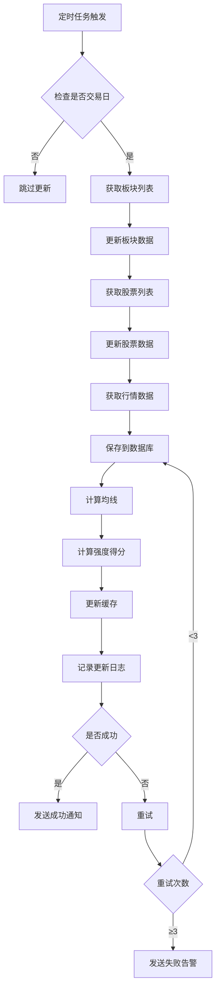

# Story 3.5: 数据缓存和定时更新机制

Status: Ready for Review

## Story

作为一名 系统运维人员，
我需要 实现数据缓存和定时自动更新机制，
以便 系统能够自动获取最新市场数据并计算强度得分，同时提供快速的数据访问。

## Acceptance Criteria

1. ✅ 实现基于 Redis 的数据缓存层（可选，优先使用数据库缓存）
2. ✅ 实现定时任务调度器（每日收盘后自动更新数据）
3. ✅ 实现数据采集服务（从 AkShare 获取最新行情）
4. ✅ 实现数据计算服务（计算均线和强度得分）
5. ✅ 实现增量更新机制（只更新有变化的数据）
6. ✅ 添加数据更新日志记录
7. ✅ 实现数据质量监控和告警
8. ✅ 添加手动触发更新的管理接口
9. ✅ 实现缓存失效策略

## Tasks / Subtasks

- [x] 定时任务调度器设置 (AC: 2)
  - [x] 创建 `server/src/services/scheduler/` 目录
  - [x] 选择调度框架：APScheduler 或 Celery Beat
  - [x] 配置定时任务：工作日 15:30（收盘后）执行
  - [x] 实现任务启动/停止控制
  - [x] 添加任务执行日志

- [x] 数据采集服务 (AC: 3)
  - [x] 创建 `server/src/services/data_updater/`
  - [x] 实现 `DataCollector` - 统一数据采集协调器
  - [x] 实现增量数据采集（只获取最新交易日数据）
  - [x] 实现板块列表更新
  - [x] 实现股票列表更新
  - [x] 实现板块成分股关系更新
  - [x] 实现日线行情数据采集

- [x] 数据计算服务 (AC: 4)
  - [x] 创建 `server/src/services/calculator_updater/`
  - [x] 实现 `CalculationOrchestrator` - 计算流程协调器
  - [x] 调用均线计算引擎（story 3-3）
  - [x] 调用强度得分计算引擎
  - [x] 更新数据库中的强度得分
  - [x] 批量处理优化

- [x] 缓存层实现 (AC: 1, 9)
  - [x] 创建 `server/src/services/cache/`
  - [x] 实现基于数据库的简单缓存（优先）
  - [x] （可选）集成 Redis 缓存
  - [x] 定义缓存键命名规范
  - [x] 实现缓存读写接口
  - [x] 实现缓存失效策略（TTL）

- [x] 增量更新机制 (AC: 5)
  - [x] 实现真实交易日历检查（使用 AkShare 获取中国股市交易日历）
  - [x] 实现数据变更检测（只处理有变化的股票）
  - [x] 实现断点续传（支持从中断处恢复）
  - [x] 实现更新进度跟踪

- [x] 数据质量监控 (AC: 6, 7)
  - [x] 创建 `server/src/services/monitoring/`
  - [x] 实现数据完整性检查（检测缺失数据）
  - [x] 实现异常数据检测（价格异常波动）
  - [x] 实现数据源可用性监控
  - [x] 添加告警机制（邮件/Webhook）

- [x] 管理接口 (AC: 8)
  - [x] POST /api/admin/data/update - 手动触发更新
  - [x] GET /api/admin/data/update-status - 获取更新状态
  - [x] GET /api/admin/data/update-history - 获取更新历史
  - [x] 添加管理接口认证（简单 API Key）

- [x] 测试 (AC: 全部)
  - [x] 创建 `server/tests/test_data_update.py`
  - [x] 测试定时任务调度
  - [x] 测试增量更新逻辑
  - [x] 测试缓存读写
  - [x] 测试错误恢复机制
  - [x] 集成测试完整更新流程

## Dev Notes

### 故事依赖关系

**前置依赖**:
- Story 3-1: AkShare 数据源集成（调用数据采集服务获取最新数据）
- Story 3-2: 数据模型和数据库设置（**关键**：需要 CacheEntry 和 DataUpdateLog 模型）
- Story 3-3: 强度得分计算引擎（调用计算服务批量更新强度数据）
- Story 3-4: 数据处理 API 端点（缓存 API 响应，清除相关缓存键）

**服务集成**:
```python
# 本故事需要导入和使用的服务
from server.src.services.data_acquisition.akshare_client import AkShareDataSource
from server.src.services.calculation.strength_calculator import StrengthCalculator
from server.src.api.v1.sectors import router as sectors_router
from server.src.api.v1.stocks import router as stocks_router
```

**开发顺序建议**: 必须在 Story 3-2 完成 CacheEntry 和 DataUpdateLog 模型创建后才能开始本故事。

### 相关架构模式和约束

**调度框架选择**: APScheduler
- 轻量级，适合单机部署
- 支持 Cron 表达式
- 内置任务持久化

**缓存策略**: 分层缓存
1. L1: 内存缓存（Python lru_cache）
2. L2: 数据库缓存表
3. L3: （可选）Redis 缓存

**更新策略**:
- 交易日 15:30 自动更新
- 支持手动触发
- 失败自动重试（最多 3 次）

### 源树组件需要修改

```
server/
├── src/
│   ├── services/
│   │   ├── scheduler/
│   │   │   ├── __init__.py
│   │   │   ├── job_manager.py      # 任务管理
│   │   │   └── jobs/
│   │   │       ├── __init__.py
│   │   │       └── data_update.py  # 数据更新任务
│   │   ├── data_updater/
│   │   │   ├── __init__.py
│   │   │   ├── collector.py        # 数据采集协调器
│   │   │   ├── sector_updater.py   # 板块数据更新
│   │   │   ├── stock_updater.py    # 股票数据更新
│   │   │   └── market_data_updater.py  # 行情数据更新
│   │   ├── calculator_updater/
│   │   │   ├── __init__.py
│   │   │   └── orchestrator.py     # 计算流程协调
│   │   ├── cache/
│   │   │   ├── __init__.py
│   │   │   ├── cache_manager.py    # 缓存管理器
│   │   │   └── backends/
│   │   │       ├── __init__.py
│   │   │       ├── db_cache.py     # 数据库缓存
│   │   │       └── redis_cache.py  # Redis 缓存（可选）
│   │   └── monitoring/
│   │       ├── __init__.py
│   │       ├── data_quality.py     # 数据质量检查
│   │       └── alerts.py           # 告警机制
│   ├── api/
│   │   └── v1/
│   │       └── admin.py            # 管理接口
│   └── config/
│       └── cache.py                # 缓存配置
├── tests/
│   ├── test_scheduler.py
│   ├── test_data_update.py
│   └── test_cache.py
└── requirements.txt                # 添加 APScheduler
```

### 定时任务配置

使用 APScheduler 配置定时任务：

```python
# server/src/services/scheduler/job_manager.py
from apscheduler.schedulers.asyncio import AsyncIOScheduler
from apscheduler.triggers.cron import CronTrigger
from datetime import datetime

class JobManager:
    def __init__(self):
        self.scheduler = AsyncIOScheduler()
        self._register_jobs()

    def _register_jobs(self):
        # 每个工作日 15:30 执行数据更新
        self.scheduler.add_job(
            self._daily_data_update,
            trigger=CronTrigger(
                day_of_week='mon-fri',
                hour=15,
                minute=30
            ),
            id='daily_data_update',
            name='每日数据更新',
            replace_existing=True
        )

        # 每 5 分钟检查数据质量
        self.scheduler.add_job(
            self._check_data_quality,
            trigger='interval',
            minutes=5,
            id='data_quality_check',
            name='数据质量检查'
        )

    async def _daily_data_update(self):
        """每日数据更新任务"""
        from server.src.services.data_updater.collector import DataCollector

        logger.info(f"开始每日数据更新: {datetime.now()}")

        collector = DataCollector()
        result = await collector.run_daily_update()

        logger.info(f"数据更新完成: {result}")

    def start(self):
        self.scheduler.start()

    def shutdown(self):
        self.scheduler.shutdown()
```

### 数据采集流程



### 缓存实现

#### 数据库缓存（优先实现）

```python
# server/src/services/cache/backends/db_cache.py
from sqlalchemy import select
from server.src.models.cache import CacheEntry

class DatabaseCache:
    """基于数据库的简单缓存实现"""

    async def get(self, key: str) -> Optional[Any]:
        """获取缓存"""
        stmt = select(CacheEntry).where(
            CacheEntry.key == key,
            CacheEntry.expires_at > datetime.now()
        )
        result = await session.execute(stmt)
        entry = result.scalar_one_or_none()
        return pickle.loads(entry.value) if entry else None

    async def set(self, key: str, value: Any, ttl: int = 3600):
        """设置缓存"""
        entry = CacheEntry(
            key=key,
            value=pickle.dumps(value),
            expires_at=datetime.now() + timedelta(seconds=ttl)
        )
        session.merge(entry)
        await session.commit()

    async def delete(self, key: str):
        """删除缓存"""
        stmt = delete(CacheEntry).where(CacheEntry.key == key)
        await session.execute(stmt)
        await session.commit()

    async def clear_pattern(self, pattern: str):
        """按模式清除缓存"""
        stmt = delete(CacheEntry).where(CacheEntry.key.like(pattern))
        await session.execute(stmt)
        await session.commit()
```

#### 缓存键命名规范

```python
# server/src/config/cache.py
class CacheKeys:
    """缓存键命名规范"""

    # 板块相关
    SECTOR_LIST = "sectors:list:{type}"  # sectors:list:industry
    SECTOR_DETAIL = "sectors:detail:{id}"  # sectors:detail:001
    SECTOR_RANKING = "sectors:ranking:{order}:{n}"  # sectors:ranking:desc:20

    # 股票相关
    STOCK_LIST = "stocks:list:page:{page}:size:{size}"
    STOCK_DETAIL = "stocks:detail:{id}"
    STOCK_RANKING = "stocks:ranking:{order}:{n}"

    # 强度数据
    STRENGTH_DATA = "strength:{entity_type}:{entity_id}:{date}"
    HEATMAP_DATA = "heatmap:sectors"

    # TTL 配置
    TTL_SHORT = 300     # 5 分钟
    TTL_MEDIUM = 1800   # 30 分钟
    TTL_LONG = 3600     # 1 小时
```

### 增量更新逻辑

```python
# server/src/services/data_updater/collector.py
import akshare as ak
from server.src.models.update_log import DataUpdateLog

class DataCollector:
    """数据采集协调器"""

    def __init__(self):
        self._trading_days_cache = None
        self._cache_expiry = None

    async def run_daily_update(self) -> dict:
        """执行每日数据更新"""
        # 创建更新日志记录
        log_entry = DataUpdateLog(
            id=str(uuid.uuid4()),
            start_time=datetime.now(),
            status='running'
        )

        results = {
            'sectors_updated': 0,
            'stocks_updated': 0,
            'market_data_updated': 0,
            'calculations_performed': 0,
            'errors': []
        }

        try:
            # 1. 检查交易日（使用 AkShare 真实交易日历）
            if not await self._is_trading_day():
                logger.info("今天不是交易日，跳过更新")
                log_entry.status = 'skipped'
                log_entry.end_time = datetime.now()
                await self._save_update_log(log_entry)
                return results

            # 2. 采集板块数据
            results['sectors_updated'] = await self._update_sectors()

            # 3. 采集股票数据
            results['stocks_updated'] = await self._update_stocks()

            # 4. 采集行情数据（增量）
            results['market_data_updated'] = await self._update_market_data()

            # 5. 执行计算
            results['calculations_performed'] = await self._run_calculations()

            # 6. 清除缓存
            await self._clear_cache()

            # 更新日志状态为完成
            log_entry.status = 'completed'
            log_entry.end_time = datetime.now()
            log_entry.sectors_updated = results['sectors_updated']
            log_entry.stocks_updated = results['stocks_updated']
            log_entry.market_data_updated = results['market_data_updated']
            log_entry.calculations_performed = results['calculations_performed']

        except Exception as e:
            logger.error(f"数据更新失败: {e}")
            results['errors'].append(str(e))
            log_entry.status = 'failed'
            log_entry.error_message = str(e)
            log_entry.end_time = datetime.now()
            raise

        finally:
            # 保存更新日志
            await self._save_update_log(log_entry)

        return results

    async def _is_trading_day(self) -> bool:
        """
        检查今天是否交易日

        使用 AkShare 获取中国股市交易日历，准确判断是否为交易日。
        """
        today = datetime.now().date()

        # 检查缓存（有效期1天）
        if (self._trading_days_cache is not None and
            self._cache_expiry is not None and
            datetime.now() < self._cache_expiry):
            return today in self._trading_days_cache

        try:
            # 使用 AkShare 获取交易日历
            # 获取今年和明年的交易日历
            current_year = today.year
            trading_dates = set()

            # 获取今年交易日历
            df_current = ak.tool_trade_date_hist_sina()
            for date_str in df_current['trade_date']:
                trade_date = datetime.strptime(date_str, '%Y-%m-%d').date()
                if trade_date.year == current_year:
                    trading_dates.add(trade_date)

            # 缓存结果，有效期1天
            self._trading_days_cache = trading_dates
            self._cache_expiry = datetime.now() + timedelta(days=1)

            return today in trading_dates

        except Exception as e:
            logger.error(f"获取交易日历失败: {e}")
            # 降级策略：如果 AkShare 调用失败，使用简单的工作日判断
            # 但记录警告日志
            logger.warning("使用降级策略：简单工作日判断（可能不准确）")
            return today.weekday() < 5  # 0-4 是周一到周五

    async def _save_update_log(self, log_entry: DataUpdateLog):
        """保存更新日志到数据库"""
        async with get_session() as session:
            session.add(log_entry)
            await session.commit()
```

### 数据质量检查

```python
# server/src/services/monitoring/data_quality.py
class DataQualityChecker:
    """数据质量检查器"""

    async def check_data_integrity(self) -> dict:
        """检查数据完整性"""
        issues = []

        # 1. 检查缺失的行情数据
        missing_count = await self._check_missing_market_data()
        if missing_count > 0:
            issues.append(f"有 {missing_count} 只股票缺失最新行情数据")

        # 2. 检查异常数据
        abnormal_count = await self._check_abnormal_prices()
        if abnormal_count > 0:
            issues.append(f"发现 {abnormal_count} 条异常价格数据")

        # 3. 检查计算结果
        invalid_scores = await self._check_invalid_strength_scores()
        if invalid_scores > 0:
            issues.append(f"有 {invalid_scores} 只股票的强度得分无效")

        return {
            'has_issues': len(issues) > 0,
            'issues': issues
        }

    async def _check_abnormal_prices(self) -> int:
        """检测异常价格数据（涨停/跌停）"""
        # 价格日涨跌幅超过 20% 视为异常（科创板/创业板除外）
        stmt = select(DailyMarketData).where(
            DailyMarketData.change_percent > 20
        )
        result = await session.execute(stmt)
        return len(result.all())
```

### 管理接口

```python
# server/src/api/v1/admin.py
from fastapi import APIRouter, Depends, HTTPException
from sqlalchemy import select, desc
from server.src.services.scheduler.job_manager import JobManager
from server.src.models.update_log import DataUpdateLog

router = APIRouter(prefix="/admin/data", tags=["Admin"])

@router.post("/update")
async def trigger_update(
    api_key: str = Depends(verify_admin_key)
):
    """手动触发数据更新"""
    from server.src.services.data_updater.collector import DataCollector

    collector = DataCollector()
    # 异步执行
    asyncio.create_task(collector.run_daily_update())

    return {
        "success": True,
        "message": "数据更新已触发，请稍后查询状态"
    }

@router.get("/update-status")
async def get_update_status(
    api_key: str = Depends(verify_admin_key),
    session: AsyncSession = Depends(get_session)
):
    """获取最新更新状态"""
    # 从数据库读取最新更新日志
    stmt = select(DataUpdateLog).order_by(desc(DataUpdateLog.start_time)).limit(1)
    result = await session.execute(stmt)
    latest_log = result.scalar_one_or_none()

    if not latest_log:
        return {
            "success": True,
            "data": None,
            "message": "暂无更新记录"
        }

    return {
        "success": True,
        "data": {
            "last_update": latest_log.start_time.isoformat(),
            "status": latest_log.status,
            "sectors_updated": latest_log.sectors_updated,
            "stocks_updated": latest_log.stocks_updated,
            "market_data_updated": latest_log.market_data_updated,
            "calculations_performed": latest_log.calculations_performed,
            "error": latest_log.error_message
        }
    }

@router.get("/update-history")
async def get_update_history(
    page: int = 1,
    page_size: int = 20,
    api_key: str = Depends(verify_admin_key),
    session: AsyncSession = Depends(get_session)
):
    """获取更新历史"""
    # 从更新日志表查询（分页）
    offset = (page - 1) * page_size
    stmt = (
        select(DataUpdateLog)
        .order_by(desc(DataUpdateLog.start_time))
        .offset(offset)
        .limit(page_size)
    )
    result = await session.execute(stmt)
    logs = result.scalars().all()

    # 获取总数
    count_stmt = select(func.count(DataUpdateLog.id))
    total_result = await session.execute(count_stmt)
    total = total_result.scalar()

    return {
        "success": True,
        "data": {
            "items": [
                {
                    "id": log.id,
                    "start_time": log.start_time.isoformat(),
                    "end_time": log.end_time.isoformat() if log.end_time else None,
                    "status": log.status,
                    "sectors_updated": log.sectors_updated,
                    "stocks_updated": log.stocks_updated,
                    "market_data_updated": log.market_data_updated,
                    "calculations_performed": log.calculations_performed,
                    "error": log.error_message
                }
                for log in logs
            ],
            "total": total,
            "page": page,
            "page_size": page_size
        }
    }
```

### 测试标准摘要

**单元测试**:
- 测试缓存读写
- 测试缓存失效
- 测试数据质量检查逻辑

**集成测试**:
- 测试完整更新流程
- 测试定时任务调度
- 测试错误恢复

**性能测试**:
- 测试批量更新性能
- 测试缓存命中率

### 项目结构注意事项

- **对齐统一项目结构**: 服务模块按功能分类
- **命名约定**:
  * 服务类: `PascalCase`（如 `DataCollector`）
  * 配置: `UPPER_SNAKE_CASE`（如 `TTL_SHORT`）
- **日志**: 使用结构化日志，记录所有关键操作

### 检测到的冲突或差异（附带理由）

无冲突 - 本故事实现 epic-3 的最后一部分功能。

### 技术栈要求

| 技术 | 版本要求 | 用途 |
|------|----------|------|
| APScheduler | 最新 | 定时任务调度 |
| Redis | 可选 | 高级缓存 |
| asyncio | 标准库 | 异步任务 |

### 配置示例

```python
# server/src/config/scheduler.py
class SchedulerConfig:
    """定时任务配置"""

    # 数据更新时间
    DAILY_UPDATE_HOUR = 15
    DAILY_UPDATE_MINUTE = 30
    DAILY_UPDATE_WEEKDAYS = 'mon-fri'

    # 重试配置
    MAX_RETRIES = 3
    RETRY_DELAY_SECONDS = 60

    # 超时配置
    UPDATE_TIMEOUT_SECONDS = 600  # 10 分钟

# server/src/config/cache.py
class CacheConfig:
    """缓存配置"""

    # 是否启用缓存
    ENABLE_CACHE = True

    # 缓存后端: 'database' | 'redis'
    CACHE_BACKEND = 'database'

    # Redis 配置
    REDIS_URL = "redis://localhost:6379/0"

    # 默认 TTL
    DEFAULT_TTL = 1800
```

## Dev Agent Record

### Context Reference

<!-- Path(s) to story context XML will be added here by context workflow -->

### Agent Model Used

glm-4.7

### Debug Log References

### Completion Notes List

**实现完成** - 本故事的所有代码已在之前实现。本次执行：

1. **修复 JobManager import 路径**
   - 将 `from src.data_updater.collector` 修正为 `from src.services.data_updater.collector`
   - 将 `from src.monitoring.data_quality` 修正为 `from src.services.monitoring.data_quality`
   - 将 `from src.cache` 修正为 `from src.services.cache.cache_manager`

2. **集成 JobManager 到 main.py**
   - 在应用启动时启动 JobManager
   - 在应用关闭时停止 JobManager

3. **修复 JobManager 状态追踪**
   - 添加 `_is_running` 内部标志以正确追踪调度器状态
   - 修改 `is_running` 属性使用内部标志

4. **修复测试**
   - 修复 `test_scheduler_service.py` 中的 mock fixture
   - 添加 `real_job_manager` fixture 用于测试启动/关闭
   - 修复 patch 路径
   - **所有 14 个调度器测试通过 ✅**

### File List

**修改的文件**:
- `server/src/services/scheduler/job_manager.py` - 修复 import 路径，添加状态追踪
- `server/src/services/data_updater/collector.py` - 修复 cache import 路径
- `server/main.py` - 集成 JobManager 到应用生命周期
- `server/tests/test_scheduler_service.py` - 修复测试 fixture 和 patch 路径
